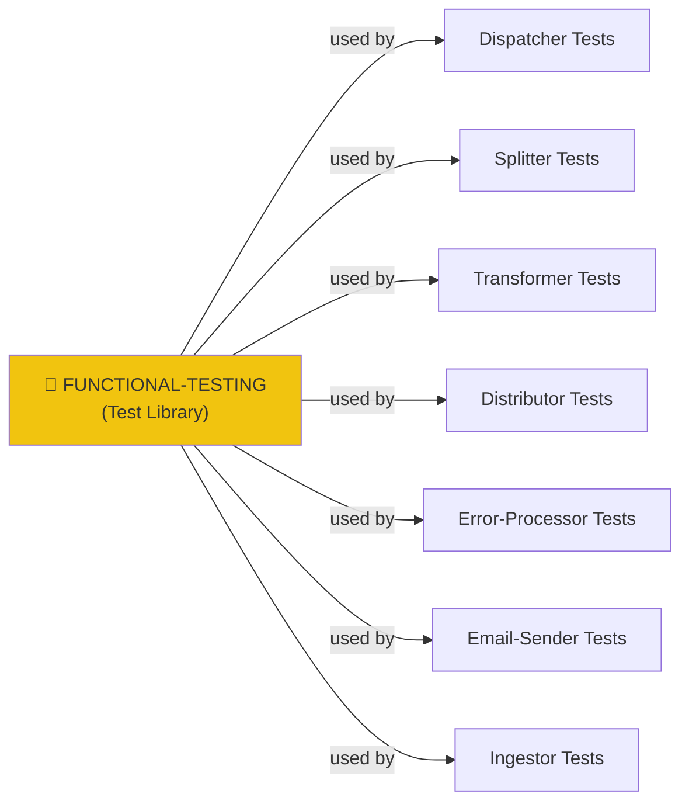
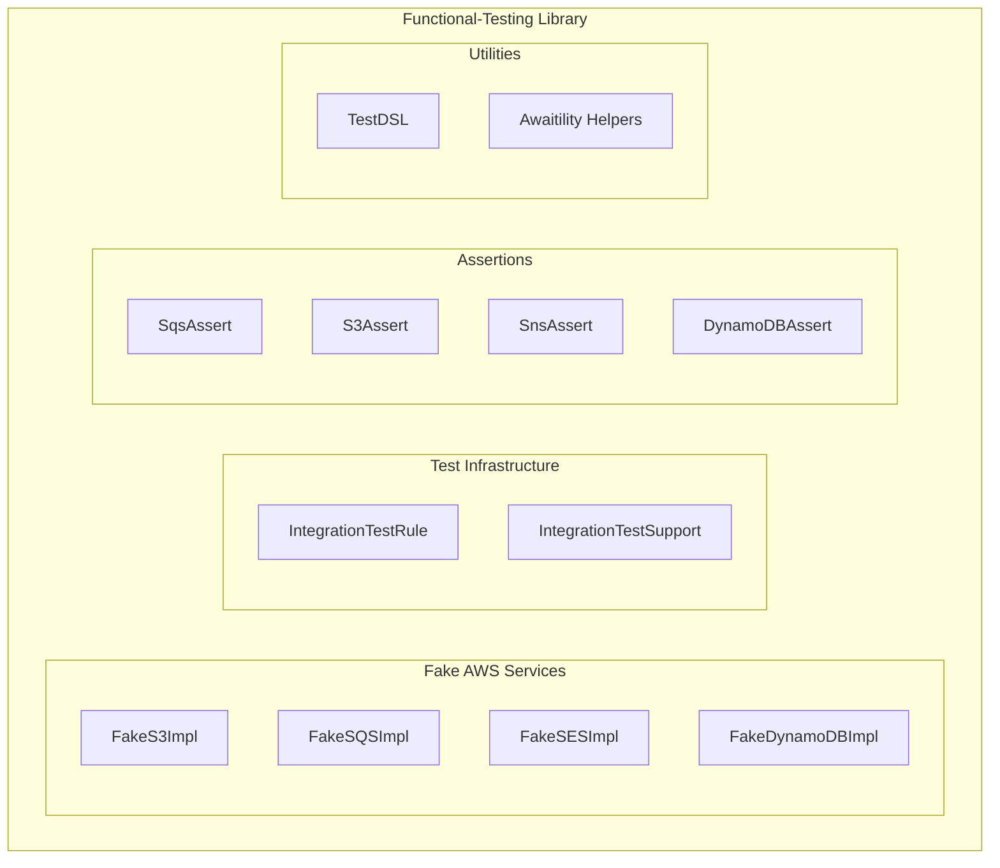
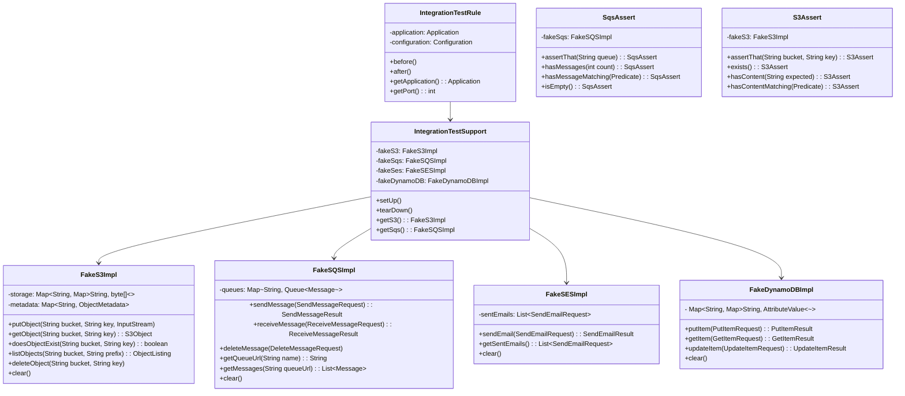
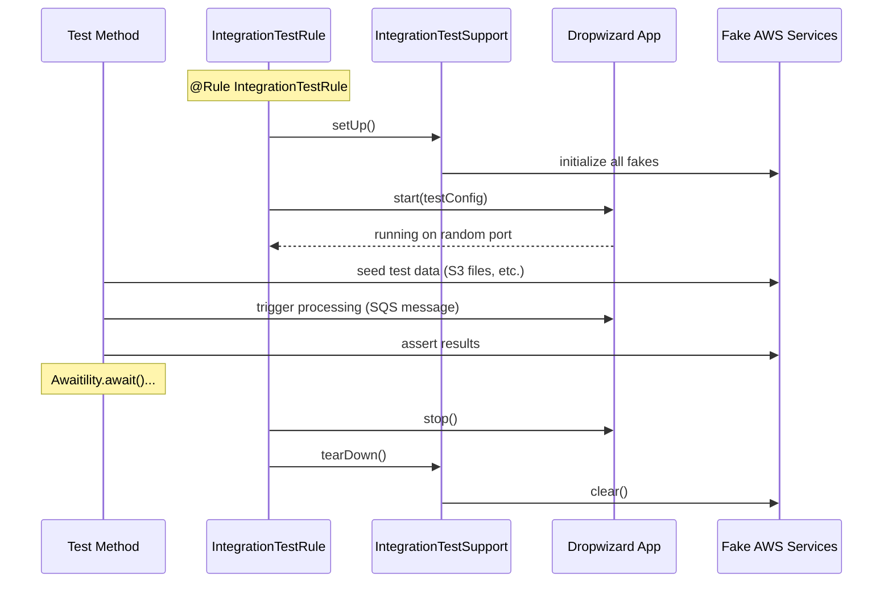
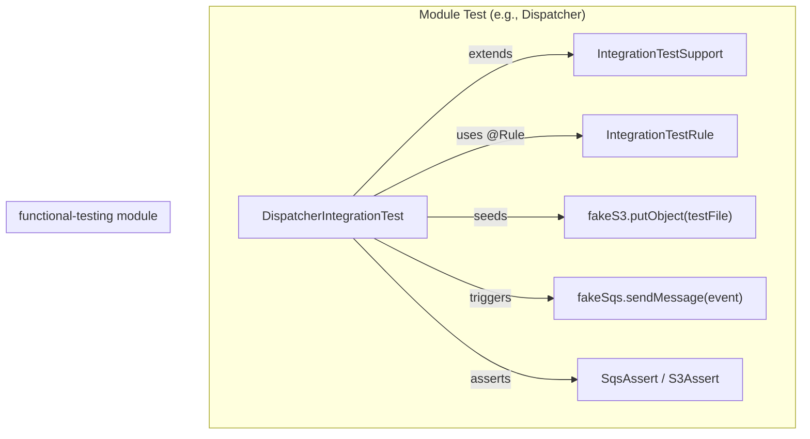

# Functional-Testing Module — Design Document

> **Module:** `functional-testing`  
> **Generated:** 2026-05-24  
> **Artifact:** `com.inttra.mercury:functional-testing:1.0-SNAPSHOT`  
> **Java Version:** 17 | **Test Framework:** JUnit 4 + Awaitility + AssertJ

---

## 1. Executive Summary

The **Functional-Testing** module is a reusable integration test infrastructure library. It provides in-memory fake implementations of AWS services (S3, SQS, SES, DynamoDB), Dropwizard test lifecycle management, fluent assertion DSLs, and test utilities. All AppianWay modules depend on this for their integration tests, enabling fast local testing without real AWS infrastructure.

---

## 2. Role in the Platform



---

## 3. Architecture



---

## 4. Class Diagram



---

## 5. Fake AWS Service Details

### FakeS3Impl

| Operation | Implementation | Notes |
|-----------|---------------|-------|
| `putObject` | HashMap storage | Stores bytes + metadata |
| `getObject` | HashMap lookup | Returns S3Object wrapper |
| `doesObjectExist` | Key check | O(1) lookup |
| `listObjects` | Prefix filter | Iterates all keys |
| `copyObject` | Internal copy | Same map |
| `deleteObject` | Remove key | Immediate |

### FakeSQSImpl

| Operation | Implementation | Notes |
|-----------|---------------|-------|
| `sendMessage` | Queue add | ConcurrentLinkedQueue |
| `receiveMessage` | Queue poll(N) | Respects maxNumberOfMessages |
| `deleteMessage` | Remove by receipt handle | No visibility timeout simulation |
| `getQueueUrl` | Map lookup | Returns same URL string |

### FakeSESImpl

| Operation | Implementation | Notes |
|-----------|---------------|-------|
| `sendEmail` | List accumulation | Stores entire request |
| `getSentEmails` | Return list | For assertion |

### FakeDynamoDBImpl

| Operation | Implementation | Notes |
|-----------|---------------|-------|
| `putItem` | Nested map storage | Table → PK → attributes |
| `getItem` | Map lookup | By key |
| `updateItem` | ADD/SET expressions | Supports atomic increment |

---

## 6. Integration Test Lifecycle



---

## 7. Assertion DSL Examples

### SQS Assertions
```java
SqsAssert.assertThat(fakeSqs, "distributor-queue")
    .hasMessages(3)
    .hasMessageMatching(m -> m.contains("rootWorkflowId"));
```

### S3 Assertions
```java
S3Assert.assertThat(fakeS3, "workspace-bucket", "path/to/file.xml")
    .exists()
    .hasContentMatching(c -> c.contains("<BookingRequest>"));
```

### DynamoDB Assertions
```java
DynamoDBAssert.assertThat(fakeDynamoDB, "control-numbers")
    .hasItem("sequence-key")
    .withAttribute("value", "000000005");
```

---

## 8. TestDSL Utilities

| Utility | Purpose |
|---------|---------|
| `TestDSL.metaData()` | Builds MetaData with defaults |
| `TestDSL.sqsMessage(body)` | Creates SQS Message wrapper |
| `TestDSL.s3Event(bucket, key)` | Creates S3 event notification |
| `TestDSL.loadResource(path)` | Reads classpath resource |
| `TestDSL.randomWorkflowId()` | UUID generator |
| `TestDSL.withProjections(...)` | Adds projections to MetaData |

---

## 9. Configuration Details

Test configuration overrides:

| Property | Test Value | Description |
|----------|-----------|-------------|
| `sqsPickupConfig.queueUrl` | `test-pickup` | Fake queue name |
| `sqsDropOffConfig.queueUrl` | `test-dropoff` | Fake queue name |
| `s3WorkspaceConfig.bucket` | `test-bucket` | Fake bucket name |
| `server.applicationConnectors[0].port` | `0` | Random port |
| `logging.level` | `WARN` | Reduce test noise |

---

## 10. Key Maven Dependencies

| Dependency | Version | Purpose |
|-----------|---------|---------|
| `junit` | 4.13.2 | Test framework |
| `assertj-core` | 3.19.0 | Fluent assertions |
| `awaitility` | 4.x | Async test waiting |
| `mockito-core` | 2.27.0 | Mocking |
| `dropwizard-testing` | 4.0.16 | App test support |
| `mercury-shared` | 1.0 | Shared abstractions |

---

## 11. Design Patterns

| Pattern | Usage |
|---------|-------|
| **Fake Object** | All AWS service implementations |
| **Builder** | TestDSL fluent API |
| **Rule** | JUnit @Rule lifecycle management |
| **Assert Object** | SqsAssert, S3Assert (fluent assertions) |
| **Template** | IntegrationTestSupport base setup |
| **Fixture** | Reusable test data builders |

---

## 12. Usage Pattern (How Modules Use This)



Every integration test:
1. Extends `IntegrationTestSupport` (gets fakes)
2. Declares `IntegrationTestRule` (manages app lifecycle)
3. Seeds input data into fakes
4. Triggers processing (send SQS message)
5. Awaits + asserts output in fakes
