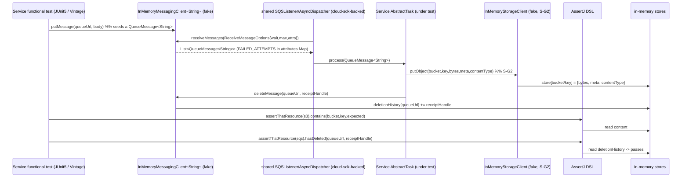
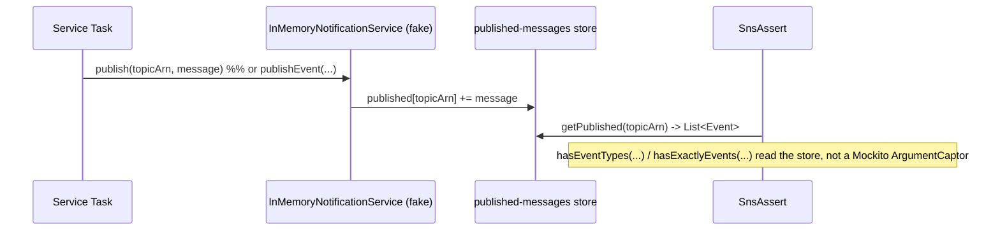

# `functional-testing` — AWS SDK v2 (cloud-sdk) Upgrade DESIGN (claude)

> Module: `com.inttra.mercury.test:functional-testing:1.0` (shared functional-test SDK; **test scope in every appianway service**) · Date: 2026-05-31 · Author: Claude (Opus 4.8)
> **Chosen option: B + F1** — re-point all in-memory fakes to implement the `cloud-sdk-api` interfaces (`1.0.26-SNAPSHOT`), DW5 harness, JUnit 5 new fixtures (Vintage during transition). **No cloud-sdk library change — this module consumes `cloud-sdk-api` and builds its own fakes.**
> Companion: [plan](2026-05-31-functional-testing-aws2x-upgrade-plan-claude.md). Master: [`shared` DESIGN](../../shared/docs/2026-05-31-shared-aws2x-upgrade-DESIGN-claude.md) §5/§6.
> **Lockstep enabler:** reworked immediately after `shared`, **before all downstream service rollouts** — the compile gate for every service functional test.

---

## 1. Overview & chosen option
Replace the giant AWS-v1-interface fakes (`Amazon{S3,SQS,SES,DynamoDB}Adaptor` + `Fake*Impl`) with **small in-memory implementations of the `cloud-sdk-api` interfaces** that `shared` now depends on: `InMemoryStorageClient implements StorageClient`, `InMemoryMessagingClient implements MessagingClient<String>` (producing `QueueMessage<String>`), `InMemoryNotificationService implements NotificationService`, `InMemoryEmailService implements EmailService`, and a DynamoDB path via a small `DatabaseRepository<T,ID>` fake or `dynamo-integration-test`. Keep the in-memory stores and the store-backed AssertJ DSL; change only the v1-leaking DSL surfaces (with a migration note). Move the harness (`IntegrationTestSupport`/`IntegrationTestRule`/`FunctionalTestBase`) to DW5 + the composed appianway `ServerCommand` (master §5); new fixtures in JUnit 5, existing on Vintage. **Appianway-internal → zero impact to mercury-services.**

## 2. Class diagram (new in-memory cloud-sdk-api fakes)

```mermaid
classDiagram
    class StorageClient { <<cloud-sdk-api; +S-G2 metadata overloads>> }
    class MessagingClient~T~ { <<cloud-sdk-api>> }
    class QueueMessage~T~ { <<cloud-sdk-api>> }
    class NotificationService { <<cloud-sdk-api>> }
    class EmailService { <<cloud-sdk-api; SES v2>> }
    class DatabaseRepository~T,ID~ { <<cloud-sdk-api>> }

    class InMemoryStorageClient { <<fake; Map~bucket,Map~key,bytes+meta~~>> }
    class InMemoryMessagingClient { <<fake; BlockingQueue~QueueMessage~String~~ per url + sent/deletion history>> }
    class InMemoryNotificationService { <<fake; List published messages per topic>> }
    class InMemoryEmailService { <<fake; Map~recipient,List~MailContent~~>> }
    class InMemoryDatabaseRepository { <<fake; or dynamo-integration-test DynamoDB-Local>> }

    StorageClient <|.. InMemoryStorageClient
    MessagingClient <|.. InMemoryMessagingClient
    InMemoryMessagingClient --> QueueMessage
    NotificationService <|.. InMemoryNotificationService
    EmailService <|.. InMemoryEmailService
    DatabaseRepository <|.. InMemoryDatabaseRepository

    class S3Assert { <<store-backed; preserved>> }
    class SqsAssert { <<store-backed via getMessages(url,Class); preserved>> }
    class SnsAssert { <<re-pointed: ArgumentCaptor -> InMemoryNotificationService store>> }
    class DynamoDBAssert { <<store-backed; preserved>> }
    class FunctionalTestBase { <<binds in-memory cloud-sdk-api fakes via Guice>> }

    FunctionalTestBase --> InMemoryStorageClient
    FunctionalTestBase --> InMemoryMessagingClient
    FunctionalTestBase --> InMemoryNotificationService
    FunctionalTestBase --> InMemoryEmailService
    S3Assert --> InMemoryStorageClient
    SqsAssert --> InMemoryMessagingClient
    SnsAssert --> InMemoryNotificationService
    DynamoDBAssert --> InMemoryDatabaseRepository
```


**Removed v1 types:** `Amazon{S3,SQS,SES,DynamoDB,SNS}` client interfaces and all `com.amazonaws.services.*.model.*` from the fakes/DSL; the Mockito `AmazonSNS` mock + `ArgumentCaptor<PublishRequest>`.
**Consumed cloud-sdk-api:** `StorageClient` (incl. **S-G2** overloads), `MessagingClient<String>`, `QueueMessage<String>`, `NotificationService`, `EmailService`, `DatabaseRepository<T,ID>`.

## 3. Component diagram
```mermaid
flowchart LR
    subgraph svc[Any appianway service functional test]
      ST[Service Task under test]
      DSL[AssertJ DSL: assertThatResource(...)]
    end
    subgraph ft[functional-testing - reworked]
      FB[FunctionalTestBase - Guice binds fakes]
      ISC[InMemoryStorageClient]
      IMC[InMemoryMessagingClient String]
      INS[InMemoryNotificationService]
      IES[InMemoryEmailService]
      IDR[InMemoryDatabaseRepository / dynamo-integration-test]
      STORE[(in-memory stores)]
      ITR[IntegrationTestRule/Support - DW5 + appianway ServerCommand]
    end
    SH[shared wrappers - cloud-sdk-backed]
    ST --> SH
    FB -.injects cloud-sdk-api fakes.-> SH
    SH --> ISC & IMC & INS & IES & IDR
    ISC & IMC & INS & IES & IDR --> STORE
    DSL --> STORE
    ITR -.launches app under test.-> ST
```

## 4. Sequence diagrams

### 4.1 Service test: MessagingClient → QueueMessage → Task → StorageClient assertion


### 4.2 SNS assertion re-point (Mockito captor → InMemoryNotificationService)


## 5. Configuration changes
Test-wiring only; no runtime config. `FunctionalTestBase` binds the in-memory `cloud-sdk-api` fakes (replacing the v1 `Amazon*` bindings at [FunctionalTestBase.java:66-69](../src/main/java/com/inttra/mercury/test/FunctionalTestBase.java) and the SNS Mockito mock at lines 38,86-90). `IntegrationTestSupport` moves to DW5 and constructs the **composed appianway `ServerCommand`** instead of `shared`'s DW4 `ConfigProcessingServerCommand` ([IntegrationTestSupport.java:59](../src/main/java/com/inttra/mercury/test/IntegrationTestSupport.java)). The `network-services.properties`/`datadog.properties` + `${PROFILE}`/`${ENV}` model (master [§5](../../shared/docs/2026-05-31-shared-aws2x-upgrade-DESIGN-claude.md)) is preserved.

## 6. cloud-sdk gaps — the in-memory fake redesign against cloud-sdk-api
**No cloud-sdk library gap.** This module consumes `cloud-sdk-api` and builds its own fakes. Redesign detail:

- **`InMemoryStorageClient implements StorageClient`** — back with `Map<bucket, Map<key, StoredObject{bytes, Map<String,String> metadata, String contentType, eTag, size, lastModified}>>` (port [`FakeS3Impl`](../src/main/java/com/inttra/mercury/test/aws/impl/FakeS3Impl.java) store). Implement `putObject(bytes/InputStream+len/File/String)`, `getObject→StorageObject`, `getContent(bucket,key[,charset])`, `copyObject`, `objectExists`, `listObjects`, `generatePresignedUrl`. **Must implement the S-G2 overloads** — `putObject(bucket,key,bytes,Map metadata,contentType)`, the `InputStream`+length variant, and `copyObject(...,replacedMetadata,contentType)` — storing metadata/content-type so downstream tests asserting `putObjectWithMetaData`/`copyObjectWithMetaDate` round-trip (master [§6.1](../../shared/docs/2026-05-31-shared-aws2x-upgrade-DESIGN-claude.md)). `getMetaData` returns the stored `Map<String,String>` (replaces the hardcoded `getObjectMetadata` stub at [FakeS3Impl.java:136-140](../src/main/java/com/inttra/mercury/test/aws/impl/FakeS3Impl.java)).
- **`InMemoryMessagingClient implements MessagingClient<String>`** — port [`FakeSQSImpl`](../src/main/java/com/inttra/mercury/test/aws/impl/FakeSQSImpl.java): `BlockingQueue<QueueMessage<String>>` per URL, sent + deletion history, `SQS_HOST` URL normalization. Implement `sendMessage(url,body[,Map attrs])` (carry `FAILED_ATTEMPTS` in the attributes `Map<String,String>`), `deleteMessage(url,receipt)`, `receiveMessages(ReceiveMessageOptions)`, `listMessages`, `getQueueAttributes`. Build `QueueMessage<String>` test doubles exposing `getPayload`/`getReceiptHandle`/`getMessageId`/`getAttributes`/`getSentTimestamp`.
- **`InMemoryNotificationService implements NotificationService`** — **new fake replacing the Mockito captor**: `Map<topicArn, List<String messages>>`; implement `publish(topicArn,message)` + `publishEvent`. `SnsAssert` re-points to this store (parses `List<Event>` from the stored message, preserving `hasEventTypes`/`hasExactlyEvents` semantics from [`SnsAssert`](../src/main/java/com/inttra/mercury/test/assertions/SnsAssert.java)).
- **`InMemoryEmailService implements EmailService`** — port [`FakeSESImpl`](../src/main/java/com/inttra/mercury/test/aws/impl/FakeSESImpl.java): `Map<recipient, List<MailContent/from/to>>`; implement `sendEmail(from,to,MailContent)`. `getEmailsSent` returns the cloud-sdk model instead of v1 `SendEmailRequest`.
- **DynamoDB** — either a small `InMemoryDatabaseRepository<T,ID> implements DatabaseRepository<T,ID>` (port the trivial `Map<table,List>` from [`FakeDynamoDBImpl`](../src/main/java/com/inttra/mercury/test/aws/impl/FakeDynamoDBImpl.java)) or adopt **`dynamo-integration-test`** (DynamoDB-Local, JUnit 5) for the watermill/transformer Dynamo paths. Recommend `dynamo-integration-test` for realism; keep the trivial fake where a test only counts puts.

The giant `Amazon*Adaptor` stub classes are **deleted** (the narrow cloud-sdk-api interfaces need no hundred-method stubs).

## 7. Maven dependency changes
- **Add:** `com.inttra.mercury:cloud-sdk-api:1.0.26-SNAPSHOT` (compile — the fakes implement these interfaces). Add `com.inttra.mercury:cloud-sdk-aws:1.0.26-SNAPSHOT` only if a fake needs an aws-side type; add `com.inttra.mercury:dynamo-integration-test:1.0.26-SNAPSHOT` (test) for the Dynamo path.
- **Drop the v1 SDK emulation surface:** the module declares **no direct `com.amazonaws`** dep today ([pom.xml](../pom.xml)) — v1 arrives transitively via `mercury-shared`; once `shared` stops exporting v1 the adaptors are deleted and no v1 remains. (If any direct/transitive v1 lingers, exclude it.)
- **DW5 alignment:** bump `dropwizard-testing` from `4.0.16` to the DW5 line; add `junit-jupiter` (new fixtures) + `junit-vintage-engine` (existing JUnit-4 lifecycle during transition); align Mockito (`2.8.9` → current) and AssertJ. Java 17 unchanged.
- Backward note: this is a **test artifact**; consumers depend on it at test scope only — appianway-internal, **no mercury-services impact**.

## 8. Test details — the fakes ARE the test infrastructure
- Add unit tests for each fake (put/get/copy/list incl. S-G2 metadata round-trip; send/receive/delete + `FAILED_ATTEMPTS`; publish; sendEmail; dynamo put/get) so the harness is trustworthy — written in **JUnit 5**.
- Preserve the store-backed AssertJ DSL: [`S3Assert`](../src/main/java/com/inttra/mercury/test/assertions/S3Assert.java) (`containsXml`/`contains`/`containsJson`/`hasFileCount`) and the [`SqsAssert`](../src/main/java/com/inttra/mercury/test/assertions/SqsAssert.java) body (`hasQueueWithMetaData`/`hasDeleted`/`hasQueueWithSize` via `getMessages(url, MetaData.class)`) are unchanged.
- Re-point [`SnsAssert`](../src/main/java/com/inttra/mercury/test/assertions/SnsAssert.java) + [`ResourceAssertions.assertThatResource(ArgumentCaptor<PublishRequest>)`](../src/main/java/com/inttra/mercury/test/assertions/ResourceAssertions.java) to the `InMemoryNotificationService` store (the one DSL entry point that changes).
- **Verify a sample downstream service test compiles against the new fakes** before migrating services: build the aggregator test scope; pick a representative service (e.g. `event-writer`) and confirm `mvn -pl event-writer -am test-compile` succeeds against the reworked harness.
- JUnit-4 lifecycle (`IntegrationTestRule`/`FunctionalTestBase` `@Rule`/`@Before`) runs via **Vintage**; new fixtures in Jupiter.

## 9. Rollout & verification
1. Land `shared` (cloud-sdk-backed; S-G2 available in `1.0.26-SNAPSHOT`).
2. **Rework `functional-testing` in lockstep** (this module) — delete v1 adaptors, add the in-memory cloud-sdk-api fakes incl. S-G2, re-point SNS DSL, move harness to DW5 + appianway `ServerCommand`. `mvn -pl functional-testing -am test`.
3. **Gate:** build the aggregator test scope; confirm a representative downstream service test-compiles against the new fakes.
4. Roll out services one at a time (`mvn -pl <svc> -am verify`), starting `event-writer`, applying the per-module migration notes.

## 10. Risks & mitigations
| Risk | Mitigation |
|---|---|
| **Downstream test-compile breakage** across all services (the central risk) | Migrate in lockstep right after `shared`, **before** services; **preserve the store-backed AssertJ DSL surface** so the bulk of assertions are unchanged; verify aggregator test-compile at the gate |
| v1 types leak into the DSL (`FakeSQS` message lists, `FakeS3` put, `FakeSES`, `FakeDynamoDB` put, `SnsAssert` captor) | Documented test-API changes + migration note (plan §9); keep store-backed accessors stable; localize changes to the v1-typed surfaces only |
| SNS assertion change (captor → store) surprises test authors | Single, well-documented DSL entry-point change; provide a before/after example in the migration note |
| S-G2 metadata not honored by the fake → downstream metadata assertions fail | `InMemoryStorageClient` stores metadata/content-type and implements the S-G2 overloads; unit-test the round-trip |
| Harness DW4→DW5 + config-command coupling (`IntegrationTestSupport`) | Move harness in lockstep with `shared`'s DW5 base + appianway `ServerCommand`; Vintage keeps JUnit-4 fixtures running |
| Dynamo fake parity for watermill/transformer | Prefer `dynamo-integration-test` (DynamoDB-Local, JUnit 5); keep the trivial put-counter fake only where sufficient |
| Hidden direct v1-client usage in a service test | Audit each service test at its rollout; route through `shared` wrappers / the new fakes |
