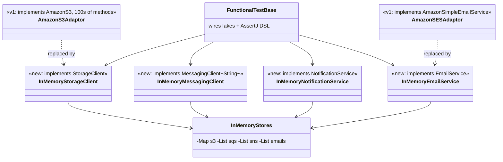
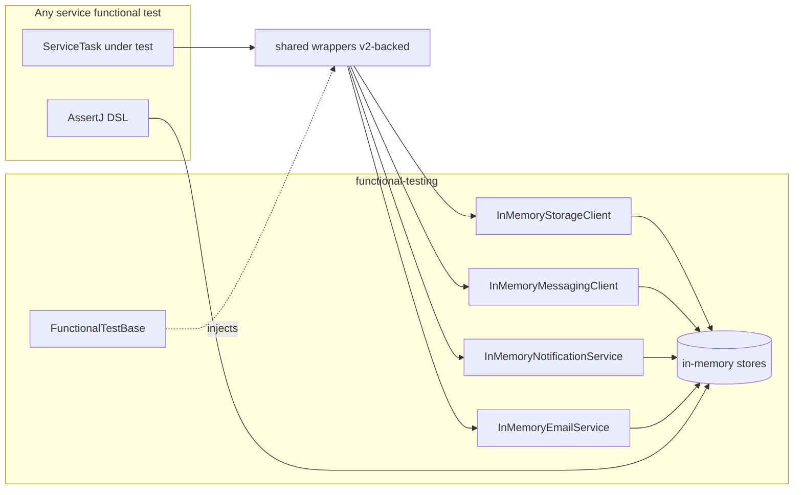
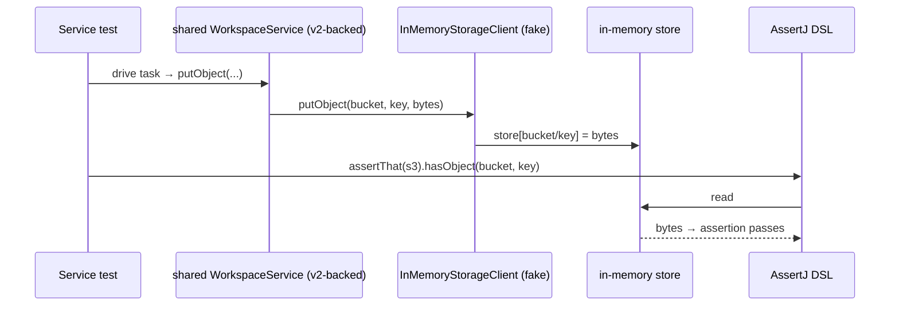

# `functional-testing` — AWS SDK v2 (cloud-sdk) Upgrade DESIGN

> **DIRECTIVE UPDATE (2026-05-31) — supersedes the Option-A recommendation in this document.** Per stakeholder direction the program now targets **Dropwizard 5** and **Option B — adopt `commons` + `cloud-sdk-api`/`cloud-sdk-aws`** as the directed default (recommend Option A only on a categorical technical blocker). All AWS service communication goes through `cloud-sdk-api`; new tests are written in **JUnit 5 (Jupiter)** (existing JUnit 4 runs via JUnit Vintage during transition); configuration follows the composed appianway `.properties`/`${PROFILE}`/`${ENV}` + commons `${awsps:...}` model in the master [shared plan §10](../../shared/docs/2026-05-31-shared-aws2x-upgrade-plan-copilot.md). cloud-sdk gaps are indexed in the master [shared plan §11](../../shared/docs/2026-05-31-shared-aws2x-upgrade-plan-copilot.md) with full technical specs in the master [shared DESIGN §1A.6](../../shared/docs/2026-05-31-shared-aws2x-upgrade-DESIGN.md).
> **Module-specific cloud-sdk gaps:** G1 — provide a concurrent-listener/AsyncDispatcher test fake. Re-implement all in-memory fakes against the `cloud-sdk-api` interfaces (`StorageClient`/`MessagingClient`/`QueueMessage`/`NotificationService`/`CloudParameterStore`/`DatabaseRepository`/`EmailService`) and add JUnit 5 (`dropwizard-testing`) support. Fakes must also cover G2 (putObject metadata) and G4 (version attribute) so consumer tests compile.
> Sections below are retained as the Option-A fallback reference.

> Module: `functional-testing` · Date: 2026-05-31 · Author: GitHub Copilot (Claude Opus 4.8) · Option **A** + fakes via **F1** (`cloud-sdk-api` interfaces)
> Companion: [plan](2026-05-31-functional-testing-aws2x-upgrade-plan-copilot.md). Foundation: [`shared` DESIGN](../../shared/docs/2026-05-31-shared-aws2x-upgrade-DESIGN.md). Session `83b822b011714117`.

## 1. Overview
Replace the giant v1-interface fakes with small in-memory implementations of the `cloud-sdk-api` interfaces that `shared` now depends on. Keep the AssertJ DSL, JUnit-4 lifecycle, and in-memory stores. This module migrates **immediately after `shared`** and unblocks every downstream service test.

## 2. Class diagram (before → after)

## 3. Component diagram

## 4. Sequence diagram (a service test asserting an S3 write)

## 5. Configuration changes
None at runtime. Test wiring (`FunctionalTestBase`) points the `shared` wrappers at the in-memory `cloud-sdk-api` fakes instead of v1 fakes.

## 6. Maven dependency changes
- **Remove:** `com.amazonaws:aws-java-sdk-{s3,ses,sqs,sns}` from `functional-testing/pom.xml`.
- **Add:** `com.inttra.mercury:cloud-sdk-api` (compile, to implement interfaces). Optionally `dynamo-integration-test` (test) if DynamoDB fakes for watermill live here.

## 7. Test details
- The fakes are themselves the deliverable; add unit tests for each fake (put/get/list, send/receive/delete, publish, sendEmail) so the harness is trustworthy.
- AssertJ DSL accessors re-pointed to in-memory stores (not v1 model objects).
- JUnit 4 retained.

## 8. Rollout & verification
**First module after `shared`.** `mvn -pl functional-testing -am test`, then build the aggregator test scope to confirm downstream services compile against the new fakes before migrating them.

## 9. Risks & mitigations
| Risk | Mitigation |
|---|---|
| Downstream compile break mid-migration | Migrate right after `shared`; verify aggregator test scope |
| DSL coupled to v1 model | Re-point to in-memory stores |
| Hidden direct v1-client test usage | Audit per service |
| DynamoDB fake parity | `dynamo-integration-test` or v2 in-memory fake |
