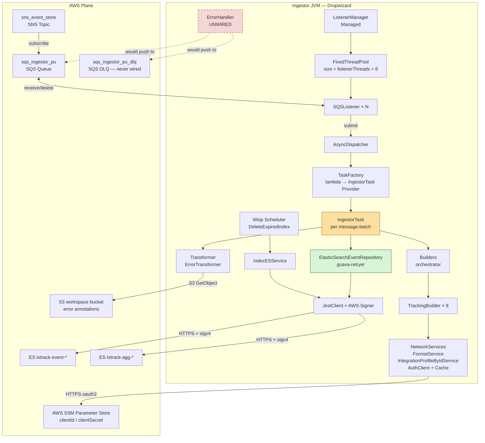
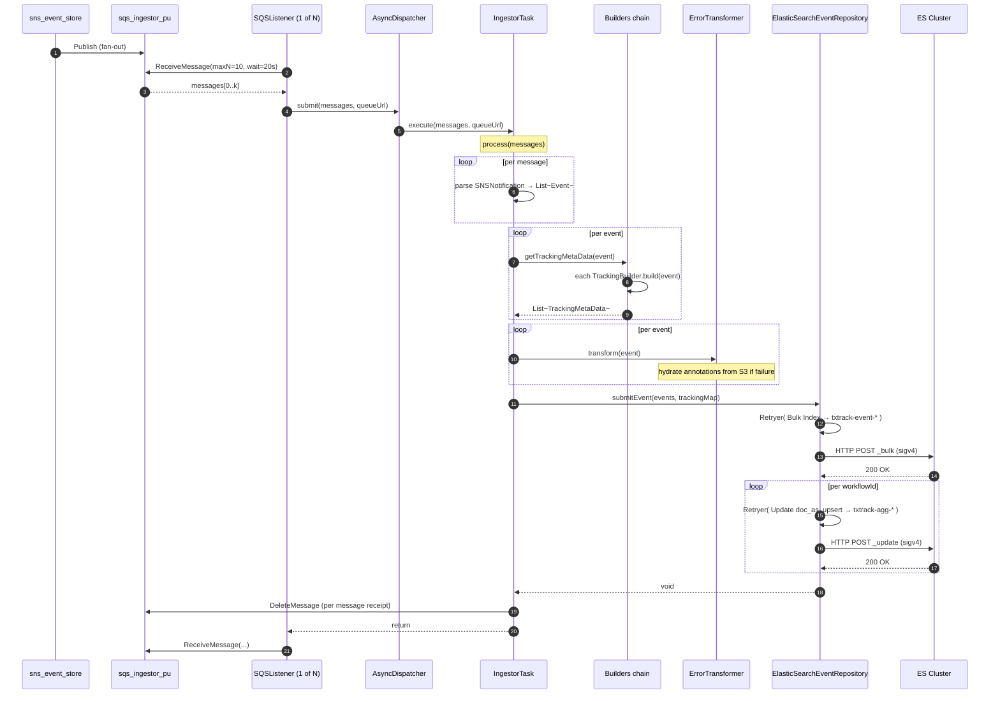
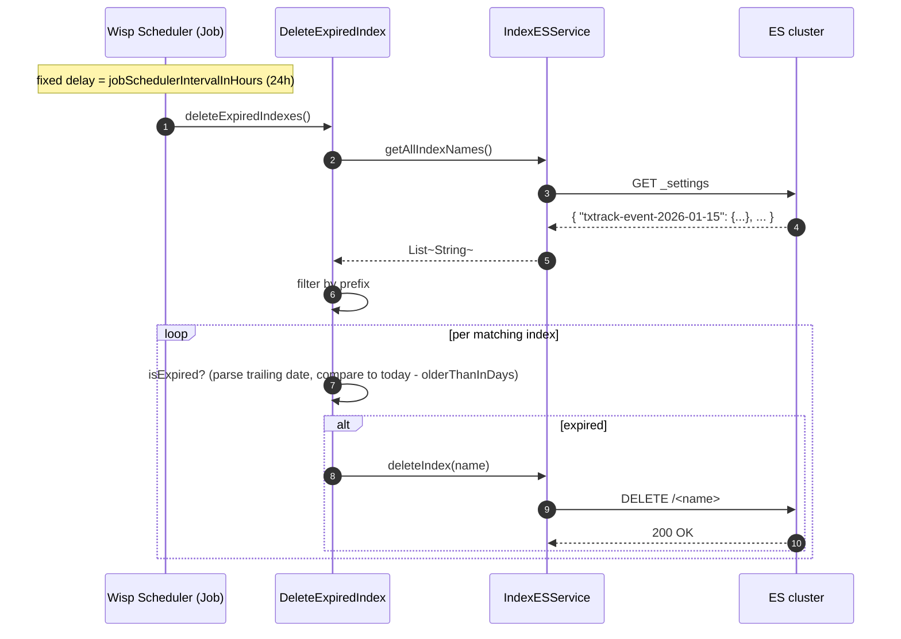
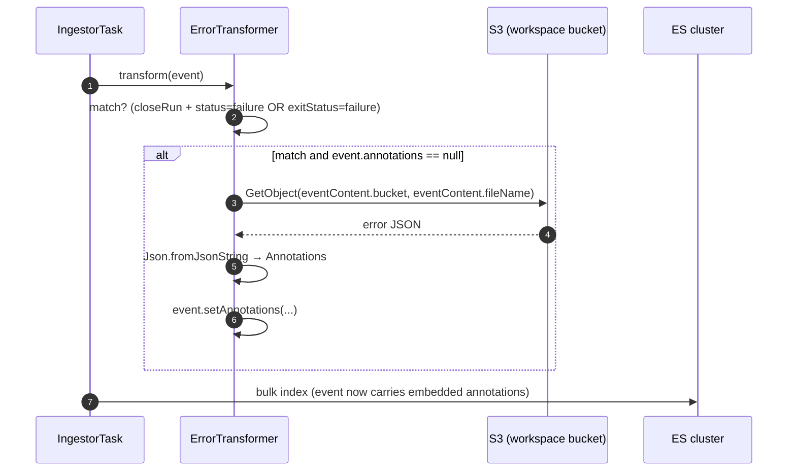
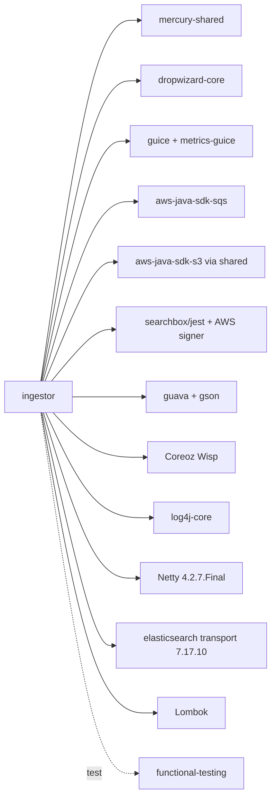

# Ingestor Module — Architecture & Design

> **Author:** Principal Engineering Review
> **Date:** 2026-05-24
> **Module Version:** `com.inttra.mercury.appian-way:ingestor:1.0` (parent `com.inttra.mercury:appian-way:1.0`)
> **Java:** 8 base image (`openjdk:8` per [`Dockerfile`](../Dockerfile)), JRE 11 runtime in build pipeline (`e2openjre11`)
> **Packaging:** Shaded Dropwizard fat-JAR, main class `com.inttra.mercury.ingestor.IngestorApplication`

---

## 1. Executive Summary

The **ingestor** is the **transaction-tracking sink** for the Mercury (Appian Way) inbound pipeline. Despite the suggestive name, it does **not** ingest customer files from external transports (SFTP, MFT, HTTP). That responsibility belongs to the **dispatcher** module, which is the true first-stage receiver of files that land in S3 via Inttra's MFT and that arrive as S3-event notifications on `sqs_dispatcher_pu`.

The ingestor is, in functional terms, an **event-store materializer**:

1. It subscribes (via an SQS queue, `sqs_ingestor_pu`) to the `sns_event_store` SNS topic.
2. Every Mercury pipeline component (dispatcher, splitter, transformer, validator, router, fulfiller, OB-bridge, etc.) publishes lifecycle events (`startWorkflow`, `startRun`, `closeRun`, `closeWorkflow`) to that SNS topic.
3. The ingestor pulls those events, expands SNS-wrapped JSON, runs a battery of **TrackingBuilder** strategies that project per-event tracking metadata, then writes:
   - **Per-event documents** to a daily ES index `txtrack-event-YYYY-MM-DD` (the "detail" stream).
   - **Aggregated workflow rows** to `txtrack-agg-YYYY-MM-DD` via `doc_as_upsert` (the "summary" stream).
4. It also runs an hourly purge that drops indices older than the configured retention window.

Why it matters:

- It is the **substrate for the TX-Tracker** (transaction-tracking) UI/API. Audit replay, error diagnostics, customer SLA reporting, and ops dashboards all consume `txtrack-*` indices.
- It is **terminal** in the message graph — nothing downstream consumes from it. It is therefore the last component to fail gracefully without back-pressuring the pipeline.

Position in this document:

- §2 maps the module against the pipeline.
- §3-§5 give architecture/class views.
- §6 gives the data flow at the byte-for-byte level.
- §7-§9 cover dependencies (runtime + Maven).
- §10 is the detailed walkthrough (start-up to message-completion).
- §11-§13 cover error handling, ops, and open risks.

Key callouts surfaced by this review (developed in §13):

- The task description's premise that the ingestor receives files via MFT/SFTP/HTTP is **not borne out by the code** — it is a queue consumer only. The `sqs_ingestor_pu` queue is fed by SNS fan-out, not by an HTTP/SFTP front-door.
- `IngestorTask.process()` swallows exceptions instead of propagating them ([`IngestorTask.java:65-67`](../src/main/java/com/inttra/mercury/ingestor/task/IngestorTask.java)). The injected `ErrorHandler` class ([`ErrorHandler.java`](../src/main/java/com/inttra/mercury/ingestor/task/ErrorHandler.java)) is **never wired into the dispatch loop**. Recoverable-message retry and DLQ routing are implemented but dead code.
- `AsyncDispatcher.submit(...)` executes the task synchronously on the SQS-listener thread despite the "Async" name ([`AsyncDispatcher.java:36-39`](../src/main/java/com/inttra/mercury/ingestor/task/AsyncDispatcher.java)). Parallelism is achieved exclusively through the configured `listenerThreads` poller count.
- Tracking-aggregate `upsert` documents are routed by `workflowId` to a **per-day** aggregate index. Workflows whose events straddle UTC midnight will create **two distinct aggregate rows**, fragmenting the summary view — a latent correctness issue for long-running flows.

---

## 2. Position in the Mercury Pipeline

### 2.1 The full inbound chain

Files enter Mercury through MFT (Inttra's managed-file-transfer front-door, an external system). MFT places objects into the `${profile}-${env}-inbound-pickup` S3 bucket, which fans S3 `ObjectCreated:*` notifications into the **dispatcher**'s SQS queue. From that point, the pipeline is a chain of SQS-driven components that exchange `MetaData` payloads via SQS and publish lifecycle `Event` records to SNS in parallel.

The ingestor sits **off-chain**: it listens to SNS event fan-out, does not feed any downstream component, and does not block the main flow.

```mermaid
flowchart LR
    MFT[MFT / SFTP<br/>External] -->|file upload| S3IB[S3 inbound-pickup]
    S3IB -->|S3 event| SQSD[sqs_dispatcher_pu]
    SQSD --> DISP[dispatcher]
    DISP -->|MetaData| SPLIT[splitter / ce-splitter]
    SPLIT -->|MetaData| ROUT[router]
    ROUT -->|MetaData| TR[transformer / validator]
    TR -->|MetaData| FULF[fulfiller]
    FULF -->|MetaData| FD[file-delivery / OB-bridge]

    DISP -. publishes Event .-> SNS[sns_event_store]
    SPLIT -. publishes Event .-> SNS
    ROUT -. publishes Event .-> SNS
    TR -. publishes Event .-> SNS
    FULF -. publishes Event .-> SNS
    FD -. publishes Event .-> SNS

    SNS -->|fanout| SQSE[sqs_event_store_pu]
    SNS -->|fanout| SQSI[sqs_ingestor_pu]

    SQSI --> ING[INGESTOR]
    ING -->|bulk index| ES[ES txtrack-event-*]
    ING -->|upsert| ESA[ES txtrack-agg-*]

    SQSE -->|raw archive| EW[event-writer / archive]

    style ING fill:#fde0a0,stroke:#a06000,stroke-width:2px
    style SNS fill:#d6eaff,stroke:#1f5fa6
    style ES fill:#d8f5d8,stroke:#1f6e1f
    style ESA fill:#d8f5d8,stroke:#1f6e1f
```



The dual fan-out (one queue to the ingestor, another to the event-writer/archive) is declared in [`appianway-stack-creation.yaml:108-116`](../../appianway-stack-creation.yaml), where the `EventStoreTopic` has two SQS subscribers.

### 2.2 Why this is *not* the "first-stage receiver"

The task prompt asked us to validate whether the ingestor is the first-stage MFT/SFTP/HTTP receiver. The codebase rules that out unambiguously:

- The ingestor's only inbound surface is `pickupSqsConfig.queueUrl` ([`IngestorConfiguration.java:17-18`](../src/main/java/com/inttra/mercury/ingestor/config/IngestorConfiguration.java)), bound to `sqs_ingestor_pu`.
- It exposes a Dropwizard HTTP server (port `8081` per [`Dockerfile:11`](../Dockerfile)) but only for **admin** and **health-check** endpoints — there is no `@Path` resource class, no JAX-RS endpoint, no upload route. Search confirmed no Jersey resources under `src/main/java`.
- The SQS message body is decoded as an `SNSNotification` JSON envelope ([`IngestorTask.java:39-43`](../src/main/java/com/inttra/mercury/ingestor/task/IngestorTask.java)). Inputs are SNS fan-out artefacts, not file streams.

So the prompt's "first stage receiver" framing has been **corrected here**: the ingestor is a **side-channel observer** of pipeline events, used to power transaction tracking and audit.

### 2.3 Two deployment flavours

The `build.sh` script builds **two Docker images from the same code**:

- `ingestor` — subscribes to `sqs_ingestor_pu`, the primary fan-out.
- `ce-ingestor` — subscribes to `sqs_ingestor_ce`, a Carrier-Edition-specific fan-out queue. The CE pipeline has a parallel set of components (`ce-splitter`, etc.) whose events use a separate ES tenant.

The two flavours differ only by `componentName` and `pickupSqsConfig.queueUrl` (see `conf/int/ingestor.properties` vs `conf/int/ce-ingestor.properties`). All other configuration, code, and ES indices are shared.

### 2.4 Aggregate/detail split

The ingestor performs a **CQRS-ish projection** at write-time:

| Index family | Granularity | Write mode | Purpose |
|---|---|---|---|
| `txtrack-event-YYYY-MM-DD` | One doc per event (`Bulk Index`) | append-only | Replay every step of a workflow, debugging, time-series analysis |
| `txtrack-agg-YYYY-MM-DD` | One doc per `workflowId` (`Update doc_as_upsert`) | merge by workflowId | Current state of each workflow; powers tracking summary UI |

The aggregate document is built by merging the per-event projections from each TrackingBuilder. See §10.4 for the merge mechanics.

---

## 3. High-Level Architecture



### 3.1 Threading model

- **`listenerThreads` = N** SQSListener instances live concurrently. Each runs an unbounded `while (!isStop())` loop on its own thread, polling `sqs_ingestor_pu` with 20-second long-polling and pulling up to `maxNumberOfMessages` (≤10) per receive.
- All listeners share the **single** `AsyncDispatcher` instance ([`IngestorModule.java:59`](../src/main/java/com/inttra/mercury/ingestor/modules/IngestorModule.java)).
- Despite the "Async" name, `AsyncDispatcher.submit(...)` calls `task.execute(messages, queueUrl)` inline — **on the calling SQSListener thread** ([`AsyncDispatcher.java:36-39`](../src/main/java/com/inttra/mercury/ingestor/task/AsyncDispatcher.java)). There is no executor between dispatch and processing.
- Consequently the effective parallelism is `listenerThreads`, with each thread sequentially: poll → process → ack-delete → poll. At `listenerThreads=8` and `maxNumberOfMessages=10` the theoretical ceiling is 80 in-flight events.

### 3.2 Bootstrapping

[`IngestorApplication.run(...)`](../src/main/java/com/inttra/mercury/ingestor/IngestorApplication.java) wires Guice in two phases:

1. `ExternalServicesModule` — binds AWS clients, network services, Parameter Store, Jest client, retryer module.
2. `IngestorModule` — binds the in-process components: `IngestorTask`, the `Builders`/`TrackingBuilder` chain, `Transformer` list, `AsyncDispatcher`, `ListenerManager`, and `PollerJobProvider` (the housekeeping scheduler).

`ListenerManager` is then registered as a Dropwizard `Managed` so its `start()`/`stop()` participate in the container lifecycle ([`IngestorApplication.java:56-57`](../src/main/java/com/inttra/mercury/ingestor/IngestorApplication.java)).

### 3.3 Cross-cutting concerns

| Concern | Mechanism |
|---|---|
| Health-checks | Dropwizard health-check registered via `HealthCheckRegistrar.registerDefaultAndOpsHealthChecks` ([`IngestorApplication.java:62-68`](../src/main/java/com/inttra/mercury/ingestor/IngestorApplication.java)), with `InboundSqsHealthCheck` doing a `ReceiveMessage` with `VisibilityTimeout=0` against `sqs_ingestor_pu` |
| Metrics | `MetricsInstrumentationModule` from `metrics-guice` ([`IngestorModule.java:65`](../src/main/java/com/inttra/mercury/ingestor/modules/IngestorModule.java)); `@Metered` on `ErrorHandler.handleException` |
| Logging | Log4j2 + slf4j (`@Slf4j` on most classes); JSON config layout in `ingestor.yaml` |
| Auth | AWS SigV4 for ES (via `vc.inreach.aws.request.AWSSigner` + Apache HTTP interceptor); OAuth2 client-credentials for Network Services (cached via `AuthClient`) |
| Config | YAML primary + 3-4 layered `.properties` overrides resolved at command-launch time |
| Index hygiene | Coreoz Wisp scheduler (`PollerJobProvider`) — fixed-delay job; default 24h |

---

## 4. Low-Level Design

### 4.1 Packages

```
com.inttra.mercury.ingestor
├── IngestorApplication             ← Dropwizard entry point
├── builder/                        ← TrackingBuilder strategy chain (8 classes)
│   ├── Builders                    ← Aggregator/loop driver
│   ├── TrackingBuilder<T>          ← Strategy interface
│   ├── TrackingBuilderHelper       ← Static helpers (workflow type, projection lookup)
│   ├── EndWorkflowAttributeBuilder
│   ├── ErrorAttributeBuilder
│   ├── FormatAttributeBuilder      ← Helper (not on the chain directly)
│   ├── OBBridgeAttributeBuilder
│   ├── OutTransformerAttributeBuilder
│   ├── PropagateBatchAttributes
│   ├── SplitterAttributeBuilder
│   ├── StartWorkflowAttributeBuilder
│   └── TokenAttributeBuilder
├── command/
│   └── CreateMappingTemplate       ← One-shot CLI: install ES templates
├── config/
│   ├── IngestorConfiguration       ← Dropwizard Configuration root
│   ├── ElasticSearchConfig
│   ├── DeleteIndexSchedulerConfig
│   ├── DeleteIndexConfig
│   └── PollerJobProvider           ← Guice Provider<Job>
├── model/
│   ├── TrackingMetaData            ← One projection slice
│   └── Version                     ← @JestVersion holder (unused)
├── modules/
│   ├── ExternalServicesModule      ← Cloud / network services
│   ├── IngestorModule              ← In-process services
│   └── JestModule                  ← Signed ES client
├── service/
│   ├── EventRepository             ← Persistence contract
│   ├── ElasticSearchEventRepository← Jest-backed implementation w/ retryer
│   ├── IndexESService              ← Index list/delete (admin)
│   └── DeleteExpiredIndex          ← Scheduled purge
├── task/
│   ├── Task                        ← Functional interface
│   ├── TaskFactory                 ← Functional interface
│   ├── IngestorTask                ← Per-batch handler
│   ├── AsyncDispatcher             ← Dispatcher<Message> impl (synchronous!)
│   ├── ListenerManager             ← Dropwizard Managed; owns listener thread pool
│   └── ErrorHandler                ← (Dead-coded recoverable/DLQ router)
└── transformer/
    ├── Transformer                 ← Mutation contract
    └── ErrorTransformer            ← Hydrates Annotations from S3 on failed events
```

The package layout reads as **"functional-core, imperative-shell"**: `builder/`, `transformer/`, and `model/` are pure data shaping; `task/` is the runtime orchestrator; `service/` is the I/O sink; `command/` is the operator CLI. There is no `controller/` or `resource/` because there is no HTTP API surface.

### 4.2 Strategy chain

The transaction-tracking metadata is built using a **strategy chain** of eight `TrackingBuilder` implementations, registered in [`IngestorModule.tokenResolvers(...)`](../src/main/java/com/inttra/mercury/ingestor/modules/IngestorModule.java#L99-L115):

```
ErrorAttributeBuilder
SplitterAttributeBuilder         ← also pulls IntegrationProfile + Format from Network Services
StartWorkflowAttributeBuilder
OutTransformerAttributeBuilder   ← pulls outbound Format from Network Services
EndWorkflowAttributeBuilder
TokenAttributeBuilder            ← propagates all event tokens to the aggregate
PropagateBatchAttributes         ← lifts batch identifiers (mftId, ediId, xlogId, etc.)
OBBridgeAttributeBuilder         ← decodes FTP delivery filename patterns
```

Each implementation defines a `match(event)` predicate and a `build(event)` projection. Builders are independent (no order dependencies in the current set), and their outputs are concatenated. The downstream `ElasticSearchEventRepository.buildTrackingAggregate(...)` then flattens the concatenated `TrackingMetaData[]` for a workflow into a single `Map<String,Object>` by `putAll`-ing all `attributes` maps in order. **Later builders' keys overwrite earlier ones.**

### 4.3 Transformer chain

The `Transformer` chain is currently a single-element list: `[ErrorTransformer]` ([`IngestorModule.transformers(...)`](../src/main/java/com/inttra/mercury/ingestor/modules/IngestorModule.java#L117-L121)). Transformers run **before** `eventRepository.submitEvent(...)` and **mutate** the `Event` in place:

- `ErrorTransformer`: when a `closeRun` event reports failure and has no `annotations` already, fetches the JSON-encoded `Annotations` blob from the S3 bucket/file referenced in `event.eventContent` and attaches it to the event. This is how downstream search can show the failure reason without re-fetching from S3.

### 4.4 Persistence

`ElasticSearchEventRepository` is the only writer to ES. Two stages per `submitEvent` call:

1. **Detail bulk** — `Bulk.Builder` with one `Index` action per `Event`, written to `txtrack-event-YYYY-MM-DD`. Bulk is fire-and-forget within a per-batch boundary.
2. **Aggregate upsert** — for each `workflowId`, the merged projection map is wrapped in `{"doc": {...}, "doc_as_upsert": true}` and PUT against `txtrack-agg-YYYY-MM-DD` with `retry_on_conflict=5`.

The whole repository is wrapped in a Guava `Retryer` ([`ElasticSearchEventRepository.getRetryer()`](../src/main/java/com/inttra/mercury/ingestor/service/ElasticSearchEventRepository.java#L142-L159)):

- 3 attempts.
- Exponential wait starting at 100ms, no cap (`Integer.MAX_VALUE`).
- After exhaustion, throws `RecoverableException(...)`.

Note: The retryer wraps *every* request individually (`submit` → `retryer.call(() -> submitInternal(...))`). For a 10-message batch this means 11 wrapped Jest calls (1 bulk + 10 upserts — one per workflowId in the worst case). Retry blast-radius is per-call, not per-batch.

### 4.5 Scheduler

`PollerJobProvider.get()` returns a Coreoz Wisp `Job` that calls `DeleteExpiredIndex.deleteExpiredIndexes()` on a fixed-delay schedule of `jobSchedulerIntervalInHours` hours (24h by default). The job is bound `asEagerSingleton`, so it starts at boot. `DeleteExpiredIndex`:

1. Lists all indices (`GetSettings` for all → key set).
2. Filters by the configured pattern prefix (`txtrack-event-`, `txtrack-agg-`).
3. Parses the trailing `-YYYY-MM-DD` to compute age.
4. Deletes anything older than `olderThanInDays` (default 90, customised per env).

### 4.6 CLI command

`CreateMappingTemplate` is a custom Dropwizard sub-command:

```sh
java -jar ingestor.jar create-mapping-template ingestor.yaml ...
```

It installs two ES index templates (`event_store_template`, `aggregate_template`) from classpath JSON ([`src/main/resources/txtrack-event-mapping-template.json`](../src/main/resources/txtrack-event-mapping-template.json), [`txtrack-aggregate-mapping-template.json`](../src/main/resources/txtrack-aggregate-mapping-template.json)). It is run **once per environment** during bootstrap, not on each container start.

---

## 5. Key Classes — Class Diagram

```mermaid
classDiagram
    class IngestorApplication {
        +run(IngestorConfiguration, Environment)
        +initialize(Bootstrap)
        -registerHealthChecks()
    }

    class IngestorConfiguration {
        +SQSConfig pickupSqsConfig
        +int listenerThreads
        +ElasticSearchConfig esEventStoreConfig
        +DeleteIndexSchedulerConfig deleteIndexSchedulerConfig
        +NetworkServiceConfig networkServiceConfig
    }

    class ListenerManager {
        -List~SQSListener~ sqsListeners
        +start()
        +stop()
    }

    class SQSListener {
        -SQSListenerClient sqs
        -int waitTimeSeconds
        -String queueUrl
        -Dispatcher dispatcher
        +startup()
        +shutdown()
        -pollAndExecute(ReceiveMessageRequest)
    }

    class AsyncDispatcher {
        -TaskFactory taskFactory
        -int maxNumberOfMsgs
        +submit(List~Message~, String queueUrl)
        +getIdleThreadCount()
    }

    class TaskFactory {
        <<FunctionalInterface>>
        +getTask(List~Message~) IngestorTask
    }

    class IngestorTask {
        -SQSClient sqs
        -EventRepository eventRepository
        -Builders builders
        -List~Transformer~ transformers
        +execute(List~Message~, String)
        +process(List~Message~)
        -getEventStoreMsgFromSNSMessage(Message) List~Event~
        -transform(List~Event~)
        -deleteMessage(List~Message~)
    }

    class Builders {
        -TrackingBuilder[] builders
        +getTrackingMetaData(Event) List~TrackingMetaData~
    }

    class TrackingBuilder {
        <<interface>>
        +build(Event) List~T~
    }

    class TrackingBuilderHelper {
        <<utility>>
        +resolveWorkflowType(Event) String
        +getFromMetaData(Event, String) String
        +getTokenValue(Event, String) String
    }

    class TrackingMetaData {
        -String workflowId
        -String parentWorkflowId
        -String rootWorkflowId
        -String type
        -Map~String, Object~ attributes
    }

    class ErrorAttributeBuilder
    class SplitterAttributeBuilder
    class StartWorkflowAttributeBuilder
    class OutTransformerAttributeBuilder
    class EndWorkflowAttributeBuilder
    class TokenAttributeBuilder
    class PropagateBatchAttributes
    class OBBridgeAttributeBuilder
    class FormatAttributeBuilder {
        <<utility>>
        +build(Event, String, FormatService) List~TrackingMetaData~
    }

    class Transformer {
        <<interface>>
        +transform(Event)
    }

    class ErrorTransformer {
        -S3WorkspaceService s3WorkspaceService
        +transform(Event)
        -isError(Event) boolean
    }

    class EventRepository {
        <<interface>>
        +submitEvent(List~Event~, Map~String, List~TrackingMetaData~~)
    }

    class ElasticSearchEventRepository {
        -JestClient client
        -Retryer retryer
        +submitEvent(...)
        -submitTrackingMetaData(...)
        #buildTrackingAggregate(...) Map
        #buildUpsertTrackingAggregate(...) Action
        -getCurrentEventIndexName() String
        -getCurrentAggIndexName() String
        -getRetryer() Retryer
    }

    class IndexESService {
        -JestClient client
        +getAllIndexNames() List~String~
        +deleteIndex(String)
    }

    class DeleteExpiredIndex {
        -IngestorConfiguration config
        -IndexESService indexESService
        -Clock clock
        +deleteExpiredIndexes()
        -isExpired(String, DeleteIndexConfig) boolean
    }

    class PollerJobProvider {
        -DeleteExpiredIndex deleteExpiredIndex
        -IngestorConfiguration config
        +get() Job
    }

    class ErrorHandler {
        -ErrorHelper errorHelper
        -IngestorConfiguration configuration
        +handleException(Message, Exception)
        -handleRecoverableException(Message, Exception)
    }

    class CreateMappingTemplate {
        +run(Bootstrap, Namespace, IngestorConfiguration)
        +executeMappingTemplate(JestClient, String, String)
    }

    IngestorApplication --> IngestorConfiguration
    IngestorApplication --> ListenerManager
    ListenerManager --> SQSListener
    SQSListener --> AsyncDispatcher : Dispatcher
    AsyncDispatcher --> TaskFactory
    AsyncDispatcher --> IngestorTask : creates
    IngestorTask --> Builders
    IngestorTask --> Transformer
    IngestorTask --> EventRepository
    Builders --> TrackingBuilder : aggregates
    TrackingBuilder <|.. ErrorAttributeBuilder
    TrackingBuilder <|.. SplitterAttributeBuilder
    TrackingBuilder <|.. StartWorkflowAttributeBuilder
    TrackingBuilder <|.. OutTransformerAttributeBuilder
    TrackingBuilder <|.. EndWorkflowAttributeBuilder
    TrackingBuilder <|.. TokenAttributeBuilder
    TrackingBuilder <|.. PropagateBatchAttributes
    TrackingBuilder <|.. OBBridgeAttributeBuilder
    SplitterAttributeBuilder --> FormatAttributeBuilder : uses
    OutTransformerAttributeBuilder --> FormatAttributeBuilder : uses
    Transformer <|.. ErrorTransformer
    EventRepository <|.. ElasticSearchEventRepository
    PollerJobProvider --> DeleteExpiredIndex
    DeleteExpiredIndex --> IndexESService
    CreateMappingTemplate --> JestModule
    IngestorTask -.->|builds| TrackingMetaData
```

Notes:

- The 8 TrackingBuilder concrete classes are shown as classes implementing the interface. Their internal members are elided to keep the diagram legible — see §10.4.
- `ErrorHandler` is bound to the diagram via dependency injection but **never called**.
- `Version` (`io.searchbox.annotations.JestVersion`) is a holder class in `model/` that is dead code; no caller references it.

### 5.1 Sequence — happy path



---

## 6. Data Flow Diagram

### 6.1 Wire formats

```mermaid
flowchart LR
    subgraph "Producer Component"
        EVPROD[Event POJO<br/>com.inttra.mercury.shared.event.Event]
    end

    EVPROD -->|Json.toJsonString| SNSPUB["SNS Publish<br/>(Event JSON)"]
    SNSPUB --> SNSWRAP["SNS-wrapped JSON<br/>{Type, MessageId, TopicArn, Message: '...event JSON...'}"]
    SNSWRAP --> SQSMSG[SQS Message body]
    SQSMSG --> ING

    subgraph "Ingestor JVM"
        ING[Message]
        UNWRAP1[SNSNotification.getMessage]
        UNWRAP2["Json.fromJsonArrayString<br/>(List Event)"]
        EV[List Event]
        TM[List TrackingMetaData<br/>per event]
        AGG[Map workflowId → List TrackingMetaData]
        UPS[Map workflowId → Map flat-projection]
        ING --> UNWRAP1
        UNWRAP1 --> UNWRAP2
        UNWRAP2 --> EV
        EV --> TM
        TM --> AGG
        AGG --> UPS
    end

    EV -->|toJsonString → Bulk Index| ESEV[(ES txtrack-event-YYYY-MM-DD)]
    UPS -->|Json.toJsonString + doc_as_upsert| ESAG[(ES txtrack-agg-YYYY-MM-DD)]
```



### 6.2 Example payloads

Source SQS message (test fixture, [`src/test/resources/closeRunSplitter.json`](../src/test/resources/closeRunSplitter.json)):

```json
{
  "Type": "Notification",
  "MessageId": "01e22b4f-9496-54ea-b962-7aed3c005672",
  "TopicArn": "arn:aws:sns:us-east-1:.../jva001_dev_sns_event_store",
  "Message": "[{\"eventId\":\"...\",\"runId\":\"...\",\"category\":\"system\",\"component\":\"splitter\",\"timestamp\":\"2017-05-26 18:04:06.26\",\"workflowId\":\"...\",\"type\":\"closeRun\",\"status\":\"success\",\"tokens\":{\"dropOffQueue\":\"...\"}}]",
  ...
}
```

The interesting field is `Message`, which (after JSON-unescaping by `SNSNotification.getMessage()`) is an **array** of `Event` JSON objects. The ingestor flat-maps every batch's array into a single `List<Event>` before driving the strategy chain.

After the strategy chain runs against a `splitter` `closeRun`, the produced `TrackingMetaData` set might be (illustratively):

```
{ workflowId, type="root", attributes={ "integrationProfileName": "ACME-INT-EDI" } }
{ workflowId, type="root", attributes={ "format": "315", "context": "IFTSTA", "direction": "IB" } }
{ workflowId, type="root", attributes={ "dropOffQueue": "https://sqs.../sqs_router_pu" } }
```

`ElasticSearchEventRepository.buildTrackingAggregate(...)` then merges them into a single flat map, applies the workflow identifiers, and writes:

```http
POST /txtrack-agg-2026-05-24/aggregate/<workflowId>/_update?retry_on_conflict=5
Content-Type: application/json

{
  "doc": {
    "workflowId": "...",
    "parentWorkflowId": "...",
    "rootWorkflowId": "...",
    "type": "root",
    "integrationProfileName": "ACME-INT-EDI",
    "format": "315",
    "context": "IFTSTA",
    "direction": "IB",
    "dropOffQueue": "https://sqs.../sqs_router_pu"
  },
  "doc_as_upsert": true
}
```

In parallel, the raw event is appended to the day's detail index:

```http
POST /txtrack-event-2026-05-24/event/_bulk
Content-Type: application/x-ndjson

{"index":{}}
{"eventId":"...","runId":"...","component":"splitter","type":"closeRun", ... }
```

### 6.3 Index hygiene cycle



### 6.4 Error-event annotation hydration



---

## 7. Component Dependencies

### 7.1 Runtime (external) dependencies

| Resource | Direction | Purpose | Failure mode |
|---|---|---|---|
| `sqs_ingestor_pu` (SQS) | Ingress | Receives SNS-fanned event JSON | Listener loop logs and retries; messages re-appear after `VisibilityTimeout` |
| `sqs_ingestor_pu_dlq` (SQS) | Egress | DLQ for poison messages — referenced by `ErrorHandler` only, **never written** in current flow | DLQ never receives traffic |
| ES cluster (`txtrack-*`) | Egress | Persist detail events and aggregate workflow snapshots | `RecoverableException` thrown after 3 retries; **caught silently in `IngestorTask.process`** — message deleted regardless |
| S3 workspace bucket | Egress | Read error-annotation files for `closeRun` failures | Exception caught + logged at DEBUG ([`ErrorTransformer.java:47-49`](../src/main/java/com/inttra/mercury/ingestor/transformer/ErrorTransformer.java)); event proceeds without annotations |
| Network Services REST (`/network/...`, `/auth/...`) | Egress | Fetch IntegrationProfile + Format for projection enrichment | Surfaces via Hystrix-style retryer in `NetworkRetryerModule` (Hystrix bundle is disabled in this app — see [`IngestorApplication.java:44`](../src/main/java/com/inttra/mercury/ingestor/IngestorApplication.java)) |
| SSM Parameter Store | Egress | Resolve `clientId`/`clientSecret` for Network-Services OAuth2 | Eager bind at startup — `AuthClient.asEagerSingleton()` causes fail-fast on bad creds |
| AWS SigV4 (STS / instance metadata) | Egress | Sign ES requests | `DefaultAWSCredentialsProviderChain` — same fallback semantics as standard AWS SDK |
| Datadog (optional) | Egress | Metrics shipment | `datadog.properties` loaded as 4th config layer — best-effort |

### 7.2 Internal (Mercury-shared) dependencies

From `mercury-shared` (declared `com.inttra.mercury.shared:mercury-shared:1.0`):

| Package | Used here |
|---|---|
| `shared.command.ConfigProcessingServerCommand` | Custom Dropwizard `Command` chain |
| `shared.config.AWSClientConfiguration` | Pre-baked `ClientConfiguration` constants for AWS SDK clients (s3, sqs_listener, sqs_sender) |
| `shared.config.NetworkServiceConfig` | OAuth2 + service-path config |
| `shared.config.S3ConfigurationProvider` | Optional S3-sourced Dropwizard config |
| `shared.config.SQSConfig` | Pickup queue config bean |
| `shared.event.Event` | Domain object — the lifecycle event |
| `shared.event.SNSNotification` | SNS envelope wrapper |
| `shared.externalwrapper.exception.RecoverableException` | Signals transient ES/SQS errors |
| `shared.healthcheck.HealthCheckRegistrar` | Wires up read/ops health-check endpoints |
| `shared.healthcheck.indicator.InboundSqsHealthCheck` | Validates `sqs_ingestor_pu` reachability |
| `shared.listener.SQSListener` | Generic SQS polling loop |
| `shared.messaging.SQSClient` (sender) | Delete message + DLQ push |
| `shared.messaging.SQSListenerClient` | Receive + carry `failedAttempts` attribute |
| `shared.networkservices.auth.AuthClient` | OAuth2 token (eager singleton) |
| `shared.networkservices.format.{FormatService,CacheFormatService}` | Format lookup by id |
| `shared.networkservices.integrationprofile.{IntegrationProfileByIdService,CacheIntegrationProfileByIdService}` | IP lookup by id |
| `shared.networkservices.NetworkRetryerModule` | Retry interceptors for REST clients |
| `shared.parameterstore.ParameterStoreModule` | SSM-backed properties |
| `shared.support.Json` | Single Jackson facade (date pattern, ignore-unknown defaults) |
| `shared.task.MetaData.Projection` | Projection constants (mftId, ediId, formatId, etc.) |
| `shared.task.errorhandler.ErrorHelper` | Recovery helpers (recoverable/DLQ routing) — not invoked |
| `shared.threaddispatcher.Dispatcher` | `(messages, queueUrl) → void` contract |
| `shared.workspace.{S3WorkspaceService,WorkspaceService}` | S3 read/write for workspace artefacts |

### 7.3 Dependency graph (Mermaid)



---

## 8. Configuration & Validation

### 8.1 Layered config resolution

The container start command resolves config in **four layers**:

1. `ingestor.yaml` (classpath, packaged via `conf/` resource set) — declarative root.
2. `${RELEASE_NAME}.properties` (per environment, e.g. `conf/int/ingestor.properties`) — env-specific overrides.
3. `configuration/${env}/network-services.properties` — network-services oauth + service paths.
4. `configuration/${env}/datadog.properties` — metric shipping.

The order is set by `run.sh`:

```
java -jar ingestor.jar run ingestor.yaml ./ingestor.properties ./network-services.properties ./datadog.properties
```

This relies on the shared `ConfigProcessingServerCommand` which merges them with `.yaml` taking the lowest precedence and the last `.properties` taking the highest (i.e. CLI-rightmost wins). Defaults are expressed in YAML using the `${var:-default}` syntax. Mandatory keys (no default) cause a startup-time `IllegalArgumentException` if the env-properties file is missing them.

### 8.2 Validation rules

Configuration beans use `jakarta.validation` annotations. Dropwizard runs the validator at startup; missing or empty values fail boot.

| Key (YAML / property) | Type | Default | Required | Description | Validation |
|---|---|---|---|---|---|
| `componentName` | String | — | Yes | Identifier used for metrics/logs. `ingestor` or `ce-ingestor`. | Set in `*.properties`; no programmatic check |
| `pickupSqsConfig.queueUrl` (`ingestor.pickupSqsConfig.queueUrl`) | URL | — | Yes | Source SQS queue (subscribed to `sns_event_store`). | `@NotNull` on [`SQSConfig.queueUrl`](../../shared/src/main/java/com/inttra/mercury/shared/config/SQSConfig.java); empty-check in `SQSListener` ctor |
| `pickupSqsConfig.waitTimeSeconds` (`ingestor.pickupSqsConfig.waitTimeSeconds`) | int | `20` | No | SQS long-poll wait. `0`=short polling; up to `20` is long. | None at field level; AWS rejects >20 |
| `pickupSqsConfig.maxNumberOfMessages` (`ingestor.pickupSqsConfig.maxNumberOfMessages`) | int | `10` | No | Max messages per `ReceiveMessage`. | None at field; AWS caps at 10 |
| `listenerThreads` (`ingestor.listenerThreads`) | int | `8` | Yes | Number of `SQSListener` polling threads. | `@NotNull` (note: primitive `int`, annotation has no effect; logical default 8) |
| `esEventStoreConfig.endpointUrl` (`ingestor.esEventStoreConfig.endPoint`) | URL | — | Yes | ES cluster base URL (HTTPS, SigV4-signed). | `@NotEmpty` |
| `esEventStoreConfig.region` | String | `us-east-1` | Yes | ES region for SigV4. | `@NotEmpty` |
| `esEventStoreConfig.service` | String | `es` | Yes | SigV4 service name (`es`). | `@NotEmpty` |
| `networkServiceConfig.networkBaseUrl` (`networkservices.networkBaseUrl`) | URL | — | Yes | Base URL for Network Services REST. | `@NotNull` |
| `networkServiceConfig.authEndpointUrl` (`networkservices.authEndpointUrl`) | URL | — | Yes | OAuth2 token endpoint. | `@NotNull` |
| `networkServiceConfig.clientId` (`networkservices.clientId`) | String | — | Yes | OAuth2 client ID or SSM parameter reference. | `@NotNull`; resolved via `ParameterStoreModule` if `usePassThrough=false` |
| `networkServiceConfig.clientSecret` (`networkservices.clientSecret`) | String | — | Yes | OAuth2 client secret or SSM reference. | `@NotNull`; treat as secret |
| `networkServiceConfig.usePassThrough` | boolean | `false` | No | When `true`, treat clientId/clientSecret as literal; else fetch from SSM. | — |
| `networkServiceConfig.servicePaths.integrationProfileServicePath` | String | — | Yes (chain) | URL path appended to networkBaseUrl. | `@NotNull` map |
| `networkServiceConfig.servicePaths.formatServicePath` | String | — | Yes (chain) | URL path. | `@NotNull` map |
| `deleteIndexSchedulerConfig.jobSchedulerIntervalInHours` | int | `24` | Yes | Wisp `fixedDelaySchedule` period. | No field annotation; positive expected |
| `deleteIndexSchedulerConfig.summaryIndex.index_pattern` | String | `txtrack-agg-` | Yes | Prefix matched against ES index names. | `@NotEmpty` |
| `deleteIndexSchedulerConfig.summaryIndex.olderThanInDays` (`deleteIndexScheduler.summaryIndex.olderThanInDays`) | int | `90` | Yes | Days before aggregate index is purged. | `@NotEmpty` on a primitive — likely a code smell (no effect for int). Env overrides: `int=30`, `qa=30`, `cv=90`, `prod=90`, `stress=30` |
| `deleteIndexSchedulerConfig.detailsIndex.index_pattern` | String | `txtrack-event-` | Yes | Prefix matched against ES index names. | `@NotEmpty` |
| `deleteIndexSchedulerConfig.detailsIndex.olderThanInDays` (`deleteIndexScheduler.detailsIndex.olderThanInDays`) | int | `90` | Yes | Days before detail index is purged. | `@NotEmpty` (no effect for int). Env overrides: `int=30`, `qa=7`, `cv=90`, `prod=90`, `stress=30` |
| `server.connector.port` (`server.connector.port`) | int | `8081` | No | Dropwizard simple-server HTTP port (admin/health). | Dropwizard validation. `int.properties` overrides to `0` (ephemeral) |
| `server.type` | enum | `simple` | No | Dropwizard server type. | — |
| `logging.level` (`ingestor.logging.level`) | enum | `INFO` | No | Root log level. | — |
| `metrics.frequency` (`metrics.frequency`) | duration | (env) | No | Metrics-reporter cadence. | — |
| `componentName` (commented in shared) | — | — | — | Reserved for shared init | — |
| (Dockerfile env) `ENV` | String | — | Yes | One of `int|qa|cvt|prod|stress`. Selected by `run.sh` to rename `*_conf` files. | Shell-level |
| (Dockerfile env) `PROFILE` | String | — | Yes | Tenant/profile, used to template queue/bucket names (`${PROFILE}_${ENV}_sqs_ingestor_pu`). | — |
| (Dockerfile env) `JVM_Xmx` | String | `384m` | Yes (ECS task def) | Heap cap; passed via `-Xmx`. ECS task reservation matches. | — |
| (Dockerfile env) `DEPLOY_IMG` | String | `e2openjre11` | No | Base image for runtime. | — |
| (Dockerfile env) `CONFIG_REGION` | String | `US_EAST_1` | Yes | Region for S3-sourced configuration provider. | — |

### 8.3 Per-environment differences (effective values)

| Env | Pickup queue | ES endpoint | Detail retention | Aggregate retention |
|---|---|---|---|---|
| `int` | `inttra_int_sqs_ingest` | `search-inttra-int-es-tx-tracker-...` | 30d | 30d |
| `qa` | `inttra2_qa_sqs_ingest` | `search-inttra2-qa-es-tx-tracker-...` | 7d | 30d |
| `cvt` | `inttra2_cv_sqs_ingest` | `search-inttra2-cv-es-tx-tracker-...` | 90d | 90d |
| `stress` | `inttra2_st_sqs_ingest` | `search-inttra2-st-es-tx-tracker-...` | 30d | 30d |
| `prod` | `inttra2_pr_sqs_ingest` | `search-inttra2-pr-es-tx-tracker-...` | 90d | 90d |

The CE variant (`ce-ingestor`) is identical except for `componentName=ce-ingestor` and `queueUrl=*_sqs_ingestor_ce`.

Note the **dev/local** default in [`conf/ingestor.properties`](../conf/ingestor.properties) uses `inttra-dev-es-event-store-...` and a profile-templated queue (`${PROFILE}_${ENV}_sqs_ingestor_pu`). This file is **excluded** from the JAR build (see `pom.xml:212-215`) and only used for IDE/Docker-compose local runs.

### 8.4 Authentication

| Channel | Mechanism | Source of credentials |
|---|---|---|
| ES | AWS SigV4 (region=`us-east-1`, service=`es`) | `DefaultAWSCredentialsProviderChain` — EC2/ECS task role |
| SQS / S3 / SSM | Standard AWS SDK creds | Same — task role `INTTRA-ECS-INT-Ingestor-Task` etc. |
| Network Services | OAuth2 client-credentials | `clientId`/`clientSecret` from SSM Parameter Store (or pass-through) |
| Datadog (if enabled) | Datadog API key | `datadog.properties` |

There is **no inbound authentication**. The Dropwizard HTTP server exposes `8080`/`8081` but only carries `healthcheck` and admin metrics — there is no caller-facing API.

---

## 9. Maven Dependencies

Source: [`pom.xml`](../pom.xml).

### 9.1 First-class dependencies

| GAV | Scope | Notes |
|---|---|---|
| `com.inttra.mercury.shared:mercury-shared:${mercury.shared.version}` | compile | Domain types, AWS client templates, listener glue |
| `io.dropwizard:dropwizard-core:${io.dropwizard.version}` | compile | Server, lifecycle, config, validation. `snakeyaml` excluded (vulnerable) |
| `io.dropwizard.metrics:metrics-annotation:${dropwizard.metrics.annotation}` | compile | `@Metered` |
| `com.amazonaws:aws-java-sdk-sqs:${aws-java-sdk.version}` | compile | SQS client — direct usage in `ExternalServicesModule`, `SQSListener` |
| `com.google.inject:guice:${google-guice.version}` | compile | DI container |
| `com.google.guava:guava:${google-guava.version}` | compile | Immutable collections, retryer support via shared |
| `com.palominolabs.metrics:metrics-guice:${metrics-juice.version}` | compile | AOP for `@Metered` annotations |
| `vc.inreach.aws:aws-signing-request-interceptor:0.0.16` | compile | Apache HTTP client interceptor that signs requests with SigV4 (used by `JestModule`) |
| `io.searchbox:jest:6.3.1` | compile | Elasticsearch HTTP client. Excludes vulnerable transitive `gson`. |
| `com.google.code.gson:gson:2.10.1` | compile | Pinned newer gson |
| `com.coreoz:wisp:1.0.0` | compile | Lightweight scheduler used by `PollerJobProvider` |
| `org.projectlombok:lombok:${lombok-version}` | provided | `@Slf4j`, `@Getter`, `@Setter`, `@Data` |
| `org.apache.logging.log4j:log4j-core:2.20.0` | compile | Logging backend |

### 9.2 Test dependencies

| GAV | Scope | Notes |
|---|---|---|
| `com.inttra.mercury.test:functional-testing:1.0` | test | `IntegrationTestRule`, `FakeES`, etc. |
| `junit:junit:${junit.version}` | test | JUnit 4 |
| `org.mockito:mockito-core:${mockito.version}` | test | Mocking |

### 9.3 Pinned Netty stack (CVE control)

The pom forces every Netty artefact to `${io.netty.version}=4.2.7.Final` ([`pom.xml:20`](../pom.xml#L20)) and excludes the older Netty versions transitively pulled in by `elasticsearch transport 7.17.10`. This is a deliberate vulnerability-control measure.

### 9.4 Build/packaging plugins

- `maven-compiler-plugin:3.13.0` — source/target = `${java.version}` (defined in parent).
- `maven-shade-plugin:2.3` — shaded fat-JAR with main class `com.inttra.mercury.ingestor.IngestorApplication` and `ServicesResourceTransformer` to merge META-INF/services entries.

### 9.5 OWASP suppression

[`suppressions.xml`](../suppressions.xml) suppresses CVE-2025-11226 on `logback-core` (the project uses log4j2, so the CVE is not exploitable here even if logback transitively appears).

---

## 10. How the Module Works — Detailed Walkthrough

### 10.1 Container boot

1. ECS launches the container with `ENV=int|qa|...` and `JVM_Xmx` env vars.
2. [`run.sh`](../run.sh) renames `*_${ENV}_conf` files to drop the suffix and `cd /app`.
3. `java -Xmx${JVM_Xmx} -XX:+UseG1GC -jar -DCONFIG_REGION=US_EAST_1 ingestor.jar run ingestor.yaml ingestor.properties network-services.properties datadog.properties`.
4. Dropwizard `Application.run()` invokes `IngestorApplication.run(...)` ([`IngestorApplication.java:48`](../src/main/java/com/inttra/mercury/ingestor/IngestorApplication.java)).
5. The `ExternalServicesModule` configures Guice with AWS, parameter-store, Jest and Network Services bindings. `AuthClient` is bound eager — if Network Services credentials are wrong, the JVM fails to start (fail-fast).
6. The `IngestorModule` binds the in-process graph: 8 `TrackingBuilder`s, `Builders`, `Transformer` list (just `ErrorTransformer`), `AsyncDispatcher`, `IngestorTask` provider, `ListenerManager` with `listenerThreads` listeners, and the Wisp `Job` provider for index purging.
7. `ListenerManager` is registered with Dropwizard `lifecycle().manage(...)`.
8. Health checks are wired ([`IngestorApplication.registerHealthChecks(...)`](../src/main/java/com/inttra/mercury/ingestor/IngestorApplication.java#L62-L68)).
9. Dropwizard starts the simple HTTP connector on `server.connector.port` and the `Managed`s — `ListenerManager.start()` fires, spawning a `FixedThreadPool` of size `listenerThreads` and submitting each `SQSListener.startup()` as a runnable.

### 10.2 Steady-state polling

Each `SQSListener` thread enters this loop ([`SQSListener.startup()`](../../shared/src/main/java/com/inttra/mercury/shared/listener/SQSListener.java#L90-L110)):

```
while (!stop) {
  int n = dispatcher.getIdleThreadCount();    // always == maxNumberOfMessages here
  if (n > 0) {
    ReceiveMessageRequest req = new ...;
    req.setWaitTimeSeconds(20);
    req.setMaxNumberOfMessages(n);
    List<Message> messages = sqs.receiveMessage(req).getMessages();
    if (!messages.isEmpty()) dispatcher.submit(messages, queueUrl);
  }
}
```

Critically, `getIdleThreadCount()` here returns the configured `maxNumberOfMessages` ([`AsyncDispatcher.java:23-26`](../src/main/java/com/inttra/mercury/ingestor/task/AsyncDispatcher.java)) — not the actual pool capacity. Because dispatch is synchronous (§3.1), the listener won't ask for more messages until processing returns. The constant is effectively cosmetic.

### 10.3 Per-batch processing

`IngestorTask.execute(messages, queueUrl)` is the entry point ([`IngestorTask.java:78-89`](../src/main/java/com/inttra/mercury/ingestor/task/IngestorTask.java)):

1. Record start time.
2. Set the `queueUrl` field (used later for the delete call).
3. Call `process(messages)`.
4. Call `deleteMessage(messages)` — **always**, even after partial failures.
5. Log debug timing.

`process(messages)`:

1. Loop over messages, unwrapping each SNS notification body (`SNSNotification` → `Message` field).
2. JSON-parse the unwrapped string as `List<Event>`. Important: legacy producers send a JSON object, modern producers send an array. [`Json.fromJsonArrayString(...)`](../../shared/src/main/java/com/inttra/mercury/shared/support/Json.java) handles both via Jackson `TypeReference`.
3. Flat-concatenate all events into a single `List<Event>` for the batch.
4. For each event, call `builders.getTrackingMetaData(event)` and **group** the resulting projections by `workflowId` into `Map<String, List<TrackingMetaData>> trackingMetaDataMap`.
5. `transform(events)` — run each Transformer over each event (mutates in place).
6. `eventRepository.submitEvent(events, trackingMetaDataMap)`.
7. **All exceptions caught and logged at ERROR** ([`IngestorTask.java:65-67`](../src/main/java/com/inttra/mercury/ingestor/task/IngestorTask.java)). The `try` does **not** rethrow, so `execute(...)` will always reach the `deleteMessage(...)` step.

### 10.4 TrackingBuilder details

Each builder's `match` predicate decides whether the event is relevant; if so, `build` returns 0..N `TrackingMetaData` rows.

| Builder | Trigger | Projection contributions |
|---|---|---|
| `ErrorAttributeBuilder` ([`ErrorAttributeBuilder.java:19-30`](../src/main/java/com/inttra/mercury/ingestor/builder/ErrorAttributeBuilder.java)) | `type=closeRun` AND (`status=failure` OR `eventContent.exitStatus=failure`) | `{ "status": "failure" }` |
| `SplitterAttributeBuilder` ([`SplitterAttributeBuilder.java`](../src/main/java/com/inttra/mercury/ingestor/builder/SplitterAttributeBuilder.java)) | `component=splitter` AND `type=closeRun` | `{ format, context, direction }` from `FormatService.findFormat(formatId)`; `{ integrationProfileName }` from `IntegrationProfileByIdService` |
| `StartWorkflowAttributeBuilder` ([`StartWorkflowAttributeBuilder.java`](../src/main/java/com/inttra/mercury/ingestor/builder/StartWorkflowAttributeBuilder.java)) | `type=startWorkflow` OR (`type=closeRun` AND `subType=startWorkflow`) | `{ startTimestamp }` — `event.timestamp` or `event.startTimestamp` |
| `OutTransformerAttributeBuilder` ([`OutTransformerAttributeBuilder.java`](../src/main/java/com/inttra/mercury/ingestor/builder/OutTransformerAttributeBuilder.java)) | `component=transformer` AND `type=closeRun` AND `targetId` projection present | Outbound `{ format, context, direction }` from `outboundFormatId` projection |
| `EndWorkflowAttributeBuilder` ([`EndWorkflowAttributeBuilder.java`](../src/main/java/com/inttra/mercury/ingestor/builder/EndWorkflowAttributeBuilder.java)) | `type=closeWorkflow` OR (`type=closeRun` AND `subType=closeWorkflow`) | `{ endTimestamp }` |
| `TokenAttributeBuilder` ([`TokenAttributeBuilder.java`](../src/main/java/com/inttra/mercury/ingestor/builder/TokenAttributeBuilder.java)) | `type=closeRun` | All `event.tokens` (sans null values) — propagates `dropOffQueue`, etc. to the aggregate |
| `PropagateBatchAttributes` ([`PropagateBatchAttributes.java`](../src/main/java/com/inttra/mercury/ingestor/builder/PropagateBatchAttributes.java)) | `component in {splitter, ce-splitter}` AND `type=closeRun` AND projection `mftId` present | `{ ediId, xlogId, inboundS3FileName, mftId, originalFileName, interchangeControlReferenceNumber, inftpfilepickuptime, ftpFilePickupTime }` |
| `OBBridgeAttributeBuilder` ([`OBBridgeAttributeBuilder.java`](../src/main/java/com/inttra/mercury/ingestor/builder/OBBridgeAttributeBuilder.java)) | `component=awbridgeob` AND `type=closeRun` | Customer/carrier delivery + archive file name tokens, drop-off timestamps |

`TrackingBuilderHelper.resolveWorkflowType(event)` returns `"root"` if `event.rootWorkflowId == event.workflowId` else `"child"`. This is **only** the `type` attribute on the aggregate document.

### 10.5 Aggregate merge

Inside `ElasticSearchEventRepository.buildTrackingAggregate(...)` ([`ElasticSearchEventRepository.java:78-91`](../src/main/java/com/inttra/mercury/ingestor/service/ElasticSearchEventRepository.java#L78-L91)):

```java
trackingAggregate.put("workflowId", ...);
trackingAggregate.put("parentWorkflowId", ...);
trackingAggregate.put("rootWorkflowId", ...);
trackingAggregate.put("type", ...);
for (TrackingMetaData md : metaDatas) {
    if (md.attributes != null && !md.attributes.isEmpty())
        trackingAggregate.putAll(md.attributes);
}
```

Keys from later builders overwrite earlier ones. Since `Builders.tokenResolvers` registers them in a fixed order, the precedence is:

```
ErrorAttributeBuilder < SplitterAttributeBuilder < StartWorkflowAttributeBuilder
  < OutTransformerAttributeBuilder < EndWorkflowAttributeBuilder
  < TokenAttributeBuilder < PropagateBatchAttributes < OBBridgeAttributeBuilder
```

`TokenAttributeBuilder` is wide (writes the whole `tokens` map) and **late** — if a builder ahead of it computed the same key (e.g. `dropOffQueue`), the token value wins. In practice the only overlap is via tokens.

### 10.6 ES persistence and retry

`submitEvent(...)` calls (in order):

1. `submitEvent(events, currentEventIndexName)` — builds a `Bulk` with one `Index` per event, sends to `txtrack-event-YYYY-MM-DD`.
2. `submitTrackingMetaData(trackingMetaDataMap)` — for each `workflowId`, builds the `Update` doc-as-upsert against `txtrack-agg-YYYY-MM-DD`.

Each call goes through `submit(action)`:

```
result = retryer.call(() -> submitInternal(action))
```

`submitInternal(action)`:

- Calls `client.execute(action)`.
- If `result.isSucceeded()` → log debug; return.
- If `result.getResponseCode() == 409` → log info (`Request Version Conflicts`), do **not** treat as failure. ES's `retry_on_conflict=5` already covers concurrent upserts; this is the additional safety net.
- Otherwise → log error (`handleError(...)`) — but does not throw.
- On `Exception`: wrap and throw `RuntimeException("Exception occurred while calling ElasticSearch service", e)`.

The retryer:
- Catches `RuntimeException` (any exception, via `retryIfException()`).
- 3 attempts.
- Exponential wait 100ms × 2^attempt, no upper bound (in practice attempts are 100ms, 200ms, 400ms).
- On exhaustion → `ExecutionException`/`RetryException` → caught at `submit(...)` and wrapped as `RecoverableException`.

`RecoverableException` bubbles up to `process(...)` and is caught silently. The SQS message is then deleted (data loss for this batch — the failure is logged but the message is gone).

### 10.7 Delete + ack

`deleteMessage(messages)` calls `sqs.deleteMessage(queueUrl, msg.getReceiptHandle())` per message ([`IngestorTask.java:91-93`](../src/main/java/com/inttra/mercury/ingestor/task/IngestorTask.java)). This is a **second** SQS client (`@Named("amazonSQSForSender")`), separate from the listener client.

### 10.8 Index purge job

`PollerJobProvider.get()` constructs a new `Scheduler` (Coreoz Wisp) on each call (note: there's no `Singleton` annotation on the provider method, but Guice binds it via `asEagerSingleton()` at the `Job` binding key, so it's instantiated exactly once). The job calls `DeleteExpiredIndex.deleteExpiredIndexes()` every `jobSchedulerIntervalInHours` hours.

`isExpired(name, cfg)`:

1. Slice the name from `cfg.index_pattern.length()` onwards → e.g. `2026-05-23` from `txtrack-event-2026-05-23`.
2. Parse as `LocalDate` (ISO).
3. Return `now.minusDays(olderThanInDays).isAfter(indexDate)`.

Special case: the `templates` settings response may include non-`txtrack-` indices. The filter `startsWith(prefix)` guards against accidental deletion of unrelated indices.

### 10.9 Mapping-template install (one-shot)

`CreateMappingTemplate` ([`CreateMappingTemplate.java`](../src/main/java/com/inttra/mercury/ingestor/command/CreateMappingTemplate.java)) is meant to be run during environment bootstrap or migration:

```sh
java -jar ingestor.jar create-mapping-template ingestor.yaml ...
```

It POSTs two ES templates so future daily indices inherit consistent mappings (date fields, keyword on workflowId, etc.). See [`src/main/resources/txtrack-event-mapping-template.json`](../src/main/resources/txtrack-event-mapping-template.json) and [`src/main/resources/txtrack-aggregate-mapping-template.json`](../src/main/resources/txtrack-aggregate-mapping-template.json).

### 10.10 Health checks

`InboundSqsHealthCheck` (defined in shared) ([`InboundSqsHealthCheck.java`](../../shared/src/main/java/com/inttra/mercury/shared/healthcheck/indicator/InboundSqsHealthCheck.java)):

- Issues a `ReceiveMessage` with `VisibilityTimeout=0`, ensuring no message is actually consumed (the message remains immediately visible).
- Exception → `unhealthy(e)`.

Health-check URL is `:8081/ping` and `:8081/healthcheck` per Dropwizard defaults. ECS uses these for task health.

### 10.11 Test surface

The module's tests are exclusively unit + minimal functional skeleton:

- `IngestorTaskTest` — verifies `process()` → `service.submitEvent` ([`IngestorTaskTest.java`](../src/test/java/com/inttra/mercury/ingestor/task/IngestorTaskTest.java)).
- `ErrorHandlerTest` — exhaustive (the `ErrorHandler` is over-tested for a class that is never wired). 25+ test methods.
- Builder tests — coverage per builder ([`BuildersTest.java`](../src/test/java/com/inttra/mercury/ingestor/builder/BuildersTest.java), etc.).
- `DeleteExpiredIndexTest` — fixed-clock isolation, deletes by date.
- `ElasticSearchEventStorePersistTest` — minimal happy path against a mocked `JestClient`.
- `IngestorFuncTest` — empty (all assertions commented out per `// TODO: Will fix functional test`). The class extends `IngestorFunctionalTestBase` which wires a `FakeJestClient` and a fake SQS rule via `IntegrationTestRule`.

The presence of the functional test scaffold but no live assertions is a debt item (§13).

---

## 11. Error Handling & Edge Cases

### 11.1 Exception taxonomy

| Source | Exception | Current treatment |
|---|---|---|
| ES (Jest) network failure | wrapped `RuntimeException` inside `submitInternal` | retried 3× exponential; after exhaustion → `RecoverableException`; caught silently in `process()`; message deleted |
| ES 409 conflict | `result.isSucceeded()==false`, `code==409` | logged info only, **not retried by Jest** (but `retry_on_conflict=5` is set on the upsert) |
| ES other failure (e.g. 5xx body) | `result.isSucceeded()==false` | logged error; treated as success by `submitInternal` (returns the failed `JestResult`) — **silent data loss** |
| SNS body not JSON | `RuntimeException` from `Json.fromJsonString` | caught in `process()` `try/catch`; logged; message still deleted |
| SNS body has trailing object instead of array | `MismatchedInputException` | same as above |
| S3 GetObject for annotations fails | logged debug; event continues without `annotations` | non-fatal |
| SQS receive fails | `SQSListener` catches; loops back; eventually `AbortedException` → thread exits | health check will eventually flap red |
| SQS deleteMessage fails | propagates from `IngestorTask.deleteMessage` | caught by outer `catch (Exception ex)` in `execute(...)` ([`IngestorTask.java:86-88`](../src/main/java/com/inttra/mercury/ingestor/task/IngestorTask.java)) — logged warn; message will reappear after visibility timeout |
| NetworkServices REST 5xx (during builder) | `NetworkServicesException` via `NetworkRetryerModule` | retried in shared code; on exhaustion bubbles to `process()` catch → silent log → message deleted |
| Eager `AuthClient` failure at boot | exception propagates; Dropwizard fails startup | fail-fast (good) |

### 11.2 Dead code: `ErrorHandler`

`ErrorHandler` ([`ErrorHandler.java`](../src/main/java/com/inttra/mercury/ingestor/task/ErrorHandler.java)) implements the canonical Mercury pattern:

```
if (isRecoverable && !attemptsMaxed) → republish to pickup queue with delay
else if (isRecoverable && attemptsMaxed) → push to <queueUrl>_dlq
else → drop (non-recoverable)
```

But `IngestorTask.process()` does **not** invoke `errorHandler.handleException(...)`. Nothing constructs `ErrorHandler` in the dispatch path. It is registered with Guice (because it has `@Inject` on the constructor and `@Singleton` annotation) — so a single instance exists in the injector — but it is never resolved by any caller.

The result:

- A poison message (e.g. malformed SNS body) is logged and **silently dropped** (message deleted, never DLQ-ed).
- A transient ES outage causes silent data loss for the batch in flight — no replay.
- The visibility-timeout/re-delivery semantics that other Mercury components rely on are not present here.

The test class `ErrorHandlerTest` is comprehensive (500+ lines), suggesting this was intended to be wired but was never plugged into the dispatcher. This is the **single largest correctness gap** in the module.

### 11.3 Edge cases — observed and worth noting

1. **Daily index boundary**: a workflow whose events span UTC midnight gets two aggregate rows in `txtrack-agg-YYYY-MM-DD` and `txtrack-agg-(YYYY-MM-DD)+1`. The tracking UI must merge them — but since `getCurrentAggIndexName()` is called once per `submitEvent` invocation (not per event), inside a single batch you'll get the boundary based on the time of the call, not the events' timestamps.

2. **Empty `eventContent.bucket`/`fileName`**: `ErrorTransformer.transform` will try to `s3.getContent(null, null)` and rely on the try/catch ([`ErrorTransformer.java:42-49`](../src/main/java/com/inttra/mercury/ingestor/transformer/ErrorTransformer.java)). Exception is caught at DEBUG. Could mask legitimate S3 issues.

3. **Empty `event.tokens`**: `TokenAttributeBuilder` checks `map != null` but a non-null empty map produces an empty `TrackingMetaData` that contributes nothing to the aggregate; safe.

4. **Duplicate `workflowId` across events in the same batch**: handled — `process()` merges into the per-workflow list before sending one upsert.

5. **SNS message body that contains a single event JSON object (not an array)**: Jackson `TypeReference<List<Event>>` will throw. Test fixtures `startRunDispatcher.json` shows the legacy object-form, while `closeRunSplitter.json` shows the array form. Producers must emit the array form consistently — otherwise the entire batch is dropped silently.

6. **Index pattern collision**: any index starting with `txtrack-event-` whose remainder is not `YYYY-MM-DD` (e.g. `txtrack-event-snapshot`) will throw a `DateTimeParseException` from `LocalDate.parse(...)` in `DeleteExpiredIndex.isExpired`. The whole purge job catches at the outer `try/catch` ([`DeleteExpiredIndex.java:50-52`](../src/main/java/com/inttra/mercury/ingestor/service/DeleteExpiredIndex.java)), so a single bad index name aborts the whole pass.

7. **`maxNumberOfMessages > 10`**: not validated locally; AWS rejects with `InvalidParameterValue`. Should be clamped in `SQSConfig` ideally.

8. **`waitTimeSeconds > 20`**: same AWS-level rejection.

9. **`listenerThreads = 0`**: `ListenerManager.start()` would call `Executors.newFixedThreadPool(0)` — IllegalArgumentException. There is no validation.

10. **Aggregate document growth**: every `OBBridgeAttributeBuilder` projection writes a fresh customer/carrier file key per `closeRun`. Long-lived workflows accumulate dozens of fields. ES default mapping treats unknown fields as `keyword`/`text` — the `txtrack-aggregate-mapping-template.json` only fixes the date fields, leaving everything else dynamic.

### 11.4 Logging conventions

| Level | When |
|---|---|
| `DEBUG` | Per-batch success (`Processed N messages in Mms`); ES success body |
| `INFO` | ES 409 conflict; index purge start/end; recoverable/non-recoverable exception classification (dead code) |
| `WARN` | `IngestorTask.execute` failure (e.g. `deleteMessage` exception) |
| `ERROR` | `process()` outer catch ("Exception in Ingestor"); ES non-success result; retryer attempt failure; delete-index failure |

There is **no structured logging** — exceptions are logged as message+stacktrace via slf4j. Datadog ingests stdout JSON if the agent is configured; otherwise CloudWatch awslogs are the canonical store ([`ingestor-latest-dev-Task.json:39-46`](../conf/int/ingestor-latest-dev-Task.json)).

---

## 12. Operational Notes

### 12.1 Deployment

- ECS Fargate-style task with two port mappings (`8080` API, `8081` admin) — both bind dynamically (`hostPort: 0`).
- Task IAM role `INTTRA-ECS-${ENV}-Ingestor-Task` grants SQS receive/delete, S3 read on workspace, ES HTTP signing, SSM read.
- Memory reservation `384 MiB` (`ingestor-latest-dev-Task.json`). Heap `-Xmx384m` is full task memory — there's no headroom for native/GC overhead. **Recommend bumping at least 25% over `Xmx`**.
- G1GC enabled.
- Logging to CloudWatch `inttra-${env}-lg-app-way` with stream prefix `AppianWay-ingestor-latest-${env}`.

### 12.2 Scaling

- **Horizontal**: increase the number of running tasks (ECS service desired count). Each task brings `listenerThreads=8` polling slots.
- **Vertical**: bump `listenerThreads` (no in-code cap; should match `cpu`/heap). With synchronous dispatch every additional listener thread is one additional CPU-bound + I/O-bound stream — diminishing returns past `cores × 2`.
- ES is the typical scaling pinch-point; the retryer's exponential backoff masks slow clusters by extending tail latency rather than failing.

### 12.3 Health, monitoring, alerts

- **Liveness**: `:8081/ping` (Dropwizard) — TCP only.
- **Health**: `:8081/healthcheck` — runs `InboundSqsHealthCheck` (ES is **not** checked).
- **Metrics** (via `metrics-guice` + `@Metered`):
  - `messages.failed` (from `ErrorHandler.handleException` — but never invoked → always 0; alert on this would be useless).
- **Recommended additional metrics** (gap):
  - Bulk-index latency / failure rate.
  - Per-builder enrichment latency (Network Services calls).
  - SQS receive throughput, message age.
  - DLQ depth (currently always 0).

### 12.4 Index lifecycle ops

- The Wisp purge runs **inside the ingestor process**. If all ingestor instances are stopped, indices are never purged. ES disk will grow.
- Per environment retention (§8.3): `int` 30 days, `qa` 7/30 days, `prod` 90 days both.
- On rollover/blue-green deployments, the scheduler restarts; if rollover cadence < `jobSchedulerIntervalInHours` (24h), the purge may never run.

### 12.5 Local development

- The default `conf/ingestor.properties` ([`conf/ingestor.properties`](../conf/ingestor.properties)) targets a profile-templated queue (`${PROFILE}_${ENV}_sqs_ingestor_pu`) and a dev ES cluster.
- `server.connector.port=0` (in the dev properties) makes Dropwizard choose an ephemeral port — good for parallel runs.
- The functional test rule [`IngestorFunctionalTestBase`](../src/test/java/functional/IngestorFunctionalTestBase.java) uses `FakeJestClient` and `FakeES` — a useful pattern for adding regression tests.

### 12.6 Runbook quick reference

| Symptom | First diagnostic | Likely cause |
|---|---|---|
| `txtrack-event-*` index not growing | Check `:8081/healthcheck` and CloudWatch logs for `Exception in Ingestor` | ES SigV4 / network; or task role permissions |
| `txtrack-agg-*` rows missing for a workflow | Search `txtrack-event-*` for the workflowId; confirm builder match conditions | Producer not emitting `closeRun` correctly; or workflowId-day boundary issue |
| Disk pressure on ES | Run `_cat/indices?v` and compare retention windows | Wisp purge not running (all ingestors down? bad index name parse?) |
| Backlog growing on `sqs_ingestor_pu` | CloudWatch `ApproximateNumberOfMessagesVisible` | Ingestor too slow — scale out tasks or `listenerThreads` |
| Stale tracking-aggregate doc | ES 409 conflict logs in INFO | Concurrent upserts; check `retry_on_conflict=5` is honored |
| `RecoverableException` storms | Logs show "Exception in Ingestor" + Jest stack | ES connectivity; expect 3× retryer floor of ~700ms; messages **silently deleted** — see §11.2 |

---

## 13. Open Questions / Risks

This section captures architectural risks and inconsistencies surfaced by the review. They are **not bug reports** but areas worth a follow-up conversation.

### 13.1 R1 — Unwired ErrorHandler (HIGH)

**Risk:** Poison messages and ES outages cause silent data loss in tracking indices.

**Evidence:** `ErrorHandler.handleException(...)` is not called from `IngestorTask` or `AsyncDispatcher`. `IngestorTask.process()` has a blanket `catch (Exception ex) { log.error(...) }`. Messages are always deleted after `execute()`.

**Mitigation options:**
1. Inject `ErrorHandler` into `IngestorTask`; on the outer `catch`, iterate messages and call `errorHandler.handleException(msg, ex)` instead of just logging.
2. Adopt the shared `BaseTask` pattern used by `dispatcher` (it has the recoverable/DLQ branch baked in).
3. At minimum: do **not** delete messages when `process()` throws — let visibility timeout handle re-delivery, and rely on SQS's max receive count to send them to a DLQ.

### 13.2 R2 — Async dispatcher is synchronous (MEDIUM)

**Risk:** The name misleads on-call engineers; the class will likely become hot if message volumes grow.

**Evidence:** `AsyncDispatcher.submit(...)` directly calls `task.execute(...)` on the listener thread ([`AsyncDispatcher.java:36-39`](../src/main/java/com/inttra/mercury/ingestor/task/AsyncDispatcher.java)). `getIdleThreadCount()` returns a constant.

**Mitigation:** rename to `InlineDispatcher` or actually introduce an `ExecutorService` and refactor `getIdleThreadCount()` to return the live free count. Be aware that adding async breaks the in-order ack-delete semantics if not careful.

### 13.3 R3 — Aggregate fragmentation across UTC day (MEDIUM)

**Risk:** A long-running workflow appears as multiple rows in TX-Tracker, fragmenting the summary view.

**Evidence:** [`ElasticSearchEventRepository.getCurrentAggIndexName()`](../src/main/java/com/inttra/mercury/ingestor/service/ElasticSearchEventRepository.java#L135-L139) uses `LocalDateTime.now()` (server time, not UTC) at write-time, not the workflow's start time.

**Mitigation:** key the aggregate index by `event.rootWorkflowId`'s creation day, not wall-clock today. Or use a single rolling alias (`txtrack-agg-current`) and ILM-rollover. The change requires a data migration.

### 13.4 R4 — Daily index sprawl (LOW)

**Risk:** `txtrack-event-*` and `txtrack-agg-*` produce 365+ indices/year per cluster. ES has a soft limit on cluster-wide shards.

**Mitigation:** ES ILM with monthly indices + rollover, instead of fixed daily indices. Today's purge job uses prefix+date math; an ILM migration would simplify operations.

### 13.5 R5 — Annotation on primitive `int` (LOW)

**Evidence:** [`DeleteIndexConfig.olderThanInDays`](../src/main/java/com/inttra/mercury/ingestor/config/DeleteIndexConfig.java#L13-L17) is `@NotEmpty int olderThanInDays`. `@NotEmpty` on a primitive has no effect (Hibernate Validator skips). Same for `IngestorConfiguration.listenerThreads` (`@NotNull int`).

**Mitigation:** change to `@Min(1) Integer` or document the intent.

### 13.6 R6 — Reflective downcasts in `TrackingBuilderHelper` (LOW)

**Evidence:** [`TrackingBuilderHelper.java:18`](../src/main/java/com/inttra/mercury/ingestor/builder/TrackingBuilderHelper.java#L18) `Map.class.cast(event.getEventContent())`. The `Event` model already has typed `eventContent` and `tokens` maps. Using `Map.class.cast(...)` is no-op but suggests historical generics warts.

**Mitigation:** replace with direct accessor + null-guard, drop the cast.

### 13.7 R7 — Functional tests are stubbed out (MEDIUM, debt)

**Evidence:** `IngestorFuncTest` body is commented out with `// TODO: Will fix functional test`. The scaffold exists (`FakeJestClient`, `IntegrationTestRule`, `IngestorFunctionalTestBase`, resources under `src/test/resources-functional`).

**Mitigation:** restore the four functional tests (dispatcher startRun, cerberus closeRun, splitter closeRun, error path). Without them, refactors of the builder chain or transformer list are blind.

### 13.8 R8 — Java 8 base image (MEDIUM, EOL)

**Evidence:** [`Dockerfile:1`](../Dockerfile#L1) `FROM openjdk:8`. The build script ([`build.sh:39`](../build.sh#L39)) supersedes this with `e2openjre11`, but the in-repo Dockerfile is misleading and not the prod artefact.

**Mitigation:** update the in-repo Dockerfile to a JRE 11 (or 17) base; OpenJDK 8 has dropped security support upstream.

### 13.9 R9 — ES 409 conflict treated as success (LOW)

**Evidence:** [`ElasticSearchEventRepository.submitInternal`](../src/main/java/com/inttra/mercury/ingestor/service/ElasticSearchEventRepository.java#L62-L63) explicitly returns 409 results as if they were OK. With `retry_on_conflict=5` on the upsert this is mostly safe — but a 6th concurrent update returns 409 to the client and we silently treat it as success.

**Mitigation:** if `code==409` and the action is an `Update` (not idempotent), schedule a re-attempt via the upper retryer. Alternatively, raise `retry_on_conflict` to align with throughput.

### 13.10 R10 — `transport:7.17.10` and Netty pin (LOW)

**Evidence:** The `transport` client is pulled in only for ES classes ([`pom.xml:121-154`](../pom.xml#L121-L154)). The actual client used at runtime is Jest (REST). The transport JAR is dead weight + a vulnerability surface.

**Mitigation:** identify the actual usage; if none, remove the dependency. If some shared/test code uses it, isolate behind a test scope.

### 13.11 R11 — Hystrix bundle disabled (LOW)

**Evidence:** [`IngestorApplication.java:44`](../src/main/java/com/inttra/mercury/ingestor/IngestorApplication.java#L44) `// bootstrap.addBundle(HystrixBundle.withDefaultSettings());`.

**Question:** Why was it disabled? If the underlying Network-Services retry happens in `NetworkRetryerModule`, document that this is the supersession.

### 13.12 R12 — Hard-coded `RETRY_COUNTS_ON_CONFILICT` typo (NIT)

**Evidence:** [`ElasticSearchEventRepository.java:37`](../src/main/java/com/inttra/mercury/ingestor/service/ElasticSearchEventRepository.java#L37) `private final static int RETRY_COUNTS_ON_CONFILICT = 5;` — typo "CONFILICT" should be "CONFLICT".

**Mitigation:** rename when next touching the class.

### 13.13 R13 — Confusing module name ("ingestor")

**Risk:** New engineers will assume this module is the file ingestion entry point (as the prompt did).

**Mitigation:** rename to `txtracker`, `event-indexer`, or `audit-indexer`. Or, lacking the appetite for a rename, prominently document in the top-level README. The transaction-tracking ES indices and the SNS-fanout shape make the intent obvious only once you read the code.

### 13.14 R14 — Order-dependence in the builder chain (LOW)

**Risk:** `TokenAttributeBuilder` writes all tokens late, potentially overwriting purposefully-computed attributes from other builders.

**Evidence:** see §10.5. Today no overlap is exploited but the chain order is not enforced or documented.

**Mitigation:** explicit precedence comment in `IngestorModule.tokenResolvers(...)`; or namespacing attribute keys (`token.*`, `format.*`).

### 13.15 R15 — `process()` does not propagate to `execute()`, but `execute()` *does* catch

**Evidence:** Two layers of `try/catch` ([`IngestorTask.java:46-67`](../src/main/java/com/inttra/mercury/ingestor/task/IngestorTask.java) and [`78-89`](../src/main/java/com/inttra/mercury/ingestor/task/IngestorTask.java#L78-L89)). The inner catch makes the outer one redundant for `process()`-level failures. The outer catch only catches `deleteMessage` failures.

**Mitigation:** rationalize to a single catch with clear semantics for "before delete" vs "during delete".

### 13.16 Future work

- Move retention/purge out of the JVM into ES ILM policies; or use a dedicated cron Lambda.
- Replace daily index pattern with rolling indices + alias.
- Add a `Drop` for messages older than N days (visibility-timeout-driven re-delivery hides slow-poison events).
- Surface counters per `TrackingBuilder.match()` rate — gives ops insight into producer behaviour drift.
- Consider migrating off Jest (project is in maintenance) to the official ES REST client.

---

## Appendix A — File Reference

Primary source files (canonical paths, click-through):

- Entry / wiring
  - [`src/main/java/com/inttra/mercury/ingestor/IngestorApplication.java`](../src/main/java/com/inttra/mercury/ingestor/IngestorApplication.java)
  - [`src/main/java/com/inttra/mercury/ingestor/modules/ExternalServicesModule.java`](../src/main/java/com/inttra/mercury/ingestor/modules/ExternalServicesModule.java)
  - [`src/main/java/com/inttra/mercury/ingestor/modules/IngestorModule.java`](../src/main/java/com/inttra/mercury/ingestor/modules/IngestorModule.java)
  - [`src/main/java/com/inttra/mercury/ingestor/modules/JestModule.java`](../src/main/java/com/inttra/mercury/ingestor/modules/JestModule.java)
- Config
  - [`src/main/java/com/inttra/mercury/ingestor/config/IngestorConfiguration.java`](../src/main/java/com/inttra/mercury/ingestor/config/IngestorConfiguration.java)
  - [`src/main/java/com/inttra/mercury/ingestor/config/ElasticSearchConfig.java`](../src/main/java/com/inttra/mercury/ingestor/config/ElasticSearchConfig.java)
  - [`src/main/java/com/inttra/mercury/ingestor/config/DeleteIndexSchedulerConfig.java`](../src/main/java/com/inttra/mercury/ingestor/config/DeleteIndexSchedulerConfig.java)
  - [`src/main/java/com/inttra/mercury/ingestor/config/DeleteIndexConfig.java`](../src/main/java/com/inttra/mercury/ingestor/config/DeleteIndexConfig.java)
  - [`src/main/java/com/inttra/mercury/ingestor/config/PollerJobProvider.java`](../src/main/java/com/inttra/mercury/ingestor/config/PollerJobProvider.java)
- Task
  - [`src/main/java/com/inttra/mercury/ingestor/task/Task.java`](../src/main/java/com/inttra/mercury/ingestor/task/Task.java)
  - [`src/main/java/com/inttra/mercury/ingestor/task/TaskFactory.java`](../src/main/java/com/inttra/mercury/ingestor/task/TaskFactory.java)
  - [`src/main/java/com/inttra/mercury/ingestor/task/IngestorTask.java`](../src/main/java/com/inttra/mercury/ingestor/task/IngestorTask.java)
  - [`src/main/java/com/inttra/mercury/ingestor/task/AsyncDispatcher.java`](../src/main/java/com/inttra/mercury/ingestor/task/AsyncDispatcher.java)
  - [`src/main/java/com/inttra/mercury/ingestor/task/ListenerManager.java`](../src/main/java/com/inttra/mercury/ingestor/task/ListenerManager.java)
  - [`src/main/java/com/inttra/mercury/ingestor/task/ErrorHandler.java`](../src/main/java/com/inttra/mercury/ingestor/task/ErrorHandler.java)
- Service
  - [`src/main/java/com/inttra/mercury/ingestor/service/EventRepository.java`](../src/main/java/com/inttra/mercury/ingestor/service/EventRepository.java)
  - [`src/main/java/com/inttra/mercury/ingestor/service/ElasticSearchEventRepository.java`](../src/main/java/com/inttra/mercury/ingestor/service/ElasticSearchEventRepository.java)
  - [`src/main/java/com/inttra/mercury/ingestor/service/IndexESService.java`](../src/main/java/com/inttra/mercury/ingestor/service/IndexESService.java)
  - [`src/main/java/com/inttra/mercury/ingestor/service/DeleteExpiredIndex.java`](../src/main/java/com/inttra/mercury/ingestor/service/DeleteExpiredIndex.java)
- Builders
  - [`src/main/java/com/inttra/mercury/ingestor/builder/TrackingBuilder.java`](../src/main/java/com/inttra/mercury/ingestor/builder/TrackingBuilder.java)
  - [`src/main/java/com/inttra/mercury/ingestor/builder/Builders.java`](../src/main/java/com/inttra/mercury/ingestor/builder/Builders.java)
  - [`src/main/java/com/inttra/mercury/ingestor/builder/TrackingBuilderHelper.java`](../src/main/java/com/inttra/mercury/ingestor/builder/TrackingBuilderHelper.java)
  - [`src/main/java/com/inttra/mercury/ingestor/builder/ErrorAttributeBuilder.java`](../src/main/java/com/inttra/mercury/ingestor/builder/ErrorAttributeBuilder.java)
  - [`src/main/java/com/inttra/mercury/ingestor/builder/SplitterAttributeBuilder.java`](../src/main/java/com/inttra/mercury/ingestor/builder/SplitterAttributeBuilder.java)
  - [`src/main/java/com/inttra/mercury/ingestor/builder/StartWorkflowAttributeBuilder.java`](../src/main/java/com/inttra/mercury/ingestor/builder/StartWorkflowAttributeBuilder.java)
  - [`src/main/java/com/inttra/mercury/ingestor/builder/EndWorkflowAttributeBuilder.java`](../src/main/java/com/inttra/mercury/ingestor/builder/EndWorkflowAttributeBuilder.java)
  - [`src/main/java/com/inttra/mercury/ingestor/builder/OutTransformerAttributeBuilder.java`](../src/main/java/com/inttra/mercury/ingestor/builder/OutTransformerAttributeBuilder.java)
  - [`src/main/java/com/inttra/mercury/ingestor/builder/FormatAttributeBuilder.java`](../src/main/java/com/inttra/mercury/ingestor/builder/FormatAttributeBuilder.java)
  - [`src/main/java/com/inttra/mercury/ingestor/builder/TokenAttributeBuilder.java`](../src/main/java/com/inttra/mercury/ingestor/builder/TokenAttributeBuilder.java)
  - [`src/main/java/com/inttra/mercury/ingestor/builder/PropagateBatchAttributes.java`](../src/main/java/com/inttra/mercury/ingestor/builder/PropagateBatchAttributes.java)
  - [`src/main/java/com/inttra/mercury/ingestor/builder/OBBridgeAttributeBuilder.java`](../src/main/java/com/inttra/mercury/ingestor/builder/OBBridgeAttributeBuilder.java)
- Transformer
  - [`src/main/java/com/inttra/mercury/ingestor/transformer/Transformer.java`](../src/main/java/com/inttra/mercury/ingestor/transformer/Transformer.java)
  - [`src/main/java/com/inttra/mercury/ingestor/transformer/ErrorTransformer.java`](../src/main/java/com/inttra/mercury/ingestor/transformer/ErrorTransformer.java)
- Model
  - [`src/main/java/com/inttra/mercury/ingestor/model/TrackingMetaData.java`](../src/main/java/com/inttra/mercury/ingestor/model/TrackingMetaData.java)
  - [`src/main/java/com/inttra/mercury/ingestor/model/Version.java`](../src/main/java/com/inttra/mercury/ingestor/model/Version.java)
- Command
  - [`src/main/java/com/inttra/mercury/ingestor/command/CreateMappingTemplate.java`](../src/main/java/com/inttra/mercury/ingestor/command/CreateMappingTemplate.java)
- Resources / templates
  - [`src/main/resources/txtrack-event-mapping-template.json`](../src/main/resources/txtrack-event-mapping-template.json)
  - [`src/main/resources/txtrack-aggregate-mapping-template.json`](../src/main/resources/txtrack-aggregate-mapping-template.json)
- Build / runtime
  - [`pom.xml`](../pom.xml)
  - [`Dockerfile`](../Dockerfile)
  - [`build.sh`](../build.sh)
  - [`run.sh`](../run.sh)
  - [`suppressions.xml`](../suppressions.xml)
- Config (yaml/properties)
  - [`conf/ingestor.yaml`](../conf/ingestor.yaml)
  - [`conf/ingestor.properties`](../conf/ingestor.properties)
  - [`conf/int/ingestor.properties`](../conf/int/ingestor.properties)
  - [`conf/qa/ingestor.properties`](../conf/qa/ingestor.properties)
  - [`conf/cvt/ingestor.properties`](../conf/cvt/ingestor.properties)
  - [`conf/stress/ingestor.properties`](../conf/stress/ingestor.properties)
  - [`conf/prod/ingestor.properties`](../conf/prod/ingestor.properties)
  - [`conf/int/ingestor-latest-dev-Task.json`](../conf/int/ingestor-latest-dev-Task.json) (ECS task definition)
- Shared (cross-module) — referenced by ingestor
  - [`../shared/src/main/java/com/inttra/mercury/shared/listener/SQSListener.java`](../../shared/src/main/java/com/inttra/mercury/shared/listener/SQSListener.java)
  - [`../shared/src/main/java/com/inttra/mercury/shared/event/Event.java`](../../shared/src/main/java/com/inttra/mercury/shared/event/Event.java)
  - [`../shared/src/main/java/com/inttra/mercury/shared/event/SNSNotification.java`](../../shared/src/main/java/com/inttra/mercury/shared/event/SNSNotification.java)
  - [`../shared/src/main/java/com/inttra/mercury/shared/config/SQSConfig.java`](../../shared/src/main/java/com/inttra/mercury/shared/config/SQSConfig.java)
  - [`../shared/src/main/java/com/inttra/mercury/shared/messaging/SQSClient.java`](../../shared/src/main/java/com/inttra/mercury/shared/messaging/SQSClient.java)
  - [`../shared/src/main/java/com/inttra/mercury/shared/messaging/SQSListenerClient.java`](../../shared/src/main/java/com/inttra/mercury/shared/messaging/SQSListenerClient.java)
  - [`../shared/src/main/java/com/inttra/mercury/shared/threaddispatcher/Dispatcher.java`](../../shared/src/main/java/com/inttra/mercury/shared/threaddispatcher/Dispatcher.java)
  - [`../shared/src/main/java/com/inttra/mercury/shared/task/MetaData.java`](../../shared/src/main/java/com/inttra/mercury/shared/task/MetaData.java)
  - [`../shared/src/main/java/com/inttra/mercury/shared/task/errorhandler/ErrorHelper.java`](../../shared/src/main/java/com/inttra/mercury/shared/task/errorhandler/ErrorHelper.java)
  - [`../shared/src/main/java/com/inttra/mercury/shared/healthcheck/indicator/InboundSqsHealthCheck.java`](../../shared/src/main/java/com/inttra/mercury/shared/healthcheck/indicator/InboundSqsHealthCheck.java)
  - [`../shared/src/main/java/com/inttra/mercury/shared/config/AWSClientConfiguration.java`](../../shared/src/main/java/com/inttra/mercury/shared/config/AWSClientConfiguration.java)
- Tests (selected)
  - [`src/test/java/com/inttra/mercury/ingestor/task/IngestorTaskTest.java`](../src/test/java/com/inttra/mercury/ingestor/task/IngestorTaskTest.java)
  - [`src/test/java/com/inttra/mercury/ingestor/task/ErrorHandlerTest.java`](../src/test/java/com/inttra/mercury/ingestor/task/ErrorHandlerTest.java)
  - [`src/test/java/com/inttra/mercury/ingestor/service/ElasticSearchEventStorePersistTest.java`](../src/test/java/com/inttra/mercury/ingestor/service/ElasticSearchEventStorePersistTest.java)
  - [`src/test/java/com/inttra/mercury/ingestor/service/DeleteExpiredIndexTest.java`](../src/test/java/com/inttra/mercury/ingestor/service/DeleteExpiredIndexTest.java)
  - [`src/test/java/com/inttra/mercury/ingestor/transformer/ErrorTransformerTest.java`](../src/test/java/com/inttra/mercury/ingestor/transformer/ErrorTransformerTest.java)
  - [`src/test/java/com/inttra/mercury/ingestor/builder/BuildersTest.java`](../src/test/java/com/inttra/mercury/ingestor/builder/BuildersTest.java)
  - [`src/test/java/functional/IngestorFuncTest.java`](../src/test/java/functional/IngestorFuncTest.java)
  - [`src/test/java/functional/IngestorFunctionalTestBase.java`](../src/test/java/functional/IngestorFunctionalTestBase.java)
  - [`src/test/resources/closeRunSplitter.json`](../src/test/resources/closeRunSplitter.json) (sample SNS-wrapped payload)
  - [`src/test/resources/startRunDispatcher.json`](../src/test/resources/startRunDispatcher.json)
- Cross-module / stack
  - [`../appianway-stack-creation.yaml`](../../appianway-stack-creation.yaml) — CFN definition of SQS queues, SNS topic, and the `EventStoreTopic` → `IngesterQueue` subscription

---

## Appendix B — Quick Glossary

| Term | Meaning in this module |
|---|---|
| `Event` | A POJO describing a single lifecycle event from a Mercury component (run open/close, workflow open/close, etc.). Defined in shared. |
| `SNSNotification` | The SNS-to-SQS envelope wrapper. The `Message` field carries the JSON-stringified `Event` array. |
| `TrackingMetaData` | A single per-builder projection slice carrying workflow ids + a flat `attributes` map. Multiple slices are merged per workflowId before upsert. |
| `txtrack-event-*` | Daily ES index for raw lifecycle events. Append-only. |
| `txtrack-agg-*` | Daily ES index for workflow summary documents. Upsert-merged by `workflowId`. |
| `pickupSqs` | The SQS queue the ingestor subscribes to. Always `*_sqs_ingestor_pu` (or `*_sqs_ingestor_ce` for the CE variant). |
| `closeRun` | An event type emitted when a single component finishes processing one run of a workflow. The most common event the ingestor sees. |
| `closeWorkflow` | Emitted when the last component in the chain finishes for a workflow. |
| `startWorkflow` | Emitted by the dispatcher when a new workflow begins (typically when an S3 inbound file is first observed). |
| `Builders` (class) | The aggregator that drives all `TrackingBuilder` strategies in order. |
| `ListenerManager` | The Dropwizard `Managed` that owns the listener-thread pool. |
| `AsyncDispatcher` | Despite the name, the synchronous bridge between `SQSListener` and `IngestorTask`. |
| `Wisp` | The Coreoz scheduler library used for the index-purge fixed-delay job. |
| `Jest` | The HTTP-based Elasticsearch client used by this module. |
| `SigV4` | AWS Signature Version 4 — used to authenticate to AWS-managed ES via HTTP requests. |
| `MFT` | Managed File Transfer (Inttra's external file-receiving service). Not part of the ingestor; mentioned only for pipeline context. |
| `CE` | Carrier Edition — a parallel pipeline path with its own splitter/ingestor/etc. |
| `TX-Tracker` | Transaction Tracker — the consumer of `txtrack-*` indices. Outside this module. |
