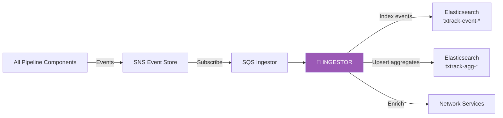
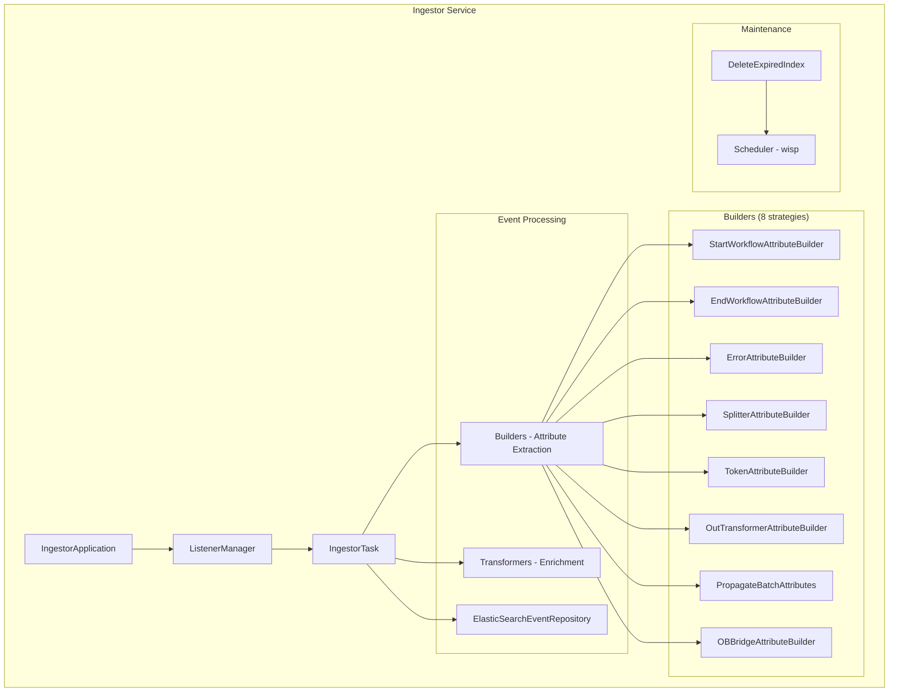
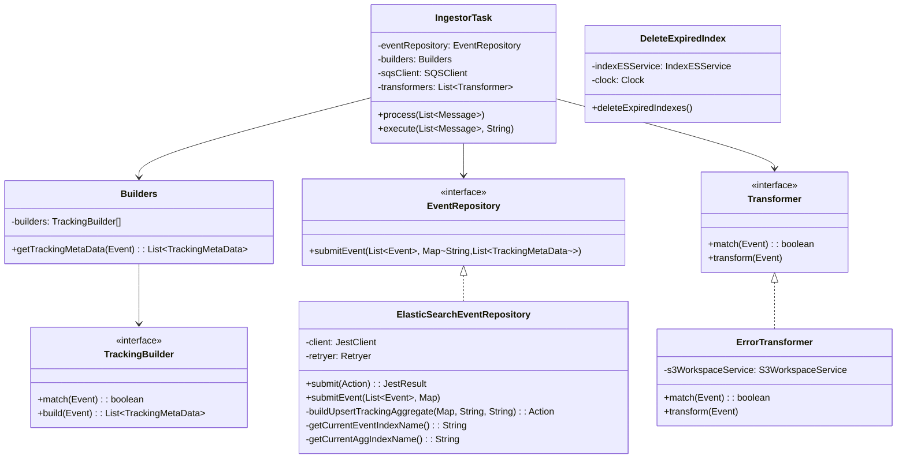
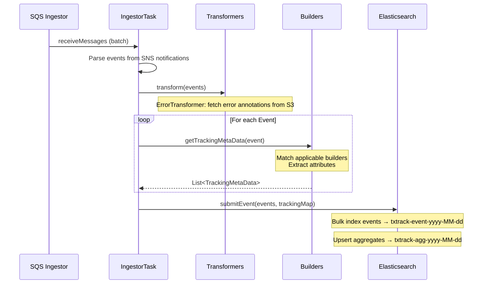
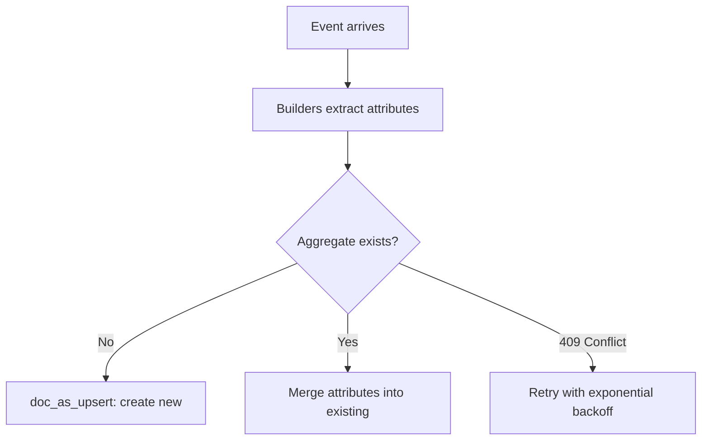

# Ingestor Module — Design Document

> **Module:** `ingestor`  
> **Generated:** 2026-05-24  
> **Artifact:** `com.inttra.mercury.ingestor:ingestor:1.0-SNAPSHOT`  
> **Java Version:** 17 | **Framework:** Dropwizard 4.x + Guice 7.x + Elasticsearch (Jest)

---

## 1. Executive Summary

The **Ingestor** is the real-time analytics and tracking engine of AppianWay. It subscribes to the SNS event topic, enriches events with business metadata (formats, integration profiles, file tracking), builds searchable aggregate documents, and indexes everything into Elasticsearch — powering the transaction tracking dashboard.

---

## 2. Role in the Pipeline

---

## 3. High-Level Architecture

---

## 4. Class Diagram

---

## 5. Data Flow Diagram

---

## 6. Builder Strategy Pattern

Each builder extracts specific attributes from events:

| Builder | Matches | Extracts |
|---------|---------|----------|
| `StartWorkflowAttributeBuilder` | `startWorkflow` or `closeRun(START_WORKFLOW)` | `startTimestamp` |
| `EndWorkflowAttributeBuilder` | `closeWorkflow` or `closeRun(CLOSE_WORKFLOW)` | `endTimestamp` |
| `ErrorAttributeBuilder` | `closeRun` with `status=failure` | `status: failure` |
| `TokenAttributeBuilder` | Any `closeRun` | All event tokens |
| `SplitterAttributeBuilder` | Component=splitter + closeRun | format, context, direction, ipName |
| `OutTransformerAttributeBuilder` | Component=transformer + targetId | Outbound format context |
| `PropagateBatchAttributes` | Splitter/CE-splitter + mftId | ediId, xlogId, filenames |
| `OBBridgeAttributeBuilder` | Component=awbridgeob + closeRun | FTP delivery/archive info |

---

## 7. Elasticsearch Index Strategy

### Dual-Index Architecture

| Index Pattern | Purpose | Document Type |
|---------------|---------|---------------|
| `txtrack-event-yyyy-MM-dd` | Raw events | Individual event JSON |
| `txtrack-agg-yyyy-MM-dd` | Workflow aggregates | Merged tracking metadata |

### Aggregate Upsert Strategy

- **Retry on conflict:** 5 attempts for version conflicts
- **Exponential backoff:** 100ms base, 3 max attempts

---

## 8. Index Maintenance

The `DeleteExpiredIndex` job runs on a scheduled interval:

1. Lists all indices matching `txtrack-event-*` and `txtrack-agg-*`
2. Extracts date from index name
3. Compares against configured retention days
4. Deletes expired indices

---

## 9. Configuration Details

| Property | Type | Default | Description |
|----------|------|---------|-------------|
| `pickupSqsConfig.queueUrl` | String | — | Ingestor SQS queue |
| `pickupSqsConfig.waitTimeSeconds` | int | `20` | Long poll |
| `pickupSqsConfig.maxNumberOfMessages` | int | `10` | Batch size |
| `listenerThreads` | int | — | SQS listener thread count |
| `esEventStoreConfig.endpointUrl` | String | — | ES cluster URL |
| `esEventStoreConfig.region` | String | — | AWS region for signing |
| `esEventStoreConfig.service` | String | — | AWS service (`es`) |
| `deleteIndexSchedulerConfig.*` | Object | — | Retention and schedule |
| `networkServiceConfig.*` | Object | — | Format/IP service endpoints |

---

## 10. Key Maven Dependencies

| Dependency | Version | Purpose |
|-----------|---------|---------|
| `mercury-shared` | 1.0 | Framework, S3, SQS |
| `jest` | 6.3.1 | Elasticsearch REST client |
| `elasticsearch-transport` | 7.17.10 | ES transport client |
| `aws-signing-request-interceptor` | 0.0.16 | AWS Signature V4 for ES |
| `wisp` | 1.0.0 | Job scheduler |
| `gson` | 2.10.1 | JSON for ES |
| `netty-*` | 4.2.7 | Network I/O |
| `dropwizard-core` | 4.0.16 | Application framework |
| `guice` | 7.0.0 | DI container |
