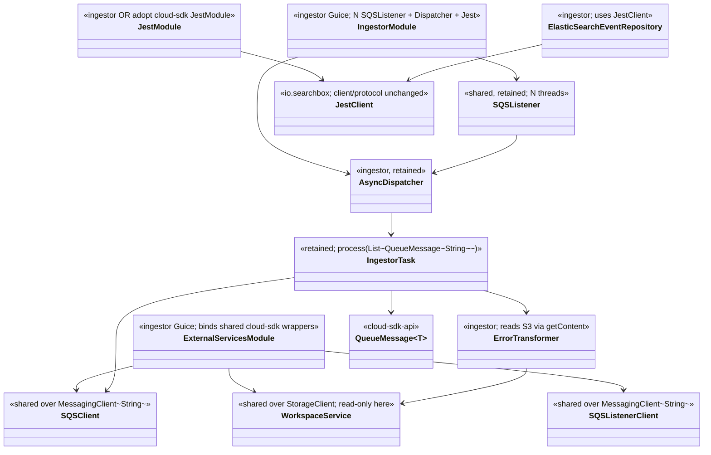
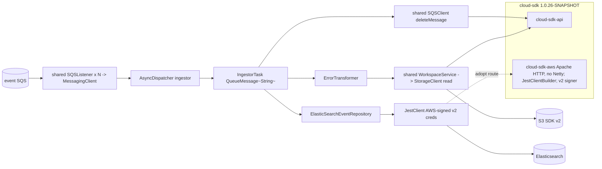
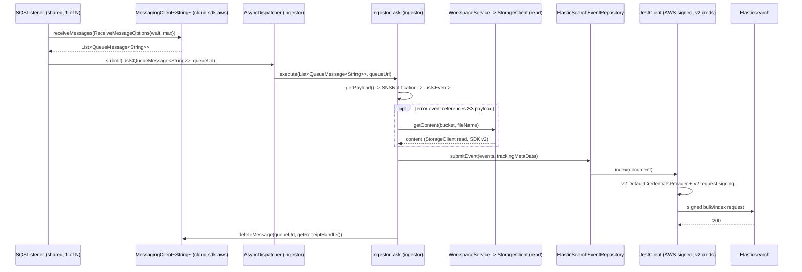

# `ingestor` — AWS SDK v2 (cloud-sdk) Upgrade DESIGN (claude)

> Module: `com.inttra.mercury.appian-way:ingestor:1.0` · Date: 2026-05-31 · Author: Claude (Opus 4.8)
> **Chosen option: B — adopt `commons` + `cloud-sdk-api`/`cloud-sdk-aws` (`1.0.26-SNAPSHOT`) on Dropwizard 5**, consuming cloud-sdk as a normal client with **no module-specific cloud-sdk change**. Option A (DW4 rebind) is the fallback, same cloud-sdk contract.
> Companion plan: [`...-plan-claude.md`](2026-05-31-ingestor-aws2x-upgrade-plan-claude.md). Master: [shared DESIGN](../../shared/docs/2026-05-31-shared-aws2x-upgrade-DESIGN-claude.md) §5 (config), §6 (cloud-sdk specs).

---

## 1. Overview & chosen option

ingestor routes SQS (consume + send) and S3-read through `shared`'s cloud-sdk-backed wrappers, replaces the v1 `com.amazonaws.services.sqs.model.Message` element type with `QueueMessage<String>` through its **retained** multi-`SQSListener` + `AsyncDispatcher`/`IngestorTask` orchestration, and migrates the **Jest AWS-signing credential path** off v1 `DefaultAWSCredentialsProviderChain`/`AWSSigner` to AWS SDK v2 — either by adopting cloud-sdk's `JestClientBuilder`/`JestModule` (preferred) or a local v2 signer (fallback). The Jest **client/protocol stays** (OpenSearch-SDK migration is a separate effort). No cloud-sdk library change is required (plan §11).

---

## 2. Class diagram (target consumer wiring)

**Removed v1 types:** `com.amazonaws.services.sqs.AmazonSQS`, `com.amazonaws.services.s3.AmazonS3`, `com.amazonaws.services.sqs.model.Message`, **`com.amazonaws.auth.DefaultAWSCredentialsProviderChain`** + `com.amazonaws.auth.AWSCredentialsProvider` (Jest signing).
**Consumed cloud-sdk-api (via shared):** `MessagingClient<String>`, `QueueMessage<String>`, `StorageClient` (read).
**Jest:** either cloud-sdk `JestClientBuilder`/`JestModule` (v2-signed) or local `JestClientFactory` with a v2 credential provider + signer interceptor.

---

## 3. Component diagram

---

## 4. Sequence diagram — consume → read S3 → sign → Jest index

---

## 5. Configuration

Defers to master DESIGN [§5](../../shared/docs/2026-05-31-shared-aws2x-upgrade-DESIGN-claude.md). ingestor-specific:
- `ElasticSearchConfig` (`region`, `service`, `endpointUrl`) is **unchanged** and continues to parameterize the signer (whichever route). Credentials resolve via the v2 default chain (same IAM/`AWS_*` env as the v1 chain).
- SQS/S3 per-role configs (`AWSClientConfiguration.sqs_listener`/`sqs_sender`/`s3_read_put_copy`) map to cloud-sdk-aws client config (v2 `ClientOverrideConfiguration`/`Region.of(...)`) inside `shared`.
- `${PROFILE}`/`${ENV}` resource-name expansion unchanged.

---

## 6. cloud-sdk gaps — ingestor: NONE

ingestor requires **no cloud-sdk-api / cloud-sdk-aws / commons change**.
- **Jest AWS signing:** adopt cloud-sdk's existing `JestClientBuilder`/`JestModule` (AWS SDK v2 `DefaultCredentialsProvider` + v2 signing) — adopt as-is. Fallback (only if a knob is missing): keep the local `JestClientFactory` and swap the credential provider/signer to v2 locally. Either way no library change.
- **S-G2:** not applicable — ingestor reads S3 only (`getContent`, [`ErrorTransformer.java:43`](../src/main/java/com/inttra/mercury/ingestor/transformer/ErrorTransformer.java)); no metadata write/copy.
- Master gaps **G1/G6/G7** are de-scoped to appianway-local (master §6.5): ingestor keeps its multi-`SQSListener`/`AsyncDispatcher` concurrency, composes config via the appianway `ServerCommand`, and re-points any health indicators to injected cloud-sdk clients.

---

## 7. Maven dependency changes

`ingestor/pom.xml` (illustrative — applied during implementation, not now):
- **Remove:** `com.amazonaws:aws-java-sdk-sqs:${aws-java-sdk.version}` ([`pom.xml:45-50`](../pom.xml)). (No `aws-java-sdk-s3` is declared here — the v1 S3 drop happens in `shared`.)
- **Remove (if adopting cloud-sdk Jest signing):** `vc.inreach.aws:aws-signing-request-interceptor:0.0.16` ([`pom.xml:66-70`](../pom.xml)). Keep it only under the fallback route until the local signer is replaced.
- **Add:** `com.inttra.mercury:commons`, `cloud-sdk-api`, `cloud-sdk-aws` at `1.0.26-SNAPSHOT` (versions from root `dependencyManagement`). `cloud-sdk-aws` brings AWS SDK v2 (`sqs`, `s3`, `apache-client`) transitively, **Netty excluded**.
- **Keep:** `io.searchbox:jest:6.3.1` and `com.google.code.gson:gson` ([`pom.xml:71-86`](../pom.xml)) — the Jest client/protocol is retained.
- Add `dropwizard-testing` (JUnit 5) and, during transition, `junit-vintage-engine`.
- Review the existing manual `io.netty:*` pins ([`pom.xml:155-190`](../pom.xml)) against cloud-sdk-aws (which excludes Netty) and the `transport`/Elasticsearch client to avoid shading clashes in the uber-jar.

---

## 8. Tests

- **New tests in JUnit 5 (Jupiter)**; existing JUnit 4 runs via `junit-vintage-engine` during transition.
- Re-point `IngestorTask`/dispatcher tests from a v1 `Message` mock to a `QueueMessage<String>` test double (`getPayload()`/`getReceiptHandle()`).
- **`functional-testing` SQS/S3 fakes** re-pointed to the `cloud-sdk-api` interfaces (lockstep with `shared` — see functional-testing DESIGN). ingestor uses the SQS + S3-read fakes only (no SNS/SES fake needed).
- **Jest:** existing Elasticsearch indexing tests are unaffected (client/protocol unchanged). Add a unit test asserting the chosen signer resolves credentials via the v2 default chain and signs against the configured `region`/`service`.
- No `FAILED_ATTEMPTS` round-trip test needed (ingestor does not use it).

---

## 9. Rollout & verification

1. Land `shared` + `functional-testing` first (master DESIGN §9).
2. Migrate ingestor: rebind `ExternalServicesModule` (SQS/S3) → shared cloud-sdk wrappers; swap `Message` → `QueueMessage<String>` through `Task`/`AsyncDispatcher`/`IngestorTask`; migrate `JestModule` signing to v2 (adopt cloud-sdk Jest or local v2 signer).
3. `mvn -pl ingestor -am verify`.
4. Dev smoke: consume an event, confirm an AWS-signed document lands in Elasticsearch and the S3-read error path still resolves content.

---

## 10. Risks & mitigations

| Risk | Mitigation |
|---|---|
| cloud-sdk Jest builder missing a `region`/`service`/endpoint knob ingestor needs | Verify first (plan §9); fall back to local `JestClientFactory` + v2 signer (no cloud-sdk change) |
| v2 credential resolution differs from v1 chain for ES signing | Dev-run parity check; both honor IAM/`AWS_*` env |
| Shading clash between cloud-sdk-aws (Netty-excluded) and the existing `io.netty`/`transport` pins | Inspect uber-jar; reconcile/remove redundant Netty pins after migration |
| `Message` → `QueueMessage<String>` accessor drift | Parity covered in `shared`; ingestor only uses `getPayload()`/`getReceiptHandle()` |
| Jest dependency retained while OpenSearch migration looms | Explicitly scoped out; keep Jest now, track OpenSearch separately |
