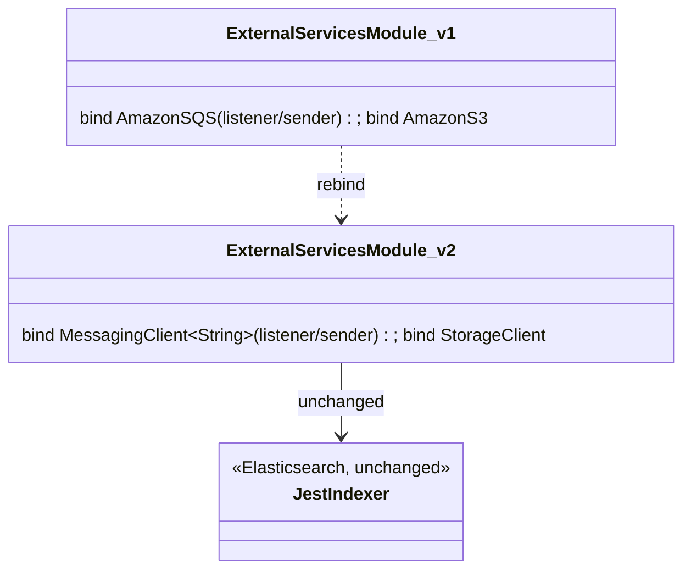
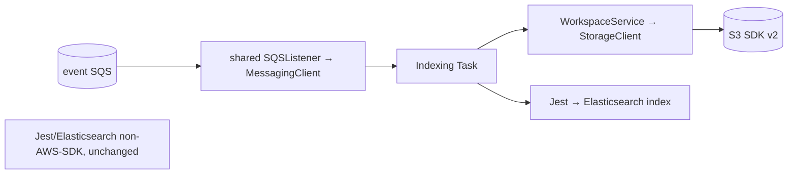
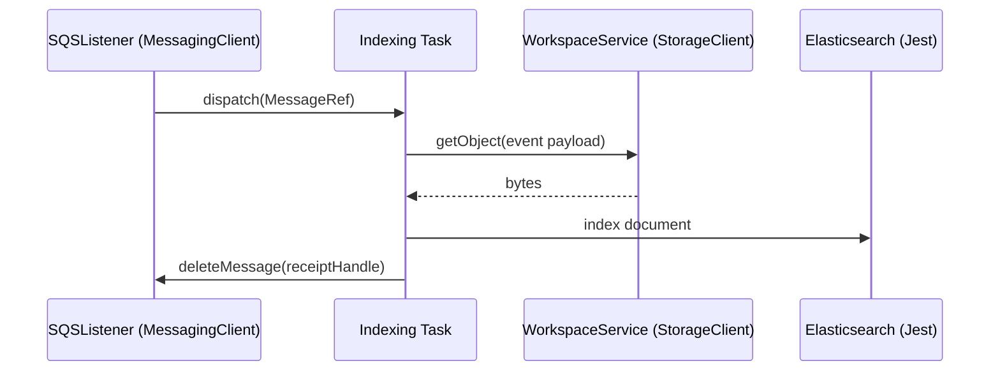

# `ingestor` — AWS SDK v2 (cloud-sdk) Upgrade DESIGN

> **DIRECTIVE UPDATE (2026-05-31) — supersedes the Option-A recommendation in this document.** Per stakeholder direction the program now targets **Dropwizard 5** and **Option B — adopt `commons` + `cloud-sdk-api`/`cloud-sdk-aws`** as the directed default (recommend Option A only on a categorical technical blocker). All AWS service communication goes through `cloud-sdk-api`; new tests are written in **JUnit 5 (Jupiter)** (existing JUnit 4 runs via JUnit Vintage during transition); configuration follows the composed appianway `.properties`/`${PROFILE}`/`${ENV}` + commons `${awsps:...}` model in the master [shared plan §10](../../shared/docs/2026-05-31-shared-aws2x-upgrade-plan-copilot.md). cloud-sdk gaps are indexed in the master [shared plan §11](../../shared/docs/2026-05-31-shared-aws2x-upgrade-plan-copilot.md) with full technical specs in the master [shared DESIGN §1A.6](../../shared/docs/2026-05-31-shared-aws2x-upgrade-DESIGN.md).
> **Module-specific cloud-sdk gaps:** G1 (concurrent SQS listener), G6 (config), G7 (health checks). **Elasticsearch/Jest is now IN SCOPE via cloud-sdk `JestClientBuilder`/`JestModule`** — adopt it for the event indexer instead of a standalone Jest client; no new gap.
> Sections below are retained as the Option-A fallback reference.

> Module: `ingestor` · Date: 2026-05-31 · Author: GitHub Copilot (Claude Opus 4.8) · Option **A**
> Companion: [plan](2026-05-31-ingestor-aws2x-upgrade-plan-copilot.md). Foundation: [`shared` DESIGN](../../shared/docs/2026-05-31-shared-aws2x-upgrade-DESIGN.md). Session `83b822b011714117`.

## 1. Overview
Smallest standard-consumer rebind: replace v1 `AmazonSQS`/`AmazonS3` bindings with `cloud-sdk-aws` `MessagingClient`/`StorageClient`; switch the indexing task to `MessageRef`. Jest/Elasticsearch indexing unchanged. Dropwizard 4 / JUnit 4 retained.

## 2. Class diagram

## 3. Component diagram

## 4. Sequence diagram

## 5. Configuration changes
SQS/S3 per-role config maps to `cloud-sdk-aws` options via `shared`. Elasticsearch/Jest config unchanged. `${PROFILE}`/`${ENV}` naming unchanged.

## 6. Maven dependency changes
- **Remove:** `aws-java-sdk-{sqs,s3}` from `ingestor/pom.xml`.
- **Add:** `cloud-sdk-api`, `cloud-sdk-aws`. Jest unchanged. Versions from root `dependencyManagement` (v2 BOM 2.30.24).

## 7. Test details
- Functional tests use `functional-testing` fakes re-pointed to `cloud-sdk-api`.
- Elasticsearch-indexing tests unaffected. `Message`→`MessageRef` where referenced. JUnit 4 retained.

## 8. Rollout & verification
After `shared` + `functional-testing`. `mvn -pl ingestor -am verify`.

## 9. Risks & mitigations
| Risk | Mitigation |
|---|---|
| Override-config mapping gaps | Centralize in `shared`; functional-test assert |
| `Message`→`MessageRef` drift | Parity tests in `shared` |
| Jest-path scope creep | AWS-boundary-only scope |
