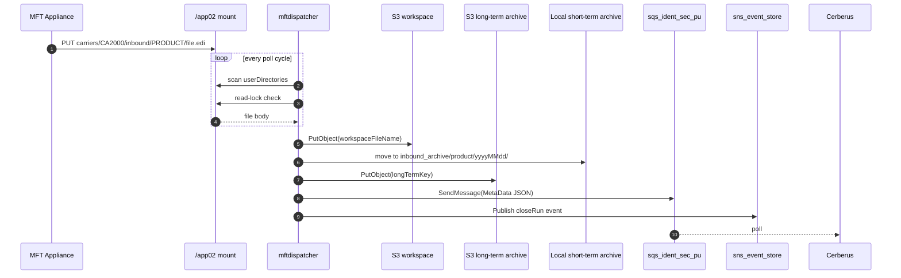
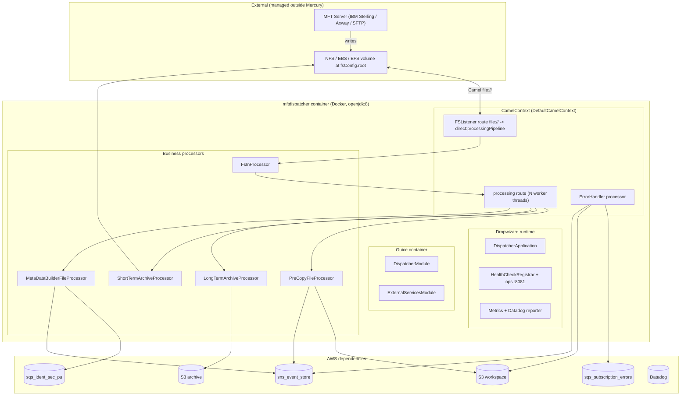
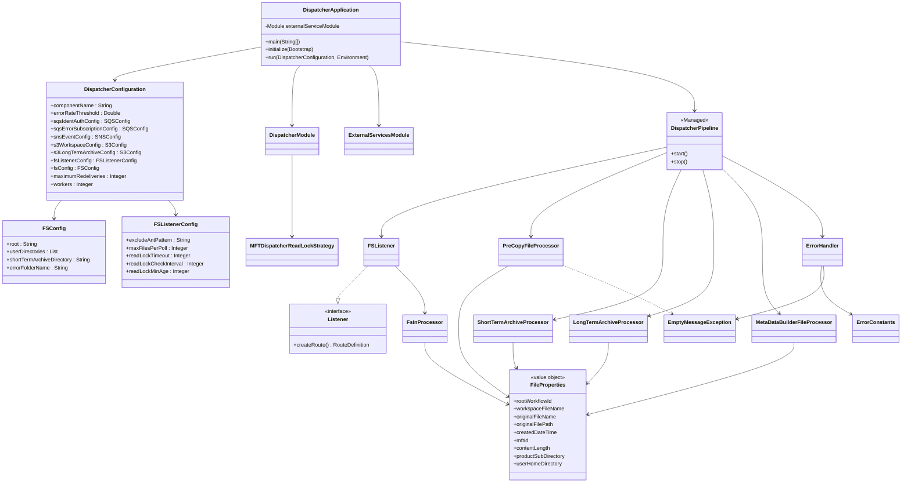
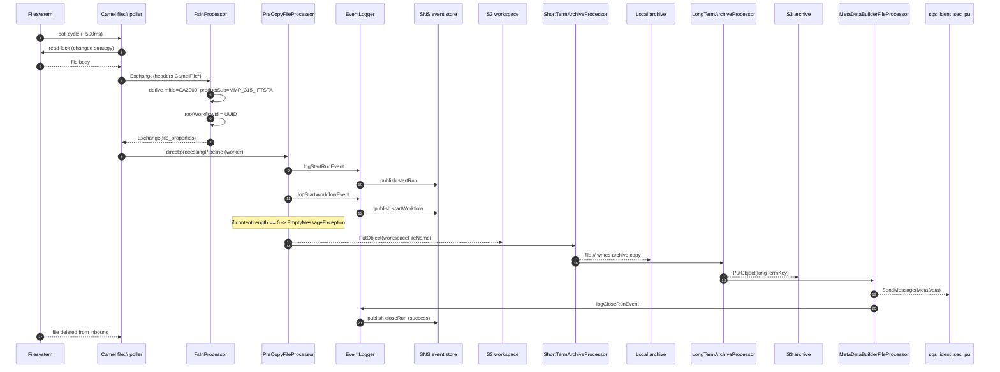
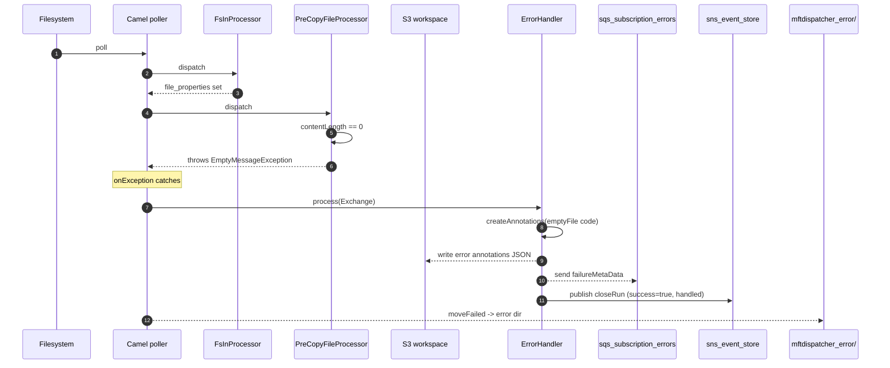
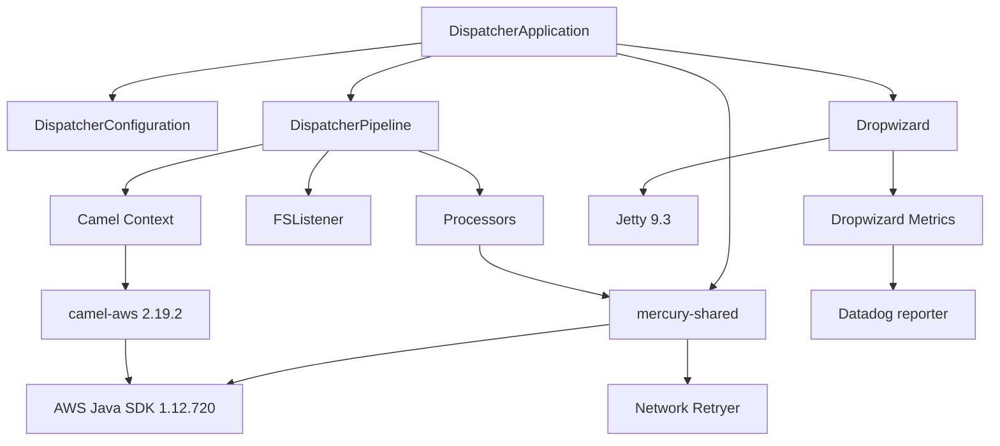

# MFT-Dispatcher Module — Architecture & Design

> **Author:** Principal Engineering Review · **Date:** 2026-05-24 · **Module Version:** 1.0-SNAPSHOT

---

## 1. Executive Summary

The `mftdispatcher` module is the **Managed File Transfer (MFT) ingress** for the Appian Way / Mercury platform. It is a long-running Dropwizard service that acts as the bridge between the carrier-facing MFT landing zone (a locally mounted filesystem that an upstream MFT server — historically IBM Sterling File Gateway, Axway SecureTransport, or an SFTP relay — drops files into) and the rest of the Mercury workflow pipeline.

Conceptually it is a near-clone of the regular [dispatcher](../../dispatcher/) module, but instead of being driven by S3 `ObjectCreated` notifications via SQS, this dispatcher variant uses **Apache Camel's `file://` consumer endpoints** to *poll* a tree of MFT landing directories on the local filesystem (mounted from the MFT appliance via NFS / shared volume). Files that pass the read-lock / quiescence checks are atomically picked up, uploaded to the **workspace S3 bucket**, archived locally (short-term) and to S3 (long-term), and finally a `MetaData` JSON envelope is emitted onto the **`sqs_ident_sec_pu`** SQS queue — the same queue that the regular dispatcher feeds into Cerberus (identity / authorisation). Errors are diverted to a dedicated error SQS queue, the file is moved to a per-partner error sub-tree, and a `closeRun` event with failure status is published to the SNS event store.

Key facts:

| Aspect | Value |
|---|---|
| Artifact | `com.inttra.mercury.mftdispatcher:mftdispatcher:1.0-SNAPSHOT` |
| Main class | `com.inttra.mercury.mftdispatcher.DispatcherApplication` |
| Framework | Dropwizard 1.1.1 + Google Guice 4.1.0 + Apache Camel 2.19.2 |
| Pickup transport | Apache Camel `file://` polling consumer (no SFTP / FTPS / S3 client) |
| Egress | AWS SQS (dropoff), AWS S3 (workspace + long-term archive), AWS SNS (event store) |
| Java | 1.8 (Dockerfile base `openjdk:8`) |
| Health checks | Outbound SQS × 2, S3 Write, SNS Publish, error rate threshold |

A subtle but important takeaway: **`mftdispatcher` does not embed any MFT protocol client.** It does not speak SFTP, AS2, FTPS, IBM Sterling Connect:Direct, or Axway Advanced File Transfer protocols itself. The actual MFT delivery is performed by a separate (out-of-module) MFT appliance that lands files into a shared mounted directory tree rooted at `fsConfig.root`. The mftdispatcher then polls that mount.

---

## 2. Position in the Mercury Pipeline

```mermaid
flowchart LR
    subgraph CARRIER["Carrier Origin"]
        C1["Carrier MFT Client<br/>(SFTP / AS2 / Connect:Direct)"]
    end
    subgraph MFT["MFT Appliance (out of scope)"]
        M1["IBM Sterling FG / Axway / SFTP relay"]
        M2["Landing zone /app02/carriers/MFT_ID/inbound/PRODUCT/"]
    end
    subgraph MERC["Mercury - mftdispatcher (THIS MODULE)"]
        D1["Camel file:// poller"]
        D2["FsInProcessor"]
        D3["PreCopyFileProcessor"]
        D4["aws-s3:// workspace bucket"]
        D5["ShortTermArchiveProcessor + file://"]
        D6["LongTermArchiveProcessor + aws-s3://"]
        D7["MetaDataBuilderFileProcessor"]
    end
    subgraph DOWN["Downstream Mercury"]
        Q1[("sqs_ident_sec_pu")]
        CER["cerberus / ident-auth"]
        SNS[("sns_event_store")]
    end
    C1 --> M1 --> M2
    M2 -. "NFS mount /app02" .- D1
    D1 --> D2 --> D3 --> D4 --> D5 --> D6 --> D7 --> Q1 --> CER
    D3 -.->|startRun events| SNS
    D7 -.->|closeRun event| SNS
```



### 2.1 Where MFT-Dispatcher sits

The Mercury platform has two symmetric ingress points:

1. **`dispatcher`** — S3 → SQS triggered ingress. Customers/partners upload via HTTPS/API, S3 workspace bucket fires `ObjectCreated`, regular dispatcher consumes it.
2. **`mftdispatcher`** — *this* module. MFT-driven ingress.

Both emit semantically equivalent `MetaData` messages onto the same downstream queue. The rest of the pipeline is unaware which ingress originated the file. The only differentiating field is `projections.mftId` (set only by mftdispatcher) and `component` (`mftdispatcher` vs `dispatcher`).

### 2.2 Producer / consumer contract



### 2.3 Why an MFT-specific dispatcher exists

1. **Trust boundary** — MFT files arrive over bilateral carrier trust relationships. `mftId` is derived from the directory path, not from any header. Encoding that convention in the regular dispatcher would pollute it.
2. **Polling vs push** — S3 ingress is event-driven; MFT is filesystem-driven. The plumbing (Camel `file://` with read-lock strategy) is materially different from an SQS-driven consumer.
3. **Archive semantics** — MFT ingress requires *two* archive copies: on-disk short-term and S3 long-term. Regular dispatcher only needs S3.

---

## 3. High-Level Architecture



### 3.1 Layered view

Four concentric rings:

1. **Bootstrap layer** — `DispatcherApplication` (Dropwizard `Application<DispatcherConfiguration>`) plus `DispatcherConfiguration`. Parses CLI args, loads `mftdispatcher.yaml`, materialises the Guice injector, registers health checks.
2. **Wiring layer** — `DispatcherModule` and `ExternalServicesModule`. Expose the configuration, build AWS clients (S3, SQS, SNS), build the singleton `CamelContext`.
3. **Pipeline layer** — `DispatcherPipeline` (Managed lifecycle wrapper) plus `FSListener` (route builder). Defines the Camel topology in `start()`.
4. **Domain processors** — `FsInProcessor`, `PreCopyFileProcessor`, `ShortTermArchiveProcessor`, `LongTermArchiveProcessor`, `MetaDataBuilderFileProcessor`, `ErrorHandler`. Each is a Camel `Processor` mutating the `Exchange`. The `FileProperties` value object carries state across processors via the `file_properties` property key.

### 3.2 Process model

The route is bisected by `direct:processingPipeline`. The first half (polling consumer) runs on Camel's file consumer thread; the second half (S3 upload, archives, SQS publish) runs on a dedicated thread pool sized by `configuration.getWorkers()`. The `errorHandler(new NoErrorHandlerBuilder())` on the processing route means errors in the second-half are not auto-redelivered; they propagate up to the parent route's `onException(Exception.class).process(errorHandler)`.

### 3.3 Concurrency rationale

Pickup is serialised per file (per-file read-lock) but processing is parallel. Typical production: `workers: 10`, `maxFilesPerPoll: 100`. The pipeline absorbs bursts of up to ~100 files per cycle, with up to 10 in flight concurrently against AWS.

---

## 4. Low-Level Design

### 4.1 Camel route topology

Two `RouteDefinition` instances added at startup:

```
[ file://root/userDir1, file://root/userDir2, ... ]
        |
        v
  FsInProcessor              (Camel file consumer thread)
        |
        v
   onException(Exception.class)
       |-- log "Unable to process input file"
       \-- process(ErrorHandler) (no rethrow; terminal)
        |
        v
  to("direct:processingPipeline")
                 |
                 v
   from("direct:processingPipeline")
        .threads(workers)
        .process(PreCopyFileProcessor)
        .to("aws-s3://workspaceBucket?amazonS3Client=#s3Client")
        .process(ShortTermArchiveProcessor)
        .to("file://root")
        .process(LongTermArchiveProcessor)
        .to("aws-s3://archiveBucket?amazonS3Client=#s3Client")
        .process(MetaDataBuilderFileProcessor)
```

The `file://` endpoint is used as both a **consumer** (route 1) and a **producer** (route 2 short-term archiving) — clever reuse that keeps I/O semantics consistent with Camel's atomic temp+rename.

### 4.2 The `FSListener` poller URI

[`FSListener.createPollerOptionsString()`](../src/main/java/com/inttra/mercury/mftdispatcher/listener/FSListener.java) builds:

```
file:///app02/carriers/CA2000/inbound/MMP_315_IFTSTA
    ?antExclude=*.tmp,*.1
    &moveFailed=/app02/mftdispatcher_error/${exchangeProperty.file_properties.userHomeDirectory}/${exchangeProperty.file_properties.productSubDirectory}/${file:name.noext}_${exchangeProperty.file_properties.rootWorkflowId}_${date:now:yyyyMMddHHmmssSSS}.${file:ext}
    &readLock=changed
    &readLockTimeout=1000
    &readLockCheckInterval=250
    &readLockMinLength=0
    &readLockMinAge=30000
    &readLockDeleteOrphanLockFiles=false
    &maxMessagesPerPoll=100
    &delete=true
```

| Option | Default | Behaviour |
|---|---|---|
| `antExclude` | `*.tmp,*.1` | Skip transient temp files and rotated partial uploads. |
| `moveFailed` | per-file expression | Camel moves failed-pickup files to `mftdispatcher_error/...`. References `file_properties` populated by `FsInProcessor`. |
| `readLock=changed` | — | Camel samples size+mtime twice with `readLockCheckInterval` between samples; if unchanged, lock is acquired. |
| `readLockTimeout` | 1000 ms | Max total time for the lock; if exceeded, file is skipped. |
| `readLockCheckInterval` | 250 ms | Sleep between sample attempts. |
| `readLockMinLength` | 0 | Allow zero-byte files (rejected later by `EmptyMessageException`). |
| `readLockMinAge` | 30000 ms | File must be at least 30s older than the poll cycle. |
| `readLockDeleteOrphanLockFiles=false` | — | Orphan `.camelLock` files persist; SRE inspects manually. |
| `maxMessagesPerPoll` | 100 | Cap per poll cycle. |
| `delete=true` | — | Delete source after successful processing. |

The poller interval itself uses Camel defaults (500ms initial, 500ms idle) — **not configurable in YAML**. Latent risk.

### 4.3 `MFTDispatcherReadLockStrategy` (currently unused)

[`MFTDispatcherReadLockStrategy`](../src/main/java/com/inttra/mercury/mftdispatcher/processor/MFTDispatcherReadLockStrategy.java) extends `FileChangedExclusiveReadLockStrategy` and is registered into the `SimpleRegistry` as `mftDispatcherLockStrategy`. However, `FSListener` does **not** reference it — `readLock=changed` causes Camel to instantiate its own default strategy. The custom strategy is wired but unreferenced (dead code).

### 4.4 `Exchange` evolution

| Stage | In headers added | Properties added |
|---|---|---|
| `file://` consumer | `CamelFilePath`, `CamelFileName*`, `CamelFileLength`, `CamelFileLastModified`, `CamelFileParent`, body=`GenericFile` | — |
| `FsInProcessor` | `CamelAwsS3Key`, `CamelAwsS3ContentType`, `file_properties` | `file_properties` |
| `PreCopyFileProcessor` | `CamelAwsS3UserMetadata`, `CamelAwsS3ContentLength` | `startRunEvent`, `metaData` |
| `ShortTermArchiveProcessor` | `CamelFileName` (overridden) | — |
| `LongTermArchiveProcessor` | `CamelAwsS3Key` (overridden), `CamelAwsS3ContentType` | — |
| `MetaDataBuilderFileProcessor` | — | — — calls `sqsClient.sendMessage(...)` |

`FileProperties` is the cross-stage backbone — immutable (`@Builder` + `@Data`, all final).

### 4.5 `FsInProcessor` path-to-metadata mapping

Most carrier-specific logic:

```java
String fPath = inbound.getHeader("CamelFileParent", String.class);
String productSubDirectory = fPath.substring(fPath.lastIndexOf(File.separator) + 1);
String userHomeDirectory = fPath.substring(configuration.getFsConfig().getRoot().length() + 1,
        fPath.indexOf("inbound") - 1);
String mftId = userHomeDirectory.substring(userHomeDirectory.lastIndexOf(File.separator) + 1);
```

Assumes:

```
${fsConfig.root}/${userHomeDirectory}/inbound/${productSubDirectory}/${fileName}
```

For default `carriers/CA2000/inbound/MMP_315_IFTSTA`:
- `fPath` = `/app02/carriers/CA2000/inbound/MMP_315_IFTSTA`
- `productSubDirectory` = `MMP_315_IFTSTA`
- `userHomeDirectory` = `carriers/CA2000`
- `mftId` = `CA2000`

`mftId` is therefore derived implicitly from the directory path. A `TODO` acknowledges this should move to Network Services lookup.

### 4.6 `MetaData` projections

| Projection | Source |
|---|---|
| `MFT_ID` | Directory path-derived |
| `PICKUP_FILENAME` | `FileProperties.originalFileName` |
| `FILE_CREATED_TIME` | File's last-modified time at pickup |
| `DISPATCHER_RECEIVED_TIME` | `startRunEvent` timestamp |

All three workflow IDs (`rootWorkflowId`, `workflowId`, `parentWorkflowId`) are assigned the same UUID — MFT pickup is the absolute start of a workflow.

---

## 5. Key Classes — Class Diagram



### 5.1 Class catalogue

| Class | Role |
|---|---|
| `DispatcherApplication` | Dropwizard `Application` entry point |
| `DispatcherPipeline` | Managed Camel lifecycle |
| `DispatcherConfiguration` | Root config POJO |
| `FSConfig` | Filesystem layout config |
| `FSListenerConfig` | Read-lock / poll config |
| `DispatcherModule` | Guice wiring (Camel, SNS publisher) |
| `ExternalServicesModule` | Guice wiring for AWS clients & retry |
| `Listener` | Strategy interface |
| `FSListener` | Filesystem polling route builder |
| `FsInProcessor` | Builds `FileProperties` from path |
| `PreCopyFileProcessor` | Start events + S3 metadata |
| `ShortTermArchiveProcessor` | Local archive path |
| `LongTermArchiveProcessor` | S3 archive key |
| `MetaDataBuilderFileProcessor` | SQS publish + closeRun |
| `MFTDispatcherReadLockStrategy` | Custom strategy (unused) |
| `FileProperties` | Cross-stage value object |
| `ErrorHandler` | Error branch processor |
| `EmptyMessageException` | Zero-byte file business exception |
| `ErrorConstants` | Error codes and metric names |

---

## 6. Data Flow Diagram

### 6.1 Happy path



### 6.2 Empty-file (business error) flow



### 6.3 Path / name templates summary

| Artifact | Template | Example |
|---|---|---|
| Pickup directory | `${fsConfig.root}/${userDir}` | `/app02/carriers/CA2000/inbound/MMP_315_IFTSTA` |
| S3 workspace key | `${rootWorkflowId}/${uuid}` | `7b2a.../d4c1...` |
| Local archive | `${userHomeDirectory}/inbound_archive/${productSub}/${yyyyMMdd}/${name}.${rootWorkflowId}.${uuid}.${ext}` | `carriers/CA2000/inbound_archive/MMP_315_IFTSTA/20260524/pickup-edi.7b2a.d4c1.txt` |
| Long-term S3 key | `${productSub}/${yyyyMMdd}/${name}.${rootWorkflowId}.${uuid}.${ext}` | `MMP_315_IFTSTA/20260524/pickup-edi.7b2a.d4c1.txt` |
| Error path | `${root}/${errorFolderName}/${userHomeDir}/${productSub}/${name}_${rootWorkflowId}_${ts}.${ext}` | `/app02/mftdispatcher_error/carriers/CA2000/MMP_315_IFTSTA/pickup-edi_7b2a_20260524103015123.txt` |

---

## 7. Component Dependencies

### 7.1 Internal (Mercury) dependencies

Single shared Maven dependency `com.inttra.mercury.shared:mercury-shared:1.0`. Consumed symbols:

| Symbol | Used by | Purpose |
|---|---|---|
| `S3ConfigurationProvider` | `DispatcherApplication` | Optional bootstrap-from-S3 config source |
| `ConfigProcessingServerCommand` | `DispatcherApplication` | Custom `run` CLI command (parses `.properties` placeholders) |
| `HealthCheckRegistrar` + `*HealthCheck` | `DispatcherApplication` | Registers liveness/readiness checks |
| `EventPublisher`, `SNSEventPublisher`, `SNSClient` | `DispatcherModule` | SNS publishing |
| `S3WorkspaceService`, `WorkspaceService` | `DispatcherModule` | S3 read/write abstraction |
| `NetworkRetryerModule` | `ExternalServicesModule` | Resilience4j retry |
| `EventLogger`, `Event`, `RandomGenerator` | `PreCopyFileProcessor`, `MetaDataBuilderFileProcessor` | Event lifecycle |
| `SQSClient` | `MetaDataBuilderFileProcessor` | SQS publish wrapper |
| `MetaData`, `MetaData.Builder`, `MetaData.Projection` | All processors | Canonical message envelope |
| `Annotations`, `ErrorHelper` | `ErrorHandler` | Error annotation publishing |
| `Json` | `PreCopyFileProcessor` | JSON serialisation |

### 7.2 External dependencies

| GAV | Version | Purpose |
|---|---|---|
| `io.dropwizard:dropwizard-core` | 1.1.1 | Web framework, lifecycle, metrics, ConfigSourceProvider, Jetty |
| `com.google.inject:guice` | 4.1.0 | DI container |
| `com.google.guava:guava` | 22.0 | ImmutableList/Map, Files extension helpers |
| `org.apache.camel:camel-aws` | 2.19.2 | Brings camel-core, camel-file, camel-aws-s3, camel-aws-sqs |
| `com.amazonaws:aws-java-sdk-sqs` | 1.12.720 | SQS client (significantly newer than Camel's transitive SDK — risk) |
| `com.palominolabs.metrics:metrics-guice` | 3.1.3 | `@Metered` AOP on Guice objects |
| `org.projectlombok:lombok` | 1.16.16 | Compile-time codegen |
| `org.zapodot:hystrix-bundle` | transitive | Hystrix metrics bundle (legacy) |

### 7.3 AWS infrastructure dependencies

| AWS resource | Role | Config key |
|---|---|---|
| S3 workspace bucket | Verbatim payload + error annotations | `s3WorkspaceConfig.bucket` |
| S3 long-term archive | Indefinite retention copy | `s3LongTermArchiveConfig.bucket` |
| SQS `sqs_ident_sec_pu` | Dropoff to Cerberus | `sqsIdentAuthConfig.queueUrl` |
| SQS `sqs_subscription_errors` | Error dropoff | `sqsErrorSubscriptionConfig.queueUrl` |
| SNS `sns_event_store` | Run/event audit topic | `snsEventConfig.topicArn` |
| Datadog (HTTP) | Metrics reporter | `metrics.reporters[]` |

IAM role must grant: `s3:PutObject`, `s3:GetObject`, `sqs:SendMessage` × 2, `sns:Publish`.

### 7.4 Filesystem dependency

Persistent mount at `fsConfig.root` (default `/app02`). Required permissions:
- `{root}/{userDir}` — read+delete (pickup)
- `{root}/{userHomeDir}/inbound_archive/...` — write+mkdir (short-term archive)
- `{root}/mftdispatcher_error/...` — write+mkdir (error quarantine)

### 7.5 Dependency graph



---

## 8. Configuration & Validation

### 8.1 Configuration sources & merging

Loaded by `ConfigProcessingServerCommand`. Merge order (per Dockerfile args):

1. Inline `${var:-default}` placeholders in `mftdispatcher.yaml`.
2. `mftdispatcher.properties` overrides.
3. `network-services.properties` (deployment configuration repo, AWS endpoint overrides).
4. `datadog.properties` (Datadog tags, API key per environment).
5. Environment variables `${PROFILE}` and `${ENV}` interpolated last.
6. Optional S3-sourced config via `S3ConfigurationProvider.requiresS3Configuration()`.

### 8.2 Full configuration matrix

| Key | Type | Default | Required | Description | Validation |
|---|---|---|---|---|---|
| `componentName` | String | `mftdispatcher` | yes | Component identifier embedded in events/metrics | `@NotNull` |
| `errorRateThreshold` | Double | `5.0` | yes | Errors-per-sec threshold (5-min moving avg) | `@NotNull @Digits(2,2)` |
| `fsConfig.root` | String | `/app02` | yes | Filesystem root for pickup/archive/error | `@NotNull` |
| `fsConfig.userDirectories` | List<String> | `[]` | yes | Per-partner pickup subpaths (relative to root) | `@NotNull` |
| `fsConfig.shortTermArchiveDirectory` | String | `inbound_archive` | yes | Subfolder for on-disk archive copy | `@NotNull` |
| `fsConfig.errorFolderName` | String | `mftdispatcher_error` | yes | Subfolder under root for failed file quarantine | `@NotNull` |
| `fsListenerConfig.maxFilesPerPoll` | Integer | `100` | yes | Cap on files per Camel poll cycle | `@NotNull @Digits(4,0)` |
| `fsListenerConfig.excludeAntPattern` | String | `*.tmp,*.1` | yes | Ant glob patterns to ignore | `@NotNull` |
| `fsListenerConfig.readLockTimeout` | Integer (ms) | `1000` | yes | Max time to wait for read lock | `@NotNull @Digits(4,0)` |
| `fsListenerConfig.readLockCheckInterval` | Integer (ms) | `250` | yes | Sleep between lock samples | `@NotNull @Digits(4,0)` |
| `fsListenerConfig.readLockMinAge` | Integer (ms) | `30000` | yes | File must be older than this to be eligible | `@NotNull @Digits(4,0)` |
| `workers` | Integer | `10` | yes | Thread pool size for `direct:processingPipeline` | `@NotNull @Digits(2,0)` |
| `maximumRedeliveries` | Integer | `5` | yes | Unused (commented out in `DispatcherPipeline`) | `@NotNull @Digits(2,0)` |
| `sqsIdentAuthConfig.queueUrl` | String | — | yes | Dropoff SQS queue URL | `@NotNull` |
| `sqsErrorSubscriptionConfig.queueUrl` | String | — | yes | Error SQS queue URL | `@NotNull` |
| `snsEventConfig.topicArn` | String | — | yes | SNS topic ARN | `@NotNull` |
| `s3WorkspaceConfig.bucket` | String | — | yes | S3 bucket for workspace + error annotations | `@NotNull` |
| `s3LongTermArchiveConfig.bucket` | String | — | yes | S3 bucket for long-term archive | `@NotNull` |
| `server.connector.port` | Integer | `8081` | no | Admin/ops HTTP port | Dropwizard default |
| `logging.level` | String | `INFO` | no | Root log level | Dropwizard |

### 8.3 Validation behaviour

`@NotNull` violations cause Dropwizard `ConfigurationValidationException` at startup. Fail-fast — no graceful degradation. There is **no validation** that:
- `fsConfig.root` actually exists or is writable
- `userDirectories` exist under root
- IAM permissions are correct

These are runtime failures.

---

## 9. Maven Dependencies

| GroupId : Artifact | Version | Scope | Why |
|---|---|---|---|
| `com.inttra.mercury.shared:mercury-shared` | 1.0 | compile | Cross-module shared utilities |
| `org.projectlombok:lombok` | 1.16.16 | provided | Lombok annotations |
| `io.dropwizard:dropwizard-core` | 1.1.1 | compile | Framework |
| `com.amazonaws:aws-java-sdk-sqs` | 1.12.720 | compile | SQS v1 client — significantly newer than Camel 2.19's transitive SDK; nearest-wins resolution risks API drift. Risk. |
| `com.google.inject:guice` | 4.1.0 | compile | DI |
| `com.google.guava:guava` | 22.0 | compile | ImmutableCollections, file utils |
| `org.apache.camel:camel-aws` | 2.19.2 | compile | Camel + AWS components (file://, aws-s3, aws-sqs) |
| `com.palominolabs.metrics:metrics-guice` | 3.1.3 | compile | Guice AOP for `@Metered` |
| `com.inttra.mercury.test:functional-testing` | 1.0 | test | Functional test base |
| `junit:junit` | 4.12 | test | Unit test framework |
| `org.mockito:mockito-core` | 2.8.9 | test | Mocking |

### 9.1 Build plugins

| Plugin | Purpose |
|---|---|
| `maven-compiler-plugin` | Java 1.8 source/target |
| `maven-shade-plugin` 2.3 | Uber-jar with main class `com.inttra.mercury.mftdispatcher.DispatcherApplication`. Excludes `META-INF/*.SF/.DSA/.RSA` |

---

## 10. How the Module Works — Detailed Walkthrough

Tracing one execution: carrier `CA2000` delivers a 2 KB IFTSTA EDI file via SFTP, MFT server places it at `/app02/carriers/CA2000/inbound/MMP_315_IFTSTA/315_20260524103011.edi`.

### 10.1 Service startup (T = boot)

1. Docker runs `java -jar /app/dispatcher-1.0-SNAPSHOT.jar run dispatcher.yaml /app/dispatcher.properties /app/network-services.properties /app/datadog.properties`.
2. `DispatcherApplication.main(args)` instantiates and invokes `run(args)`.
3. `initialize(Bootstrap)`:
   - If `S3ConfigurationProvider.requiresS3Configuration()`, config fetched from S3.
   - Adds `ConfigProcessingServerCommand` (reads `.properties` placeholders, substitutes into YAML).
   - Adds `HystrixBundle` (exposes Hystrix metrics).
4. Dropwizard parses YAML, runs Hibernate Validator. Any `@NotNull` miss → exit 1.
5. `run(configuration, environment)` creates Guice injector with `ExternalServicesModule` + `DispatcherModule`.

### 10.2 Pipeline start

1. `fsListener.createRoute()` returns RouteDefinition rooted at `from(file://path1, file://path2, ...)`.
2. Pipeline decorates with `onException(Exception.class) → log → process(errorHandler) → end (no rethrow)`.
3. Then `to("direct:processingPipeline")`.
4. Second route from `direct:processingPipeline`:
   - `.errorHandler(new NoErrorHandlerBuilder())` (no-op; exceptions propagate up).
   - `.threads(workers)`.
   - Sequence: PreCopy → aws-s3 (workspace) → ShortTermArchive → file:// → LongTermArchive → aws-s3 (archive) → MetaDataBuilder.
5. Both routes added; `camelContext.start()` — Camel registers consumers, starts file poller thread.

### 10.3 File pickup (T = 1)

MFT server completes SFTP write at T=0. At T=0.5s, Camel poller scans `/app02/carriers/CA2000/inbound/MMP_315_IFTSTA`:

1. Ant exclusion (`*.tmp,*.1`) does not match.
2. `readLockMinAge=30000` — file only 0.5s old. **Skipped.**
3. ~60 polls later at T=30.5s, age check passes.
4. `readLock=changed` — samples `size+mtime`, sleeps 250ms, samples again. Unchanged. Lock acquired.
5. Body loaded into `GenericFile`. Exchange created with `CamelFilePath`, `CamelFileLength`, `CamelFileLastModified`, etc.

### 10.4 `FsInProcessor` derives:

```
rootWorkflowId       = UUID
workspaceFileName    = "7b2a.../d4c1..."
contentLength        = 2048
filePath             = "/app02/carriers/CA2000/inbound/MMP_315_IFTSTA/315_20260524103011.edi"
fileName             = "315_20260524103011.edi"
productSubDirectory  = "MMP_315_IFTSTA"
userHomeDirectory    = "carriers/CA2000"
mftId                = "CA2000"
```

Sets `file_properties` exchange property, `S3Constants.KEY` and `S3Constants.CONTENT_TYPE` headers, sends Exchange to `direct:processingPipeline`.

### 10.5 `PreCopyFileProcessor` (worker thread)

1. `runId = randomUUID()`.
2. Builds S3 user metadata, sets headers.
3. Builds initial `MetaData` with projection `MFT_ID`.
4. `eventLogger.logStartRunEvent` — SNS `startRun` event with `runTag=mftdispatcherRun`.
5. `eventLogger.logStartWorkflowEvent` — SNS `startWorkflow`.
6. Stores `startRunEvent` and `metaData` on exchange properties.
7. `if (contentLength == 0) throw new EmptyMessageException()` — after events published.

### 10.6–10.9 Downstream stages

S3 workspace upload → `ShortTermArchiveProcessor` (local archive path) → `file://` writes local copy → `LongTermArchiveProcessor` (S3 archive key) → `aws-s3:` upload → `MetaDataBuilderFileProcessor` (SQS publish + closeRun).

### 10.10 Error path

If any processor throws, exception bubbles to parent route's `onException(Exception.class)`. `ErrorHandler`:

1. Recovers exception via `Exchange.EXCEPTION_CAUGHT`.
2. Recovers `startRunEvent` and `metaData` (may be null if failure was in `FsInProcessor`).
3. `errorHelper.createAnnotations(exception, ERROR_CODES, UNHANDLED_ERROR)` — `ERROR_CODES` only contains `EmptyMessageException`; everything else gets the system code.
4. `errorHelper.writeErrorsToS3` — annotations JSON written alongside original key in workspace bucket.
5. `errorHelper.sendToErrorQueue` — failure `MetaData` posted to error SQS.
6. `eventLogger.logCloseRunEvent(..., status)` — `status = ERROR_CODES.containsKey(exception)`. Business errors are "successful runs"; system errors are flagged for alerting.
7. `@Metered(messages-failed)` increments.
8. Camel's `moveFailed` still moves the source file to error directory.

### 10.11 Shutdown

SIGTERM → Dropwizard `LifecycleEnvironment.stop` → `DispatcherPipeline.stop()` → `camelContext.stop()`. Default Camel shutdown timeout 300s.

---

## 11. Error Handling & Edge Cases

### 11.1 Error taxonomy

| Code | Mapped from | `success` in closeRun | Health impact |
|---|---|---|---|
| `/exception/dispatcher/business/messagePipeline/emptyFile` | `EmptyMessageException` | `true` | Still increments `messages-failed` |
| `/exception/dispatcher/system/messagePipeline/systemException` | Any other `Exception` | `false` | Increments `messages-failed` |

### 11.2 Empty file detail

`PreCopyFileProcessor` raises empty-file exception *after* publishing `startRun` and `startWorkflow`. The `aws-s3:` send happens next in the route, so the throw aborts before the workspace PUT. Error branch then writes annotations JSON to S3 (at the same key the body would have used).

### 11.3 Half-written files

Primary defence: `readLock=changed` + `readLockMinAge=30000`. A file still being uploaded fails the "unchanged for 250ms" sample. The 30-second min age insures against fragmented writes.

### 11.4 Camel `.camelLock` orphans

`readLockDeleteOrphanLockFiles=false` means JVM kill mid-file leaves `.camelLock` blocking reprocessing. **Manual intervention required.**

### 11.5 Disk-full

`/app02` full → archive write fails → IOException → ErrorHandler. But S3 PUT already succeeded (runs before local archive). So workspace S3 has the file, long-term S3 and local archive do NOT. Error SQS receives failureMetaData. Source moved to error directory. **Partial-success state**: no compensating action.

### 11.6 SQS / S3 / SNS failures

Wrapped by `NetworkRetryerModule`. AWS SDK default retry (3 retries, exponential backoff). After exhaustion → `AmazonServiceException` → ErrorHandler (system error, `success=false`).

### 11.7 Camel route restart on failure

`.maximumRedeliveries(...)` is **commented out**. No redelivery. Error branch runs exactly once, file moved to error directory. Re-driving requires SRE action.

### 11.8 Path-derivation edge cases

`FsInProcessor` assumes substring `"inbound"` is present in parent path. A `userDirectory` not following `partner/inbound/product` convention → `fPath.indexOf("inbound")` returns `-1` → substring throws `StringIndexOutOfBoundsException`. Becomes system error. No defensive check.

---

## 12. Operational Notes

### 12.1 Health checks

| Endpoint | Source | Behaviour |
|---|---|---|
| `GET /healthcheck` | Dropwizard default | All registered checks |
| `GET /ops/healthcheck/read` | Mercury convention | Read-only checks |
| `GET /ops/healthcheck/write` | Mercury convention | Write checks (SQS×2, S3, SNS) |

### 12.2 Metrics

Dispatched to Datadog. Key metrics:

| Metric | Type | Meaning |
|---|---|---|
| `...ErrorHandler.messages-failed` | Meter | Failures/sec (5-min moving avg feeds health check) |
| `jvm.memory.heap.*` | Gauge | Heap usage |
| `jvm.threads.*` | Gauge | Thread counts |

The Datadog API key is committed in plaintext in `mftdispatcher.yaml` — **security risk**. See §13.

### 12.3 Capacity planning

- **Steady state**: 100 files/poll × 0.5s/poll = ~200 files/sec theoretical. Real throughput gated by S3 PUT latency (10-50ms). With `workers=10`, ~200-1000 files/sec sustained.
- **File size**: No explicit cap. Camel streams body into memory for `aws-s3` producer. Large files (>100MB) risk memory pressure.
- **Disk**: Short-term archive accumulates. External cleanup job required.

### 12.4 Re-driving files

If file ends up in error directory:

1. Inspect `${root}/mftdispatcher_error/<userHomeDir>/<productSub>/<name>_<rootWorkflowId>_<ts>.<ext>`.
2. If retriable, rename (strip suffix) and move back to pickup directory.
3. Poller picks up. A new `rootWorkflowId` is minted (audit shows two separate runs).

### 12.5 Scaling

Each instance owns its own poll loop. Multiple instances on shared NFS root → `.camelLock` is the cross-instance mutex per file. Not battle-tested for HA. Conservative deployment: **single active, hot-standby behind orchestration.**

### 12.6 Boundary with regular dispatcher

| Concern | dispatcher | mftdispatcher |
|---|---|---|
| Trigger | S3 ObjectCreated → SQS | file:// poller |
| Workspace bucket | shared | shared |
| Dropoff queue | sqs_ident_sec_pu | sqs_ident_sec_pu (same) |
| Component name in events | `dispatcher` | `mftdispatcher` |
| `mftId` projection | absent | present |

---

## 13. Open Questions / Risks

| # | Item | Severity | Recommendation |
|---|---|---|---|
| 1 | `MFTDispatcherReadLockStrategy` registered but never referenced. | Medium | Reference via `&readLockStrategyRef=#mftDispatcherLockStrategy` or remove. |
| 2 | `S3Constants.CONTENT_TYPE` hard-coded to `text/plain` in two places. | Medium | Use `Files.probeContentType` or Tika; fall back to `application/octet-stream`. |
| 3 | `fsConfig.shortTermArchiveDirectory` configurable but `ShortTermArchiveProcessor` hardcodes `"inbound_archive"`. | Low | Inject configured value. |
| 4 | `maximumRedeliveries` configurable but unused (commented out). | Low | Remove or wire through. |
| 5 | `FsInProcessor` fragile substring assumes `inbound` in path. | Medium | Validate at startup; require regex match. |
| 6 | S3 PUT happens before local archive write. Local fail → S3 has file. | Medium | Reverse order or compensate. |
| 7 | Datadog API key committed in plaintext in YAML. | High | Move to env var / secrets manager. |
| 8 | Dockerfile says `dispatcher-1.0-SNAPSHOT.jar`, but module produces `mftdispatcher-*`. | High | Audit CI; align Dockerfile to artifact name. |
| 9 | `aws-java-sdk-sqs:1.12.720` paired with `camel-aws:2.19.2` (2017). | Medium | Upgrade Camel or pin SDK version. |
| 10 | `readLockDeleteOrphanLockFiles=false` + no auto-cleanup → orphan locks jam files indefinitely. | Medium | Startup sweep detecting orphan locks older than N minutes. |
| 11 | No upper bound on file size; body may be loaded in memory. | Medium | S3 transfer manager multipart; size validation in `FsInProcessor`. |
| 12 | `userHomeDirectory` substring extraction not OS-separator agnostic. | Low | Use `Paths.get(...)`. |
| 13 | No metric on file age at pickup. | Low | Histogram of `now - file.lastModified`. |
| 14 | `errorRateThreshold` `@Digits(2,2)` permits max 99.99 only. | Low | `@Min(0.0)` no upper bound. |
| 15 | No backpressure signal on slow AWS. Poller keeps feeding direct:. | Medium | Tune direct: capacity or use `directVm:` with explicit bounds. |
| 16 | Hystrix bundle installed but no Hystrix commands. | Low | Remove or apply to AWS SDK calls. |
| 17 | No correlation between SQS DLQ and workspace S3 annotations. | Low | Include workspace S3 key in error message. |

---

## Appendix A — Glossary

| Term | Meaning |
|---|---|
| MFT | Managed File Transfer — IBM Sterling, Axway, Globalscape, etc. |
| Mercury | Internal codename for the Appian Way data plane |
| Cerberus | Downstream identity / authorisation pipeline |
| Workspace bucket | S3 bucket holding live payloads while a workflow runs |
| Long-term archive | S3 bucket for indefinite-retention copies |
| Workflow ID | UUID identifying one ingested file's lifecycle |
| Run ID | UUID identifying one component's execution within a workflow |
| Projection | Key/value pair on `MetaData` envelope used as downstream lookup hint |
| `mftId` | Partner identifier derived from MFT landing-directory tree |
| Read-lock | Camel mechanism for ensuring quiescence before pickup |

---

*End of document.*
