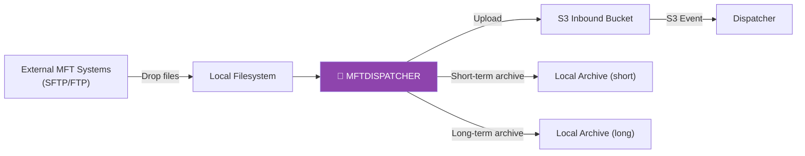
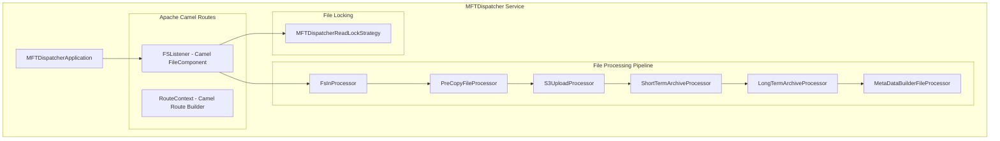
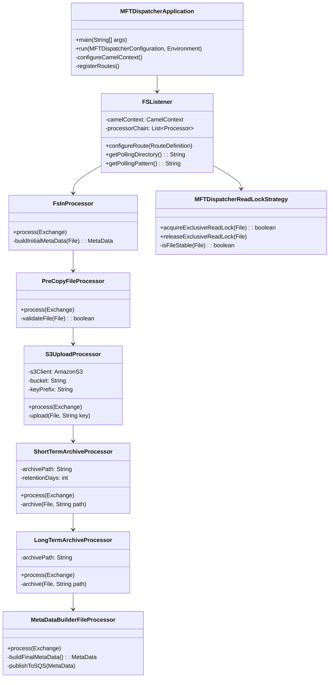
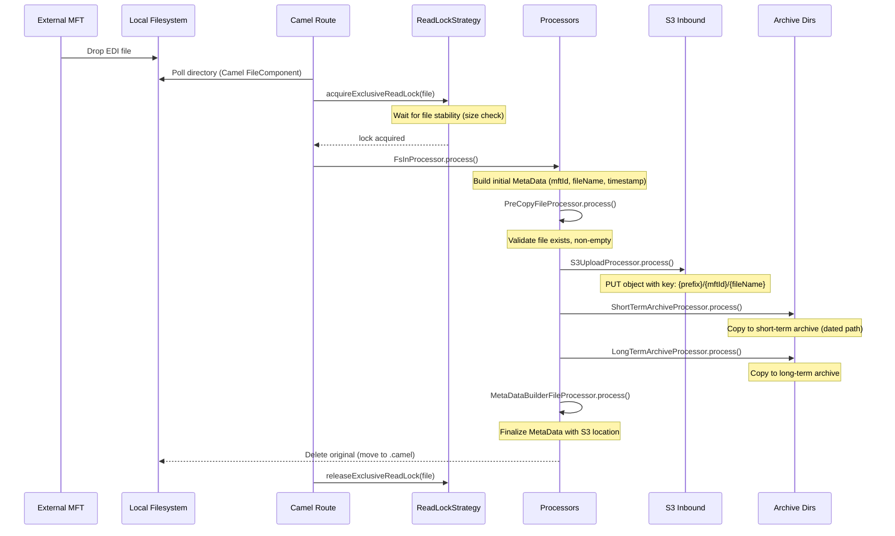
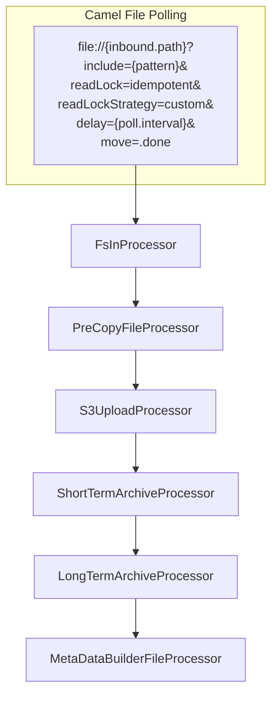

# MFTDispatcher Module — Design Document

> **Module:** `mftdispatcher`  
> **Generated:** 2026-05-24  
> **Artifact:** `com.inttra.mercury.mftdispatcher:mftdispatcher:1.0-SNAPSHOT`  
> **Java Version:** 8 | **Framework:** Dropwizard 1.1.1 + Guice 4.1.0 + Apache Camel 2.19.2

---

## 1. Executive Summary

The **MFTDispatcher** (Managed File Transfer Dispatcher) is the legacy file ingestion gateway. It polls local filesystem directories for incoming EDI files deposited by external MFT systems (SFTP/FTP gateways), uploads them to S3, archives them locally (short-term + long-term), and triggers the downstream pipeline by publishing metadata to the Dispatcher's inbound queue. It uses Apache Camel for filesystem polling and route orchestration.

> ⚠️ **Legacy Module:** Uses older Java 8, Dropwizard 1.1.1, and Guice 4.1.0 (unlike other modules at Java 17/Dropwizard 4.x).

---

## 2. Role in the Pipeline

---

## 3. High-Level Architecture

---

## 4. Class Diagram

---

## 5. Data Flow Diagram

---

## 6. Camel Route Configuration

---

## 7. File Locking Strategy

The `MFTDispatcherReadLockStrategy` ensures files are fully written before processing:

| Check | Mechanism | Purpose |
|-------|-----------|---------|
| File stability | Size comparison over time | Detect active writes |
| Exclusive lock | Java NIO FileLock | Prevent concurrent access |
| Idempotency | Camel idempotent repository | Prevent re-processing |

---

## 8. Archive Strategy

| Archive | Path Pattern | Retention | Purpose |
|---------|-------------|-----------|---------|
| Short-term | `{archive.short}/{date}/{mftId}/` | Configurable days | Quick troubleshooting |
| Long-term | `{archive.long}/{date}/{mftId}/` | Indefinite | Compliance/audit |
| Camel `.done` | `{inbound.path}/.done/` | Cleanup managed | Camel internal |

---

## 9. Configuration Details

| Property | Type | Default | Description |
|----------|------|---------|-------------|
| `inbound.path` | String | — | Directory to poll |
| `inbound.pattern` | String | `*` | File inclusion pattern |
| `inbound.pollInterval` | int | `5000` | Poll frequency (ms) |
| `s3.bucket` | String | — | Inbound S3 bucket |
| `s3.keyPrefix` | String | — | S3 key prefix |
| `archive.short.path` | String | — | Short-term archive dir |
| `archive.short.retentionDays` | int | `7` | Short archive retention |
| `archive.long.path` | String | — | Long-term archive dir |
| `sqs.queueUrl` | String | — | Output notification queue |
| `readLock.checkInterval` | int | `1000` | Stability check interval |
| `readLock.timeout` | int | `30000` | Lock acquisition timeout |

---

## 10. Key Maven Dependencies

| Dependency | Version | Purpose |
|-----------|---------|---------|
| `mercury-shared` | 1.0 | S3, SQS, MetaData |
| `camel-core` | 2.19.2 | Route orchestration |
| `camel-aws` | 2.19.2 | S3 integration |
| `dropwizard-core` | 1.1.1 | Application framework (legacy) |
| `guice` | 4.1.0 | DI container (legacy) |
| `aws-java-sdk-s3` | 1.12.x | S3 upload |
| `aws-java-sdk-sqs` | 1.12.x | Queue notification |
| `commons-io` | 2.x | File utilities |
| `lombok` | 1.18.x | Code generation |

---

## 11. Error Handling

| Scenario | Behavior |
|----------|----------|
| File locked by MFT | ReadLock waits until stable |
| S3 upload failure | Camel error handler → retry route |
| Archive failure | Log error, continue processing |
| Empty/invalid file | PreCopyFileProcessor rejects → error log |
| Permission denied | Camel marks as failed, retries on next poll |

---

## 12. Legacy Considerations

| Aspect | MFTDispatcher | Modern Modules |
|--------|---------------|----------------|
| Java version | 8 | 17 |
| Dropwizard | 1.1.1 | 4.0.16 |
| Guice | 4.1.0 | 7.0.0 |
| javax vs jakarta | javax.* | jakarta.* |
| Architecture | Camel routes | SQS-driven tasks |
| Trigger | Filesystem polling | SQS long-poll |

This module is a candidate for modernization to align with the rest of the AppianWay stack.
