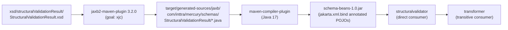
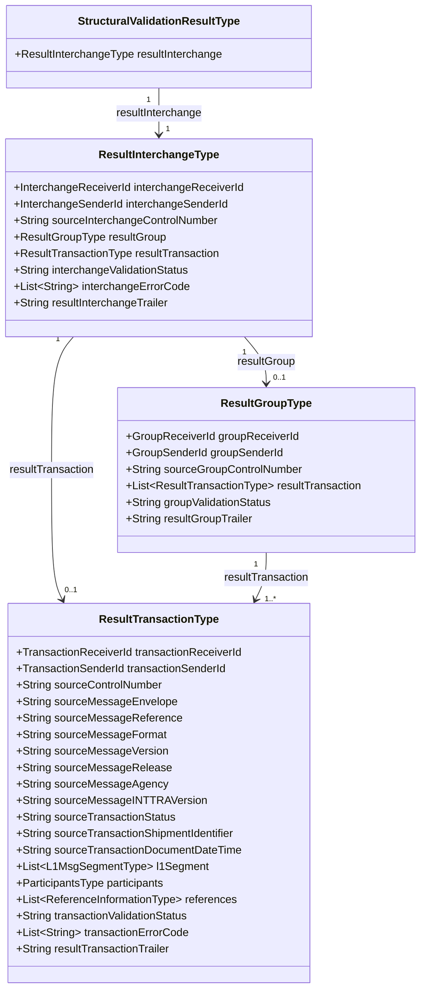
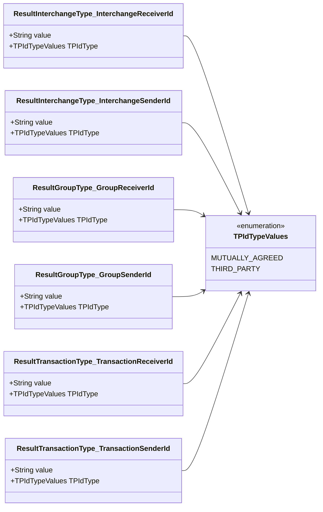
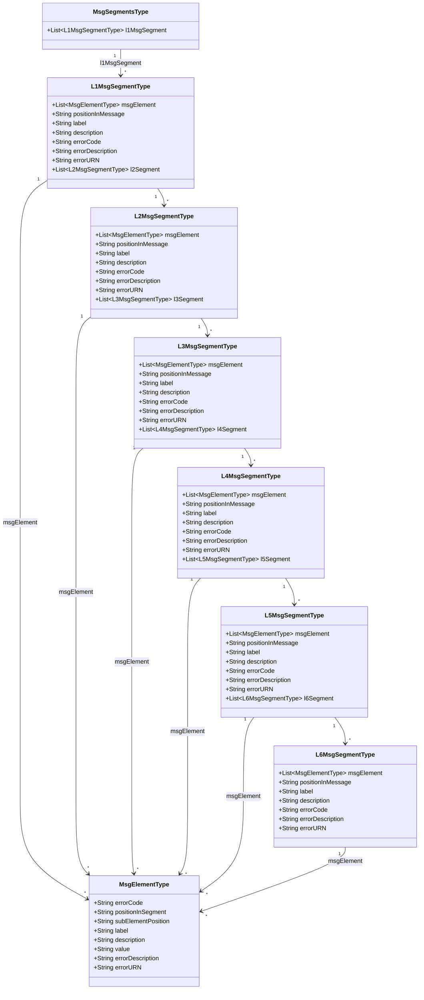
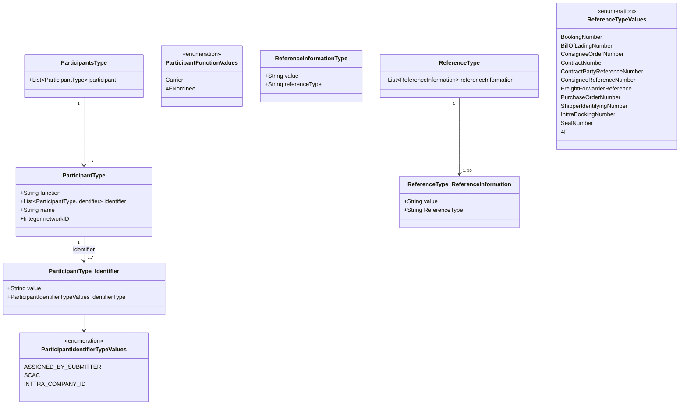
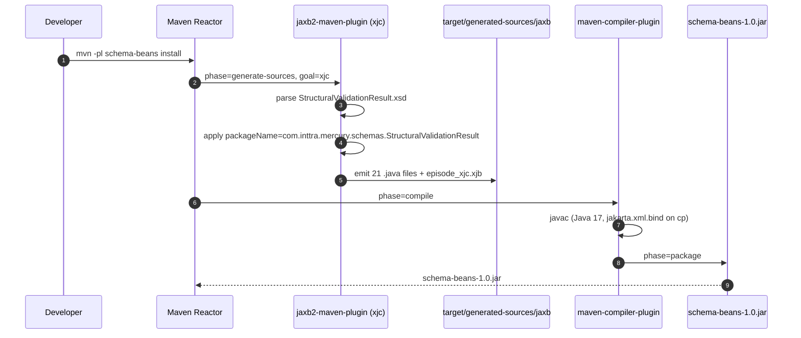
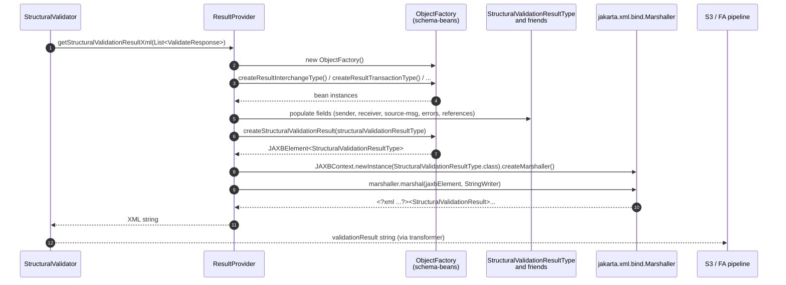
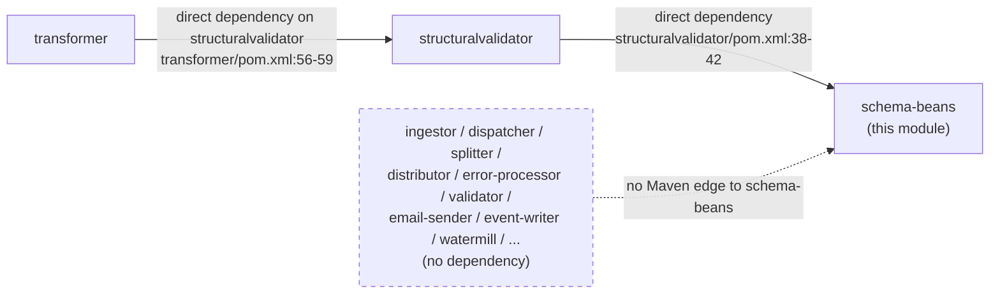
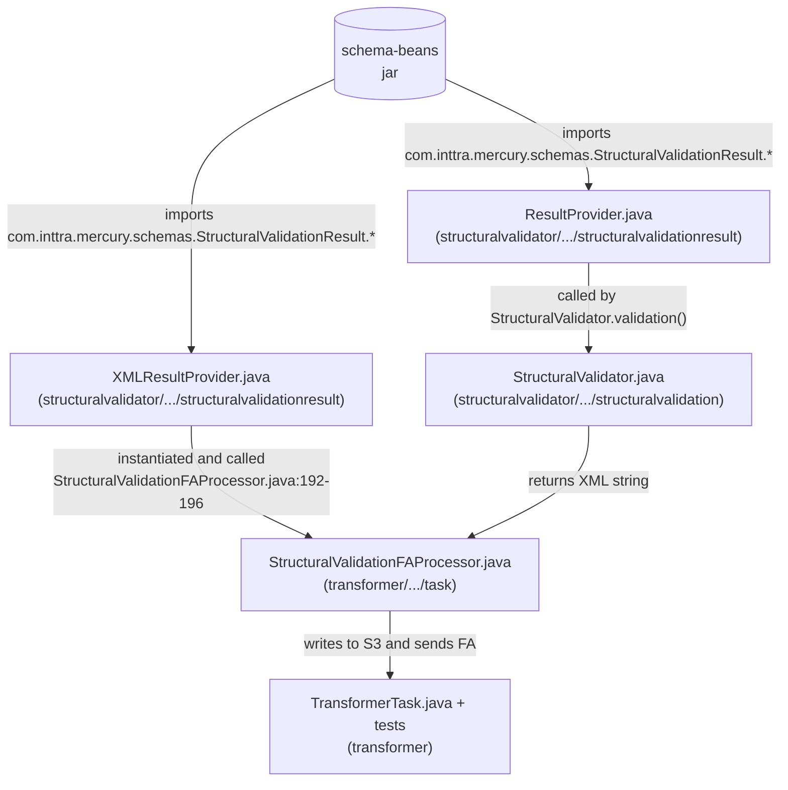

# Schema-Beans Module — Architecture & Design

> **Author:** Principal Engineering Review · **Date:** 2026-05-24 · **Module Version:** `1.0` (`com.inttra.mercury.schema-beans:schema-beans:1.0`, declared at [`schema-beans/pom.xml:7-9`](../pom.xml))

---

## 1. Executive Summary

The `schema-beans` module is the **canonical XML data-model library** of the Appian Way / Mercury platform. It contains no hand-written Java source code; rather, it is a *build-time-only* module whose entire artifact is produced by compiling **XML Schema (XSD)** files into **JAXB**-annotated Java classes via the `jaxb2-maven-plugin`. The output is a single JAR (`schema-beans-1.0.jar`) that exposes a fixed, schema-bound API: an `ObjectFactory`, value types, and `jakarta.xml.bind`-annotated POJOs.

In strategic terms, this module enshrines the **contract** between INTTRA's traditional EDI/EDIFACT processing pipeline and the downstream "Functional Acknowledgment" (FA) family of validation responses. The schema it carries — `StructuralValidationResult` (initial publication August 21, 2017; copyright INTTRA, Inc., 2017) — describes the *structural validation outcome* of an inbound EDIFACT or XML transaction at three nesting levels (Interchange -> Group -> Transaction) and at up to six nesting depths of message segments (L1 -> L6).

Today the module is *minimal in scope but architecturally significant*. It packages exactly one schema. Its only first-party Maven consumer is the `structuralvalidator` module, which uses the generated beans to build the structural-validation response XML/JSON that the platform marshals back to trading partners and that the `transformer` module then ferries onward as the Functional Acknowledgment payload. The module is therefore best thought of as a **shared contract jar** — a small but load-bearing piece of the FA pipeline.

The Principal Engineering position is the following:

- **Why this module exists:** to decouple the wire-format contract (XSD) from the consumer Java code, so that the schema can evolve independently and the consumer always picks up a fresh, compiler-checked binding.
- **Why it is small:** historically, the Mercury platform has used **canonical JSON beans** (the sibling `canonical-beans` module) for its internal pipeline message representation and reserves XSD/JAXB for the *response* artifacts that have an externally-governed XML grammar (i.e., the INTTRA FA response shape). `schema-beans` is the surviving JAXB toehold in an otherwise JSON-first system.
- **Why it deserves attention now:** the module already runs on **Jakarta XML Binding 4.0.2** (the Jakarta EE 10 namespace, `jakarta.xml.bind.*`), and that migration is fully visible in the generated sources. The codebase that depends on it (e.g., `structuralvalidator`) consistently imports `jakarta.xml.bind` rather than the legacy `javax.xml.bind`, confirming the module's role in driving the broader pipeline's javax-to-jakarta migration.

A reviewer reading this document end-to-end should walk away with a complete mental model of: (a) the schema's semantic structure, (b) the JAXB build pipeline that produces the beans, (c) every type in the generated package and how it nests, (d) the *single* downstream Maven consumer and the *handful* of classes that touch the beans, and (e) the risks, smells, and follow-up items that warrant action.

---

## 2. Role in the Mercury Pipeline

The Mercury / Appian Way pipeline is an event-driven message processor whose top-level modules are listed in the parent aggregator POM at [`pom.xml:34-51`](../../pom.xml):

```
shared, structuralvalidator, schema-beans, gen2-parser, functional-testing, event-writer,
dispatcher, splitter, transformer, distributor, distributor-rest, ingestor,
error-processor, email-sender, watermill-publisher, watermill
```

Plus the unaggregated siblings on disk: `canonical-beans`, `cerberus`, `configuration`, `fulfiller`, `load-testing`, `mftdispatcher`, `router`, `validator`.

Within that pipeline, `schema-beans` sits in the **structural-validation lane**. Its operational responsibility is to provide the *output schema* of the structural validator: the canonical XML envelope that reports whether an inbound EDIFACT/XML message conforms structurally, and, if not, exactly which segment, element, sub-element, and position contained the offending data.

### 2.1 The structural-validation lane in one paragraph

When the platform receives a partner message (e.g., an IFTSTA or IFTMBF EDIFACT interchange, or its XML equivalent), the **`structuralvalidator`** module parses the wire format against a rule set, produces a `List<ValidateResponse>` of per-segment validation findings, and then hands that list to the **`ResultProvider`** class (or, for plain-XML messages, to the **`XMLResultProvider`** class). Those two providers construct a JAXB object graph rooted at `StructuralValidationResultType` — using exactly the beans this module emits — and marshal it to either an XML string (JAXB `Marshaller`) or a JSON string (Jackson `ObjectMapper`). The **`transformer`** module then takes that already-serialized string and writes it to S3 / forwards it as the FA payload. The transformer never touches the beans themselves; only the structural validator does.

### 2.2 Where the beans are *not* used

In contrast to the long list of pipeline modules above, only **two source files** in the entire repository import `com.inttra.mercury.schemas.StructuralValidationResult.*` (confirmed by a project-wide grep):

- [`structuralvalidator/src/main/java/com/inttra/mercury/structuralvalidator/common/structuralvalidationresult/ResultProvider.java`](../../structuralvalidator/src/main/java/com/inttra/mercury/structuralvalidator/common/structuralvalidationresult/ResultProvider.java) — EDIFACT path.
- [`structuralvalidator/src/main/java/com/inttra/mercury/structuralvalidator/common/structuralvalidationresult/XMLResultProvider.java`](../../structuralvalidator/src/main/java/com/inttra/mercury/structuralvalidator/common/structuralvalidationresult/XMLResultProvider.java) — XML/Control-message path.

And only **one POM** declares a Maven dependency on `schema-beans` outside the parent aggregator:

- [`structuralvalidator/pom.xml:38-42`](../../structuralvalidator/pom.xml) — `com.inttra.mercury.schema-beans:schema-beans:1.0`.

This is a deliberately narrow surface area. The contract bean library is a **direct dependency of one module and a transitive dependency** of everything downstream of `structuralvalidator` (notably `transformer`, which depends on `structuralvalidator` per [`transformer/pom.xml:56-59`](../../transformer/pom.xml)).

### 2.3 The "Edifact-style message" framing

The task description asks which Edifact-style canonical message models the module defines. The honest answer: **`schema-beans` does not define the message bodies themselves**. The platform's canonical message body schemas live in `canonical-beans` (JSON-first) and in `gen2-parser` (EDIFACT parsing grammar). What `schema-beans` carries is the **structural-validation *outcome* model** — a meta-message describing the validation of a primary EDIFACT (or XML) document.

That said, the outcome model **mirrors the EDIFACT envelope shape**. The XSD's three top-level result containers are:

- `ResultInterchangeType` — equivalent to the EDIFACT `UNB`…`UNZ` interchange envelope.
- `ResultGroupType` — equivalent to the EDIFACT `UNG`…`UNE` group envelope (optional in many EDIFACT dialects).
- `ResultTransactionType` — equivalent to the EDIFACT `UNH`…`UNT` message envelope.

And it carries source-message metadata fields (`SourceMessageFormat`, `SourceMessageVersion`, `SourceMessageRelease`, `SourceMessageAgency`, `SourceMessageINTTRAVersion`, `SourceMessageEnvelope`, `SourceMessageReference`) that map directly to EDIFACT `UNH` and `UNB` data elements. Concretely, in `ResultProvider.set_SourceMessageParameter` ([`ResultProvider.java:158-184`](../../structuralvalidator/src/main/java/com/inttra/mercury/structuralvalidator/common/structuralvalidationresult/ResultProvider.java)) those source-message fields are filled from `UNH01`, `UNH02.1`, `UNH02.2`, `UNH02.3`, `UNH02.4` — exactly the EDIFACT control number and message-type composite data element components.

So while the *schema itself* is "an XML reporting envelope," its **semantic alignment is one-to-one with EDIFACT structural concepts**. That is why this module is rightly framed as part of the EDI canonical layer.

### 2.4 INTTRA lineage

The XSD's annotation header at [`StructuralValidationResult.xsd:3-22`](../xsd/structuralValidationResult/StructuralValidationResult.xsd) preserves the INTTRA change log from 2017, including the additions of:

- 5th and 6th segment-nesting levels (Sept 26 and Oct 2, 2017).
- Transaction and Interchange error code elements (Nov 7, 2017).
- XML-Functional-Acknowledgment-specific fields: `SourceTransactionStatus`, `SourceTransactionShipmentIdentifier`, `SourceTransactionDocumentDateTime` (Nov 7, 2017).
- `SourceMessageINTTRAVersion` for INTTRA Format / IG version reporting (Nov 15, 2017).

The schema has not received a documented change since 2017-11-15. This is consistent with its role as a **stable external contract** — change implies coordination with trading partners.

---

## 3. High-Level Architecture



The high-level architecture is intentionally trivial:

1. A single XSD file is the **source of truth**.
2. `jaxb2-maven-plugin` (Codehaus Mojo) runs `xjc` at the `generate-sources` phase, emitting one Java source file per top-level XSD type into `target/generated-sources/jaxb` under the package `com.inttra.mercury.schemas.StructuralValidationResult`.
3. The standard Maven lifecycle then compiles those sources and packages them into `schema-beans-1.0.jar`.
4. Exactly one first-party Maven module — `structuralvalidator` — declares the JAR as a dependency.
5. All other modules in the pipeline that ever touch the schema do so **transitively**, via `structuralvalidator` (e.g., `transformer`), or do not touch the beans at all and merely shuttle the *marshaled string* downstream.

There is no test source set, no `src/main/java`, no `src/main/resources`, no Lombok, no Dropwizard, no Guice. The module is a pure schema-to-jar pipeline. This minimalism is a **feature**: it forces all customization to live in the XSD (or in supplementary `.xjb` binding files if introduced), and prevents the bean shapes from drifting away from the schema.

---

## 4. Low-Level Design

### 4.1 POM anatomy

The complete POM is short (82 lines, [`schema-beans/pom.xml:1-82`](../pom.xml)). It declares:

| Element | Value | Reference |
|---|---|---|
| `groupId` | `com.inttra.mercury.schema-beans` | [`pom.xml:7`](../pom.xml) |
| `artifactId` | `schema-beans` | [`pom.xml:8`](../pom.xml) |
| `version` | `1.0` | [`pom.xml:9`](../pom.xml) |
| `packaging` | `jar` | [`pom.xml:10`](../pom.xml) |
| `java.version` property | `17` | [`pom.xml:15`](../pom.xml) |
| `jaxb2-maven-plugin.version` property | `3.2.0` | [`pom.xml:16`](../pom.xml) |

Notably, the module does **not** inherit from the parent aggregator POM — there is no `<parent>` element. The parent at [`pom.xml`](../../pom.xml) merely lists `schema-beans` in its `<modules>` so that `mvn -pl ...` and reactor builds can pick it up. Every other Mercury module *does* sit independent of a parent as well (the parent is purely an aggregator), so this is consistent with project convention.

### 4.2 Runtime dependencies

Listed at [`pom.xml:19-46`](../pom.xml):

1. **`jakarta.xml.bind:jakarta.xml.bind-api:4.0.2`** — the Jakarta EE 10 JAXB API (`jakarta.xml.bind.*` namespace). This is what the generated classes import.
2. **`com.sun.xml.bind:jaxb-core:4.0.5`** — Eclipse / GlassFish JAXB reference-implementation core.
3. **`com.sun.xml.bind:jaxb-impl:4.0.5`** — JAXB RI runtime implementation. Together with `jaxb-core`, this gives consumers a working marshaller/unmarshaller out of the box without requiring them to add JAXB runtime themselves.
4. **`javax.activation:javax.activation-api:1.2.0`** — JavaBeans Activation Framework, required for certain XML data types (MIME). This is the **legacy `javax.activation`** package, not `jakarta.activation`; a small inconsistency given the rest of the dependency block is Jakarta-namespaced.
5. **`com.fasterxml.jackson.core:jackson-databind:2.10.0`** — Jackson, used downstream (`ResultProvider.getStructuralValidationResultJSON` at [`ResultProvider.java:340-343`](../../structuralvalidator/src/main/java/com/inttra/mercury/structuralvalidator/common/structuralvalidationresult/ResultProvider.java)) to serialize the same JAXB-bean object graph as JSON. Bundling Jackson directly into the schema-bean JAR is unusual; see Risks (§13) for commentary.

There are no `<scope>test</scope>` dependencies and there is no test classpath — `target/test-classes` is created by the build but remains empty.

### 4.3 Build plugin configuration

The build section ([`pom.xml:48-81`](../pom.xml)) declares two plugins:

1. **`maven-compiler-plugin`** (no explicit version) — configured with `source=17`, `target=17`. Inherits its version from the Maven Super POM unless overridden by the central enforcer. It compiles the generated sources.
2. **`jaxb2-maven-plugin` 3.2.0** (`org.codehaus.mojo`) — the XJC driver. Its single `<execution>` is:

```xml
<execution>
  <id>xjc</id>
  <goals><goal>xjc</goal></goals>
  <configuration>
    <sources>
      <source>xsd/structuralValidationResult/StructuralValidationResult.xsd</source>
    </sources>
    <failOnNoSchemas>true</failOnNoSchemas>
    <packageName>com.inttra.mercury.schemas.StructuralValidationResult</packageName>
    <clearOutputDir>false</clearOutputDir>
  </configuration>
</execution>
```

Three configuration choices worth highlighting:

- **`failOnNoSchemas=true`** — defensive. If the `<source>` path is moved or deleted, the build fails fast instead of producing an empty JAR.
- **`packageName`** explicitly forces the target package to `com.inttra.mercury.schemas.StructuralValidationResult` regardless of the schema's `targetNamespace` (which the XSD actually does not declare — the schema has no `targetNamespace`, only `elementFormDefault="qualified"`). Without the explicit `packageName`, XJC would derive a package from the namespace, and with no namespace it would default to `generated`.
- **`clearOutputDir=false`** — preserves existing generated sources between runs. In combination with the `target/generated-sources/jaxb` output directory (the plugin default), this avoids unnecessary file deletion churn on incremental builds. The trade-off: stale generated classes could survive a schema deletion. With a single-XSD module this is academic.

There is **no `<xjbSources>` configured**, meaning no source-level customization bindings file is in use. The `episode_xjc.xjb` that appears under `target/generated-sources/jaxb/META-INF/JAXB/` ([`episode_xjc.xjb`](../target/generated-sources/jaxb/META-INF/JAXB/episode_xjc.xjb)) is an *emitted* episode file (produced by XJC as a by-product of `--episode` mode), not a customization input. The plugin appears to emit it by default at version 3.2.0.

### 4.4 Plugin version implications

`jaxb2-maven-plugin` 3.2.0 is the first major version of the plugin built against the **Jakarta** JAXB API (the 2.x line targets `javax.xml.bind`). This is what causes the generated sources to import `jakarta.xml.bind.*` rather than `javax.xml.bind.*`. The plugin documentation pegs 3.x to the Eclipse Implementation of JAXB v3.0.x, and the emitted episode file's header at [`episode_xjc.xjb:5`](../target/generated-sources/jaxb/META-INF/JAXB/episode_xjc.xjb) confirms: "This file was generated by the Eclipse Implementation of JAXB, v3.0.2".

### 4.5 Output layout

After a successful `mvn package`, the module produces:

```
target/
|-- classes/                      # compiled generated beans (no other classes)
|-- generated-sources/
|   `-- jaxb/
|       |-- com/inttra/mercury/schemas/StructuralValidationResult/
|       |   |-- DateFormatValues.java
|       |   |-- L1MsgSegmentType.java ... L6MsgSegmentType.java
|       |   |-- MsgElementType.java
|       |   |-- MsgErrorType.java
|       |   |-- MsgSegmentsType.java
|       |   |-- ObjectFactory.java
|       |   |-- ParticipantIdentifierTypeValues.java
|       |   |-- ParticipantsType.java
|       |   |-- ParticipantType.java
|       |   |-- ReferenceInformationType.java
|       |   |-- ReferenceType.java
|       |   |-- ResultGroupType.java
|       |   |-- ResultInterchangeType.java
|       |   |-- ResultTransactionType.java
|       |   |-- StructuralValidationResultType.java
|       |   `-- TPIdTypeValues.java
|       `-- META-INF/JAXB/episode_xjc.xjb
|-- jaxb2/                        # plugin work directory
|-- test-classes/                 # empty
`-- schema-beans-1.0.jar          # final artifact
```

21 generated Java source files (17 type classes + 1 `ObjectFactory` + 3 typesafe enum classes, where the 17 includes the nested static classes that the JAXB compiler emits as separate `.java` files when sequences contain anonymous complexTypes).

### 4.6 Customization strategy — current and desirable

There are **no `.xjb` source-level bindings**. All customization is done inline in the XSD (or by plugin configuration). The most consequential customization is the explicit `packageName`. Bean class names track the XSD `complexType` names 1:1 because the XSD uses `Type`-suffixed complex types, and JAXB keeps those names verbatim under the `<jaxb:class>` rule (an exception being the **anonymous** complex types inside `<xs:element>` wrappers — those become nested `static` classes such as `ResultInterchangeType.InterchangeReceiverId` and `ParticipantType.Identifier`, visible in the `ObjectFactory` factory methods at [`ObjectFactory.java:187-241`](../target/generated-sources/jaxb/com/inttra/mercury/schemas/StructuralValidationResult/ObjectFactory.java)).

If the schema grew, the *correct next step* would be to introduce an external `.xjb` file (e.g., `src/main/xjb/bindings.xjb`) and reference it via the plugin's `<xjbSources>` configuration. This would let the team customize property names, suppress `JAXBElement<T>` wrappers, generate `@XmlEnumValue`-friendly enums, and add `@XmlJavaTypeAdapter` adapters without modifying the XSD itself. See Risks (§13).

### 4.7 Jakarta vs javax — migration audit

Every generated class imports `jakarta.xml.bind.*`. Every first-party consumer (`structuralvalidator/ResultProvider.java`, `XMLResultProvider.java`) also imports `jakarta.xml.bind.*` (confirmed at [`ResultProvider.java:27-30`](../../structuralvalidator/src/main/java/com/inttra/mercury/structuralvalidator/common/structuralvalidationresult/ResultProvider.java) and [`XMLResultProvider.java:8-10`](../../structuralvalidator/src/main/java/com/inttra/mercury/structuralvalidator/common/structuralvalidationresult/XMLResultProvider.java)).

The single residual `javax` artifact is `javax.activation:javax.activation-api:1.2.0` at [`pom.xml:36-39`](../pom.xml). Modern Jakarta builds would use `jakarta.activation:jakarta.activation-api:2.1.x`. This is a low-risk follow-up: see §13.

---

## 5. Key Schemas / Beans — Class Diagram

This section enumerates every generated type and shows their composition. All classes live in package `com.inttra.mercury.schemas.StructuralValidationResult` and are produced from [`StructuralValidationResult.xsd`](../xsd/structuralValidationResult/StructuralValidationResult.xsd).

### 5.1 Top-level root and envelope hierarchy



Key XSD references:

- `StructuralValidationResultType` complex type: [`StructuralValidationResult.xsd:72-76`](../xsd/structuralValidationResult/StructuralValidationResult.xsd).
- `ResultInterchangeType`: [`StructuralValidationResult.xsd:77-112`](../xsd/structuralValidationResult/StructuralValidationResult.xsd).
- `ResultGroupType`: [`StructuralValidationResult.xsd:113-146`](../xsd/structuralValidationResult/StructuralValidationResult.xsd).
- `ResultTransactionType`: [`StructuralValidationResult.xsd:147-193`](../xsd/structuralValidationResult/StructuralValidationResult.xsd).

Observations from a senior-engineer standpoint:

- The shape is **deliberately denormalized**: a `ResultInterchange` may directly contain *either* a `ResultGroup` (which then contains `1..*` `ResultTransaction`s) *or* a single `ResultTransaction` directly. This mirrors EDIFACT interchanges, which optionally include a group envelope. JAXB models both alternatives as nullable fields rather than as a choice; the consumer (`ResultProvider`) is responsible for ensuring at most one is populated.
- `ResultInterchange.resultGroup` has `minOccurs="0" maxOccurs="1"` but **`resultTransaction` is also `minOccurs="0" maxOccurs="1"` at the interchange level** ([`StructuralValidationResult.xsd:107`](../xsd/structuralValidationResult/StructuralValidationResult.xsd)) — meaning the schema does not enforce mutual exclusivity. In practice the EDIFACT consumer (`ResultProvider`) always populates `resultTransaction` and leaves `resultGroup` null (see [`ResultProvider.java:84-102`](../../structuralvalidator/src/main/java/com/inttra/mercury/structuralvalidator/common/structuralvalidationresult/ResultProvider.java)).

### 5.2 Sender/Receiver nested types

The schema repeats the pattern of `<simpleContent>` extending `xs:string` with an optional `TPIdType` attribute six times (once per sender/receiver at each of the three envelope levels). JAXB compiles each anonymous `<xs:complexType>` to a nested static class on the enclosing type.



Note: `ResultGroupType.GroupSenderId.TPIdType` has `use="prohibited"` at [`StructuralValidationResult.xsd:132`](../xsd/structuralValidationResult/StructuralValidationResult.xsd) — a peculiar XSD smell. The author probably intended to express that the group-sender always speaks for itself (no third-party translation). JAXB still emits the attribute getter/setter; the generated setter simply throws no validator-side error if used. Real enforcement happens at marshal/unmarshal time only when the bean is validated against the XSD, which this codebase does not do (the marshaller writes XML without re-validating against the schema).

### 5.3 Message-segment nesting (L1 -> L6)

The XSD encodes the EDIFACT *segment / group / nested-group* hierarchy through **six explicitly-distinct types** (`L1MsgSegmentType` through `L6MsgSegmentType`), each containing the next deeper level. This is verbose but explicit; it allows generated XML elements to carry semantically distinct names per level.



XSD references:

- `L1MsgSegmentType`: [`StructuralValidationResult.xsd:199-210`](../xsd/structuralValidationResult/StructuralValidationResult.xsd).
- `L2`–`L6`: [`StructuralValidationResult.xsd:211-269`](../xsd/structuralValidationResult/StructuralValidationResult.xsd).
- `MsgElementType`: [`StructuralValidationResult.xsd:270-281`](../xsd/structuralValidationResult/StructuralValidationResult.xsd).
- `MsgSegmentsType`: [`StructuralValidationResult.xsd:194-198`](../xsd/structuralValidationResult/StructuralValidationResult.xsd).

Design notes:

- **`MsgSegmentsType` is an orphan.** It is declared in the schema ([`StructuralValidationResult.xsd:194-198`](../xsd/structuralValidationResult/StructuralValidationResult.xsd)) but is **not referenced by any other element** in the schema. JAXB still emits a class for it (see [`ObjectFactory.java:95-97`](../target/generated-sources/jaxb/com/inttra/mercury/schemas/StructuralValidationResult/ObjectFactory.java) for the factory method `createMsgSegmentsType`). Dead schema is dead code. Recommend removing in the next schema revision.
- **`MsgErrorType` is also orphaned.** [`StructuralValidationResult.xsd:282-288`](../xsd/structuralValidationResult/StructuralValidationResult.xsd) declares `URN`/`Description`/`Code` siblings, but no other complex type references `MsgErrorType`. It is likewise emitted by the factory ([`ObjectFactory.java:155-161`](../target/generated-sources/jaxb/com/inttra/mercury/schemas/StructuralValidationResult/ObjectFactory.java)). Same recommendation.
- The six-level vertical structure (`L1`…`L6`) is **not recursive**: each level has its own type, the deepest (`L6`) has no nested segments and can only carry leaf `MsgElement`s. This bounds the maximum nesting depth at six. In practice, real EDIFACT segment groups rarely exceed three or four levels.
- The `ResultTransactionType.L1Segment` field is the only entry point into this segment tree — the schema does **not** allow segments to appear directly under interchange or group. All structural errors are attached at transaction granularity.

### 5.4 Participants & References



XSD references:

- `ParticipantsType` / `ParticipantType` / nested `Identifier`: [`StructuralValidationResult.xsd:289-320`](../xsd/structuralValidationResult/StructuralValidationResult.xsd).
- `ReferenceType` / `ReferenceInformationType`: [`StructuralValidationResult.xsd:321-345`](../xsd/structuralValidationResult/StructuralValidationResult.xsd).

A subtle XSD quirk: `ParticipantType.function` is declared with `type="ParticipantFunctionValues"` ([`StructuralValidationResult.xsd:296`](../xsd/structuralValidationResult/StructuralValidationResult.xsd)) — i.e., a typed enumeration. But the enumeration value `4FNominee` begins with a digit, which is not a legal Java identifier. JAXB cannot generate a Java enum constant for `4FNominee`. The result, as visible in the generated source, is that XJC emits the enumeration **as a `String`-typed field**, *not* as an enum, and **does not produce a `ParticipantFunctionValues` Java enum class at all**. The XSD enum is effectively lost at the Java level. Consumers see `String` and rely on stringly-typed comparisons (see [`ResultProvider.java:201`](../../structuralvalidator/src/main/java/com/inttra/mercury/structuralvalidator/common/structuralvalidationresult/ResultProvider.java) which assigns the literal `"Carrier"`).

The same problem strikes `ReferenceTypeValues` — the constant `4F` begins with a digit. Same outcome: `ReferenceInformationType.referenceType` is a `String` field.

Conversely, the enums **without** numeric-leading constants are generated cleanly as Java enums:

- `TPIdTypeValues` (`MUTUALLY_AGREED`, `THIRD_PARTY`) — see [`ObjectFactory`'s class declarations and the StructuralValidator's use at `ResultProvider.java:114-119`](../../structuralvalidator/src/main/java/com/inttra/mercury/structuralvalidator/common/structuralvalidationresult/ResultProvider.java).
- `ParticipantIdentifierTypeValues` (`ASSIGNED_BY_SUBMITTER`, `SCAC`, `INTTRA_COMPANY_ID`).
- `DateFormatValues` (`CCYYMMDDHHMM`, `CCYYMMDD`) — declared in the schema but **never referenced** by any complex type and therefore another orphan.

### 5.5 ObjectFactory — the JAXB entry point

[`ObjectFactory.java`](../target/generated-sources/jaxb/com/inttra/mercury/schemas/StructuralValidationResult/ObjectFactory.java) is the JAXB-standard `@XmlRegistry` class. It exposes:

- A `createXXX()` no-arg factory method for every top-level complex type.
- A `createXXX()` for each nested static class (the sender/receiver wrappers and `ParticipantType.Identifier`, `ReferenceType.ReferenceInformation`).
- The `@XmlElementDecl`-annotated root-element factory `createStructuralValidationResult(StructuralValidationResultType)` at [`ObjectFactory.java:251-254`](../target/generated-sources/jaxb/com/inttra/mercury/schemas/StructuralValidationResult/ObjectFactory.java) which wraps the type in a `JAXBElement<StructuralValidationResultType>` with the empty-namespace QName `"StructuralValidationResult"`.

The empty-string namespace is a direct consequence of the XSD declaring no `targetNamespace`. The resulting XML output therefore has no namespace prefix — the root element is just `<StructuralValidationResult>`. This is in line with what the transformer tests assert at [`TransformerTaskTest.java:64-68`](../../transformer/src/test/java/com/inttra/mercury/transformer/task/TransformerTaskTest.java):

```java
"<?xml version=\"1.0\" encoding=\"UTF-8\"?><StructuralValidationResult>"
+ "<TransactionValidationStatus>7</TransactionValidationStatus></StructuralValidationResult>";
```

(Note: a "real" structural-validation response, marshaled through JAXB, would not look this short. The transformer test uses a stub.)

---

## 6. Data Flow Diagram

The module participates in two distinct flows: a **build-time** flow that produces the JAR, and a **runtime** flow in which consumers use the beans.

### 6.1 Build-time



The flow is plain Maven; there is no codegen step *outside* `xjc`. Because the generated sources are written to `target/generated-sources/jaxb` rather than committed, every developer build re-runs `xjc`. This is the standard JAXB workflow and is safe — XJC is deterministic given the same XSD and the same plugin version.

### 6.2 Runtime (consumer)



For the **JSON path** in `ResultProvider.getStructuralValidationResultJSON` ([`ResultProvider.java:74-80,340-343`](../../structuralvalidator/src/main/java/com/inttra/mercury/structuralvalidator/common/structuralvalidationresult/ResultProvider.java)), the same object graph is built and then handed to `new ObjectMapper().writeValueAsString(structuralValidationResultType)`. Jackson serializes the JAXB-annotated POJOs by reading their field names directly (it ignores the JAXB annotations unless the `jackson-module-jaxb-annotations` is on the classpath — which it is **not** here, per the `schema-beans/pom.xml` and `structuralvalidator/pom.xml`). The resulting JSON therefore uses Java field names (`resultInterchange`, `interchangeSenderId`, `interchangeValidationStatus`, …) rather than XSD element names. See §13 for the implications.

### 6.3 The "build-once, marshal-many" lifecycle

A single `JAXBContext` is expensive to build (it scans the class loader for `@XmlRegistry`, `@XmlRootElement`, `ObjectFactory`, etc.). The current consumer code creates a fresh `JAXBContext` per call ([`ResultProvider.java:332`](../../structuralvalidator/src/main/java/com/inttra/mercury/structuralvalidator/common/structuralvalidationresult/ResultProvider.java) and [`XMLResultProvider.java:39`](../../structuralvalidator/src/main/java/com/inttra/mercury/structuralvalidator/common/structuralvalidationresult/XMLResultProvider.java)). This is a known JAXB anti-pattern; the schema-beans library itself could expose a pre-built static context to eliminate the cost. See §13.

---

## 7. Component Dependencies (Reverse: who depends on this)

The task description anticipates that almost every other module depends on schema-beans. **In the current repository, that anticipation is wrong** — only one module declares a Maven dependency on `schema-beans`. The reverse-dependency picture is small and clean.

### 7.1 Direct + transitive Maven dependency graph



### 7.2 Source-level usage



### 7.3 What this means architecturally

The "hub-and-spoke" picture in the task description (dispatcher, validator, transformer, splitter, distributor, distributor-rest, ingestor, error-processor, email-sender, event-writer, watermill, watermill-publisher all depending on schema-beans) is **the picture for `canonical-beans` and `mercury-shared`**, not for `schema-beans`. Most pipeline modules pass JSON-encoded canonical messages and never touch the JAXB beans. `schema-beans` is purpose-built for the FA response artifact and lives in a narrow lane.

The contrast is worth stating cleanly:

| Question | `schema-beans` | `mercury-shared` / `canonical-beans` |
|---|---|---|
| Format? | XML (JAXB), with secondary JSON via Jackson | JSON (Jackson POJOs) |
| Generated? | Yes, from XSD | No, hand-written |
| Maven consumers (direct)? | 1 (`structuralvalidator`) | ~all pipeline modules |
| Source files importing it? | 2 | hundreds |
| Pipeline scope? | Structural-Validation FA response | Canonical message body |

---

## 8. XSD Inventory & Configuration

### 8.1 XSD files in this module

| XSD File | Top-Level Element / Namespace | Purpose | Direct Consumers |
|---|---|---|---|
| [`xsd/structuralValidationResult/StructuralValidationResult.xsd`](../xsd/structuralValidationResult/StructuralValidationResult.xsd) | `StructuralValidationResult` (no `targetNamespace`, `elementFormDefault="qualified"`, `version="1.0"`) | Defines the canonical XML grammar for an INTTRA structural-validation result. Carries: Interchange/Group/Transaction envelopes, source-message metadata fields, 6-level segment/element error tree, Participants, References, validation status codes (e.g., `7` = success, `4` = failure), and EDIFACT-derived control numbers. | `structuralvalidator` module's `ResultProvider` and `XMLResultProvider`. Indirect: any module consuming the marshaled XML/JSON string, e.g., `transformer`'s `StructuralValidationFAProcessor`. |

### 8.2 Type inventory by category

Counts derived from [`StructuralValidationResult.xsd`](../xsd/structuralValidationResult/StructuralValidationResult.xsd) and verified against [`target/generated-sources/jaxb/.../*.java`](../target/generated-sources/jaxb/com/inttra/mercury/schemas/StructuralValidationResult/).

| Category | Types |
|---|---|
| Root element | `StructuralValidationResult` (declared element); `StructuralValidationResultType` (root complex type). |
| Envelope-level complex types | `ResultInterchangeType`, `ResultGroupType`, `ResultTransactionType`. |
| Sender/Receiver anonymous nested types (compiled as nested static classes) | `ResultInterchangeType.InterchangeReceiverId`, `ResultInterchangeType.InterchangeSenderId`, `ResultGroupType.GroupReceiverId`, `ResultGroupType.GroupSenderId`, `ResultTransactionType.TransactionReceiverId`, `ResultTransactionType.TransactionSenderId`. |
| Segment / element error model | `L1MsgSegmentType`, `L2MsgSegmentType`, `L3MsgSegmentType`, `L4MsgSegmentType`, `L5MsgSegmentType`, `L6MsgSegmentType`, `MsgElementType`, `MsgErrorType` (orphan), `MsgSegmentsType` (orphan). |
| Participants | `ParticipantsType`, `ParticipantType`, `ParticipantType.Identifier`. |
| References | `ReferenceType`, `ReferenceType.ReferenceInformation`, `ReferenceInformationType`. |
| Java-generated enums | `TPIdTypeValues`, `ParticipantIdentifierTypeValues`, `DateFormatValues` (orphan -- declared but unused by any complex type). |
| XSD enums *not* generated as Java enums (numeric-leading constants force `String`) | `ParticipantFunctionValues`, `ReferenceTypeValues`. |

Total: **17 distinct top-level complex types**, **6 nested static classes**, **3 typesafe Java enums**, plus the `ObjectFactory`. The orphans (`MsgSegmentsType`, `MsgErrorType`, `DateFormatValues`) inflate the API surface without contributing to the response model.

### 8.3 XJC plugin configuration

Recap from [`pom.xml:58-79`](../pom.xml):

| Plugin | `org.codehaus.mojo:jaxb2-maven-plugin:3.2.0` |
|---|---|
| Goal | `xjc` |
| Phase (default) | `generate-sources` |
| `<sources>` | `xsd/structuralValidationResult/StructuralValidationResult.xsd` |
| `<packageName>` | `com.inttra.mercury.schemas.StructuralValidationResult` |
| `<failOnNoSchemas>` | `true` |
| `<clearOutputDir>` | `false` |
| `<xjbSources>` | (not set -- no source-level customizations) |
| Output directory (default) | `target/generated-sources/jaxb` |
| Episode file (default) | `target/generated-sources/jaxb/META-INF/JAXB/episode_xjc.xjb` |

The plugin's `xjc` goal is the canonical equivalent of running the standalone `xjc` CLI tool from the Eclipse JAXB RI:

```
xjc -d target/generated-sources/jaxb \
    -p com.inttra.mercury.schemas.StructuralValidationResult \
    xsd/structuralValidationResult/StructuralValidationResult.xsd
```

The Maven plugin adds: classpath wiring, incremental staleness checking, episode emission, and reactor integration.

### 8.4 Schema-level configuration choices

From the XSD header at [`StructuralValidationResult.xsd:2`](../xsd/structuralValidationResult/StructuralValidationResult.xsd):

- `elementFormDefault="qualified"` -- locally-defined elements must be namespace-qualified. Because the schema has no `targetNamespace`, this practically means qualified-to-the-empty-namespace, i.e., bare names.
- `attributeFormDefault="unqualified"` -- attributes default to unqualified names, which is the dominant convention.
- `version="1.0"` -- informational only; XJC does not propagate this into Java.

The decision to **omit** `targetNamespace` is unusual for a public partner-facing schema. It makes the root element easier to write (no `xmlns:` declarations on every line) but forfeits the ability to coexist with future schemas in the same XML document. A future major revision should probably introduce `xmlns:svr="http://schemas.inttra.com/mercury/structuralValidationResult/v2"` or similar.

---

## 9. Maven Dependencies & Build Configuration

### 9.1 Build-driving plugin chain

Reproduced from [`pom.xml:48-81`](../pom.xml):

```xml
<build>
  <plugins>
    <plugin>
      <groupId>org.apache.maven.plugins</groupId>
      <artifactId>maven-compiler-plugin</artifactId>
      <configuration>
        <source>17</source>
        <target>17</target>
      </configuration>
    </plugin>
    <plugin>
      <groupId>org.codehaus.mojo</groupId>
      <artifactId>jaxb2-maven-plugin</artifactId>
      <version>3.2.0</version>
      <executions>
        <execution>
          <id>xjc</id>
          <goals><goal>xjc</goal></goals>
          <configuration>
            <sources>
              <source>xsd/structuralValidationResult/StructuralValidationResult.xsd</source>
            </sources>
            <failOnNoSchemas>true</failOnNoSchemas>
            <packageName>com.inttra.mercury.schemas.StructuralValidationResult</packageName>
            <clearOutputDir>false</clearOutputDir>
          </configuration>
        </execution>
      </executions>
    </plugin>
  </plugins>
</build>
```

The implicit lifecycle bindings are:

1. `generate-sources` -> `jaxb2-maven-plugin:xjc` writes `.java` to `target/generated-sources/jaxb`.
2. `compile` -> `maven-compiler-plugin:compile` compiles to `target/classes`.
3. `package` -> `maven-jar-plugin:jar` (defaulted) produces `target/schema-beans-1.0.jar`.

There is no `process-resources`, no `test-compile`, no `surefire` execution (no tests). The `target/test-classes/` directory is empty after a full build.

### 9.2 Runtime / API dependencies

The five dependencies at [`pom.xml:19-46`](../pom.xml) are detailed in §4.2. To summarize their *operational* roles:

| Dependency | Why it's here |
|---|---|
| `jakarta.xml.bind:jakarta.xml.bind-api:4.0.2` | Compile-time and runtime annotations + JAXB API. |
| `com.sun.xml.bind:jaxb-core:4.0.5` | JAXB runtime support classes (also pulled by `jaxb-impl`). |
| `com.sun.xml.bind:jaxb-impl:4.0.5` | The actual JAXB implementation; provides `JAXBContextFactory`, `MarshallerImpl`, etc. |
| `javax.activation:javax.activation-api:1.2.0` | Legacy `javax.activation`, required by JAXB for `DataHandler` / MIME types. **Should be `jakarta.activation:jakarta.activation-api:2.x`**. |
| `com.fasterxml.jackson.core:jackson-databind:2.10.0` | Used by *consumers* to serialize the same bean tree as JSON. This dependency *bleeds onto the consumer classpath* as a side effect -- see §13. |

There are no version-management blocks (`dependencyManagement`), no exclusions, and no profiles. The dependencies are flat and absolute, which simplifies reasoning but means version bumps must be manual.

### 9.3 Inherited vs explicit versions

`schema-beans` does **not** inherit from `appian-way` (the aggregator). Its `java.version=17` and Jackson `2.10.0` are independently declared and **may diverge** from the rest of the pipeline. As of this writing the aggregator declares `java.version=17` ([`../pom.xml:19`](../../pom.xml)) too, so they agree. But Jackson is at `2.19.2` in `structuralvalidator/pom.xml:26` ([`../structuralvalidator/pom.xml:26`](../../structuralvalidator/pom.xml)) -- much newer than this module's `2.10.0`. Maven's nearest-wins rule means the *consumer*'s 2.19.2 will dominate at runtime; the 2.10.0 here is effectively dead. See §13 for cleanup recommendations.

### 9.4 Reactor placement

In the aggregator at [`../pom.xml:34-51`](../../pom.xml):

```
<modules>
  <module>shared</module>
  <module>structuralvalidator</module>
  <module>schema-beans</module>
  ...
</modules>
```

`schema-beans` is listed **after** `structuralvalidator`. This is **incorrect ordering** for a clean reactor: Maven's reactor sorter will still resolve the topology correctly because `structuralvalidator` declares a dependency on `schema-beans`, but listing the dependency *before* its dependents is the convention. Cosmetic -- does not affect builds.

---

## 10. How the Module Works — Build-time Walkthrough

A concrete end-to-end walkthrough of what happens when a developer runs `mvn install` in this module.

### Step 1 — Maven inspects the POM

Maven reads [`schema-beans/pom.xml`](../pom.xml) and resolves the five `<dependencies>` from the local repository / configured remotes. No parent POM is consulted (this module has no `<parent>` element).

### Step 2 — `validate` and `initialize` phases

Default phases run; no project-specific plugin bindings exist. The `target/` directory is created if absent.

### Step 3 — `generate-sources` phase: XJC

The `jaxb2-maven-plugin:xjc` execution fires. The plugin:

1. Loads `xsd/structuralValidationResult/StructuralValidationResult.xsd` from the filesystem.
2. Initializes the Eclipse JAXB RI v3.0.2 XJC engine on the plugin's own classpath.
3. Parses the XSD into an internal model.
4. Applies `packageName=com.inttra.mercury.schemas.StructuralValidationResult` as the global namespace-to-package binding.
5. Walks each `<xs:complexType>` and `<xs:simpleType>` and:
   - For each named `complexType`, emits a top-level `.java`.
   - For each anonymous `complexType` inside an `<xs:element>` wrapper, emits a nested static `.java` class on the enclosing type.
   - For each `simpleType` with `<xs:enumeration>` restrictions whose values are valid Java identifiers, emits a `@XmlEnum` Java enum.
   - For each `simpleType` whose enumeration values are not legal Java identifiers (e.g., `4FNominee`, `4F`), silently falls back to emitting the parent property as a `String` and **omits the enum class**. (As confirmed by inspection: there is no `ParticipantFunctionValues.java` and no `ReferenceTypeValues.java` in the generated output.)
6. Emits `ObjectFactory.java` with one factory method per generated class plus the `@XmlElementDecl` for the root element.
7. Writes the **episode file** [`target/generated-sources/jaxb/META-INF/JAXB/episode_xjc.xjb`](../target/generated-sources/jaxb/META-INF/JAXB/episode_xjc.xjb), which records the SCD-to-Java-class mappings (this is useful for *downstream* schemas to reference these beans without re-generating them).
8. Marks all `.java` outputs with `// Generated on: 2026.05.22 at 11:32:14 AM EDT` so they are recognizable as machine-generated.

If a developer modifies the XSD and re-runs `mvn compile`, the plugin's staleness check compares XSD modification time to generated-source modification time and re-runs XJC only when needed.

### Step 4 — `process-sources` and `compile` phases

`maven-compiler-plugin` (inherited version) compiles every `.java` under `target/generated-sources/jaxb` plus any `src/main/java` (here: none). Class files land in `target/classes/`.

Compilation requires `jakarta.xml.bind-api` on the classpath (annotations and `JAXBElement` types). It also pulls `javax.activation-api` for `DataHandler`-related types (though the generated classes do not actually use them -- the dependency is declared defensively).

### Step 5 — `package` phase

The default `maven-jar-plugin` packages `target/classes` into `target/schema-beans-1.0.jar`. The episode file under `META-INF/JAXB/` is included in the JAR if the directory is part of the resource roots. By default the JAXB plugin's emitted episode file ends up on the classpath but **not** automatically copied to `target/classes` -- verify this by extracting the JAR if it matters. (For this module, downstream consumers do not appear to use the episode file, so this is moot.)

### Step 6 — `install` phase

`maven-install-plugin` copies `schema-beans-1.0.jar` to `~/.m2/repository/com/inttra/mercury/schema-beans/schema-beans/1.0/`. From there it is available to any sibling module's build (notably `structuralvalidator`).

### Step 7 — Downstream consumption

When `structuralvalidator` is built, Maven resolves `com.inttra.mercury.schema-beans:schema-beans:1.0` to the locally-installed JAR. `ResultProvider.java` and `XMLResultProvider.java` compile against `com.inttra.mercury.schemas.StructuralValidationResult.*` classes. At runtime, the structural validator constructs an object graph, marshals it via `jakarta.xml.bind`, and returns the XML string for downstream pipeline consumption.

---

## 11. Versioning & Compatibility

### 11.1 Current version state

| Field | Value |
|---|---|
| Maven artifact version | `1.0` |
| XSD `version` attribute | `1.0` |
| XSD last documented change | 2017-11-15 (per the `<xs:annotation>` change log at [`StructuralValidationResult.xsd:3-22`](../xsd/structuralValidationResult/StructuralValidationResult.xsd)) |
| Generated-source timestamp | 2026-05-22 (build artifact) |

The schema has not undergone a *documented* change in nine years. It is mature, stable, and externally visible.

### 11.2 Backward-compatibility strategy (as it stands)

There is **no explicit versioning strategy** embedded in the module today. Specifically:

- The Maven version is `1.0` flat -- there is no SemVer guard preventing a breaking schema change from shipping under the same major version.
- The XSD has no `targetNamespace`, which forecloses the most natural way to version XML schemas (namespaces).
- The package name (`com.inttra.mercury.schemas.StructuralValidationResult`) is unversioned. A v2 schema would need a new package name to coexist, or a major Java rename.
- The `<xs:annotation>` change log is the only compatibility note; it is informal documentation, not enforced.

### 11.3 Recommended strategy for future revisions

For a stable schema-jar of this profile, a sound versioning approach is:

1. **Adopt a `targetNamespace`** at the next major rev: e.g., `http://schemas.inttra.com/mercury/structuralValidationResult/v2`. This lets multiple schema versions coexist in a single classloader and lets consumers explicitly choose by namespace.
2. **Embed the version in the package name**: `com.inttra.mercury.schemas.structuralValidationResult.v2`. Generated beans then cleanly coexist.
3. **Bump the Maven artifact version** in lock-step with the XSD: schema v2 ↔ jar `2.0`.
4. **Keep the `<xs:annotation>` change log** -- it is invaluable for partner-facing review.
5. **Add an external `.xjb` bindings file** under `src/main/xjb/` so that Java-naming conflicts (the `4F`-prefix problem) can be resolved by explicit `<jaxb:javaName>` mappings rather than silently losing enum constants.

### 11.4 Compatibility footprint with current consumers

Any change to the bean class names, package, or class structure breaks `structuralvalidator/ResultProvider.java` and `XMLResultProvider.java` at compile time. Because both files are in the same monorepo, breakage is immediate and visible. There is no `provided`-scope or runtime classloader split, so the surface area is contained.

A change to the *XML wire format* (e.g., renaming an element) breaks any *trading partner* consuming the marshaled XML. That risk is far higher than the in-repo Java compile risk; coordinated change management with partners is required.

---

## 12. Operational Notes

### 12.1 Build observability

- **Where the artifact lives at install time:** `~/.m2/repository/com/inttra/mercury/schema-beans/schema-beans/1.0/schema-beans-1.0.jar`.
- **Where generated sources live in CI:** `${WORKSPACE}/schema-beans/target/generated-sources/jaxb/`.
- **What happens if `xjc` fails:** the build fails at `generate-sources`. The most common cause is an XSD that uses a feature the JAXB RI cannot bind (e.g., circular substitution groups, multi-rooted abstract groups). The current schema is plain enough that this is unlikely to fire.
- **Logging at build time:** the plugin prints which XSDs it processed and how many classes it emitted. Run with `-X` for the full trace.

### 12.2 Runtime cost

The cost of using these beans at runtime is dominated by **JAXB context initialization**, not by the bean operations themselves:

- `JAXBContext.newInstance(StructuralValidationResultType.class)` scans the package for `ObjectFactory`, parses all `@XmlType`/`@XmlAccessorType`/`@XmlElement` annotations, and builds a marshaller pool. This is a 50-200ms one-time cost on cold start.
- Subsequent `marshaller.marshal(...)` calls are sub-millisecond for typical payloads (a few hundred bytes).

The current consumer code re-creates the `JAXBContext` on every call. For a high-throughput consumer this would dominate latency. For the FA path's typical traffic profile (one validation per inbound message), it is acceptable but wasteful.

### 12.3 Thread safety

- **`ObjectFactory`** is stateless -- safe to share across threads.
- **`JAXBContext`** is thread-safe.
- **`Marshaller` and `Unmarshaller`** are **NOT** thread-safe -- each thread needs its own, or external synchronization. The current code creates a fresh marshaller per call ([`ResultProvider.java:333-335`](../../structuralvalidator/src/main/java/com/inttra/mercury/structuralvalidator/common/structuralvalidationresult/ResultProvider.java)), which is correct but expensive.
- **The generated bean classes** are mutable POJOs -- they are *not* thread-safe. A bean instance must not be shared between threads during population.

### 12.4 No tests, no test classpath

There are no unit tests in `schema-beans` itself. The only direct verification is at the consumer:

- [`structuralvalidator/src/test/java/com/inttra/mercury/structuralvalidator/common/structuralvalidationresult/XMLResultProviderTest.java`](../../structuralvalidator/src/test/java/com/inttra/mercury/structuralvalidator/common/structuralvalidationresult/XMLResultProviderTest.java) verifies the `XMLResultProvider` produces the expected XML.

If a schema change were to alter element names or required-ness, the failure would surface in `XMLResultProviderTest` (and in the EDIFACT-path tests under the same package, if present) and in the transformer's `TransformerTaskTest`. This is fragile because the transformer tests assert against handcrafted XML literals (see §5.5).

### 12.5 SonarQube exclusions

The parent `sonar` profile sets `<sonar.coverage.exclusions>**/com/inttra/mercury/test/**, **/model/**</sonar.coverage.exclusions>` at [`../pom.xml:58`](../../pom.xml). Generated JAXB sources under `target/generated-sources/jaxb/` are typically already excluded by Sonar's default scanner because they live outside the standard source root. As a defensive follow-up, consider adding `**/target/generated-sources/**` to the exclusion list to be explicit.

### 12.6 Logging

The module emits no logs of its own (no code, no SLF4J facade). Any logs you see attributable to "schema-beans" are coming from the JAXB runtime (e.g., `com.sun.xml.bind` debug logging). To investigate JAXB anomalies, set `-Dcom.sun.xml.bind.v2.runtime.JAXBContextImpl.fastBoot=false` and raise `com.sun.xml.bind` to DEBUG.

### 12.7 Dependency-check / OWASP

The parent POM has the OWASP `dependency-check-maven` plugin commented out ([`../pom.xml:103-122`](../../pom.xml)). When re-enabled, `schema-beans-1.0.jar`'s transitive Jackson 2.10.0 will likely flag (it predates several CVE fixes). See §13.

---

## 13. Open Questions / Risks

### 13.1 Risks

#### R1. Jackson 2.10.0 is significantly stale

[`pom.xml:42-44`](../pom.xml) pins `jackson-databind:2.10.0` (released October 2019). Numerous CVEs have been disclosed against this version (CVE-2020-25649, CVE-2020-35490, CVE-2020-36181/82/83/84/85/86/87/88/89, CVE-2022-42003, ...). The rest of the pipeline runs on 2.19.x (see [`../structuralvalidator/pom.xml:26`](../../structuralvalidator/pom.xml)). At runtime the newer version wins via Maven's nearest-wins rule, but the schema-beans JAR still publishes 2.10.0 as a dependency, which:

- Confuses SBOM tools and dependency-check.
- Polls a stale class loader if the JAR is consumed in a non-Maven context (e.g., shaded uberjar that bakes in this transitive).

**Action:** Either bump to the current Jackson version or, better, **remove the Jackson dependency from this module entirely**. The JSON serialization path lives in `ResultProvider` (`structuralvalidator` module), not here. The schema-beans library does not need Jackson on its compile classpath.

#### R2. `javax.activation` instead of `jakarta.activation`

[`pom.xml:36-39`](../pom.xml) declares `javax.activation:javax.activation-api:1.2.0`. The rest of the JAXB stack is Jakarta-namespaced. This is inconsistent and may cause classpath conflicts on Jakarta EE 10 runtimes. Replace with `jakarta.activation:jakarta.activation-api:2.1.x`.

#### R3. Stringly-typed enums silently lost

`ParticipantFunctionValues` (`Carrier`, `4FNominee`) and `ReferenceTypeValues` (`BookingNumber`, ... `4F`) are valid XSD enumerations but contain values that begin with a digit, so XJC does not generate a Java `enum` for them -- the field becomes `String`. Consumers therefore hard-code string literals (see [`ResultProvider.java:201,205,229,267,277,287`](../../structuralvalidator/src/main/java/com/inttra/mercury/structuralvalidator/common/structuralvalidationresult/ResultProvider.java)), with no compiler protection against typos.

**Action:** Introduce a `.xjb` bindings file that maps `4FNominee` to a legal Java name (e.g., `FOUR_F_NOMINEE`) via `<jaxb:javaName>`. The XML wire value remains `4FNominee`; only the Java enum constant gets a legal name. This restores compile-time safety in `ResultProvider`.

#### R4. Three orphan types pollute the API

`MsgSegmentsType`, `MsgErrorType`, and `DateFormatValues` are declared in the XSD but never referenced. They show up in `ObjectFactory` and on the IDE's autocomplete, inviting misuse. The next schema revision should remove them.

#### R5. No source-level customization scaffolding

There is no `src/main/xjb/`. Every customization (the only one currently is `packageName`) is forced through plugin XML. As soon as a second XSD is added or a Java rename is needed, this will become unwieldy. Establish a `src/main/xjb/bindings.xjb` convention now.

#### R6. JAXBContext is recreated on every call by consumers

This is technically a consumer-side issue, but the schema-beans library could mitigate by exposing a `public static final JAXBContext CONTEXT` constant (and a thread-local marshaller pool). This would shave 50-200ms off cold starts in `ResultProvider` and `XMLResultProvider`.

#### R7. No `targetNamespace`

The XSD declares no `targetNamespace`. The marshaled XML output therefore lives in the empty namespace. Trading partners' XML toolchains generally cope, but this forecloses schema-coexistence and forces consumers to write `new QName("", "StructuralValidationResult")` rather than a real namespaced QName. For a v2, namespace the schema.

#### R8. Reactor order is cosmetic but inverted

[`../pom.xml:36-37`](../../pom.xml) lists `structuralvalidator` before `schema-beans`. Maven sorts dependencies correctly, so this works, but readers of the aggregator may be misled. Reorder so that `schema-beans` precedes its consumers.

#### R9. The episode file is unused

XJC emits `META-INF/JAXB/episode_xjc.xjb` ([`episode_xjc.xjb`](../target/generated-sources/jaxb/META-INF/JAXB/episode_xjc.xjb)). This is intended to let *downstream* XSDs that `xs:include` or `xs:import` this schema reference its pre-generated Java classes via `<jaxb:bindings scd="...">`. No downstream XSD does. The file is harmless but the build emits it for no benefit; if the team is sure no future XSD will use it, the plugin can be configured to suppress it.

### 13.2 Open Questions

1. **Should `schema-beans` absorb `canonical-beans`?** The two modules carry fundamentally different formats (XML vs JSON) but conceptually both define "the shape of data on the wire". A unified `mercury-data-model` aggregator that produces both flavors from one source-of-truth (e.g., XSD with Jackson modules, or a single source spec rendered to both) would reduce drift.
2. **Why does the structural-validation response live in JAXB while everything else lives in canonical JSON?** Likely answer: history. The INTTRA Functional-Acknowledgment contract pre-dates the JSON-first pipeline. Worth confirming with the original authors.
3. **Are there other XSDs the team plans to onboard here?** The module name (`schema-beans`, plural) and directory layout (`xsd/structuralValidationResult/...` -- note the per-schema sub-directory) hint at future scope. If so, the `<sources>` configuration should switch to a glob or a `<source>` per file.
4. **Is the JSON output through `ObjectMapper` actually used downstream?** `ResultProvider.getStructuralValidationResultJSON` ([`ResultProvider.java:74-80`](../../structuralvalidator/src/main/java/com/inttra/mercury/structuralvalidator/common/structuralvalidationresult/ResultProvider.java)) exists. Whether any caller invokes it is worth verifying.
5. **Should the segment-nesting depth (`L1`...`L6`) be modeled recursively?** Six explicit types is verbose and bounds the depth artificially. A recursive `MsgSegmentType` referencing itself would be simpler and unbounded -- at the cost of less semantically distinct XML element names. Discuss with the FA-consuming team.
6. **What is the partner-facing change-management policy on this XSD?** The change log stops at 2017-11-15. Any future change needs a formal RFC and a partner-notification window. Capturing that policy in this module's `README.md` (none exists) would help.
7. **Is there value in publishing the XSD as a separate artifact?** Some downstream partners may want the raw `.xsd` file, not a Java JAR. The `maven-resources-plugin` could attach the XSD as a secondary artifact (`schema-beans-1.0-schema.xsd`).
8. **Should the build run `xjc` in `--episode` mode and consume episodes from upstream**? Not applicable today (single XSD, no inclusions), but if `canonical-beans` ever exposes its types via XSD/JAXB the episode mechanism would let `schema-beans` reuse them.

### 13.3 Risk-prioritization summary

| ID | Severity | Effort | Recommendation |
|---|---|---|---|
| R1 (Jackson 2.10.0) | Medium-High (CVE) | Low | Remove dependency from this module. |
| R2 (`javax.activation`) | Low | Low | Swap for `jakarta.activation`. |
| R3 (Lost enums) | Medium | Low | Add `.xjb` `<jaxb:javaName>` overrides. |
| R4 (Orphan types) | Low | Low | Remove from XSD on next minor rev. |
| R5 (No `.xjb`) | Low | Low | Scaffold `src/main/xjb/`. |
| R6 (Context lifecycle) | Medium (perf) | Medium | Expose static `JAXBContext`. |
| R7 (No `targetNamespace`) | Low (now) / High (v2) | High | Defer to next major; address with partner coordination. |
| R8 (Reactor order) | Trivial | Trivial | Reorder. |
| R9 (Unused episode) | None | Trivial | Cosmetic. |

---

## Appendix A — Module file inventory (verified)

```
schema-beans/
|-- pom.xml                                      (82 lines)
|-- xsd/
|   `-- structuralValidationResult/
|       `-- StructuralValidationResult.xsd       (347 lines)
`-- target/                                      (build output, not committed)
    |-- classes/                                 (compiled beans)
    |-- generated-sources/
    |   `-- jaxb/
    |       |-- com/inttra/mercury/schemas/StructuralValidationResult/
    |       |   |-- DateFormatValues.java
    |       |   |-- L1MsgSegmentType.java
    |       |   |-- L2MsgSegmentType.java
    |       |   |-- L3MsgSegmentType.java
    |       |   |-- L4MsgSegmentType.java
    |       |   |-- L5MsgSegmentType.java
    |       |   |-- L6MsgSegmentType.java
    |       |   |-- MsgElementType.java
    |       |   |-- MsgErrorType.java
    |       |   |-- MsgSegmentsType.java
    |       |   |-- ObjectFactory.java
    |       |   |-- ParticipantIdentifierTypeValues.java
    |       |   |-- ParticipantsType.java
    |       |   |-- ParticipantType.java
    |       |   |-- ReferenceInformationType.java
    |       |   |-- ReferenceType.java
    |       |   |-- ResultGroupType.java
    |       |   |-- ResultInterchangeType.java
    |       |   |-- ResultTransactionType.java
    |       |   |-- StructuralValidationResultType.java
    |       |   `-- TPIdTypeValues.java
    |       `-- META-INF/JAXB/episode_xjc.xjb
    |-- jaxb2/                                   (plugin work dir)
    |-- test-classes/                            (empty)
    `-- schema-beans-1.0.jar                     (final artifact)
```

There is no `src/` directory. There is no `src/main/java/`, no `src/main/resources/`, no `src/test/`.

## Appendix B — Cross-reference: every external consumer

| File | Imports | Purpose |
|---|---|---|
| [`structuralvalidator/pom.xml:38-42`](../../structuralvalidator/pom.xml) | (Maven dependency) | Declares `schema-beans:1.0` as a `jar`-typed dependency. |
| [`structuralvalidator/src/main/java/.../ResultProvider.java:4-13`](../../structuralvalidator/src/main/java/com/inttra/mercury/structuralvalidator/common/structuralvalidationresult/ResultProvider.java) | `L1MsgSegmentType`, `MsgElementType`, `ObjectFactory`, `ParticipantIdentifierTypeValues`, `ParticipantType`, `ReferenceInformationType`, `ResultInterchangeType`, `ResultTransactionType`, `StructuralValidationResultType`, `TPIdTypeValues` | EDIFACT structural-validation result builder; consumed by `StructuralValidator.validation(...)`. |
| [`structuralvalidator/src/main/java/.../XMLResultProvider.java:3-7`](../../structuralvalidator/src/main/java/com/inttra/mercury/structuralvalidator/common/structuralvalidationresult/XMLResultProvider.java) | `ObjectFactory`, `ResultInterchangeType`, `ResultTransactionType`, `StructuralValidationResultType`, `TPIdTypeValues` | XML/Control-message structural-validation result builder; consumed by `StructuralValidationFAProcessor` in the `transformer` module. |
| [`transformer/src/main/java/.../StructuralValidationFAProcessor.java:12`](../../transformer/src/main/java/com/inttra/mercury/transformer/task/StructuralValidationFAProcessor.java) | `XMLResultProvider` (indirect; the beans themselves are never imported by the transformer) | Transformer task that invokes `XMLResultProvider.getStructuralValidationResultXml(...)` at line 196 and forwards the marshaled string to S3 / FA. |

That is the *entire* footprint of `schema-beans` in the Mercury monorepo.

## Appendix C — Quick reference: invariants the schema enforces

| Invariant | Source | Enforcement |
|---|---|---|
| Exactly one `ResultInterchange` per `StructuralValidationResult` | [`xsd:74`](../xsd/structuralValidationResult/StructuralValidationResult.xsd) | XSD `minOccurs=1 maxOccurs=1`. |
| `InterchangeReceiverId` and `InterchangeSenderId` are mandatory at the interchange level | [`xsd:79,92`](../xsd/structuralValidationResult/StructuralValidationResult.xsd) | XSD `minOccurs=1`. |
| `InterchangeValidationStatus` is mandatory | [`xsd:108`](../xsd/structuralValidationResult/StructuralValidationResult.xsd) | XSD `minOccurs=1`. |
| `ResultInterchangeTrailer` is mandatory | [`xsd:110`](../xsd/structuralValidationResult/StructuralValidationResult.xsd) | XSD `minOccurs=1`. |
| `ResultGroup` and `ResultTransaction` at interchange level are both optional and unordered with respect to mutual exclusion | [`xsd:106-107`](../xsd/structuralValidationResult/StructuralValidationResult.xsd) | **Not enforced** -- both can be set; consumer guarantees correctness. |
| If `ResultGroup` is present, it must carry at least one `ResultTransaction` | [`xsd:142`](../xsd/structuralValidationResult/StructuralValidationResult.xsd) | XSD `minOccurs=1 maxOccurs=unbounded`. |
| `TransactionValidationStatus` is mandatory | [`xsd:189`](../xsd/structuralValidationResult/StructuralValidationResult.xsd) | XSD `minOccurs=1`. |
| Segment nesting bounded at 6 levels | [`xsd:199-269`](../xsd/structuralValidationResult/StructuralValidationResult.xsd) | Type-level (`L1` -> `L6`, no `L7`). |
| `Participant.Function` constrained to `{Carrier, 4FNominee}` | [`xsd:38-43,296`](../xsd/structuralValidationResult/StructuralValidationResult.xsd) | XSD enumeration; **not enforced in Java** (string-typed). |
| `Participant.Identifier.identifierType` constrained to `{AssignedBySubmitter, SCAC, INTTRACompanyID}` | [`xsd:31-37,301`](../xsd/structuralValidationResult/StructuralValidationResult.xsd) | XSD enumeration; **enforced in Java** as `ParticipantIdentifierTypeValues` enum. |
| `ReferenceInformation` capped at 30 occurrences per `ReferenceType` | [`xsd:323`](../xsd/structuralValidationResult/StructuralValidationResult.xsd) | XSD `maxOccurs="30"`; not enforced by JAXB at runtime. |
| `ReferenceInformationType.value` length 1-35 characters | [`xsd:328-329`](../xsd/structuralValidationResult/StructuralValidationResult.xsd) | XSD `minLength`/`maxLength`; not enforced by JAXB at runtime. |
| `ParticipantIdentifierType` length 1-35 characters | [`xsd:44-49`](../xsd/structuralValidationResult/StructuralValidationResult.xsd) | XSD; not enforced by JAXB at runtime. |
| `Participant.Name` length 1-70 characters | [`xsd:306-313`](../xsd/structuralValidationResult/StructuralValidationResult.xsd) | XSD; not enforced by JAXB at runtime. |

Bottom line: **the schema documents intent but the runtime does not validate it**. If the consumer needs strict enforcement, the marshaller must be configured with `setSchema(schemaInstance)` -- which would require the XSD to be packaged on the classpath at runtime (it is not today; it lives only under `xsd/` at build time).

---

*End of document.*
