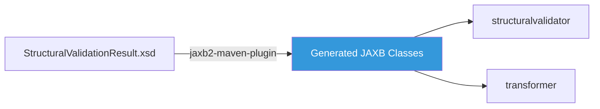
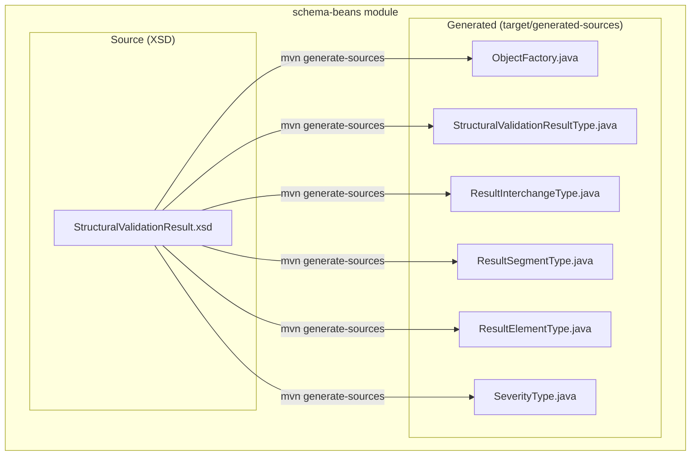
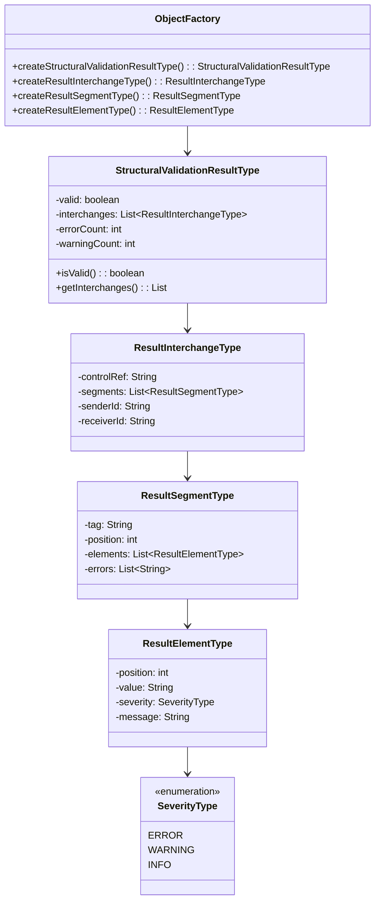
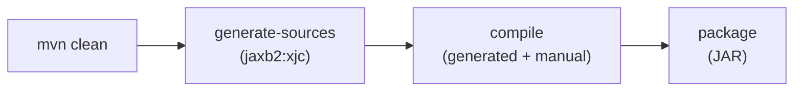

# Schema-Beans Module — Design Document

> **Module:** `schema-beans`  
> **Generated:** 2026-05-24  
> **Artifact:** `com.inttra.mercury:schema-beans:1.0-SNAPSHOT`  
> **Java Version:** 17 | **Build:** Maven + jaxb2-maven-plugin 3.2.0

---

## 1. Executive Summary

The **Schema-Beans** module is a pure code-generation module with zero hand-written Java source files. It houses XSD schema definitions for structural validation results and uses the JAXB (Jakarta XML Binding) code generation plugin to produce type-safe Java classes. These generated beans are consumed by the `structuralvalidator` and `transformer` modules for marshalling/unmarshalling validation results.

---

## 2. Role in the Pipeline



---

## 3. Architecture



---

## 4. Class Diagram (Generated)



---

## 5. XSD Schema Structure

```
StructuralValidationResult
├── @valid (boolean)
├── @errorCount (int)
├── @warningCount (int)
└── interchange* (ResultInterchangeType)
    ├── @controlRef (string)
    ├── @senderId (string)
    ├── @receiverId (string)
    └── segment* (ResultSegmentType)
        ├── @tag (string)
        ├── @position (int)
        ├── error* (string)
        └── element* (ResultElementType)
            ├── @position (int)
            ├── @value (string)
            ├── @severity (SeverityType)
            └── @message (string)
```

---

## 6. Build Configuration

### JAXB Generation Plugin

| Plugin Property | Value |
|----------------|-------|
| Plugin | `org.codehaus.mojo:jaxb2-maven-plugin:3.2.0` |
| Goal | `xjc` |
| Source directory | `${project.basedir}/xsd` |
| Output directory | `${project.build.directory}/generated-sources/jaxb` |
| Package | `com.inttra.mercury.schema.validation` |
| Extension | `true` (allows episode file) |

### Build Lifecycle



---

## 7. Key Maven Dependencies

| Dependency | Version | Purpose |
|-----------|---------|---------|
| `jakarta.xml.bind-api` | 4.0.2 | JAXB API (Jakarta namespace) |
| `jaxb-runtime` | 4.0.5 | JAXB runtime implementation |
| `jaxb2-maven-plugin` | 3.2.0 | XSD → Java code generation |

---

## 8. Consumer Modules

| Module | Usage |
|--------|-------|
| `structuralvalidator` | Creates `StructuralValidationResultType` instances with validation findings |
| `transformer` | Reads `StructuralValidationResultType` to decide FA generation |

---

## 9. Design Notes

- **No source code:** This module exists solely for schema management and code generation
- **Jakarta migration:** Uses `jakarta.xml.bind` (not legacy `javax.xml.bind`)
- **Versioning:** Schema changes require regeneration; downstream modules depend on the generated API
- **Immutable contract:** The XSD defines the structural validation result contract between modules
