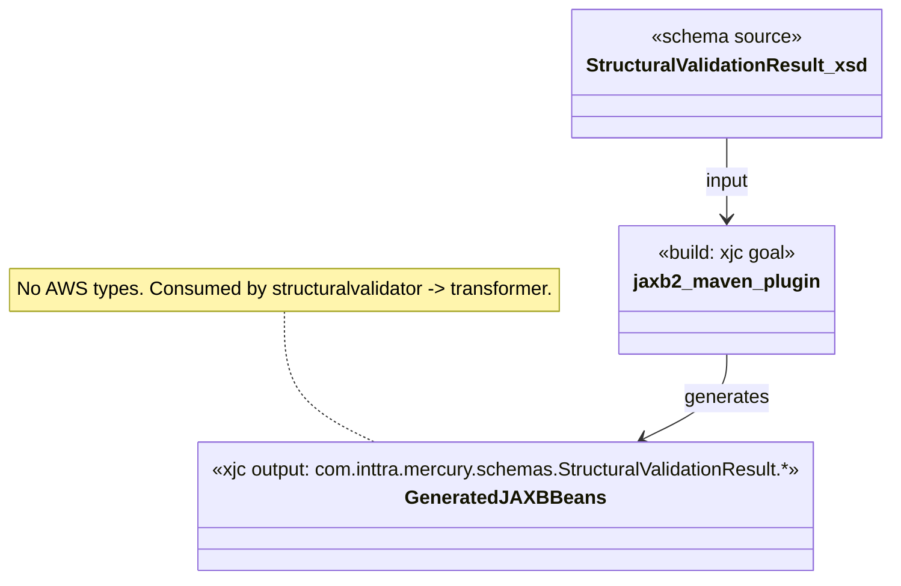
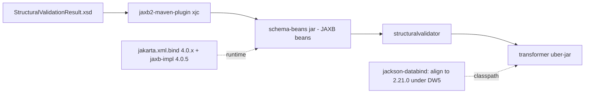

# `schema-beans` — AWS SDK v2 (cloud-sdk) Upgrade DESIGN (claude)

> Module: `com.inttra.mercury.schema-beans:schema-beans:1.0` · Date: 2026-05-31 · Author: Claude (Opus 4.8)
> **Chosen option: B** (program directive). For this module Option B reduces to **build/BOM alignment only — no source, no AWS, no cloud-sdk dependency.**
> Companion: [plan](2026-05-31-schema-beans-aws2x-upgrade-plan-claude.md). Master: [`shared` DESIGN](../../shared/docs/2026-05-31-shared-aws2x-upgrade-DESIGN-claude.md) §5/§6.

---

## 1. Overview & chosen option
`schema-beans` is a pure JAXB code-generation module: `jaxb2-maven-plugin` runs `xjc` over [`StructuralValidationResult.xsd`](../xsd/structuralValidationResult/StructuralValidationResult.xsd) into package `com.inttra.mercury.schemas.StructuralValidationResult`. It has no AWS surface, no `shared`/`commons` dependency, and no Dropwizard. Under Option B the only design concern is keeping its JAXB (4.0.x, Jakarta namespace) and Jackson versions compatible with the converged DW5/Jackson 2.21.0 platform.

## 2. Class diagram (build-only)

## 3. Component diagram

## 4. Sequence diagram
**N/A** — no runtime behavior, no AWS calls. (Generation happens at build time; beans are passive DTOs.)

## 5. Configuration changes
**N/A** — no Dropwizard, no YAML, no runtime config. Master config composition: [`shared` DESIGN §5](../../shared/docs/2026-05-31-shared-aws2x-upgrade-DESIGN-claude.md).

## 6. cloud-sdk gaps
**NONE.** No cloud-sdk artifact is consumed; no additive change proposed or required. The program-wide single required additive change is **S-G2** ([`shared` DESIGN §6.1](../../shared/docs/2026-05-31-shared-aws2x-upgrade-DESIGN-claude.md)) and does not touch this module.

## 7. Maven dependency changes
- **No AWS dependency** to add or remove (none present).
- **BOM/DW5 alignment only:** relax or remove the local `jackson-databind 2.10.0` pin ([pom.xml:41-44](../pom.xml)) so the program Jackson **2.21.0** governs the assembled classpath; keep JAXB `jakarta.xml.bind-api 4.0.2` + `jaxb-core/jaxb-impl 4.0.5` (already Jakarta-namespace, DW5-compatible). No `cloud-sdk-*` dependency. Pin reference for the program line: **1.0.26-SNAPSHOT** (consumed elsewhere, not here).

## 8. Tests
No AWS tests (module has no tests). Verification is a **clean aggregator build** after `shared` migrates: confirm `xjc` still generates and `transformer` assembles with JAXB 4 + Jackson 2.21 on a single classpath.

## 9. Rollout
No ordering constraint. Rebuild under the aggregator after the parent BOM moves to DW5/Jackson 2.21. Listed as a **rebuild-only** node in the program rollout checklist.

## 10. Risks & mitigations
| Risk | Mitigation |
|---|---|
| Local `jackson-databind 2.10.0` pin conflicts with program Jackson 2.21.0 on the `transformer` classpath | Remove/relax the local pin; let the parent BOM govern; verify with `mvn dependency:tree` on `transformer` |
| JAXB 4 (Jakarta) incompatibility under DW5 | Already on Jakarta namespace; low risk — confirm at clean build |
| Silent regeneration drift | `failOnNoSchemas=true` already set; clean build catches missing schema |
