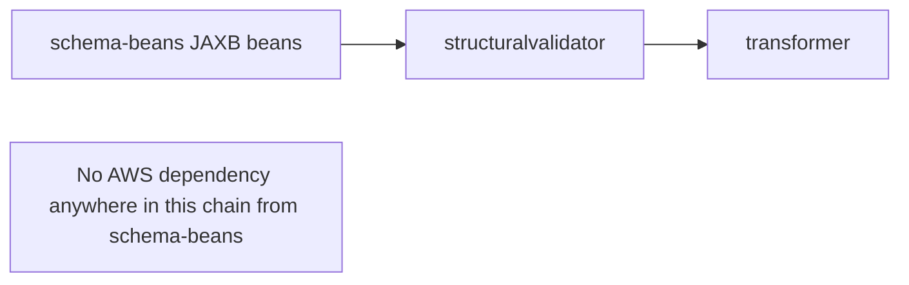

# `schema-beans` — AWS SDK v2 (cloud-sdk) Upgrade DESIGN

> **DIRECTIVE UPDATE (2026-05-31) — supersedes the Option-A recommendation in this document.** Per stakeholder direction the program now targets **Dropwizard 5** and **Option B — adopt `commons` + `cloud-sdk-api`/`cloud-sdk-aws`** as the directed default (recommend Option A only on a categorical technical blocker). All AWS service communication goes through `cloud-sdk-api`; new tests are written in **JUnit 5 (Jupiter)** (existing JUnit 4 runs via JUnit Vintage during transition); configuration follows the composed appianway `.properties`/`${PROFILE}`/`${ENV}` + commons `${awsps:...}` model in the master [shared plan §10](../../shared/docs/2026-05-31-shared-aws2x-upgrade-plan-copilot.md). cloud-sdk gaps are indexed in the master [shared plan §11](../../shared/docs/2026-05-31-shared-aws2x-upgrade-plan-copilot.md) with full technical specs in the master [shared DESIGN §1A.6](../../shared/docs/2026-05-31-shared-aws2x-upgrade-DESIGN.md).
> **Module-specific cloud-sdk gaps:** None — no AWS surface (JAXB beans only); build/transitive impact only. Inherits the Dropwizard 5 / commons baseline.
> Sections below are retained as the Option-A fallback reference.

> Module: `schema-beans` · Date: 2026-05-31 · Author: GitHub Copilot (Claude Opus 4.8)
> Companion: [plan](2026-05-31-schema-beans-aws2x-upgrade-plan-copilot.md). Session `83b822b011714117`.

## 1. Overview
`schema-beans` has **no AWS SDK v1 surface** (no `com.amazonaws` imports). No design changes are required by the AWS v2 / cloud-sdk migration. This document records that conclusion and the (empty) change set for completeness.

## 2. Class diagram
No class changes. The module's generated JAXB beans (`StructuralValidationResult` and friends) are unaffected.

## 3. Component diagram

## 4. Sequence diagrams
Not applicable — no AWS interaction.

## 5. Configuration changes
None.

## 6. Maven dependency changes
None. `schema-beans/pom.xml` declares no `com.amazonaws:*` and no `software.amazon.awssdk:*`. After the program-wide change, no edit is needed here.

## 7. Test details
No tests change. Rebuild under the aggregator to confirm continued compilation after `shared` migrates.

## 8. Rollout & verification
`mvn -pl schema-beans -am verify` after `shared` is migrated — expect no diffs, clean build.

## 9. Risks & mitigations
None of substance. Only theoretical risk: a future transitive AWS dependency is introduced — out of scope today.
