# Splitter Module — Architecture & Design

> **Author:** Principal Engineering Review · **Date:** 2026-05-24 · **Module Version:** 1.0 (parent `com.inttra.mercury:appian-way:1.0`, Java 17, Dropwizard 4.0.16)

---

## Table of Contents

1. [Executive Summary](#1-executive-summary)
2. [Position in the Mercury Pipeline](#2-position-in-the-mercury-pipeline)
3. [High-Level Architecture](#3-high-level-architecture)
4. [Low-Level Design](#4-low-level-design)
5. [Key Classes — Class Diagram](#5-key-classes--class-diagram)
6. [Data Flow Diagram](#6-data-flow-diagram)
7. [Component Dependencies](#7-component-dependencies)
8. [Configuration & Validation](#8-configuration--validation)
9. [Maven Dependencies](#9-maven-dependencies)
10. [How the Module Works — Detailed Walkthrough](#10-how-the-module-works--detailed-walkthrough)
11. [Error Handling & Edge Cases](#11-error-handling--edge-cases)
12. [Operational Notes](#12-operational-notes)
13. [Open Questions / Risks](#13-open-questions--risks)

---

## 1. Executive Summary

The **splitter** module (sometimes referred to as **"splitters"** in pipeline documentation because it
hosts a family of pluggable per-format splitter strategies) is the Mercury inbound stage responsible
for taking a *structurally valid* envelope of one of the supported business formats (EDIFACT, ANSI
X12, XML, JSON / pass-through file-based formats) and breaking it apart into one or more
**logically independent business messages** that can be routed and processed independently by the
downstream Mercury transformation chain.

A single inbound file in Mercury is rarely a single business document. A typical sea-freight EDI
file delivered by a carrier or a freight forwarder is an EDIFACT **INTERCHANGE** (`UNB ... UNZ`)
which contains one or more **functional groups** (`UNG ... UNE`) which in turn contain one or more
**messages** (`UNH ... UNT`) — each message being a self-contained `IFTMBF`, `IFTMIN`, `COPRAR`,
`COARRI`, `CODECO`, `BAPLIE` etc. ANSI X12 has an analogous nesting: `ISA ... IEA`, `GS ... GE`,
`ST ... SE`. XML payloads (Booking Request, Booking Confirmation) have their own envelope
structure. Pass-through formats (Rates v1, CFast Forecast, CFast Supply, Desktop BK) arrive as
single logical messages and do not require splitting — the splitter still owns identification,
integration profile resolution and routing for them.

The splitter is therefore not a "string parsing" component — it is the **business-format-aware fan
out point** of the pipeline. For each split child message it:

1. Extracts envelope identity (`EdiId`, interchange/group/document control numbers, message type,
   release version, code).
2. Resolves the message owner to an **Integration Profile** by `(ediId, mftId)`.
3. Authorises the message against `Integration Profile Format` (`messageType + envelopeVersion`,
   or `formatCode`) for the `inbound` direction.
4. Persists the split child as an independent file in the S3 workspace bucket (or, when the
   incoming file was *not* split and routing can be done in place, retains the original file).
5. Computes a downstream queue from the format's **`contextCode`** (e.g. `requestBooking`,
   `confirmBooking`, `submitSI`, `publishContainerEvent`, `publishSchedule`, `publishRate`,
   `publishCFast`) and publishes a `MetaData` envelope to that SQS queue.
6. Emits `START_WORKFLOW` events for each child workflow and a `CLOSE_WORKFLOW` event for the
   parent batch.

The module is a **Dropwizard 4 application** driven by **Guice 7** dependency injection,
consuming SQS messages via the shared `SQSListener` / `AsyncDispatcher` infrastructure and
producing both SQS messages (to per-context downstream queues) and SNS events (to the shared
event-store topic).

Throughout the rest of the document the folder name `splitter/` is used; the plural form
"splitters" appears only colloquially in the pipeline architecture diagrams.

---

## 2. Position in the Mercury Pipeline

The Mercury "Appian Way" pipeline is the ordered execution graph defined by the parent
aggregator POM at `../pom.xml` (see modules list around `pom.xml:34-50`). For the inbound branch
the chain is:

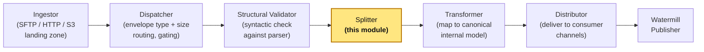

**Inputs to the splitter:**

- SQS messages on `splitter.sqsSplitterConfig.queueUrl` (`<profile>_<env>_sqs_splitter_pu`). The
  body of each SQS message is the JSON-serialised `MetaData` produced by the upstream stage
  (`structuralvalidator`). Critically, the splitter does **not** receive the payload inline; the
  `MetaData` references a file in the S3 workspace bucket via `bucket` + `fileName`.
- The S3 workspace bucket configured via `splitter.s3WorkspaceConfig.bucket`, from which the file
  bytes are pulled (`SplitterTask.getFileContent` at `SplitterTask.java:192-194`).

**Outputs from the splitter:**

- Zero, one or many SQS messages on per-context downstream queues, computed by
  `FormatBasedSQSRouter` from `routeMappings`. The default routing table in
  `conf/int/splitter.properties:7-13` shows the typical mappings (e.g. `requestBooking ->
  inttra_int_sqs_transformer_inbound`).
- One S3 object per split child message (when splitting actually occurred) under the
  `rootWorkflowId/<uuid>` key (`SplitTransactionProcessor.createWorkspaceFileName` at
  `SplitTransactionProcessor.java:220-222`).
- SNS events to the event-store topic (`splitter.snsEventConfig.topicArn`): one
  `START_WORKFLOW` per emitted child workflow and one `CLOSE_WORKFLOW` for the parent batch
  (see `SplitTransactionProcessor.routeToQueue` and `SplitterTask.publishCloseRunEvent`).
- Error-routed messages to either the pickup DLQ or the dedicated subscription-errors queue
  (`splitter.sqsErrorSubscriptionConfig.queueUrl`) when authorisation, parsing or other
  business exceptions cannot be retried (`SplitErrorHandler.handleNonRecoverableException` at
  `SplitErrorHandler.java:97-110`).

**Pipeline contract — what the splitter *assumes*:**

1. The file has already been structurally validated. The splitter is not a syntactic gate
   (although `Gen2EnvelopeParserHelper.validate` still surfaces parser warnings/errors —
   `Gen2EnvelopeParserHelper.java:18-36`).
2. The `MetaData` already carries `workflowId`, `rootWorkflowId`, `bucket`, `fileName` and any
   upstream-set projections such as `FILE_TYPE` (used by `PassThroughParser.match`,
   `PassThroughParser.java:16-18`) and `MFT_ID`.
3. The dispatcher has already enforced gate-1 size limits, so the splitter trusts that the
   message is "processable" — though it does record split file sizes via
   `WorkspaceService.getFileSize` (`SplitTransactionProcessor.java:200-202`) for downstream
   observability.

**Pipeline contract — what the splitter *guarantees*:**

1. Every child message it emits carries a fresh `workflowId`, a `parentWorkflowId` equal to the
   incoming batch `workflowId`, and a stable `rootWorkflowId` carried from the original ingest.
2. Each emitted `MetaData` carries `FORMAT_ID`, `INTEGRATION_PROFILE_FORMAT_ID`, `FORMAT_CODE`,
   `CONTEXT_CODE`, `SPLITTER_FILE_SIZE`, `EDIID`, `INTEGRATION_PROFILE_ID` and (where
   available) `DOCUMENT_CONTROL_NUMBER` and `INTERCHANGE_CONTROL_REFERENCENUMBER`.
3. The component name stamped on every outbound MetaData is `splitter` (configurable via
   `componentName`, default in `conf/splitter.yaml:1`).

---

## 3. High-Level Architecture

The module is composed of five cooperating layers:

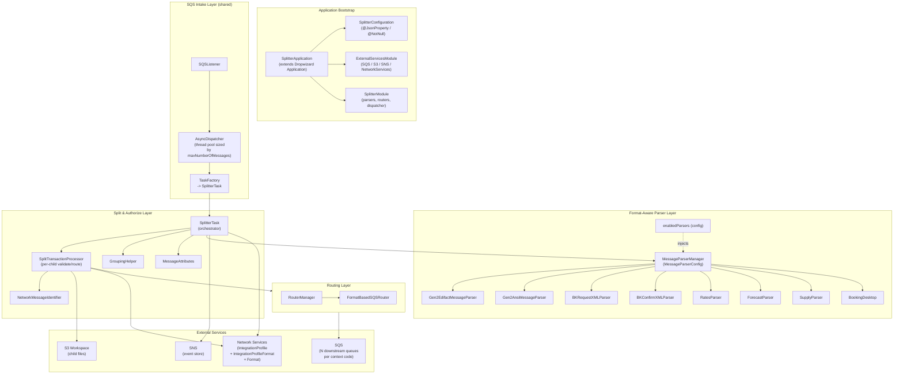

### 3.1 Layer responsibilities

1. **Application Bootstrap** (`SplitterApplication`, `SplitterModule`, `ExternalServicesModule`)
   - Boots Dropwizard, wires Guice, registers health checks, installs Hystrix bundle (currently
     commented out — `SplitterApplication.java:47`).
   - Provisions AWS SDK clients with task-specific `AWSClientConfiguration` profiles (separate
     listener / sender configurations — `ExternalServicesModule.java:37-44`).
   - Eagerly instantiates `AuthClient` to fail-fast on credentials issues
     (`ExternalServicesModule.java:59`).

2. **SQS Intake** (shared via `mercury-shared`)
   - `SQSListener` long-polls the pickup queue with `waitTimeSeconds` (default 20) and
     `maxNumberOfMessages` (default 10, overridden to 3 in INT — `conf/int/splitter.properties:14`).
   - Each received SQS message is handed off to `AsyncDispatcher` which uses a fixed thread-pool
     `Executor` sized exactly to `maxNumberOfMessages` (`SplitterModule.java:81-85`).
   - A `TaskFactory` (lambda at `SplitterModule.java:78-79`) returns a fresh `SplitterTask`
     instance per message via Guice `Provider<SplitterTask>`.

3. **Parser layer** (`com.inttra.mercury.splitter.parser.*`)
   - Strategy pattern. The set of enabled `MessageParser` beans is configured by class name in
     `conf/splitter.yaml:25-33` and resolved at boot time by `MessageParserConfig` against the
     Guice multibinding of all known parsers (`MessageParserConfig.java:21-26`).
   - At runtime, parsers are tested via `match(metaData, content)` in registration order. The
     **first parser whose `match` returns true wins** (`MessageParserConfig.java:36-49`). Note
     that `MessageParserConfig` requests a fresh `Injector`-created instance of each parser per
     message — parsers carry per-message state and **must not** be treated as singletons.
   - Two parser families:
     * **Gen2 parsers** (EDIFACT, ANSI) wrap the shared Gen2 `IMessageSplitter` engine
       (`AbstractGen2Parser.java:20-77`). These are *splitting* parsers (`requiresSplitting()`
       returns `true`).
     * **Pass-through parsers** (`PassThroughParser` subclasses — Rates, CFast Forecast, CFast
       Supply, Desktop BK, plus XML parsers) which return `requiresSplitting() == false` and
       expose `getAttributes()` with a `CODE` projection used by the integration profile lookup
       (`PassThroughParser.java:14-53`).

4. **Split & Authorise** (`SplitterTask`, `SplitTransactionProcessor`)
   - `SplitterTask.process` is the *only* externally-visible entry point. It performs the full
     orchestration: file fetch -> parser selection -> validate -> integration profile resolution
     -> split-and-emit -> close event (`SplitterTask.java:94-122`).
   - `SplitTransactionProcessor` is the per-child workhorse: it authorises each child, writes
     a workspace artifact and delegates to the router.

5. **Routing** (`RouterManager`, `FormatBasedSQSRouter`)
   - A chain-of-routers pattern, currently containing exactly one router (`format_based`). The
     ordering is driven by `routersOrder` in YAML (`conf/splitter.yaml:46-48`), with the
     intention that future routers (e.g. tenant-based, priority-based) can be slotted in
     without touching call sites (`RouterManager.java:40-61`).

### 3.2 Concurrency model

The splitter is concurrent at *two* levels:

1. **Pickup-level** — `SQSListener` + `AsyncDispatcher` process up to `maxNumberOfMessages`
   SQS messages in parallel. Each becomes one `SplitterTask` run.
2. **Group-level** — Within a single split, `SplitterTask.processAllTransactions` fans out one
   `CompletableFuture` per `MessageGroup` onto the **same** fixed thread-pool that backs the
   dispatcher (`SplitterModule.java:81`, `SplitterTask.java:158-163`). This means an envelope
   with many groups can saturate the executor and back-pressure the SQS pickup loop.

> **Design note (risk):** Sharing the executor between pickup and intra-task fanout is a
> deliberate but subtle choice. With `maxNumberOfMessages=3` (INT) the executor has three
> threads; an envelope with three groups will completely block all SQS pickup until done. This
> bounds memory but can hurt throughput. See Section 13.

### 3.3 Stateless vs stateful

The module is **request-scoped stateful**: `SplitterTask`, `MessageParser` implementations and
`Gen2*Message` instances carry per-message mutable state (current parser cursor, parsed
headers, etc.). Singletons are limited to:

- AWS clients and `Clock` (`ExternalServicesModule`).
- `SplitTransactionProcessor`, `BatchErrorHandler`, `SplitErrorHandler`, `GroupingHelper`,
  `RouterManager`, `FormatBasedSQSRouter`, `EventPublisher` (all bound either as Guice
  singletons explicitly or by default lifecycle via the multibinding).

---

## 4. Low-Level Design

### 4.1 Strategy pattern: the `MessageParser` family

The splitter applies the **Gang-of-Four Strategy pattern** to the *parse + iterate* step. The
abstract contract is `com.inttra.mercury.splitter.core.MessageParser`
(`MessageParser.java:14-34`):

| Method | Responsibility |
|---|---|
| `boolean match(MetaData metaData, String content)` | Cheap probe — "is the incoming envelope of my format?". For Gen2 parsers this checks the envelope header tokens via the shared `IMessageSplitter.matchEnvelope`. For XML, it checks the literal `<?xml` prologue and a transaction-type element. For pass-through, it compares `metaData.projections[FILE_TYPE]` against a constant. |
| `void init(String content)` | Expensive — actually parse the envelope, populating internal cursors and headers. Idempotent in practice (the same parser may be re-initialised by `SplitterTask` after `parserManager.getMessageParser` already initialised it during the match step). |
| `List<Message> getMessages()` | For splitting parsers, returns the list of *logical* child messages. For pass-through parsers, returns `null` — they should never be iterated. |
| `MessageGroup groupMessage(MessageBatch batch, Message msg)` | Groups a parsed child into a `MessageGroup` keyed by `formatCode | interchangeControlNumber | groupControlNumber`. |
| `boolean requiresSplitting()` | Discriminator. Splitting parsers return `true`; pass-through parsers return `false`. Drives the branch in `SplitterTask.splitAndProcess`. |
| `Map<String,String> getAttributes()` | Header projection: at minimum `EDIID`, `INTERCHANGE_CONTROL_REFERENCENUMBER` (for Gen2), plus optional `MESSAGE_TYPE`, `ENVELOPE_VERSION`, `CODE`. |
| `List<BatchError> validate()` | Surface parser-detected validation issues. Gen2 wraps Gen2 engine validation; XML and pass-through return empty/null lists. |

### 4.2 Dispatch table (parser selection)

At boot time `MessageParserConfig` builds an **ordered list** of enabled parsers, preserving
the order defined in `splitter.yaml > enabledParsers`. At runtime it iterates this list,
asking each parser to `match`. The **first** matching parser is selected. Order matters because
some matches overlap (any XML payload could match `BKRequestXMLParser` or `BKConfirmXMLParser`
depending on content).

The default order (`conf/splitter.yaml:25-33`):

```
1. Gen2EdifactMessageParser       (EDIFACT envelope detection via UNB/UNH)
2. Gen2AnsiMessageParser          (ANSI X12 envelope detection via ISA/ST)
3. RatesParser                    (FILE_TYPE == "Rates_v1")
4. BKRequestXMLParser             (<?xml ... <TransactionType>Booking</TransactionType>)
5. BKConfirmXMLParser             (<?xml ... <AnswerBookingSubmission>)
6. ForecastParser                 (FILE_TYPE == "CFast_Forecast")
7. SupplyParser                   (FILE_TYPE == "CFast_Supply")
8. BookingDesktop                 (FILE_TYPE == "DESKTOP_BK")
```

Visualised as a decision tree:

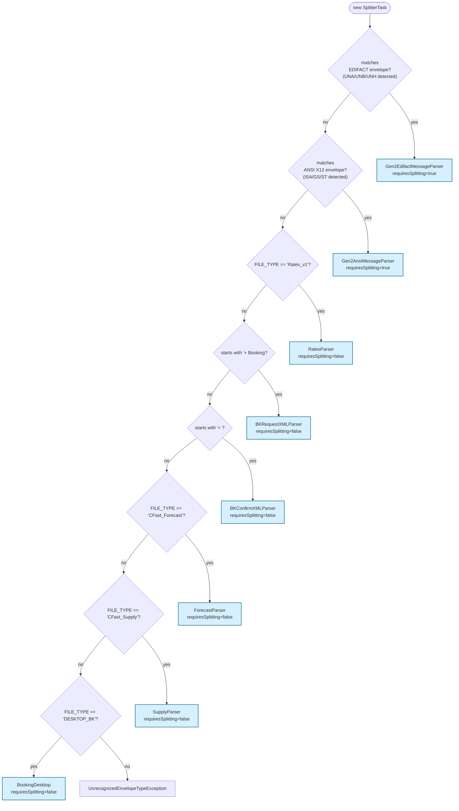

> **Caveat:** Because `RatesParser`, `ForecastParser`, `SupplyParser` and `BookingDesktop` all
> rely on `metaData.projections[FILE_TYPE]`, the file-type projection is *load-bearing* and must
> be set by an upstream stage (ingestor or dispatcher). If `FILE_TYPE` is null the pass-through
> parsers cannot match and Gen2 parsers will reject non-EDI content, resulting in an
> `UnrecognizedEnvelopeTypeException`.

### 4.3 The split-or-route branch

Once a parser is chosen, `SplitterTask.splitAndProcess` (`SplitterTask.java:124-145`) takes the
single binary branch:

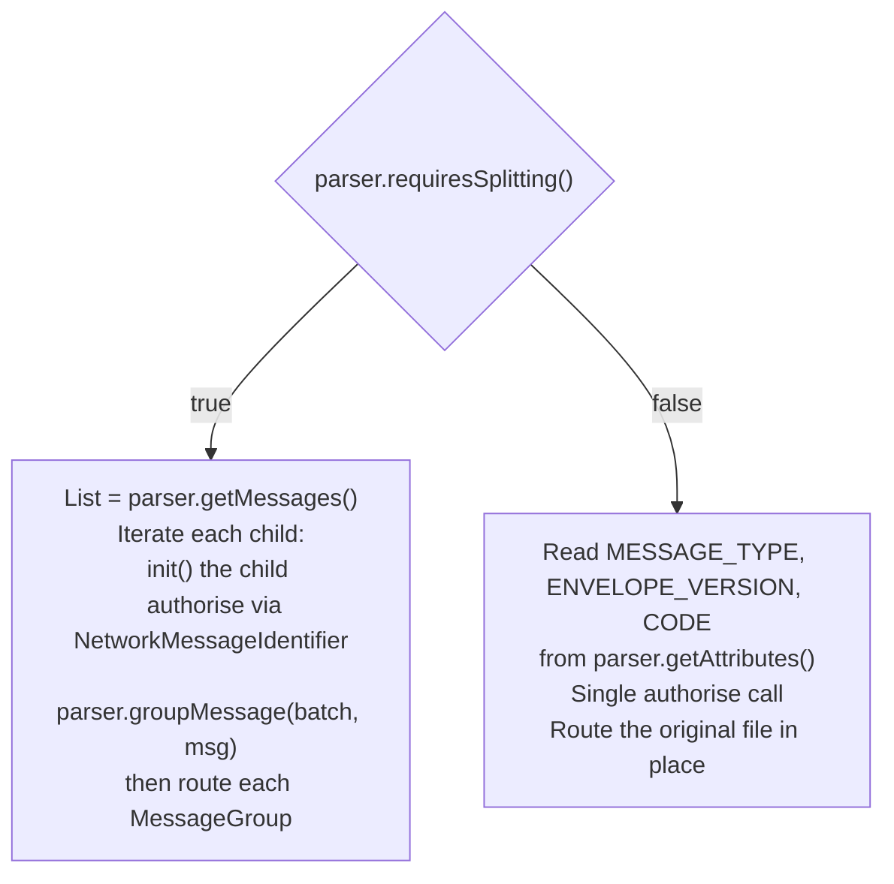

The splitting branch is the more complex one. It:

1. Calls `parser.getMessages()` which, for EDIFACT/ANSI, iterates the underlying `IMessageSplitter`
   until `hasMoreMessages()` returns false (`Gen2EdifactMessageParser.java:18-25`,
   `Gen2AnsiMessageParser.java:17-24`).
2. For each child, invokes `splitTransactionProcessor.validate(...)` which:
   - Initialises the child (`msg.init()` — parses headers like message type, release version,
     interchange/group/document control number from the segment buffer).
   - Caches authorisation results keyed by `(ipId, msg)` to avoid duplicate Network Services
     calls for repeated `(messageType, releaseVersion)` tuples
     (`SplitTransactionProcessor.java:224-240`).
   - If authorised, sets the resolved `Format` on the message and returns true; otherwise
     publishes an `AuthorizationException` failure for that child only.
3. Groups authorised children by `formatCode | interchangeControlNumber | groupControlNumber`
   (`AbstractGen2Parser.java:47-61`).
4. Fans out one `CompletableFuture` per `MessageGroup` to route each group concurrently
   (`SplitterTask.java:158-163`).

### 4.4 The "one group, all valid" optimisation

`GroupingHelper.isOneGroupAndAllMessagesValid` (`GroupingHelper.java:9-15`) tests whether the
batch produced exactly one group containing every original child. This is the critical
optimisation flag passed into `routeMessages` and ultimately `routeToQueue`. When the flag is
true (and the group is *not* grouped per its `Format` — i.e. each child is independently
routable), `routeToQueue` **retains the original S3 file** rather than splitting it into per-child
S3 objects:

```java
// SplitTransactionProcessor.java:187-198
void routeToQueue(MetaData metaData, com.amazonaws.services.sqs.model.Message sqsMessage,
                  String content, boolean retain) {
    ...
    String workspaceFileName;
    if (retain)
        workspaceFileName = metaData.getFileName();   // re-use the input file
    else {
        workspaceFileName = createWorkspaceFileName(metaData.getRootWorkflowId());
        writeToWorkspace(content, metaData.getBucket(), workspaceFileName);
    }
    ...
}
```

This is an explicit cost optimisation: avoid one S3 PUT per message when the envelope contained
exactly one logical message anyway (the *very* common case for non-batch carrier traffic).

### 4.5 The grouped-format case

A `Format` can be marked `grouped=true` in Network Services. When the first message of a
group has a grouped Format, `routeMessages` skips per-child emission and instead routes the
*entire group reader* (`group.getReader()`) as one downstream message
(`SplitTransactionProcessor.java:161-167`). This honours the EDI semantic where some
functional groups (e.g. multiple `BAPLIE` messages inside one `UNG`) are processed as a unit
downstream.

### 4.6 Routing strategy

`FormatBasedSQSRouter.tryRoute` (`FormatBasedSQSRouter.java:44-68`) is the only currently
configured router:

1. Pulls `FORMAT_ID` from the enriched MetaData projections.
2. Looks up the `Format` via Network Services (cached — `CacheFormatService`).
3. Verifies the format is active. Inactive formats throw `RuntimeException`.
4. Reads `format.contextCode` (e.g. `requestBooking`) and `format.code`.
5. Looks up the SQS queue URL from the `routeMappings` table.
6. Enriches MetaData with `CONTEXT_CODE` and `FORMAT_CODE` projections.
7. Sends the enriched MetaData JSON to SQS.

The router chain pattern allows future expansion: the `RouterManager.routeMessage` loop
(`RouterManager.java:25-38`) returns the first router that produces a non-empty
`RoutingResult`. A future tenant-based or feature-flag-based router can be inserted ahead of
`format_based` without changes to call sites.

---

## 5. Key Classes — Class Diagram

### 5.1 Core abstractions

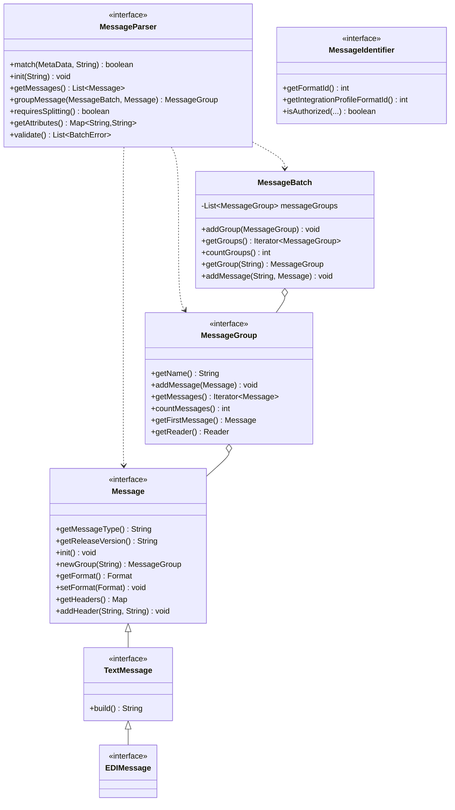

### 5.2 Parser hierarchy

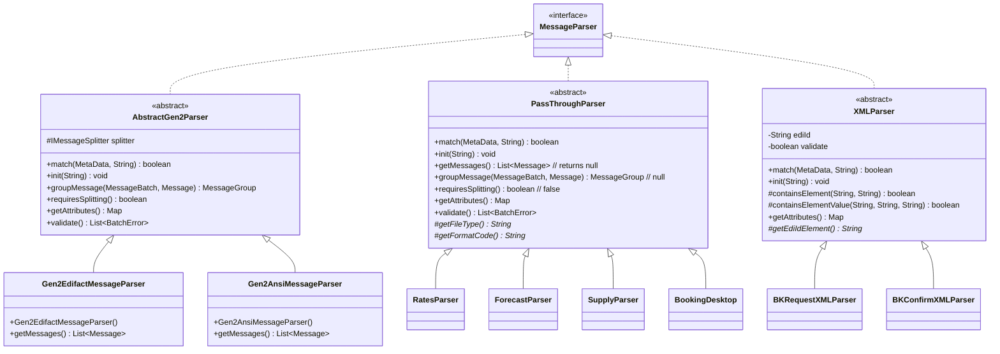

### 5.3 Gen2 message + group hierarchy

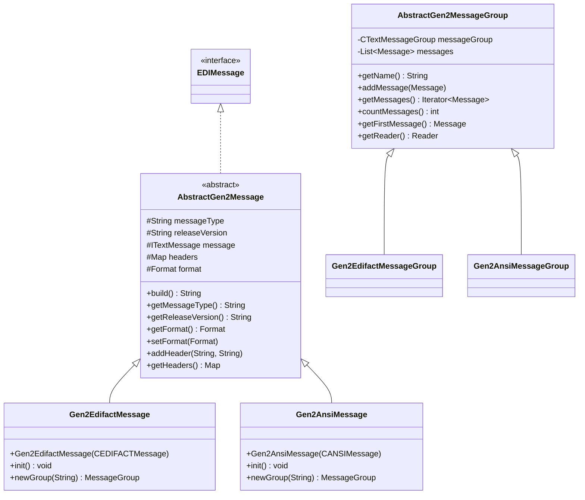

### 5.4 Orchestration & routing

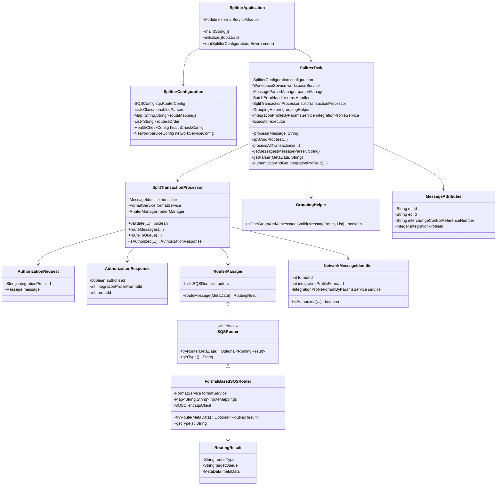

### 5.5 Error & exception model

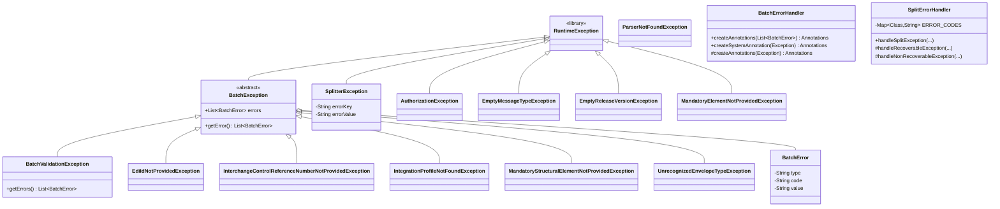

---

## 6. Data Flow Diagram

### 6.1 End-to-end happy-path sequence (EDIFACT batch with 3 messages, 1 group)

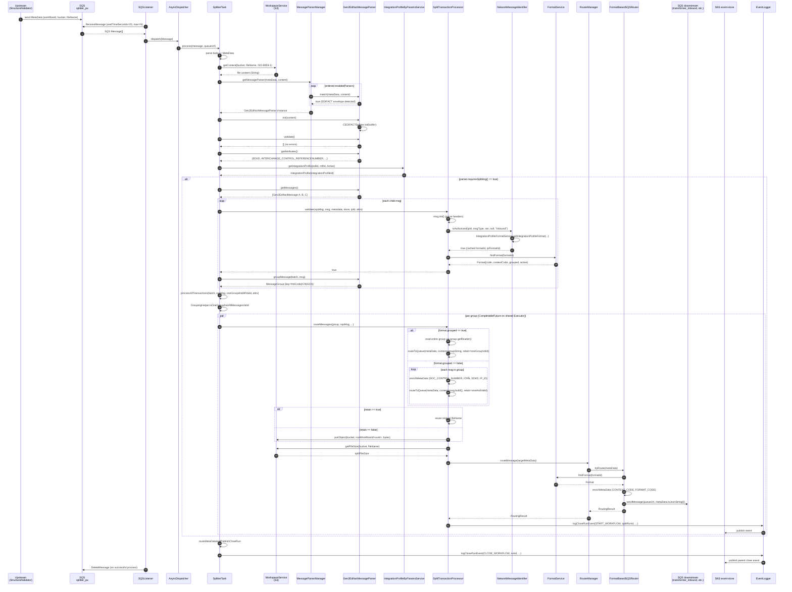

### 6.2 Pass-through (non-splitting) flow

For pass-through parsers (`PassThroughParser` subclasses and XML parsers), the sequence is
shorter:

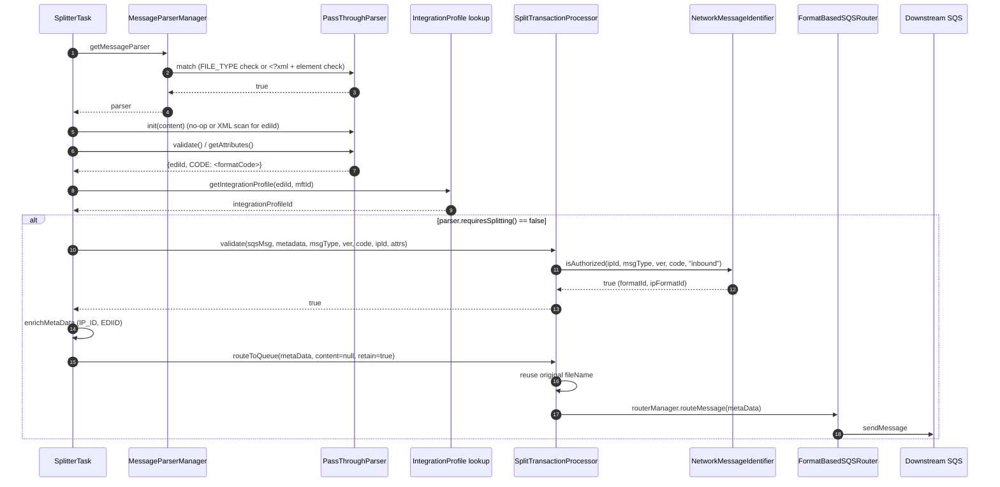

### 6.3 Field-level data lineage

The diagram below traces a single child message's data fields from envelope to downstream
SQS payload:

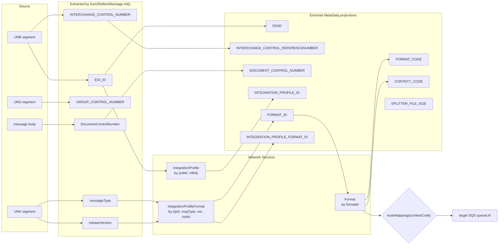

---

## 7. Component Dependencies

### 7.1 Internal (intra-module) dependencies

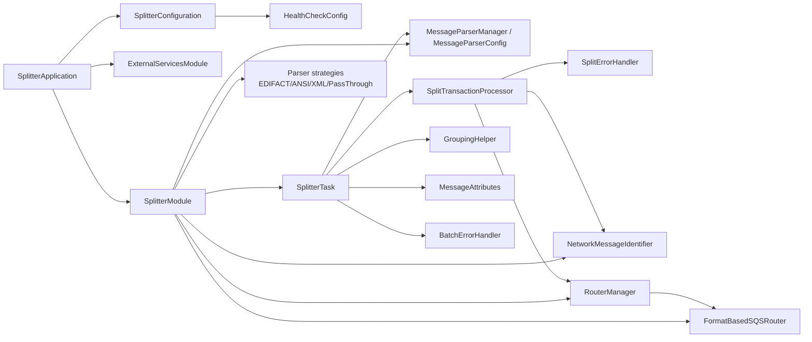

### 7.2 External (cross-module / shared) dependencies

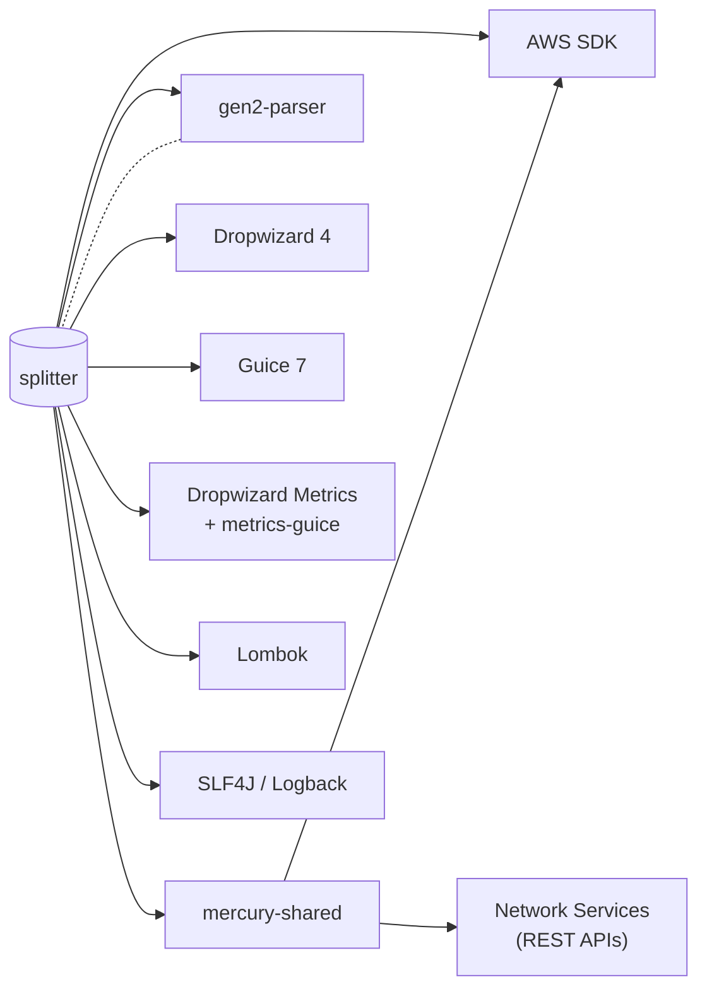

Notably:

- `mercury-shared` provides: `BaseConfiguration`, `SQSConfig`, `NetworkServiceConfig`,
  `SQSClient`, `SQSListener`, `SQSListenerClient`, `SNSClient`, `SNSEventPublisher`,
  `WorkspaceService`/`S3WorkspaceService`, `EventLogger`, `EventGenerator`, `RandomGenerator`,
  `MetaData`, `AbstractTask`, `ErrorHelper`, `ErrorHandler`, `ListenerManager`,
  `AsyncDispatcher`, `AWSClientConfiguration`, `IntegrationProfile*` services,
  `CacheFormatService`, `NetworkRetryerModule`, `ParameterStoreModule`,
  `S3ConfigurationProvider`, `ConfigProcessingServerCommand`, all health-check indicators, and
  the resource-bundle error-message infrastructure.
- `gen2-parser` provides the concrete EDI splitters (`CEDIFACTSplitter`, `CANSISplitter`) and
  message types (`CEDIFACTMessage`, `CANSIMessage`) which the Gen2 parsers wrap.
- Network Services (HTTP, external to the JVM) supplies the integration-profile and format
  metadata used to authorise and route every child message.

---

## 8. Configuration & Validation

The configuration is loaded from `conf/splitter.yaml` (template) with placeholders resolved
from `splitter.properties`, `network-services.properties` and `datadog.properties` at startup
(see `Dockerfile:9`). Validation is enforced by Hibernate Validator via JSR-380 annotations on
`SplitterConfiguration` and `HealthCheckConfig`.

### 8.1 Per-key reference

| Key | Type | Default | Required | Description | Validation |
|---|---|---|---|---|---|
| `componentName` | String | `splitter` | yes | Component name stamped on emitted MetaData and SNS events. Inherited from `BaseConfiguration`. | `@NotNull` (in base) |
| `healthCheckConfig.errorRateThreshold` | Double | `5.0` | yes | Moving average errors/sec over a 5-minute window above which the `/healthcheck` endpoint reports unhealthy. | `@NotNull`, `@Digits(integer=2, fraction=2)` |
| `healthCheckConfig.integrationProfileHealthCheckUrl` | String | resolved from `networkservices.healthCheckUrl` | yes | HTTP URL probed by `HttpGetHealthCheck`. | `@NotEmpty` |
| `sqsPickupConfig.queueUrl` | String | resolved | yes | The pickup queue the listener long-polls. | inherited `@NotNull` |
| `sqsPickupConfig.waitTimeSeconds` | Integer | `20` | no | SQS long-poll wait time. | n/a |
| `sqsPickupConfig.maxNumberOfMessages` | Integer | `10` (INT: `3`) | no | Concurrency cap and SQS batch size. | n/a |
| `sqsRouterConfig.queueUrl` | String | resolved | yes | Legacy generic router queue. Used by health-checks (`OutboundSqsHealthCheck`) — note that the actual per-context queues live in `routeMappings`. | `@NotNull` |
| `sqsErrorConfig.queueUrl` | String | resolved | yes | Destination for non-recoverable errors (`<profile>_<env>_sqs_subscription_errors`). | inherited `@NotNull` |
| `snsEventConfig.topicArn` | String | resolved | yes | Event-store SNS topic. | inherited `@NotNull` |
| `s3WorkspaceConfig.bucket` | String | resolved (`<profile>-<env>-workspace`) | yes | S3 bucket holding both source and split-child files. | inherited `@NotNull` |
| `enabledParsers` | `List<Class>` | 8 parsers (see below) | yes | Ordered FQCN list of parser strategies to install. Order is significant. | `@NotNull` |
| `routeMappings` | `Map<String,String>` | n/a (per-env) | yes | `contextCode -> SQS queue URL` table consulted by `FormatBasedSQSRouter`. Keys are `requestBooking`, `confirmBooking`, `submitSI`, `publishContainerEvent`, `publishSchedule`, `publishRate`, `publishCFast`. | `@NotNull` |
| `routersOrder` | `List<String>` | `[format_based]` | yes | Ordered list of router type names. Each name must match `SQSRouter.getType()`. | `@NotNull` |
| `networkServiceConfig.networkBaseUrl` | String | resolved | yes | Base URL of the network-services REST API. | inherited |
| `networkServiceConfig.authEndpointUrl` | String | resolved | yes | OAuth/auth endpoint. | inherited |
| `networkServiceConfig.clientId` | String | resolved (ParameterStore) | yes | Client id. | inherited |
| `networkServiceConfig.clientSecret` | String | resolved (ParameterStore) | yes | Client secret. | inherited |
| `networkServiceConfig.servicePaths.integrationProfileServicePath` | String | resolved | yes | Endpoint path for `IntegrationProfileByParamsService`. | inherited |
| `networkServiceConfig.servicePaths.integrationProfileFormatServicePath` | String | resolved | yes | Endpoint path for `IntegrationProfileFormatByParamsService`. | inherited |
| `networkServiceConfig.servicePaths.formatServicePath` | String | resolved | yes | Endpoint path for `FormatService`. | inherited |
| `server.connector.port` | Integer | `8081` (templated) / `0` in properties (random port) | no | Dropwizard admin port. | n/a |
| `logging.level` | String | `INFO` | no | Root log level. | n/a |
| `metrics.frequency` | Duration | `1s` (default) | no | Metric reporter frequency. | n/a |

### 8.2 Default `enabledParsers` (`conf/splitter.yaml:25-33`)

```yaml
enabledParsers:
  - com.inttra.mercury.splitter.parser.edifact.Gen2EdifactMessageParser
  - com.inttra.mercury.splitter.parser.ansi.Gen2AnsiMessageParser
  - com.inttra.mercury.splitter.parser.rates.RatesParser
  - com.inttra.mercury.splitter.parser.xml.BKRequestXMLParser
  - com.inttra.mercury.splitter.parser.xml.BKConfirmXMLParser
  - com.inttra.mercury.splitter.parser.cfast.ForecastParser
  - com.inttra.mercury.splitter.parser.cfast.SupplyParser
  - com.inttra.mercury.splitter.parser.desktop.BookingDesktop
```

### 8.3 Default `routeMappings` keys (`conf/splitter.yaml:37-44`)

```yaml
routeMappings:
  requestBooking:        # -> transformer_inbound (INT)
  confirmBooking:        # -> transformer_inbound (INT)
  submitSI:              # -> si_inbound (INT)
  publishContainerEvent: # -> transformer_inbound (INT)
  publishSchedule:       # -> transformer_os_inbound (INT)
  publishRate:           # -> rates_inbound (INT)
  publishCFast:          # -> cfast_batch_inbound (INT)
```

### 8.4 Environment overrides

Per-environment properties files in `conf/{int,qa,cvt,prod,stress}/splitter.properties` override
the placeholders. Notable differences:

- **INT**: `maxNumberOfMessages=3` (lower concurrency, see
  `conf/int/splitter.properties:14`).
- **Other envs**: rely on defaults.

### 8.5 Health checks

Registered in `SplitterApplication.run` (`SplitterApplication.java:62-83`):

| Health check | Type | Purpose |
|---|---|---|
| `InboundSqsHealthCheck(pickupQueueUrl)` | inbound SQS reachability | confirms the pickup queue is reachable |
| `HttpGetHealthCheck(integrationProfileHealthCheckUrl)` | dependency probe | confirms network services reachable |
| `ErrorThresholdHealthCheck(messagesFailedMeter, threshold)` | metric-driven | unhealthy if failed-message rate exceeds `errorRateThreshold` |
| `OutboundSqsHealthCheck(sqsRouterConfig.queueUrl)` | ops only | router output reachable |
| `OutboundSqsHealthCheck(sqsErrorConfig.queueUrl)` | ops only | error queue reachable |
| `SnsPublishHealthCheck(snsEventConfig.topicArn)` | ops only | SNS publish allowed |
| `S3WriteHealthCheck(s3WorkspaceConfig.bucket)` | ops only | S3 PutObject permission |

The ops health checks are exposed via `OpsHealthCheckServlet` on the admin port.

---

## 9. Maven Dependencies

From `pom.xml:23-112`:

| GroupId | ArtifactId | Version (resolved) | Scope | Role in splitter |
|---|---|---|---|---|
| `com.inttra.mercury.shared` | `mercury-shared` | `1.0` | compile | All shared infra: SQS/SNS/S3 clients, MetaData, EventLogger, AbstractTask, ErrorHelper, Listener/Dispatcher, Network Services SDK, ParameterStoreModule, AWS client configurations, BaseConfiguration. |
| `com.inttra.gen2.parser` | `gen2-parser` | `1.0` | compile | Provides `IMessageSplitter`, `CEDIFACTSplitter`, `CANSISplitter`, `CEDIFACTMessage`, `CANSIMessage`, `CEDIFACTMessageGroup`, `CANSIMessageGroup`, `CTextMessageGroup`, `ITextMessage`, `EMISValidation`, `CStringBuffer`, `IBuffer`, `IImmutableStringBuffer`, `CParams`, `CMapParams`. The actual EDI splitting engine. |
| `org.projectlombok` | `lombok` | `1.18.32` | provided | `@Getter`/`@Setter`/`@Data`/`@Slf4j`/`@EqualsAndHashCode`/`@AllArgsConstructor` ergonomics. |
| `io.dropwizard` | `dropwizard-core` | `4.0.16` | compile | Service container. SnakeYAML excluded (likely to consolidate on a single SnakeYAML pulled from shared). |
| `io.dropwizard.metrics` | `metrics-annotation` | `4.2.37` | compile | Annotation-driven metrics; used by `@Metered(MESSAGES_FAILED_METRIC)` on `SplitErrorHandler.handleSplitException`. |
| `com.amazonaws` | `aws-java-sdk-sqs` | `1.12.720` | compile | SQS client. Other AWS SDK pieces (S3, SNS) come transitively via mercury-shared. |
| `com.google.inject` | `guice` | `7.0.0` | compile | DI. |
| `com.google.guava` | `guava` | `33.1.0-jre` | compile | `ImmutableMap`, `Strings`, `CharStreams`, `Preconditions`. |
| `junit` | `junit` | `4.13.2` | test | Unit tests. |
| `com.inttra.mercury.test` | `functional-testing` | `1.0` | test | Functional test harness. |
| `org.mockito` | `mockito-core` | `2.27.0` | compile (sic) | Mocking. Note: scope is **not** `test` in the POM — likely an oversight but does not affect runtime. |
| `org.slf4j` | `slf4j-api` | `2.0.17` | compile | Logging API. |
| `ch.qos.logback` | `logback-classic` | `1.5.21` | compile | Logging impl. |
| `com.palominolabs.metrics` | `metrics-guice` | `3.1.3` | compile | Bridges `@Metered` annotation to Guice-managed beans (`MetricsInstrumentationModule` installed at `SplitterModule.java:115`). |
| `org.assertj` | `assertj-core` | `3.19.0` | test | Fluent assertions. |

**Build packaging:**

- Maven Shade plugin produces a fat JAR with main class
  `com.inttra.mercury.splitter.SplitterApplication` (`pom.xml:170-172`).
- `ServicesResourceTransformer` consolidates `META-INF/services/*` (important for JAX-RS,
  StAX, Jackson modules).
- Signature files (`META-INF/*.SF`, `*.DSA`, `*.RSA`) are stripped to allow re-signing inside
  the shaded jar.

---

## 10. How the Module Works — Detailed Walkthrough

This section traces the lifecycle of a single SQS message from arrival on the pickup queue to
the final close-event publish.

### 10.1 Boot sequence

```
SplitterApplication.main(args)
  -> new SplitterApplication(null).run(args)
     -> initialize(bootstrap)
        - if S3 config required, replace ConfigurationSourceProvider with S3ConfigurationProvider
        - register ConfigProcessingServerCommand (loads YAML, properties, network-services
          properties, datadog properties as positional args — see Dockerfile:9)
     -> run(configuration, environment)
        - Build Guice Injector from ExternalServicesModule + SplitterModule
        - Resolve ListenerManager singleton -> environment.lifecycle().manage(...)
        - Register health checks on both /healthcheck (regular) and ops servlet
```

The ListenerManager owns the `SQSListener` thread that long-polls and dispatches.

### 10.2 Pickup loop

`SQSListener` (in `mercury-shared`, not shown) calls `AmazonSQS.receiveMessage` with
`waitTimeSeconds` and `maxNumberOfMessages` from `sqsPickupConfig`. For each received
`com.amazonaws.services.sqs.model.Message`, it hands off to `AsyncDispatcher.dispatch`. The
dispatcher uses the `Executor` bound at `SplitterModule.java:81` (a fixed thread pool sized
exactly to `maxNumberOfMessages`). Each dispatch obtains a fresh `SplitterTask` via the
`Provider<SplitterTask>`-backed `TaskFactory` lambda (`SplitterModule.java:78-79`).

### 10.3 `SplitterTask.process` — orchestration

Reference: `SplitterTask.java:94-122`.

```java
LocalDateTime startDateTime = LocalDateTime.now(clock);
metaData = Json.fromJsonString(message.getBody(), MetaData.class);
log.info("Processing batch workflowId :" + metaData.getWorkflowId());
String runId = randomGenerator.randomUUID();
MessageAttributes messageAttributes = null;
try {
    final String content = getFileContent(metaData);
    final MessageParser parser = getParser(metaData, content);
    validate(parser);
    messageAttributes = new MessageAttributes(metaData, parser.getAttributes());
    final Integer integrationProfileId = authenticateAndGetIntegrationProfileId(
        messageAttributes.getEdiId(), messageAttributes.getMftId());
    messageAttributes.setIntegrationProfileId(integrationProfileId);

    splitAndProcess(message, parser, content, integrationProfileId, messageAttributes);

    routeMetaDataAndPublishCloseRun(message, metaData, runId, startDateTime, messageAttributes);
} catch (BatchException e) { ... }
  catch (Exception ex)    { ... }
```

Step-by-step:

1. **Deserialise MetaData** (line 97). The SQS message body is the canonical Mercury
   `MetaData` JSON envelope.
2. **Generate a `runId`** (line 99). This is the unit of work id used in close-run events;
   distinct from `workflowId`.
3. **Fetch file content** (line 102) using `WorkspaceService.getContent(bucket, fileName,
   ISO-8859-1)`. ISO-8859-1 is chosen because EDI files commonly include extended-Latin
   characters; using UTF-8 would corrupt octet positions used by the Gen2 parser cursors.
4. **Resolve parser** (line 104, `getParser` at `SplitterTask.java:176-190`). This calls
   `parserManager.getMessageParser` which iterates enabled parsers and returns the first match.
   `MessageParserConfig.getMessageParser` internally requests a *fresh* `Injector`-managed
   instance of the parser class (`MessageParserConfig.java:40`). A `RuntimeException` here
   (no parser matches) is mapped to `UnrecognizedEnvelopeTypeException`. After selection,
   `parser.init(content)` is called again (it was already called during `match`/probe in some
   implementations — see Gen2 parser); any failure here is mapped to
   `MandatoryStructuralElementNotProvidedException`.
5. **Validate** (line 105, `validate` at `SplitterTask.java:196-206`). Calls
   `parser.validate()` which, for Gen2 parsers, invokes the Gen2 `EMISValidation` engine. Any
   `BatchError` whose `type` is `error` (vs `warning`) triggers `BatchValidationException`.
   Warnings are logged but do not abort.
6. **Build `MessageAttributes`** (line 106). Encapsulates `ediId`, `mftId`,
   `interchangeControlReferenceNumber`, `integrationProfileId`.
7. **Authenticate / resolve Integration Profile** (line 107). Calls
   `IntegrationProfileByParamsService.getIntegrationProfile(...)` with `ediId`, `mftId`,
   `status=Active`. Empty result -> `IntegrationProfileNotFoundException`.
8. **Split and emit** (line 112). See Section 10.4.
9. **Publish parent CLOSE_WORKFLOW event** (line 114). This is the *batch* close, distinct
   from the per-child START_WORKFLOW events.
10. **Catch `BatchException`** — handled as a *business* error with annotations rendered from
    the exception's `BatchError` list.
11. **Catch generic `Exception`** — handled as a *system* error with a single annotation.

### 10.4 Split-or-route branch (`splitAndProcess`)

Reference: `SplitterTask.java:124-145`.

```java
if (parser.requiresSplitting()) {
    List<Message> messages = getMessages(parser, content);
    MessageBatch batch = new MessageBatch();
    Map<AuthorizationRequest, AuthorizationResponse> authorizationResultsStore = new HashMap<>();
    for (Message msg : messages) {
        if (splitTransactionProcessor.validate(sqsMessage, msg, metaData,
                authorizationResultsStore, integrationProfileId.toString(),
                messageAttributes)) {
            parser.groupMessage(batch, msg);
        }
    }
    processAllTransactions(batch, sqsMessage,
        groupingHelper.isOneGroupAndAllMessagesValid(batch, messages),
        messageAttributes);
} else {
    String messageType = parser.getAttributes().get(MessageParser.MESSAGE_TYPE);
    String releaseVersion = parser.getAttributes().get(MessageParser.ENVELOPE_VERSION);
    String code = parser.getAttributes().get(MessageParser.CODE);
    if (splitTransactionProcessor.validate(sqsMessage, metaData, messageType,
            releaseVersion, code, integrationProfileId, messageAttributes)) {
        enrichMetaData(metaData, messageAttributes);
        splitTransactionProcessor.routeToQueue(metaData, sqsMessage, null, true);
    }
}
```

**Splitting branch:**

- Call `parser.getMessages()` (which for Gen2 iterates `splitter.hasMoreMessages()`).
- Per-child: invoke `splitTransactionProcessor.validate(sqsMessage, msg, ...)`. The processor
  does `msg.init()` (parses headers), then authorises via cached
  `isAuthorized(ipId, msgType, ver, null, "inbound")`. If authorised, it stores the resolved
  `Format` on the message via `setFormat`. If not authorised, an error is published *for this
  child only*; the loop continues to the next child.
- Authorised children are grouped: `parser.groupMessage(batch, msg)` adds to the batch under
  a composite key `formatCode|ICN|GCN`.
- `processAllTransactions` then fans out one async task per group.

**Non-splitting branch:**

- Read `MESSAGE_TYPE`, `ENVELOPE_VERSION`, `CODE` from attributes.
- One authorisation call.
- Enrich the input `MetaData` with `INTEGRATION_PROFILE_ID` and `EDIID` projections.
- Call `routeToQueue(metaData, sqsMessage, content=null, retain=true)`. The `retain=true`
  flag means "do not write a new S3 file — reuse the input file" — which is correct because
  pass-through carries the original payload through unchanged.

### 10.5 Per-group routing (`processAllTransactions`)

Reference: `SplitterTask.java:155-169`.

```java
CompletableFuture[] pendingFutures = batch.getGroupsList().stream().map(group ->
    CompletableFuture.runAsync(
        () -> splitTransactionProcessor.routeMessages(group, sqsMessage,
            metaData, oneGroupAndAllMessagesValidFlag, messageAttributes), executor))
    .toArray(CompletableFuture[]::new);
CompletableFuture.allOf(pendingFutures).join();
```

Notes:

- The `executor` is the **shared fixed thread pool** (sized to `maxNumberOfMessages`). This
  bounds the splitter's total in-flight work but couples per-task fanout to pickup
  parallelism.
- `CompletionException` is unwrapped: if the cause is `RecoverableException` it is re-thrown
  raw (so the shared `AbstractTask` infrastructure can return the SQS message to the queue);
  otherwise it propagates.

### 10.6 Per-message routing (`routeMessages`)

Reference: `SplitTransactionProcessor.java:148-173`.

For each group:

- If `format.grouped == false` (the typical case): iterate messages, enrich MetaData with
  per-message projections (`DOCUMENT_CONTROL_NUMBER`, `INTERCHANGE_CONTROL_REFERENCENUMBER`,
  `EDIID`, `INTEGRATION_PROFILE_ID`), then `routeToQueue(metaData, sqsMessage,
  content=msg.build(), retain=...)`. `retain` is `true` only when the group contains exactly
  one message *and* `isOneGroupAndAllMessagesValid` was true.
- If `format.grouped == true`: build a single content string from `group.getReader()` and
  route once for the whole group (`retain=oneGroupAndAllValid`).

### 10.7 Workspace persistence and routing (`routeToQueue`)

Reference: `SplitTransactionProcessor.java:187-212`.

```java
String workspaceFileName;
if (retain)
    workspaceFileName = metaData.getFileName();
else {
    workspaceFileName = createWorkspaceFileName(metaData.getRootWorkflowId()); // rootId/<uuid>
    writeToWorkspace(content, metaData.getBucket(), workspaceFileName);
}
final long splitFileSize = workspaceService.getFileSize(metaData.getBucket(), workspaceFileName);

MetaData targetMetaData = buildMetaData(splitWorkflowId, workspaceFileName, metaData,
    identifier.getFormatId(), identifier.getIntegrationProfileFormatId(), splitFileSize);

final RoutingResult routingResult = routerManager.routeMessage(targetMetaData);

eventLogger.logCloseRunEvent(routingResult.getMetaData(), Event.SubType.START_WORKFLOW,
    splitRunId, sqsMessage.getBody(), configuration.getComponentName(),
    startDateTime, true,
    ImmutableMap.of(PICK_UP_QUEUE, configuration.getSqsPickupConfig().getQueueUrl(),
                    DROP_OFF_QUEUE, routingResult.getTargetQueue()));
```

Key observations:

- The S3 file naming is `<rootWorkflowId>/<random-uuid>`. The use of `rootWorkflowId` as
  prefix means *all artifacts for a given inbound trace* share an S3 prefix — useful for
  forensics and bucket-policy partitioning.
- File size is captured into `SPLITTER_FILE_SIZE` projection. This is used by downstream
  components for size-based gating (e.g. dispatcher gate-2 in transformer).
- The emitted MetaData uses `splitWorkflowId` as the new `workflowId` and the *parent's*
  `workflowId` as `parentWorkflowId`. The `rootWorkflowId` is propagated unchanged.
- `buildMetaData` (`SplitTransactionProcessor.java:242-260`) seeds the projections by
  copying *all* projections from the parent `metaData` and overriding `FORMAT_ID`,
  `INTEGRATION_PROFILE_FORMAT_ID`, `SPLITTER_FILE_SIZE`. This preserves upstream-set
  projections such as `MFT_ID` and `FILE_TYPE`.
- The `START_WORKFLOW` event carries both `PICK_UP_QUEUE` (where the parent came from) and
  `DROP_OFF_QUEUE` (where the child is going). This is the event-store record that anchors a
  child workflow.

### 10.8 `FormatBasedSQSRouter.tryRoute`

Reference: `FormatBasedSQSRouter.java:44-68`. The router:

1. Reads `FORMAT_ID` from projections. If missing, returns `Optional.empty()` (allowing the
   chain to fall through to other routers — though none exist today).
2. Resolves `Format` via `FormatService.findFormat(formatId)` (cached).
3. Verifies `format.active == true`; otherwise throws (this is a system-level error and will
   be handled by `BatchErrorHandler.createSystemAnnotation`).
4. Reads `contextCode` and `formatCode` from the Format.
5. Enriches the MetaData with `CONTEXT_CODE` and `FORMAT_CODE` projections.
6. Looks up the queue URL: `routeMappings.get(contextCode)`. If null, throws
   `IllegalArgumentException` — meaning the integration profile was configured for a format
   whose context code is not mapped to a downstream queue. This is a configuration error and
   surfaces as a system error.
7. Sends the enriched MetaData JSON to that queue.
8. Returns a `RoutingResult` carrying the router type, target queue URL and enriched
   MetaData.

### 10.9 Parent close event

Reference: `SplitterTask.routeMetaDataAndPublishCloseRun` (`SplitterTask.java:301-306`) ->
`publishCloseRunEvent` (`SplitterTask.java:323-341`).

After all groups have been routed (or skipped due to per-child auth failure), the parent
batch publishes a single `CLOSE_WORKFLOW` event tagged with the **original** workflow id
(not the split ids). The tokens map includes:

- `PICK_UP_QUEUE` (the splitter pickup URL).
- `EDIID`, `INTERCHANGE_CONTROL_REFERENCENUMBER`, `INTEGRATION_PROFILE_ID` (when known).

This event closes the batch's workflow for the event-store; the per-child START_WORKFLOW
events open new child workflows that downstream stages will close in turn.

### 10.10 Authorisation caching

Reference: `SplitTransactionProcessor.isAuthorized` (lines 224-240).

The processor maintains a `Map<AuthorizationRequest, AuthorizationResponse>` per parent
message (declared at `SplitterTask.java:129`). `AuthorizationRequest` equality is based on
`(integrationProfileId, message)` and `Message` instances use `@EqualsAndHashCode(of = {
"messageType", "releaseVersion"})` for Gen2 messages (`AbstractGen2Message.java:12`). So two
children with the same `(msgType, releaseVersion)` only trigger **one** Network Services
lookup. This is critical for performance on large batches.

> **Subtle bug-class:** the cache is per-task; if two parallel parent batches both contain
> the same `(ipId, msgType, releaseVersion)` tuple, the lookup happens twice. The
> `CacheIntegrationProfileFormatByParamsService` (configured in `ExternalServicesModule`) is
> the next caching layer and absorbs this.

---

## 11. Error Handling & Edge Cases

### 11.1 Two error handler layers

The splitter uses **two distinct error handlers** for two distinct error scopes:

| Handler | Scope | Path |
|---|---|---|
| `BatchErrorHandler` | Parent-level failures (the *whole* batch could not be processed) | `SplitterTask.process` `catch` blocks → `errorHandler.createAnnotations(...)` → `super.handleException(...)` (in shared `ErrorHandler`) |
| `SplitErrorHandler` | Per-child failures (one of N split children failed authorisation or parsing) | `SplitTransactionProcessor.handleError` → `splitErrorHandler.handleSplitException(...)` |

### 11.2 Recoverable vs non-recoverable

Both handlers consult `ErrorHelper.isRecoverable(exception)` (in `mercury-shared`). This
discriminates transient infrastructure failures (e.g. SQS / S3 / Network Services timeouts)
from business failures.

- **Recoverable** — message goes back to the pickup queue with attempt counter incremented.
  When attempts hit max, it is shipped to `<pickup>_dlq`.
  See `SplitErrorHandler.handleRecoverableException` (`SplitErrorHandler.java:78-95`).
- **Non-recoverable** — annotations are written to S3 and the failure MetaData is sent to
  the error queue (`sqsErrorSubscriptionConfig.queueUrl`, default
  `<profile>_<env>_sqs_subscription_errors`). `SplitErrorHandler.handleNonRecoverableException`
  (`SplitErrorHandler.java:97-110`).

### 11.3 Exception → annotation mapping

`SplitErrorHandler.ERROR_CODES` (`SplitErrorHandler.java:34-39`) maps exception classes to
canonical Mercury error codes:

| Exception | Error code |
|---|---|
| `MandatoryElementNotProvidedException` | `/exception/splitter/business/messagePipeline/mandatoryStructuralElementNotProvided` |
| `EmptyMessageTypeException` | `/exception/splitter/business/messagePipeline/emptyMessageType` |
| `EmptyReleaseVersionException` | `/exception/splitter/business/messagePipeline/emptyReleaseVersion` |
| `AuthorizationException` | `/exception/splitter/business/messagePipeline/integrationProfileFormatNotFound` |
| *anything else* | `/exception/splitter/system/messagePipeline/systemException` |

`BatchException` subclasses encode their own codes:

| Exception | Error code |
|---|---|
| `EdiIdNotProvidedException` | `/exception/splitter/business/messagePipeline/ediIdNotProvided` |
| `InterchangeControlReferenceNumberNotProvidedException` | `/exception/splitter/business/messagePipeline/InterchangeControlReferenceNumberNotProvided` |
| `IntegrationProfileNotFoundException` | `/exception/splitter/business/messagePipeline/integrationProfileNotFound` |
| `MandatoryStructuralElementNotProvidedException` | `/exception/splitter/business/messagePipeline/mandatoryStructuralElementNotProvided` |
| `UnrecognizedEnvelopeTypeException` | `/exception/splitter/business/messagePipeline/unRecognizedEnvelopeType` |
| `BatchValidationException` | dynamically composed from Gen2 validation codes (`Gen2MessageMapper.properties`) |

### 11.4 Gen2 validation code mapping

`Gen2MessageMapper.properties` (`src/main/resources/Gen2MessageMapper.properties`) maps Gen2
numeric codes to Mercury error codes. Notable entries:

- `311000` → `elementDelimiterNotFound` (error)
- `311001` → `invalidInterchangeControlReference` (error)
- `311002` → `messageReferenceNumber` (error)
- `312000`-`312002` → various control-count *warnings*
- `315000`-`315001` → control-count *errors*
- `400000` → `IEASegmentInvalid` (error)
- `417000` → `partialFile` (error)
- `418000`/`419000` → control-count *errors*

A `BatchError` whose code starts with `/exception/` is treated as `ERROR`; codes starting
with `/warning/` (e.g. `312000`) are merely logged and do not abort the batch. The
classification is done by `BatchError.getType` (`BatchError.java:49-56`) using the first path
segment.

### 11.5 Partial-split semantics (the hardest edge case)

Consider a Gen2 EDI INTERCHANGE with 5 messages, where messages 2 and 4 fail authorisation:

1. `parser.getMessages()` returns all 5 messages.
2. `splitTransactionProcessor.validate(...)` is called for each. For messages 2 and 4 it
   returns false and calls `handleError(...)` which:
   - Writes the bad child as a new workspace file under `rootWorkflowId/<uuid>`.
   - Builds a child MetaData with `EXIT_STATUS_FAILURE`.
   - Calls `splitErrorHandler.handleSplitException(...)`.
3. Messages 1, 3, 5 are added to the batch.
4. `processAllTransactions` routes the 3 successful children.
5. `routeMetaDataAndPublishCloseRun` publishes a **success** parent close event.

So the splitter happily emits **3 successful children + 2 failed children** for a single
parent. The downstream pipeline sees three child workflows; the event-store sees two failure
events tagged with the parent's workflow id. **This is intentional** — the splitter is
deliberately *not* an all-or-nothing gate. A booking shipment with one rogue message in a
batch of fifty should not block the other forty-nine.

> **Idempotency implication:** if the parent SQS message is re-delivered (SQS at-least-once
> delivery), the splitter will *re-emit* all 5 children. Downstream stages must therefore be
> idempotent on `(workflowId, contextCode)` or `(rootWorkflowId, documentControlNumber)` —
> note that the *new* `workflowId`s generated for each re-delivery will be different (fresh
> UUIDs), but the `rootWorkflowId` is stable. Mercury's idempotency story is on the
> downstream stages, not the splitter.

### 11.6 Malformed envelopes

- **No parser matches** → `UnrecognizedEnvelopeTypeException` (`SplitterTask.java:181`).
  Non-recoverable. Annotation code:
  `/exception/splitter/business/messagePipeline/unRecognizedEnvelopeType`.
- **Parser matches but `init` fails** → `MandatoryStructuralElementNotProvidedException`
  (`SplitterTask.java:187`). Wrapping a parser-internal `RuntimeException`. Non-recoverable.
- **`getHeaders()` returns null ediId** → `EdiIdNotProvidedException`
  (`Gen2EnvelopeParserHelper.java:43-45`).
- **`getHeaders()` returns null interchangeControlReferenceNumber** →
  `InterchangeControlReferenceNumberNotProvidedException`
  (`Gen2EnvelopeParserHelper.java:40-42`).
- **EDI message has empty `messageType`** → `EmptyMessageTypeException`
  (`Gen2EdifactMessage.java:77-79`, `Gen2AnsiMessage.java:140-141`).
- **EDI message has empty `releaseVersion`** → `EmptyReleaseVersionException`.
- **Integration profile lookup returns empty** → `IntegrationProfileNotFoundException`
  (`SplitterTask.java:214`).
- **No `IntegrationProfileFormat` found for the message type/version** →
  `NetworkMessageIdentifier.isAuthorized` returns false → `AuthorizationException` raised by
  `SplitTransactionProcessor.validate` (`SplitTransactionProcessor.java:81`).

### 11.7 Concurrency edge cases

- **Shared executor exhaustion**: as discussed in 3.2, the per-group fanout shares the
  pickup executor. If group count > thread count, groups serialise within the task.
- **`MessageParserManager` requests a new injector instance per parser per call**
  (`MessageParserConfig.java:40`). This is correct: parsers carry per-message cursor state.
  Failing to do this would corrupt concurrent calls.
- **`metaData` field on `SplitterTask` is instance-mutable** (`SplitterTask.java:62`). This
  is safe only because each SQS message gets a fresh `SplitterTask` instance via the
  `Provider<SplitterTask>` indirection.

### 11.8 Configuration edge cases

- **Missing `routeMappings[contextCode]`** → `IllegalArgumentException` from
  `FormatBasedSQSRouter.java:61`. This bubbles up as a generic Exception → system error.
  This will fail every message of that context until the configuration is corrected.
- **Inactive Format** → `RuntimeException` from `FormatBasedSQSRouter.verifyActive`
  (`FormatBasedSQSRouter.java:89-94`). System error. Indicates Network Services configuration
  drift.
- **No parser configured for a `FILE_TYPE`** → `UnrecognizedEnvelopeTypeException`.

### 11.9 Charset handling

EDI files are read as **ISO-8859-1** (`SplitterTask.java:51,193`). All bytes-to-S3 writes
use ISO-8859-1 (`SplitTransactionProcessor.java:216`). This preserves single-byte octet
positions used by the Gen2 parser cursors. UTF-8 would re-encode bytes >= 0x80, breaking
substring indices computed inside `Gen2EdifactMessage.init` and friends.

---

## 12. Operational Notes

### 12.1 Runtime container

- **JDK**: OpenJDK 8 base image (per `Dockerfile:1`), though the parent POM (`pom.xml:19`)
  targets Java 17. The Dockerfile is stale and should be migrated to JDK 17.
- **Memory**: not specified in Docker; the task definition JSON in `conf/{env}/splitter-latest-*-Task.json`
  controls ECS task memory.
- **Ports**: 8080 (app) and 8081 (admin) exposed (`Dockerfile:11`). The actual port for the
  admin connector is parameterised via `server.connector.port` (default `0` in
  `conf/splitter.properties:7` meaning random ephemeral port for local dev).

### 12.2 Metrics

| Metric name | Type | Where | Purpose |
|---|---|---|---|
| `com.inttra.mercury.splitter.task.SplitErrorHandler.messages-failed` | Meter (`@Metered`) | `SplitErrorHandler.handleSplitException` | Failed message rate; drives `ErrorThresholdHealthCheck`. |

Metrics are exposed via Dropwizard's `/metrics` admin endpoint (default 1-second frequency,
`conf/splitter.yaml:74-75`). `MetricsInstrumentationModule` (`SplitterModule.java:115`)
intercepts `@Metered`/`@Timed`/`@ExceptionMetered` on Guice-managed beans.

### 12.3 Logging

- Default level `INFO` (`conf/splitter.yaml:67`).
- `com.inttra.mercury` logger configured at INFO.
- Console appender with format `%-5p [%date{ISO8601,GMT}] %-17([%thread]) %-40logger{40}:
  %message%n%rEx{3}`.

### 12.4 Health endpoints

- `/healthcheck` — Dropwizard standard health checks including
  `InboundSqsHealthCheck(pickupQueueUrl)`, `HttpGetHealthCheck(networkServicesHealth)`,
  `ErrorThresholdHealthCheck(messages-failed-meter, threshold)`.
- `/ops` (admin servlet, `OpsHealthCheckServlet`) — broader operational health including
  outbound SQS, SNS publish and S3 write reachability.

### 12.5 Deployment

- Containerised; one task per ECS service per environment.
- Per-environment configurations under `conf/{int,qa,cvt,prod,stress}/`.
- `ce-splitter-*.properties` and `ce-splitter-latest-*-Task.json` files indicate a parallel
  "CE" (Carrier Edition?) deployment lane in INT/QA/CVT/PROD.

### 12.6 Scaling

The splitter is **horizontally scalable**: multiple ECS tasks can compete for the same SQS
queue (SQS guarantees one consumer per message via visibility timeouts). The dispatcher's
intra-task fanout (per-group) scales vertically up to `maxNumberOfMessages` concurrency.
Memory pressure is governed by the file content being held in a single `String` in
`SplitterTask.process` (line 102); for very large EDI batches (>>50 MB) this can be a
concern.

### 12.7 Backpressure

If downstream queues are slow:

- `FormatBasedSQSRouter.sendToSqs` is synchronous (`SQSClient.sendMessage`); slow downstream
  SQS = slow per-message processing.
- The pickup `SQSListener` is non-blocking only between polls; once a message is in flight
  on the executor, it counts against `maxNumberOfMessages`.
- Effectively, the splitter applies SQS-level backpressure naturally: messages remain in
  the pickup queue (not received) when all executor slots are full.

### 12.8 Visibility timeouts

The splitter inherits the pickup queue's visibility timeout (set on the SQS queue itself,
not in `splitter.yaml`). The longest legitimate processing time is governed by:

- File fetch from S3 (small).
- Network Services lookup (`getIntegrationProfile`) — synchronous HTTP call. Cached after
  first call.
- For each child: another Network Services lookup (cached).
- Per group: an S3 PutObject + an SQS sendMessage.

For very large batches (hundreds of messages), processing time can grow linearly with
message count. Visibility timeout on the pickup queue must be sized accordingly, or the
downstream pipeline will see duplicate splits when SQS re-delivers.

---

## 13. Open Questions / Risks

### 13.1 Architectural

1. **Shared executor coupling.** `SplitterModule.java:81` binds a fixed thread pool sized to
   `maxNumberOfMessages` and uses it for *both* SQS pickup dispatch and intra-task group
   fanout. With INT's `maxNumberOfMessages=3` this means three concurrent batches can each
   contend with each other for executor slots when fanning out groups. Recommended: a
   separate `Executor` (Guice-named) for intra-task fanout, sized independently.

2. **No router fallback.** The configured `routersOrder` is `[format_based]` (single
   router). `RouterManager.routeMessage` throws `IllegalArgumentException("Unable to handle
   message by any of available routers")` if every router returns `Optional.empty()`. With a
   single router this is unreachable unless `FORMAT_ID` is missing — but the design
   anticipates future expansion, and the error path for "no router handled this" is a
   generic exception, not a typed business error.

3. **Per-task auth cache scope.** The authorisation cache lives inside
   `SplitterTask.splitAndProcess`. Two concurrent tasks for the same integration profile
   each repeat the lookup. The `CacheIntegrationProfileFormatByParamsService` (configured in
   `ExternalServicesModule.java:54`) provides the cross-task cache; verify TTLs and
   invalidation semantics there.

4. **No idempotency token.** `splitWorkflowId` is a fresh UUID per emission. SQS at-least-once
   delivery + downstream idempotency must be coordinated via `rootWorkflowId` +
   `INTERCHANGE_CONTROL_REFERENCENUMBER` + `DOCUMENT_CONTROL_NUMBER`. The splitter does not
   record "I've already split this parent" anywhere. A re-delivery will re-emit every child
   afresh.

### 13.2 Code quality

5. **Two `ErrorConstants` classes.** Both `com.inttra.mercury.splitter.errors.ErrorConstants`
   (`errors/ErrorConstants.java`) and `com.inttra.mercury.splitter.task.ErrorConstants`
   (`task/ErrorConstants.java`) exist. They diverge slightly:
   - `errors.ErrorConstants` adds `EXCEPTION` and `MESSAGES_FAILED_METRIC`.
   - `task.ErrorConstants` adds `AUTHORIZATION_ERROR`.
   - Both define `ERROR` and `UNHANDLED_ERROR` identically.
   This is a refactoring smell; consolidate.

6. **Hystrix dead code.** `SplitterApplication.java:47` references `HystrixBundle` but it is
   commented out. Either remove the import and dependency, or re-enable.

7. **Dockerfile out of date.** `FROM openjdk:8` while the build targets Java 17
   (`../pom.xml:19`). The jar produced via shade plugin is also versioned `1.0` not
   `1.0-SNAPSHOT` (`pom.xml:14`), yet the Dockerfile references `splitter-1.0-SNAPSHOT.jar`
   (`Dockerfile:3`). The build will fail unless the Dockerfile is updated or a snapshot
   profile is used.

8. **`mockito-core` in compile scope.** `pom.xml:86-90` declares `mockito-core` without
   `<scope>test</scope>`. It ships in the production fat jar unnecessarily.

9. **`MessageParserConfig.findMessageParser` swallows everything.**
   `MessageParserConfig.java:44-46` does `catch (Exception ex) { log.debug(...) }` —
   debug-level. A misconfigured parser silently fails to match, producing
   "No parser found" downstream. Increase to `warn` at minimum, ideally rethrow as a typed
   exception with the parser class name.

10. **`MessageAttributes(messageHeaderMap)` constructor uses raw `new Integer(...)`**
    (`MessageAttributes.java:31`). Deprecated since Java 9.

11. **`SplitterException` is declared but appears unused** at runtime. The actual
    exceptions thrown are `BatchException` subclasses and the per-parser ones. Either remove
    `SplitterException` or migrate the orphaned paths to use it.

12. **`getMessages()` returning `null` for pass-through parsers** is fragile. A
    `Collections.emptyList()` or a sentinel return would be safer than null. Today this is
    only safe because `SplitterTask` checks `parser.requiresSplitting()` first.

13. **`ParserNotFoundException` extends `Exception` (not `RuntimeException`) but has no
    callers.** Dead code.

### 13.3 Observability

14. **No span/trace correlation.** The splitter relies on log lines tagged with
    `workflowId` but does not appear to propagate a distributed-trace context.

15. **One metric only.** Only failed messages are metered. Recommended additional metrics:
    parser-selection by class, per-context-code emission counter, S3 write latency, per-format
    authorisation cache hit rate, intra-batch concurrency utilisation.

16. **The `metaData` *instance* field in `SplitterTask`** (`SplitterTask.java:62`) is set in
    `process` and read by downstream private methods. Safe today because of per-message
    instances, but a refactor that makes `SplitterTask` `@Singleton` would silently corrupt
    behaviour.

### 13.4 Security / compliance

17. **No PII scrubbing in logs.** `SplitterTask.java:103` logs the full file content at
    `INFO`. EDI booking messages routinely contain shipper/consignee names, addresses, and
    cargo details — likely PII under GDPR. Recommend a redacted-content or content-size-only
    log line.

18. **Auth token caching.** `AuthClient` is bound `asEagerSingleton`. Token refresh
    behaviour is owned by `mercury-shared`; failure to refresh on expiry could cascade into
    splitter outages. Verify retry/refresh semantics.

### 13.5 Risks summary

| Risk | Severity | Likelihood | Mitigation |
|---|---|---|---|
| Shared executor saturation under high group count | medium | medium | Split executor into two pools, expose via config |
| Dockerfile JDK mismatch / jar name mismatch | high | high (at next deploy build) | Update Dockerfile to JDK 17 and correct jar name |
| Duplicate child emission on SQS re-delivery | medium | low | Downstream idempotency keyed on rootWorkflowId + DCN |
| PII in INFO logs | medium | high | Move payload log to TRACE or redact |
| `routeMappings` misconfigurations | high | medium | Add startup validation that every distinct context code reachable from active formats has a mapping |
| Two parallel `ErrorConstants` classes drift | low | medium | Consolidate |
| Inactive format causes hard failure on every message | high | low | Detect via health check / surface as actionable alert |

---

## Appendix A — File map (citations)

| Path | Role |
|---|---|
| `../pom.xml` | Parent aggregator POM (Java 17, mercury.shared 1.0, Dropwizard 4.0.16) |
| `../splitter/pom.xml` | This module's POM (artifactId `splitter`, main class `com.inttra.mercury.splitter.SplitterApplication`) |
| `../splitter/Dockerfile` | OpenJDK 8 image, jar entrypoint with positional config args |
| `../splitter/conf/splitter.yaml` | Configuration template with placeholder substitution |
| `../splitter/conf/splitter.properties` | Default placeholder values |
| `../splitter/conf/int/splitter.properties` | INT environment overrides |
| `../splitter/conf/prod/splitter.properties` | PROD environment overrides |
| `../splitter/src/main/java/com/inttra/mercury/splitter/SplitterApplication.java` | Dropwizard application entry point |
| `../splitter/src/main/java/com/inttra/mercury/splitter/config/SplitterConfiguration.java` | Configuration bean |
| `../splitter/src/main/java/com/inttra/mercury/splitter/config/HealthCheckConfig.java` | Health-check config bean |
| `../splitter/src/main/java/com/inttra/mercury/splitter/config/MessageParserConfig.java` | Parser registry & lookup |
| `../splitter/src/main/java/com/inttra/mercury/splitter/config/MessageParserManager.java` | Parser registry interface |
| `../splitter/src/main/java/com/inttra/mercury/splitter/modules/SplitterModule.java` | Guice wiring (parsers, routers, dispatcher) |
| `../splitter/src/main/java/com/inttra/mercury/splitter/modules/ExternalServicesModule.java` | Guice wiring (AWS clients, Network Services) |
| `../splitter/src/main/java/com/inttra/mercury/splitter/core/MessageParser.java` | Strategy interface for parsers |
| `../splitter/src/main/java/com/inttra/mercury/splitter/core/Message.java` | Per-child message interface |
| `../splitter/src/main/java/com/inttra/mercury/splitter/core/TextMessage.java` | Text-rendering message variant |
| `../splitter/src/main/java/com/inttra/mercury/splitter/core/EDIMessage.java` | EDI-flavoured marker |
| `../splitter/src/main/java/com/inttra/mercury/splitter/core/MessageBatch.java` | Aggregate of message groups |
| `../splitter/src/main/java/com/inttra/mercury/splitter/core/MessageGroup.java` | Group abstraction |
| `../splitter/src/main/java/com/inttra/mercury/splitter/core/MessageIdentifier.java` | Format identification interface |
| `../splitter/src/main/java/com/inttra/mercury/splitter/parser/AbstractGen2Parser.java` | Base for Gen2 parsers |
| `../splitter/src/main/java/com/inttra/mercury/splitter/parser/AbstractGen2Message.java` | Base for Gen2 messages |
| `../splitter/src/main/java/com/inttra/mercury/splitter/parser/AbstractGen2MessageGroup.java` | Base for Gen2 groups |
| `../splitter/src/main/java/com/inttra/mercury/splitter/parser/Gen2EnvelopeParserHelper.java` | Header extraction & Gen2-validation bridging |
| `../splitter/src/main/java/com/inttra/mercury/splitter/parser/NetworkMessageIdentifier.java` | Format-id lookup via Network Services |
| `../splitter/src/main/java/com/inttra/mercury/splitter/parser/ParserUtil.java` | Low-level delimiter helpers |
| `../splitter/src/main/java/com/inttra/mercury/splitter/parser/PassThroughParser.java` | Base for non-splitting parsers |
| `../splitter/src/main/java/com/inttra/mercury/splitter/parser/edifact/Gen2EdifactMessageParser.java` | EDIFACT splitter |
| `../splitter/src/main/java/com/inttra/mercury/splitter/parser/edifact/Gen2EdifactMessage.java` | EDIFACT message envelope parsing |
| `../splitter/src/main/java/com/inttra/mercury/splitter/parser/edifact/Gen2EdifactMessageGroup.java` | EDIFACT group |
| `../splitter/src/main/java/com/inttra/mercury/splitter/parser/ansi/Gen2AnsiMessageParser.java` | ANSI X12 splitter |
| `../splitter/src/main/java/com/inttra/mercury/splitter/parser/ansi/Gen2AnsiMessage.java` | ANSI X12 message envelope parsing |
| `../splitter/src/main/java/com/inttra/mercury/splitter/parser/ansi/Gen2AnsiMessageGroup.java` | ANSI X12 group |
| `../splitter/src/main/java/com/inttra/mercury/splitter/parser/xml/XMLParser.java` | XML base parser (StAX-based) |
| `../splitter/src/main/java/com/inttra/mercury/splitter/parser/xml/BKRequestXMLParser.java` | Booking-Request XML detector |
| `../splitter/src/main/java/com/inttra/mercury/splitter/parser/xml/BKConfirmXMLParser.java` | Booking-Confirm XML detector |
| `../splitter/src/main/java/com/inttra/mercury/splitter/parser/rates/RatesParser.java` | Pass-through Rates v1 |
| `../splitter/src/main/java/com/inttra/mercury/splitter/parser/cfast/ForecastParser.java` | Pass-through CFast Forecast |
| `../splitter/src/main/java/com/inttra/mercury/splitter/parser/cfast/SupplyParser.java` | Pass-through CFast Supply |
| `../splitter/src/main/java/com/inttra/mercury/splitter/parser/desktop/BookingDesktop.java` | Pass-through Desktop BK |
| `../splitter/src/main/java/com/inttra/mercury/splitter/routers/SQSRouter.java` | Router strategy interface |
| `../splitter/src/main/java/com/inttra/mercury/splitter/routers/RouterManager.java` | Ordered router chain |
| `../splitter/src/main/java/com/inttra/mercury/splitter/routers/FormatBasedSQSRouter.java` | Default router using `format.contextCode` |
| `../splitter/src/main/java/com/inttra/mercury/splitter/model/RouteDefinition.java` | (Unused at runtime) `contextCode -> sqsName` bean |
| `../splitter/src/main/java/com/inttra/mercury/splitter/model/RoutingResult.java` | Router output value object |
| `../splitter/src/main/java/com/inttra/mercury/splitter/task/SplitterTask.java` | Orchestrator |
| `../splitter/src/main/java/com/inttra/mercury/splitter/task/SplitTransactionProcessor.java` | Per-child validate / route |
| `../splitter/src/main/java/com/inttra/mercury/splitter/task/GroupingHelper.java` | "One group, all valid" flag helper |
| `../splitter/src/main/java/com/inttra/mercury/splitter/task/MessageAttributes.java` | Per-batch derived attributes |
| `../splitter/src/main/java/com/inttra/mercury/splitter/task/AuthorizationRequest.java` | Auth cache key |
| `../splitter/src/main/java/com/inttra/mercury/splitter/task/AuthorizationResponse.java` | Auth cache value |
| `../splitter/src/main/java/com/inttra/mercury/splitter/task/SplitErrorHandler.java` | Per-child failure handler |
| `../splitter/src/main/java/com/inttra/mercury/splitter/task/SplitterException.java` | (Unused) catchall exception |
| `../splitter/src/main/java/com/inttra/mercury/splitter/task/ErrorConstants.java` | Constants for error codes (duplicate of errors/ErrorConstants) |
| `../splitter/src/main/java/com/inttra/mercury/splitter/task/exception/AuthorizationException.java` | Per-child auth failure |
| `../splitter/src/main/java/com/inttra/mercury/splitter/task/exception/parser/EmptyMessageTypeException.java` | Parser failure |
| `../splitter/src/main/java/com/inttra/mercury/splitter/task/exception/parser/EmptyReleaseVersionException.java` | Parser failure |
| `../splitter/src/main/java/com/inttra/mercury/splitter/task/exception/parser/MandatoryElementNotProvidedException.java` | Parser failure |
| `../splitter/src/main/java/com/inttra/mercury/splitter/errors/BatchError.java` | Batch error value object |
| `../splitter/src/main/java/com/inttra/mercury/splitter/errors/BatchException.java` | Base batch-level exception |
| `../splitter/src/main/java/com/inttra/mercury/splitter/errors/BatchErrorHandler.java` | Parent-level failure handler |
| `../splitter/src/main/java/com/inttra/mercury/splitter/errors/BatchValidationException.java` | Gen2 validation failure |
| `../splitter/src/main/java/com/inttra/mercury/splitter/errors/EdiIdNotProvidedException.java` | Missing EDI ID |
| `../splitter/src/main/java/com/inttra/mercury/splitter/errors/ErrorConstants.java` | Constants for error codes |
| `../splitter/src/main/java/com/inttra/mercury/splitter/errors/IntegrationProfileNotFoundException.java` | IP lookup miss |
| `../splitter/src/main/java/com/inttra/mercury/splitter/errors/InterchangeControlReferenceNumberNotProvidedException.java` | Missing ICRN |
| `../splitter/src/main/java/com/inttra/mercury/splitter/errors/MandatoryStructuralElementNotProvidedException.java` | Parser-init failure |
| `../splitter/src/main/java/com/inttra/mercury/splitter/errors/ParserNotFoundException.java` | (Unused) checked exception |
| `../splitter/src/main/java/com/inttra/mercury/splitter/errors/UnrecognizedEnvelopeTypeException.java` | No parser matched |
| `../splitter/src/main/resources/ErrorMessages.properties` | i18n error templates |
| `../splitter/src/main/resources/Gen2MessageMapper.properties` | Gen2 numeric → Mercury error-code map |

---

## Appendix B — Cross-component "context code" table

The pipeline-wide vocabulary used by `routeMappings` (`conf/splitter.yaml:37-44`) and
populated by Network Services on each `Format`:

| `contextCode` | Meaning (business context) | Default downstream (INT) |
|---|---|---|
| `requestBooking` | Carrier-bound booking request | `inttra_int_sqs_transformer_inbound` |
| `confirmBooking` | Booking-confirmation reply | `inttra_int_sqs_transformer_inbound` |
| `submitSI` | Shipping instructions submission | `inttra_int_sqs_si_inbound` |
| `publishContainerEvent` | Container milestone (gate-in, load, discharge, etc.) | `inttra_int_sqs_transformer_inbound` |
| `publishSchedule` | Vessel/voyage schedule (OS = Ocean Schedule) | `inttra_int_sqs_transformer_os_inbound` |
| `publishRate` | Spot/contract rate publish | `inttra_int_sqs_rates_inbound` |
| `publishCFast` | CFast (forecast/supply) batch | `inttra_int_sqs_cfast_batch_inbound` |

Misalignment between this table, the YAML keys, and the active `Format` rows in Network
Services is a primary cause of "no mapped queue for contextCode" errors at the
`FormatBasedSQSRouter` boundary.

---

## Appendix C — Glossary

- **Envelope** — A wrapping structure (EDIFACT UNB/UNZ, ANSI ISA/IEA, XML root element)
  containing one or more logical messages.
- **Functional group** — UNG/UNE (EDIFACT) or GS/GE (ANSI X12) — a mid-level grouping of
  messages of the same type.
- **Message** — UNH/UNT (EDIFACT) or ST/SE (ANSI X12) — a single self-contained business
  document.
- **ICN / Interchange Control Number** — UNB-5 (EDIFACT) or ISA-13 (ANSI). Unique per
  interchange.
- **GCN / Group Control Number** — UNG/UNE or GS/GE control number.
- **DCN / Document Control Number** — UNH/UNT message reference number.
- **EDI ID** — The sender identifier carried in UNB-2 (EDIFACT) or ISA-7 (ANSI). Used to
  resolve the `IntegrationProfile`.
- **Integration Profile** — Mercury's logical owner of a sender (carrier, forwarder, NVOCC,
  shipper) — keyed by `(ediId, mftId)`.
- **Integration Profile Format** — Authorization row linking an integration profile to one
  specific format + direction.
- **Format** — Catalogue entry describing a business message format (code, contextCode,
  active flag, grouped flag).
- **Context code** — High-level business purpose of a format; the routing key.
- **MetaData** — Mercury's pipeline envelope (Java type) carrying `workflowId`,
  `rootWorkflowId`, `parentWorkflowId`, `bucket`, `fileName`, `component`, `exitStatus` and a
  `Map<String,String> projections` for context tags.
- **Projection** — A named tag on MetaData. Common projections include `EDIID`, `MFT_ID`,
  `INTEGRATION_PROFILE_ID`, `FORMAT_ID`, `INTEGRATION_PROFILE_FORMAT_ID`, `FORMAT_CODE`,
  `CONTEXT_CODE`, `DOCUMENT_CONTROL_NUMBER`, `INTERCHANGE_CONTROL_REFERENCENUMBER`,
  `SPLITTER_FILE_SIZE`, `FILE_TYPE`.
- **Workflow id** — A unique trace id for a single logical processing run.
- **Root workflow id** — The original ingest workflow id, propagated unchanged through
  every stage and split.
- **Run id** — A finer-grained id per processing attempt (allowing retries to be
  distinguished).
- **Pass-through** — A parser that performs identification and routing but no splitting;
  the content is forwarded as-is.
