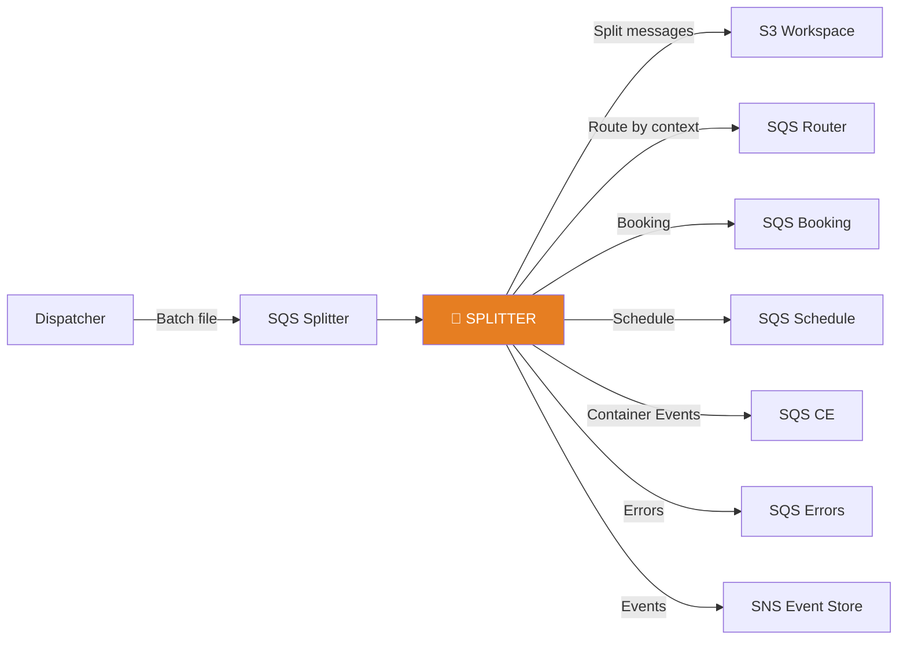
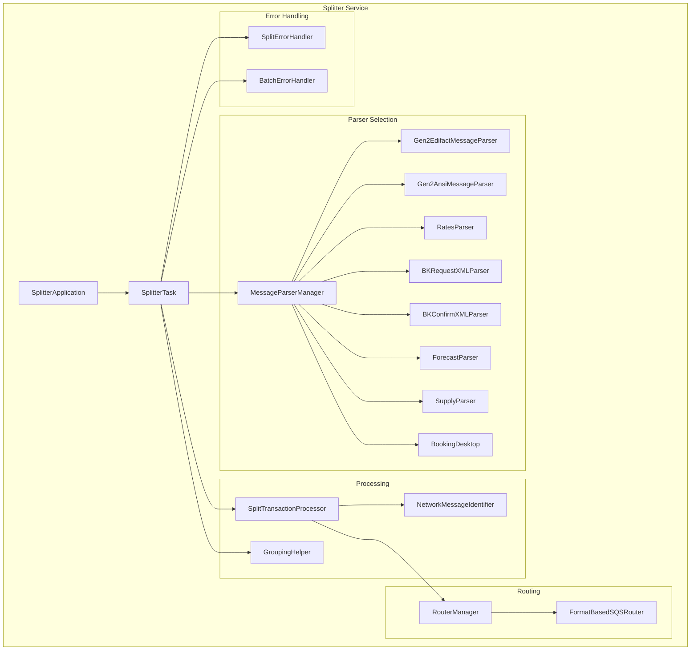
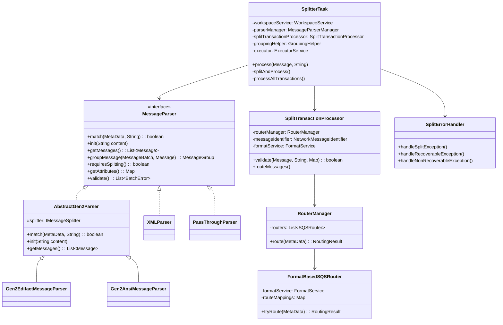
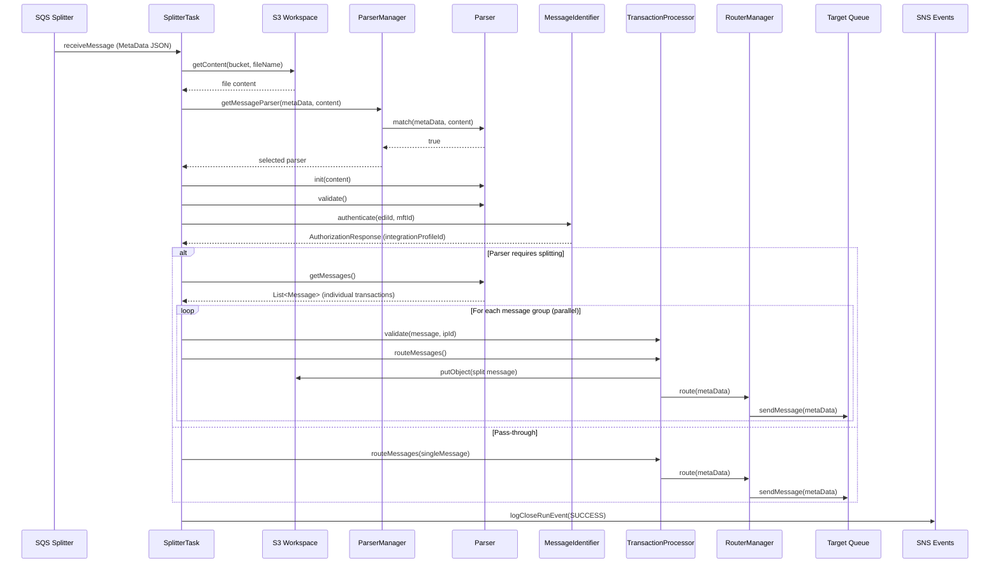
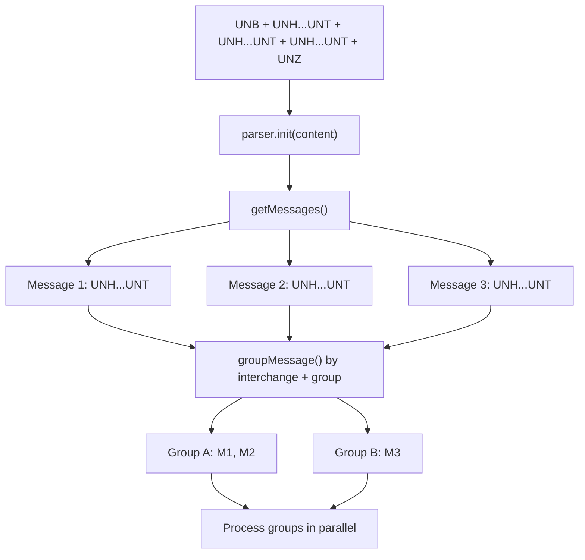
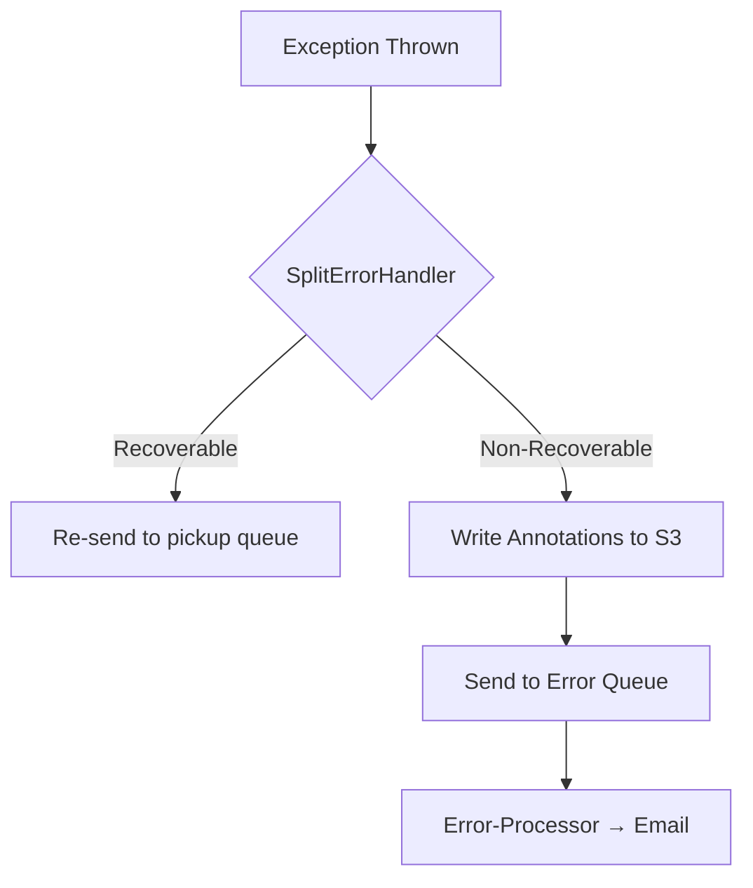

# Splitter Module — Design Document

> **Module:** `splitter`  
> **Generated:** 2026-05-24  
> **Artifact:** `com.inttra.mercury.splitter:splitter:1.0-SNAPSHOT`  
> **Java Version:** 17 | **Framework:** Dropwizard 4.x + Guice 7.x

---

## 1. Executive Summary

The **Splitter** is the message parsing and decomposition engine of AppianWay. It receives batch EDI files from the Dispatcher, identifies the message format (EDIFACT, ANSI X12, XML, Rates, etc.), splits multi-transaction batches into individual messages, validates EDI envelopes, authenticates senders via integration profiles, and routes each message to context-specific downstream queues.

---

## 2. Role in the Pipeline

---

## 3. High-Level Architecture

---

## 4. Class Diagram

---

## 5. Data Flow Diagram

---

## 6. Parser Strategy Matrix

| Parser | Format | Splitting | Match Logic |
|--------|--------|-----------|-------------|
| `Gen2EdifactMessageParser` | UN/EDIFACT | Yes | `matchEnvelope()` → UNB segment |
| `Gen2AnsiMessageParser` | ANSI X12 | Yes | `matchEnvelope()` → ISA segment |
| `RatesParser` | Rate sheets | No (pass-through) | FILE_TYPE contains "rate" |
| `BKRequestXMLParser` | Booking Request XML | No | Root element match |
| `BKConfirmXMLParser` | Booking Confirm XML | No | Root element match |
| `ForecastParser` | CFast Forecast | No | FILE_TYPE match |
| `SupplyParser` | CFast Supply | No | FILE_TYPE match |
| `BookingDesktop` | Desktop Booking | No | FILE_TYPE match |

---

## 7. EDI Splitting Process (EDIFACT Example)

**Grouping criteria:** Messages are grouped by:
- Interchange control reference number
- Group control number
- Message type code

---

## 8. Route Mapping Configuration

| Context Code | Target Queue | Business Domain |
|-------------|-------------|-----------------|
| `requestBooking` | Booking queue | Booking requests |
| `confirmBooking` | Booking Confirm queue | Booking confirmations |
| `submitSI` | SI queue | Shipping instructions |
| `publishContainerEvent` | CE queue | Container events |
| `publishSchedule` | Schedule queue | Vessel schedules |
| `publishRate` | Rate queue | Rate publications |
| `publishCFast` | CFast queue | Forecast/Supply |

---

## 9. Error Handling

| Exception | Error Code | Behavior |
|-----------|-----------|----------|
| `MandatoryElementNotProvidedException` | `/exception/splitter/business/.../mandatoryStructuralElementNotProvided` | Non-recoverable |
| `EmptyMessageTypeException` | `/exception/splitter/business/.../emptyMessageType` | Non-recoverable |
| `EmptyReleaseVersionException` | `/exception/splitter/business/.../emptyReleaseVersion` | Non-recoverable |
| `AuthorizationException` | `/exception/splitter/business/.../integrationProfileFormatNotFound` | Non-recoverable |
| `ParserNotFoundException` | `/exception/splitter/business/.../parserNotFound` | Non-recoverable |
| `EdiIdNotProvidedException` | `/exception/splitter/business/.../ediIdNotProvided` | Non-recoverable |
| `RecoverableException` | — | Retry via pickup queue |

### Error Flow

---

## 10. Configuration Details

| Property | Type | Default | Description |
|----------|------|---------|-------------|
| `componentName` | String | `splitter` | Service identity |
| `healthCheckConfig.errorRateThreshold` | Double | `5.0` | Error rate limit |
| `sqsPickupConfig.queueUrl` | String | — | Splitter pickup queue |
| `sqsPickupConfig.waitTimeSeconds` | int | `20` | Long poll |
| `sqsPickupConfig.maxNumberOfMessages` | int | `10` | Batch/thread count |
| `sqsRouterConfig.queueUrl` | String | — | Default router queue |
| `sqsErrorConfig.queueUrl` | String | — | Error subscription queue |
| `snsEventConfig.topicArn` | String | — | Event topic |
| `s3WorkspaceConfig.bucket` | String | — | Workspace bucket |
| `enabledParsers` | List | 8 parsers | Parser class names (ordered) |
| `routeMappings` | Map | — | Context code → queue URL |
| `routersOrder` | List | `[format_based]` | Router chain priority |
| `networkServiceConfig.*` | Object | — | Network service endpoints |

---

## 11. Key Maven Dependencies

| Dependency | Version | Purpose |
|-----------|---------|---------|
| `mercury-shared` | 1.0 | Framework, S3, SQS, events |
| `gen2-parser` | 1.0 | EDI splitting engine |
| `dropwizard-core` | 4.0.16 | Application framework |
| `guice` | 7.0.0 | DI container |
| `guava` | 33.1.0-jre | Utilities |
| `metrics-guice` | 3.1.3 | AOP metrics |
| `lombok` | 1.18.32 | Code generation |

---

## 12. Design Patterns

| Pattern | Usage |
|---------|-------|
| **Strategy** | 8 MessageParser implementations |
| **Chain of Responsibility** | RouterManager with ordered routers |
| **Template Method** | AbstractGen2Parser base |
| **Observer** | EventLogger for workflow events |
| **Fork-Join** | CompletableFuture parallel processing of message groups |
| **Factory** | TaskFactory for task instances |
