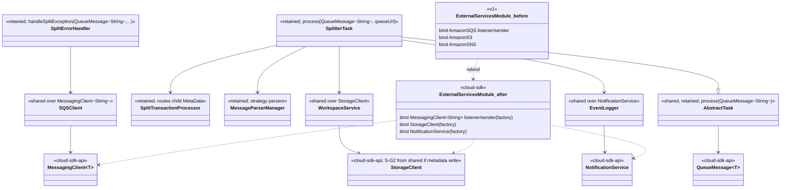
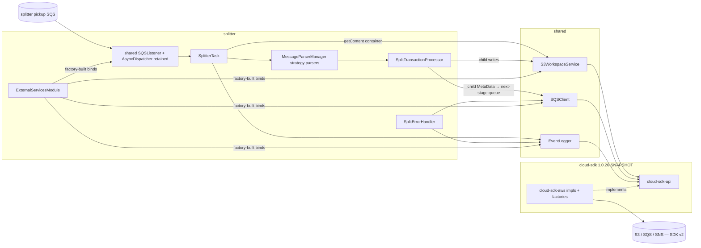
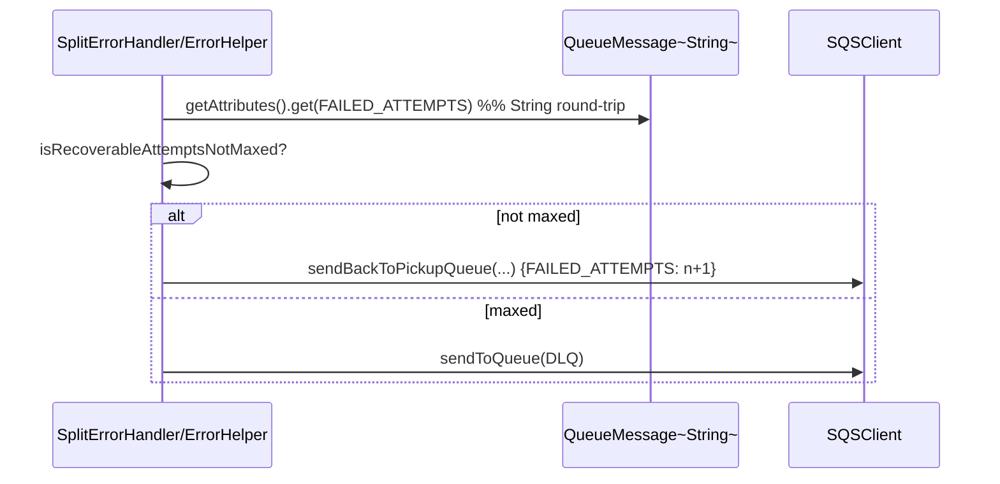

# `splitter` — AWS SDK v2 (cloud-sdk) Upgrade DESIGN (claude)

> Module: `com.inttra.mercury.appian-way:splitter:1.0` · Date: 2026-05-31 · Author: Claude (Opus 4.8)
> **Chosen option: B — `commons` + `cloud-sdk-api`/`cloud-sdk-aws` (`1.0.26-SNAPSHOT`) on Dropwizard 5.** Option A is the documented fallback (same cloud-sdk contract).
> Companion: [plan](2026-05-31-splitter-aws2x-upgrade-plan-claude.md). Master: [`shared` DESIGN](../../shared/docs/2026-05-31-shared-aws2x-upgrade-DESIGN-claude.md) §5 (config) / §6 (cloud-sdk specs).

---

## 1. Overview & chosen option

splitter is the **standard service pattern**: a pure consumer rebind. Two moves, no business-logic change:
1. **Rebind** [`ExternalServicesModule`](../src/main/java/com/inttra/mercury/splitter/modules/ExternalServicesModule.java) from v1 `Amazon{SQS,S3,SNS}` builders to the cloud-sdk `MessagingClientFactory`/`StorageClientFactory`/`NotificationClientFactory` (binding `MessagingClient<String>` listener+sender, `StorageClient`, `NotificationService`), mirroring `mercury-services` `BookingMessagingModule`.
2. **Inherit** the `QueueMessage<String>` task chain from `shared`: the v1 `com.amazonaws.services.sqs.model.Message` element ([`SplitterTask.java:95`](../src/main/java/com/inttra/mercury/splitter/task/SplitterTask.java), [`SplitErrorHandler.java:65`](../src/main/java/com/inttra/mercury/splitter/task/SplitErrorHandler.java)) becomes `QueueMessage<String>`.

The strategy-pattern parser, child-`MetaData` creation, integration-profile authentication/enrichment, routing, and event lineage are **unchanged**. **No splitter-specific cloud-sdk change**; splitter relies only on shared's additive **S-G2** (and only where a child-write carries metadata — the container access is a metadata-less read).

---

## 2. Class diagram (Guice bindings before → after)



**Removed v1 types:** `AmazonS3/SQS/SNS(ClientBuilder)`, `com.amazonaws.services.sqs.model.Message`.

---

## 3. Component diagram



---

## 4. Sequence diagram — consume → split → child messages

```mermaid
sequenceDiagram
    participant L as SQSListener (appianway, retained)
    participant T as SplitterTask
    participant WS as WorkspaceService (StorageClient)
    participant PM as MessageParserManager / parser
    participant IP as IntegrationProfile services
    participant STP as SplitTransactionProcessor
    participant Q as SQSClient (MessagingClient~String~)
    participant EL as EventLogger
    L->>T: process(QueueMessage<String>, queueUrl)
    T->>T: body → MetaData (Json.fromJsonString)
    T->>WS: getContent(bucket, fileName, ISO-8859-1)  %% container envelope
    WS-->>T: content
    T->>PM: getMessageParser(metaData, content); init; validate
    alt requiresSplitting
        PM-->>T: List<child Message>
        loop each child
            T->>STP: validate(child, metaData, ...)
            T->>STP: groupMessage(batch, child)
        end
        T->>STP: routeMessages(group) per group (async)
        STP->>WS: putObject(child body)  %% metadata-less; S-G2 only if metadata set
        STP->>Q: sendMessage(next-stage queue, child MetaData)
    else single document
        T->>STP: routeToQueue(enriched metaData)
        STP->>Q: sendMessage(routed queue, metaData)
    end
    T->>EL: logCloseRunEvent(CLOSE_WORKFLOW, success)
    Note over T,L: on success AbstractTask deletes via MessagingClient.deleteMessage(url, receiptHandle)
```

Child lineage preserved: `rootWorkflowId`/`parentWorkflowId`/`workflowId` and `MetaData.Projection.*` (EDIID, INTEGRATION_PROFILE_ID, INTERCHANGE_CONTROL_REFERENCENUMBER) built in [`SplitterTask.buildMetaData`](../src/main/java/com/inttra/mercury/splitter/task/SplitterTask.java:260) / `enrichProjections` — unchanged.

### 4.1 Retry counter on failure (FAILED_ATTEMPTS, inherited)


---

## 5. Configuration changes

Reference master [§5](../../shared/docs/2026-05-31-shared-aws2x-upgrade-DESIGN-claude.md). [`conf/splitter.yaml`](../conf/splitter.yaml) keys preserved: `sqsPickupConfig` (`waitTimeSeconds:20`, `maxNumberOfMessages:10`) → `ReceiveMessageOptions`; `sqsRouterConfig`, `routeMappings`, `sqsErrorConfig`, `snsEventConfig`, `s3WorkspaceConfig`, `enabledParsers`, `routersOrder`, `networkServiceConfig` unchanged; `${PROFILE}`/`${ENV}`/`${awsps:...}` resolution unchanged. The appianway composed `ServerCommand` (master §5) supplies the placeholder + SSM chain. DW5: verify `server`/`logging`/`metrics` under `io.dropwizard.core.*`.

---

## 6. cloud-sdk gaps to implement

**None beyond shared S-G2.** splitter introduces no cloud-sdk change.
- It relies on the standard `cloud-sdk-api` surface already present: `MessagingClient<String>` (send/receive/delete), `StorageClient` (getContent read; copy/put), `NotificationService` (lineage), `QueueMessage<String>` (`getPayload`/`getReceiptHandle`/`getAttributes`/`getMessageId`).
- Shared's additive **S-G2** (master [§6.1](../../shared/docs/2026-05-31-shared-aws2x-upgrade-DESIGN-claude.md): `StorageClient.putObject(...,Map metadata,String contentType)`) is consumed **only** where a child-write or error-write path carries user metadata (routed through `SplitTransactionProcessor`/`ErrorHelper` in shared). The container envelope access in [`SplitterTask.getFileContent`](../src/main/java/com/inttra/mercury/splitter/task/SplitterTask.java:192) is a metadata-less **read** and needs no new overload.
- G1 (concurrent listener), G6 (config), G7 (health) are inherited shared/platform concerns (master §0/§11), not splitter gaps. The split-strategy parsing stays appianway-local — no cloud-sdk gap.

---

## 7. Maven dependency changes

[`pom.xml`](../pom.xml):
- **Remove:** `com.amazonaws:aws-java-sdk-sqs:${aws-java-sdk.version}` ([:58-63](../pom.xml)).
- **Add:** `com.inttra.mercury:cloud-sdk-api:1.0.26-SNAPSHOT`, `com.inttra.mercury:cloud-sdk-aws:1.0.26-SNAPSHOT` (versions from root `dependencyManagement`), and `commons:1.0.26-SNAPSHOT` if naming commons types directly; v2 runtime arrives transitively via `mercury-shared`. `gen2-parser` dependency unchanged.
- Add `dropwizard-testing` (JUnit 5) for new tests; `junit-vintage-engine` during transition. cloud-sdk-aws excludes Netty (Apache HTTP client only) — verify the shade uber-jar.

---

## 8. Test details

- **New tests in JUnit 5**; existing JUnit 4 via vintage during transition.
- **Split-strategy unit tests** (Gen2 EDIFACT/ANSI/XML/rates/cfast/desktop parsers, grouping, child-`MetaData` lineage) are **unaffected** — they do not touch AWS.
- Tests referencing the v1 SQS `Message` → build a `QueueMessage<String>` double (body, receiptHandle, `FAILED_ATTEMPTS` attribute).
- **functional-testing fakes** re-pointed to `cloud-sdk-api` interfaces (in-memory S3/SQS/SNS), lockstep with `shared`. Assert behavior preserved: container read → N child messages on the correct next-stage queues, `rootWorkflowId`/`parentWorkflowId`/`workflowId` propagation, START/CLOSE lineage events, recoverable-retry vs DLQ on the error path.

---

## 9. Rollout & verification

1. After shared's **S-G2** lands additively and `shared` + `functional-testing` are migrated (and pilot `event-writer`).
2. Migrate splitter: pom swap → rebind module → inherit `QueueMessage<String>` chain → `mvn -pl splitter -am verify`.
3. Dev smoke: enqueue a representative envelope per parser family, confirm child fan-out to the mapped queues, integration-profile enrichment, and lineage events; verify recoverable-retry and DLQ paths.

---

## 10. Risks & mitigations

| Risk | Mitigation |
|---|---|
| Per-role `ClientConfiguration`→v2 override mapping gaps (`sqs_listener`/`sqs_sender`/`s3_read_put_copy`/`sns_publish`) | Centralized in `shared`/cloud-sdk-aws factories; functional-test assert; same mapping as dispatcher/event-writer |
| `Message`→`QueueMessage<String>` attribute/receipt drift | Inherited from `shared`; `QueueMessage` parity round-trip tests (master §8) |
| Child-message lineage regression | Preserve `rootWorkflowId`/`workflowId`/`parentWorkflowId` + projections; assert in functional tests |
| `FAILED_ATTEMPTS` retry-count semantics | `String` attribute round-trip on `QueueMessage` (master §3 — confirmed) |
| DW4→5 inherited churn | Inherited from `shared`; per-module verify gate; Option A fallback |
| Any cloud-sdk change breaking mercury-services | splitter introduces none; only consumes additive shared S-G2 (master §0 contract) |
