# Structural-Validator Module — Architecture & Design

> **Author:** Principal Engineering Review  ·  **Date:** 2026-05-24  ·  **Module Version:** 1.0 (see [`pom.xml:9`](../pom.xml))

---

## Table of Contents

1. [Executive Summary](#1-executive-summary)
2. [Position in the Mercury Pipeline](#2-position-in-the-mercury-pipeline)
3. [High-Level Architecture](#3-high-level-architecture)
4. [Low-Level Design](#4-low-level-design)
5. [Key Classes — Class Diagram](#5-key-classes--class-diagram)
6. [Data Flow Diagram](#6-data-flow-diagram)
7. [Component Dependencies](#7-component-dependencies)
8. [Configuration & Validation](#8-configuration--validation)
9. [Maven Dependencies](#9-maven-dependencies)
10. [How the Module Works — Detailed Walkthrough](#10-how-the-module-works--detailed-walkthrough)
11. [Error Handling & Edge Cases](#11-error-handling--edge-cases)
12. [Operational Notes](#12-operational-notes)
13. [Open Questions / Risks](#13-open-questions--risks)

---

## 1. Executive Summary

The **`structuralvalidator`** module is the **schema-level, format-conformance gate** of the Appian Way (Mercury) platform. It answers a single, narrow question for every inbound message:

> *“Does this payload conform to the structural contract — the right segments, in the right order, with the right cardinalities, lengths, data types, and enumerated qualifier codes — defined for the declared format and version?”*

It does **not** answer business questions such as *“Is the carrier known to us?”*, *“Is the booking number unique?”* or *“Are dates in the future?”*. Those questions are the responsibility of the sibling [`validator`](../../validator/) module, which executes business-rule (content) validation **after** the structural gate has been cleared.

### Packaging model

Unlike most of the other modules in the platform, this module is **packaged as a library JAR** (`<packaging>jar</packaging>` — [`pom.xml:10`](../pom.xml)) and not as a standalone Dropwizard service. There is **no `Application` class, no Dockerfile, no `Configuration` YAML, no `conf/` directory, no Guice module of its own, and no SQS listener inside this artifact.** Consumers — primarily the [`transformer`](../../transformer/) module — link this JAR onto their classpath and call into it directly via the [`StructuralValidator`](../src/main/java/com/inttra/mercury/structuralvalidator/common/structuralvalidation/StructuralValidator.java) facade.

The actual SQS-driven host that owns the dataflow (read a message → invoke structural validation → publish result for Functional Acknowledgement (FA) → forward or fail) lives in the transformer’s [`StructuralValidationFAProcessor`](../../transformer/src/main/java/com/inttra/mercury/transformer/task/StructuralValidationFAProcessor.java). Sections [§2](#2-position-in-the-mercury-pipeline) and [§6](#6-data-flow-diagram) describe how the embedding orchestrator drives the library; sections [§3](#3-high-level-architecture)–[§5](#5-key-classes--class-diagram) describe the library itself.

### Formats covered

The library currently provides structural rulesets for five EDI message identifiers, all UN/EDIFACT D99B except for ANSI X12 T323:

| Identifier              | Message family                   | Standard          | Direction | Ruleset class                                                                                                                                                              |
|-------------------------|----------------------------------|-------------------|-----------|------------------------------------------------------------------------------------------------------------------------------------------------------------------------------|
| `IFTSTA_D99B_IN_V1`     | International Multimodal Status  | EDIFACT D99B      | Inbound   | [`IFTSTA_D99B_IN_V1_RulesetProvider`](../src/main/java/com/inttra/mercury/structuralvalidator/ifsta/IFTSTA_D99B_IN_V1_RulesetProvider.java)                                  |
| `IFTSAI_D99B_IN_V1`     | Schedule / Sailing Information   | EDIFACT D99B      | Inbound   | [`IFTSAI_D99B_IN_V1_RulesetProvider`](../src/main/java/com/inttra/mercury/structuralvalidator/iftsai/IFTSAI_D99B_IN_V1_RulesetProvider.java)                                |
| `T323_4010_IN_V1`       | (X12 323 — Vessel Loading Plan)  | ANSI X12 4010     | Inbound   | [`T323_4010_IN_V1_RulesetProvider`](../src/main/java/com/inttra/mercury/structuralvalidator/t323/T323_4010_IN_V1_RulesetProvider.java)                                      |
| `IFTMBC_D99B_IN_V1`     | Booking Confirmation             | EDIFACT D99B      | Inbound   | [`IFTMBC_D99B_IN_V1_RulesetProvider`](../src/main/java/com/inttra/mercury/structuralvalidator/iftmbc/IFTMBC_D99B_IN_V1_RulesetProvider.java)                                |
| `IFTMBF_D99B_IN_V1`     | Firm Booking                     | EDIFACT D99B      | Inbound   | [`IFTMBF_D99B_IN_V1_RulesetProvider`](../src/main/java/com/inttra/mercury/structuralvalidator/iftmbf/IFTMBF_D99B_IN_V1_RulesetProvider.java)                                |

Plus an additional surface for **XML structural (XSD) validation** of inbound XML booking requests via [`XMLResultProvider`](../src/main/java/com/inttra/mercury/structuralvalidator/common/structuralvalidationresult/XMLResultProvider.java) — though the actual XSD load and `javax.xml.validation.Validator` invocation happens in the consuming `transformer` (see [`StructuralValidationFAProcessor:67-107`](../../transformer/src/main/java/com/inttra/mercury/transformer/task/StructuralValidationFAProcessor.java)). The library provides the **result envelope** building blocks.

### What this document covers

This document is the principal engineering reference for the structural-validator JAR: its architecture, class structure, data flow, configuration, dependencies, error model, edge cases, operational concerns, and open risks. It is intentionally precise about the boundary between this module and the business-rule `validator` module. Where the embedding orchestrator (transformer) does work that the library depends on (XSD loading, SQS publishing, FA generation), the document refers to it but never confuses ownership.

### Structural vs. Business: the boundary, stated bluntly

| Concern                                                        | Owned by                       |
|----------------------------------------------------------------|--------------------------------|
| Segment is present at the correct position                     | **structuralvalidator** (this) |
| Element data type is `AN` / `A` / `N`                          | **structuralvalidator**        |
| Element length within min/max                                  | **structuralvalidator**        |
| Qualifier value is in the enumerated allow-list                | **structuralvalidator**        |
| Segment / loop occurs within `segmentMinCount`–`segmentMaxCount` | **structuralvalidator**     |
| Cross-segment qualifier occurrence (e.g. only one `AAA` per tx)| **structuralvalidator** (custom EDI validations) |
| Carrier identifier is registered                               | `validator`                    |
| Booking number unique across active bookings                   | `validator`                    |
| Container number passes ISO-6346 check digit                   | `validator`                    |
| Date is plausible (not 1970, not 2099, etc.)                   | `validator`                    |

Anything that requires reference data, lookups, persistence, or cross-message state is **out of scope** for this module.

---

## 2. Position in the Mercury Pipeline

Mercury (Appian Way) is a multi-stage SQS-driven message-processing pipeline that ingests carrier and customer EDI/XML traffic, normalises it, and forwards it to downstream INTTRA and customer systems. The structural-validator sits in the **inbound transform stage**, after raw payload acquisition and EDI-to-JSON pivoting and before any business-meaning interpretation.

### End-to-end pipeline (inbound flow)

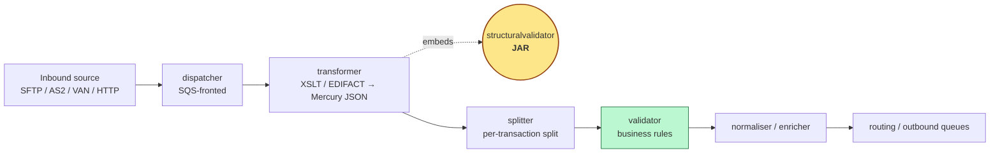

### Where the structural check actually fires

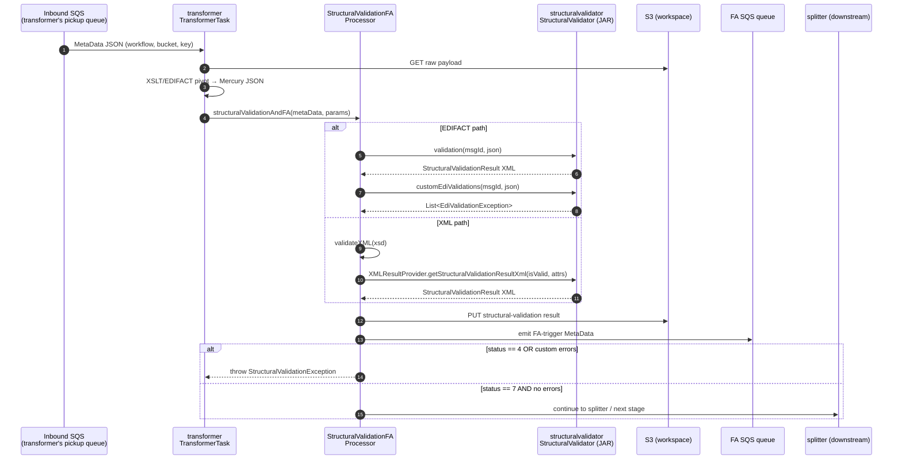

### Why this is a library, not a service

The decision to keep structural validation in-process (a JAR) rather than out-of-process (a microservice) is deliberate:

- **Latency**: every inbound transaction needs structural validation; an SQS round-trip per transaction would double the per-message cost.
- **Determinism**: the rules are pure functions of (`messageIdentifier`, `payload`). No I/O, no shared state, no clock dependency. They are perfectly safe to run in-process.
- **Cohesion with transformer**: the transformer already owns the workspace S3 access, FA queue, and `MetaData` lifecycle. Splitting structural validation into a service would force duplication of orchestration.
- **Failure semantics**: a structural failure is a *poison-pill* signal for the current transaction — the transformer needs the result synchronously to decide whether to publish for FA, escalate, or proceed. Synchronous in-process is the simplest contract.

The trade-off is that a JVM upgrade or library bump of `structuralvalidator` requires redeploying every consumer (today: just `transformer`).

### Position relative to `validator` (business rules)

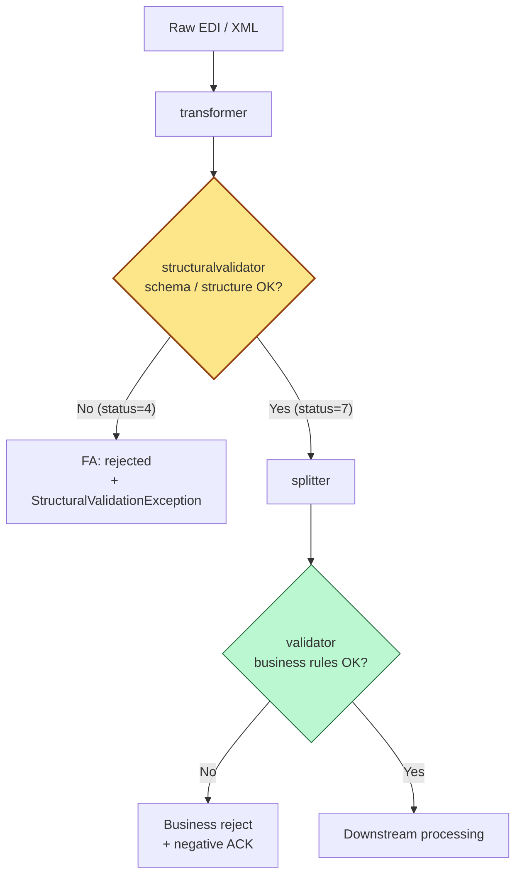

The two modules form a *defence in depth* pair. `structuralvalidator` ensures the bytes form a parseable, in-spec EDI/XML message before any business logic touches it. `validator` then trusts that structural shape and applies business meaning.

---

## 3. High-Level Architecture

### Architectural style

Inside the JAR the design follows a **Strategy + Builder** combination:

- **Strategy** — there is one `RulesetProvider` interface and one implementation per supported message identifier. A factory ([`MessageRulesetProvider`](../src/main/java/com/inttra/mercury/structuralvalidator/common/ruleset/MessageRulesetProvider.java)) selects the right strategy from a `messageIdentifier` string.
- **Builder** — each ruleset is composed by chaining `SegmentRuleSet.builder()…build()` and `ElementRuleSet.builder()…build()` calls (both builders live in the shared library `mercury-shared` — `com.inttra.mercury.shared.structuralvalidationcommons.*`). Rules are pure data: no behaviour, no I/O.

The actual *engine* that walks a payload against a ruleset list lives in `mercury-shared` (`DataValidator`). This module supplies the **ruleset catalogue** and the **result-envelope construction** logic only.

### Logical layers

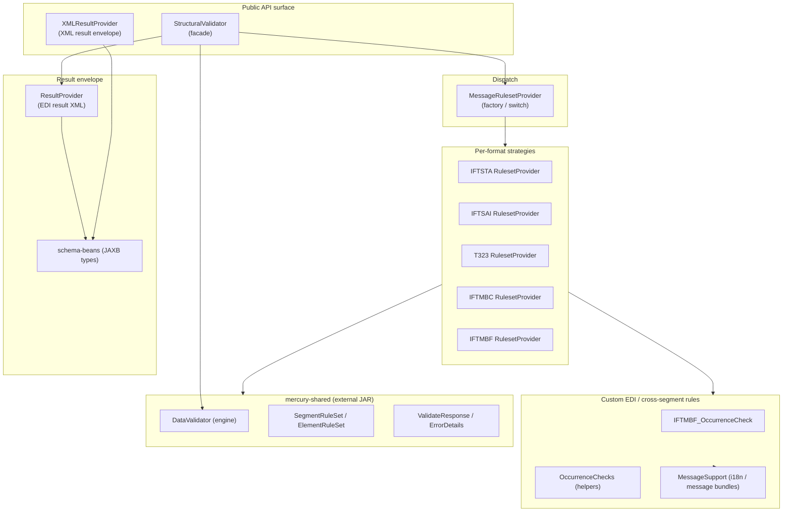

### Components in one paragraph each

#### `StructuralValidator` — the facade
A thin, stateless facade exposing two methods: `validation(messageIdentifier, messageString)` for the main schema check and `customEdiValidations(messageIdentifier, messageString)` for cross-segment occurrence rules. It composes a `RulesetProvider`, hands the rules to the shared `DataValidator`, then forwards the per-segment responses into `ResultProvider` to produce the canonical `StructuralValidationResult` XML. See [`StructuralValidator.java:38–86`](../src/main/java/com/inttra/mercury/structuralvalidator/common/structuralvalidation/StructuralValidator.java).

#### `MessageRulesetProvider` — the strategy factory
A `switch` over a tiny constant set of message identifiers. Each case constructs the corresponding `RulesetProvider`. The default branch falls through to `IFTSTA_D99B_IN_V1_RulesetProvider` — a defensive choice but arguably the wrong one (see [§13](#13-open-questions--risks)). See [`MessageRulesetProvider.java:31-46`](../src/main/java/com/inttra/mercury/structuralvalidator/common/ruleset/MessageRulesetProvider.java).

#### `RulesetProvider` — the strategy interface
Two methods: `get_segmentRuleSetList()` returns the immutable list of `SegmentRuleSet`s defining the message’s grammar; `customEDIValidations(String messageString)` returns a list of `EdiValidationException`s representing cross-segment / occurrence violations that cannot be expressed in a single-segment grammar. See [`RulesetProvider.java:8-14`](../src/main/java/com/inttra/mercury/structuralvalidator/common/ruleset/RulesetProvider.java).

#### Per-format providers
Each provider builds its full ruleset in its constructor and caches it for the lifetime of the instance. For EDIFACT messages the grammar is expressed as a list of nested segments and loops (`UNB → UNH_Loop → UNH → BGM → … → UNT → UNZ`). For ANSI X12 (T323) the grammar is `ISA → GS → ST_Loop → … → SE → GE → IEA`. The IFTMBC and IFTMBF providers additionally implement extensive `customEDIValidations` that walk the JSON tree directly using Jackson’s `JsonNode` API.

#### `IFTMBF_D99B_IN_V1_OccurrenceCheck` and `OccurrenceChecks`
Two layers of helpers for cross-segment counting rules: `OccurrenceChecks` is a generic toolkit (collect qualifier occurrences by JSON path, check exclusivity, mutual exclusion, qualifier-must-be-present); `IFTMBF_D99B_IN_V1_OccurrenceCheck` is the message-specific orchestrator that wires the generic checks into named business rules (e.g. *“no more than three `AAI` carrier comment FTX qualifiers per transaction”*).

#### `ResultProvider` and `XMLResultProvider`
Two result-envelope builders. `ResultProvider` is used after EDIFACT validation: it walks the `ValidateResponse` list emitted by the engine and produces a `StructuralValidationResult` XML (via JAXB schema beans from the `mercury-schemas` artifact). `XMLResultProvider` is a lighter variant for inbound XML payloads: it accepts an `isXMLValid` boolean and a map of extracted attributes (shipment id, document id, etc.) and produces the same `StructuralValidationResult` XML envelope.

#### `MessageSupport`
A tiny `ResourceBundle`-backed message lookup with locale-keyed caching. Used by the IFTMBC / IFTMBF custom validations to look up human-readable error strings by code (e.g. `215007`, `224058`) from [`booking/iftmbf.properties`](../src/main/resources/booking/iftmbf.properties) and [`booking/iftmbc.properties`](../src/main/resources/booking/iftmbc.properties).

#### `GenerateRuleSet` (offline tool)
Standalone main-class utility — *not* part of the runtime path — that reads a `.sef` (Standard Exchange Format) file and prints the equivalent Java source for `SegmentRuleSet` / `ElementRuleSet` builders. It is a one-shot **developer ergonomics tool** for bootstrapping a new ruleset from a published EDIFACT/X12 standard file. See [`GenerateRuleSet.java:24`](../src/main/java/com/inttra/mercury/structuralvalidator/common/ruleset/GenerateRuleSet.java).

---

## 4. Low-Level Design

### Per-format strategy pattern

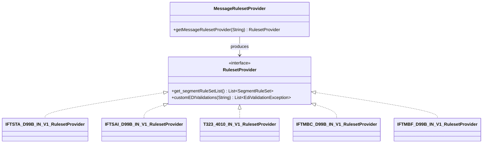

Two important properties:

1. **Ruleset construction happens once per provider instance, in the constructor.** For example [`IFTSTA_D99B_IN_V1_RulesetProvider:27-30`](../src/main/java/com/inttra/mercury/structuralvalidator/ifsta/IFTSTA_D99B_IN_V1_RulesetProvider.java) calls `buildSegmentRuleSet()` immediately. The internal `List<SegmentRuleSet>` is then cached on the instance.
2. **A new `RulesetProvider` is instantiated per call** to `StructuralValidator.validation(...)`. This is wasteful in theory — see [§13](#13-open-questions--risks) — but each ruleset construction is pure CPU and the cost per call is low (a few hundred microseconds at most for the largest providers).

### Strategy selection

`MessageRulesetProvider.getMessageRulesetProvider(String)` is implemented as a plain `switch`:

```java
case IFTSTA_D99B_V1_MESSAGE_IDENTIFIER:
    return new IFTSTA_D99B_IN_V1_RulesetProvider();
case IFTSAI_D99B_V1_MESSAGE_IDENTIFIER:
    return new IFTSAI_D99B_IN_V1_RulesetProvider();
case T323_4010_IN_V1_MESSAGE_IDENTIFIER:
    return new T323_4010_IN_V1_RulesetProvider();
case IFTMBC_D99B_IN_V1_MESSAGE_IDENTIFIER:
    return new IFTMBC_D99B_IN_V1_RulesetProvider();
case IFTMBF_D99B_IN_V1_MESSAGE_IDENTIFIER:
    return new IFTMBF_D99B_IN_V1_RulesetProvider();
default:
    return new IFTSTA_D99B_IN_V1_RulesetProvider();
```

— see [`MessageRulesetProvider.java:32-45`](../src/main/java/com/inttra/mercury/structuralvalidator/common/ruleset/MessageRulesetProvider.java). The default branch silently returns the IFTSTA ruleset, which is almost certainly the wrong behaviour for an unknown identifier — the safer alternative would be `throw new IllegalArgumentException("Unknown message identifier: " + messageIdentifier)`.

### Ruleset model — `SegmentRuleSet` and `ElementRuleSet`

These types live in `mercury-shared` (`com.inttra.mercury.shared.structuralvalidationcommons`). Their shapes — inferred from the builder usage throughout this module — are:

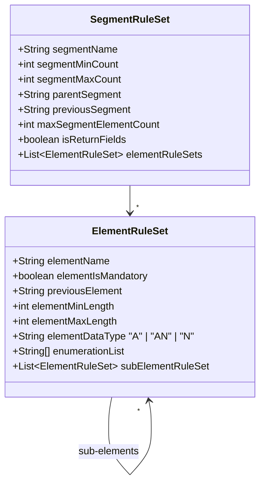

The grammar is encoded as a **flat list of segment rules in document order**, with `parentSegment` indicating the nesting (loop) and `previousSegment` indicating the document-order predecessor. Loops appear as pseudo-segments whose names end in `_Loop` (e.g. `UNH_Loop`, `STS_Loop`, `EQD_Loop`). Loop pseudo-segments carry no element rules — they exist purely to anchor `parentSegment` references for their children.

For example, looking at IFTSTA D99B inbound ([`IFTSTA_D99B_IN_V1_RulesetProvider.java:46-72`](../src/main/java/com/inttra/mercury/structuralvalidator/ifsta/IFTSTA_D99B_IN_V1_RulesetProvider.java)):

```
UNB
UNH_Loop
  UNH
  BGM
  DTM
  NAD_Loop
    NAD
  RFF_Loop
    RFF
  CNI_Loop
    CNI
    STS_Loop
      STS
      DTM (STS-scoped)
      FTX (STS-scoped)
      LOC (STS-scoped)
      TDT_Loop
        TDT
        LOC_Loop
          LOC
          DTM
      EQD_Loop
        EQD
  UNT
UNZ
```

### Validation engine (lives in `mercury-shared`)

The engine is `DataValidator`. The library calls it like this ([`StructuralValidator.java:56-58`](../src/main/java/com/inttra/mercury/structuralvalidator/common/structuralvalidation/StructuralValidator.java)):

```java
DataValidator dataValidator = new DataValidator(messageString, segmentRuleSetList);
validateResponseList = dataValidator.validate();
```

Per the responses observed in tests, the engine produces one `ValidateResponse` per segment instance in the input, each carrying:

- `segmentName`
- `isError` (boolean)
- optional `SegmentError` with a list of `ErrorDetails` (each with `errorCode`, `errorDescription`, `errorUrn`)
- optional `ElementError` list
- a `DataFields` map (`HashMap<String,String>`) of recovered element/sub-element values when `isReturnFields=true`

These responses are then handed to `ResultProvider` to be turned into the canonical XML result envelope.

### Custom EDI validations — beyond single-segment rules

A single-segment ruleset cannot express constraints that span multiple segments or instances. Examples:

- *“At most three `FTX` segments with qualifier `AAI` may appear in the header of an IFTMBF.”*
- *“`SAD` and `SBD` are mutually exclusive within an EQD-loop.”*
- *“If `BGM03` is `1` or `17`, suppress codes `224058` and `224023` from the error list.”*

These are implemented by walking the EDI-JSON tree directly with Jackson `JsonNode`. The IFTMBF case ([`IFTMBF_D99B_IN_V1_OccurrenceCheck.java`](../src/main/java/com/inttra/mercury/structuralvalidator/iftmbf/IFTMBF_D99B_IN_V1_OccurrenceCheck.java), 625 lines) is the canonical example; IFTMBC has a parallel implementation in [`IFTMBC_D99B_IN_V1_RulesetProvider.java`](../src/main/java/com/inttra/mercury/structuralvalidator/iftmbc/IFTMBC_D99B_IN_V1_RulesetProvider.java).

#### Generic helper kit — `OccurrenceChecks`

[`OccurrenceChecks`](../src/main/java/com/inttra/mercury/structuralvalidator/common/util/OccurrenceChecks.java) provides reusable count/qualifier helpers:

- `collectQualifierOccurrenceNumberByPath(countMap, node, 0, "FTX", "FTX01")` — walks the JSON tree along a path, accumulating a count of each leaf value into `countMap`.
- `qualifierOccurrenceCheck(countMap, "AAI", 3, errors, "215007", v1, v2, messages)` — if `countMap["AAI"] > 3`, append an `EdiValidationException("215007", interpolatedMessage)` to `errors`.
- `qualifierMustPresentCheck(...)` — required qualifier.
- `qualifierMutualExclusiveOccurrenceCheck(...)` — at most one of `(code1, code2)`.
- `onlyOneMaybePresentCheck(...)` — three-way at-most-one.
- `invalidQualifierCheck(...)` — qualifier not in allow-list.
- `loopAndDo(node, "GID_Loop", consumer)` — array-iteration utility.
- `findQualifierValueByPath(node, 0, "BGM", "BGM03")` — single value lookup along a path.

Error messages are loaded from properties files via `MessageSupport`. Each message can contain `${value1}`, `${value2}`, `${value3}` placeholders which the helpers substitute (typically: cargo item number, container size/type code, the offending qualifier).

### Result envelope — `ResultProvider` and `XMLResultProvider`

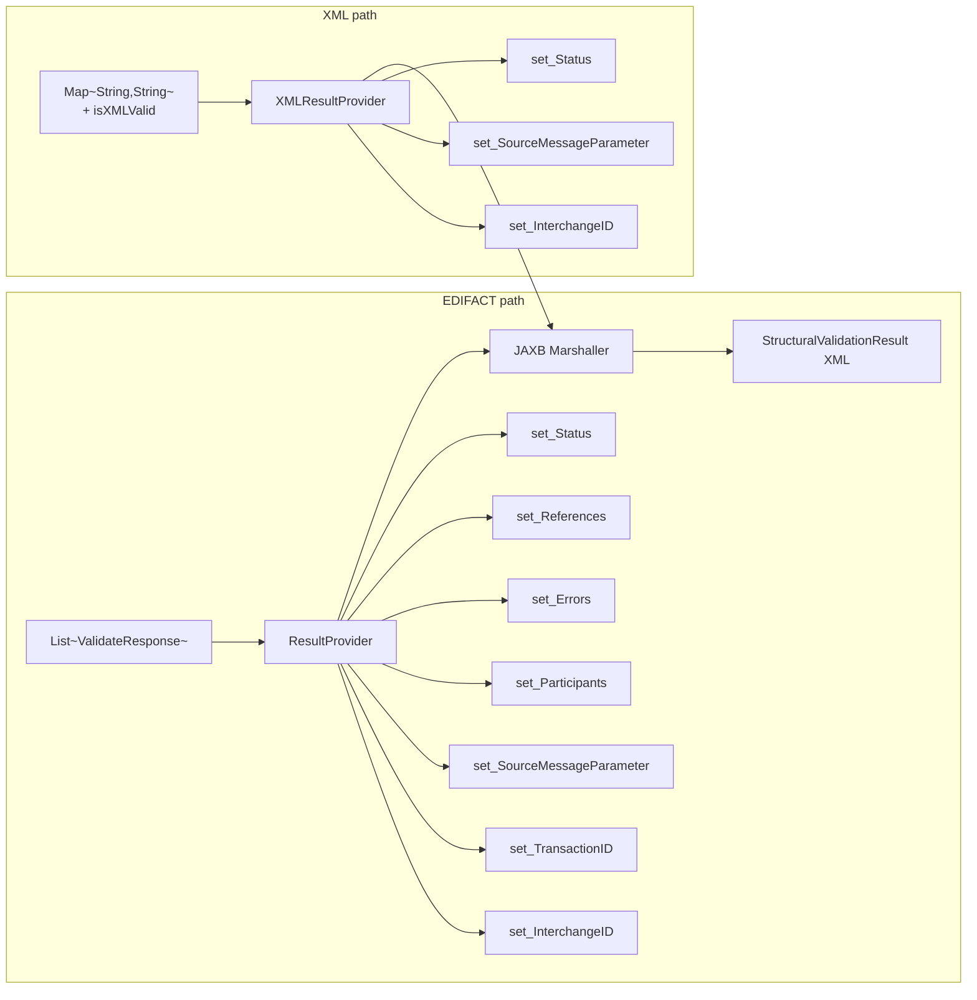

`ResultProvider` ([`ResultProvider.java:84-102`](../src/main/java/com/inttra/mercury/structuralvalidator/common/structuralvalidationresult/ResultProvider.java)) populates the result object in strict order:

1. `set_InterchangeID` — `UNB02`/`UNB03` IDs, applying `ZZZ → MUTUALLY_AGREED` mapping for the `TPIdType` enum.
2. `set_TransactionID` — currently duplicates the interchange IDs from `UNB`.
3. `set_SourceMessageParameter` — extracted from `UNH`: control number, format, version, release, agency. **Note**: `SourceMessageEnvelope` is hard-coded to `"IFTSTA"` ([`ResultProvider.java:167`](../src/main/java/com/inttra/mercury/structuralvalidator/common/structuralvalidationresult/ResultProvider.java)), which is incorrect when the message is actually IFTMBF/IFTMBC/IFTSAI. See [§13](#13-open-questions--risks).
4. `set_Participants` — `NAD` (Carrier, `CA`) and `RFF 4F` (4F-Nominee) extraction.
5. `set_Errors` — filter `validateResponseList` where `isError == true`, then add an `L1MsgSegmentType` per `SegmentError`. Within each segment error, segment-level `ErrorDetails` and per-`ElementError` details are added.
6. `set_References` — `RFF`-derived references: `BN` → BookingNumber, `BM` → BillOfLadingNumber, `SN` → SealNumber.
7. `set_Status` — `4` (fail) or `7` (pass), separately for the interchange (any `UNB`/`UNZ` error) and the transaction (any non-envelope error).

The whole thing is marshalled to XML via JAXB using types from `schema-beans` (the `mercury-schemas` artifact; see [`pom.xml:38-42`](../pom.xml)).

`XMLResultProvider` ([`XMLResultProvider.java:52-66`](../src/main/java/com/inttra/mercury/structuralvalidator/common/structuralvalidationresult/XMLResultProvider.java)) is a thinner, XML-specific variant: no `ValidateResponse` list — just an `isXMLValid` boolean and a `Map<String,String>` of attributes (`SHIPMENT_ID`, `DOCUMENT_IDENTIFIER`, `REQUEST_DATE_TIME`, `TRANSACTION_STATUS`). Interchange sender/receiver IDs default to placeholder strings `"SENDER ID"` and `"RECEIVER ID"` — clearly a placeholder per the inline `// Actual value will be set from JSON supplement` comment ([`XMLResultProvider.java:75-78`](../src/main/java/com/inttra/mercury/structuralvalidator/common/structuralvalidationresult/XMLResultProvider.java)). The source message envelope/format/version/release/agency are hard-coded to `IFTMBF` / `IFTMBF` / `D` / `99B` / `UN` for the XML path. See [§13](#13-open-questions--risks) for the issue.

---

## 5. Key Classes — Class Diagram

### Top-down view

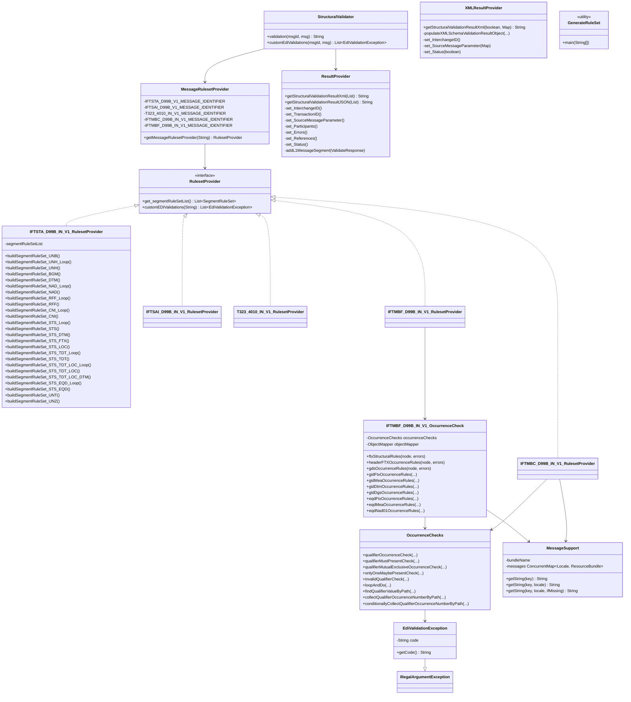

### Public surface vs. internal classes

| Class                                          | Visibility | Purpose                                       | File                                                                                                                                                       |
|------------------------------------------------|------------|-----------------------------------------------|------------------------------------------------------------------------------------------------------------------------------------------------------------|
| `StructuralValidator`                          | **public** | Library facade                                | [`structuralvalidation/StructuralValidator.java`](../src/main/java/com/inttra/mercury/structuralvalidator/common/structuralvalidation/StructuralValidator.java) |
| `XMLResultProvider`                            | **public** | XML-path result envelope builder              | [`structuralvalidationresult/XMLResultProvider.java`](../src/main/java/com/inttra/mercury/structuralvalidator/common/structuralvalidationresult/XMLResultProvider.java) |
| `EdiValidationException`                       | **public** | Cross-segment validation failure type         | [`common/exceptions/EdiValidationException.java`](../src/main/java/com/inttra/mercury/structuralvalidator/common/exceptions/EdiValidationException.java) |
| `MessageRulesetProvider`                       | public     | Strategy factory                              | [`ruleset/MessageRulesetProvider.java`](../src/main/java/com/inttra/mercury/structuralvalidator/common/ruleset/MessageRulesetProvider.java) |
| `RulesetProvider`                              | public     | Strategy interface                            | [`ruleset/RulesetProvider.java`](../src/main/java/com/inttra/mercury/structuralvalidator/common/ruleset/RulesetProvider.java) |
| `ResultProvider`                               | public     | EDIFACT-path result envelope builder          | [`structuralvalidationresult/ResultProvider.java`](../src/main/java/com/inttra/mercury/structuralvalidator/common/structuralvalidationresult/ResultProvider.java) |
| `OccurrenceChecks`                             | public     | Generic JSON-tree occurrence helpers          | [`common/util/OccurrenceChecks.java`](../src/main/java/com/inttra/mercury/structuralvalidator/common/util/OccurrenceChecks.java) |
| `MessageSupport`                               | public     | Localised error-message bundle accessor       | [`common/util/MessageSupport.java`](../src/main/java/com/inttra/mercury/structuralvalidator/common/util/MessageSupport.java) |
| `IFTSTA_D99B_IN_V1_RulesetProvider`            | public     | Per-format strategy                           | [`ifsta/IFTSTA_D99B_IN_V1_RulesetProvider.java`](../src/main/java/com/inttra/mercury/structuralvalidator/ifsta/IFTSTA_D99B_IN_V1_RulesetProvider.java) |
| `IFTSAI_D99B_IN_V1_RulesetProvider`            | public     | Per-format strategy                           | [`iftsai/IFTSAI_D99B_IN_V1_RulesetProvider.java`](../src/main/java/com/inttra/mercury/structuralvalidator/iftsai/IFTSAI_D99B_IN_V1_RulesetProvider.java) |
| `T323_4010_IN_V1_RulesetProvider`              | public     | Per-format strategy (X12)                     | [`t323/T323_4010_IN_V1_RulesetProvider.java`](../src/main/java/com/inttra/mercury/structuralvalidator/t323/T323_4010_IN_V1_RulesetProvider.java) |
| `IFTMBC_D99B_IN_V1_RulesetProvider`            | public     | Per-format strategy + custom rules            | [`iftmbc/IFTMBC_D99B_IN_V1_RulesetProvider.java`](../src/main/java/com/inttra/mercury/structuralvalidator/iftmbc/IFTMBC_D99B_IN_V1_RulesetProvider.java) |
| `IFTMBF_D99B_IN_V1_RulesetProvider`            | public     | Per-format strategy + custom rules            | [`iftmbf/IFTMBF_D99B_IN_V1_RulesetProvider.java`](../src/main/java/com/inttra/mercury/structuralvalidator/iftmbf/IFTMBF_D99B_IN_V1_RulesetProvider.java) |
| `IFTMBF_D99B_IN_V1_OccurrenceCheck`            | package    | IFTMBF custom-validation orchestrator         | [`iftmbf/IFTMBF_D99B_IN_V1_OccurrenceCheck.java`](../src/main/java/com/inttra/mercury/structuralvalidator/iftmbf/IFTMBF_D99B_IN_V1_OccurrenceCheck.java) |
| `GenerateRuleSet`                              | public     | Offline `.sef` → Java code generator          | [`ruleset/GenerateRuleSet.java`](../src/main/java/com/inttra/mercury/structuralvalidator/common/ruleset/GenerateRuleSet.java) |

There is no Guice module in this artifact. The library is consumed directly. The transformer’s Guice module is responsible for binding `StructuralValidator` as a singleton in the consumer JVM.

---

## 6. Data Flow Diagram

### End-to-end sequence (EDIFACT inbound — IFTMBF example)

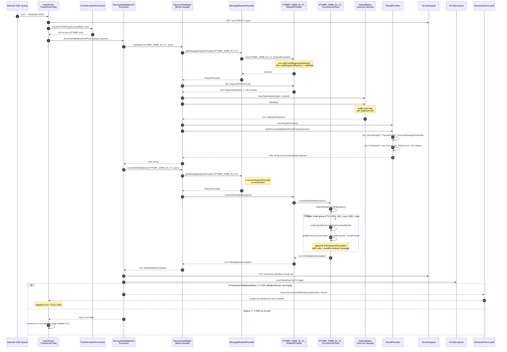

### Inbound XML path

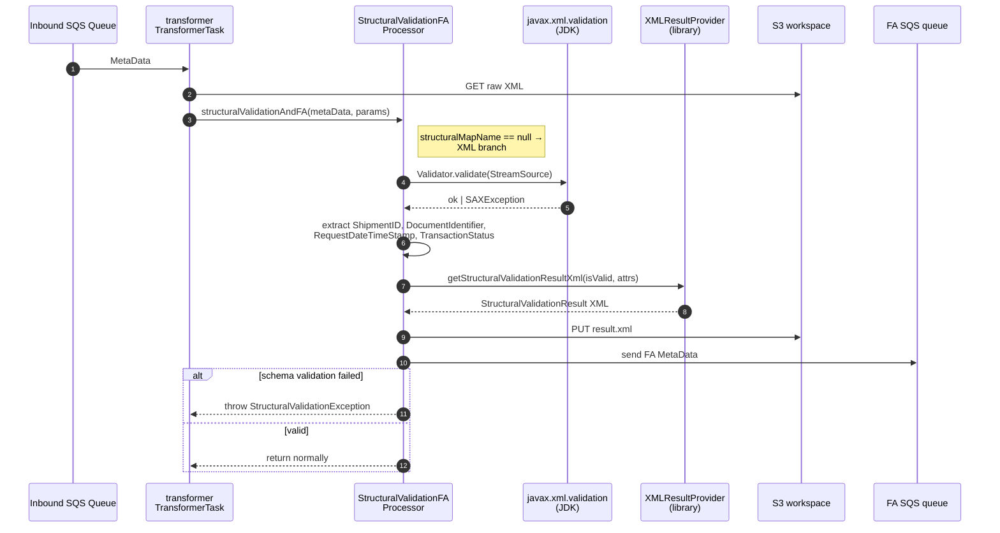

### Validation engine internal flow (`DataValidator.validate()`)

The engine itself is not in this module — but the contract observed in tests and consumers implies the following behaviour:

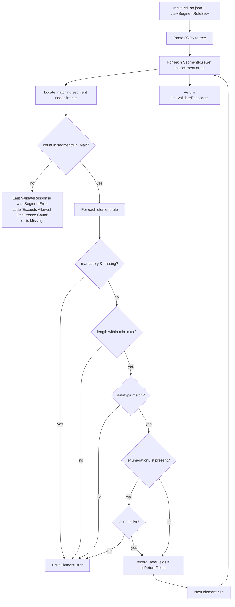

### Result envelope construction sequence

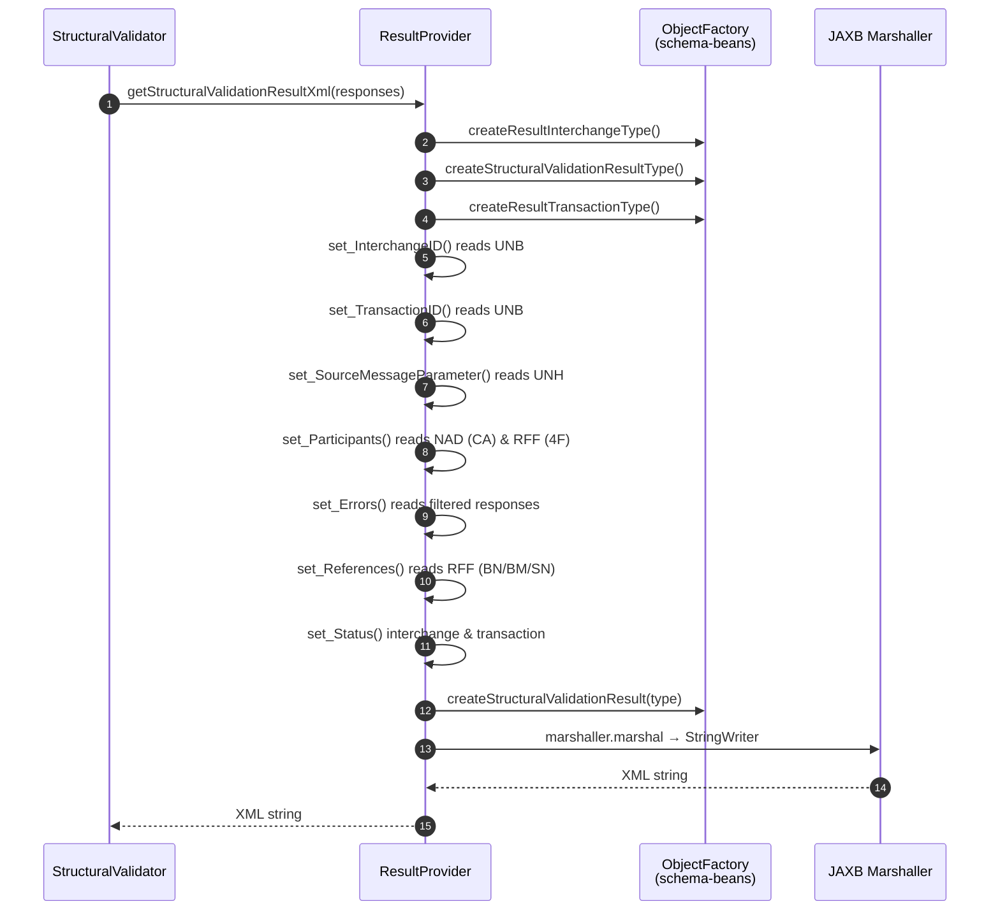

---

## 7. Component Dependencies

### Compile-time dependencies on other Mercury modules

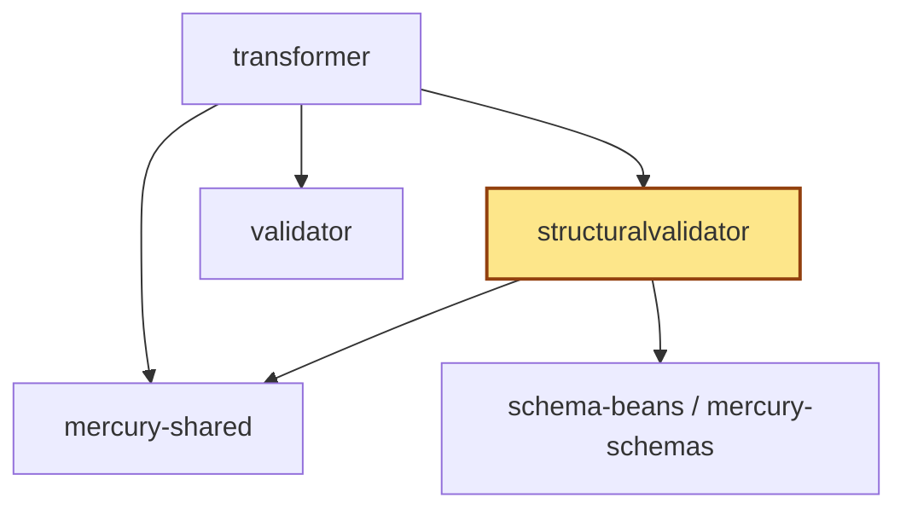

| Producer            | Consumer                | What is consumed                                                                                                       |
|---------------------|-------------------------|------------------------------------------------------------------------------------------------------------------------|
| `mercury-shared`    | `structuralvalidator`   | `DataValidator`, `SegmentRuleSet`, `ElementRuleSet`, `ValidateResponse`, `SegmentError`, `ElementError`, `ErrorDetails` |
| `schema-beans`      | `structuralvalidator`   | JAXB types for `StructuralValidationResult` XML envelope                                                              |
| `structuralvalidator` | `transformer`         | `StructuralValidator` facade, `XMLResultProvider`, `EdiValidationException`                                            |

### Third-party runtime dependencies

| Library             | Used for                                                            | Where                                                                |
|---------------------|---------------------------------------------------------------------|----------------------------------------------------------------------|
| Lombok              | `@NoArgsConstructor`, `@Slf4j`, `@Getter`                            | Annotation-only, compile-time provided                               |
| Jackson Databind    | `ObjectMapper` for JSON-tree walking in custom validations           | `IFTMBF_OccurrenceCheck`, `IFTMBC_RulesetProvider`, `ResultProvider` |
| Jackson JsonNode    | DOM-style JSON traversal                                             | Custom validations across IFTMBC / IFTMBF                            |
| Guava               | `Strings.isNullOrEmpty`                                              | `OccurrenceChecks`                                                    |
| Apache Commons Lang | `StringUtils.isBlank/isNotBlank`                                     | Tests and a few providers                                            |
| Jakarta XML Bind    | JAXB marshalling                                                     | `ResultProvider`, `XMLResultProvider`                                |
| SLF4J               | Logging                                                              | Throughout                                                            |
| Dropwizard core     | Brought in transitively (not used in module code)                    | `pom.xml:50-52`                                                       |
| AWS SDK SQS         | Brought in transitively (not used in module code)                    | `pom.xml:55-58`                                                       |
| Guice               | Brought in transitively (no Guice modules in this artifact)          | `pom.xml:60-63`                                                       |
| metrics-guice       | Brought in transitively                                              | `pom.xml:100-104`                                                     |
| Gson                | Declared, not directly referenced in module sources                  | `pom.xml:105-109`                                                     |

The Dropwizard / Guice / AWS SQS dependencies are **inherited from `mercury-shared`** transitively. They are not used in the library itself but the consumer (transformer) needs them, so the library declares them to make integration easier. Treat them as a **smell**: if the library were ever to be reused outside the transformer (e.g. by a new microservice), it would force unnecessary baggage. See [§13](#13-open-questions--risks).

### Runtime call graph

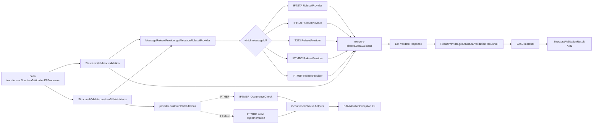

---

## 8. Configuration & Validation

The library has **no externalised configuration** of its own — no YAML, no environment variables, no system properties. The grammar is hard-coded in Java; the message bundles are JAR resources. The only “knob” a deployer can turn is which version of the JAR is loaded.

This is deliberate but constraining. The rules are versioned with code: a change to a qualifier value or a length requires a Java edit, a code review, a build, and a redeploy. There is no hot-reload, no dynamic rules engine.

### What looks like configuration but isn’t

| Apparent setting                                | Reality                                                                                                                                                            |
|-------------------------------------------------|---------------------------------------------------------------------------------------------------------------------------------------------------------------------|
| `messageIdentifier` (e.g. `IFTMBF_D99B_IN_V1`)  | A **runtime selector**, not configuration. Passed in per-call by the transformer based on the integration profile / `MetaData`.                                     |
| `booking/iftmbc.properties`, `booking/iftmbf.properties` | **i18n message catalog** (resource bundle). Defines error text but not error logic.                                                                            |
| Hard-coded enumerations (`UNOC`, `D`, `99B`, `UN`, etc.) | Schema constants baked into ruleset builders.                                                                                                                  |
| Allowed qualifier sets (`ccnUcnQualifiers`, `amsNvoQualifiers`, …) | Java static `List<String>` / `Set<String>` constants in the per-format provider.                                                                       |
| Permitted segment counts (`segmentMinCount`, `segmentMaxCount`) | Java builder calls in the per-format provider.                                                                                                            |

### Per-message rule keys reference

Inside the IFTMBC / IFTMBF ruleset providers there are dozens of `CODE_2150XX` / `CODE_2240XX` / `CODE_2210XX` constants. They map 1-to-1 to message-bundle keys in the properties files. Below is a synthetic table of the “key types” — the **shape** of the configuration surface — based on the actual ruleset / properties content.

| Key                          | Type   | Default                                                | Required | Description                                                                              | Validation                                                                                       |
|------------------------------|--------|--------------------------------------------------------|----------|------------------------------------------------------------------------------------------|--------------------------------------------------------------------------------------------------|
| `messageIdentifier` (arg)    | String | — (caller-supplied)                                    | Yes      | Selects ruleset strategy                                                                  | Must be one of the five recognised IDs; otherwise falls through to IFTSTA (problematic)         |
| `messageString` (arg)        | String | —                                                      | Yes      | EDI-as-JSON payload                                                                       | Must be parseable JSON for custom validations; engine tolerates structural failures gracefully  |
| `segmentMinCount`            | int    | varies                                                 | Yes      | Per-segment minimum occurrence                                                            | 0 ≤ min ≤ max                                                                                    |
| `segmentMaxCount`            | int    | varies                                                 | Yes      | Per-segment maximum occurrence                                                            | min ≤ max                                                                                        |
| `maxSegmentElementCount`     | int    | varies                                                 | Yes      | Upper bound on element positions for the segment                                          | Used by engine for layout assertions                                                             |
| `isReturnFields`             | bool   | per-segment, default `false`                           | Yes      | When `true`, engine populates `dataFields` map for later use in `ResultProvider`          | Required `true` for `UNB`, `UNH`, `NAD`, `RFF` so ResultProvider can extract IDs                  |
| `elementIsMandatory`         | bool   | per-element                                            | Yes      | Element must be present                                                                   | Engine emits ElementError if missing and mandatory                                               |
| `elementMinLength`           | int    | per-element                                            | No       | Minimum string length                                                                     | Engine checks `length >= min`                                                                    |
| `elementMaxLength`           | int    | per-element                                            | No       | Maximum string length                                                                     | Engine checks `length <= max`                                                                    |
| `elementDataType`            | enum   | `A` / `AN` / `N`                                       | Yes      | Alpha / alphanumeric / numeric                                                            | Engine pattern-matches                                                                            |
| `enumerationList`            | array  | per-element                                            | No       | Allow-list of valid values                                                                | Engine rejects values not in the list                                                            |
| Bundle key (`215007` etc.)   | String | per properties file                                    | Yes      | Human-readable error text                                                                 | Substitution variables `${value1}`–`${value3}` interpolated by helpers                          |

### Resource bundle catalog

[`src/main/resources/booking/iftmbf.properties`](../src/main/resources/booking/iftmbf.properties) and [`src/main/resources/booking/iftmbc.properties`](../src/main/resources/booking/iftmbc.properties) hold the message bundles. Sample keys:

| Key       | Meaning (IFTMBF)                                                                                |
|-----------|--------------------------------------------------------------------------------------------------|
| `221013`  | FTX: only three `AAI` (Customer Comment) per transaction                                         |
| `221014`  | FTX: only one `AES` (Customer Change Summary) per transaction                                    |
| `215007`  | FTX: only two `CCI` (Customs Clearance / AMS Filing Indicator) per transaction                   |
| `215008`  | FTX: only two `CUS` per transaction                                                              |
| `215010`  | FTX: only one `CCN` sub-qualifier per transaction at the header level                            |
| `215016`–`215021` | GDS: non-standard cargo indicator occurrence limits (Out of Gauge, Hazardous, RoRo, etc.) |
| `215054`–`215065` | NAD: one-per-party-type rules (Carrier, Consignee, Shipper, etc.)                         |
| `215245`  | FTX: only one of `SAD` / `SBD` per EQD Loop                                                      |
| `215277`  | Free text handling instructions for dangerous goods are not allowed                              |
| `333333`  | Invalid FTX qualifier provided                                                                   |

The `IFTMBC` bundle is structurally similar but contains carrier-confirmation-specific codes (`224045`, `224062`, `215348`, `215349`, etc.).

### Hard-coded constants worth surfacing

| Constant                                          | Defined in                                              | Notes                                                                                   |
|---------------------------------------------------|---------------------------------------------------------|------------------------------------------------------------------------------------------|
| `"UNOC"` (UNB charset)                             | All EDIFACT providers                                    | Only `UNOC` is accepted; not `UNOA` / `UNOB` / `UNOD`                                    |
| `"INTTRA"` (UNB recipient)                         | IFTSTA / IFTSAI                                          | Hard-coded as the only allowed recipient — limits multi-tenancy                          |
| `"IFTSTA"` (envelope name)                         | [`ResultProvider:167`](../src/main/java/com/inttra/mercury/structuralvalidator/common/structuralvalidationresult/ResultProvider.java) | Hard-coded for all EDIFACT outputs even when the message is IFTMBF — bug, see §13       |
| `"IFTMBF"` (envelope name)                         | [`XMLResultProvider:87`](../src/main/java/com/inttra/mercury/structuralvalidator/common/structuralvalidationresult/XMLResultProvider.java) | Hard-coded for XML path                                                                  |
| `dgsFtx03ValidQualifiers`                          | IFTMBC + IFTMBF providers                                | Slightly different across the two — duplicate-with-drift smell                          |
| `INTERCHANGE_SUCCESS_STATUS = "7"` / `..._FAILURE_STATUS = "4"` | [`XMLResultProvider:28-29`](../src/main/java/com/inttra/mercury/structuralvalidator/common/structuralvalidationresult/XMLResultProvider.java) | Canonical EDIFACT status codes                                              |

---

## 9. Maven Dependencies

Direct extract of the dependency block from [`pom.xml`](../pom.xml):

```xml
<dependencies>
    <dependency>
        <groupId>com.inttra.mercury.shared</groupId>
        <artifactId>mercury-shared</artifactId>
        <version>1.0</version>
    </dependency>
    <dependency>
        <groupId>com.inttra.mercury.schema-beans</groupId>
        <artifactId>schema-beans</artifactId>
        <version>1.0</version>
    </dependency>
    <dependency>
        <groupId>org.projectlombok</groupId>
        <artifactId>lombok</artifactId>
        <version>1.18.32</version>
        <scope>provided</scope>
    </dependency>
    <dependency>
        <groupId>io.dropwizard</groupId>
        <artifactId>dropwizard-core</artifactId>
        <version>4.0.16</version>
    </dependency>
    <dependency>
        <groupId>com.amazonaws</groupId>
        <artifactId>aws-java-sdk-sqs</artifactId>
        <version>1.12.720</version>
    </dependency>
    <dependency>
        <groupId>com.google.inject</groupId>
        <artifactId>guice</artifactId>
        <version>7.0.0</version>
    </dependency>
    <dependency>
        <groupId>com.google.guava</groupId>
        <artifactId>guava</artifactId>
        <version>33.1.0-jre</version>
    </dependency>
    <dependency>
        <groupId>com.palominolabs.metrics</groupId>
        <artifactId>metrics-guice</artifactId>
        <version>3.1.3</version>
    </dependency>
    <dependency>
        <groupId>com.google.code.gson</groupId>
        <artifactId>gson</artifactId>
        <version>2.10.1</version>
    </dependency>
    <!-- Test scope -->
    <dependency>
        <groupId>com.inttra.mercury.test</groupId>
        <artifactId>functional-testing</artifactId>
        <version>1.0</version>
        <scope>test</scope>
    </dependency>
    <dependency>
        <groupId>org.junit.jupiter</groupId>
        <artifactId>junit-jupiter-api</artifactId>
        <version>5.10.1</version>
        <scope>test</scope>
    </dependency>
    <dependency>
        <groupId>org.junit.jupiter</groupId>
        <artifactId>junit-jupiter-engine</artifactId>
        <version>5.10.1</version>
        <scope>test</scope>
    </dependency>
    <dependency>
        <groupId>org.assertj</groupId>
        <artifactId>assertj-core</artifactId>
        <version>3.24.2</version>
        <scope>test</scope>
    </dependency>
    <dependency>
        <groupId>org.mockito</groupId>
        <artifactId>mockito-junit-jupiter</artifactId>
        <version>5.11.0</version>
        <scope>test</scope>
    </dependency>
</dependencies>
```

### Dependency commentary

- **`mercury-shared`** — the *only* hard runtime dependency on a Mercury-platform artifact. Provides `DataValidator`, `SegmentRuleSet`, `ElementRuleSet`, `ValidateResponse`, `SegmentError`, `ElementError`, `ErrorDetails`. Tight coupling: a change to any of these types ripples through every provider.
- **`schema-beans` (mercury-schemas)** — provides the JAXB-generated types for `StructuralValidationResult`. Generated from XSDs that are versioned upstream. A `StructuralValidationResultType.xsd` change requires a `schema-beans` bump first.
- **Java 17** ([`pom.xml:14`](../pom.xml)) — modern toolchain. Notable because the sibling `validator` module is on Java 8 ([`validator/pom.xml:14`](../../validator/pom.xml)). When the transformer (Java 17) loads both, it must accept the lowest common denominator that the JVM tolerates.
- **Jackson 2.19** — but the module uses Jackson `JsonNode` and `ObjectMapper` *without* declaring it explicitly. The dependency arrives transitively through `mercury-shared`. The commented-out block at [`pom.xml:110-114`](../pom.xml) suggests the team considered making it explicit. Recommend re-enabling it (defensive: pinning prevents transitive drift).
- **Dropwizard core, AWS SQS, Guice** — declared but unused inside this artifact. Inherited from the transformer’s consumption pattern. See [§7](#7-component-dependencies) commentary.
- **Lombok** — `provided` scope, correctly. Used for `@NoArgsConstructor`, `@Getter`, `@Slf4j` only.
- **JUnit 5, Mockito, AssertJ, `functional-testing`** — standard test toolkit.

### Build configuration

- **Source / target**: Java 17 ([`pom.xml:129-130`](../pom.xml)).
- **Surefire 3.2.5** with `${surefireArgLine}` placeholder for JaCoCo agent injection ([`pom.xml:135-147`](../pom.xml)).
- **Sonar profile** with JaCoCo aggregation ([`pom.xml:150-223`](../pom.xml)). Includes commented-out OWASP dependency-check, suggesting it was disabled (perhaps for runtime performance during CI).

### Transitive risk surface

The biggest hidden-dependency risks are:
1. **Jackson version**: not pinned here. If `mercury-shared` upgrades Jackson incompatibly, all of `IFTMBC_RulesetProvider` and `IFTMBF_OccurrenceCheck` break silently or noisily.
2. **JAXB / Jakarta XML Bind**: the module imports `jakarta.xml.bind.*` (note the Jakarta namespace). If `schema-beans` is built against the older `javax.xml.bind`, the marshalling fails at runtime with a `NoClassDefFoundError`.
3. **`jakarta.ws.rs.core.MultivaluedHashMap`** in [`GenerateRuleSet.java:3`](../src/main/java/com/inttra/mercury/structuralvalidator/common/ruleset/GenerateRuleSet.java) — a JAX-RS type used in a developer utility. Inherited transitively through Dropwizard. If Dropwizard is removed from the dependency block, the dev utility fails to compile.

---

## 10. How the Module Works — Detailed Walkthrough

This section walks the code end-to-end for the EDIFACT path (the more common one), then the XML path.

### 10.1 The EDIFACT path (e.g. inbound IFTMBF)

#### Step 1 — Caller hands in the JSON
The transformer’s `StructuralValidationFAProcessor.edifactStructuralValidationAndFA(...)` produces an EDI-as-JSON tree from raw EDIFACT bytes via an XSLT transformation ([`StructuralValidationFAProcessor.java:157-158`](../../transformer/src/main/java/com/inttra/mercury/transformer/task/StructuralValidationFAProcessor.java)). The transform name (e.g. `IFTMBF_D99B_IN_V1`) is the message identifier the structural validator needs.

#### Step 2 — Facade call: `StructuralValidator.validation(messageIdentifier, messageString)`
This is the entry point ([`StructuralValidator.java:38-75`](../src/main/java/com/inttra/mercury/structuralvalidator/common/structuralvalidation/StructuralValidator.java)). The flow:

```java
RulesetProvider rulesetProvider =
    new MessageRulesetProvider().getMessageRulesetProvider(messageIdentifier);
log.debug("RuleSet provider received: " + rulesetProvider.getClass().getName());
segmentRuleSetList = rulesetProvider.get_segmentRuleSetList();
log.debug("Number of ruleSets received: " + segmentRuleSetList.size());
```

If construction throws (e.g. for an unknown identifier — though the default branch suppresses this) the exception is re-thrown after logging.

#### Step 3 — Strategy selection: `MessageRulesetProvider.getMessageRulesetProvider`
Plain `switch` on the message identifier ([`MessageRulesetProvider.java:32-45`](../src/main/java/com/inttra/mercury/structuralvalidator/common/ruleset/MessageRulesetProvider.java)). Constructs and returns a per-format `RulesetProvider`.

#### Step 4 — Ruleset construction (the costly bit)
Each provider’s constructor calls a private `buildSegmentRuleSet()` which calls a long list of `buildSegmentRuleSet_<segment>()` methods, each appending one or more `SegmentRuleSet` objects to `this.segmentRuleSetList`. For IFTMBF the list has 60+ entries reflecting 60+ nested segments / loops.

The construction is **purely allocation-bound** — no I/O, no parsing. A representative `buildSegmentRuleSet_X` looks like ([`IFTSTA_D99B_IN_V1_RulesetProvider.java:769-781`](../src/main/java/com/inttra/mercury/structuralvalidator/ifsta/IFTSTA_D99B_IN_V1_RulesetProvider.java)):

```java
public void buildSegmentRuleSet_CNI_Loop() {
    SegmentRuleSet segmentRuleSet =
        SegmentRuleSet.builder()
            .segmentName("CNI_Loop")
            .segmentMinCount(1)
            .segmentMaxCount(1)
            .parentSegment("UNH_Loop")
            .previousSegment("RFF_Loop")
            .maxSegmentElementCount(1)
            .isReturnFields(false)
            .build();
    this.segmentRuleSetList.add(segmentRuleSet);
}
```

#### Step 5 — Engine invocation
With the ruleset list in hand, the facade instantiates and invokes the shared `DataValidator` ([`StructuralValidator.java:56-58`](../src/main/java/com/inttra/mercury/structuralvalidator/common/structuralvalidation/StructuralValidator.java)):

```java
DataValidator dataValidator = new DataValidator(messageString, segmentRuleSetList);
validateResponseList = dataValidator.validate();
```

The engine emits one `ValidateResponse` per discovered segment. Errors (cardinality, length, datatype, enumeration) are attached as `SegmentError` / `ElementError` on the response object.

#### Step 6 — Result envelope
The `ResultProvider` is constructed and asked to serialize the responses to XML ([`StructuralValidator.java:66-67`](../src/main/java/com/inttra/mercury/structuralvalidator/common/structuralvalidation/StructuralValidator.java)):

```java
ResultProvider structuralValidationResultProvider = new ResultProvider();
return structuralValidationResultProvider.getStructuralValidationResultXml(validateResponseList);
```

`ResultProvider.populateStructuralValidationObject()` ([`ResultProvider.java:84-102`](../src/main/java/com/inttra/mercury/structuralvalidator/common/structuralvalidationresult/ResultProvider.java)) performs the seven `set_*` steps in order. The order matters because some setters depend on the parent object (`resultTransaction`) being already attached.

#### Step 7 — Custom EDI validations (second call)
The facade exposes a separate method `customEdiValidations(messageIdentifier, messageString)` ([`StructuralValidator.java:77-86`](../src/main/java/com/inttra/mercury/structuralvalidator/common/structuralvalidation/StructuralValidator.java)). The transformer calls it after `validation(...)` ([`StructuralValidationFAProcessor.java:165-166`](../../transformer/src/main/java/com/inttra/mercury/transformer/task/StructuralValidationFAProcessor.java)). It constructs a **second** `RulesetProvider` (wasteful — see [§13](#13-open-questions--risks)) and delegates to `provider.customEDIValidations(messageString)`.

For IFTSTA / IFTSAI / T323 this is a no-op (returns `Collections.emptyList()`).
For IFTMBF, the provider delegates to `IFTMBF_D99B_IN_V1_OccurrenceCheck.customEDIValidations(...)`.
For IFTMBC, the provider implements the logic inline.

#### Step 8 — Inside the IFTMBF custom validations
[`IFTMBF_D99B_IN_V1_OccurrenceCheck`](../src/main/java/com/inttra/mercury/structuralvalidator/iftmbf/IFTMBF_D99B_IN_V1_OccurrenceCheck.java) reads the JSON tree once via Jackson, then runs a sequence of rule groups:

1. `ftxStructuralRules(headerFtx, errors)` — for each FTX with qualifier `CUS`/`CCI`/`ACD`/`CHG`/`AAA`/`AAC`/`AAF`/`AAI`/`ABD`/`ABV`/`AES`, apply the qualifier-specific rules.
2. `headerFTXOccurrenceRules(headerFtx, errors)` — count `AAI` / `AES` / `ACA` occurrences and enforce caps.
3. `gdsOccurrenceRules(gdsSegment, errors)` — count Non-standard Cargo Indicator codes and enforce one-per-transaction.
4. Per-GID-loop: FTX, MEA, DTM, DGS occurrence rules.
5. Per-EQD-loop: FTX, MEA, NAD01 occurrence rules.
6. A late filter: if `BGM03 ∈ {1, 17}` (status types where only certain errors apply), keep only codes `224058` and `224023`.

Each `EdiValidationException` carries `(errorCode, interpolatedMessage)` where the message comes from `iftmbf.properties` with `${value1..3}` placeholders replaced by the offending qualifier / cargo item / container number.

#### Step 9 — Caller handles the result
Back in the transformer, the result XML is parsed (via XPath: `//TransactionValidationStatus/text()`). If the status is `"4"` (failure) or the `validationErrors` list is non-empty, a `StructuralValidationException` is thrown ([`StructuralValidationFAProcessor.java:248-266`](../../transformer/src/main/java/com/inttra/mercury/transformer/task/StructuralValidationFAProcessor.java)). The XML result is uploaded to S3 regardless of pass/fail; the FA pickup queue is notified.

### 10.2 The XML path (e.g. inbound XML booking request)

The XML path is much thinner — most of the work happens in the consuming transformer. The library’s contribution is the result envelope only.

#### Step 1 — Transformer determines branch
If `params.getStructuralMapName() == null` (no EDIFACT transform map) **and** `params.isFaRequested()`, the XML branch is taken ([`StructuralValidationFAProcessor.java:130-149`](../../transformer/src/main/java/com/inttra/mercury/transformer/task/StructuralValidationFAProcessor.java)).

#### Step 2 — XSD load (static initialiser)
The XSD `INTTRABooking2Request_V1.8.xsd` is loaded once, statically, from the classpath ([`StructuralValidationFAProcessor.java:73-93`](../../transformer/src/main/java/com/inttra/mercury/transformer/task/StructuralValidationFAProcessor.java)). The resulting `javax.xml.validation.Schema` is cached. If load fails the schema is `null` and the XML branch is silently skipped.

#### Step 3 — Schema validation
A new `Validator` is created per call (validators are not thread-safe, but `Schema` is). `validator.validate(StreamSource)` either returns silently (success) or throws `SAXException` (failure) ([`StructuralValidationFAProcessor.java:216-217`](../../transformer/src/main/java/com/inttra/mercury/transformer/task/StructuralValidationFAProcessor.java)).

#### Step 4 — Attribute extraction
The transformer extracts `ShipmentID`, `DocumentIdentifier`, `RequestDateTimeStamp`, `TransactionStatus` from the XML via a StAX scanner ([`StructuralValidationFAProcessor.java:298-317`](../../transformer/src/main/java/com/inttra/mercury/transformer/task/StructuralValidationFAProcessor.java)).

#### Step 5 — Envelope construction
`XMLResultProvider.getStructuralValidationResultXml(isValid, attrs)` ([`XMLResultProvider.java:31-35`](../src/main/java/com/inttra/mercury/structuralvalidator/common/structuralvalidationresult/XMLResultProvider.java)) builds the `StructuralValidationResult` XML envelope. It is much simpler than the EDIFACT path: just sender/receiver placeholders, the four attributes, hard-coded `IFTMBF` / `D` / `99B` / `UN` envelope metadata, and `7` or `4` for the status.

#### Step 6 — Post-processing
The result XML is uploaded to S3 and an FA message is dispatched. If the schema validation failed, a `StructuralValidationException` is thrown.

### 10.3 Per-format walkthroughs

#### IFTSTA D99B Inbound
- 25+ `buildSegmentRuleSet_*` methods covering `UNB`, `UNH_Loop/UNH/BGM/DTM`, `NAD_Loop/NAD`, `RFF_Loop/RFF`, `CNI_Loop/CNI`, `STS_Loop/STS/DTM/FTX/LOC/TDT_Loop/TDT/LOC_Loop/LOC/DTM/EQD_Loop/EQD`, `UNT`, `UNZ`.
- No custom EDI validations (`customEDIValidations` returns empty list).
- Notable: `UNB03.1` is hard-coded to `INTTRA` ([`IFTSTA_D99B_IN_V1_RulesetProvider.java:163-176`](../src/main/java/com/inttra/mercury/structuralvalidator/ifsta/IFTSTA_D99B_IN_V1_RulesetProvider.java)) — the only allowed recipient.
- 1777 lines total (the smallest of the heavy providers).

#### IFTSAI D99B Inbound
- 16 `buildSegmentRuleSet_*` methods: `UNB`, `UNH_Loop/UNH/BGM/DTM`, `TDT_Loop/TDT/RFF/FTX`, `TDT_LOC_Loop/LOC/DTM`, `NAD_Loop/NAD`, `UNT`, `UNZ`.
- No custom EDI validations.
- 1199 lines.

#### T323 4010 Inbound (ANSI X12)
- 12 `buildSegmentRuleSet_*` methods: `ISA`, `GS`, `ST_Loop/ST/V1/K1`, `ST_R4_Loop/R4/DTM`, `SE`, `GE`, `IEA`.
- No custom EDI validations.
- 885 lines.

#### IFTMBC D99B Inbound (Booking Confirmation)
- The ruleset builder is essentially empty (`buildSegmentRuleSet()` is a no-op — [`IFTMBC_D99B_IN_V1_RulesetProvider.java:313-314`](../src/main/java/com/inttra/mercury/structuralvalidator/iftmbc/IFTMBC_D99B_IN_V1_RulesetProvider.java)). Schema-level validation does **not** apply via the shared engine: `get_segmentRuleSetList()` returns `Collections.emptyList()` ([`IFTMBC_D99B_IN_V1_RulesetProvider.java:309-311`](../src/main/java/com/inttra/mercury/structuralvalidator/iftmbc/IFTMBC_D99B_IN_V1_RulesetProvider.java)).
- All structural-ish checks are done in `customEDIValidations` — qualifier validity, sub-qualifier validity, FTX/GDS/GID/EQD occurrence checks, etc.
- 945 lines.

This is an architecturally significant divergence: IFTMBC opts out of the shared engine entirely and does all its validation inline. The reason — based on code-archaeology — appears to be that the IFTMBC structural rules are heavily conditional on qualifier values, and the shared engine cannot express conditional rules well.

#### IFTMBF D99B Inbound (Firm Booking)
- ~110 `buildSegmentRuleSet_*` methods — the largest grammar in the library.
- Uses both: a full segment ruleset list (engine-based) **and** a heavy `IFTMBF_D99B_IN_V1_OccurrenceCheck` companion class for cross-segment rules.
- 1148 lines for the ruleset builder; 625 lines for the occurrence check.

### 10.4 Worked example — “extra RFF segments cause a structural error”

Looking at the test fixture [`errorRffCountIFSTA.json`](../src/test/resources/errorRffCountIFSTA.json) and the assertion in [`IFSTAStructuralValidatorTest.extraRFF`](../src/test/java/com/inttra/mercury/structuralvalidator/common/structuralvalidation/IFSTAStructuralValidatorTest.java):

```java
resultString = structuralValidator.validation(messageIdentifier, TestSupport.getMessage("errorRffCountIFSTA.json"));
assertTrue(
    StringUtils.countMatches(resultString, "<ErrorDescription>") > 0
    && resultString.contains("RFF Exceeds Allowed Occurrence Count"));
```

The IFTSTA RFF rule ([`IFTSTA_D99B_IN_V1_RulesetProvider.java:754-763`](../src/main/java/com/inttra/mercury/structuralvalidator/ifsta/IFTSTA_D99B_IN_V1_RulesetProvider.java)):

```java
SegmentRuleSet segmentRuleSet =
    SegmentRuleSet.builder()
        .segmentName("RFF")
        .segmentMinCount(1)
        .segmentMaxCount(9)        // <— upper bound
        .parentSegment("RFF_Loop")
        .maxSegmentElementCount(1)
        .isReturnFields(true)
        .elementRuleSets(elementRuleSets)
        .build();
```

If the input has more than 9 RFF segments inside the RFF_Loop, the engine emits a `SegmentError` with an error description containing "RFF Exceeds Allowed Occurrence Count", which `ResultProvider.addL1MessageSegment(...)` translates into an `<L1MsgSegment>` child carrying `<ErrorDescription>`. The test asserts on the final XML string.

### 10.5 Worked example — IFTMBF FTX `AAI` qualifier occurrence

Looking at [`iftmbf.properties:1`](../src/main/resources/booking/iftmbf.properties):

```
221013=FTX: Only three occurrences of Qualifier 'AAI', Customer Comment, is allowed per transaction.
```

The check is implemented in `IFTMBF_D99B_IN_V1_OccurrenceCheck.headerFTXOccurrenceRules(...)` via:

```java
Map<String, Integer> countMap = new HashMap<>();
occurrenceChecks.collectQualifierOccurrenceNumberByPath(countMap, headerFtx, 0, "FTX01");
occurrenceChecks.qualifierOccurrenceCheck(countMap, "AAI", 3, errors, "221013", "", "", messages);
```

If `AAI` appears more than three times, the helper appends:

```java
new EdiValidationException("221013", "FTX: Only three occurrences of Qualifier 'AAI', Customer Comment, is allowed per transaction.")
```

to the `errors` list. The caller (the transformer’s `validateResult`) sees the non-empty list and throws.

---

## 11. Error Handling & Edge Cases

### 11.1 Error categories

| Category                      | Signal                                                                                              | Owner                              |
|-------------------------------|-----------------------------------------------------------------------------------------------------|------------------------------------|
| Schema cardinality violation  | `SegmentError` on a `ValidateResponse` → `<ErrorDescription>` in result XML                          | shared engine (`DataValidator`)    |
| Element length / datatype     | `ElementError` → `<MsgElement>` in result XML                                                        | shared engine                      |
| Element not in enumeration    | `ElementError` (treated identically to length / datatype)                                            | shared engine                      |
| Cross-segment occurrence      | `EdiValidationException` in the list returned by `customEdiValidations`                              | per-format provider (IFTMBC/IFTMBF)|
| Unknown messageIdentifier     | Silently falls through to `IFTSTA` default                                                          | `MessageRulesetProvider` (bug)     |
| Malformed JSON / unparseable  | Jackson throws — propagated as `Exception` up to caller                                              | per-format provider / facade       |
| JAXB marshalling failure      | `JAXBException` → propagated as `Exception`                                                          | `ResultProvider` / `XMLResultProvider` |
| XSD schema load failure       | static initialiser caches `null`, XML branch silently skips                                          | transformer (`StructuralValidationFAProcessor`) |
| XSD schema validation failure | `SAXException` → caught, recorded into result XML with status `4`                                    | transformer                        |
| Encoding mismatch             | The transformer reads bytes as `ISO_8859_1` for EDIFACT; the library receives a `String`             | transformer / OS                    |

### 11.2 The default-case bug

`MessageRulesetProvider.getMessageRulesetProvider`’s `default:` branch returns `new IFTSTA_D99B_IN_V1_RulesetProvider()` ([`MessageRulesetProvider.java:44`](../src/main/java/com/inttra/mercury/structuralvalidator/common/ruleset/MessageRulesetProvider.java)). If a caller passes an unknown identifier, the library silently validates the payload against the IFTSTA grammar — almost certainly producing a flood of false-positive errors that obscure the real problem (the caller misconfigured the integration profile). A defensive `throw new IllegalArgumentException(...)` would surface the bug at the source.

### 11.3 Malformed JSON

The shared `DataValidator` is the first to touch the JSON. Its behaviour on bad JSON is not fully visible here, but the facade does not catch parse exceptions specially — they propagate as `Exception` up to the transformer, which wraps them as `StructuralValidationException` ([`StructuralValidationFAProcessor.java:145-148`](../../transformer/src/main/java/com/inttra/mercury/transformer/task/StructuralValidationFAProcessor.java)).

Inside `customEDIValidations`, IFTMBC / IFTMBF use `objectMapper.readValue(messageString, new TypeReference<Map<String,JsonNode>>(){})` ([`IFTMBC_D99B_IN_V1_RulesetProvider.java:322-323`](../src/main/java/com/inttra/mercury/structuralvalidator/iftmbc/IFTMBC_D99B_IN_V1_RulesetProvider.java)). If the JSON is malformed, this throws `IOException` which propagates up.

### 11.4 Missing nodes

The custom validators assume a certain shape (`Envelope.UNB[0].UNH_Loop[0]…`). For example ([`IFTMBC_D99B_IN_V1_RulesetProvider.java:326`](../src/main/java/com/inttra/mercury/structuralvalidator/iftmbc/IFTMBC_D99B_IN_V1_RulesetProvider.java)):

```java
JsonNode unhLoop = jsonTreeMap.get(NODE_Envelope).get(NODE_UNB).get(0).get(NODE_UNHLoop).get(0);
```

If `Envelope` or `UNB` is missing, the chained `.get(...)` returns `null` and the next call throws `NullPointerException`. There is no defensive null-check. This is acceptable in the current architecture because:

1. The transformer’s structural-map XSLT is responsible for producing the canonical shape; if it fails, the JSON would not reach this stage.
2. The engine’s structural pass runs first (for IFTMBF) and surfaces any missing envelope segments before custom rules execute.

But for IFTMBC, which skips the engine entirely (`get_segmentRuleSetList()` returns empty), the missing-envelope NPE is the *first signal* of a malformed input. This is fragile — see [§13](#13-open-questions--risks).

### 11.5 Very large payloads

The library is fully in-memory. Strategies for handling large payloads:

- **Buffering**: the entire `messageString` is held in memory plus a Jackson `JsonNode` tree (typically ~3× the JSON size in RAM).
- **No streaming**: `DataValidator` consumes a `String`; `customEDIValidations` parses to a `Map<String, JsonNode>`. There is no streaming API.
- **Practical cap**: empirically (no documented limit), payloads up to a few MB are safe. A 100 MB EDIFACT payload would OOM the transformer JVM.

Mitigation: the transformer’s SQS messages typically point to S3 objects bounded by the integration profile’s `maxPayloadSize` setting. The library trusts that bound implicitly.

### 11.6 Encoding

EDIFACT is read as `ISO_8859_1` by the transformer ([`StructuralValidationFAProcessor.java:158`](../../transformer/src/main/java/com/inttra/mercury/transformer/task/StructuralValidationFAProcessor.java)). XML is read as `UTF-8` ([`StructuralValidationFAProcessor.java:217`](../../transformer/src/main/java/com/inttra/mercury/transformer/task/StructuralValidationFAProcessor.java)). The library is encoding-agnostic — it operates on `String` only — but if the transformer ever decodes EDIFACT with the wrong charset, the library will see corrupted text and emit element-length / value-enumeration errors that look like sender mistakes.

### 11.7 Concurrency

- The facade `StructuralValidator` is `@NoArgsConstructor` and stateless — safe to share or pool.
- `MessageRulesetProvider` is stateless — safe to share.
- Each `RulesetProvider` is constructed per call (not cached). Each one is fresh, mutable until the constructor completes, then read-only by convention.
- `IFTMBF_D99B_IN_V1_OccurrenceCheck` is constructed per call (via IFTMBF provider). Stateless under the hood.
- `OccurrenceChecks` instance methods are all stateless (no instance fields used).
- `MessageSupport` uses `ConcurrentHashMap` to cache `ResourceBundle` per locale ([`MessageSupport.java:12-13`](../src/main/java/com/inttra/mercury/structuralvalidator/common/util/MessageSupport.java)). Thread-safe.
- `ResultProvider` is *not* designed for concurrent use of a single instance — it carries `resultInterchangeType`, `validateResponseList`, `objectFactory`, `structuralValidationResultType` as mutable instance fields ([`ResultProvider.java:47-50`](../src/main/java/com/inttra/mercury/structuralvalidator/common/structuralvalidationresult/ResultProvider.java)). The facade constructs a fresh `ResultProvider` per call ([`StructuralValidator.java:66`](../src/main/java/com/inttra/mercury/structuralvalidator/common/structuralvalidation/StructuralValidator.java)), so this is safe in practice.

A single `StructuralValidator` instance is therefore reusable across threads — see the test setup ([`IFSTAStructuralValidatorTest.java:22`](../src/test/java/com/inttra/mercury/structuralvalidator/common/structuralvalidation/IFSTAStructuralValidatorTest.java)) where `structuralValidator = new StructuralValidator()` per test.

### 11.8 The `==` vs `equals` bug in `set_Status`

[`ResultProvider.set_Status`](../src/main/java/com/inttra/mercury/structuralvalidator/common/structuralvalidationresult/ResultProvider.java) uses `==` to compare segment names ([line 306-307](../src/main/java/com/inttra/mercury/structuralvalidator/common/structuralvalidationresult/ResultProvider.java)):

```java
((entry.getSegmentName() == "UNB" || entry.getSegmentName() == "UNZ") && entry.isError())
```

String reference equality in Java is undefined for strings constructed at runtime. If `getSegmentName()` returns a constant from a constant-pooled source the comparison succeeds; otherwise it silently fails. Should be `.equals(...)`. See [§13](#13-open-questions--risks).

### 11.9 Error de-duplication and ordering

There is no de-duplication step. If the engine emits the same error twice (e.g. once at the loop level and once at the segment level), the result XML will contain both. The order of errors is the order they appear in `validateResponseList` — engine-determined, not stable across versions.

### 11.10 Edge case: empty rulesets

`StructuralValidator.validation` checks `segmentRuleSetList.size() > 0` ([`StructuralValidator.java:53`](../src/main/java/com/inttra/mercury/structuralvalidator/common/structuralvalidation/StructuralValidator.java)). If the list is empty (e.g. IFTMBC), the method returns an empty string `""` without invoking the engine or `ResultProvider`. The caller (transformer) treats an empty validation result as a no-op:

```java
if (StringUtils.isNotBlank(validationResult)) {
    workspaceService.putObject(bucket, ..., validationResult);
    ...
}
```

— see [`StructuralValidationFAProcessor.java:205-209`](../../transformer/src/main/java/com/inttra/mercury/transformer/task/StructuralValidationFAProcessor.java). This means for IFTMBC, only the `customEdiValidations` list determines pass/fail. The transformer correctly handles this:

```java
if (StringUtils.isNotBlank(transformed)) {
    // parse XML, check transaction status
    ...
} else {
    if (validationErrors != null && validationErrors.size() > 0)
        throw new StructuralValidationException(null, validationErrors);
}
```

— [`StructuralValidationFAProcessor.java:248-265`](../../transformer/src/main/java/com/inttra/mercury/transformer/task/StructuralValidationFAProcessor.java).

---

## 12. Operational Notes

### 12.1 Deployment

- **Artifact**: `com.inttra.mercury.structuralvalidator:structuralvalidator:1.0` ([`pom.xml:7-9`](../pom.xml)).
- **Packaging**: `jar`.
- **Distribution**: Maven local/internal repository; consumed by `transformer` via Maven dependency.
- **No standalone process**. There is no Dockerfile in this module ([`structuralvalidator/`](..)). All operational concerns are inherited from the host (transformer).

### 12.2 Logging

- Slf4j throughout, with `@Slf4j` (Lombok) annotations on the per-format providers and the facade.
- Log levels used: `DEBUG` (ruleset selected, count of rules, count of responses) and `ERROR` (caught exceptions).
- Recommended runtime level: `INFO` for normal operation, `DEBUG` for diagnosing a specific carrier’s structural failures.

Key debug log statements:

| Statement                                                          | Site                                                                                            |
|--------------------------------------------------------------------|--------------------------------------------------------------------------------------------------|
| `RuleSet provider received: <class name>`                          | [`StructuralValidator.java:45`](../src/main/java/com/inttra/mercury/structuralvalidator/common/structuralvalidation/StructuralValidator.java) |
| `Number of ruleSets received: <count>`                             | [`StructuralValidator.java:47`](../src/main/java/com/inttra/mercury/structuralvalidator/common/structuralvalidation/StructuralValidator.java) |
| `Count of Validation responses : <count>`                          | [`StructuralValidator.java:58`](../src/main/java/com/inttra/mercury/structuralvalidator/common/structuralvalidation/StructuralValidator.java) |
| `Error While creating segmentRuleSet:<message>`                    | [`StructuralValidator.java:49`](../src/main/java/com/inttra/mercury/structuralvalidator/common/structuralvalidation/StructuralValidator.java) |
| `Error While Validating segmentruleset:<message>`                  | [`StructuralValidator.java:60`](../src/main/java/com/inttra/mercury/structuralvalidator/common/structuralvalidation/StructuralValidator.java) |
| `Error While creating StructuralValidationResult:<message>`        | [`StructuralValidator.java:70`](../src/main/java/com/inttra/mercury/structuralvalidator/common/structuralvalidation/StructuralValidator.java) |
| `Error While executing Custom Rules:<message>`                     | [`StructuralValidator.java:83`](../src/main/java/com/inttra/mercury/structuralvalidator/common/structuralvalidation/StructuralValidator.java) |

### 12.3 Metrics

- The library itself emits **no metrics**. There is no Dropwizard `Metrics` registry, no `@Timed` annotation, no counter.
- The transformer wraps the library calls and emits its own per-workflow metrics (latency, success/fail, throughput) via the `metrics-guice` integration.
- Recommended additions:
  - Histogram of `validation()` latency, tagged by messageIdentifier.
  - Counter of errors per error code, tagged by messageIdentifier.
  - Gauge of allocated `RulesetProvider` instances (would surface caching opportunities).

### 12.4 Performance characteristics

| Aspect                              | Behaviour                                                                                          |
|-------------------------------------|----------------------------------------------------------------------------------------------------|
| RulesetProvider construction        | O(N segments) — pure allocations, ~hundreds of μs for the largest provider (IFTMBF: 110 segments) |
| Engine `DataValidator.validate()`   | O(payload size × ruleset size) — observed to be linear in practice                                |
| `ResultProvider.getStructuralValidationResultXml` | O(error count) plus JAXB marshalling cost                                              |
| Custom EDI validations (IFTMBF)     | O(payload size) — single Jackson tree parse, multiple traversals                                  |
| Memory: ruleset                     | ~constant per messageId — single-digit MB worst case (IFTMBF)                                     |
| Memory: per validation              | ~3× payload size (Jackson tree) + response list                                                   |
| GC pressure                         | Moderate — each call allocates a fresh `RulesetProvider`, `DataValidator`, `ResultProvider`, response list. A cache would help (see §13). |
| Thread safety                       | Library is safe to share if callers do not interleave on a `ResultProvider` (the facade never does) |

### 12.5 Versioning and compatibility

- The artifact version is `1.0`, **not** SemVer-managed.
- Schema changes (new segments, new qualifiers) typically arrive as a **non-breaking minor patch** but require a coordinated release with `mercury-schemas` (if the result envelope changes) and `mercury-shared` (if `SegmentRuleSet` shape changes).
- The XSD `INTTRABooking2Request_V1.8.xsd` is owned by the transformer module, not this one — but the version number is part of the XML structural contract.

### 12.6 Testing

- Unit tests live under [`src/test/java/com/inttra/mercury/structuralvalidator/**`](../src/test/java/com/inttra/mercury/structuralvalidator/).
- Test fixtures are in [`src/test/resources/`](../src/test/resources/) — 30+ JSON fixtures covering positive (`maxPositiveIFSTA.json`, `singlePositive.json`) and negative cases (`missingDTM*.json`, `extraLOC.json`, `iftmbf_GIDDGS_invalid_qualifier.json`, etc.).
- Per-test pattern: load a fixture via `TestSupport.getMessage("name.json")`, invoke `validation(...)` or `customEdiValidations(...)`, assert on the result string content.
- Many `@Disabled` tests ([`IFSTAStructuralValidatorTest.java:53,62,71,89`](../src/test/java/com/inttra/mercury/structuralvalidator/common/structuralvalidation/IFSTAStructuralValidatorTest.java)) — disabled while the corresponding fixture or expectation drifts.
- Coverage tracked via JaCoCo under the `sonar` profile ([`pom.xml:159-198`](../pom.xml)).

### 12.7 Build commands

- `mvn -DskipTests=false test` — run tests.
- `mvn -Psonar verify` — run with Sonar / JaCoCo aggregation.
- `mvn install` — publish to local Maven repository for downstream consumption.

### 12.8 Recommended operational dashboards

If the library were to gain metrics:

| Panel                                                   | Source                                                |
|---------------------------------------------------------|--------------------------------------------------------|
| Structural pass rate (by messageIdentifier, last 1 h)   | counter of `status=7` vs `status=4`                    |
| Top 10 error codes (by messageIdentifier, last 24 h)    | counter of `EdiValidationException.code`               |
| P50 / P95 / P99 `validation()` latency                  | histogram                                               |
| Top 5 carriers / senders by failure rate                | join structural result XML’s `InterchangeSenderId` with status |

---

## 13. Open Questions / Risks

These are observations a principal engineer would flag for follow-up. Severity is the author’s estimate, not a formal triage.

### 13.1 Bug: `default` in `MessageRulesetProvider` silently fallbacks to IFTSTA
**Severity: High.** [`MessageRulesetProvider.java:43-44`](../src/main/java/com/inttra/mercury/structuralvalidator/common/ruleset/MessageRulesetProvider.java) returns IFTSTA for any unknown message identifier. Callers cannot distinguish a misconfigured profile from a malformed IFTSTA. Recommended fix: throw `IllegalArgumentException("Unsupported messageIdentifier: " + messageIdentifier)`.

### 13.2 Bug: hard-coded envelope name in `ResultProvider`
**Severity: High.** [`ResultProvider.java:167`](../src/main/java/com/inttra/mercury/structuralvalidator/common/structuralvalidationresult/ResultProvider.java) hard-codes `SourceMessageEnvelope = "IFTSTA"` even for IFTMBF / IFTMBC / IFTSAI inputs. Downstream consumers that key off `SourceMessageEnvelope` (e.g. routing rules in the normaliser) will see wrong values. Fix: derive from `UNH02.1` or pass the messageIdentifier through.

### 13.3 Bug: `==` instead of `.equals()` on string comparison
**Severity: Medium-to-High.** [`ResultProvider.java:306-318`](../src/main/java/com/inttra/mercury/structuralvalidator/common/structuralvalidationresult/ResultProvider.java) compares `entry.getSegmentName() == "UNB"`. Whether this works depends on string interning. Replace with `.equals(...)`.

### 13.4 Bug: placeholder sender/receiver IDs in `XMLResultProvider`
**Severity: Medium.** [`XMLResultProvider.java:75-78`](../src/main/java/com/inttra/mercury/structuralvalidator/common/structuralvalidationresult/XMLResultProvider.java) hard-codes `"SENDER ID"` / `"RECEIVER ID"`. Inline comment `// Actual value will be set from JSON supplement` confirms it’s a TODO. Downstream FA consumers see literally these strings. Fix: extract from the inbound XML (e.g. via the attributes map).

### 13.5 Smell: per-call ruleset construction
**Severity: Medium.** Every `validation()` call constructs a fresh `RulesetProvider`. The IFTMBF provider builds 60+ `SegmentRuleSet` objects per call. Rulesets are immutable; they should be built once per messageId and cached. Concrete fix: convert `MessageRulesetProvider` to a singleton with a `ConcurrentHashMap<String, RulesetProvider>` cache, or use a `Map<String, Supplier<RulesetProvider>>` initialized at JVM start.

### 13.6 Smell: duplicate `dgsFtx03ValidQualifiers` definitions
**Severity: Low-Medium.** The same Set is declared in [`IFTMBC_D99B_IN_V1_RulesetProvider.java:296`](../src/main/java/com/inttra/mercury/structuralvalidator/iftmbc/IFTMBC_D99B_IN_V1_RulesetProvider.java) and [`IFTMBF_D99B_IN_V1_OccurrenceCheck.java:195`](../src/main/java/com/inttra/mercury/structuralvalidator/iftmbf/IFTMBF_D99B_IN_V1_OccurrenceCheck.java) — and they **disagree** (IFTMBF has extra entries `EQ`, `RQ`, `ERG`, `HOT`, `WASTE`, `EHTIME`, `ETMP`, `CTMP`, `SADT`, `SAPT`, `SEG`). Whether this divergence is intentional is unclear. Either consolidate or document the difference.

### 13.7 Smell: `MessageRulesetProvider` switch instead of a Map
**Severity: Low.** A `Map<String, Supplier<RulesetProvider>>` would be more extensible than the current `switch`. Adding a new message identifier currently requires touching three places: the constants, the switch, and a new provider class.

### 13.8 Smell: heavy transitive baggage
**Severity: Low.** Declaring `dropwizard-core`, `aws-java-sdk-sqs`, `guice` in this library forces every consumer to inherit them. The library uses none directly. Remove them from the `<dependencies>` block of [`pom.xml`](../pom.xml) and rely on the consumer to declare what it needs.

### 13.9 Risk: IFTMBC has no engine-level structural rules
**Severity: Medium.** [`IFTMBC_D99B_IN_V1_RulesetProvider.get_segmentRuleSetList()`](../src/main/java/com/inttra/mercury/structuralvalidator/iftmbc/IFTMBC_D99B_IN_V1_RulesetProvider.java) returns an empty list, and `buildSegmentRuleSet()` is a no-op. This means IFTMBC payloads receive only custom (cross-segment) validations and no basic segment / element checks. If the inbound JSON is missing whole loops, the custom checks silently NPE or no-op instead of producing a clean structural error. Recommended: add a minimal engine-level grammar for IFTMBC, even if just `UNB → UNH_Loop → UNT → UNZ`.

### 13.10 Risk: schema and ruleset drift
**Severity: Medium.** The grammar lives in Java code, divorced from the published EDIFACT / X12 standards documents. If the published standard is amended, manual translation is required. The [`GenerateRuleSet`](../src/main/java/com/inttra/mercury/structuralvalidator/common/ruleset/GenerateRuleSet.java) utility helps but is one-shot. Recommended: keep `.sef` files in the repo and rebuild rulesets from them in a `mvn generate-sources` step.

### 13.11 Risk: no defensive null-checks in custom validators
**Severity: Medium.** Chained `JsonNode.get(...)` calls in [`IFTMBC_D99B_IN_V1_RulesetProvider.customEDIValidations`](../src/main/java/com/inttra/mercury/structuralvalidator/iftmbc/IFTMBC_D99B_IN_V1_RulesetProvider.java) and [`IFTMBF_D99B_IN_V1_OccurrenceCheck.customEDIValidations`](../src/main/java/com/inttra/mercury/structuralvalidator/iftmbf/IFTMBF_D99B_IN_V1_OccurrenceCheck.java) will NPE on malformed JSON. The transformer catches it as a generic `Exception` and wraps as `StructuralValidationException`, but the error message will be unhelpful (`NullPointerException at line X`). Add `requireNonNull` with structural error codes instead.

### 13.12 Risk: no `customEdiValidations` for IFTSAI / T323 / IFTSTA
**Severity: Low.** All three return `Collections.emptyList()`. This is *intentional* — those message types have no cross-segment rules in the current INTTRA spec — but it means a future requirement for cross-segment IFTSTA rules requires new code, not just config.

### 13.13 Question: why is the rule set baked in Java instead of XSD / Schematron?
The shape is essentially Schematron-like (qualifier occurrence, qualifier value enumeration, conditional rules by qualifier). Schematron or a small DSL would make rule changes data-only. The current approach is fine for a small set of messages, but as the catalog grows the maintenance cost rises super-linearly.

### 13.14 Question: relationship between this module’s `XMLResultProvider` and the transformer’s XSD path
The library provides only the *envelope construction* for XML structural results. The actual `Schema.newValidator().validate(...)` invocation lives in the transformer. Is this split intentional, or should the library own the XSD loading too? Centralising would make the library a self-contained “structural-validator-for-XML-and-EDIFACT” unit, but would require pulling XSD resources into this module.

### 13.15 Question: is there a plan to support carrier-outbound flows?
All five current message identifiers are inbound (`_IN_V1`). The pattern allows outbound (`_OUT_V1`) but no such providers exist. If outbound validation becomes a requirement (e.g. validating what Mercury emits to carriers), the architecture supports it cleanly — just add new strategies.

### 13.16 Risk: Java 17 vs validator’s Java 8
**Severity: Low.** This module compiles to Java 17 bytecode ([`pom.xml:14`](../pom.xml)). The sibling business `validator` module is on Java 8 ([`validator/pom.xml:14`](../../validator/pom.xml)). The transformer (Java 17) consumes both. The combination works because Java 17 can read Java 8 class files, but the inverse is not true: if a future module on Java 8 needs to use this library, it would fail. Recommend aligning all modules on a single LTS version.

---

## Appendix A — File Map

```
structuralvalidator/
├── pom.xml
└── src/
    ├── main/
    │   ├── java/com/inttra/mercury/structuralvalidator/
    │   │   ├── common/
    │   │   │   ├── exceptions/
    │   │   │   │   └── EdiValidationException.java
    │   │   │   ├── ruleset/
    │   │   │   │   ├── GenerateRuleSet.java         ← offline tool
    │   │   │   │   ├── MessageRulesetProvider.java  ← strategy factory
    │   │   │   │   └── RulesetProvider.java         ← interface
    │   │   │   ├── structuralvalidation/
    │   │   │   │   └── StructuralValidator.java     ← public facade
    │   │   │   ├── structuralvalidationresult/
    │   │   │   │   ├── ResultProvider.java          ← EDIFACT result envelope
    │   │   │   │   └── XMLResultProvider.java       ← XML result envelope
    │   │   │   └── util/
    │   │   │       ├── MessageSupport.java          ← bundle accessor
    │   │   │       └── OccurrenceChecks.java        ← generic helpers
    │   │   ├── ifsta/
    │   │   │   └── IFTSTA_D99B_IN_V1_RulesetProvider.java
    │   │   ├── iftmbc/
    │   │   │   └── IFTMBC_D99B_IN_V1_RulesetProvider.java
    │   │   ├── iftmbf/
    │   │   │   ├── IFTMBF_D99B_IN_V1_OccurrenceCheck.java
    │   │   │   └── IFTMBF_D99B_IN_V1_RulesetProvider.java
    │   │   ├── iftsai/
    │   │   │   └── IFTSAI_D99B_IN_V1_RulesetProvider.java
    │   │   └── t323/
    │   │       └── T323_4010_IN_V1_RulesetProvider.java
    │   └── resources/
    │       └── booking/
    │           ├── iftmbc.properties                ← i18n error catalog
    │           └── iftmbf.properties
    └── test/
        ├── java/com/inttra/mercury/structuralvalidator/
        │   ├── common/
        │   │   ├── TestSupport.java
        │   │   ├── ruleset/GenerateRuleSetTest.java
        │   │   ├── structuralvalidation/
        │   │   │   ├── IFSTAStructuralValidatorTest.java
        │   │   │   └── IFTMBFStructuralValidatorTest.java
        │   │   └── structuralvalidationresult/XMLResultProviderTest.java
        │   ├── iftmbc/IFTMBC_D99B_IN_V1_RulesetProviderTest.java
        │   ├── iftmbf/
        │   │   ├── IFTMBF_D99B_IN_V1_OccurrenceCheckTest.java
        │   │   └── IFTMBF_D99B_IN_V1_Test.java
        │   ├── iftsai/IFTSAI_D99B_IN_V1_RulesetProviderTest.java
        │   └── t323/T323_4010_IN_V1_RulesetProviderTest.java
        └── resources/
            ├── errorRffCountIFSTA.json
            ├── extraDTMSegment_LOC.json
            ├── extraEQD_STS.json
            ├── extraLOC.json
            ├── extraLOCLoop.json
            ├── iftmbc_FTXDGSHandling_invalid.json
            ├── iftmbc_FTXDGSHandling_valid.json
            ├── iftmbc_Invalid_GDS_CargoIndicators.json
            ├── iftmbc_Valid_GDS_CargoIndicators.json
            ├── iftmbf_DGS_RegCode_invalid.json
            ├── iftmbf_FTXACA_numSeaWaybill_occurence_check.json
            ├── iftmbf_FTXDGSHandling_invalid.json
            ├── iftmbf_FTXDGSHandling_valid.json
            ├── iftmbf_GDS_maxOccurence.json
            ├── iftmbf_GIDDGS_invalid_qualifier.json
            ├── iftmbf_GIDDGS_invalid_seg.json
            ├── iftmbf_GIDDGS_invalid_seg_inner.json
            ├── iftmbf_GID_MEA_NetWt_valid.json
            ├── iftmbf_GID_PCI_invalid.json
            ├── iftmbf_GID_PCI_valid.json
            ├── iftmbf_GID_invalid.json
            ├── iftmbf_MEA_AAL_netwt_occurence_check.json
            ├── iftmbf_invalid_gds_natureOfCargo_occurence_check.json
            ├── iftstaMissingSTSSTS02.json
            ├── issueDebug.json
            ├── maxPositiveIFSTA.json
            ├── missingCNI.json
            ├── missingDTM.json
            ├── missingDTM2_58.json
            ├── missingEQD.json
            ├── missingFTX.json
            ├── missingLOC.json
            ├── missingSTS.json
            ├── missingUNH.json
            ├── missingUNT.json
            ├── missingUNZ.json
            └── singlePositive.json
```

---

## Appendix B — Glossary

| Term                         | Meaning                                                                                                                                          |
|------------------------------|---------------------------------------------------------------------------------------------------------------------------------------------------|
| **EDIFACT**                  | UN/EDIFACT — UN/Electronic Data Interchange for Administration, Commerce and Transport. The dominant maritime EDI standard.                       |
| **D99B**                     | EDIFACT directory release identifier; `D` = draft, `99B` = 1999 second half. The version of the EDIFACT messages this module validates against.   |
| **X12**                      | ANSI X12 — North American EDI standard. T323 = Vessel Load List.                                                                                  |
| **FA**                       | Functional Acknowledgement — a confirmation message returned to the sender indicating receipt and structural validity (or invalidity).            |
| **UNB / UNH / UNT / UNZ**    | EDIFACT envelope segments — interchange and message headers/trailers.                                                                             |
| **BGM**                      | Beginning of Message segment.                                                                                                                     |
| **FTX**                      | Free Text segment.                                                                                                                                |
| **NAD**                      | Name and Address segment.                                                                                                                         |
| **RFF**                      | Reference segment.                                                                                                                                |
| **TDT**                      | Transport Details segment.                                                                                                                        |
| **LOC**                      | Location segment.                                                                                                                                 |
| **EQD**                      | Equipment Details segment (containers).                                                                                                           |
| **DGS**                      | Dangerous Goods segment.                                                                                                                          |
| **GID**                      | Goods Item Details segment.                                                                                                                       |
| **CNI / STS**                | Consignment Information / Status segments in IFTSTA.                                                                                              |
| **IFTSTA**                   | International Forwarding And Transport Status (message type).                                                                                     |
| **IFTSAI**                   | International Forwarding And Transport Schedule And Available capacity Information.                                                              |
| **IFTMBC**                   | International Forwarding And Transport Message — Booking Confirmation.                                                                            |
| **IFTMBF**                   | International Forwarding And Transport Message — Firm Booking.                                                                                    |
| **T323**                     | ANSI X12 Vessel Loading Plan.                                                                                                                     |
| **Qualifier**                | A code identifying the meaning of an element in EDIFACT (e.g. `AAI` = "Carrier Comment", `BN` = "Booking Number").                                |
| **Sub-Qualifier**            | A secondary code refining a qualifier (e.g. `CCN` under `CUS` = "Canadian Cargo Control Number").                                                |
| **Segment**                  | A logical record in EDIFACT, ended by an apostrophe. Example: `NAD+CA+SCAC::87'`.                                                                 |
| **Loop**                     | A repeating group of segments in EDIFACT.                                                                                                         |
| **`mercury-shared`**         | Sibling JAR containing the `DataValidator` engine and shared types (`SegmentRuleSet`, `ElementRuleSet`, `ValidateResponse`, etc.).               |
| **`schema-beans`**           | Sibling JAR containing JAXB-generated types for the `StructuralValidationResult` XML envelope.                                                    |
| **Status `7` / `4`**         | EDIFACT-derived: `7` = "Message accepted with no errors", `4` = "Message rejected, errors present".                                              |

---

## Appendix C — Sample `StructuralValidationResult` XML (conceptual)

```xml
<StructuralValidationResult>
  <ResultInterchange>
    <InterchangeSenderId TPIdType="MUTUALLY_AGREED">SCAC</InterchangeSenderId>
    <InterchangeReceiverId TPIdType="MUTUALLY_AGREED">INTTRA</InterchangeReceiverId>
    <SourceInterchangeControlNumber>0000000001</SourceInterchangeControlNumber>
    <InterchangeValidationStatus>7</InterchangeValidationStatus>
    <ResultTransaction>
      <TransactionSenderId TPIdType="MUTUALLY_AGREED">SCAC</TransactionSenderId>
      <TransactionReceiverId TPIdType="MUTUALLY_AGREED">INTTRA</TransactionReceiverId>
      <SourceControlNumber>00000001</SourceControlNumber>
      <SourceMessageEnvelope>IFTSTA</SourceMessageEnvelope>
      <SourceMessageReference>00000001</SourceMessageReference>
      <SourceMessageFormat>IFTSTA</SourceMessageFormat>
      <SourceMessageVersion>D</SourceMessageVersion>
      <SourceMessageRelease>99B</SourceMessageRelease>
      <SourceMessageAgency>UN</SourceMessageAgency>
      <Participants>
        <Participant>
          <Function>Carrier</Function>
          <Identifier IdentifierType="ASSIGNED_BY_SUBMITTER">SCAC</Identifier>
        </Participant>
      </Participants>
      <References>
        <Reference>
          <ReferenceType>BookingNumber</ReferenceType>
          <Value>BKG12345</Value>
        </Reference>
      </References>
      <L1Segment>
        <PositionInMessage>17</PositionInMessage>
        <Label>RFF</Label>
        <Description>Reference</Description>
        <ErrorCode>11</ErrorCode>
        <ErrorDescription>RFF Exceeds Allowed Occurrence Count</ErrorDescription>
        <ErrorURN>urn:inttra:structval:RFF:exceeds</ErrorURN>
      </L1Segment>
      <TransactionValidationStatus>4</TransactionValidationStatus>
    </ResultTransaction>
  </ResultInterchange>
</StructuralValidationResult>
```

The actual element names and namespaces are governed by `StructuralValidationResultType.xsd` in `schema-beans`. The above is conceptual; the real XML is JAXB-generated and may differ in attribute placement.

---

## Appendix D — Quick reference: how to add a new message identifier

1. Add a new package `com.inttra.mercury.structuralvalidator.<msg>` under [`src/main/java/com/inttra/mercury/structuralvalidator/`](../src/main/java/com/inttra/mercury/structuralvalidator/).
2. Implement `<MSG>_<VERSION>_IN_V1_RulesetProvider implements RulesetProvider`.
3. Build the segment ruleset in the constructor (use `GenerateRuleSet` from a `.sef` file if available).
4. If cross-segment rules are required, add an `<MSG>_<VERSION>_IN_V1_OccurrenceCheck` class (package-private) and call it from `customEDIValidations`.
5. Add a constant + `case` to [`MessageRulesetProvider.java`](../src/main/java/com/inttra/mercury/structuralvalidator/common/ruleset/MessageRulesetProvider.java).
6. Add a `<msg>.properties` file under [`src/main/resources/booking/`](../src/main/resources/booking/) if i18n error messages are needed.
7. Add unit tests under [`src/test/java/com/inttra/mercury/structuralvalidator/<msg>/`](../src/test/java/com/inttra/mercury/structuralvalidator/) and fixtures under [`src/test/resources/`](../src/test/resources/).
8. Bump the `<version>` if the contract changes (new envelope schema requires a `schema-beans` change too).

---

*End of document.*
