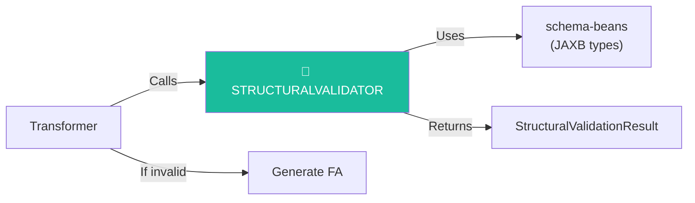
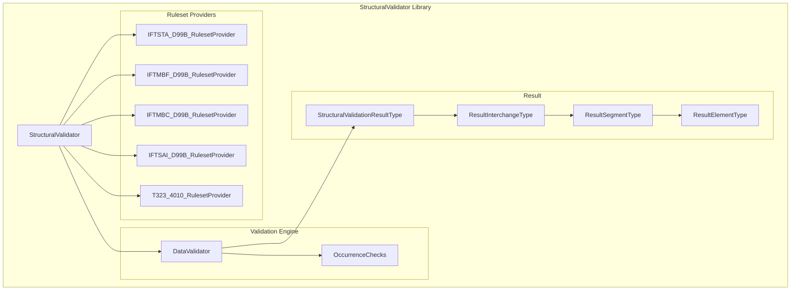
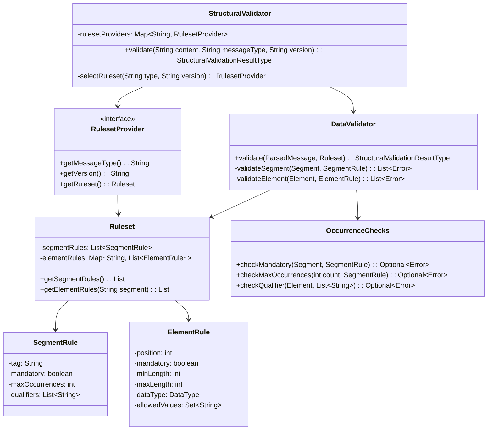
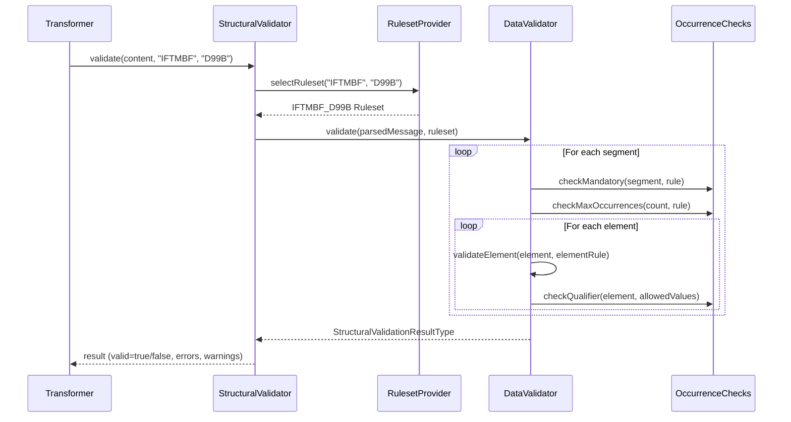
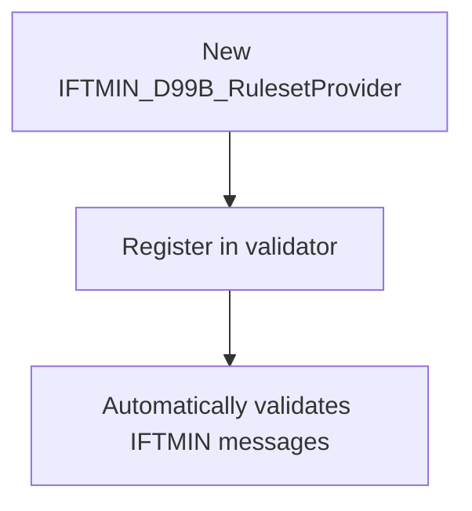

# StructuralValidator Module — Design Document

> **Module:** `structuralvalidator`  
> **Generated:** 2026-05-24  
> **Artifact:** `com.inttra.mercury:structuralvalidator:1.0-SNAPSHOT`  
> **Java Version:** 17 | **Test Framework:** JUnit 5

---

## 1. Executive Summary

The **StructuralValidator** is a library module (not a standalone service) that validates EDI messages against format-specific rulesets. It checks segment structure, element cardinality, mandatory fields, qualifier values, and occurrence constraints. The validation result is serialized into JAXB types (from `schema-beans`) and used by the Transformer to decide whether to generate Functional Acknowledgments (997/CONTRL).

---

## 2. Role in the Pipeline



---

## 3. Architecture



---

## 4. Class Diagram



---

## 5. Ruleset Provider Matrix

| Provider | Message Type | Version | Standard |
|----------|-------------|---------|----------|
| `IFTSTA_D99B_RulesetProvider` | IFTSTA | D99B | UN/EDIFACT |
| `IFTMBF_D99B_RulesetProvider` | IFTMBF | D99B | UN/EDIFACT |
| `IFTMBC_D99B_RulesetProvider` | IFTMBC | D99B | UN/EDIFACT |
| `IFTSAI_D99B_RulesetProvider` | IFTSAI | D99B | UN/EDIFACT |
| `T323_4010_RulesetProvider` | 323 | 4010 | ANSI X12 |

---

## 6. Validation Flow



---

## 7. Validation Checks

| Check Category | Description | Severity |
|---------------|-------------|----------|
| Mandatory segment | Required segment missing | ERROR |
| Segment cardinality | Exceeds max occurrences | ERROR |
| Mandatory element | Required element empty/missing | ERROR |
| Element length | Below min or above max length | WARNING/ERROR |
| Data type | Numeric/Alpha/Alphanumeric mismatch | ERROR |
| Qualifier value | Element value not in allowed set | ERROR |
| Occurrence count | Group repetition limits | ERROR |

---

## 8. Result Structure Example

```json
{
  "valid": false,
  "errorCount": 2,
  "warningCount": 1,
  "interchanges": [
    {
      "controlRef": "12345",
      "senderId": "CARRIER01",
      "receiverId": "INTTRA",
      "segments": [
        {
          "tag": "BGM",
          "position": 3,
          "elements": [
            {
              "position": 1,
              "value": "",
              "severity": "ERROR",
              "message": "Mandatory element missing"
            }
          ]
        }
      ]
    }
  ]
}
```

---

## 9. Key Maven Dependencies

| Dependency | Version | Purpose |
|-----------|---------|---------|
| `schema-beans` | 1.0 | JAXB result types |
| `jakarta.xml.bind-api` | 4.0.2 | JAXB API |
| `junit-jupiter` | 5.x | Unit testing |
| `assertj-core` | 3.x | Fluent assertions |

---

## 10. Design Patterns

| Pattern | Usage |
|---------|-------|
| **Strategy** | 5 RulesetProvider implementations |
| **Registry** | Map-based ruleset selection by type+version |
| **Value Object** | SegmentRule, ElementRule (immutable) |
| **Builder** | StructuralValidationResultType via JAXB |
| **Specification** | Each check is a testable predicate |

---

## 11. Extensibility

Adding a new message type validation requires:

1. Create new `XxxRulesetProvider` implementing `RulesetProvider`
2. Define segment and element rules for the message type
3. Register the provider in the `StructuralValidator` constructor
4. No changes to DataValidator or OccurrenceChecks needed


