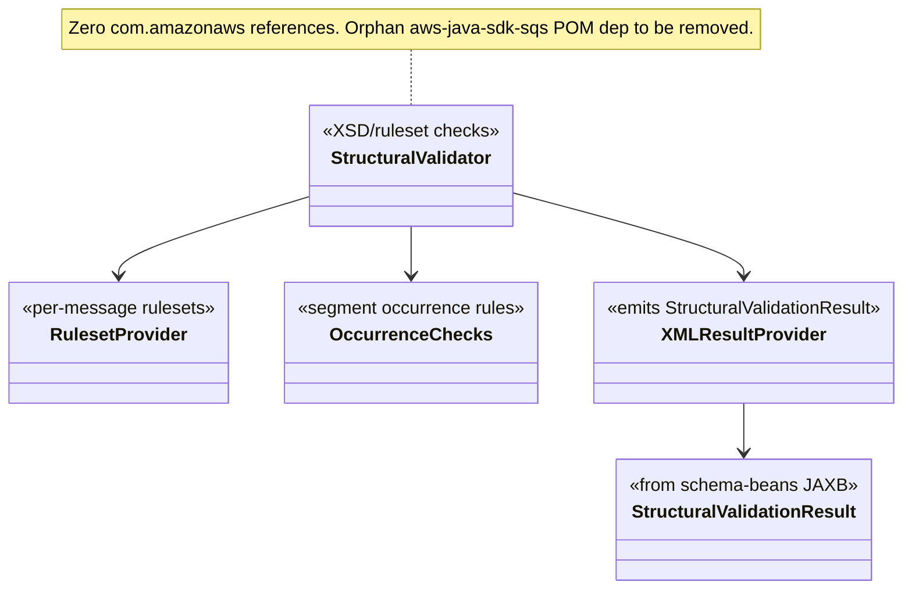
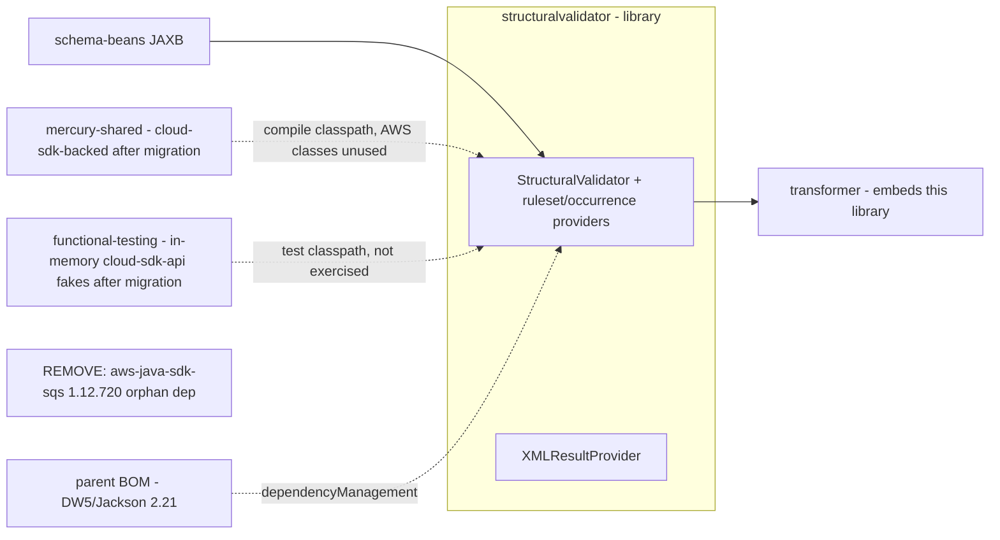

# `structuralvalidator` — AWS SDK v2 (cloud-sdk) Upgrade DESIGN (claude)

> Module: `com.inttra.mercury.structuralvalidator:structuralvalidator:1.0` · Date: 2026-05-31 · Author: Claude (Opus 4.8)
> **Chosen option: B** (program directive). For this module Option B reduces to **remove the orphan v1 SQS dependency + build/BOM alignment — no source, no cloud-sdk dependency.**
> Companion: [plan](2026-05-31-structuralvalidator-aws2x-upgrade-plan-claude.md). Master: [`shared` DESIGN](../../shared/docs/2026-05-31-shared-aws2x-upgrade-DESIGN-claude.md) §5/§6.

---

## 1. Overview & chosen option
`structuralvalidator` is a library embedded in `transformer`: `StructuralValidator` + per-message `RulesetProvider`/`OccurrenceCheck` implementations (IFSTA/IFTMBC/IFTMBF/IFTSAI/T323) produce a `StructuralValidationResult` (JAXB beans from `schema-beans`) via `XMLResultProvider`. **No AWS source.** The only AWS exposure is an **orphan compile-scope `aws-java-sdk-sqs:1.12.720`** in the POM. Under Option B: drop that dependency, rebuild against the migrated `shared`/`functional-testing`, inherit DW5/Jackson 2.21.0.

## 2. Class diagram (no AWS types; build-only delta)

## 3. Component diagram

## 4. Sequence diagram
**N/A for AWS** — the validator performs in-process schema/ruleset validation only; it makes no AWS calls. (Its runtime sequence is message → ruleset/occurrence checks → `StructuralValidationResult`, unchanged by the migration.)

## 5. Configuration changes
**N/A** — library with no `Application`/`Configuration`/YAML of its own. Master config composition: [`shared` DESIGN §5](../../shared/docs/2026-05-31-shared-aws2x-upgrade-DESIGN-claude.md).

## 6. cloud-sdk gaps
**NONE.** No cloud-sdk artifact consumed directly; no additive change proposed or required. The program-wide single required additive change is **S-G2** ([`shared` DESIGN §6.1](../../shared/docs/2026-05-31-shared-aws2x-upgrade-DESIGN-claude.md)) and does not touch this module.

## 7. Maven dependency changes
- **Remove:** `com.amazonaws:aws-java-sdk-sqs:1.12.720` ([pom.xml:54-58](../pom.xml)) — unused orphan; part of the v1 purge, behavior-neutral.
- **No cloud-sdk dependency to add** (module references no AWS API directly).
- **BOM/DW5 alignment:** inherit DW5/Jackson 2.21.0 from the parent BOM (the declared `dropwizard-core 4.0.16` becomes DW5 transitively; the module has no DW source). Rebuild against migrated `mercury-shared` (compile) and `functional-testing` (test). Program line reference: **1.0.26-SNAPSHOT** (consumed via `shared`/`functional-testing`, not declared here).
- Test stack already on **JUnit 5.10.1 + Mockito 5.11.0** — no change, no Vintage needed.

## 8. Tests
Existing Jupiter tests (`*RulesetProviderTest`, `*StructuralValidatorTest`, `XMLResultProviderTest`, `*OccurrenceCheckTest`) read JSON fixtures via [`TestSupport`](../src/test/java/com/inttra/mercury/structuralvalidator/common/TestSupport.java) (Jackson/Guava/IOUtils) — **no AWS fakes used**. They must continue to **compile against** the migrated `functional-testing` artifact (test-scope dependency on the classpath) but exercise none of it. Verification: `mvn -pl structuralvalidator -am test` after `shared`/`functional-testing` migrate.

## 9. Rollout
Rebuild **after** `schema-beans`, `shared`, and `functional-testing` (compile/test classpath prerequisites), and before/with `transformer`. The orphan `aws-java-sdk-sqs` removal can be done at any time (pure hygiene). Listed as a **rebuild-only (plus orphan-dep removal)** node in the program rollout checklist.

## 10. Risks & mitigations
| Risk | Mitigation |
|---|---|
| Removing `aws-java-sdk-sqs` breaks something | Verified unused in source; `mvn -pl structuralvalidator -am verify` after removal confirms |
| Test-compile break when `functional-testing` re-points its fakes to cloud-sdk-api | structuralvalidator tests don't reference the fakes, so only the classpath must resolve; rebuild after `functional-testing` |
| DW5/Jackson 2.21 BOM bump | No DW/Jackson source usage beyond JAXB beans; low risk — confirm at clean build |
| `transformer` assembly version skew (Jackson) with `schema-beans` | Align `schema-beans` Jackson pin (see schema-beans DESIGN §7); verify `transformer` `dependency:tree` |
