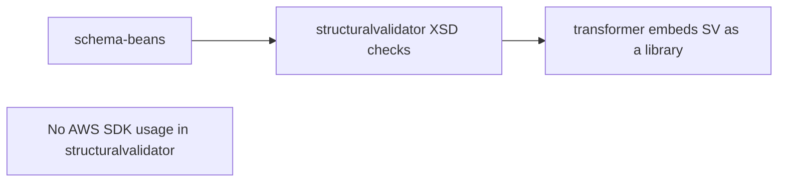

# `structuralvalidator` — AWS SDK v2 (cloud-sdk) Upgrade DESIGN

> **DIRECTIVE UPDATE (2026-05-31) — supersedes the Option-A recommendation in this document.** Per stakeholder direction the program now targets **Dropwizard 5** and **Option B — adopt `commons` + `cloud-sdk-api`/`cloud-sdk-aws`** as the directed default (recommend Option A only on a categorical technical blocker). All AWS service communication goes through `cloud-sdk-api`; new tests are written in **JUnit 5 (Jupiter)** (existing JUnit 4 runs via JUnit Vintage during transition); configuration follows the composed appianway `.properties`/`${PROFILE}`/`${ENV}` + commons `${awsps:...}` model in the master [shared plan §10](../../shared/docs/2026-05-31-shared-aws2x-upgrade-plan-copilot.md). cloud-sdk gaps are indexed in the master [shared plan §11](../../shared/docs/2026-05-31-shared-aws2x-upgrade-plan-copilot.md) with full technical specs in the master [shared DESIGN §1A.6](../../shared/docs/2026-05-31-shared-aws2x-upgrade-DESIGN.md).
> **Module-specific cloud-sdk gaps:** None directly — embedded validation library with no AWS client usage; inherits shared's Option B baseline and the G6 config-composition transitively.
> Sections below are retained as the Option-A fallback reference.

> Module: `structuralvalidator` · Date: 2026-05-31 · Author: GitHub Copilot (Claude Opus 4.8)
> Companion: [plan](2026-05-31-structuralvalidator-aws2x-upgrade-plan-copilot.md). Session `83b822b011714117`.

## 1. Overview
`structuralvalidator` has **no AWS SDK v1 surface**. No design changes are required by the AWS v2 / cloud-sdk migration. Recorded here for completeness.

## 2. Class diagram
No changes. XSD-validation classes returning `StructuralValidationResult` are unaffected.

## 3. Component diagram

## 4. Sequence diagrams
Not applicable.

## 5. Configuration changes
None.

## 6. Maven dependency changes
None for AWS. (If a `shared` dependency exists, it is rebuilt transitively; no version edit needed here.)

## 7. Test details
No test changes. Rebuild to confirm compilation after upstream modules migrate.

## 8. Rollout & verification
`mvn -pl structuralvalidator -am verify` after `shared`/`schema-beans` — expect clean build, no diffs.

## 9. Risks & mitigations
None of substance.
