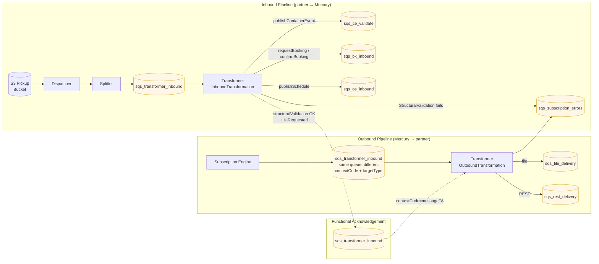
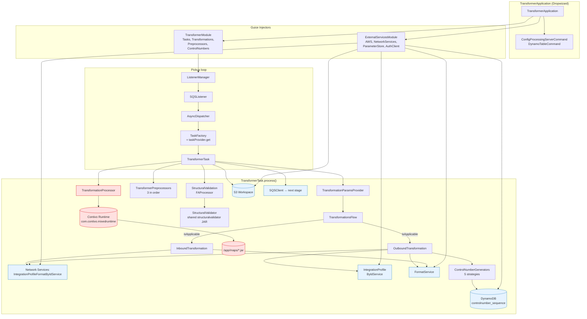
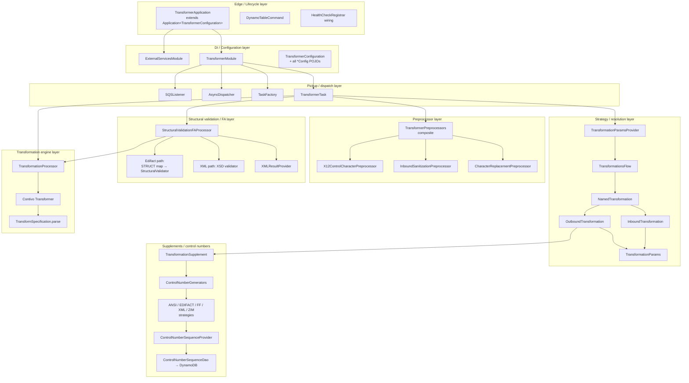
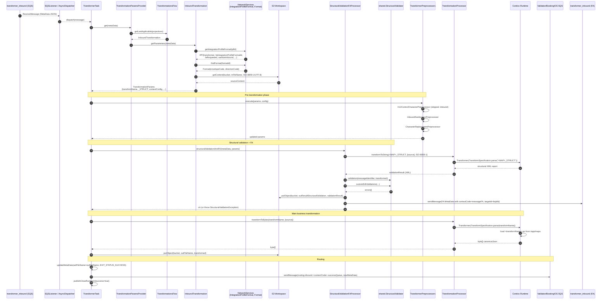
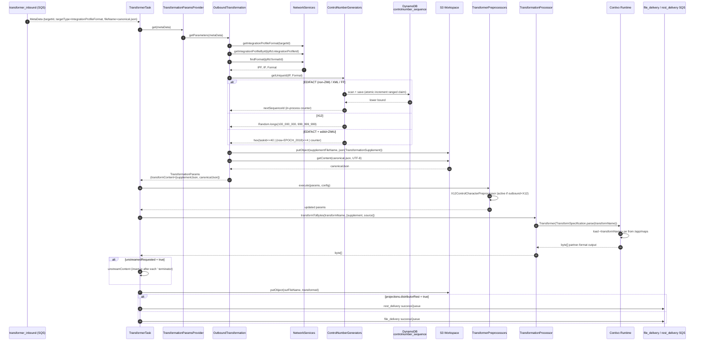
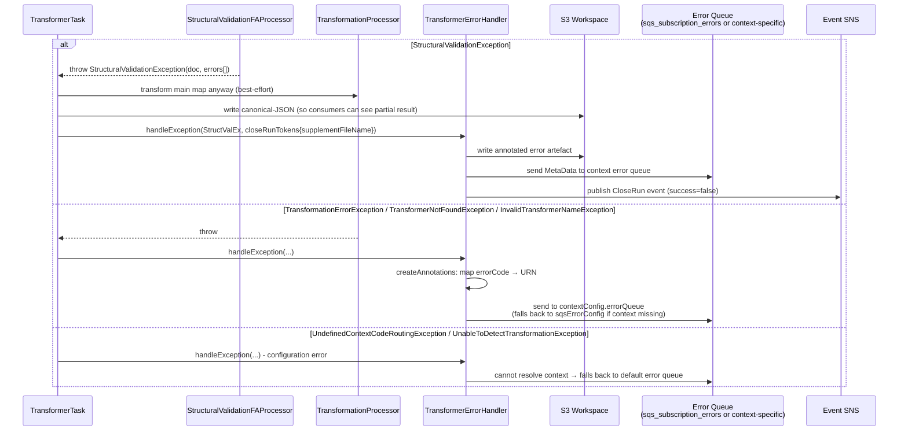

# Transformer Module — Architecture & Design

> **Author:** Principal Engineering Review · **Date:** 2026-05-24 · **Module Version:** `com.inttra.mercury.appian-way:transformer:1.0` (parent `appian-way:1.0`, Contivo runtime `6.7.2`, Contivo commons `2.6.0`)

---

## 1. Executive Summary

The Transformer is the Mercury (Appian Way) pipeline component that maps payloads between partner-specific business formats and Mercury's internal canonical representation, and back. It is the only place in the platform where the actual *content* of a message is rewritten; every other component (splitter, dispatcher, validator, distributor) operates on the message envelope and metadata only.

The Transformer is a Dropwizard application that:

1. Pulls a `MetaData` envelope from the `transformer_inbound` SQS queue.
2. Loads the partner-format binding (`IntegrationProfileFormat`, or "IPF") from Network Services, which resolves to a **Contivo Transformer map name** (a compiled XBM / JAR shipped under `/app/maps`).
3. Optionally runs a **structural validation** map (`<MAP>_STRUCT`) on the source and, if requested, dispatches a Functional Acknowledgement (FA / CONTRL / 997) back through the same Transformer queue with `contextCode=messageFA`.
4. Applies a chain of preprocessors (X12 control-character replacement, character-set sanitization, generic character replacement) to the source content.
5. Invokes the Contivo runtime (`com.contivo.mixedruntime.runtime.wrapper.Transformer`) to actually perform the format conversion using the resolved map.
6. Persists the transformed payload to the S3 workspace under a new key (`<rootWorkflowId>/<uuid>`).
7. Forwards a new `MetaData` envelope to the next stage's SQS queue, chosen from the `routing.{inbound|outbound}.<contextCode>` configuration (Validator, Booking, OS, File Delivery, REST Delivery, or the error queue).

Two **NamedTransformation** strategies are registered ([`InboundTransformation`](../src/main/java/com/inttra/mercury/transformer/transformations/InboundTransformation.java), [`OutboundTransformation`](../src/main/java/com/inttra/mercury/transformer/transformations/OutboundTransformation.java)). Their applicability is data-driven from the `MetaData.projections` map — there is **no static branching by direction**; the same JAR/Docker image serves inbound, container-event outbound, schedule outbound, booking, and FA flows. The deployment is rebadged at build time (`build.sh`) into three release artefacts — `transformer` (inbound), `ce-transformer` (container events outbound), and `os-transformer` (ocean schedules outbound) — that share identical bytes and differ only by the `*.properties` file mounted into the container.

The Contivo runtime is the load-bearing third-party dependency. Maps are not source-controlled in this module; they are pulled from an internal Maven repository at *build* time (see `build.sh:11-15`) and shipped as JARs into `/app/maps`. The Contivo runtime locates them via the JVM option `-Dcontivo.runtime.classpath=/app/maps`.

---

## 2. Position in the Mercury Pipeline

The Transformer is the third stage of the inbound flow and the second-to-last stage of the outbound flow. Upstream is the **Splitter**, which has decomposed a multi-message file into single-message envelopes and projected `integrationProfileFormatId`, `formatId`, `formatCode`, `contextCode`, `ediId` etc. onto the `MetaData`. Downstream is the **Validator** (`sqs_ce_validate_pu`), **Booking inbound** (`sqs_bk_inbound`), **Schedules inbound** (`sqs_os_inbound`) for inbound flows, and the **File Delivery** (`sqs_file_delivery_pu`) / **REST Delivery** (`sqs_rest_delivery_pu`) for outbound flows.



A nuance worth calling out: there is exactly **one pickup queue** (`transformer.pickupSqsConfig.queueUrl`) for the binary, regardless of direction. The decision tree of "is this inbound or outbound" lives in [`TransformationsFlow.getLastApplicable()`](../src/main/java/com/inttra/mercury/transformer/task/TransformationsFlow.java#L26) and is purely a function of which projection keys are present:

| Projection key present                            | Resolved `NamedTransformation` |
|---------------------------------------------------|--------------------------------|
| `integrationProfileFormatId`                      | `InboundTransformation`        |
| `targetId` + `targetType` (no IPF in projections) | `OutboundTransformation`       |
| both                                              | `OutboundTransformation` (last applicable wins, see §10) |

Because the FA path re-enters the same pickup queue (see [`StructuralValidationFAProcessor.sendForFA`](../src/main/java/com/inttra/mercury/transformer/task/StructuralValidationFAProcessor.java#L232)), the FA messages — which carry `targetId`+`targetType` — are picked up on a subsequent loop and routed through `OutboundTransformation`. This is the *only* recursive edge in the Mercury graph.

---

## 3. High-Level Architecture



Three architectural choices deserve emphasis:

1. **The transformation rule is *not* a file on disk and *not* a partner table inside this module.** It is the field `IntegrationProfileFormat.transformer` returned from a remote Network Service (`/integration-profile-formats/{id}`), cached by [`CacheIntegrationProfileFormatByIdService`](../../shared/src/main/java/com/inttra/mercury/shared/networkservices/integrationprofileformat/CacheIntegrationProfileFormatByIdService.java) (resolved at [`ExternalServicesModule:72`](../src/main/java/com/inttra/mercury/transformer/modules/ExternalServicesModule.java#L72)). The string returned is the Contivo map class name; the JAR containing that class is loaded by name from `${contivo.runtime.classpath}`. Adding a new partner/format mapping therefore requires *zero* code changes in this module — only (a) Contivo Analyst tooling to author and compile the XBM/JAR, (b) deployment of the JAR into the `lib/maps` artefact, and (c) a Network Services row pointing at the new map name.

2. **One application binary, multiple deployment identities.** [`build.sh:66-127`](../build.sh#L66-L127) takes the same shaded JAR and rebadges it as `transformer`, `os-transformer`, and `ce-transformer` Docker images, each with its own `<env>/<app>.properties` overlay. Differentiation is purely by SQS queue subscription, not by code.

3. **Contivo is treated as a black box.** [`TransformationProcessor`](../src/main/java/com/inttra/mercury/transformer/transformer/TransformationProcessor.java) is intentionally thin (95 lines). It instantiates a `com.contivo.mixedruntime.runtime.wrapper.Transformer`, hands it source bytes via `addSource()`, calls `toTargetBytes()`, and forwards the result. All EDI/X12/EDIFACT/XML/JSON parsing and emission is delegated to the Contivo runtime. The map name is the *only* user-controllable input that affects which conversion is performed.

---

## 4. Low-Level Design

### 4.1 Layered structure



### 4.2 Strategy pattern over `MetaData.projections`

The Transformer follows a *late-binding strategy* pattern: the strategy is selected by the data shape of the input, not configuration:

* [`NamedTransformation.isApplicable(Map<String,String> projections)`](../src/main/java/com/inttra/mercury/transformer/transformations/NamedTransformation.java#L10) returns true if the strategy can handle the current message;
* [`TransformationsFlow.getLastApplicable()`](../src/main/java/com/inttra/mercury/transformer/task/TransformationsFlow.java#L26) walks the registered strategies in declaration order and returns the **last** applicable one (`.reduce((first, second) -> second)`).

The "last applicable wins" semantics matters for the FA round-trip: a regular inbound message has only `integrationProfileFormatId` projection set → `InboundTransformation`. After the inbound transformation succeeds and writes a canonical-JSON output, the FA dispatcher (`StructuralValidationFAProcessor.buildFAMetaData`) re-injects a new envelope that *additionally* sets `targetId`+`targetType=IntegrationProfileFormat` → both strategies now match, but `OutboundTransformation` (registered second in [`TransformerModule.getTransformationFlow`](../src/main/java/com/inttra/mercury/transformer/modules/TransformerModule.java#L83)) wins.

### 4.3 Immutable parameter passing

[`TransformationParams`](../src/main/java/com/inttra/mercury/transformer/task/TransformationParams.java) is the immutable bag of "everything resolved for this message". Each preprocessor in the chain returns a *new* `TransformationParams` (Lombok `@Builder`) because mutation would break thread-safety of the async dispatcher. The trade-off is verbose copy-constructor code in each preprocessor (e.g. [`CharacterReplacementPreprocessor:47-63`](../src/main/java/com/inttra/mercury/transformer/preprocess/CharacterReplacementPreprocessor.java#L47-L63) explicitly re-copies 14 fields), but it gives a single point of truth for what the engine receives.

### 4.4 Source-content vector

Note `TransformationParams.transformContent` is `String[]`, not `String`. Inbound flow puts the partner source content at `[0]`; outbound flow puts the **`TransformationSupplement`** JSON (a flattened view of integration profile attributes — sender/receiver EDI IDs, UNA/UNG/test-indicator flags, control-number seeds — see [`TransformationSupplement.java`](../src/main/java/com/inttra/mercury/transformer/transformations/TransformationSupplement.java)) at `[0]` and the canonical-JSON source at `[1]`. The Contivo map then has two sources to draw from in `addSource()` calls. This is the reason inbound has length 1 and outbound has length 2, and why `X12ControlCharacterPreprocessor.shouldPreProcess` gates on `transformContent.length > 1` ([`X12ControlCharacterPreprocessor.java:50`](../src/main/java/com/inttra/mercury/transformer/preprocess/X12ControlCharacterPreprocessor.java#L50)).

### 4.5 Structural validation as a separate Contivo invocation

When `structuralValidationEnabled` (driven by `formatConfig.<formatCode>.structuralValidation: true` in YAML), the [`StructuralValidationFAProcessor`](../src/main/java/com/inttra/mercury/transformer/task/StructuralValidationFAProcessor.java) runs a **second** Contivo map whose name is `<transformName>_STRUCT` (see [`InboundTransformation:66-68`](../src/main/java/com/inttra/mercury/transformer/transformations/InboundTransformation.java#L66-L68)) **before** the main business transformation. The STRUCT map produces an XML report that is fed to the shared `StructuralValidator` jar and to the FA generation flow. If the XML report contains `TransactionValidationStatus == "4"` (or any custom EDI validation errors), `StructuralValidationException` is thrown; on FA-requested cases the validation result XML is still uploaded to S3 so the outbound FA generator can pick it up.

XML inputs (e.g. `IFTMBF_XML_IN_V1`) skip the STRUCT map and go through an **XSD-based** path using `INTTRABooking2Request_V1.8.xsd` instead (see [`StructuralValidationFAProcessor:176-201`](../src/main/java/com/inttra/mercury/transformer/task/StructuralValidationFAProcessor.java#L176-L201)).

---

## 5. Key Classes — Class Diagram

```mermaid
classDiagram
    class TransformerApplication {
        +main(String[] args)
        +initialize(Bootstrap)
        +run(TransformerConfiguration, Environment)
        -registerHealthChecks(...)
    }
    class TransformerConfiguration {
        +HealthCheckConfig healthCheckConfig
        +NetworkServiceConfig networkServiceConfig
        +ContextCodeRules routing
        +Map~String,FormatConfig~ formatConfig
        +Map~String,EnvelopeConfig~ envelopeCodeRules
        +PreprocessorConfig preprocessorConfig
        +String dynamoDbSequenceTable
        +String environment
    }
    class ContextCodeRules {
        +Map~String,ContextConfig~ inbound
        +Map~String,ContextConfig~ outbound
    }
    class ContextConfig {
        +String successQueue
        +String errorQueue
        +String distributorRestQueue
        +boolean structuralValidation
    }
    class TransformerModule {
        +configure()
        +listenerManager(SQSListener)
        +getTransformationFlow(...)
        +createPublisher(...)
        +getSQSListener(...)
        +controlNumGenerator(...)
        +preProcessors(...)
        -getTransformProperties()
    }
    class ExternalServicesModule {
        +configure()
        +jerseyClient()
    }
    class TransformerTask {
        -TransformationProcessor transformationProcessor
        -WorkspaceService workspaceService
        -TransformationParamsProvider paramsProvider
        -StructuralValidationFAProcessor structuralValidationFAProcessor
        -TransformerPreprocessors preprocessors
        +process(Message, queueUrl)
        -transform(params, metadata, tokens)
        -unstreamContent(bytes, charset)
        -updateMetaData(...)
        -sendToSqs(...)
        -publishCloseRunEvent(...)
    }
    class TransformerErrorHandler {
        +createAnnotations(Exception)
        +getErrorQueue(MetaData)
    }
    class TransformationParamsProvider {
        +get(MetaData) TransformationParams
        +getTargetQueues(MetaData, Map)$ ContextConfig
        +getFormatConfig(MetaData, Map)$ FormatConfig
    }
    class TransformationsFlow {
        -NamedTransformation[] namedTransformations
        +getLastApplicable(projections) NamedTransformation
    }
    class NamedTransformation {
        <<interface>>
        +isApplicable(projections) boolean
        +getParameters(MetaData) TransformationParams
    }
    class InboundTransformation
    class OutboundTransformation {
        +ACTION_TARGET_TYPE_IPF_TRANSFORM$ String
        -getParamsForIntegrationProfileFormat(MetaData)
        -prepareSupplement(...)
        -getAnsiReplaceCharacterTo(...)
    }
    class TransformationParams {
        +bucket
        +inFileName / outFileName
        +supplementFileName
        +transformName
        +structuralMapName
        +structuralValidationEnabled
        +contextConfig
        +transformContent String[]
        +projections Map
        +faIntegrationProfileFormatId
        +faRequested
        +directionCode / envelopeCode
        +ansiReplaceCharacterTo
        +sanitizeInbound
        +charactersToReplace / replacementCharacters
    }
    class TransformationSupplement {
        +IntegrationProfileFormatCode
        +IntegrationProfileCode
        +FormatFields
    }
    class TransformationProcessor {
        +TRANSFORM_PROPERTIES$ String
        +transform(name, sources) String
        +transformToString(name, sources, decoder) String
        +transformToBytes(name, sources) byte[]
        -getTransformer(name) Transformer
        -getReport(results) String
    }
    class StructuralValidationFAProcessor {
        +structuralValidationAndFA(metaData, params)
        -edifactStructuralValidationAndFA(...)
        -xmlStructuralValidationAndFA(...)
        -validateXML(content, metadata)
        -sendForFA(metaData, params)
        -validateResult(transformed, errors)
        -buildFAMetaData(...)
    }
    class TransformerPreprocessor {
        <<interface>>
        +preprocess(params, configuration) TransformationParams
    }
    class TransformerPreprocessors {
        -List~TransformerPreprocessor~ preprocessors
        +execute(params, configuration) TransformationParams
    }
    class X12ControlCharacterPreprocessor
    class InboundSanitizationPreprocessor
    class CharacterReplacementPreprocessor
    class ControlNumberGenerator {
        <<interface>>
        +getUniqueId() String
        +isMatch(profile, format) boolean
    }
    class ControlNumberGenerators {
        -List~ControlNumberGenerator~ generators
        +getUniqueId(profile, format) String
    }
    class AnsiControlNumGenerator
    class EdifactControlNumGenerator
    class FFControlNumGenerator
    class XMLControlNumGenerator
    class ZIMControlNumGenerator
    class ControlNumberSequenceProvider {
        -INCREMENT_RANGE$ long
        -MAX_RETRIES$ int
        -SEED_VALUE$ long
        +nextSequenceId() String
        -nextLowerBound() Long
    }
    class ControlNumberSequenceDao
    class ControlNumberSequence
    class DynamoTableCommand

    TransformerApplication --> TransformerConfiguration
    TransformerApplication --> ExternalServicesModule
    TransformerApplication --> TransformerModule
    TransformerApplication --> DynamoTableCommand
    TransformerConfiguration --> ContextCodeRules
    ContextCodeRules --> ContextConfig
    TransformerModule --> TransformerTask
    TransformerModule --> TransformationsFlow
    TransformerModule --> TransformerPreprocessors
    TransformerTask --> TransformationProcessor
    TransformerTask --> TransformationParamsProvider
    TransformerTask --> StructuralValidationFAProcessor
    TransformerTask --> TransformerPreprocessors
    TransformerTask --> TransformerErrorHandler
    TransformationParamsProvider --> TransformationsFlow
    TransformationsFlow o-- NamedTransformation
    NamedTransformation <|.. InboundTransformation
    NamedTransformation <|.. OutboundTransformation
    InboundTransformation --> TransformationParams
    OutboundTransformation --> TransformationParams
    OutboundTransformation --> TransformationSupplement
    OutboundTransformation --> ControlNumberGenerators
    TransformationProcessor --> "Contivo Transformer"
    StructuralValidationFAProcessor --> TransformationProcessor
    TransformerPreprocessors o-- TransformerPreprocessor
    TransformerPreprocessor <|.. X12ControlCharacterPreprocessor
    TransformerPreprocessor <|.. InboundSanitizationPreprocessor
    TransformerPreprocessor <|.. CharacterReplacementPreprocessor
    ControlNumberGenerators o-- ControlNumberGenerator
    ControlNumberGenerator <|.. AnsiControlNumGenerator
    ControlNumberGenerator <|.. EdifactControlNumGenerator
    ControlNumberGenerator <|.. ZIMControlNumGenerator
    EdifactControlNumGenerator <|-- FFControlNumGenerator
    EdifactControlNumGenerator <|-- XMLControlNumGenerator
    EdifactControlNumGenerator --> ControlNumberSequenceProvider
    ControlNumberSequenceProvider --> ControlNumberSequenceDao
    ControlNumberSequenceDao --> ControlNumberSequence
    TransformerErrorHandler --|> "shared.ErrorHandler"
```

### 5.1 Class responsibility cheat-sheet

| Class | Responsibility | File |
|---|---|---|
| `TransformerApplication` | Dropwizard entry-point; wires modules; registers health checks | [src/main/java/com/inttra/mercury/transformer/TransformerApplication.java](../src/main/java/com/inttra/mercury/transformer/TransformerApplication.java) |
| `TransformerConfiguration` | YAML-bound root config; extends shared `BaseConfiguration` | [config/TransformerConfiguration.java](../src/main/java/com/inttra/mercury/transformer/config/TransformerConfiguration.java) |
| `ContextCodeRules` | Top-level routing map: `inbound.<contextCode>` and `outbound.<contextCode>` | [config/ContextCodeRules.java](../src/main/java/com/inttra/mercury/transformer/config/ContextCodeRules.java) |
| `ContextConfig` | Per-contextCode triplet of success / error / distributorRest queues | [config/ContextConfig.java](../src/main/java/com/inttra/mercury/transformer/config/ContextConfig.java) |
| `FormatConfig` | Per-format flag for structural validation | [config/FormatConfig.java](../src/main/java/com/inttra/mercury/transformer/config/FormatConfig.java) |
| `EnvelopeConfig` | Per-envelope flag controlling content streaming (newline stripping) | [config/EnvelopeConfig.java](../src/main/java/com/inttra/mercury/transformer/config/EnvelopeConfig.java) |
| `PreprocessorConfig` | Global on/off + directionCode/envelopeCode filter for X12 ASCII control char replacement | [config/PreprocessorConfig.java](../src/main/java/com/inttra/mercury/transformer/config/PreprocessorConfig.java) |
| `HealthCheckConfig` | Network-service health URL + error-rate threshold | [config/HealthCheckConfig.java](../src/main/java/com/inttra/mercury/transformer/config/HealthCheckConfig.java) |
| `TransformerModule` | Guice bindings for tasks, transformations, preprocessors, control numbers, dispatcher | [modules/TransformerModule.java](../src/main/java/com/inttra/mercury/transformer/modules/TransformerModule.java) |
| `ExternalServicesModule` | Guice bindings for AWS SDK clients, Jersey client, NetworkServices, ParameterStore | [modules/ExternalServicesModule.java](../src/main/java/com/inttra/mercury/transformer/modules/ExternalServicesModule.java) |
| `TransformerTask` | Per-message worker; orchestrates lookup → preprocess → validate → transform → publish | [task/TransformerTask.java](../src/main/java/com/inttra/mercury/transformer/task/TransformerTask.java) |
| `TransformerErrorHandler` | Translates exceptions into annotated S3 artefacts + error queue routing | [task/TransformerErrorHandler.java](../src/main/java/com/inttra/mercury/transformer/task/TransformerErrorHandler.java) |
| `TransformationParamsProvider` | Resolves per-message strategy + parameter bag; stateless | [task/TransformationParamsProvider.java](../src/main/java/com/inttra/mercury/transformer/task/TransformationParamsProvider.java) |
| `TransformationsFlow` | Strategy dispatcher (`Inbound` vs `Outbound`) | [task/TransformationsFlow.java](../src/main/java/com/inttra/mercury/transformer/task/TransformationsFlow.java) |
| `InboundTransformation` | Partner-format → canonical JSON parameter resolver; reads IPF; loads source from S3; handles content streaming and sanitization flags | [transformations/InboundTransformation.java](../src/main/java/com/inttra/mercury/transformer/transformations/InboundTransformation.java) |
| `OutboundTransformation` | Canonical-JSON → partner-format parameter resolver; builds the `TransformationSupplement` and persists it to S3 | [transformations/OutboundTransformation.java](../src/main/java/com/inttra/mercury/transformer/transformations/OutboundTransformation.java) |
| `TransformationSupplement` | `HashMap<String,String>` of integration-profile attributes consumed by outbound Contivo maps | [transformations/TransformationSupplement.java](../src/main/java/com/inttra/mercury/transformer/transformations/TransformationSupplement.java) |
| `TransformationProcessor` | Thin wrapper over `com.contivo.mixedruntime.runtime.wrapper.Transformer` | [transformer/TransformationProcessor.java](../src/main/java/com/inttra/mercury/transformer/transformer/TransformationProcessor.java) |
| `StructuralValidationFAProcessor` | Runs STRUCT map (EDIFACT/X12) or XSD validator (XML); produces FA envelope when requested | [task/StructuralValidationFAProcessor.java](../src/main/java/com/inttra/mercury/transformer/task/StructuralValidationFAProcessor.java) |
| `TransformerPreprocessors` | Composite that iterates the registered preprocessors in order | [preprocess/TransformerPreprocessors.java](../src/main/java/com/inttra/mercury/transformer/preprocess/TransformerPreprocessors.java) |
| `X12ControlCharacterPreprocessor` | Replaces `*` with space (or IPF-configured char) in outbound X12 source content | [preprocess/X12ControlCharacterPreprocessor.java](../src/main/java/com/inttra/mercury/transformer/preprocess/X12ControlCharacterPreprocessor.java) |
| `InboundSanitizationPreprocessor` | Strips non-ISO-8859-1 characters from inbound source content | [preprocess/InboundSanitizationPreprocessor.java](../src/main/java/com/inttra/mercury/transformer/preprocess/InboundSanitizationPreprocessor.java) |
| `CharacterReplacementPreprocessor` | Per-IPF arbitrary character mapping (1:1 or 1:N replacement) | [preprocess/CharacterReplacementPreprocessor.java](../src/main/java/com/inttra/mercury/transformer/preprocess/CharacterReplacementPreprocessor.java) |
| `ControlNumberGenerators` | Composite that finds the first matching strategy | [controlnumbers/ControlNumberGenerators.java](../src/main/java/com/inttra/mercury/transformer/controlnumbers/ControlNumberGenerators.java) |
| `ZIMControlNumGenerator` | EDIFACT + EDI=ZIMU; hex string of timestamp + counter + random | [controlnumbers/ZIMControlNumGenerator.java](../src/main/java/com/inttra/mercury/transformer/controlnumbers/ZIMControlNumGenerator.java) |
| `EdifactControlNumGenerator` | EDIFACT (non-ZIM); pulls from DynamoDB-backed sequence | [controlnumbers/EdifactControlNumGenerator.java](../src/main/java/com/inttra/mercury/transformer/controlnumbers/EdifactControlNumGenerator.java) |
| `AnsiControlNumGenerator` | X12; random 9-digit number (TODO: replace with sequence) | [controlnumbers/AnsiControlNumGenerator.java](../src/main/java/com/inttra/mercury/transformer/controlnumbers/AnsiControlNumGenerator.java) |
| `XMLControlNumGenerator` | XML envelope; same backing as EDIFACT (subclass) | [controlnumbers/XMLControlNumGenerator.java](../src/main/java/com/inttra/mercury/transformer/controlnumbers/XMLControlNumGenerator.java) |
| `FFControlNumGenerator` | Flat-file envelope; same backing as EDIFACT (subclass) | [controlnumbers/FFControlNumGenerator.java](../src/main/java/com/inttra/mercury/transformer/controlnumbers/FFControlNumGenerator.java) |
| `ControlNumberSequenceProvider` | Per-process cache of 1000 ids; replenishes by atomic update to DynamoDB | [controlnumbers/sequence/ControlNumberSequenceProvider.java](../src/main/java/com/inttra/mercury/transformer/controlnumbers/sequence/ControlNumberSequenceProvider.java) |
| `ControlNumberSequenceDao` | DynamoDB CRUD for `controlnumber_sequence` table | [controlnumbers/sequence/ControlNumberSequenceDao.java](../src/main/java/com/inttra/mercury/transformer/controlnumbers/sequence/ControlNumberSequenceDao.java) |
| `ControlNumberSequence` | DynamoDB POJO (hash key `keyId`, attribute `id`, optimistic-lock `version`) | [controlnumbers/sequence/ControlNumberSequence.java](../src/main/java/com/inttra/mercury/transformer/controlnumbers/sequence/ControlNumberSequence.java) |
| `DynamoTableCommand` | Dropwizard command to create the `controlnumber_sequence` DynamoDB table at deploy time | [command/DynamoTableCommand.java](../src/main/java/com/inttra/mercury/transformer/command/DynamoTableCommand.java) |
| `*Exception` (×7) | Sealed set of error codes mapped to `/exception/transformer/...` URNs | [transformer/exception/](../src/main/java/com/inttra/mercury/transformer/transformer/exception/) |

---

## 6. Data Flow Diagram

### 6.1 End-to-end happy path (inbound EDIFACT IFTMBC, structural validation + FA requested)



### 6.2 Outbound flow (canonical → partner format)



### 6.3 Error path



---

## 7. Component Dependencies

### 7.1 Runtime dependency surface

```mermaid
flowchart LR
    T[transformer module] --> SH[mercury-shared<br/>BaseConfig, MetaData,<br/>SQSClient, SNSClient,<br/>NetworkServices clients,<br/>ParameterStore, AuthClient,<br/>S3WorkspaceService,<br/>EventLogger, ErrorHandler]
    T --> SV[mercury-structuralvalidator<br/>EdiValidationException,<br/>StructuralValidator,<br/>XMLResultProvider]
    T --> DW[Dropwizard Core<br/>+ metrics-annotation]
    T --> AWS[AWS SDK<br/>SQS, SNS, S3, DynamoDB,<br/>CloudWatchMetrics]
    T --> GU[Guice 5 + metrics-guice]
    T --> CON[Contivo 6.7.2<br/>Runtime, Core,<br/>Analyst*, Lang,<br/>akka-actor, scala-library 2.13.9,<br/>kotlin-stdlib 1.6,<br/>saxon-pe 9.2,<br/>eclipse-collections,<br/>mapdb / rocksdbjni / elsa]
    T --> JX[JAXB 2.3 / 4.0<br/>(classic + jakarta)]
    T --> LB[Logback + SLF4J]
    T --> LMB[Lombok]
    T --> TEST[JUnit5 + Mockito 5.11<br/>+ AssertJ + functional-testing]

    classDef contivo fill:#ffe0e0,stroke:#cc0000
    class CON contivo
```

### 7.2 External services consumed

| External system | Used for | Client class |
|---|---|---|
| Network Services (`IntegrationProfileService`) | Resolve `IntegrationProfile` attributes (used in outbound supplement) | `IntegrationProfileByIdService` / `CacheIntegrationProfileByIdService` |
| Network Services (`IntegrationProfileFormatService`) | Resolve `IntegrationProfileFormat.transformer` → Contivo map name + IPF attribute set | `IntegrationProfileFormatByIdService` / `CacheIntegrationProfileFormatByIdService` |
| Network Services (`FormatService`) | Resolve `Format.envelopeCode`, `directionCode`, `inttraVersion`, `envelopeVersion` | `FormatService` / `CacheFormatService` |
| Parameter Store (SSM) | NetworkServices auth credentials, OAuth client id / secret | `ParameterStoreModule` |
| S3 (workspace bucket) | Read source content; write transformed payload, structural-validation report, supplement | `S3WorkspaceService` (impl of `WorkspaceService`) |
| SQS (pickup) | Inbound queue `transformer_inbound`; same queue used for FA re-injection | `SQSListenerClient` |
| SQS (publishing) | Per-context-code success queue, error queue, distributor REST queue, FA queue | `SQSClient` |
| SNS | Open-run / close-run / business-event publication via shared `SNSEventPublisher` | `SNSClient` |
| DynamoDB | `controlnumber_sequence` table for EDIFACT / XML / FF / interchange-control-number generation | `ControlNumberSequenceDao` |
| Hystrix bundle | Currently **commented out** at [TransformerApplication:59](../src/main/java/com/inttra/mercury/transformer/TransformerApplication.java#L59); not active despite imported dependency |

---

## 8. Configuration & Validation

The Transformer is configured by three artefacts: `conf/transformer.yaml` (skeleton, env-variable substituted), `conf/<env>/transformer.properties` (env override), and the environment variables wired in by the Mercury platform (`PROFILE`, `ENV`, `JVM_Xmx`, `RELEASE_NAME`). The shared `BaseConfiguration` provides `componentName`, `sqsPickupConfig`, `snsEventConfig`, `sqsErrorConfig`, `s3WorkspaceConfig`, and `metrics`. The transformer-specific extension adds the keys below.

### 8.1 Configuration key reference

| Key | Type | Default | Required | Description | Validation |
|---|---|---|---|---|---|
| `componentName` | String | `transformer` | yes | Identifies the component in CloudWatch + EventLogger | `BaseConfiguration` `@NotNull` |
| `environment` | String | `${ENV}` | yes | Free-text env label (int / qa / cvt / prod / stress); used in AWS SDK metrics namespace | `@NotNull` ([TransformerConfiguration.java:54](../src/main/java/com/inttra/mercury/transformer/config/TransformerConfiguration.java#L54)) |
| `dynamoDbSequenceTable` | String | n/a | yes | DynamoDB table backing the EDIFACT/XML/FF interchange-control-number sequence | `@NotNull` ([TransformerConfiguration.java:49](../src/main/java/com/inttra/mercury/transformer/config/TransformerConfiguration.java#L49)) |
| `healthCheckConfig.networkServiceHealthCheckUrl` | URL | n/a | yes | Health-check URL hit by `HttpGetHealthCheck` | `@NotNull` ([HealthCheckConfig.java:14](../src/main/java/com/inttra/mercury/transformer/config/HealthCheckConfig.java#L14)) |
| `healthCheckConfig.errorRateThreshold` | Double | 5.0 | yes | Trips `ErrorThresholdHealthCheck` on `messages_failed` meter | `@NotNull @Digits(integer=2,fraction=2)` ([HealthCheckConfig.java:19](../src/main/java/com/inttra/mercury/transformer/config/HealthCheckConfig.java#L19)) |
| `networkServiceConfig.*` | NetworkServiceConfig | n/a | yes | OAuth client id/secret, base URLs for Network Services REST endpoints | `@NotNull @Valid` |
| `routing.inbound.<contextCode>.successQueue` | URL | n/a | yes | Where the transformed inbound message is published on success | `@NotNull @Valid` ([TransformerConfiguration.java:30](../src/main/java/com/inttra/mercury/transformer/config/TransformerConfiguration.java#L30)) |
| `routing.inbound.<contextCode>.errorQueue` | URL | n/a | yes | Where errors for this context are sent | |
| `routing.outbound.<contextCode>.successQueue` | URL | n/a | yes | Outbound success target (file-delivery in current YAML) | |
| `routing.outbound.<contextCode>.errorQueue` | URL | n/a | yes | Outbound error target | |
| `routing.outbound.<contextCode>.distributorRestQueue` | URL | optional | partial | Used when `projections.distributorRest=true`, e.g. for `requestBooking`/`confirmBooking` REST delivery ([TransformerTask.getSuccessQueue:165-174](../src/main/java/com/inttra/mercury/transformer/task/TransformerTask.java#L165-L174)) | |
| `formatConfig.<formatCode>.structuralValidation` | boolean | false | optional | Enables STRUCT-map invocation in `InboundTransformation` for that format code | `@NotNull @Valid` ([FormatConfig.java:11](../src/main/java/com/inttra/mercury/transformer/config/FormatConfig.java#L11)) |
| `envelopeCodeRules.<envelopeCode>.streamContent` | String ("true"/"false") | "false" | optional | When true, inbound content has all `\r\n / \r / \n` stripped before being handed to the map; needed for X12/EDIFACT segment-delimiter parsing ([InboundTransformation.java:93-98](../src/main/java/com/inttra/mercury/transformer/transformations/InboundTransformation.java#L93-L98)) | `@NotNull` (string, see [EnvelopeConfig.java](../src/main/java/com/inttra/mercury/transformer/config/EnvelopeConfig.java)) |
| `preprocessorConfig.enable` | boolean | n/a | yes | Master switch for `X12ControlCharacterPreprocessor` (other two are not gated by it) | `@NotNull` |
| `preprocessorConfig.directionCode` | String | n/a | yes | Must equal `outbound` for the X12 preprocessor to fire | `@NotNull`; functional comparison in [X12ControlCharacterPreprocessor:52-54](../src/main/java/com/inttra/mercury/transformer/preprocess/X12ControlCharacterPreprocessor.java#L52-L54) |
| `preprocessorConfig.envelopeCode` | String | n/a | yes | Must equal `X12` for the X12 preprocessor to fire | `@NotNull` |
| `server.connector.port` | int | 8081 | yes | Dropwizard admin port (overridden to `0` in transformer.properties for tests) | Dropwizard `simple` connector |
| `logging.level` | enum | INFO | yes | Root log level; Contivo is forced to INFO regardless | Logback config |
| `metrics.frequency` | Duration | 1s | yes | Codahale metric reporter frequency | Dropwizard validation |
| JVM `contivo.runtime.classpath` | path | `lib/maps` (test), `/app/maps` (Docker), `/app01/maps` (k8s) | yes | Where the Contivo runtime looks for map JARs. The path **must contain `.jar` files whose class names match the `transformer` string returned by Network Services**. See [pom.xml:377](../pom.xml#L377), [Dockerfile:11](../Dockerfile#L11), [run.sh:12](../run.sh#L12) | Not validated programmatically; failure surfaces as `TransformerNotFoundException` |
| JVM `contivo.runtime.datadir` | path | `/app/data` | recommended | Contivo activity / cache directory; created in [run.sh:5](../run.sh#L5) | Not validated |
| Property `transform.reload.seconds` | int | 900 | yes | Contivo map recompile / reload poll (15 min) | Embedded in `transform.properties` and injected via `@Named(TRANSFORM_PROPERTIES)` |
| Property `activity.timeout.seconds` | int | 500 | yes | Contivo activity timeout | Same source |
| Property `max.results.cache` | int | 0 | yes | Contivo result-cache disabled to avoid stale outputs | `Contivo_Transform_Control.properties` |

### 8.2 IPF attribute consumption

Beyond YAML, much of the behaviour is driven by attributes on the `IntegrationProfileFormat` (read remotely). The transformer recognises the following attribute codes:

| IPF attribute `code` | Read by | Effect |
|---|---|---|
| `transformer` (the field, not an attribute) | both | Contivo map name (required, non-blank, else `InvalidTransformerNameException`) |
| `faIntegrationProfileFormatId` | InboundTransformation | IPF id of the FA mapping to use when `faRequested=true` |
| `faRequested` | InboundTransformation | `true` triggers FA generation after structural validation |
| `sanitizeInbound` | InboundTransformation | `true` forces UTF-8 read + invokes `InboundSanitizationPreprocessor` |
| `inboundSanitizationReplacementCharacter` | InboundSanitizationPreprocessor | Replacement char for non-ISO-8859-1 codepoints (default space) |
| `charactersToReplace` | CharacterReplacementPreprocessor | Comma-separated list of chars to remap |
| `replacementCharacters` | CharacterReplacementPreprocessor | Comma-separated 1:1 (or 1:N) replacement chars; null → space |
| `ansiReplaceCharacterTo` | OutboundTransformation / X12ControlCharacterPreprocessor | For outbound X12 only; overrides default-space replacement for `*` |
| `senderEDIId`, `receiverEDIId`, `groupSenderEDIId`, `groupReceiverEDIId`, `unaRequested`, `ungRequested`, `testIndicatorRequested`, `unstreamedRequested` | OutboundTransformation (via TransformationSupplement) | Folded into the supplement JSON consumed by the outbound map; `unstreamedRequested` also drives `unstreamContent()` post-processing in `TransformerTask` |
| `ediId` (on IntegrationProfile, not IPF) | ZIMControlNumGenerator | Matches against `ZIMU` |

### 8.3 Environment-specific properties (excerpt)

Files: [`conf/int/transformer.properties`](../conf/int/transformer.properties), `conf/qa/transformer.properties`, `conf/cvt/transformer.properties`, `conf/prod/transformer.properties`, `conf/stress/transformer.properties`. They override the same keys with concrete AWS account / queue URLs (account `081020446316`, region `us-east-1`). The `os-transformer.properties` and `ce-transformer.properties` companions are mounted by `build.sh` only for those rebadged Docker images.

The `transformer.preprocessorConfig.enable=true / directionCode=outbound / envelopeCode=X12` triplet present in `conf/int/transformer.properties` is what *actually activates* the X12 control-character preprocessor in INT — the base `transformer.properties` references the keys but does not set them.

---

## 9. Maven Dependencies

The complete dependency set is in [`pom.xml`](../pom.xml). The non-trivial groups are:

### 9.1 Internal (Mercury) dependencies

| GroupId : ArtifactId | Version | Purpose |
|---|---|---|
| `com.inttra.mercury:appian-way` | 1.0 | Parent POM (centralised version properties) |
| `com.inttra.mercury.structuralvalidator:structuralvalidator` | 1.0 | EDI structural validation engine (`StructuralValidator`, `EdiValidationException`, `XMLResultProvider`) — excluding `org.mockito:mockito-core` to avoid version clash |
| `com.inttra.mercury.shared:mercury-shared` | (parent-managed) | `BaseConfiguration`, `MetaData`, `SQSListener`, `S3WorkspaceService`, `SNSEventPublisher`, `EventLogger`, `ErrorHandler`, Network Services clients, `ParameterStoreModule`, `NetworkRetryerModule`, `Json`, `XmlHelper` |
| `com.inttra.mercury.test:functional-testing` | 1.0 | Functional-test harness (test scope only) |

### 9.2 Third-party — framework

| GroupId : ArtifactId | Version | Purpose |
|---|---|---|
| `io.dropwizard:dropwizard-core` | (parent) | Application skeleton, `Application`, `Environment`, lifecycle, config binding. SnakeYAML excluded to allow newer Jackson YAML provider. |
| `io.dropwizard.metrics:metrics-annotation` | (parent) | `@Timed`, `@Metered` etc. for `MetricsInstrumentationModule` |
| `com.palominolabs.metrics:metrics-guice` | (parent) | Bridges Codahale metrics annotations to Guice |
| `com.google.inject:guice` | 5.x (parent) | DI container |
| `com.google.guava:guava` | (parent) | `ImmutableList`, `ImmutableMap`, `Joiner` |
| `org.projectlombok:lombok` | (parent) | `@Builder`, `@Getter`, `@Setter`, `@Data`, `@Slf4j`, `@Jacksonized` |
| `org.slf4j:slf4j-api`, `ch.qos.logback:logback-classic` | (parent) | Logging |

### 9.3 Third-party — AWS

| GroupId : ArtifactId | Version | Purpose |
|---|---|---|
| `com.amazonaws:aws-java-sdk-bom` | (parent) | Version alignment |
| `com.amazonaws:aws-java-sdk-cloudwatchmetrics` | (parent) | AWS SDK CloudWatch metrics publishing |
| `com.amazonaws:aws-java-sdk-sqs` | (parent) | SQS listener + publisher |
| `com.amazonaws:aws-java-sdk-dynamodb` | (parent) | `DynamoDBMapper` for the control-number sequence |

### 9.4 Third-party — Contivo (mapping engine)

All Contivo artefacts are sourced from the **module-local Maven repo** at `${project.basedir}/contivo-lib` ([pom.xml:19-33](../pom.xml#L19-L33)) — they are not in the public Maven Central. The set comprises:

| Artefact | Version | Role |
|---|---|---|
| `com.contivo:Runtime` | 6.7.2 | Core transformation runtime |
| `com.contivo:Core` | 6.7.2 | Engine core |
| `com.contivo:Analyst` | 6.7.2 | Analyst (map authoring) runtime hooks |
| `com.contivo:AnalystServices` | 6.7.2 | Analyst service layer |
| `com.contivo:AnalystUtil` | 6.7.2 | Analyst utilities |
| `com.contivo:Lang` | 6.7.2 | Contivo expression language |
| `com.contivo:commons` | 2.6.0 | Shared utilities |
| `com.contivo:commons-codec` | 1.15 | Repacked Apache Commons Codec |
| `com.contivo:commons-io` | 2.11.0 | Repacked Apache Commons IO |
| `com.contivo:config` | 1.4.0 | Typesafe config |
| `com.contivo:akka-actor` | 2.13-2.6.3 | Actor system used by Contivo internally |
| `com.contivo:scala-library` | 2.13.9 | Scala runtime (Contivo internals) |
| `com.contivo:kotlin-stdlib` | 1.6.0 | Kotlin runtime (Contivo internals) |
| `com.contivo:antlr-runtime` | 3.4 | Grammar parser used by Contivo |
| `com.contivo:bcel` | 6.6.0 | Bytecode-engineering for dynamic class generation |
| `com.contivo:functionaljava` | 3.1.2 | FP utilities |
| `com.contivo:json-simple` | 1.1.1 | JSON parsing |
| `com.contivo:mapdb` | 3.0.3 | Embedded persistence used for intermediate state |
| `com.contivo:xpp3` | 1.1.4c_nojavax | XML pull parser |
| `com.contivo:eclipse-collections` (+`-api`, `-forkjoin`) | 7.1.2 | Performance collections |
| `com.contivo:elsa` | 3.0.0-M5 | Serialization for mapdb |
| `com.contivo:lz4` | 1.3.0 | Compression |
| `com.contivo:ffd-parser-libs` | 1.2.58 | Flat-file parser libraries |
| `com.contivo:metrics-core` | 3.1.2 | Internal metrics |
| `com.contivo:rocksdbjni` | 7.8.3 | Embedded KV store |
| `com.contivo:data-processing` | 2.4.21 | Data-processing helpers |
| `com.contivo.saxon-pe-noservice:saxon-pe-9.2_noservice` | 9.2 | Saxon-PE XSLT engine — this is the XSLT 2.0 engine used by Contivo XML transforms |

### 9.5 Third-party — XML / JAXB

The POM ships **two parallel JAXB stacks** ([pom.xml:321-349](../pom.xml#L321-L349)) — classic `javax.xml.bind:jaxb-api 2.3.0` plus the Jakarta variant `jakarta.xml.bind:jakarta.xml.bind-api 4.0.2`. This is required because Contivo and the structural validator are still on `javax.xml.bind` while Dropwizard 4.x has migrated to `jakarta.*`. The duplication is intentional but creates a shading conflict; the `maven-shade-plugin` (pom.xml:398-433) configuration explicitly drops signed-jar metadata via the `META-INF/*.SF`, `*.DSA`, `*.RSA` excludes so the fat jar is uberable.

### 9.6 Test scope

`junit-jupiter-api`/`-engine` 5.10.1, `mockito-junit-jupiter` 5.11.0, `assertj-core` (parent).

### 9.7 Build plugins

* **maven-surefire-plugin** 3.2.5 — passes `-Dcontivo.runtime.classpath=lib/maps` on tests ([pom.xml:377](../pom.xml#L377)).
* **maven-compiler-plugin** 3.13.0 — Java `${java.version}` (Java 8 per Dockerfile FROM line; build script also stages for `e2openjre11`).
* **maven-shade-plugin** 2.3 — creates `transformer-1.0-SNAPSHOT.jar` with `TransformerApplication` as Main-Class; uses `ServicesResourceTransformer` to merge `META-INF/services/*` (needed by JAXB SPI lookup).

---

## 10. How the Module Works — Detailed Walkthrough

This section traces an inbound EDIFACT IFTMBC message end-to-end through the Transformer JVM, then describes the outbound variant and the FA round-trip.

### 10.1 JVM boot

[`TransformerApplication.main`](../src/main/java/com/inttra/mercury/transformer/TransformerApplication.java#L48-L50) creates `new TransformerApplication(null).run(args)`. The Dropwizard contract `initialize(Bootstrap)` runs first ([line 53](../src/main/java/com/inttra/mercury/transformer/TransformerApplication.java#L53-L60)):

1. If `S3ConfigurationProvider.requiresS3Configuration()`, the YAML is loaded from S3 (used in cluster deployments). Otherwise local files (Docker `CMD` line passes them positionally).
2. Two custom commands are registered: `ConfigProcessingServerCommand` (the standard "run" command) and `DynamoTableCommand` (`create-table` — bootstrap of `controlnumber_sequence`).

`run(configuration, environment)` ([line 63](../src/main/java/com/inttra/mercury/transformer/TransformerApplication.java#L63-L81)):

1. Builds the Guice injector with both `ExternalServicesModule` and `TransformerModule`.
2. Extracts the `ListenerManager` Guice singleton and registers it with Dropwizard's lifecycle. The lifecycle hook makes the `SQSListener` start polling on application start and stop cleanly on SIGTERM.
3. Enables AWS SDK default metrics under namespace `AWSSDK_<env>_<componentName>`.
4. Calls `registerHealthChecks(...)` which walks the inbound + outbound routing maps to produce `OutboundSqsHealthCheck`s for every distinct success/error queue, plus inbound SQS, NetworkServices HTTP, error-rate, SNS publish, and S3 write probes.

### 10.2 Guice wiring

[`ExternalServicesModule.configure()`](../src/main/java/com/inttra/mercury/transformer/modules/ExternalServicesModule.java#L43-L80):

* Two distinct `AmazonSQS` clients are bound by name: `amazonSQSForListener` (long-poll-tuned via `AWSClientConfiguration.sqs_listener`) and `amazonSQSForSender` (`sqs_sender`). Mixing them on a single client would cause poll-thread starvation under load.
* `AmazonS3`, `AmazonSNS`, `AmazonDynamoDB`, `DynamoDBMapper`, `Clock`, and `NetworkServiceConfig` are bound as singletons.
* `Names.bindProperties(binder(), networkServiceConfig.getServicePaths())` expands the three service-path keys into `@Named` injectable strings consumed by `CacheIntegrationProfileByIdService`, `CacheIntegrationProfileFormatByIdService`, `CacheFormatService`.
* `AuthClient` is bound as **eager** singleton — failing to obtain an OAuth token aborts startup rather than letting the first request fail at runtime.
* `ParameterStoreModule` is installed with `usePassThrough` flag and credentials (allows local non-SSM operation).
* `NetworkRetryerModule` installs the retry policy applied to all Network Services calls.

[`TransformerModule.configure()`](../src/main/java/com/inttra/mercury/transformer/modules/TransformerModule.java#L57-L74):

* `TransformerConfiguration` bound as instance (so config-derived values can be `@Inject`ed wherever needed).
* `TransformationParamsProvider`, `InboundTransformation`, `OutboundTransformation` bound by JIT (they have `@Inject` constructors).
* `WorkspaceService` → `S3WorkspaceService`.
* The `Properties` named `transformProperties` is loaded from classpath `transform.properties` ([line 107-122](../src/main/java/com/inttra/mercury/transformer/modules/TransformerModule.java#L107-L122)) and bound. **If the file is missing, startup fails fast** with `IllegalArgumentException`.
* `Dispatcher` is bound to a singleton `AsyncDispatcher(taskFactory, maxNumberOfMessages)` where `taskFactory` returns a fresh `TransformerTask` per message via Guice provider — `TransformerTask` is therefore **not** a singleton; each message gets its own instance (necessary because it holds a per-message `runId` field).

`@Provides` methods then assemble:

* `ListenerManager(SQSListener)` ([line 76-79](../src/main/java/com/inttra/mercury/transformer/modules/TransformerModule.java#L76-L79)).
* `SQSListener` ([line 94-105](../src/main/java/com/inttra/mercury/transformer/modules/TransformerModule.java#L94-L105)) — wires the listener client, wait time, max messages, queue URL, dispatcher.
* `TransformationsFlow` with strategies in this exact order: `[InboundTransformation, OutboundTransformation]` ([line 81-86](../src/main/java/com/inttra/mercury/transformer/modules/TransformerModule.java#L81-L86)) — order matters because `getLastApplicable` picks the *last* match.
* `EventPublisher` → `SNSEventPublisher(topicArn, snsClient)` ([line 88-92](../src/main/java/com/inttra/mercury/transformer/modules/TransformerModule.java#L88-L92)).
* `List<ControlNumberGenerator>` in order ZIM, EDIFACT, ANSI, XML, FF ([line 125-138](../src/main/java/com/inttra/mercury/transformer/modules/TransformerModule.java#L125-L138)). Ordering matters: `ZIMControlNumGenerator` must come **before** `EdifactControlNumGenerator` because both match EDIFACT envelopes — ZIM is the more specific subset (EDI=ZIMU).
* `List<TransformerPreprocessor>` in order X12 → InboundSanitization → CharacterReplacement ([line 140-148](../src/main/java/com/inttra/mercury/transformer/modules/TransformerModule.java#L140-L148)). Each is invoked with the *output* of the previous, so this is effectively a pipeline.

### 10.3 Message pickup

Once `ListenerManager.start()` runs, `SQSListener` enters a long-poll loop on `sqsPickupConfig.queueUrl` (`transformer_inbound`). For each batch received (up to `maxNumberOfMessages=10` by default, but `1` in int env), `AsyncDispatcher` calls `taskFactory.create(message)` (which is `taskProvider.get()`) and submits the runnable to its internal pool. Each `TransformerTask` thus has its own injected dependencies via Guice and runs `process(message, queueUrl)` ([line 79](../src/main/java/com/inttra/mercury/transformer/task/TransformerTask.java#L79)).

### 10.4 Parameter resolution

`TransformerTask.process` deserialises the `MetaData` JSON, logs `workflowId`, mints a new `runId` (used for event correlation), and calls `paramsProvider.get(metaData)`.

`TransformationParamsProvider.get` ([line 38-42](../src/main/java/com/inttra/mercury/transformer/task/TransformationParamsProvider.java#L38-L42)):

* Delegates to `transformations.getLastApplicable(projections)` which walks `[Inbound, Outbound]` in order, filtering on `isApplicable(projections)` and reducing to the last match (i.e. Outbound wins when both apply).
* Inbound is applicable when `projections.containsKey(integrationProfileFormatId)`.
* Outbound is applicable when `projections.containsKey(targetId) && containsKey(targetType)`.
* If neither matches, throws `UnableToDetectTransformationException` carrying the offending projections map.

Inside `InboundTransformation.getParameters` ([line 55-126](../src/main/java/com/inttra/mercury/transformer/transformations/InboundTransformation.java#L55-L126)):

1. Read the routing table for the inbound direction and the format-config map.
2. Resolve the `IntegrationProfileFormat` via the cache-backed `IntegrationProfileFormatByIdService`. If `null` or `transformer` is blank → `InvalidTransformerNameException` ([line 134-140](../src/main/java/com/inttra/mercury/transformer/transformations/InboundTransformation.java#L134-L140)).
3. `transformName = ipf.getTransformer()` (e.g. `IFTMBC_D99B_IN_V1`).
4. `structuralMapName = transformName + "_STRUCT"`, **except for** `IFTMBF_XML_IN_V1` (XML inbound has no STRUCT map; it goes through the XSD-based path instead).
5. Build the output file keys: `<rootWorkflowId>/<uuid>` for both the main output and the structural-validation result.
6. Resolve `contextConfig` via `TransformationParamsProvider.getTargetQueues(metaData, routing.inbound)` — if `metaData.projections.contextCode` is not a key in the inbound routing map → `UndefinedContextCodeRoutingException`.
7. Determine the charset: ISO-8859-1 by default; UTF-8 if IPF attribute `sanitizeInbound=true`.
8. Pull the source from S3.
9. Look up envelope rule from `envelopeCodeRules.<envelopeCode>` — for X12/EDIFACT, `streamContent: true` strips all newlines (`\r\n|\r|\n` → empty), making the source a single line that the Contivo segment-delimiter parser can split on `'`.
10. `structuralValidationEnabled` is read from `formatConfig.<formatCode>.structuralValidation`.
11. Build and return the immutable `TransformationParams`.

For outbound (`OutboundTransformation.getParameters`), the equivalent path is:

1. The `targetType` must equal `IntegrationProfileFormat` else `TargetTypeIsNotSupportedException`.
2. Resolve `IntegrationProfileFormat` from `targetId`.
3. Resolve `IntegrationProfile` and `Format` to fill in the supplement.
4. Build `TransformationSupplement` — a flattened `HashMap<String,String>` with sender/receiver EDI IDs, group sender/receiver, UNA/UNG/test-indicator/unstreamed flags, `envelopeVersion`, `inttraVersion`, and a freshly-minted `interchangeControlNumberBase` from `ControlNumberGenerators.getUniqueId(integrationProfile, format)`.
5. The supplement JSON is *both* persisted to S3 (so downstream can audit) *and* placed at `transformContent[0]` for the Contivo map.
6. The actual source canonical-JSON is fetched from S3 and placed at `transformContent[1]`.
7. Routing is via `routing.outbound.<contextCode>`.
8. Extra projections (`outboundEdiId`, `unstreamedRequested`) are pre-emptively added if the supplement reveals them.

### 10.5 Preprocessing

Back in `TransformerTask.process` ([line 95](../src/main/java/com/inttra/mercury/transformer/task/TransformerTask.java#L95)):

```java
transformationParams = preprocessors.execute(transformationParams, configuration);
```

`TransformerPreprocessors.execute` iterates the list in injected order, replacing `params` after each step. Each preprocessor is a no-op when its precondition is false (which is the common case).

* **X12ControlCharacterPreprocessor**: fires only when `params.transformContent.length > 1` (outbound), `preprocessorConfig.enable=true`, both `preprocessorConfig.directionCode` and `params.directionCode` equal `outbound`, both `preprocessorConfig.envelopeCode` and `params.envelopeCode` equal `X12`. When all conditions are met it replaces every `*` in `transformContent[1]` (the source canonical content, *not* the supplement) with the IPF-provided `ansiReplaceCharacterTo` (or a space if absent). The replacement is done *before* Contivo sees the data because `*` is the X12 element separator and any literal `*` in the payload would corrupt the generated message.

* **InboundSanitizationPreprocessor**: fires when `params.sanitizeInbound=true`. Replaces any code point above U+00FF (i.e. anything that can't be encoded as ISO-8859-1) with `inboundSanitizationReplacementCharacter`. Then forces an ISO-8859-1 round-trip to normalise the encoding. The output also overwrites `replacementCharacters` in the returned builder (a side-effect that re-uses the same field name — minor inconsistency).

* **CharacterReplacementPreprocessor**: fires when `charactersToReplace` is non-blank. Splits the CSV list and applies either a uniform replacement (single replacement char) or 1:1 mapping. If lengths disagree the operation is logged and skipped (commented-out `IllegalArgumentException`).

### 10.6 Structural validation + FA

Whether or not preprocessing happens, `structuralValidationAndFA(metaData, transformationParams)` always runs ([TransformerTask:99](../src/main/java/com/inttra/mercury/transformer/task/TransformerTask.java#L99)).

`StructuralValidationFAProcessor.structuralValidationAndFA` ([line 130-149](../src/main/java/com/inttra/mercury/transformer/task/StructuralValidationFAProcessor.java#L130-L149)) decides between two flows:

* **Edifact path**: when `(structuralValidationEnabled || faRequested) && structuralMapName != null`. It invokes the Contivo runtime a *second* time with the `_STRUCT` map to produce a structural-validation XML, hands that to the shared `StructuralValidator` (which performs further XPath checks for `TransactionValidationStatus == "4"`) and to `customEdiValidations()` (custom EDI rules). The result XML is uploaded to S3 if non-blank, and an FA is triggered via `sendForFA`.

* **XML path**: only when `faRequested && xmlSchema != null` (the schema is loaded once in a static block at class-loading time — see [line 73-93](../src/main/java/com/inttra/mercury/transformer/task/StructuralValidationFAProcessor.java#L73-L93)). The first source element is validated against `INTTRABooking2Request_V1.8.xsd`. Key attributes (`SHIPMENT_ID`, `DOCUMENT_IDENTIFIER`, `REQUEST_DATE_TIME`, `TRANSACTION_STATUS`) are extracted via STAX and handed to `XMLResultProvider.getStructuralValidationResultXml(...)`, which produces an equivalent result XML.

If validation finds errors, `StructuralValidationException` is thrown. **Importantly**, the exception carries the parsed `Document` and `EdiValidationException[]`, and `getErrorCode()` extracts the XPath `//ErrorURN/text()` + `ErrorCode`/`ErrorDescription` pairs so the error queue receives a structured, actionable annotation rather than a stack trace ([StructuralValidationException.java](../src/main/java/com/inttra/mercury/transformer/transformer/exception/StructuralValidationException.java)).

`sendForFA` ([line 232-246](../src/main/java/com/inttra/mercury/transformer/task/StructuralValidationFAProcessor.java#L232-L246)) — when `faIntegrationProfileFormatId != null && faRequested`:

* Mints a brand-new `workflowId` (UUID); the *current* `workflowId` becomes the new `parentWorkflowId` (so the FA is traceable back to its trigger).
* Sets `contextCode=messageFA`, `targetId=faIpfId`, `targetType=IntegrationProfileFormat`, file name = the structural-validation result XML location.
* Sends back to `transformer.pickupSqsConfig.queueUrl` — **the same** inbound queue. The transformer will pick this up on a subsequent loop and the `OutboundTransformation` will turn the result XML into a CONTRL (EDIFACT) or 997 (X12) functional acknowledgement using one of the `CONTRL_*_OUT.jar` / `T997_4010_OUT.jar` maps shipped in `lib/maps/`.

### 10.7 Main transformation

`TransformerTask.transform()` ([line 186-204](../src/main/java/com/inttra/mercury/transformer/task/TransformerTask.java#L186-L204)) is the call into the engine:

```java
byte[] transformed = transformationProcessor.transformToBytes(params.getTransformName(), params.getTransformContent());
```

Inside `TransformationProcessor.transformToBytes` ([line 44-89](../src/main/java/com/inttra/mercury/transformer/transformer/TransformationProcessor.java#L44-L89)):

1. `getTransformer(transformerName)` calls `new com.contivo.mixedruntime.runtime.wrapper.Transformer(TransformSpecification.parse(name), properties)`. The Contivo runtime resolves the name to a `Class.forName(name)` lookup on the runtime classpath. If the class is missing, `ClassNotFoundException` (sometimes nested in `ExecutionException`) bubbles up and is translated into `TransformerNotFoundException` with URN `/exception/transformer/business/messagePipeline/mapNotFoundException`.
2. Every element in the `sources` array is added via `transformer.addSource(source)`. For outbound, this is two strings — supplement first, source canonical second.
3. `transformer.toTargetBytes()` returns `List<byte[]>`; the transformer takes index `[0]` only (multi-target maps are not supported in this orchestration layer).
4. `transformer.getResults()` is inspected: warnings → `log.warn`, errors → `TransformationErrorException` (URN `/exception/transformer/business/messagePipeline/transformationException`). Any exception thrown by Contivo internals (including `OutOfMemoryError` and other `Throwable`s) is caught and re-wrapped with the full stack trace, ensuring we never lose telemetry on a transformation failure ([line 58-62](../src/main/java/com/inttra/mercury/transformer/transformer/TransformationProcessor.java#L58-L62)).

The byte array is then optionally **unstreamed** in `TransformerTask.unstreamContent` ([line 207-238](../src/main/java/com/inttra/mercury/transformer/task/TransformerTask.java#L207-L238)) when `projections.unstreamedRequested != null`. This inserts a `\n` after every unescaped EDIFACT segment terminator (`'`), respecting the release character (`?`) to skip escaped occurrences. The result is uploaded to S3 at `params.outFileName`.

### 10.8 Downstream routing

`TransformerTask.updateMetaData` ([line 241-258](../src/main/java/com/inttra/mercury/transformer/task/TransformerTask.java#L241-L258)) builds a new `MetaData` envelope:

* `fileName` is now the transformed output, *not* the source.
* `projections` accumulate — both the original projections and any added by the transformation (e.g. `outboundEdiId`, `unstreamedRequested`, `outboundIntegrationProfileFormatId`, `outboundIntegrationProfileId`, `outboundFormatId`).
* `exitStatus = EXIT_STATUS_SUCCESS`, `component = transformer`, `timestamp = now`.

`getSuccessQueue` ([line 165-174](../src/main/java/com/inttra/mercury/transformer/task/TransformerTask.java#L165-L174)) decides between `contextConfig.successQueue` and `contextConfig.distributorRestQueue` based on `projections.distributorRest == "true"`. This is the discriminator that splits outbound `requestBooking` between file-delivery and REST-delivery.

`sendToSqs` is then called with the resolved URL, and a close-run event is published to SNS with timing tokens (`TIME_TAKEN_FOR_TRANSFORMATION`, `TIME_TAKEN_FOR_STRUCTURAL_VALIDATION`, `PICK_UP_QUEUE`, `DROP_OFF_QUEUE`, optionally `TRANSFORMATION_SUPPLEMENT_TOKEN`).

### 10.9 Control-number generation flow (outbound only)

For an outbound message, building `TransformationSupplement` requires a unique interchange control number. The strategy chain in `ControlNumberGenerators.getUniqueId` ([line 17-24](../src/main/java/com/inttra/mercury/transformer/controlnumbers/ControlNumberGenerators.java#L17-L24)):

1. `ZIMControlNumGenerator.isMatch` → EDIFACT AND the `IntegrationProfile.ediId` attribute equals `ZIMU`. If matched, generates a 48-bit hex from `(random 8-bit task id) << 40 | ((now millis - 2018-01-01 epoch) << 4) | counter (0..15)` ([line 47-58](../src/main/java/com/inttra/mercury/transformer/controlnumbers/ZIMControlNumGenerator.java#L47-L58)). This is a port from the legacy Booking service ([class JavaDoc](../src/main/java/com/inttra/mercury/transformer/controlnumbers/ZIMControlNumGenerator.java#L15-L34)).
2. `EdifactControlNumGenerator.isMatch` → EDIFACT envelope (any non-ZIM partner). Pulls from `ControlNumberSequenceProvider.nextSequenceId()`.
3. `AnsiControlNumGenerator.isMatch` → X12. Generates a *random* 9-digit number — flagged TODO ([line 13](../src/main/java/com/inttra/mercury/transformer/controlnumbers/AnsiControlNumGenerator.java#L13)) because randomness, not monotonicity, is currently the only guarantee. (Risk discussed in §13.)
4. `XMLControlNumGenerator.isMatch` → XML envelope. Subclass of `EdifactControlNumGenerator`, same DynamoDB-backed sequence.
5. `FFControlNumGenerator.isMatch` → flat-file envelope. Subclass of `EdifactControlNumGenerator`, same sequence.
6. None match → `RuntimeException("Control Number Generator Not found !")`.

`ControlNumberSequenceProvider.nextSequenceId` ([line 31-40](../src/main/java/com/inttra/mercury/transformer/controlnumbers/sequence/ControlNumberSequenceProvider.java#L31-L40)) maintains an in-process counter `[currentValue, upperBound]`. When exhausted, it claims a fresh 1000-id range from DynamoDB:

* `findAllWithReadConsistency()` scans the table; expects **exactly one** row with `keyId="SequenceId"`.
* If more than one row exists, throws — indicates table corruption.
* `id += INCREMENT_RANGE (=1000)`; saves with optimistic lock via `@DynamoDBVersionAttribute`.
* On `ConditionalCheckFailedException`, retries up to 10 times (another transformer process claimed the range first). After 10 failures, throws.

The provider seed is `100_000_000_000L` (12-digit start) so generated control numbers don't collide with legacy short numbers. The 1000-id batching dramatically reduces DynamoDB calls — typically one write per ~1000 outbound messages per pod.

### 10.10 Distinct binaries from one JAR

[`build.sh:66-127`](../build.sh#L66-L127) takes the shaded `transformer-1.0-SNAPSHOT.jar` and packages it three times:

1. `transformer` — using `conf/<env>/transformer.properties` — listens on the generic `sqs_transformer_inbound` queue.
2. `os-transformer` — using `conf/<env>/os-transformer.properties` — schedules-focused queue.
3. `ce-transformer` — using `conf/<env>/ce-transformer.properties` — container-events-focused queue.

The Maven `package` step is run *once*; the JAR is copied/renamed but never rebuilt. All three deployments share the same maps (`/app01/maps`) and the same code paths — they only differ in which SQS queue they poll. The cluster operator chooses how many pods of each variant to deploy.

---

## 11. Error Handling & Edge Cases

### 11.1 Exception taxonomy

```mermaid
classDiagram
    RuntimeException <|-- TransformationErrorException
    RuntimeException <|-- UnableToDetectTransformationException
    RuntimeException <|-- UndefinedContextCodeRoutingException
    RuntimeException <|-- TargetTypeIsNotSupportedException
    TransformationErrorException <|-- StructuralValidationException
    TransformationErrorException <|-- InvalidTransformerNameException
    TransformationErrorException <|-- TransformerNotFoundException

    class TransformationErrorException {
        +getErrorCode() MultivaluedHashMap
        urn: /exception/transformer/business/messagePipeline/transformationException
    }
    class StructuralValidationException {
        -Document document
        -List~EdiValidationException~ errors
        urn: /exception/transformer/business/messagePipeline/unspecifiedStructural
        +parseError(Document) MultivaluedHashMap
    }
    class InvalidTransformerNameException {
        urn: /exception/transformer/business/messagePipeline/noMapAssociatedWithIntegrationProfileFormat
    }
    class TransformerNotFoundException {
        urn: /exception/transformer/business/messagePipeline/mapNotFoundException
    }
    class UnableToDetectTransformationException {
        urn: /exception/transformer/system/messagePipeline/unableDetectFlowFromProjections
    }
    class UndefinedContextCodeRoutingException {
        urn: /exception/transformer/system/messagePipeline/configMissingRoutingByContextCode
    }
    class TargetTypeIsNotSupportedException {
        urn: /exception/transformer/system/messagePipeline/subscriptionActionTargetTypeIsNotSupported
    }
```



### 11.2 Handling strategy by exception type

| Exception | Caught at | Side-effect | Routing |
|---|---|---|---|
| `StructuralValidationException` | [TransformerTask:118](../src/main/java/com/inttra/mercury/transformer/task/TransformerTask.java#L118) | Best-effort re-fetch of params; best-effort re-execution of main transform to give downstream a canonical-JSON copy; preserves the original IB workspace file path in `projections.originalInboundWorkspaceFile`; supplement file name added to close-run tokens | `contextConfig.errorQueue` (via `TransformerErrorHandler.getErrorQueue`) |
| `TransformationErrorException` (incl. `InvalidTransformerNameException`, `TransformerNotFoundException`) | [TransformerTask:140](../src/main/java/com/inttra/mercury/transformer/task/TransformerTask.java#L140) generic catch | `createAnnotations` reads `getErrorCode()` MultivaluedHashMap and adds each pair as an annotation | Same as above |
| `UndefinedContextCodeRoutingException` | Thrown from `TransformationParamsProvider.getTargetQueues` while resolving params | `params` is null in the catch block; `getErrorQueue` returns `configuration.sqsErrorConfig.queueUrl` because `contextConfig` is null ([TransformerTask:176-184](../src/main/java/com/inttra/mercury/transformer/task/TransformerTask.java#L176-L184)) | Default error queue (`sqs_subscription_errors`) |
| `UnableToDetectTransformationException` | Thrown from `TransformationsFlow.getLastApplicable` | Same as above — system-level error | Default error queue |
| `TargetTypeIsNotSupportedException` | Thrown from `OutboundTransformation.getParameters` | Same | Default error queue |
| Any other `Exception` (e.g. AWS SDK, IO, OOM) | [TransformerTask:140](../src/main/java/com/inttra/mercury/transformer/task/TransformerTask.java#L140) | Annotation key = `getDefault()` (an URN string), value = `e.getMessage()` | Whatever `getErrorQueue(metaData)` resolves to |
| `RecoverableException` | Bubbles to `AbstractTask` parent (shared module) | The SQS message is left in-flight — SQS visibility timeout will re-deliver | Not routed here (re-queued by SQS) |

### 11.3 Why `TransformerErrorHandler` re-resolves params

[`TransformerErrorHandler.getErrorQueue`](../src/main/java/com/inttra/mercury/transformer/task/TransformerErrorHandler.java#L43-L52) **calls `paramsProvider.get(metaData)` again** inside the error path. This duplicates the Network Services hit and is intentional: when the original `process()` exception happened *before* `transformationParams` was assigned, the handler still needs `contextConfig.errorQueue`. A second call costs one cache hit (the IPF/Format caches are populated). The NPE risk if `paramsProvider.get` itself throws is masked by the printStackTrace + `transformationParams.getContextConfig()` on line 50 — this is a latent NPE waiting to happen (see §13).

### 11.4 Structural-validation continuation

In the `StructuralValidationException` catch ([TransformerTask:118-139](../src/main/java/com/inttra/mercury/transformer/task/TransformerTask.java#L118-L139)), the task **still executes the main business transformation** even though structural validation failed. The motivation is to give downstream consumers a canonical-JSON artefact (annotated with `Projection.CANONICAL_JSON`) so a human can triage the failure with full context. This is unusual — most pipelines short-circuit on the first error.

### 11.5 FA failure is non-fatal

`sendForFA` ([StructuralValidationFAProcessor:232-246](../src/main/java/com/inttra/mercury/transformer/task/StructuralValidationFAProcessor.java#L232-L246)) wraps every operation in a try/catch and only logs on failure. The rationale: failing to emit an FA does not invalidate the main inbound transformation. The trade-off is that a permanently-broken FA flow could go silently undetected; the operator must watch the `FA Trigger failed with error` log message.

### 11.6 Edge cases observed

* **Empty `targetBytes`** ([TransformationProcessor:64-66](../src/main/java/com/inttra/mercury/transformer/transformer/TransformationProcessor.java#L64-L66)): `result` stays `null` and the byte upload writes a 0-byte object to S3. There is no length check before `workspaceService.putObject`. Downstream consumers must handle empty payloads.
* **Charset mismatch on sanitize-inbound**: when `sanitizeInbound=true` the source is read as UTF-8 ([InboundTransformation:84-90](../src/main/java/com/inttra/mercury/transformer/transformations/InboundTransformation.java#L84-L90)); when false, ISO-8859-1. The sanitization preprocessor force-converts to ISO-8859-1 by replacing all `[^-ÿ]` with the replacement character. This is destructive for partners who legitimately send UTF-8 with extended Latin or non-Latin characters — they must declare `sanitizeInbound=true` AND tolerate the lossy substitution.
* **`structuralValidation` flag location**: it appears on both `FormatConfig` (used) and `ContextConfig` (declared but **never read** — see [ContextConfig:14](../src/main/java/com/inttra/mercury/transformer/config/ContextConfig.java#L14)). The presence on `ContextConfig` is a vestigial field; the actual gating is on `FormatConfig.structuralValidation` resolved via `formatCode`.
* **`EnvelopeConfig.streamContent` is a String, not a boolean**: [EnvelopeConfig:11](../src/main/java/com/inttra/mercury/transformer/config/EnvelopeConfig.java#L11) declares `String streamContent`, and consumers compare it with `"true".equals(...)`. Typo-prone; a boolean type with `@JsonProperty` would be safer.
* **`unstreamContent`** ([TransformerTask:207-238](../src/main/java/com/inttra/mercury/transformer/task/TransformerTask.java#L207-L238)): allocates a `char[]` of double the input length — large outbound messages briefly double memory usage. The expected EDIFACT messages are << 1 MB so it's acceptable but worth knowing under stress test.
* **Eager `xmlSchema` static initialiser**: if the XSD is missing or malformed at JVM start ([StructuralValidationFAProcessor:73-93](../src/main/java/com/inttra/mercury/transformer/task/StructuralValidationFAProcessor.java#L73-L93)), the static field stays `null`. The class still loads; XML structural validation silently falls through to a no-op (see [line 181](../src/main/java/com/inttra/mercury/transformer/task/StructuralValidationFAProcessor.java#L181)). This is a *fail-open* default — questionable for production.
* **`ControlNumberSequenceProvider` is constructor-initialised** ([line 25-29](../src/main/java/com/inttra/mercury/transformer/controlnumbers/sequence/ControlNumberSequenceProvider.java#L25-L29)). The first DynamoDB call happens at injection time. If DynamoDB is unreachable at startup, Guice injection fails — the JVM never enters the polling loop. This is by design (fail-fast) but means every pod restart hits DynamoDB before serving requests.

---

## 12. Operational Notes

### 12.1 JVM and process model

* **JDK**: Java 8 in [Dockerfile:1](../Dockerfile#L1) (`FROM openjdk:8`), but [build.sh:59-60](../build.sh#L59-L60) targets `e2openjre11` in the runtime image. Treat the local Docker as a developer convenience; the production runtime is Java 11.
* **Heap**: `-Xms1024m -Xmx${JVM_Xmx}` set in [run.sh:12](../run.sh#L12) — `JVM_Xmx` is provided by the orchestration layer (typical prod values 4-8 GB).
* **GC**: `-XX:+UseParallelGC` — throughput-focused; sensible for batched transformation work where latency variance is tolerated.
* **Contivo runtime classpath**: `-Dcontivo.runtime.classpath=/app01/maps` (k8s, [run.sh:12](../run.sh#L12)) or `/app/maps` (local Docker, [Dockerfile:11](../Dockerfile#L11)) or `lib/maps` (tests, [pom.xml:377](../pom.xml#L377)). **This system property is mandatory.** A missing or wrong value yields `TransformerNotFoundException` on every message — the JVM still starts but no message can be processed.
* **Contivo data directory**: `-Dcontivo.runtime.datadir=/app/data` — mkdir'd in [run.sh:5](../run.sh#L5). Holds Contivo's mapdb/rocksdb caches and the activity log.

### 12.2 Map deployment

Maps are produced by Contivo Analyst (a Windows desktop tool) and stored as compiled `.jar` artefacts on an internal Maven repository at `https://inttra-ci.dev.e2open.com/maven2/contivo/maps/`. `build.sh:13-16` curls the specific maps required for IFTSTA into the build context, and the `mvn initialize -pl ${app_dir}` step ensures the Contivo runtime jars are populated in the local repo from `contivo-lib/`. **A new map deployment must be coordinated with a transformer build** — the maps are not loaded dynamically from S3.

`transform.reload.seconds=900` ([transform.properties:9](../src/main/resources/transform.properties#L9)) means the Contivo runtime polls the classpath every 15 minutes for updated maps. This is irrelevant in Kubernetes (the maps are baked into the image and never change at runtime).

### 12.3 Observability

* **Health checks** registered: inbound SQS, all unique outbound SQS queues (success + error across inbound & outbound routing maps + distributor-REST), NetworkServices HTTP GET, error-rate threshold (from `ErrorHandler.MESSAGES_FAILED_METRIC` meter), SNS publish, S3 write.
* **Codahale metrics** via `MetricsInstrumentationModule(environment.metrics())` ([TransformerModule:73](../src/main/java/com/inttra/mercury/transformer/modules/TransformerModule.java#L73)) — every `@Timed`/`@Metered` annotation in the codebase contributes.
* **AWS SDK metrics** to CloudWatch under namespace `AWSSDK_<env>_transformer`.
* **Event tokens** of interest published on each close-run (success or failure):
  * `pickUpQueue` (inbound queue URL)
  * `dropOffQueue` (outbound queue URL)
  * `timeTakenForTransformation` (ms) — the main Contivo call duration
  * `timeTakenForStructuralValidation` (ms) — the STRUCT call + validator + FA dispatch duration
  * `transformationSupplement` (S3 key of the supplement JSON, outbound only)

### 12.4 Logging

* Root level: `${transformer.logging.level:-INFO}` (overridable per env in `transformer.properties`).
* `com.contivo` is *forced* to INFO regardless of root setting ([transformer.yaml:97](../conf/transformer.yaml#L97)) — Contivo's DEBUG output is voluminous and unhelpful.
* Each message logs at least: `Processing workflowId :{}`, `Transformer name : {} , IPF: {} , FormatConfigs : {}, FAIntegrationProfileFormatId : {} , FARequested : {} , StructuralMapName : {} for workflowId {}`, `Transformation completed for workflowId {} in {} ms`. Search by `workflowId` is the standard troubleshooting entry point.

### 12.5 Deployment topology

* **3 deployment IDs** per env (transformer, os-transformer, ce-transformer), each scaled independently.
* **Two SQS clients per pod** (one tuned for listener long-poll, one for sender) — explicit in [ExternalServicesModule:44-47](../src/main/java/com/inttra/mercury/transformer/modules/ExternalServicesModule.java#L44-L47).
* **DynamoDB table** `${PROFILE}_${ENV}_controlnumber_sequence` provisioned at 10 RCU / 10 WCU ([DynamoTableCommand:39-40](../src/main/java/com/inttra/mercury/transformer/command/DynamoTableCommand.java#L39-L40)). Sufficient because the sequence provider claims 1000 ids per write.
* **NetworkServices auth**: OAuth client_credentials grant; client id/secret pulled from SSM Parameter Store unless `usePassThrough=true` (dev mode). `AuthClient` is an eager singleton — startup blocks on auth.

### 12.6 Build outputs

* `target/transformer-1.0-SNAPSHOT.jar` (~150-200 MB shaded fat jar including all Contivo internals).
* `out/contivo_map-<RELEASE_NAME>.tar.gz` — the Contivo maps bundle, deployed to `/app01/maps` via the cluster's map-delivery sidecar (not part of the Docker image in prod, despite the local Dockerfile baking them in).
* `out/docker_build{,2,3}/Dockerfile` — three Dockerfiles, one per rebadged binary, all `FROM ${ECR_REPO}:e2openjre11`.

---

## 13. Open Questions / Risks

### 13.1 Technical-debt items called out in code

1. **`ANSI control number is not random enough`** ([AnsiControlNumGenerator:12](../src/main/java/com/inttra/mercury/transformer/controlnumbers/AnsiControlNumGenerator.java#L12)): X12 interchange control numbers are generated by `new Random().longs(100_000_000, 999_999_999 + 1).findFirst()`. Two concurrent pods could collide; the X12 standard requires uniqueness per sender/receiver. The TODO suggests integration with the DynamoDB-backed sequence, which is the natural fix.
2. **Deprecated `TransformSpecification.parse`** ([TransformationProcessor:103-104](../src/main/java/com/inttra/mercury/transformer/transformer/TransformationProcessor.java#L103-L104)): Contivo has deprecated the method but no replacement migration was done.
3. **`Hystrix bundle commented out`** ([TransformerApplication:59](../src/main/java/com/inttra/mercury/transformer/TransformerApplication.java#L59)). The dependency `org.zapodot:hystrix-bundle` is imported but not installed. Either remove the import or restore the install — silent dead code.
4. **`populateFromIntegrationProfileAttrs` is a no-op** ([TransformationSupplement:42-43](../src/main/java/com/inttra/mercury/transformer/transformations/TransformationSupplement.java#L42-L43)). The method signature exists but the body is empty. Suggests a planned feature (IP-level attributes → supplement) that was never implemented.

### 13.2 Latent bugs

5. **NPE in `TransformerErrorHandler.getErrorQueue`** ([line 49-51](../src/main/java/com/inttra/mercury/transformer/task/TransformerErrorHandler.java#L49-L51)): if `paramsProvider.get(metaData)` throws, the exception is `printStackTrace()`'d and `transformationParams` remains `null`; the next line `transformationParams.getContextConfig()` then NPEs. The handler should fall back to `configuration.getSqsErrorConfig().getQueueUrl()` in that case.
6. **Replacement-length mismatch silently ignored** ([CharacterReplacementPreprocessor:38-44](../src/main/java/com/inttra/mercury/transformer/preprocess/CharacterReplacementPreprocessor.java#L38-L44)): when the comma-separated `charactersToReplace` and `replacementCharacters` have different lengths (and the latter isn't size 1), the preprocessor logs an error but does not raise — the unmodified content proceeds to Contivo. A misconfigured IPF is silently no-op'd.
7. **Operator-precedence quirk in `X12ControlCharacterPreprocessor.shouldPreProcess`** ([line 49-55](../src/main/java/com/inttra/mercury/transformer/preprocess/X12ControlCharacterPreprocessor.java#L49-L55)): the chain of `&&` and `)` is stylistically awkward — the closing paren of the boolean is placed unusually. The logic is correct but reads as if it could be a bug; refactor recommended for clarity.
8. **Static XSD load is fail-open** ([StructuralValidationFAProcessor:73-93](../src/main/java/com/inttra/mercury/transformer/task/StructuralValidationFAProcessor.java#L73-L93)): if the bundled `INTTRABooking2Request_V1.8.xsd` is corrupted or absent, the static initialiser swallows the exception and leaves `xmlSchema = null`. XML structural validation then becomes a no-op. The class should fail to load (throw `ExceptionInInitializerError`) if the schema is required.
9. **`SCHEMA_VALIDATION_RESULT_ERR_MSG, null`** is added to a `HashMap`, which is fine, but two lines later `validateXMLResults.get(SCHEMA_VALIDATION_RESULT_ERR_MSG)` returns `null` and `validateXMLResult(null)` is a no-op ([StructuralValidationFAProcessor:319-323](../src/main/java/com/inttra/mercury/transformer/task/StructuralValidationFAProcessor.java#L319-L323)). The null-vs-blank semantics across the validation pipeline could be unified.

### 13.3 Architectural risks

10. **Single transformation pickup queue** is the convergence point for inbound, outbound, and FA messages. A failed FA in a tight loop (e.g. structural validation always failing on a malformed structural-validation result XML) could create a self-amplifying loop. The mitigation (limited number of `parentWorkflowId` hops) is not enforced by code — only by the fact that FA itself doesn't request FA.
11. **Caches without TTL**: `CacheIntegrationProfileFormatByIdService` and friends ([ExternalServicesModule:71-73](../src/main/java/com/inttra/mercury/transformer/modules/ExternalServicesModule.java#L71-L73)) are bound but their cache invalidation strategy is owned by `mercury-shared`. If a partner is reconfigured (new `transformer` map name on the IPF), the change won't propagate until the cache expires or the pod restarts. Operators must know which lever to pull.
12. **Two JAXB stacks** in the shaded jar ([pom.xml:321-349](../pom.xml#L321-L349)): may produce duplicate `META-INF/services/javax.xml.bind.JAXBContext` entries shadowed by `ServicesResourceTransformer`. The current build works, but adding any third-party that picks a different JAXB SPI could break it.
13. **JVM 8 in local Dockerfile vs JVM 11 in build script**: keeps developers and prod on different runtimes. Class-file compatibility is fine, but JVM-specific bugs (GC tuning, TLS defaults, GraalVM) won't manifest locally.
14. **`build.sh` curls maps from a hard-coded URL**: `https://inttra-ci.dev.e2open.com/maven2/contivo/maps/visibility/IFTSTA_D99B_IN_V1.jar`. The build is not reproducible if this URL changes — and only two of the many production maps are referenced by name in `build.sh`. The rest must be in `lib/maps/` at the time the Docker image is built.
15. **No retries on transient Contivo failures**: `transformToBytes` throws on any error; `TransformerTask` immediately routes to the error queue. The shared `RecoverableException` mechanism exists for this case but is not used by the transformer — every Contivo failure is treated as permanent. If a transient OOM or class-loading hiccup occurs, the message is permanently failed.
16. **`OutboundTransformation.getAnsiReplaceCharacterTo` only checks X12** ([line 124-138](../src/main/java/com/inttra/mercury/transformer/transformations/OutboundTransformation.java#L124-L138)). The IPF attribute lookup is gated on `envelopeCode == X12`. EDIFACT partners cannot override the replacement character — a deliberate design choice, but worth documenting since it's not obvious.

### 13.4 Documentation gaps

17. The `componentName` for the rebadged binaries (`transformer`, `ce-transformer`, `os-transformer`) is **always `transformer`** in the YAML — only the SQS queue selection differs. CloudWatch metrics and event-store events will therefore not distinguish between the three at the `componentName` level. Operators may want this clarified (or fixed by overriding `componentName` per properties file).
18. The exact set of `contextCode` values supported per direction is implicit in [`conf/transformer.yaml`](../conf/transformer.yaml#L44-L75): inbound supports `publishContainerEvent`, `publishSchedule`, `requestBooking`, `confirmBooking`; outbound supports those plus `messageFA`. A registry / enum in code would prevent silent fall-through to `UndefinedContextCodeRoutingException`.
19. The relationship between `directionCode` (an enum: `inbound`, `outbound`) and the routing map keys is asymmetric: `directionCode` is per-IPF (resolved from Format), but the routing map is keyed by `contextCode` (resolved from the upstream message). The Transformer effectively uses `directionCode` only inside the X12 preprocessor and the supplement-attribute filter; the actual flow direction selection is via `NamedTransformation.isApplicable`. This is correct but takes a careful reading.

---

> **End of design document.** For implementation-level questions, the entry points to study in order are: [`TransformerApplication`](../src/main/java/com/inttra/mercury/transformer/TransformerApplication.java) → [`TransformerModule`](../src/main/java/com/inttra/mercury/transformer/modules/TransformerModule.java) → [`TransformerTask`](../src/main/java/com/inttra/mercury/transformer/task/TransformerTask.java) → [`InboundTransformation`](../src/main/java/com/inttra/mercury/transformer/transformations/InboundTransformation.java) / [`OutboundTransformation`](../src/main/java/com/inttra/mercury/transformer/transformations/OutboundTransformation.java) → [`TransformationProcessor`](../src/main/java/com/inttra/mercury/transformer/transformer/TransformationProcessor.java). For deployment, [`Dockerfile`](../Dockerfile), [`run.sh`](../run.sh), and [`build.sh`](../build.sh) tell the full story.
