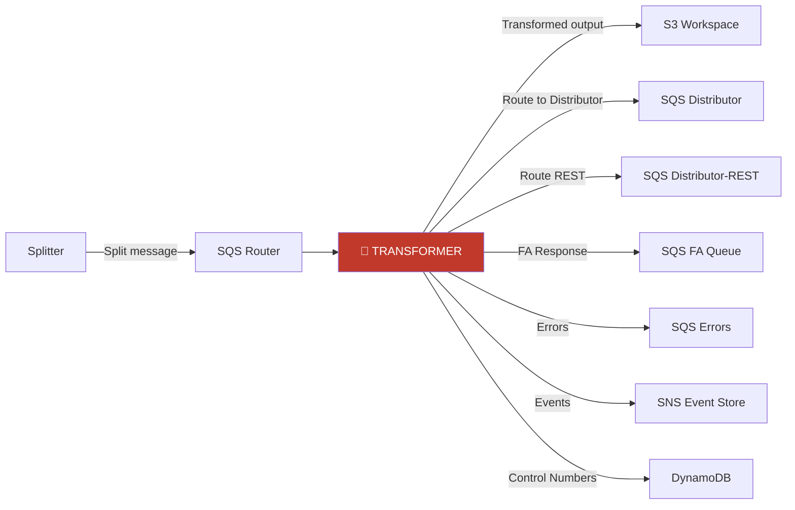
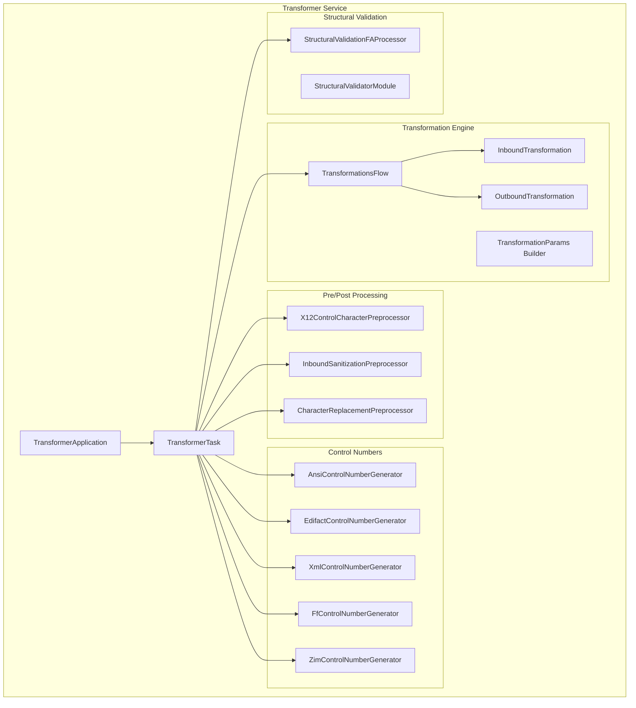
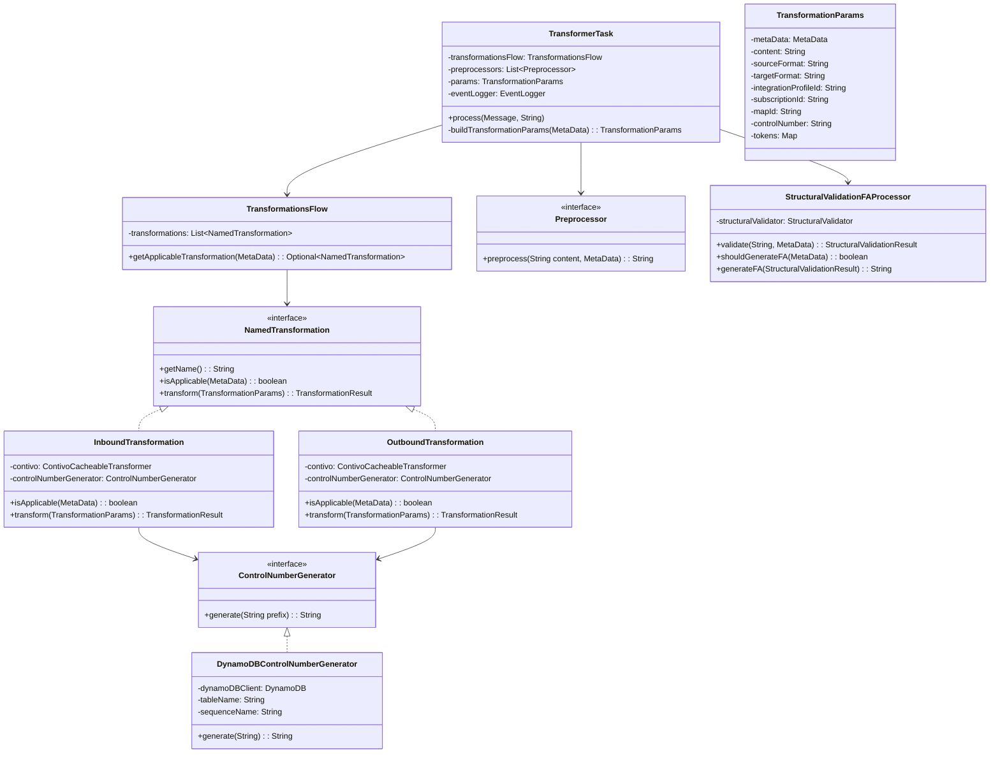
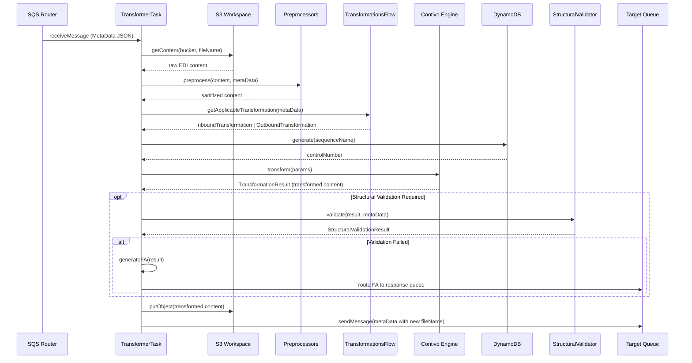
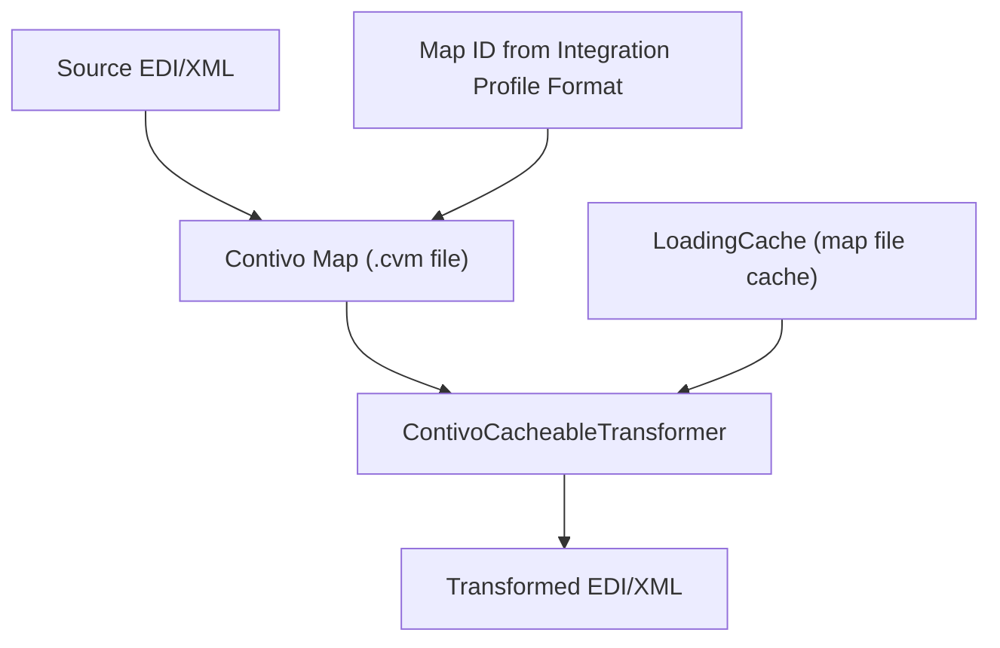
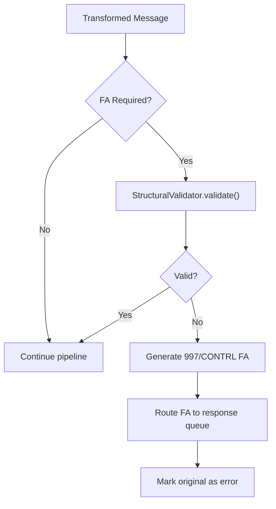

# Transformer Module — Design Document

> **Module:** `transformer`  
> **Generated:** 2026-05-24  
> **Artifact:** `com.inttra.mercury.transformer:transformer:1.0-SNAPSHOT`  
> **Java Version:** 17 | **Framework:** Dropwizard 4.x + Guice 7.x + Contivo 6.7.2

---

## 1. Executive Summary

The **Transformer** is the format conversion engine of AppianWay — the most complex module in the pipeline. It transforms EDI messages between formats (EDIFACT ↔ XML ↔ ANSI X12 ↔ Flat-File) using the Contivo mapping engine, generates control numbers via DynamoDB, applies pre/post-processing sanitization, performs structural validation, and can generate EDI Functional Acknowledgments (997/CONTRL).

---

## 2. Role in the Pipeline



---

## 3. High-Level Architecture



---

## 4. Class Diagram



---

## 5. Data Flow Diagram



---

## 6. Transformation Types

### Inbound vs Outbound

| Direction | Source | Target | Example |
|-----------|--------|--------|---------|
| **Inbound** | Partner EDI | INTTRA Canonical XML | EDIFACT IFTMBF → Booking XML |
| **Outbound** | INTTRA XML | Partner EDI | SI XML → EDIFACT IFTMIN |

### Contivo Engine Integration



---

## 7. Control Number Generators

| Generator | Format | DynamoDB Sequence | Output Example |
|-----------|--------|-------------------|----------------|
| `AnsiControlNumberGenerator` | X12 ISA/GS | `ansi-{prefix}` | `000000001` (9 digits) |
| `EdifactControlNumberGenerator` | EDIFACT UNB/UNG | `edifact-{prefix}` | `0000000001` (10 digits) |
| `XmlControlNumberGenerator` | XML documents | `xml-{prefix}` | `{sequence}` |
| `FfControlNumberGenerator` | Flat-file | `ff-{prefix}` | `{sequence}` |
| `ZimControlNumberGenerator` | ZIM carrier specific | `zim-{prefix}` | `{sequence}` |

**DynamoDB atomic increment:**
```
UpdateItem: SET sequence_value = sequence_value + 1
Table: {controlNumberTable}
Key: {sequenceName}
ReturnValues: UPDATED_NEW
```

---

## 8. Preprocessors

| Preprocessor | When Applied | Action |
|-------------|-------------|--------|
| `X12ControlCharacterPreprocessor` | ANSI X12 inbound | Strips/normalizes control chars (ISA delimiter fixup) |
| `InboundSanitizationPreprocessor` | All inbound | Character encoding normalization, BOM removal |
| `CharacterReplacementPreprocessor` | Configurable | Replaces characters per integration profile rules |

---

## 9. Structural Validation & Functional Acknowledgment



FA generation produces EDI acknowledgment messages (997 for X12, CONTRL for EDIFACT) sent back to the originating partner.

---

## 10. Configuration Details

| Property | Type | Default | Description |
|----------|------|---------|-------------|
| `componentName` | String | `transformer` | Service identity |
| `sqsPickupConfig.queueUrl` | String | — | Router queue |
| `sqsPickupConfig.maxNumberOfMessages` | int | `10` | Batch size |
| `sqsDropOffConfig.queueUrl` | String | — | Distributor queue |
| `sqsRestDropOffConfig.queueUrl` | String | — | REST distributor queue |
| `sqsErrorConfig.queueUrl` | String | — | Error subscription queue |
| `snsEventConfig.topicArn` | String | — | Event topic |
| `s3WorkspaceConfig.bucket` | String | — | Workspace bucket |
| `dynamoDBConfig.tableName` | String | — | Control number table |
| `dynamoDBConfig.region` | String | — | AWS region |
| `contivoConfig.mapDirectory` | String | — | .cvm map files path |
| `contivoConfig.cacheSize` | int | `100` | Map cache size |
| `contivoConfig.cacheExpiry` | int | `30` | Cache TTL (minutes) |
| `structuralValidation.enabled` | boolean | `true` | Enable/disable FA |
| `preprocessors` | List | 3 | Enabled preprocessor list |
| `networkServiceConfig.*` | Object | — | Format/IP endpoints |

---

## 11. Key Maven Dependencies

| Dependency | Version | Purpose |
|-----------|---------|---------|
| `mercury-shared` | 1.0 | Framework, S3, SQS |
| `structuralvalidator` | 1.0 | Structural validation |
| `schema-beans` | 1.0 | JAXB result types |
| Contivo dependencies (25+) | 6.7.2 | Transformation engine |
| `aws-java-sdk-dynamodb` | 1.12.720 | Control numbers |
| `dropwizard-core` | 4.0.16 | Application framework |
| `guice` | 7.0.0 | DI container |
| `guava` | 33.1.0-jre | Caching, utilities |

---

## 12. Error Handling

| Error Type | Behavior |
|-----------|----------|
| Map not found | Non-recoverable → Error queue |
| Contivo transformation failure | Non-recoverable → Error queue with details |
| DynamoDB timeout | Recoverable → Retry |
| S3 read/write failure | Recoverable → Retry |
| Structural validation failure | Generate FA + route to error |
| Invalid control character | Preprocessor normalizes (not an error) |

---

## 13. Design Patterns

| Pattern | Usage |
|---------|-------|
| **Strategy** | NamedTransformation implementations |
| **Chain** | Preprocessor pipeline |
| **Builder** | TransformationParams with 20+ fields |
| **Cache-Aside** | Contivo map caching (LoadingCache) |
| **Template Method** | Abstract control number base |
| **Factory** | ControlNumberGeneratorFactory selects by format |
