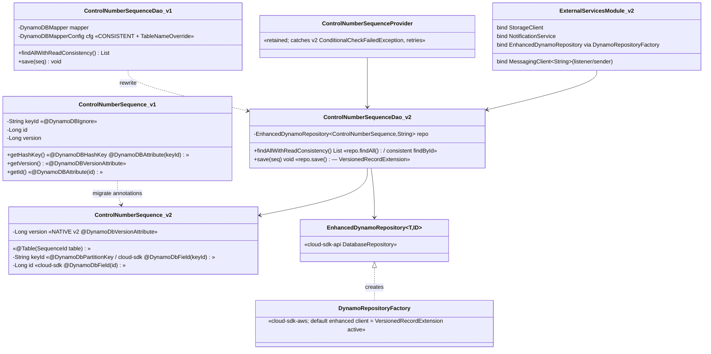
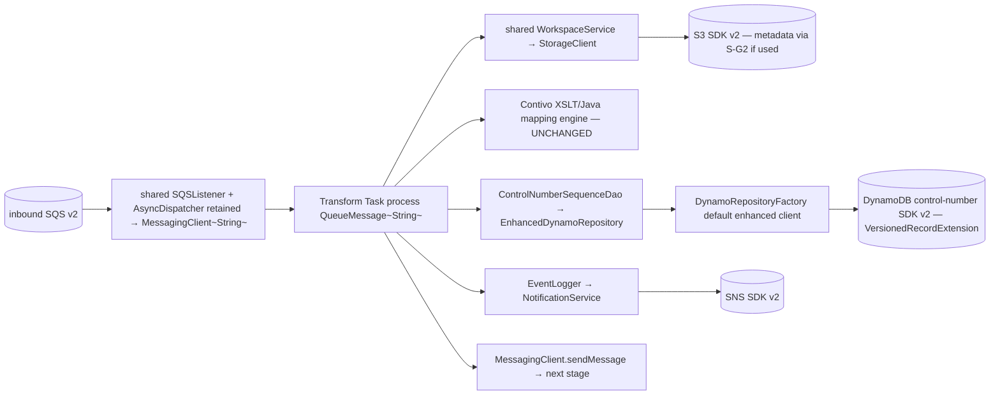

# `transformer` — AWS SDK v2 (cloud-sdk) Upgrade DESIGN (claude)

> Module: `com.inttra.mercury.appian-way:transformer:1.0` · Date: 2026-05-31 · Author: Claude (Opus 4.8)
> **Chosen option: B — adopt `commons` + `cloud-sdk-api`/`cloud-sdk-aws` (`1.0.26-SNAPSHOT`) on Dropwizard 5.** Option A (delegate-in-place) is the fallback and shares the identical DynamoDB design.
> Companion: [plan](2026-05-31-transformer-aws2x-upgrade-plan-claude.md). Master: [`shared` DESIGN](../../shared/docs/2026-05-31-shared-aws2x-upgrade-DESIGN-claude.md) §5 (config) / §6 (cloud-sdk specs). Governing rule: every cloud-sdk/commons change strictly **additive / behavior-preserving** (zero impact to mercury-services).

---

## 1. Overview & chosen option

transformer is a standard SQS+S3+SNS consumer plus a small DynamoDB control-number store driving the Contivo XSLT/Java mapping engine. Under Option B it (a) routes AWS access through cloud-sdk-api/aws via a rebound [`ExternalServicesModule`](../src/main/java/com/inttra/mercury/transformer/modules/ExternalServicesModule.java), (b) replaces `DynamoDBMapper` with a **cloud-sdk `EnhancedDynamoRepository`** entity, (c) inherits the retained `shared` `SQSListener`+`AsyncDispatcher` chain on `QueueMessage<String>`, and (d) leaves the **Contivo** engine/jars/mappings untouched (`com.contivo:commons` ≠ `mercury-services-commons:commons`).

**The one design decision that matters:** the DynamoDB optimistic lock is preserved with **NO cloud-sdk change** (de-scopes Copilot G4) — see §6.

---

## 2. Class diagram — control-number entity + bindings (before → after)



**Entity field mapping (verified against [`ControlNumberSequence.java`](../src/main/java/com/inttra/mercury/transformer/controlnumbers/sequence/ControlNumberSequence.java)):**

| Field | v1 | v2 (cloud-sdk entity) |
|---|---|---|
| `keyId` (String, constant `"SequenceId"`) | `@DynamoDBIgnore` field + `@DynamoDBHashKey @DynamoDBAttribute("keyId")` on `getHashKey()` | partition key via cloud-sdk-api `@Table`/`@DynamoDbField("keyId")` (cloud-sdk partition-key annotation) |
| `id` (Long counter) | `@DynamoDBAttribute("id")` | cloud-sdk-api `@DynamoDbField("id")` |
| `version` (Long optimistic lock) | `@DynamoDBVersionAttribute` | **NATIVE v2** `software.amazon.awssdk.enhanced.dynamodb.extensions.annotations.@DynamoDbVersionAttribute` |

> Mixing cloud-sdk-api attribute annotations with the **native** v2 version annotation is exactly the booking `SequenceId` pattern: the enhanced client's `VersionedRecordExtension` recognizes the native annotation regardless of which annotation labels the other fields.

---

## 3. Component diagram



---

## 4. Sequence diagram — control-number increment under optimistic lock

```mermaid
sequenceDiagram
    participant P as ControlNumberSequenceProvider (retained)
    participant DAO as ControlNumberSequenceDao (EnhancedDynamoRepository)
    participant R as EnhancedDynamoRepository
    participant DDB as DynamoDB (v2, VersionedRecordExtension)
    P->>DAO: findAllWithReadConsistency()  %% block exhausted
    DAO->>R: findAll() / findById("SequenceId", consistentRead=true)
    R->>DDB: Scan/GetItem (ConsistentRead=true)
    DDB-->>R: ControlNumberSequence{id, version=v}
    R-->>DAO: [seq]
    DAO-->>P: seq
    P->>P: seq.setId(id + INCREMENT_RANGE)
    P->>DAO: save(seq)
    DAO->>R: save(seq)
    R->>DDB: PutItem (ConditionExpression: version = v ; sets version = v+1)
    alt version matched
        DDB-->>R: OK
        R-->>P: success (retry=0)
    else concurrent writer won
        DDB-->>R: ConditionalCheckFailedException (v2)
        R-->>P: throws ConditionalCheckFailedException
        P->>P: retry++ (< MAX_RETRIES) → re-read & retry
    end
```

> Behavior is identical to today ([`ControlNumberSequenceProvider.java:56-68`](../src/main/java/com/inttra/mercury/transformer/controlnumbers/sequence/ControlNumberSequenceProvider.java)). Only the exception type changes from the v1 `com.amazonaws.services.dynamodbv2.model.ConditionalCheckFailedException` to the v2 `software.amazon.awssdk.services.dynamodb.model.ConditionalCheckFailedException` raised by `VersionedRecordExtension`; the catch/retry block is re-pointed to the v2 type.

---

## 5. Configuration composition

Reference master **DESIGN §5** (appianway composed config command over public commons transforms; credentials/region via v2 default providers). transformer-specific: `config.getDynamoDbSequenceTable()` ([Dao:23](../src/main/java/com/inttra/mercury/transformer/controlnumbers/sequence/ControlNumberSequenceDao.java)) feeds the table name into `DynamoRepositoryConfig` (replacing the v1 `DynamoDBMapperConfig.TableNameOverride`); the consistent-read flag becomes a `DynamoRepositoryConfig`/read option. Contivo config and `lib/maps` runtime classpath unchanged.

---

## 6. cloud-sdk gaps to implement (transformer)

### 6.1 DynamoDB optimistic lock — **NONE** (de-scopes Copilot G4)

**No cloud-sdk-api / cloud-sdk-aws change is required.** Rationale and approach:

1. **Default extensions already enable optimistic locking.** `DynamoRepositoryFactory` constructs `DynamoDbEnhancedClient.builder().dynamoDbClient(..).build()` — i.e. with the **default** extension list, which includes AWS SDK v2 `VersionedRecordExtension` (and `AtomicCounterExtension`). On every `save()`/`update()` the extension adds a `ConditionExpression` asserting the stored `version` and increments it — the precise semantics of the v1 `@DynamoDBVersionAttribute`.
2. **Use the native v2 version annotation.** Annotate `ControlNumberSequence.getVersion()` (or the `version` field) with `software.amazon.awssdk.enhanced.dynamodb.extensions.annotations.@DynamoDbVersionAttribute`. This is the **same** native annotation `mercury-services` booking `SequenceId` uses; it is recognized by the default enhanced client. There is **no need** to add a new `@DynamoDbVersionAttribute` to `cloud-sdk-api` (Copilot G4) — doing so would be redundant with the native annotation and the active extension.
3. **Entity annotations** for the non-version fields use cloud-sdk-api `@Table`/`@DynamoDbField` (partition key `keyId`, attribute `id`) — mixable with the native version annotation.
4. **Repository operations:**
   - v1 `findAllWithReadConsistency()` (`mapper.scan(...)` with CONSISTENT) → `EnhancedDynamoRepository.findAll()` (a `ScanEnhancedRequest`); because the partition key is the constant `"SequenceId"`, it may equivalently be a consistent `findById("SequenceId", consistentRead=true)`. Consistent reads are set via `DynamoRepositoryConfig`/read options, not a per-call mapper config.
   - v1 `save(seq)` → `EnhancedDynamoRepository.save(seq)` (optimistic locking via the default `VersionedRecordExtension`).
5. **Exception re-point:** catch the v2 `ConditionalCheckFailedException` in `ControlNumberSequenceProvider` instead of the v1 one; retry loop and `MAX_RETRIES` unchanged.

This keeps transformer a pure client of the existing cloud-sdk repository abstraction — provably zero impact on mercury-services (which relies on the identical extension/annotation behavior).

### 6.2 S3 metadata writes — reference master **S-G2** only

If transformer's transformed-output writes set user metadata/content-type, they use the master S-G2 `StorageClient` overloads (`putObject(bucket,key,bytes,metadata,contentType)`). No transformer-specific gap; spec in master DESIGN §6.1.

### 6.3 Everything else — no change

SQS/listener/SNS via the retained `shared` chain (master O-G1 kept local); config via composed commons transforms; health indicators re-pointed to injected cloud-sdk clients. No transformer-specific cloud-sdk change.

---

## 7. Maven dependency changes

Pin the cloud-sdk/commons line at **`1.0.26-SNAPSHOT`** (root `dependencyManagement`).

- **Remove from [`transformer/pom.xml`](../pom.xml):** `com.amazonaws:aws-java-sdk-sqs` (105–109), `com.amazonaws:aws-java-sdk-dynamodb` (110–114), `com.amazonaws:aws-java-sdk-cloudwatchmetrics` (100–104, after confirming usage — else migrate to v2 `software.amazon.awssdk:cloudwatch`), and the `aws-java-sdk-bom` import (45–51) once unreferenced. (transformer's pom does not declare `aws-java-sdk-s3`/`-sns`; S3/SNS arrive transitively via `shared`.)
- **Add:** `com.inttra.mercury:commons`, `:cloud-sdk-api`, `:cloud-sdk-aws` (all `1.0.26-SNAPSHOT`), and `:dynamo-integration-test` (test scope) for the control-number tests. AWS SDK v2 (`dynamodb-enhanced`, `sqs`, `s3`, `sns`, `apache-client`, Netty excluded) arrives transitively via `cloud-sdk-aws`.
- **Unchanged:** all `com.contivo:*` jars (166–319), the `contivo-lib` file repo (18–34), and the surefire `-Dcontivo.runtime.classpath=lib/maps` arg (377). transformer is **already on JUnit 5 Jupiter** (125–141) — no Vintage bridge needed.
- **Shading:** ensure `software.amazon.awssdk:*` + `apache-client` are included and no v1 classes / `META-INF/services` clashes remain alongside the Contivo jars; confirm DW5 `io.dropwizard.core.*` packaging.

---

## 8. Test details

- **New tests in JUnit 5 (Jupiter)** — already the local convention.
- **Control-number DynamoDB tests:** use **`dynamo-integration-test`** for:
  - optimistic-lock **version-conflict** (two writers; one gets `ConditionalCheckFailedException`, provider retries) — proves `VersionedRecordExtension` active via default enhanced client;
  - **consistent-read** equivalence for `findAll`/`findById`;
  - round-trip of `keyId`/`id`/`version` mapping;
  - block-allocation boundary (`INCREMENT_RANGE`) behavior of `ControlNumberSequenceProvider`.
- **Pipeline:** `functional-testing` fakes re-pointed to cloud-sdk-api interfaces (lockstep with `shared`).
- **Contivo mapping tests** unaffected. `Message`→`QueueMessage<String>` test doubles where the task is exercised.

---

## 9. Rollout & verification

1. Migrate `shared` + `functional-testing` first (master DESIGN §9).
2. Migrate transformer: rebind `ExternalServicesModule`; migrate `ControlNumberSequence`/`ControlNumberSequenceDao`; re-point the provider's exception catch; drop/migrate v1 deps.
3. Schedule the DynamoDB rewrite with/after the `watermill` Dynamo pilot to reuse `DynamoRepositoryFactory`/`dynamo-integration-test`.
4. `mvn -pl transformer -am verify` (after `shared`); validate control-number allocation under concurrency on local/real DynamoDB.

---

## 10. Risks & mitigations

| Risk | Mitigation |
|---|---|
| Optimistic-lock semantics drift → duplicate/bad control numbers | Use native v2 `@DynamoDbVersionAttribute` + default `VersionedRecordExtension` (no cloud-sdk change); `dynamo-integration-test` version-conflict tests; re-point retry to v2 `ConditionalCheckFailedException` |
| CONSISTENT read lost | Set consistent read in `DynamoRepositoryConfig`/read option; assert in integration test |
| Annotation-mix not recognized | Mirror booking `SequenceId` (native version annotation + cloud-sdk attribute annotations); round-trip test |
| Contivo + DW5 classpath/shade conflict | Keep Contivo jars/mappings out of scope; verify shade includes v2 + Contivo without `META-INF/services` clash |
| cloudwatchmetrics v1 still referenced | Confirm usage; drop or migrate to v2 cloudwatch |
| Any cloud-sdk change breaking mercury-services | None proposed for transformer (DynamoDB is non-gap; S-G2 is additive) — strongest possible guarantee |
