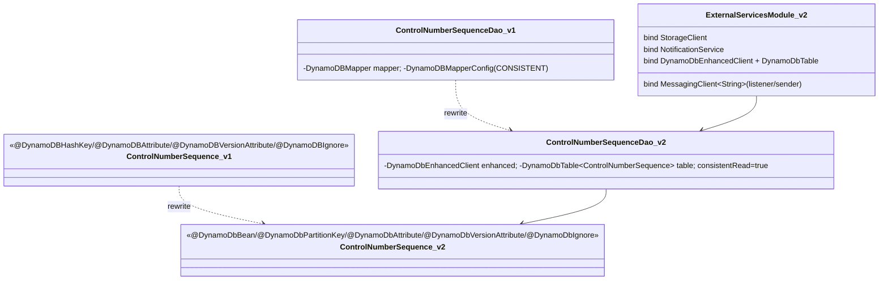
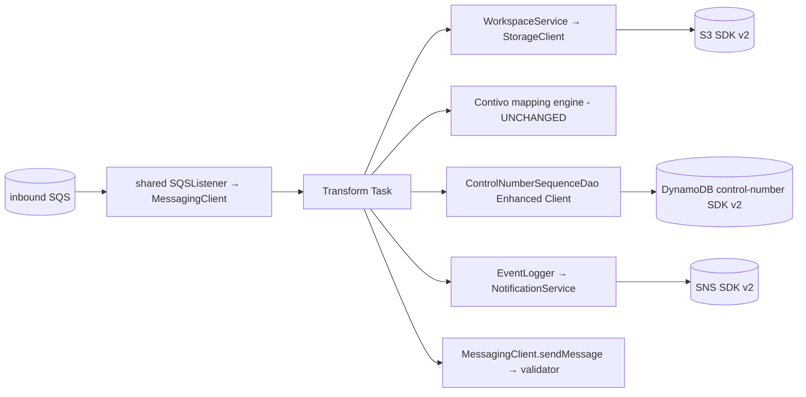
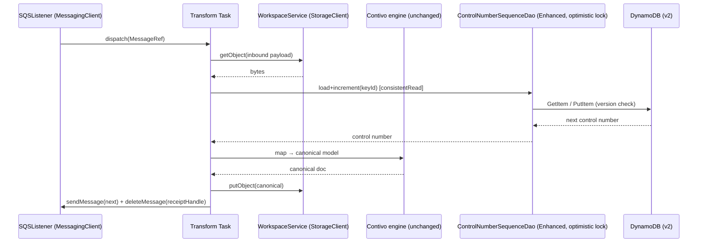

# `transformer` — AWS SDK v2 (cloud-sdk) Upgrade DESIGN

> **DIRECTIVE UPDATE (2026-05-31) — supersedes the Option-A recommendation in this document.** Per stakeholder direction the program now targets **Dropwizard 5** and **Option B — adopt `commons` + `cloud-sdk-api`/`cloud-sdk-aws`** as the directed default (recommend Option A only on a categorical technical blocker). All AWS service communication goes through `cloud-sdk-api`; new tests are written in **JUnit 5 (Jupiter)** (existing JUnit 4 runs via JUnit Vintage during transition); configuration follows the composed appianway `.properties`/`${PROFILE}`/`${ENV}` + commons `${awsps:...}` model in the master [shared plan §10](../../shared/docs/2026-05-31-shared-aws2x-upgrade-plan-copilot.md). cloud-sdk gaps are indexed in the master [shared plan §11](../../shared/docs/2026-05-31-shared-aws2x-upgrade-plan-copilot.md) with full technical specs in the master [shared DESIGN §1A.6](../../shared/docs/2026-05-31-shared-aws2x-upgrade-DESIGN.md).
> **Module-specific cloud-sdk gaps:** G1 (concurrent SQS listener), G2 (S3 putObject with metadata), **G4 (DynamoDB optimistic-lock/version attribute)** — `controlnumbers/sequence/ControlNumberSequence` uses v1 `@DynamoDBHashKey`/`@DynamoDBAttribute`/`@DynamoDBVersionAttribute`/`@DynamoDBIgnore` and `ControlNumberSequenceDao` uses `DynamoDBMapper` with `DynamoDBMapperConfig` CONSISTENT reads. Target: `DatabaseRepository<ControlNumberSequence, ...>` via `EnhancedDynamoRepository` with the `@DynamoDbVersionAttribute`-equivalent annotation + conditional-update-on-version + atomic `incrementAndGet` sequence helper specified in master DESIGN §1A.6 G4; reads use `findById(id, consistentRead=true)`. Also G6 (config), G7 (health checks). Contivo XSLT/Java mapping stays appianway-local.
> Sections below are retained as the Option-A fallback reference.

> Module: `transformer` · Date: 2026-05-31 · Author: GitHub Copilot (Claude Opus 4.8) · Option **A**
> Companion: [plan](2026-05-31-transformer-aws2x-upgrade-plan-copilot.md). Foundations: [`shared` DESIGN](../../shared/docs/2026-05-31-shared-aws2x-upgrade-DESIGN.md), [`watermill` DESIGN](../../watermill/docs/2026-05-31-watermill-aws2x-upgrade-DESIGN.md) (Dynamo v2 patterns). Session `83b822b011714117`.

## 1. Overview
Two parallel changes: (1) standard-consumer rebind of SQS/S3/SNS to `cloud-sdk-aws`; (2) DynamoDB `DynamoDBMapper` → v2 **Enhanced Client** for the control-number sequence store, preserving optimistic-lock (`@DynamoDbVersionAttribute`) and CONSISTENT-read semantics. Contivo mapping engine untouched. Dropwizard 4 / JUnit 4 retained.

## 2. Class diagram (DynamoDB + bindings before → after)

## 3. Component diagram

## 4. Sequence diagram (transform with control-number allocation)

## 5. Configuration changes
- SQS/S3/SNS per-role config maps to `cloud-sdk-aws` options via `shared`.
- DynamoDB: region/table config → v2 `DynamoDbClient`+`DynamoDbEnhancedClient`; CONSISTENT read preserved (`consistentRead(true)`).
- Contivo config/jars unchanged. `${PROFILE}`/`${ENV}` naming unchanged.

## 6. Maven dependency changes
- **Remove:** `aws-java-sdk-{sqs,s3,sns,dynamodb}` from `transformer/pom.xml`.
- **Add:** `cloud-sdk-api`, `cloud-sdk-aws`, `software.amazon.awssdk:dynamodb-enhanced` (if used directly), `dynamo-integration-test` (test).
- **Unchanged:** `com.contivo:commons` and `lib/`/`contivo-lib/` jars. Versions from root `dependencyManagement` (v2 BOM 2.30.24).

## 7. Test details
- **DynamoDB:** rewrite `ControlNumberSequenceDao`/VO tests on the Enhanced Client; add optimistic-lock **version-conflict** and **CONSISTENT-read** equivalence tests; serialization round-trip; adopt `dynamo-integration-test`.
- **Pipeline:** `functional-testing` fakes re-pointed to `cloud-sdk-api`.
- **Contivo mapping** tests unaffected. `Message`→`MessageRef` where referenced. JUnit 4 unit tests retained (flag if `dynamo-integration-test` requires Jupiter).

## 8. Rollout & verification
SQS/S3/SNS rebind after `shared` + `functional-testing`; Dynamo rewrite with/after the `watermill` pilot. `mvn -pl transformer -am verify`. Validate control-number allocation under concurrency against local/real DynamoDB.

## 9. Risks & mitigations
| Risk | Mitigation |
|---|---|
| Optimistic-lock semantics drift → bad control numbers | v2 `@DynamoDbVersionAttribute`; concurrency + version-conflict tests; `dynamo-integration-test` |
| CONSISTENT read lost | `consistentRead(true)`; assert |
| Annotation/converter gaps | Explicit v2 `@DynamoDbBean`; round-trip tests |
| Contivo engine disturbed | Out of scope; do not change jars/mappings |
| Override-config / `Message`→`MessageRef` drift | Centralize in `shared`; parity + functional tests |
