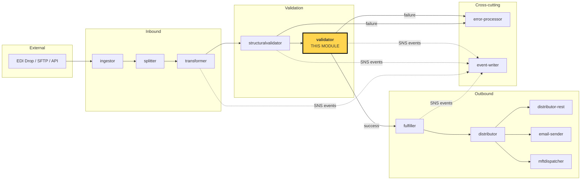
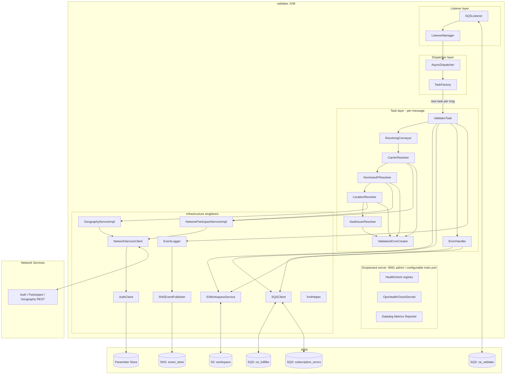
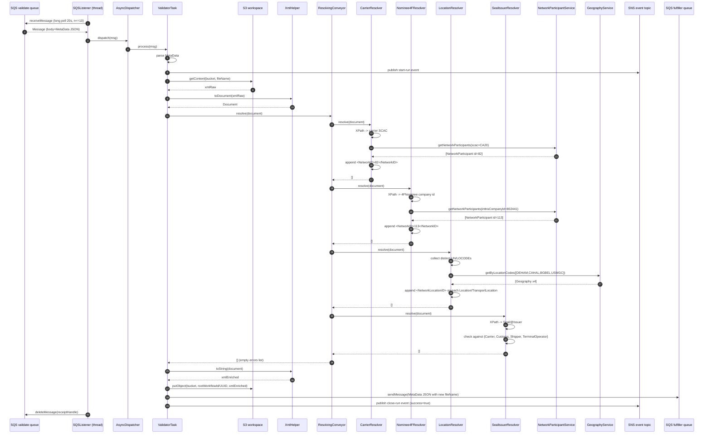
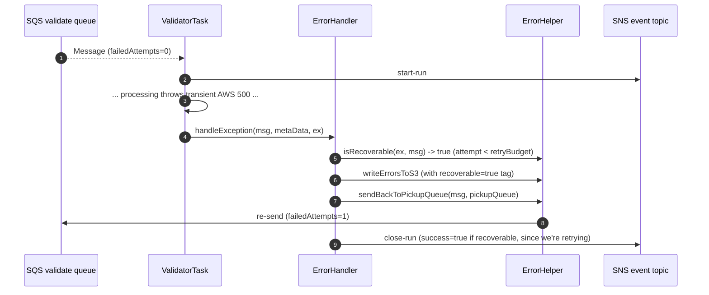
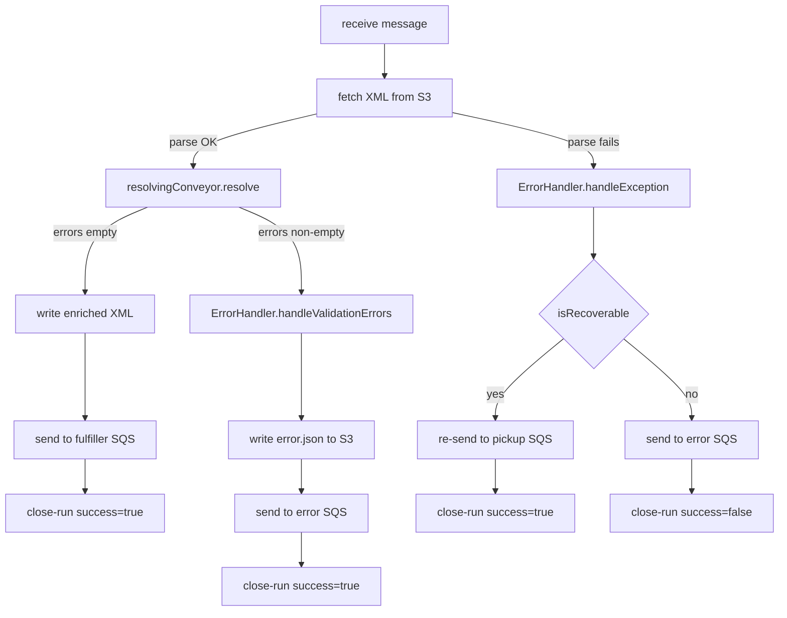
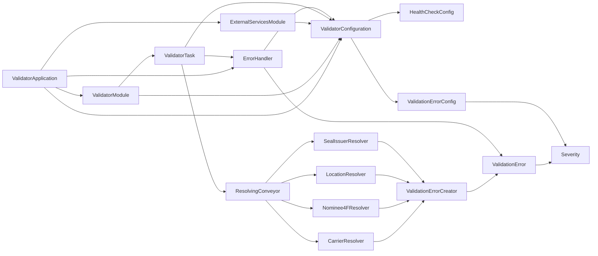

# Validator Module — Architecture & Design

> **Author:** Principal Engineering Review · **Date:** 2026-05-24 · **Module Version:** `1.0-SNAPSHOT` (see [`pom.xml`](../pom.xml#L9))

---

## Table of Contents

1. [Executive Summary](#1-executive-summary)
2. [Position in the Mercury Pipeline](#2-position-in-the-mercury-pipeline)
3. [High-Level Architecture](#3-high-level-architecture)
4. [Low-Level Design](#4-low-level-design)
5. [Key Classes — Class Diagram](#5-key-classes--class-diagram)
6. [Data Flow Diagram](#6-data-flow-diagram)
7. [Component Dependencies](#7-component-dependencies)
8. [Configuration & Validation](#8-configuration--validation)
9. [Maven Dependencies](#9-maven-dependencies)
10. [How the Module Works — Detailed Walkthrough](#10-how-the-module-works--detailed-walkthrough)
11. [Error Handling & Edge Cases](#11-error-handling--edge-cases)
12. [Operational Notes](#12-operational-notes)
13. [Open Questions / Risks](#13-open-questions--risks)

---

## 1. Executive Summary

### 1.1 Mandate of the Validator Module

The **validator** module — packaged as `com.inttra.mercury.validator:validator:1.0-SNAPSHOT`
([`pom.xml`](../pom.xml#L7-L11)) — is the **business-rule** (semantic) validation stage of
the Mercury / Appian Way container-event pipeline. It consumes the *canonical*
representation of a container event (already proven to be well-formed XML conforming to
its schema by the upstream `structuralvalidator`) and answers a fundamentally different
question:

> *"Are the **values** carried by this canonical message **meaningful** in the context
> of INTTRA's Network — do the participants exist, do the locations exist, are the
> enumerated values inside the controlled vocabulary?"*

That distinction — *structural* vs. *semantic* — is the central architectural seam in
Mercury and must be kept clean. The structural validator is concerned only with the
**shape** of a document (element order, cardinality, types, presence of mandatory
elements as defined by XSD/schema). The validator (this module) leaves the document
shape untouched and instead **dereferences identifiers** against the Network Services
REST API, **rejects forbidden enumerations**, and **enriches** the document by injecting
the resolved internal Network IDs back into the XML so that downstream subscribers
(fulfiller, distributor) can route the event without re-resolving the same data.

### 1.2 Concrete Responsibilities

The validator performs the following responsibilities, all on a single canonical
XML document:

1. **Carrier participant resolution.** Looks up the `Carrier` participant by its
   submitter-assigned SCAC code against the Network Participant service and rejects the
   message if no `NetworkParticipant` is found.
   See [`CarrierResolver`](../src/main/java/com/inttra/mercury/validator/task/resolver/CarrierResolver.java#L25).
2. **4F Nominee participant resolution.** Looks up the `4FNominee` participant by its
   `INTTRACompanyID` against the same service.
   See [`Nominee4FResolver`](../src/main/java/com/inttra/mercury/validator/task/resolver/Nominee4FResolver.java#L25).
3. **Geography resolution.** Resolves every `EventLocation` and every `TransportLocation`
   along all transportation legs against the Geography service, using the UN/LOCODE
   identifier as the lookup key.
   See [`LocationResolver`](../src/main/java/com/inttra/mercury/validator/task/resolver/LocationResolver.java#L31).
4. **Enumeration validation.** Validates that every `Seal/@Issuer` belongs to the
   controlled vocabulary `{Carrier, Customs, Shipper, TerminalOperator}`.
   See [`SealIssuerResolver`](../src/main/java/com/inttra/mercury/validator/task/resolver/SealIssuerResolver.java#L20).
5. **Enrichment.** For every successful resolution the validator **mutates** the
   document in-place, appending a synthetic `<NetworkID>` (for participants) or
   `<NetworkLocationID>` (for locations) child element next to the human-readable
   identifier. This is the only side-effect on the document content.
6. **Branching.** Routes the result to either the fulfiller queue (happy path) or the
   error subscription queue (validation failures), with full event audit trails on SNS.
   See [`ValidatorTask`](../src/main/java/com/inttra/mercury/validator/task/ValidatorTask.java#L82-L86).

### 1.3 Hard Distinction from `structuralvalidator`

| Dimension | `structuralvalidator` | `validator` (this module) |
|---|---|---|
| Question answered | Is the XML well-formed against the canonical schema? | Are the values inside the document meaningful in the INTTRA Network? |
| External calls | None — schema-driven | Network Services (Auth + Participant + Geography) |
| Document mutation | None — read-only | Yes — appends `<NetworkID>` / `<NetworkLocationID>` |
| Error class | Schema violations (missing element, type mismatch, cardinality) | Semantic violations (unknown SCAC, unknown UN/LOCODE, forbidden enum) |
| URN prefix | `/exception/ceValidator/structural/...` | `/exception/ceValidator/business/containerEvents/...` (see [`validator.yaml#L25-L40`](../conf/validator.yaml#L25-L40)) |
| Pipeline position | Before validator | After structuralvalidator, before fulfiller |
| Rule engine | XSD / schema validator | Custom Java `Resolver` chain (no Drools, no scripting) |

The two modules are deliberately separated because structural rules are stable
(schema-bound) whereas business rules are volatile (reference-data driven, partner-
specific) and require live HTTP roundtrips. Mixing them would couple the cost profile of
"reject this message because it's not well-formed XML" (microseconds, deterministic)
with "reject this message because we don't recognise this SCAC" (tens of milliseconds,
network-dependent, with retries and circuit breaking).

### 1.4 What This Document Is

This is a **principal-engineering-level design review** of the validator module as it
stands at commit `c1ff87b3` on the `develop` branch. It is intended as authoritative
internal documentation for:

* New engineers onboarding to Mercury and needing to understand how reference-data
  enrichment fits into the pipeline.
* SREs investigating production incidents and trying to map error URNs to root-cause
  resolvers.
* Architects considering modifying the rule set (adding a new resolver, swapping the
  rule engine, switching the cache, etc.).

The document deliberately does **not** describe the Network Services REST API itself
(those endpoints belong to a different team) nor the canonical XML schema (those belong
to the `canonical-beans` module).

---

## 2. Position in the Mercury Pipeline

### 2.1 End-to-End Container Event Flow

Mercury is a chain of stateless, single-purpose components linked by Amazon SQS queues
and an S3 workspace bucket. Each component picks a message from its inbound queue,
reads the referenced XML payload from S3 by `(bucket, fileName)`, performs its job,
writes the (possibly mutated) payload back to S3 under a fresh key, and sends a
`MetaData` message onto the next stage's queue. Every transition is wrapped in
start-run / close-run events broadcast to SNS for an immutable audit trail.



The validator sits at the **gateway between transformation and outbound delivery**.
Once a message passes the validator, every downstream component assumes its
content has been semantically vetted and is fit to be sent to the customer-facing
destination.

### 2.2 Concrete Queue Topology

The validator's queue plumbing is defined in
[`validator.properties`](../conf/validator.properties) (per environment) and surfaced
into the runtime configuration via [`validator.yaml`](../conf/validator.yaml#L3-L21):

| Direction | Logical name | Driven by | Environment example (`int`) |
|---|---|---|---|
| Inbound (pickup) | `validator.pickupSqsConfig.queueUrl` | `structuralvalidator` writes here on success | `inttra_int_sqs_ce_validate` ([`int/validator.properties#L2`](../conf/int/validator.properties#L2)) |
| Outbound — happy path | `validator.fulfillerSqsUrl` | Validator writes here on success | `inttra_int_sqs_ce_fulfiller` ([`int/validator.properties#L3`](../conf/int/validator.properties#L3)) |
| Outbound — error path | `validator.sqsErrorSubscriptionConfig.queueUrl` | Validator writes here on validation failure or non-recoverable exception | `inttra_int_sqs_subscription_errors` ([`int/validator.properties#L4`](../conf/int/validator.properties#L4)) |
| Audit | `validator.snsEventConfig.topicArn` | Validator publishes start-run + close-run events here on every message | `inttra_int_sns_event` ([`int/validator.properties#L5`](../conf/int/validator.properties#L5)) |

The inbound message is **never** persisted as the validator's primary product — only its
**enriched XML** plus a fresh `MetaData` envelope are persisted forward.

### 2.3 S3 Workspace Convention

All Mercury components share a single workspace bucket
(`validator.s3WorkspaceConfig.bucket` — e.g. `inttra-int-workspace` for `int`). Each
component reads from `{bucket, originalKey}` and writes to
`{bucket, rootWorkflowId + "/" + UUID}`. The validator follows this pattern exactly:

```java
// ValidatorTask.java:79-80
String enrichedFileName = rootWorkflowId + "/" + randomGenerator.randomUUID();
workspaceService.putObject(bucket, enrichedFileName, xmlEnriched);
```
([`ValidatorTask.java#L79-L80`](../src/main/java/com/inttra/mercury/validator/task/ValidatorTask.java#L79-L80))

The `rootWorkflowId` is a stable correlator chosen by the ingestor; every artefact
produced for a single inbound EDI document shares the same `rootWorkflowId` prefix in
S3. This makes diagnostics trivial: list-prefix on `rootWorkflowId/` returns the entire
audit trail (original payload, splitter outputs, transformer output, structural-validation
artefacts, validator-enriched XML, fulfiller dropoff, distributor outputs).

### 2.4 Why This Module Comes After the Transformer (Not Before)

A conscious sequencing decision: the canonical XML produced by the **transformer** is the
single representation everyone agrees on. Running business rules on raw EDIFACT or other
partner formats would require N partner-specific implementations of the same rule. By
deferring semantic validation until after transformation, the validator only ever needs
to know one input format — the canonical schema — and one set of XPath expressions
becomes sufficient for the entire ecosystem.

### 2.5 Why This Module Comes After structuralvalidator (Not Before)

If the validator received a malformed canonical document, its XPath expressions would
throw `XmlParserException` ([see usage in `CarrierResolver.java#L83`](../src/main/java/com/inttra/mercury/validator/task/resolver/CarrierResolver.java#L83-L84)),
and the message would be diverted to the error-processor with a misleading systemException
code instead of the more diagnostic structural-violation code. Putting structural
validation upstream guarantees the validator can presume well-formedness and treat any
runtime parse failure as a genuine system fault.

---

## 3. High-Level Architecture

### 3.1 Runtime Topology

The validator is a single Docker container ([`Dockerfile`](../Dockerfile)) running a
Dropwizard 1.1.1 application. Inside the container, the topology is:



### 3.2 Three Layers of Behaviour

The validator decomposes cleanly into three orthogonal layers:

* **Transport layer** — polling an SQS queue, parsing AWS message envelopes, fetching
  S3 payloads. Owned entirely by `mercury-shared` (`SQSListener`, `S3WorkspaceService`,
  `XmlHelper`). The validator brings zero transport code.
* **Orchestration layer** — `ValidatorTask` (lifecycle of a single message), and
  `ResolvingConveyor` (sequencing of resolvers). These are the two classes in the module
  that "know" they are inside the validator. Both are owned by this module.
* **Rule layer** — the four `Resolver` implementations (`CarrierResolver`,
  `Nominee4FResolver`, `LocationResolver`, `SealIssuerResolver`). Each is a small,
  self-contained Java class encoding one business rule plus its enrichment behaviour.
  This is where new validation rules should be added.

### 3.3 Concurrency Model

The validator uses Mercury's standard **listener / dispatcher / task** pattern:

* A single `SQSListener` long-polls the inbound queue with `waitTimeSeconds` (default 20s,
  [`validator.yaml#L5`](../conf/validator.yaml#L5)).
* On each poll it receives up to `maxNumberOfMessages` (default 10,
  [`validator.yaml#L6`](../conf/validator.yaml#L6)) and hands each one to an
  `AsyncDispatcher`.
* The `AsyncDispatcher` is constructed in
  [`ValidatorModule.java#L49`](../src/main/java/com/inttra/mercury/validator/modules/ValidatorModule.java#L49)
  with a thread-pool sized to `maxNumberOfMessages`. Each message becomes a `Runnable`
  that runs a freshly-injected `ValidatorTask` instance.
* `ValidatorTask` is **not** singleton — the `TaskFactory` calls `taskProvider.get()` per
  message ([`ValidatorModule.java#L46-L47`](../src/main/java/com/inttra/mercury/validator/modules/ValidatorModule.java#L46-L47)).
  This is critical because `ValidatorTask` shares state with non-thread-safe `Resolver`
  instances (see §4.4) — Guice constructs a fresh dependency tree for each task.

This gives a high-throughput, share-nothing concurrency model: the listener thread
is never blocked on validation work; the dispatcher absorbs bursts up to its bounded
queue; downstream Network Services calls are independent across tasks.

### 3.4 Statelessness & Idempotency

Each `ValidatorTask` is **stateless across messages**. The only side-effects are:

1. A new S3 object created at `{bucket}/{rootWorkflowId}/{UUID}` (idempotent against
   replay because the UUID is fresh per execution).
2. A new SQS message on the fulfiller or error queue.
3. SNS start-run and close-run events.

Re-delivering the same SQS message (because the receipt handle wasn't deleted in time)
produces a new UUID-suffixed S3 artefact and a new run-event pair, but no destructive
mutation of any existing object. This makes at-least-once delivery semantics
operationally safe.

---

## 4. Low-Level Design

### 4.1 The Three Building Blocks

At its core, the validator is a composition of three abstractions:

```
ValidatorTask  -- orchestrates the lifecycle of one SQS message
   |
   +-- ResolvingConveyor  -- runs a sequence of rule evaluators against one Document
            |
            +-- Resolver[]  -- one functional interface per business rule
```

### 4.2 `Resolver` — The Rule Abstraction

The contract is a single-method `@FunctionalInterface`:

```java
// Resolver.java:9-12
@FunctionalInterface
public interface Resolver {
    List<ValidationError> resolve(Document document);
}
```
([`Resolver.java`](../src/main/java/com/inttra/mercury/validator/task/resolver/Resolver.java))

A resolver is permitted to:

* Read fields from the document via compiled XPath expressions.
* Make external service calls (Network Participant or Geography).
* **Mutate the document by appending child nodes** (this is its enrichment side).
* Emit zero or more `ValidationError` instances.

A resolver must **not**:

* Remove or rename existing nodes.
* Throw on a *business* failure — that is the role of `ValidationError`.
* Cache state across invocations (instances are NOT shared across tasks; see §4.4).

The single-method nature makes resolvers naturally lambda-able, but in practice each
existing resolver is a full class because it owns precompiled XPath expressions and an
injected service dependency. Compiled `XPathExpression` instances are constructed in the
constructor and reused across `resolve()` calls — this is a measurable hot-path
optimisation, as XPath compilation under `javax.xml.xpath` is heavy.

### 4.3 `ResolvingConveyor` — The Rule Pipeline

[`ResolvingConveyor`](../src/main/java/com/inttra/mercury/validator/task/ResolvingConveyor.java)
is a fixed-order chain of the four resolvers, hand-wired in the constructor:

```java
// ResolvingConveyor.java:23-29
@Inject
public ResolvingConveyor(CarrierResolver carrierResolver,
                         Nominee4FResolver nominee4FResolver,
                         LocationResolver locationResolver,
                         SealIssuerResolver sealResolver) {
    resolvers = ImmutableList.of(carrierResolver, nominee4FResolver, locationResolver, sealResolver);
}
```
([`ResolvingConveyor.java#L23-L29`](../src/main/java/com/inttra/mercury/validator/task/ResolvingConveyor.java#L23-L29))

The conveyor's algorithm is small but carries important semantics:

```java
// ResolvingConveyor.java:42-58
public List<ValidationError> resolve(Document document) {
    List<ValidationError> validationResult = new ArrayList<>();
    for (Resolver resolver : resolvers) {
        List<ValidationError> errors = resolver.resolve(document);
        boolean shouldStop = errors.stream().anyMatch(ValidationError::isStopFlag);
        validationResult.addAll(errors);
        if (shouldStop) {
            break;
        }
    }
    return validationResult;
}
```
([`ResolvingConveyor.java#L42-L58`](../src/main/java/com/inttra/mercury/validator/task/ResolvingConveyor.java#L42-L58))

Three points worth noting:

1. **Accumulating semantics.** Errors from all resolvers are collected, not just the
   first. This is intentional: customers / EDI desks prefer to see *all* problems in one
   report rather than fix them one round-trip at a time.
2. **stopFlag opt-out.** Any `ValidationError` may declare `stopFlag = true`. If a rule
   marks its error as a hard stop, the conveyor short-circuits — subsequent resolvers
   are not run. Currently, the YAML configures `stopFlag: false` for all three known
   error types ([`validator.yaml#L28,33,40`](../conf/validator.yaml#L28-L40)), so in
   practice every message executes every resolver. The mechanism exists for future
   "blocking" rules.
3. **No parallelisation.** Resolvers are run sequentially on the same `Document`
   instance. This matters because some resolvers *mutate* the document, and the DOM is
   not thread-safe. (A future refactor could parallelise the lookup phase while keeping
   the mutation phase sequential — see §13.)

### 4.4 Rule Registry — Why Static & Constructor-Wired?

Rule registration is **not data-driven**. There is no `rules.yaml` file declaring which
rules to load. The conveyor's constructor enumerates the four resolvers explicitly. This
choice is deliberate:

* The rule set is small (currently 4) and changes rarely.
* Every rule has different external dependencies (different REST services, different
  identifier types, different parent elements in the document), so they can't share a
  uniform schema even if registered dynamically.
* Compile-time wiring catches resolver misconfiguration at startup, not in production
  on the first message of a partner.

The trade-off is that adding a new rule requires (a) a new `Resolver` implementation
class, (b) one line added to the `ResolvingConveyor` constructor, and (c) a new key in
`validationErrorsConfig` ([`validator.yaml#L23`](../conf/validator.yaml#L23)). This is
acceptable for a four-rule system; if the rule set grew significantly, see §13 for a
sketch of a registry-based design.

### 4.5 Reference-Data "Cache"

The validator does **not** maintain its own reference-data cache. Each `Resolver` calls
the relevant Network Service directly per-message:

* `CarrierResolver` → `NetworkParticipantService#getNetworkParticipants(scacCode=...)`
* `Nominee4FResolver` → `NetworkParticipantService#getNetworkParticipants(inttraCompanyId=...)`
* `LocationResolver` → `GeographyService#getByLocationCodes(List<String>)` — note the
  batched API, which **deduplicates** UN/LOCODEs first
  ([`LocationResolver.java#L109-L111`](../src/main/java/com/inttra/mercury/validator/task/resolver/LocationResolver.java#L109-L111))
  to make a single HTTP call regardless of how many transport legs share a code.

Caching is performed **upstream** by the shared library:

* `mercury-shared` provides decorator classes such as `CacheFormatService`,
  `CacheSubscriptionServiceImpl`, `CacheIntegrationProfileByIdService` etc. These wrap the
  underlying REST clients with a guava cache. The validator's wiring
  ([`ExternalServicesModule.java#L50-L51`](../src/main/java/com/inttra/mercury/validator/modules/ExternalServicesModule.java#L50-L51))
  binds the *uncached* `GeographyServiceImpl` and `NetworkParticipantServiceImpl`. So
  the validator deliberately opts out of caching: every message triggers fresh HTTP
  calls to Network Services.
* This is appropriate because (a) the underlying `NetworkServiceClient` is itself
  wrapped in a Hystrix circuit and a retryer (`NetworkServiceRetryerBuilder`), and
  (b) the cardinality of unique SCACs and UN/LOCODEs per second is low enough that the
  Network Services tier is the right place to cache, not each validator instance.

The Datadog metrics config ([`validator.yaml#L75`](../conf/validator.yaml#L75-L80))
includes `.*cache.*` patterns nonetheless, in case caching is reintroduced.

### 4.6 Validation Result Model — `ValidationError`

The single result type is [`ValidationError`](../src/main/java/com/inttra/mercury/validator/task/resolver/validation/ValidationError.java):

```java
// ValidationError.java:13-26
@Builder
@Getter
@RequiredArgsConstructor
public class ValidationError {
    private final boolean stopFlag;
    private final Severity severity;
    private final String urn;
    private final String messageTemplate;
    @Singular
    private final Map<String, String> values;
}
```

Notable design choices:

* **Immutable**. All fields are `final`; the builder gives a fluent API.
* **No "is-this-an-error" boolean**. Severity is `Error` or `Warning`
  ([`Severity.java`](../src/main/java/com/inttra/mercury/validator/task/resolver/validation/Severity.java)).
  Yet `ResolvingConveyor` does not differentiate them — any element of the returned list
  causes `ValidatorTask` to route to the error queue (see §6, [`ValidatorTask.java#L76`](../src/main/java/com/inttra/mercury/validator/task/ValidatorTask.java#L76)).
  This means in the current code path, `Severity.Warning` would still cause hard
  rejection. The `Severity` field is currently only used to *tag* the annotation in S3 —
  the YAML configures all three error types as `severity: Error`.
  See §13 for whether `Warning` is dead code.
* **Templated message**. `messageTemplate` carries the human-readable template (e.g.
  `"Participant Identifier {identifierType},{value} for {tag} is invalid."`) and
  `values` provides substitutions. Interpolation happens late in `ErrorHandler#createErrorAnnotations`
  via `StrSubstitutor` ([`ErrorHandler.java#L75-L80`](../src/main/java/com/inttra/mercury/validator/task/ErrorHandler.java#L75-L80)).
* **URN**. Every error carries a URN such as `/exception/ceValidator/business/containerEvents/invalidParticipantIdentity`.
  Error-processor and downstream tooling key off this URN for routing, retry policy,
  and partner-facing translation.
* **stopFlag**. As discussed above, halts the conveyor.

### 4.7 Validation Result Construction — `ValidationErrorCreator`

The conversion from a resolver's runtime context (string substitutions + error type)
into a `ValidationError` is centralised in
[`ValidationErrorCreator`](../src/main/java/com/inttra/mercury/validator/task/resolver/validation/ValidationErrorCreator.java):

```java
// ValidationErrorCreator.java:22-34
public ValidationError createError(String errorType, Map<String, String> values) {
    ValidationErrorConfig validationErrorConfig = validationErrorsConfig.get(errorType);

    ValidationError.ValidationErrorBuilder builder = ValidationError.builder()
            .messageTemplate(validationErrorConfig.getDescription())
            .urn(validationErrorConfig.getUrn())
            .severity(validationErrorConfig.getSeverity())
            .stopFlag(validationErrorConfig.isStopFlag());

    values.forEach(builder::value);

    return builder.build();
}
```

The creator looks up its config map (`@Named("VALIDATION_ERRORS_CONFIG")`) which is
populated from
[`ValidatorConfiguration#validationErrorsConfig`](../src/main/java/com/inttra/mercury/validator/config/ValidatorConfiguration.java#L48-L50)
which in turn is bound from
[`validator.yaml#L23-L40`](../conf/validator.yaml#L23-L40). This means **error
metadata is purely declarative**: URN, message template, severity, and stopFlag can be
tuned per environment by editing YAML, with no code change.

Resolvers reference errors by string keys (`"invalidParticipantIdentity"`,
`"invalidLocationIdentity"`, `"invalidSealIssuer"`). If a resolver references a key
not present in the YAML, `ValidationErrorCreator` will throw `NullPointerException`
on `validationErrorConfig.getDescription()` — see §13 for a hardening risk.

### 4.8 Enrichment Semantics

The validator's secondary product (after the pass/fail signal) is an **enriched**
document. Three resolvers perform enrichment:

| Resolver | Source identifier in document | Resolved value | Injected element |
|---|---|---|---|
| `CarrierResolver` | `Participant/Identifier[@identifierType="AssignedBySubmitter"]` (SCAC) | `NetworkParticipant.id` (Integer) | `<NetworkID>` appended to the carrier `<Participant>` |
| `Nominee4FResolver` | `Participant/Identifier[@identifierType="INTTRACompanyID"]` | `NetworkParticipant.id` (Integer) | `<NetworkID>` appended to the 4F nominee `<Participant>` |
| `LocationResolver` | `Location/Identifier[@IdentifierType="UNLOCODE"]` and `TransportLocation/Identifier[@IdentifierType="UNLOCODE"]` | `Geography.locationId` (Integer) | `<NetworkLocationID>` appended to each `<Location>` / `<TransportLocation>` |
| `SealIssuerResolver` | `Seal/@Issuer` | — | None (pure validation) |

For example, a happy-path resolution produces an XML diff like:

```xml
<!-- before -->
<Participant>
    <Function>Carrier</Function>
    <Identifier identifierType="AssignedBySubmitter">CA20</Identifier>
</Participant>

<!-- after -->
<Participant>
    <Function>Carrier</Function>
    <Identifier identifierType="AssignedBySubmitter">CA20</Identifier>
    <NetworkID>82</NetworkID>
</Participant>
```

See [`happy/ceEvent.xml#L22-L25`](../src/test/resources-functional/happy/ceEvent.xml#L22-L25)
vs [`happy/ceEventEnriched.xml#L22-L27`](../src/test/resources-functional/happy/ceEventEnriched.xml#L22-L27)
for the full functional-test fixture pair.

This enrichment is the entire reason the validator persists a new XML artefact to S3
even on success — without enrichment the validator could simply forward the original
`(bucket, fileName)` to the fulfiller queue. Downstream components (fulfiller,
distributor) consume the `<NetworkID>` and `<NetworkLocationID>` values directly,
avoiding redundant Network Services calls.

### 4.9 Document Mutation Strategy

Enrichment is performed by direct DOM mutation. The relevant pattern, repeated across
all three enriching resolvers, is:

```java
// CarrierResolver.java:62-65
if (optionalNetworkId.isPresent()) {
    Integer networkId = optionalNetworkId.get();
    carrierNode.appendChild(createNetworkIdNode(document, String.valueOf(networkId)));
}
```

* `Document#createElement(...)` creates a node in the same DOM context.
* `Node#appendChild(...)` inserts the new element as the last child.
* No XPath update or pretty-printing is performed — the resulting XML is serialised
  via [`XmlHelper.toString(document)`](../../shared/src/main/java/com/inttra/mercury/shared/xml/XmlHelper.java)
  in the parent task ([`ValidatorTask.java#L77`](../src/main/java/com/inttra/mercury/validator/task/ValidatorTask.java#L77)).

Because DOM operations are sequential within a single `ValidatorTask`, no
synchronisation is needed. Across tasks, each task gets its own `Document` instance
parsed from S3.

### 4.10 XPath Strategy

Every resolver compiles its XPath expressions **once** in its constructor:

```java
// CarrierResolver.java:42-51
@Inject
public CarrierResolver(...) throws XPathExpressionException {
    ...
    this.carrierParticipantExpression = xmlHelper.compileXPath(CARRIER_PARTICIPANT_XPATH);
    this.carrierScacExpression = xmlHelper.compileXPath(CARRIER_SCAC_XPATH);
}
```

Note the `throws XPathExpressionException` on the constructor — if any XPath in the
codebase is malformed, the validator fails to bootstrap, which is the correct
fail-fast behaviour for static compile-time-style errors.

The XPath dialect is the standard `javax.xml.xpath` (XPath 1.0). Patterns used:

* `text()` extraction (`Identifier[@identifierType="..."]/text()`).
* `parent::` axis to walk from an attribute to its containing element
  (`//Participants/Participant/Function[text()="Carrier"]/parent::Participant`).
* `@Issuer` attribute selection from `Seal` nodes
  (`//CanonicalContainerEvent/Container/Seals/Seal/@Issuer`).

**Inconsistency:** the location resolvers reference `@IdentifierType` (capital `I`)
while the participant resolvers reference `@identifierType` (lowercase `i`). This
mirrors what the canonical schema produces — see the functional fixture
[`happy/ceEvent.xml`](../src/test/resources-functional/happy/ceEvent.xml#L15) (capital I
on Location) vs L24 (lowercase i on Participant). It is *not* a bug in the validator
but an inherited inconsistency from upstream EDI mapping.

### 4.11 Resolvers in Detail

#### 4.11.1 `CarrierResolver`

* **XPath roots**:
  * Carrier participant — `//Participants/Participant/Function[text()="Carrier"]/parent::Participant`
  * SCAC code — `Identifier[@identifierType="AssignedBySubmitter"]/text()` (relative to carrier node)
* **Query**: `NetworkParticipantQuery.builder().scacCode(carrierScac).build()`
* **Success behaviour**: `<NetworkID>{id}</NetworkID>` appended to the carrier participant.
* **Failure behaviour**: emits a `ValidationError` keyed `"invalidParticipantIdentity"`
  with values `{identifierType, tag, value}`.
* **Singularity assumption**: assumes a single `Carrier` participant. If more than one
  exists, `XPathConstants.NODE` returns the first matching node only — additional
  carrier participants are silently ignored.
* **Empty-result behaviour**: if `getNetworkParticipants` returns an empty list, a
  `ValidationError` is added.
* **Multi-match behaviour**: if `getNetworkParticipants` returns multiple, the resolver
  picks the first (`.get(0)`). This is documented by behaviour, not by API contract.

See [`CarrierResolver.java`](../src/main/java/com/inttra/mercury/validator/task/resolver/CarrierResolver.java).

#### 4.11.2 `Nominee4FResolver`

Structurally identical to `CarrierResolver`, differing only in the identifier type
and function:

* `IDENTIFIER_TYPE = "INTTRACompanyID"`
* `FUNCTION_TYPE = "4FNominee"`
* Query method: `NetworkParticipantQuery.builder().inttraCompanyId(companyId).build()`

The duplication between `CarrierResolver` and `Nominee4FResolver` is real and visible;
their `resolve()` bodies differ only in two strings and the query builder method. A
refactor (e.g. a `ParticipantResolver<Query>` base class) would be straightforward and
is noted in §13.

See [`Nominee4FResolver.java`](../src/main/java/com/inttra/mercury/validator/task/resolver/Nominee4FResolver.java).

#### 4.11.3 `LocationResolver`

This is the most sophisticated resolver:

* It walks both `EventProperties/Location` (singular) **and** every
  `Transportation/Leg/TransportLocation` (potentially many) — see
  [`LocationResolver.java#L37-L38`](../src/main/java/com/inttra/mercury/validator/task/resolver/LocationResolver.java#L37-L38).
* It collects all UN/LOCODE values, **deduplicates** them, and makes a single batched
  call: `geographyService.getByLocationCodes(distinctCodes)`. This is meaningfully
  cheaper than one call per location for messages with many legs.
  See [`LocationResolver.java#L113-L116`](../src/main/java/com/inttra/mercury/validator/task/resolver/LocationResolver.java#L113-L116).
* The response is keyed by `Geography::getUnLocode` into a `Map<String, Integer>` of
  `unlocode -> locationId`.
* It then iterates back over every original location node (including duplicates) and
  either enriches it with `<NetworkLocationID>` or emits an error.
* **Failure tagging**: for an event location, the error's `tag` value is
  `"EventLocation"`; for transport locations the resolver attempts to suffix the
  `Function` element (`PortOfLoad`, `PortOfDischarge`, etc.) — `"TransportLocation/PortOfLoad"`.
  If extracting the function fails, the tag falls back to plain `"TransportLocation"`
  ([`LocationResolver.java#L98-L107`](../src/main/java/com/inttra/mercury/validator/task/resolver/LocationResolver.java#L98-L107)).

This batched + multi-element handling pattern is unique to the location resolver
because the canonical document has many-cardinality location elements; the participant
resolvers are simpler because the schema permits exactly one carrier and one 4F
nominee per event.

See [`LocationResolver.java`](../src/main/java/com/inttra/mercury/validator/task/resolver/LocationResolver.java).

#### 4.11.4 `SealIssuerResolver`

The simplest resolver — pure enumeration validation, no external service call, no
enrichment:

```java
// SealIssuerResolver.java:23
private static final ImmutableList<String> VALID_VALUES =
    ImmutableList.of("Carrier", "Customs", "Shipper", "TerminalOperator");
```

For every `Seal/@Issuer` attribute that is not in `VALID_VALUES`, emit a
`ValidationError` keyed `"invalidSealIssuer"`. Note that valid values are **hard-coded**
in Java rather than configured in YAML — this is a tension worth noting (§13). The
rationale: changing the controlled vocabulary would also require schema and downstream
changes, so a config-only override would be misleading.

See [`SealIssuerResolver.java`](../src/main/java/com/inttra/mercury/validator/task/resolver/SealIssuerResolver.java).

### 4.12 Task — `ValidatorTask` Lifecycle

[`ValidatorTask`](../src/main/java/com/inttra/mercury/validator/task/ValidatorTask.java)
extends `AbstractTask` from `mercury-shared` and implements `process(Message, SQSClient, String)`.
Its method body is the canonical Mercury task pattern:

```java
// ValidatorTask.java:60-92
@Override
public void process(Message message, SQSClient amazonSQS, String queueUrl) {
    final MetaData metaData = Json.fromJsonString(message.getBody(), MetaData.class);
    final Event startRunEvent = publishStartRunEvent(message, metaData, queueUrl);
    final String runId = startRunEvent.getRunId();

    String rootWorkflowId = metaData.getRootWorkflowId();
    String bucket = metaData.getBucket();
    String fileName = metaData.getFileName();

    try {
        String xmlRaw = workspaceService.getContent(bucket, fileName);
        Document document = xmlHelper.toDocument(xmlRaw);

        List<ValidationError> errors = resolvingConveyor.resolve(document);

        if (isEmpty(errors)) {
            String xmlEnriched = xmlHelper.toString(document);
            String enrichedFileName = rootWorkflowId + "/" + randomGenerator.randomUUID();
            workspaceService.putObject(bucket, enrichedFileName, xmlEnriched);
            MetaData metaDataUpdated = updateMetaData(metaData, enrichedFileName);
            sqsClient.sendMessage(configuration.getFulfillerSqsUrl(), metaDataUpdated.toJsonString());
            publishCloseRunEvent(configuration.getFulfillerSqsUrl(), metaDataUpdated, startRunEvent, runId, true);
        } else {
            log.error("Incoming message didn't pass validation. Sending to error queue");
            errorHandler.handleValidationErrors(metaData, errors, startRunEvent, runId);
        }
    } catch (Exception e) {
        log.error("Unable to process incoming message", e);
        errorHandler.handleException(message, metaData, e, startRunEvent, runId);
    }
}
```

Key invariants:

* `publishStartRunEvent` happens **before** any work — even before payload fetch — so
  that an audit trail exists if S3 is unreachable.
* The whole body is wrapped in a single `try ... catch (Exception)`. Any throwable from
  `getContent`, `toDocument`, the conveyor, `putObject`, or `sendMessage` is caught and
  delegated to `ErrorHandler.handleException`. This is the validator's general
  "system-failure" path, distinct from the validation-failure path.
* `runId` is generated once at the start and reused for both start-run and close-run
  events to support correlated logging.

The choice to handle exceptions at the very outer layer (rather than per-resolver) is
deliberate: resolvers raise `XmlParserException` (a runtime exception) for malformed XML
contexts, which is treated as a system fault — the same way an unreachable network service
or S3 outage would be. The conveyor itself does not catch these — it lets them propagate.

### 4.13 MetaData Forwarding

The `updateMetaData` helper preserves all fields of the inbound `MetaData` except
`fileName`, `component`, `messageId`, and `timestamp`:

```java
// ValidatorTask.java:94-102
private MetaData updateMetaData(MetaData mData, String fileName) {
    return new MetaData.Builder(mData.getWorkflowId(), mData.getParentWorkflowId(),
            mData.getRootWorkflowId(), mData.getBucket(),
            mData.getFileName(), configuration.getName(), LocalDateTime.now(clock))
            .setProjections(mData.getProjections())
            .setExitStatus(MetaData.EXIT_STATUS_SUCCESS)
            .setFileName(fileName)
            .build();
}
```

* `workflowId`, `parentWorkflowId`, `rootWorkflowId` and `projections` are passed
  through unchanged so the downstream chain can correlate.
* `component` is replaced with the validator's own name (`"validator"`).
* `fileName` is replaced with the new enriched S3 key.
* `exitStatus` is set to success.
* A fresh `messageId` is generated by the `MetaData.Builder` (verified in
  [`ValidatorTaskTest.java#L151`](../src/test/java/com/inttra/mercury/validator/task/ValidatorTaskTest.java#L151)).

### 4.14 The Error Path — `ErrorHandler`

[`ErrorHandler`](../src/main/java/com/inttra/mercury/validator/task/ErrorHandler.java)
encapsulates both error paths:

* `handleValidationErrors` — validation failed (i.e. resolvers returned errors).
* `handleException` — a system-level exception was thrown during processing.

#### 4.14.1 Validation Error Path

```java
// ErrorHandler.java:48-52
public void handleValidationErrors(MetaData metaData, List<ValidationError> errors, Event startRunEvent, String runId) {
    MetaData failureMetaData = errorHelper.writeErrorsToS3(metaData, createErrorAnnotations(errors), componentName, s3Bucket);
    Map<String, String> tokens = errorHelper.sendToErrorQueue(failureMetaData, errorSqsUrl);
    publishCloseRunEvent(failureMetaData, startRunEvent, runId, true, tokens);
}
```

The errors are interpolated into their human-readable form, packed into an
`Annotations` JSON document, persisted to S3, and forwarded to the error subscription
queue. The close-run event is published with `success=true` (the validator did its job —
*detecting* the failure is not the same as the validator *failing*). The actual
fixture is [`error/error.json`](../src/test/resources-functional/error/error.json).

#### 4.14.2 System Exception Path

```java
// ErrorHandler.java:54-70
@Metered(name = MESSAGES_FAILED_METRIC)
public void handleException(Message message, MetaData metaData, Exception e, Event startRunEvent, String runId) {
    boolean recoverable = errorHelper.isRecoverable(e, message);
    Annotations annotations = errorHelper.createAnnotations(e, Collections.emptyMap(), DEFAULT_EXCEPTION_CODE);
    MetaData failureMetaData = errorHelper.writeErrorsToS3(metaData, annotations, componentName, s3Bucket, recoverable);

    Map<String, String> closeRunTokens;
    if (recoverable) {
        closeRunTokens = errorHelper.sendBackToPickupQueue(message, pickupQueue);
    } else {
        closeRunTokens = errorHelper.sendToErrorQueue(failureMetaData, errorSqsUrl);
    }
    publishCloseRunEvent(failureMetaData, startRunEvent, runId, recoverable, closeRunTokens);
}
```

Two important behaviours:

* **Recovery decision is delegated** to `ErrorHelper#isRecoverable(Exception, Message)`,
  a `mercury-shared` utility. The validator does not own the recoverability
  classification logic. As a rule of thumb, transient AWS errors (5xx, throttling) and
  network blips are recoverable; semantic / unrecoverable system errors are not.
* **Recovery loop**: a recoverable exception causes the message to be re-sent back to
  its own pickup queue with an incremented `FAILED_ATTEMPTS` attribute. After the
  shared retry budget is exhausted, the message ends up in the error queue. This
  behaviour is verified by
  [`ValidatorFuncTest#testReprocessingMessageAfterFailure`](../src/test/java/functional/ValidatorFuncTest.java#L74-L120).
* The `MESSAGES_FAILED_METRIC` (`"messages-failed"`) is metered via Codahale annotation
  and feeds the `ErrorThresholdHealthCheck`
  ([`ValidatorApplication.java#L60-L63`](../src/main/java/com/inttra/mercury/validator/ValidatorApplication.java#L60-L63)).

#### 4.14.3 Annotations Construction

```java
// ErrorHandler.java:72-84
private Annotations createErrorAnnotations(List<ValidationError> errors) {
    Annotations annotations = new Annotations();
    for (ValidationError error : errors) {
        String errorMessage = StrSubstitutor.replace(error.getMessageTemplate(), error.getValues(), "{", "}");
        annotations.addAnnotations(error.getSeverity().name(), error.getUrn(), errorMessage);
    }
    return annotations;
}
```

Apache Commons Text's `StrSubstitutor` does `{key}` substitution against the
`ValidationError.values` map. The resulting `Annotations` is the JSON document
persisted alongside the original (failed) XML in S3 — see
[`error/error.json`](../src/test/resources-functional/error/error.json) for the exact
shape.

---

## 5. Key Classes — Class Diagram

### 5.1 Cross-cutting view

```mermaid
classDiagram
    direction LR

    class ValidatorApplication {
        +main(String[])
        +run(ValidatorConfiguration, Environment)
        +initialize(Bootstrap)
        -externalServiceModule : Module
    }

    class ValidatorConfiguration {
        +name : String
        +pickupSqsConfig : SQSConfig
        +sqsErrorSubscriptionConfig : SQSConfig
        +snsEventConfig : SNSConfig
        +s3WorkspaceConfig : S3Config
        +fulfillerSqsUrl : String
        +validationErrorsConfig : Map
        +healthCheckConfig : HealthCheckConfig
        +networkServiceConfig : NetworkServiceConfig
    }

    class HealthCheckConfig {
        +errorRateThreshold : Double
        +networkServiceHealthCheckUrl : String
    }

    class ValidationErrorConfig {
        +urn : String
        +description : String
        +severity : Severity
        +stopFlag : boolean
    }

    class ValidatorModule {
        +configure()
        +listenerManager(SQSListener) ListenerManager
        +createPublisher(...) EventPublisher
        +getSQSListener(...) SQSListener
    }

    class ExternalServicesModule {
        +configure()
        +jerseyClient() Client
    }

    class ValidatorTask {
        +process(Message, SQSClient, String)
        -updateMetaData(MetaData, String) MetaData
        -publishStartRunEvent(...) Event
        -publishCloseRunEvent(...)
    }

    class ResolvingConveyor {
        -resolvers : List~Resolver~
        +resolve(Document) List~ValidationError~
    }

    class Resolver {
        <<interface>>
        +resolve(Document) List~ValidationError~
    }

    class CarrierResolver {
        -networkParticipantService : NetworkParticipantService
        -validationErrorCreator : ValidationErrorCreator
        -carrierParticipantExpression : XPathExpression
        -carrierScacExpression : XPathExpression
        +resolve(Document) List~ValidationError~
    }

    class Nominee4FResolver {
        -networkParticipantService : NetworkParticipantService
        -validationErrorCreator : ValidationErrorCreator
        -nominee4fParticipantExpression : XPathExpression
        -inttraCompanyIdExpression : XPathExpression
        +resolve(Document) List~ValidationError~
    }

    class LocationResolver {
        -geographyService : GeographyService
        -validationErrorHelper : ValidationErrorCreator
        -eventLocation : XPathExpression
        -transportLegLocation : XPathExpression
        -unLocationCode : XPathExpression
        -transportLocationFn : XPathExpression
        +resolve(Document) List~ValidationError~
    }

    class SealIssuerResolver {
        -sealIssuerExpression : XPathExpression
        -validationErrorHelper : ValidationErrorCreator
        -VALID_VALUES : List~String~
        +resolve(Document) List~ValidationError~
    }

    class ValidationError {
        +stopFlag : boolean
        +severity : Severity
        +urn : String
        +messageTemplate : String
        +values : Map
    }

    class Severity {
        <<enum>>
        Error
        Warning
    }

    class ValidationErrorCreator {
        -validationErrorsConfig : Map
        +createError(String, Map) ValidationError
    }

    class ErrorHandler {
        +handleValidationErrors(...)
        +handleException(...)
        -createErrorAnnotations(List) Annotations
        -publishCloseRunEvent(...)
    }

    ValidatorApplication --> ValidatorConfiguration
    ValidatorApplication --> ValidatorModule
    ValidatorApplication --> ExternalServicesModule
    ValidatorConfiguration --> HealthCheckConfig
    ValidatorConfiguration --> ValidationErrorConfig
    ValidationErrorConfig --> Severity
    ValidatorModule --> ValidatorTask
    ValidatorTask --> ResolvingConveyor
    ValidatorTask --> ErrorHandler
    ResolvingConveyor --> Resolver
    Resolver <|.. CarrierResolver
    Resolver <|.. Nominee4FResolver
    Resolver <|.. LocationResolver
    Resolver <|.. SealIssuerResolver
    CarrierResolver --> ValidationErrorCreator
    Nominee4FResolver --> ValidationErrorCreator
    LocationResolver --> ValidationErrorCreator
    SealIssuerResolver --> ValidationErrorCreator
    ValidationErrorCreator --> ValidationError
    ValidationError --> Severity
    ErrorHandler --> ValidationError
```



### 5.2 Class-by-class summary

| Class | Package | Role | Lifecycle |
|---|---|---|---|
| [`ValidatorApplication`](../src/main/java/com/inttra/mercury/validator/ValidatorApplication.java) | `com.inttra.mercury.validator` | Dropwizard entry point. Bootstraps Guice modules, registers healthchecks, starts the listener & dispatcher. | Singleton, one per JVM |
| [`ValidatorConfiguration`](../src/main/java/com/inttra/mercury/validator/config/ValidatorConfiguration.java) | `...validator.config` | Dropwizard config root. Bean-Validated. Holds SQS, S3, SNS, healthcheck, error-template, and Network Services configs. | Singleton |
| [`HealthCheckConfig`](../src/main/java/com/inttra/mercury/validator/config/HealthCheckConfig.java) | `...validator.config` | Sub-config: error-rate threshold for the meter-based healthcheck and the Network Services healthcheck URL. | Bean within config |
| [`ValidationErrorConfig`](../src/main/java/com/inttra/mercury/validator/config/ValidationErrorConfig.java) | `...validator.config` | Per-error metadata: URN, message template, severity, stopFlag. Keyed by string in `validationErrorsConfig`. | Bean within config |
| [`ValidatorModule`](../src/main/java/com/inttra/mercury/validator/modules/ValidatorModule.java) | `...validator.modules` | Guice module. Creates the `AsyncDispatcher`, binds `ValidatorTask` per-instance, exposes the error-config map under `@Named(ERRORS_CONFIG)`. | Singleton |
| [`ExternalServicesModule`](../src/main/java/com/inttra/mercury/validator/modules/ExternalServicesModule.java) | `...validator.modules` | Guice module. Wires AWS SDK clients (S3/SQS/SNS), `Clock`, `GeographyService`, `NetworkParticipantService`, the Jersey `Client`, `AuthClient`, and the Parameter Store loader. | Singleton |
| [`ValidatorTask`](../src/main/java/com/inttra/mercury/validator/task/ValidatorTask.java) | `...validator.task` | Per-message orchestrator. Fetches XML, runs the conveyor, branches happy / error / exception. | **Per-message** instance (TaskFactory) |
| [`ResolvingConveyor`](../src/main/java/com/inttra/mercury/validator/task/ResolvingConveyor.java) | `...validator.task` | Fixed-order chain of resolvers; aggregates errors with stop-flag short-circuit. Marked `@NotThreadSafe`. | **Per-message** instance |
| [`Resolver`](../src/main/java/com/inttra/mercury/validator/task/resolver/Resolver.java) | `...validator.task.resolver` | Functional interface for a single rule. | Per-message instance |
| [`CarrierResolver`](../src/main/java/com/inttra/mercury/validator/task/resolver/CarrierResolver.java) | `...validator.task.resolver` | Resolves carrier SCAC → Network ID. Marked `@NotThreadSafe`. | Per-message instance |
| [`Nominee4FResolver`](../src/main/java/com/inttra/mercury/validator/task/resolver/Nominee4FResolver.java) | `...validator.task.resolver` | Resolves 4F INTTRACompanyID → Network ID. Marked `@NotThreadSafe`. | Per-message instance |
| [`LocationResolver`](../src/main/java/com/inttra/mercury/validator/task/resolver/LocationResolver.java) | `...validator.task.resolver` | Resolves all UN/LOCODEs → Network Location IDs in one batched call. Marked `@NotThreadSafe`. | Per-message instance |
| [`SealIssuerResolver`](../src/main/java/com/inttra/mercury/validator/task/resolver/SealIssuerResolver.java) | `...validator.task.resolver` | Validates `Seal/@Issuer` enumeration. No external services. | Per-message instance |
| [`ValidationError`](../src/main/java/com/inttra/mercury/validator/task/resolver/validation/ValidationError.java) | `...validation` | Immutable error value type. | Per error |
| [`Severity`](../src/main/java/com/inttra/mercury/validator/task/resolver/validation/Severity.java) | `...validation` | Enum: `Error`, `Warning`. | Constant |
| [`ValidationErrorCreator`](../src/main/java/com/inttra/mercury/validator/task/resolver/validation/ValidationErrorCreator.java) | `...validation` | Singleton factory translating `(errorType, valuesMap) → ValidationError` using the YAML-driven config map. | **Singleton** |
| [`ErrorHandler`](../src/main/java/com/inttra/mercury/validator/task/ErrorHandler.java) | `...validator.task` | Single point handling both validation-error and system-exception paths; meters `messages-failed`. | **Singleton** |

### 5.3 Threading annotations

Note the explicit `@NotThreadSafe` annotation on `ResolvingConveyor`, `CarrierResolver`,
`Nominee4FResolver`, and `LocationResolver`. This is enforced by Guice scope: those
classes are bound with no explicit scope, defaulting to *prototype* — Guice constructs a
fresh instance for each `taskProvider.get()`
([`ValidatorModule.java#L46-L47`](../src/main/java/com/inttra/mercury/validator/modules/ValidatorModule.java#L46-L47)).
`ValidationErrorCreator` and `ErrorHandler`, by contrast, carry `@Singleton` and are
genuinely shared across threads — both are stateless beyond constructor-injected fields.

---

## 6. Data Flow Diagram

### 6.1 Happy path — sequence



### 6.2 Validation-failure path — sequence

```mermaid
sequenceDiagram
    autonumber
    participant SQSin as SQS validate queue
    participant VT as ValidatorTask
    participant RC as ResolvingConveyor
    participant LR as LocationResolver
    participant SR as SealIssuerResolver
    participant EH as ErrorHandler
    participant EHelp as ErrorHelper (shared)
    participant S3 as S3 workspace
    participant SQSerr as SQS error queue
    participant SNS as SNS event topic

    SQSin-->>VT: Message
    VT->>SNS: start-run
    VT->>S3: getContent (returns invalidCeEvent.xml)
    VT->>RC: resolve(document)

    RC->>LR: resolve
    LR->>LR: 3 unknown UN/LOCODEs -> 3 ValidationErrors
    LR-->>RC: [err1, err2, err3]

    RC->>SR: resolve
    SR->>SR: 1 unknown Issuer -> 1 ValidationError
    SR-->>RC: [err4]

    RC-->>VT: [err1..err4]

    VT->>EH: handleValidationErrors(metaData, errors)
    EH->>EH: createErrorAnnotations (StrSubstitutor)
    EH->>EHelp: writeErrorsToS3(metaData, annotations, "validator", bucket)
    EHelp->>S3: putObject error.json
    EH->>EHelp: sendToErrorQueue(failureMetaData, errorSqsUrl)
    EHelp->>SQSerr: sendMessage
    EH->>SNS: close-run (success=true; validator did its job)
```

Note: the close-run is **success=true** because the validator itself did not fail —
it detected the invalid content and routed it. The `success` flag represents the
component's own health, not the message's validity.

### 6.3 System-exception path — recoverable retry



A non-recoverable exception (e.g. `XmlParserException` after retries exhausted) follows
the same shape but routes to the error queue with `success=false` on the close-run.

### 6.4 Branching at a glance



---

## 7. Component Dependencies

### 7.1 Internal (this module)



### 7.2 External (Mercury shared + third-party)

The validator's runtime dependencies fall into four buckets:

#### 7.2.1 `mercury-shared` (the platform library)

* **Task lifecycle**: `AbstractTask`, `TaskFactory`, `MetaData`, `Json`.
* **Listener / dispatcher**: `SQSListener`, `ListenerManager`, `AsyncDispatcher`,
  `Dispatcher`.
* **Messaging**: `SQSClient`, `SNSClient`, `SNSEventPublisher`, `EventPublisher`,
  `EventLogger`, `RandomGenerator`.
* **Workspace**: `WorkspaceService`, `S3WorkspaceService`, `Annotations`.
* **XML**: `XmlHelper`, `XmlParserException`.
* **Errors**: `ErrorHelper`.
* **Network services**: `NetworkParticipantService`, `NetworkParticipantServiceImpl`,
  `NetworkParticipantQuery`, `NetworkParticipant`, `GeographyService`,
  `GeographyServiceImpl`, `Geography`, `NetworkServiceClient`, `AuthClient`,
  `NetworkRetryerModule`, `NetworkServiceConfig`.
* **Config**: `SQSConfig`, `SNSConfig`, `S3Config`, `RecoveryConfig`,
  `S3ConfigurationProvider`, `ConfigProcessingServerCommand`.
* **Parameter Store**: `ParameterStoreModule`.
* **Health**: `RegistryBuilder`, `OpsHealthCheckServlet`, `ErrorThresholdHealthCheck`,
  `HttpGetHealthCheck`, `InboundSqsHealthCheck`, `OutboundSqsHealthCheck`,
  `S3WriteHealthCheck`, `SnsPublishHealthCheck`.

#### 7.2.2 AWS SDK

* `aws-java-sdk-sqs` (v1.11.139) — explicit dependency.
* `aws-java-sdk` BOM (v1.12.720) — surfaces `AmazonS3`, `AmazonSNS`, `AmazonSQS` and
  their builders.
* All three clients are constructed with `ClientConfiguration().withMaxErrorRetry(0)` —
  the validator opts out of AWS SDK retries because Mercury implements its own retry
  semantics via the recoverable-message pattern in `ErrorHelper`.

#### 7.2.3 Dropwizard ecosystem

* `dropwizard-core` 1.1.1 — application bootstrap, configuration, healthcheck servlet,
  Jersey integration, Jetty.
* `org.zapodot:hystrix-bundle` (transitive via shared) — installed as a Dropwizard
  bundle in `initialize()` ([`ValidatorApplication.java#L86`](../src/main/java/com/inttra/mercury/validator/ValidatorApplication.java#L86)).

#### 7.2.4 Guice & AOP

* `guice` 4.1.0 — core DI.
* `metrics-guice` (palominolabs fork, v3.1.3) — provides `MetricsInstrumentationModule`
  which is `install()`ed in
  [`ValidatorModule.java#L62`](../src/main/java/com/inttra/mercury/validator/modules/ValidatorModule.java#L62)
  to honour the Codahale `@Metered` annotation on `ErrorHandler#handleException`.

#### 7.2.5 Network Services

The validator calls a single upstream REST tier ("Network Services") exposing at minimum
three endpoints:

| Endpoint | Used by | Sample base path |
|---|---|---|
| `/oauth/token` (or equivalent) | `AuthClient` | `${networkservices.authEndpointUrl}` |
| `/.../participants` | `NetworkParticipantService` | `${networkservices.networkBaseUrl}/${networkservices.networkParticipantPath}` |
| `/.../geographies/codes?code=...` | `GeographyService` | `${networkservices.networkBaseUrl}/${networkservices.geographyServicePath}` |

The base URL and the three paths come from the Network Services configuration
overlay (`network-services.properties`, supplied as a separate file in
[`Dockerfile#L6`](../Dockerfile#L6)).

### 7.3 Configuration-file dependencies

The runtime depends on four config files being supplied at startup:

1. **`validator.yaml`** ([`conf/validator.yaml`](../conf/validator.yaml)) — Dropwizard
   YAML; supports `${var}` substitution.
2. **`validator.properties`** ([`conf/validator.properties`](../conf/validator.properties)
   and per-env overlays) — supplies the values for `${validator.*}` placeholders.
3. **`network-services.properties`** — supplied by the global `configuration/` tree at
   the platform level. Provides `${networkservices.*}` values.
4. **`datadog.properties`** — supplies `${metrics.*}` values for the Datadog reporter.

The command line in [`Dockerfile#L9`](../Dockerfile#L9) is therefore:

```
java -jar /app/validator-1.0-SNAPSHOT.jar run \
     validator.yaml \
     /app/validator.properties \
     /app/network-services.properties \
     /app/datadog.properties
```

This invokes Dropwizard's standard `run` command with the yaml as the first positional
argument and the three property files passed to the custom
`ConfigProcessingServerCommand` (registered in
[`ValidatorApplication.java#L85`](../src/main/java/com/inttra/mercury/validator/ValidatorApplication.java#L85)).

---

## 8. Configuration & Validation

### 8.1 Top-level configuration keys (from `validator.yaml`)

The YAML schema is bound to
[`ValidatorConfiguration`](../src/main/java/com/inttra/mercury/validator/config/ValidatorConfiguration.java)
via Dropwizard's Jackson + Hibernate Validator integration. The contract is:

| Key | Type | Default | Required | Description | Validation |
|---|---|---|---|---|---|
| `name` | `String` | — | Yes (via `${componentName:-validator}`) | Logical component name; stamped on outbound `MetaData.component` and SNS events. | `@NotEmpty` |
| `pickupSqsConfig.queueUrl` | `String` | — | Yes | Inbound SQS URL. | `@NotEmpty` (inside `SQSConfig`) |
| `pickupSqsConfig.waitTimeSeconds` | `int` | 20 | No | Long-poll wait. | Sourced from shared `SQSConfig` |
| `pickupSqsConfig.maxNumberOfMessages` | `int` | 10 | No | Max messages per poll; also sets dispatcher thread-pool size. | 1..10 (SQS hard limit) |
| `sqsErrorSubscriptionConfig.queueUrl` | `String` | — | Yes | Outbound error queue URL. | `@NotEmpty` |
| `snsEventConfig.topicArn` | `String` | — | Yes | SNS topic ARN for start-run / close-run audit events. | `@NotEmpty` |
| `s3WorkspaceConfig.bucket` | `String` | — | Yes | Workspace S3 bucket for payload read/write. | `@NotEmpty` |
| `fulfillerSqsUrl` | `String` | — | Yes | Outbound happy-path queue URL. | `@NotEmpty` ([`ValidatorConfiguration.java#L44-L45`](../src/main/java/com/inttra/mercury/validator/config/ValidatorConfiguration.java#L44-L45)) |
| `validationErrorsConfig` | `Map<String,ValidationErrorConfig>` | — | Yes | Map keyed by error type (e.g. `invalidParticipantIdentity`). | `@NotNull @Valid` |
| `validationErrorsConfig.<key>.urn` | `String` | — | Yes | Stable URN for this error type. | `@NotNull` |
| `validationErrorsConfig.<key>.description` | `String` | — | Yes | Human message template with `{placeholder}` tokens. | `@NotNull` |
| `validationErrorsConfig.<key>.severity` | `Severity` enum | — | Yes | `Error` or `Warning`. | `@NotNull` enum |
| `validationErrorsConfig.<key>.stopFlag` | `boolean` | `false` | No | Whether to halt the conveyor after this error. | Boolean |
| `healthCheckConfig.errorRateThreshold` | `Double` | 5.0 | Yes | Threshold (per `messages-failed` meter) for the `ErrorThresholdHealthCheck`. | `@NotNull`, `@Digits(integer=2, fraction=2)` |
| `healthCheckConfig.networkServiceHealthCheckUrl` | `String` | — | Yes | URL for the Network Services HTTP healthcheck probe. | `@NotEmpty` |
| `networkServiceConfig.networkBaseUrl` | `String` | — | Yes | Network Services base URL. | from shared `NetworkServiceConfig` |
| `networkServiceConfig.authEndpointUrl` | `String` | — | Yes | OAuth endpoint URL. | shared |
| `networkServiceConfig.clientId` | `String` | — | Yes (loaded from Parameter Store) | OAuth client ID parameter name. | shared |
| `networkServiceConfig.clientSecret` | `String` | — | Yes (loaded from Parameter Store) | OAuth client secret parameter name. | shared |
| `networkServiceConfig.servicePaths.networkParticipantPath` | `String` | — | Yes | Path segment for participant service. | shared |
| `networkServiceConfig.servicePaths.geographyServicePath` | `String` | — | Yes | Path segment for geography service. | shared |
| `server.connector.port` | `int` | 8081 | No | Dropwizard application port. | Dropwizard built-in |
| `logging.level` | `String` | INFO | No | Root logger level. | Dropwizard logging factory |
| `metrics.frequency` | `Duration` | 5s | No | Datadog reporter cadence. | Dropwizard |

### 8.2 Validation enforced at startup

Hibernate Validator + Dropwizard enforces the constraints declared above at startup.
A missing required field, an empty `@NotEmpty` string, or an invalid `Severity` value
causes Dropwizard to exit with a non-zero status before the listener is ever started.
This is the right behaviour for a stateless container that should never start in a
half-configured state.

Additionally, `AuthClient` is bound as
[`asEagerSingleton()`](../src/main/java/com/inttra/mercury/validator/modules/ExternalServicesModule.java#L54-L55):

```java
// Try eagerly obtain auth token to fail-fast
bind(AuthClient.class).asEagerSingleton();
```

This forces an OAuth token round-trip at Guice creation time. If the Network Services
auth endpoint is unreachable or the credentials are wrong, the container fails to start.

### 8.3 Environment overlays

Three deployment environments are configured via overlay properties files:

| Env | File | AWS account | Bucket | Queue prefix |
|---|---|---|---|---|
| local default | [`conf/validator.properties`](../conf/validator.properties) | `081020446316` (with `${PROFILE}_${ENV}` substitution) | `${PROFILE}-${ENV}-workspace` | `${PROFILE}_${ENV}_sqs_ce_validate_pu` |
| int (integration) | [`conf/int/validator.properties`](../conf/int/validator.properties) | `081020446316` | `inttra-int-workspace` | `inttra_int_sqs_ce_validate` |
| qa | [`conf/qa/validator.properties`](../conf/qa/validator.properties) | `642960533737` | `inttra2-qa-workspace` | `inttra2_qa_sqs_ce_validate` |
| stress (st) | [`conf/stress/validator.properties`](../conf/stress/validator.properties) | `642960533737` | `inttra2-st-workspace` | `inttra2_st_sqs_ce_validate` |

The local default uses `${PROFILE}_${ENV}` placeholders intended to be resolved by the
`ConfigProcessingServerCommand`'s substitution pass.

### 8.4 Error-template configuration as the "rule pack"

The closest thing the validator has to a "rule pack" file is the
`validationErrorsConfig` block in [`validator.yaml#L23-L40`](../conf/validator.yaml#L23-L40):

```yaml
validationErrorsConfig:
    invalidParticipantIdentity:
      urn: /exception/ceValidator/business/containerEvents/invalidParticipantIdentity
      description: Participant Identifier {identifierType},{value} for {tag} is invalid.
      severity: Error
      stopFlag: false

    invalidLocationIdentity:
      urn: /exception/ceValidator/business/containerEvents/invalidLocationIdentity
      description: Location Identifier {identifierType},{value} for {tag} is invalid.
      severity: Error
      stopFlag: false

    invalidSealIssuer:
      urn: /exception/ceValidator/business/containerEvents/invalidSealIssuer
      description: Seal Issuer {sealIssuerType} is not supported.
      severity: Error
      stopFlag: false
```

The map keys (`invalidParticipantIdentity`, `invalidLocationIdentity`,
`invalidSealIssuer`) match the constants in the resolvers (see e.g.
[`CarrierResolver.java#L27`](../src/main/java/com/inttra/mercury/validator/task/resolver/CarrierResolver.java#L27),
[`LocationResolver.java#L33`](../src/main/java/com/inttra/mercury/validator/task/resolver/LocationResolver.java#L33),
[`SealIssuerResolver.java#L22`](../src/main/java/com/inttra/mercury/validator/task/resolver/SealIssuerResolver.java#L22)).

### 8.5 Severity thresholds and the error-rate healthcheck

The `healthCheckConfig.errorRateThreshold` (default `5.0`) drives the
`ErrorThresholdHealthCheck` registered in
[`ValidatorApplication.java#L60-L63`](../src/main/java/com/inttra/mercury/validator/ValidatorApplication.java#L60-L63):

```java
healthCheckBuilder
    .add(new InboundSqsHealthCheck(configuration.getPickupSqsConfig().getQueueUrl()))
    .add(new HttpGetHealthCheck(configuration.getHealthCheckConfig().getNetworkServiceHealthCheckUrl()))
    .add(new ErrorThresholdHealthCheck(
            environment.metrics().meter(name(ErrorHandler.class, ErrorHandler.MESSAGES_FAILED_METRIC)),
            configuration.getHealthCheckConfig().getErrorRateThreshold()))
    .register();
```

The meter `messages-failed` is incremented every time `ErrorHandler#handleException` is
called (Codahale `@Metered` annotation,
[`ErrorHandler.java#L54-L55`](../src/main/java/com/inttra/mercury/validator/task/ErrorHandler.java#L54-L55)).
Note that validation-failure paths (`handleValidationErrors`) do **not** increment this
meter — they are expected operational outcomes, not system failures. The threshold
therefore reflects the rate of *system* problems (network, S3, parsing) per unit time.

### 8.6 Two healthcheck registries — application vs ops

Note the dual registration in the application:

* **Application healthchecks** ([`L56-L63`](../src/main/java/com/inttra/mercury/validator/ValidatorApplication.java#L56-L63))
  are registered with `environment.healthChecks()` and exposed at the standard
  Dropwizard admin endpoint. These are the "is this instance healthy enough to receive
  traffic" checks: inbound SQS reachable, Network Services reachable, error-rate
  beneath threshold.
* **Ops healthchecks** ([`L65-L77`](../src/main/java/com/inttra/mercury/validator/ValidatorApplication.java#L65-L77))
  are registered with a separate `OpsHealthCheckServlet` exposed at
  `OpsHealthCheckServlet.SERVLET_URL`. These are the broader "everything I depend on is
  reachable" checks, including the outbound queues (fulfiller, error) and SNS publish
  capability and S3 write capability.

This split is intentional: a failing outbound queue should not de-register the instance
from load balancing (because traffic isn't received from outbound queues) but should
alert the SRE team.

---

## 9. Maven Dependencies

### 9.1 `pom.xml` summary

The full POM is [`pom.xml`](../pom.xml). Highlights:

* **Java version**: 1.8 ([`pom.xml#L14`](../pom.xml#L14)). Dictates the language level
  for all source — explains the use of `Optional`, `Stream`, and `LocalDateTime`.
* **Packaging**: `jar` (shaded uber-jar via maven-shade-plugin,
  [`pom.xml#L147-L181`](../pom.xml#L147-L181)).
* **Main class**: `com.inttra.mercury.validator.ValidatorApplication`
  ([`pom.xml#L175`](../pom.xml#L175)).
* **Shaded JAR exclusions**: signature files (`META-INF/*.SF/DSA/RSA`) are stripped so
  the merged JAR doesn't fail signature verification on transitive AWS / Jersey
  artefacts.
* **Resource overlay**: `conf` is included as a resource folder but with
  `**/*.properties` excluded ([`pom.xml#L131-L135`](../pom.xml#L131-L135)) — i.e. the
  YAML ships inside the JAR, but properties files are supplied at deploy time as
  separate Docker volumes.

### 9.2 Direct dependencies

| GroupId:ArtifactId | Version | Scope | Purpose |
|---|---|---|---|
| `com.inttra.mercury.shared:mercury-shared` | `1.0` | compile | Mercury platform library — listener/dispatcher, network services, workspace, error helper, event publisher. |
| `com.google.inject:guice` | `4.1.0` | compile | DI container |
| `org.projectlombok:lombok` | `1.16.16` | provided | `@Getter`, `@Setter`, `@Builder`, `@Slf4j`, `@AllArgsConstructor`, `@NoArgsConstructor` annotations |
| `io.dropwizard:dropwizard-core` | `1.1.1` | compile | Application framework, config binding, healthchecks, server |
| `com.inttra.mercury.test:functional-testing` | `1.0` | test | Functional test base — fake SQS, fake S3, integration test rule |
| `com.amazonaws:aws-java-sdk-sqs` | `1.11.139` | compile | Note: explicit SQS pin; transitively pulls more SDK |
| `com.google.guava:guava` | `22.0` | compile | `ImmutableList`, `ImmutableMap`, `Iterables.isEmpty`, etc. |
| `com.github.rholder:guava-retrying` | `2.0.0` | compile | Network Services retryer (used by shared) |
| `com.palominolabs.metrics:metrics-guice` | `3.1.3` | compile | AOP for Codahale `@Metered` annotation |
| `junit:junit` | `4.12` | test | Unit tests |
| `org.mockito:mockito-core` | `2.8.9` | test | Mocking |
| `org.assertj:assertj-core` | `3.6.2` | test | Fluent assertions |
| `org.slf4j:slf4j-api` | `1.7.25` | compile | Logging facade |
| `ch.qos.logback:logback-classic` | `1.5.6` | compile | Logging implementation |
| `javax.ws.rs:javax.ws.rs-api` | `2.0.1` | compile | JAX-RS API (Jersey 2 client) |

### 9.3 Observations on the dependency surface

* **Mixed AWS SDK versions.** The POM pins `aws-java-sdk-sqs` to `1.11.139` (a 2017 SDK
  build) but also defines `aws-java-sdk.version=1.12.720` as a property — though the
  property is **unused** in `<dependencies>`. The actual SQS, S3, and SNS clients used
  by the validator come transitively through `mercury-shared`. This is a hazard: a
  dependency upgrade in shared can shift these versions silently. See §13.
* **Mixed JAX-RS APIs.** The validator declares `javax.ws.rs-api` 2.0.1 (the old
  `javax` namespace), but `mercury-shared`'s `GeographyServiceImpl` imports
  `jakarta.ws.rs.core.MultivaluedHashMap` (the new Jakarta namespace). This indicates
  ongoing migration; the shared module has moved to Jakarta while the validator's POM
  hasn't. The Jakarta API will be brought in transitively by shared, and the validator's
  own `javax` dependency is a no-op in current call sites.
* **Logback 1.5.6 on Java 8.** Logback 1.5.x requires Java 11; this is potentially a
  build problem unless the actual `target` version differs from the property. The
  `maven-compiler-plugin` uses `${java.version}` (1.8) — at run-time the JVM is OpenJDK
  8 per [`Dockerfile#L1`](../Dockerfile#L1). This is a real compatibility risk.
  See §13.
* **No Drools, no MVEL, no Groovy.** The rule engine is hand-rolled Java. There is no
  scripting or external rule language. This is a deliberate choice consistent with the
  small rule count.
* **No caching libraries directly declared.** Guava 22 brings `Cache` but the validator
  doesn't use it. Hystrix bundle adds circuit-breaker / fallback at the Network
  Services layer.

### 9.4 Build artefact

The maven-shade plugin builds a single fat JAR at `target/validator-1.0-SNAPSHOT.jar`.
The Dockerfile copies this directly into `/app/`. There are no native binaries or
external scripts — the runtime is pure Java + Dropwizard.

### 9.5 Reduced POM

`createDependencyReducedPom=true` ([`pom.xml#L151`](../pom.xml#L151)) makes shade
publish a reduced POM stripped of the dependencies that are bundled into the fat JAR.
This is the correct behaviour for an application JAR (as opposed to a library JAR).

---

## 10. How the Module Works — Detailed Walkthrough

This section walks through the full lifecycle from startup to processing a single
message — both happy path and error path — citing line numbers throughout.

### 10.1 Startup

#### 10.1.1 Process entry

The JVM enters at
[`ValidatorApplication.main`](../src/main/java/com/inttra/mercury/validator/ValidatorApplication.java#L38-L40):

```java
public static void main(String[] args) throws Exception {
    new ValidatorApplication(null).run(args);
}
```

The `null` module argument is a hook for tests — `ValidatorFunctionalTestBase` passes in
a mocking `AbstractModule` to substitute `GeographyService` and
`NetworkParticipantService`
([`ValidatorFunctionalTestBase.java#L40-L52`](../src/test/java/functional/ValidatorFunctionalTestBase.java#L40-L52)).
In production, `null` triggers construction of the real `ExternalServicesModule`.

#### 10.1.2 Dropwizard bootstrap

`Application#run(args)` (inherited from Dropwizard) parses CLI args. Because the
`Dockerfile` invokes:

```
java -jar /app/validator-1.0-SNAPSHOT.jar run validator.yaml /app/validator.properties ...
```

…Dropwizard dispatches to the registered command. `ConfigProcessingServerCommand` is
registered in
[`initialize`](../src/main/java/com/inttra/mercury/validator/ValidatorApplication.java#L80-L87):

```java
public void initialize(final Bootstrap<ValidatorConfiguration> bootstrap) {
    if (S3ConfigurationProvider.requiresS3Configuration()) {
        bootstrap.setConfigurationSourceProvider(new S3ConfigurationProvider());
    }
    bootstrap.addCommand(new ConfigProcessingServerCommand<>(this));
    bootstrap.addBundle(HystrixBundle.withDefaultSettings());
}
```

Key behaviours:

* `S3ConfigurationProvider.requiresS3Configuration()` — checked by env var. If set,
  the yaml is read from S3 rather than the filesystem, so the same Docker image works
  with both local conf folders and centrally-managed S3 config.
* `ConfigProcessingServerCommand` — Mercury's wrapper around Dropwizard's `ServerCommand`,
  responsible for `${var}` substitution from the additional properties files passed
  after the yaml.
* `HystrixBundle.withDefaultSettings()` — registers Hystrix's metrics streams and
  thread-pool sizing defaults.

#### 10.1.3 Configuration loading and validation

Dropwizard loads the yaml, performs `${var}` substitution against the env + the
additional property files, then deserialises it into a `ValidatorConfiguration` via
Jackson. Hibernate Validator runs over the bean (driven by `@NotNull`, `@NotEmpty`,
`@Valid`, `@Digits`). Any violation aborts startup.

#### 10.1.4 Guice injector creation

In
[`run`](../src/main/java/com/inttra/mercury/validator/ValidatorApplication.java#L42-L78):

```java
if (externalServiceModule == null) {
    externalServiceModule = new ExternalServicesModule(configuration);
}
Injector injector = Guice.createInjector(externalServiceModule,
        new ValidatorModule(configuration, environment));
```

The two-module composition is deliberate:

* `ExternalServicesModule` owns infrastructure plumbing — anything that depends on the
  outside world (AWS SDK clients, Jersey client, Network Services, parameter store).
  This is the module that tests substitute.
* `ValidatorModule` owns application-internal wiring — dispatcher, listener, task
  factory, the error-config map.

Guice's eager-singleton phase fires here. Because `AuthClient` is bound as
`asEagerSingleton()` in
[`ExternalServicesModule#L54-L55`](../src/main/java/com/inttra/mercury/validator/modules/ExternalServicesModule.java#L54-L55),
the validator immediately attempts to fetch an OAuth token from Network Services. If
that fails the container exits — explicit fail-fast.

#### 10.1.5 Listener + dispatcher startup

```java
ListenerManager validatorListener = injector.getInstance(ListenerManager.class);
Dispatcher validatorDispatcher = injector.getInstance(Dispatcher.class);

validatorDispatcher.startup();
environment.lifecycle().manage(validatorListener);
```

* `Dispatcher` — bound to an `AsyncDispatcher` instance in
  [`ValidatorModule.java#L49-L51`](../src/main/java/com/inttra/mercury/validator/modules/ValidatorModule.java#L49-L51).
  `startup()` provisions its bounded thread-pool of size
  `pickupSqsConfig.maxNumberOfMessages`.
* `ListenerManager` — wraps the `SQSListener` so its lifecycle is managed by Dropwizard
  (start on app start, stop on app stop).
* The provider method `getSQSListener`
  ([`ValidatorModule.java#L77-L88`](../src/main/java/com/inttra/mercury/validator/modules/ValidatorModule.java#L77-L88))
  constructs the listener with the pickup queue URL, long-poll wait time, max messages,
  and the dispatcher.

#### 10.1.6 Healthcheck registration

Both healthcheck registries are populated as described in §8.6.

### 10.2 The Listener Loop

The `SQSListener` runs on a single thread. Pseudocode (from `mercury-shared`):

```
while (running) {
    Messages = sqs.receiveMessage(queueUrl, maxNumberOfMessages, waitTimeSeconds)
    for each msg in Messages:
        dispatcher.dispatch(() -> process(msg, sqsClient, queueUrl))
}
```

Long-poll wait (default 20s) means the call is suspended on AWS side until either a
message arrives or the wait expires. This is essential for cost: it eliminates
constant polling-when-empty.

The dispatcher places work onto its bounded thread-pool. If the pool is saturated, the
listener thread blocks until a slot is free — this provides natural back-pressure on
the SQS queue (in-flight messages are not deleted until the task completes).

### 10.3 Per-Message Processing

#### 10.3.1 Task instantiation

For every received message, the dispatcher calls
`taskProvider.get()`
([`ValidatorModule.java#L46-L47`](../src/main/java/com/inttra/mercury/validator/modules/ValidatorModule.java#L46-L47)),
which Guice resolves into a fresh `ValidatorTask`. Because `ValidatorTask` is bound
without scope, Guice walks its constructor (9 dependencies) and constructs a fresh
`ResolvingConveyor` and four fresh `Resolver` instances per message — all marked
`@NotThreadSafe`.

The singletons `EventLogger`, `WorkspaceService`, `SQSClient`, `XmlHelper`,
`ErrorHandler`, `ValidationErrorCreator`, `NetworkParticipantService`,
`GeographyService`, `Clock`, `RandomGenerator`, `ValidatorConfiguration` are shared.

#### 10.3.2 The `process` body

Refer to [`ValidatorTask.java#L60-L92`](../src/main/java/com/inttra/mercury/validator/task/ValidatorTask.java#L60-L92).
The walkthrough by line:

* L61 — Deserialise the SQS message body (JSON `MetaData`).
* L63 — Generate a `runId` UUID and publish a start-run event to SNS. Done early so
  even a subsequent S3 outage leaves an audit trail.
* L66-68 — Extract `(rootWorkflowId, bucket, fileName)` from the metadata.
* L71 — Fetch the XML payload from S3.
* L72 — Parse it into a `Document`.
* L74 — Run the conveyor — see §4.3.
* L76 — Branch:
  * **Empty errors** (L77-83): serialise the (now enriched) document back to a string,
    write to S3 under `{rootWorkflowId}/{UUID}`, update the metadata, send to the
    fulfiller queue, publish close-run success.
  * **Non-empty errors** (L84-87): delegate to `ErrorHandler#handleValidationErrors`.
* L88-91 — Any throwable from the above is caught and delegated to
  `ErrorHandler#handleException`, which determines recoverability and either
  re-enqueues or routes to the error queue.

#### 10.3.3 Inside the conveyor — happy path

For the canonical test fixture
[`happy/ceEvent.xml`](../src/test/resources-functional/happy/ceEvent.xml):

1. `CarrierResolver.resolve` — XPath finds `Participant[Function=Carrier]`, extracts
   `CA20`, queries `NetworkParticipantService` which returns `{id: 82, ...}` (mock data
   matches the real shape — see
   [`scacCA20.json`](../src/test/resources-functional/rest/participant/scacCA20.json)).
   Appends `<NetworkID>82</NetworkID>`. Returns empty error list.
2. `Nominee4FResolver.resolve` — XPath finds `Participant[Function=4FNominee]`, extracts
   `802441`, queries the participant service, returns id `113`, appends
   `<NetworkID>113</NetworkID>`.
3. `LocationResolver.resolve` — Collects `[DEHAM, CAHAL, BGBEL, BGBEL, USMGC]` from the
   one event location plus four transport locations. Distinct: `[DEHAM, CAHAL, BGBEL,
   USMGC]`. Batched call. Returns 4 `Geography` objects keyed by `unLocode`. Appends
   `<NetworkLocationID>` to each of the five location nodes (BGBEL appears twice so
   both get `91962`). The relevant lookup IDs come from
   [`cahal.json`](../src/test/resources-functional/rest/geography/cahal.json),
   [`deham.json`](../src/test/resources-functional/rest/geography/deham.json), etc.
4. `SealIssuerResolver.resolve` — Iterates the two `Seal/@Issuer` attributes, both
   `Shipper`, both in `VALID_VALUES`. Returns empty.

The resulting document matches
[`happy/ceEventEnriched.xml`](../src/test/resources-functional/happy/ceEventEnriched.xml) exactly.

#### 10.3.4 Inside the conveyor — error path

For [`error/invalidCeEvent.xml`](../src/test/resources-functional/error/invalidCeEvent.xml):

1. `CarrierResolver` — `CA20` resolves OK, enrichment succeeds.
2. `Nominee4FResolver` — `802441` resolves OK.
3. `LocationResolver` — Distinct UN/LOCODEs are `[unknown, hello, world, BGBEL, USMGC]`.
   Only `BGBEL` and `USMGC` are present in the mock — returns `{BGBEL: 91962, USMGC:
   181903}`. Then the iteration produces three errors:
   * `EventLocation = unknown` → tag `EventLocation`.
   * `PortOfLoad = hello` → tag `TransportLocation/PortOfLoad`.
   * `PortOfDischarge = world` → tag `TransportLocation/PortOfDischarge`.
4. `SealIssuerResolver` — finds `Shipper, Shipper, unknown`. The last one fails → one
   error with `sealIssuerType=unknown`.

The conveyor returns 4 errors. `ValidatorTask` short-circuits the success branch and
calls `ErrorHandler#handleValidationErrors`. `ErrorHandler` interpolates each template
using the values map and writes
[`error.json`](../src/test/resources-functional/error/error.json) to S3, then sends the
metadata to the error SQS queue.

### 10.4 Recoverable Retry Walkthrough

`ValidatorFuncTest#testReprocessingMessageAfterFailure`
([`ValidatorFuncTest.java#L74-L120`](../src/test/java/functional/ValidatorFuncTest.java#L74-L120))
simulates the case where the **outbound SQS send** transiently fails with an AWS 5xx.
The sequence:

1. SQS dispatcher delivers the message to `ValidatorTask`.
2. Resolution succeeds; the enriched XML is written to S3.
3. `sqsClient.sendMessage(fulfillerSqsUrl, ...)` throws `AmazonServiceException(500)`.
4. Control falls into the `catch (Exception e)` block at
   [`ValidatorTask.java#L88`](../src/main/java/com/inttra/mercury/validator/task/ValidatorTask.java#L88).
5. `ErrorHandler.handleException` calls `errorHelper.isRecoverable` which returns true.
6. The original message is re-sent to the **pickup** queue (not the error queue) with
   an incremented `FAILED_ATTEMPTS` attribute.
7. The listener picks it up again on the next poll, this time the SQS send succeeds,
   the fulfiller queue gets the message, and the happy path completes.

Importantly, the **first attempt's enriched XML in S3 is leaked** — there's no cleanup
in the recoverable path. This is a known operational characteristic, not a bug; the
S3 cost is low and the orphan file is keyed by `rootWorkflowId/UUID` so it's still
useful for forensics. See §13.

---

## 11. Error Handling & Edge Cases

### 11.1 Taxonomy of failure modes

The validator distinguishes four classes of failure:

| Class | Detected by | Routing | Audit |
|---|---|---|---|
| Validation error (business) | `Resolver` → `ValidationError` → `ResolvingConveyor` | Error queue with annotations | close-run success=true |
| Recoverable system exception | `try/catch` in `ValidatorTask.process` + `ErrorHelper.isRecoverable=true` | Re-sent to pickup queue with `FAILED_ATTEMPTS++` | close-run success=true |
| Non-recoverable system exception | `try/catch` + `isRecoverable=false` | Error queue with system exception URN | close-run success=false |
| Configuration / startup failure | Hibernate Validator, eager Guice singletons | Process exits with non-zero | No SNS (pre-startup) |

### 11.2 Validation error URNs

| URN | Emitter | Triggered when |
|---|---|---|
| `/exception/ceValidator/business/containerEvents/invalidParticipantIdentity` | `CarrierResolver`, `Nominee4FResolver` | No `NetworkParticipant` returned for the lookup SCAC or INTTRACompanyID |
| `/exception/ceValidator/business/containerEvents/invalidLocationIdentity` | `LocationResolver` | UN/LOCODE not in the response from `getByLocationCodes` |
| `/exception/ceValidator/business/containerEvents/invalidSealIssuer` | `SealIssuerResolver` | `@Issuer` not in `{Carrier, Customs, Shipper, TerminalOperator}` |
| `/exception/ceValidator/system/containerEvents/systemException` | `ErrorHandler` (default for any caught exception) | Any uncaught throwable in `process` |

Note the URN convention separates `business` (semantic, customer-actionable) from
`system` (infrastructure, ops-actionable). Downstream `error-processor` routes
`business` URNs back to the sender as a NACK; it routes `system` URNs to internal
DLQs.

### 11.3 Edge cases observed in code

#### 11.3.1 Empty / missing carrier participant

`CarrierResolver` assumes the document contains exactly one `Participant` with
`Function=Carrier`. If there are zero, `xpath.evaluate(... NODE)` returns `null`. The
subsequent call to
`carrierScacExpression.evaluate(carrierNode, ...)`
will be passed `null` and throw a `NullPointerException` from inside the XPath engine,
which is caught by `XmlParserException` wrapping. The task's outer `try/catch` would
then treat this as a system exception with `systemException` URN — not as a validation
error.

This means **a missing carrier participant is reported as a system error, not a
business error**. Since the canonical schema requires the carrier participant, the
upstream `structuralvalidator` is responsible for this case. If a canonical document
lacking a carrier ever reached the validator, it would indicate a structural-validator
bug.

#### 11.3.2 Multiple carrier participants

`XPathConstants.NODE` returns only the first node. Additional carrier participants are
silently ignored — not validated, not enriched. The behaviour is documented here, not
in code.

#### 11.3.3 Multiple `NetworkParticipant` responses for one SCAC

`findNetworkIdByCarrierScac` does `.get(0)` on the response list. If Network Services
returns multiple participants for one SCAC (data quality issue), the validator picks
the first. This is consistent across `CarrierResolver` and `Nominee4FResolver`.

#### 11.3.4 Duplicate UN/LOCODEs

Handled correctly via the `distinct()` collection in
`LocationResolver#getDistinctLocationCodes`
([`LocationResolver.java#L109-L111`](../src/main/java/com/inttra/mercury/validator/task/resolver/LocationResolver.java#L109-L111))
and the subsequent map-by-code resolution. Both occurrences receive the same
`<NetworkLocationID>` value as verified by the happy fixture (BGBEL appears twice with
`91962`).

#### 11.3.5 Document with no event location

`LocationResolver.getEventLocationNode` returns a `LocationNode(null, null, false)` if
the XPath returns no node. The subsequent iteration would then call
`locationNode.getUnLocationCode()` returning `null` and pass `null` into the geography
lookup, which would emit a misleading "Location Identifier UNLOCODE,null for
EventLocation is invalid." error. This is unlikely in practice (the schema requires
an event location) but is a code smell.

#### 11.3.6 Document with no transport legs

`LocationResolver.getTransportLegLocationNodes` returns an empty list — handled gracefully.

#### 11.3.7 Seals collection empty or absent

`SealIssuerResolver.getSeals` returns an empty `NodeList`, the for-loop iterates zero
times, returns empty error list. Correct.

#### 11.3.8 Same SCAC referenced as both `Carrier` and `4FNominee`

The two resolvers query independently. If both resolutions succeed, both
`<NetworkID>` nodes are appended (one to each participant). No interaction between
the two resolvers — they read disjoint XPath subtrees.

#### 11.3.9 Malformed XML reaching the validator

`xmlHelper.toDocument(xmlRaw)` throws — caught at L88. Routes through
`ErrorHandler#handleException` as a system exception. This is the expected behaviour:
malformed XML is structurally invalid, but the structural validator is meant to
catch it earlier; reaching the validator with malformed XML indicates an upstream bug.

#### 11.3.10 Network Services unreachable

`NetworkServiceClient` is wrapped with `NetworkServiceRetryerBuilder` (from shared) and
the Hystrix bundle. Local retries are attempted; on exhaustion an exception propagates.
That falls into `handleException`. If the AWS receive-count is still below threshold,
the message is re-sent to the pickup queue and retried later. This pattern is exactly
the same as the SQS-send-failure recovery in §10.4.

#### 11.3.11 `validationErrorsConfig` missing an expected key

If an operator removes one of the three keys from
[`validator.yaml#L23-L40`](../conf/validator.yaml#L23-L40), Hibernate Validator does
not catch it (the map is declared `@NotNull` but its contents are unconstrained).
The first resolver to attempt that error type triggers an NPE in
`ValidationErrorCreator#createError` at
`validationErrorConfig.getDescription()` ([`ValidationErrorCreator.java#L26`](../src/main/java/com/inttra/mercury/validator/task/resolver/validation/ValidationErrorCreator.java#L26)).
That NPE propagates as a system exception. See §13.

#### 11.3.12 Severity = `Warning` in practice

Currently no code path produces a `Warning`. The conveyor and the task treat any
non-empty list as a hard failure
([`ValidatorTask.java#L76`](../src/main/java/com/inttra/mercury/validator/task/ValidatorTask.java#L76)),
ignoring severity. The `Severity` enum is essentially decorative in the current
codebase — its value flows into the annotations JSON in S3 (as a `type` field)
which downstream tooling may consume, but it does **not** affect routing. See §13.

#### 11.3.13 In-flight message redelivery

If the task takes longer than the SQS visibility timeout, the same message is
delivered to a second listener thread (potentially in the same JVM, potentially in a
different instance behind the same queue). Both threads execute the full pipeline,
both write new S3 files (with different UUIDs), both publish run-events, both send to
the fulfiller queue. The downstream fulfiller / distributor is responsible for
de-duplicating. The validator itself makes no de-dup attempt.

### 11.4 `messages-failed` metric

This is the only meter the validator exports for healthcheck purposes:

```java
// ErrorHandler.java:25, 54
public static final String MESSAGES_FAILED_METRIC = "messages-failed";

@Metered(name = MESSAGES_FAILED_METRIC)
public void handleException(...)
```

The Codahale meter is registered automatically via the
`MetricsInstrumentationModule` Guice AOP. Only `handleException` increments it —
business validation errors do not. The threshold is configured in
`healthCheckConfig.errorRateThreshold` (default 5.0 per
[`validator.yaml#L12`](../conf/validator.yaml#L12)).

---

## 12. Operational Notes

### 12.1 Deployment unit

The validator deploys as a single Docker image
([`Dockerfile`](../Dockerfile)). It exposes:

* port 8080 (the Dropwizard application port — overridden at runtime; defaults to
  `${server.connector.port}` from yaml).
* port 8081 (the Dropwizard admin port for `/healthcheck`, `/metrics`,
  `/ops-healthcheck`).

Both ports are declared with `EXPOSE 8080 8081` ([`Dockerfile#L11`](../Dockerfile#L11)).
Note that
[`validator.properties#L7`](../conf/validator.properties#L7) sets
`server.connector.port=0` which tells Dropwizard to pick a free port — useful for
ephemeral test environments but unusual for production. Production overlays
(`int`/`qa`/`stress`) don't override this, suggesting deployment uses a port-binding
sidecar or service mesh that doesn't care about the in-container port.

### 12.2 Scaling

Horizontal scaling is straightforward: multiple instances of the same Docker image
poll the same SQS queue. SQS visibility timeouts and at-least-once delivery semantics
ensure each message is processed at most once per visibility window. The
`maxNumberOfMessages=10` setting caps the per-instance concurrency; total concurrency
is `instances × 10`.

Bottlenecks (in order of likelihood):

1. **Network Services latency / availability** — every message makes at least two
   participant calls and one geography call. A 100ms p50 + circuit-breaker fallback is
   the order of magnitude. The retryer adds further latency on retries.
2. **S3 read/write** — two operations per happy-path message (read original, write
   enriched). Tied to S3 partition rate limits — only relevant at very high throughput.
3. **DOM parsing/serialisation** — `XmlHelper` allocates per-message; large
   documents (with hundreds of transport legs) would be visible in heap pressure.

### 12.3 Observability

* **Metrics**: Datadog reporter configured in
  [`validator.yaml#L65-L98`](../conf/validator.yaml#L65-L98). Reports every 5 seconds.
  Include-patterns cover JVM heap, threads, cache, and connections; explicit excludes
  for noisy filtering/timing metrics. The API key is hard-coded
  ([`validator.yaml#L96`](../conf/validator.yaml#L96)) — see §13.
* **Logs**: console appender with ISO8601 GMT timestamps, level `INFO` by default
  but `com.inttra.mercury` package is `DEBUG` ([`validator.yaml#L60`](../conf/validator.yaml#L60)).
  Standard Mercury logging format. No structured-log JSON.
* **SNS audit events**: every message produces a start-run and a close-run event on
  `snsEventConfig.topicArn`. These are consumed by `event-writer` (a sibling Mercury
  service) into an audit store and queried via Cerberus.
* **Healthchecks**: `/healthcheck` for liveness/readiness (used by orchestrator);
  `/ops-healthcheck` for SRE alerting.

### 12.4 Runbook hotspots

| Symptom | Likely cause | Diagnosis | Mitigation |
|---|---|---|---|
| Inbound queue depth rising | Network Services slow | Datadog: validator p99 latency; participant service latency | Scale validator horizontally; check NS tier |
| `messages-failed` rate above threshold | S3 outage; SQS outage; Network Services 5xx storm | `/ops-healthcheck` will show specific dependency failures | Page NS owner; check AWS health |
| Error queue growing | Genuine partner data quality issue (unknown SCAC etc.) | Inspect `error.json` in S3 under `rootWorkflowId/` | Contact partner; update reference data |
| Container restart loop | Auth token fetch failing at startup | Logs: `AuthClient` exception during eager singleton | Verify SSM parameters; verify Network Services auth endpoint |
| Memory growth | Very large EDI batches | Heap dump | The validator does not stream — it holds the entire XML in memory. Split upstream. |

### 12.5 Test posture

* **Unit tests**: each resolver has a dedicated test
  ([`CarrierResolverTest`](../src/test/java/com/inttra/mercury/validator/task/resolver/CarrierResolverTest.java),
  [`LocationResolverTest`](../src/test/java/com/inttra/mercury/validator/task/resolver/LocationResolverTest.java),
  etc.) using small XML snippets in `src/test/resources/<resolver>/`.
* **Conveyor tests**: [`ResolvingConveyorTest`](../src/test/java/com/inttra/mercury/validator/task/ResolvingConveyorTest.java)
  verifies ordering and stop-flag short-circuit.
* **Task tests**: [`ValidatorTaskTest`](../src/test/java/com/inttra/mercury/validator/task/ValidatorTaskTest.java)
  verifies happy/error/exception branching with mocks.
* **Functional tests**: [`ValidatorFuncTest`](../src/test/java/functional/ValidatorFuncTest.java)
  uses Mercury's `FunctionalTestBase` with fake SQS, S3, SNS and mock Network
  Services. Covers happy flow, validation-error flow, and recoverable retry flow.
* **Resource fixtures**: `src/test/resources-functional` contains paired
  `pickup.json` + source XML + `dropoff.json` + expected enriched XML / error JSON
  for each scenario.

### 12.6 Deployment artefacts cross-reference

* The validator's Docker tag is built from the shaded JAR + config layer.
* Companion infrastructure (queues, bucket, SNS topic) is provisioned by
  [`appianway-stack-creation.yaml`](../../appianway-stack-creation.yaml) at the
  top level of the repo. The validator's properties files (`int`, `qa`, `stress`)
  reference those stack names by convention.

---

## 13. Open Questions / Risks

This section enumerates known concerns. They are not all bugs — some are design
choices documented for future review.

### 13.1 Severity is decorative

`Severity.Warning` is reachable by configuration but the task short-circuits on any
non-empty error list ([`ValidatorTask.java#L76`](../src/main/java/com/inttra/mercury/validator/task/ValidatorTask.java#L76)).
This means a `Warning`-severity item would still hard-reject the message. Either:

* Severity should be enforced: e.g. only `Error` items abort, `Warning` items are
  attached to a metadata field but the message still flows to the fulfiller.
* Or the enum should be reduced to a single value (or removed) so the schema doesn't
  promise behaviour the code doesn't honour.

### 13.2 Missing `NetworkRetryerModule` import

[`ExternalServicesModule.java#L59`](../src/main/java/com/inttra/mercury/validator/modules/ExternalServicesModule.java#L59)
references `NetworkRetryerModule` without an import statement; the class is defined
in `com.inttra.mercury.shared.networkservices.NetworkRetryerModule`. This **should**
fail compilation. If the codebase builds, it implies either an IDE-only artefact in
the local checkout or a lurking issue masked by build caching. Worth verifying.

### 13.3 Resolver-key resilience

`ValidationErrorCreator#createError` blindly does `validationErrorsConfig.get(errorType)`
and then `.getDescription()` on the result. An unknown key (e.g. typo in a new
resolver) produces an NPE that surfaces as `systemException` rather than a clear
configuration error. Add an explicit null check + descriptive exception.

### 13.4 Carrier participant assumptions

`CarrierResolver` assumes exactly one carrier participant; `Nominee4FResolver` assumes
exactly one 4F nominee. If the canonical schema ever permits multiple, these
resolvers silently process only the first. Either tighten the XPath to assert
cardinality or generalise the resolution to iterate over a NodeList.

### 13.5 No reference-data caching

Each message triggers fresh HTTP calls to Network Services. While upstream caching
exists in some shared services, the validator binds the **uncached** `*ServiceImpl`
classes. For a hot SCAC / UN/LOCODE seen thousands of times per minute, this is
wasteful. Consider binding `CacheXxxService` if the shared module exposes a cached
variant for participant + geography.

### 13.6 Hard-coded `VALID_VALUES` for seal issuers

[`SealIssuerResolver.java#L23`](../src/main/java/com/inttra/mercury/validator/task/resolver/SealIssuerResolver.java#L23)
hard-codes the controlled vocabulary. This is justifiable (vocabulary changes are
schema changes) but inconsistent with the rest of the module, where error metadata
lives in YAML. If a future rule pack mechanism is introduced, this list should move
there.

### 13.7 Hard-coded Datadog API key

[`validator.yaml#L96`](../conf/validator.yaml#L96) embeds the Datadog API key in the
YAML. This file is bundled into the shaded JAR. The key should be supplied via
`${env}` substitution or via Parameter Store, not as a literal.

### 13.8 Resolver code duplication

`CarrierResolver` and `Nominee4FResolver` are 95% identical. A
`ParticipantResolver(query, functionType, identifierType, errorKey)` parameterised
implementation would remove ~80 lines of duplication. Trade-off: clarity for novices
reading the code path for the first time.

### 13.9 No structured logging / correlation IDs

Logs use plain message format; correlation across components relies on inspecting
SNS event payloads. Mercury could benefit from MDC-based structured logging keyed on
`rootWorkflowId` and `runId`.

### 13.10 Logback 1.5.6 on Java 8

The POM ships Logback 1.5.6 ([`pom.xml#L22`](../pom.xml#L22)) which requires Java 11+,
yet `java.version=1.8` and the Dockerfile uses `openjdk:8`. At runtime this throws
`UnsupportedClassVersionError` for the Logback classes. Either the deployed JAR
doesn't actually ship Logback 1.5.6 (transitive override?), or this is broken. Worth
verifying with a clean build.

### 13.11 Mixed JAX-RS namespaces

The validator declares `javax.ws.rs-api` 2.0.1 while `mercury-shared`'s
`GeographyServiceImpl` imports `jakarta.ws.rs.core`. The migration is incomplete.
This is a transitive-classpath fragility hazard.

### 13.12 Orphan S3 files on recoverable retry

When `sendMessage` to the fulfiller queue fails and the validator retries via
`sendBackToPickupQueue`, the enriched XML written before the failure remains in S3
unreferenced. Operationally low impact (S3 storage is cheap, files keyed by workflow
ID are useful for forensics) but worth being aware of.

### 13.13 Resolver ordering coupling

If a future resolver `X` needs `<NetworkID>` already present on the carrier
participant (for a cross-field rule), it would need to be placed after
`CarrierResolver` in `ResolvingConveyor`. The current ordering is implicit in the
constructor and not documented. Consider declarative ordering or an explicit
dependency graph if the rule count grows.

### 13.14 Stop-flag is never set in production config

All three error templates have `stopFlag: false` in
[`validator.yaml#L28,33,40`](../conf/validator.yaml#L28-L40). The mechanism exists
but is unused. Either dead code or deliberately reserved — should be documented.

### 13.15 Hystrix is a sunset library

`HystrixBundle.withDefaultSettings()` is installed but Netflix Hystrix has been in
maintenance mode since 2018. The Mercury platform-wide migration to Resilience4j or
similar would be the right long-term move.

### 13.16 Single-threaded conveyor

The conveyor runs resolvers sequentially despite participant + geography lookups being
independent. A future optimisation could pre-fetch all three external lookups in
parallel, then apply enrichments sequentially. Saves one to two RTTs per message at
high QPS.

### 13.17 No XSS / injection consideration in error templates

`StrSubstitutor.replace(template, values, "{", "}")` blindly interpolates user-supplied
values (SCAC code, UN/LOCODE, issuer name) into the annotation message. If a value
contains `{anotherKey}`, the substitutor will attempt to resolve it. For Mercury's
controlled vocabulary inputs this isn't exploitable, but a partner submitting a
crafted value could produce malformed annotations.

### 13.18 No max-size protection on the document

The validator reads the entire XML into memory and parses to a DOM. There is no
upper bound check. A 50MB EDIFACT-derived canonical document would consume
proportional heap. The structural validator should reject oversized payloads, but
defence-in-depth would justify a size check here too.

### 13.19 Inconsistent identifier-type casing

XPath expressions mix `@identifierType` (camelCase, lowercase i) for Participant and
`@IdentifierType` (camelCase, uppercase I) for Location. This is an inherited
canonical-schema inconsistency, not a validator bug, but a reader of this module will
trip over it. Worth a comment in the code.

### 13.20 No graceful shutdown drain

When the container receives SIGTERM, Dropwizard stops the listener but in-flight
tasks continue. If a task is mid-Network-Services-call, it can complete after the
container is considered stopped, leading to a `MetaData` message that arrives on the
fulfiller queue after the corresponding workflow has been audited as "closed".

---

## Appendix A — File Index (Validator Module Only)

### Source

* [`src/main/java/com/inttra/mercury/validator/ValidatorApplication.java`](../src/main/java/com/inttra/mercury/validator/ValidatorApplication.java)
* [`src/main/java/com/inttra/mercury/validator/config/HealthCheckConfig.java`](../src/main/java/com/inttra/mercury/validator/config/HealthCheckConfig.java)
* [`src/main/java/com/inttra/mercury/validator/config/ValidationErrorConfig.java`](../src/main/java/com/inttra/mercury/validator/config/ValidationErrorConfig.java)
* [`src/main/java/com/inttra/mercury/validator/config/ValidatorConfiguration.java`](../src/main/java/com/inttra/mercury/validator/config/ValidatorConfiguration.java)
* [`src/main/java/com/inttra/mercury/validator/modules/ExternalServicesModule.java`](../src/main/java/com/inttra/mercury/validator/modules/ExternalServicesModule.java)
* [`src/main/java/com/inttra/mercury/validator/modules/ValidatorModule.java`](../src/main/java/com/inttra/mercury/validator/modules/ValidatorModule.java)
* [`src/main/java/com/inttra/mercury/validator/task/ErrorHandler.java`](../src/main/java/com/inttra/mercury/validator/task/ErrorHandler.java)
* [`src/main/java/com/inttra/mercury/validator/task/ResolvingConveyor.java`](../src/main/java/com/inttra/mercury/validator/task/ResolvingConveyor.java)
* [`src/main/java/com/inttra/mercury/validator/task/ValidatorTask.java`](../src/main/java/com/inttra/mercury/validator/task/ValidatorTask.java)
* [`src/main/java/com/inttra/mercury/validator/task/resolver/CarrierResolver.java`](../src/main/java/com/inttra/mercury/validator/task/resolver/CarrierResolver.java)
* [`src/main/java/com/inttra/mercury/validator/task/resolver/LocationResolver.java`](../src/main/java/com/inttra/mercury/validator/task/resolver/LocationResolver.java)
* [`src/main/java/com/inttra/mercury/validator/task/resolver/Nominee4FResolver.java`](../src/main/java/com/inttra/mercury/validator/task/resolver/Nominee4FResolver.java)
* [`src/main/java/com/inttra/mercury/validator/task/resolver/Resolver.java`](../src/main/java/com/inttra/mercury/validator/task/resolver/Resolver.java)
* [`src/main/java/com/inttra/mercury/validator/task/resolver/SealIssuerResolver.java`](../src/main/java/com/inttra/mercury/validator/task/resolver/SealIssuerResolver.java)
* [`src/main/java/com/inttra/mercury/validator/task/resolver/validation/Severity.java`](../src/main/java/com/inttra/mercury/validator/task/resolver/validation/Severity.java)
* [`src/main/java/com/inttra/mercury/validator/task/resolver/validation/ValidationError.java`](../src/main/java/com/inttra/mercury/validator/task/resolver/validation/ValidationError.java)
* [`src/main/java/com/inttra/mercury/validator/task/resolver/validation/ValidationErrorCreator.java`](../src/main/java/com/inttra/mercury/validator/task/resolver/validation/ValidationErrorCreator.java)

### Configuration

* [`pom.xml`](../pom.xml)
* [`Dockerfile`](../Dockerfile)
* [`conf/validator.yaml`](../conf/validator.yaml)
* [`conf/validator.properties`](../conf/validator.properties)
* [`conf/int/validator.properties`](../conf/int/validator.properties)
* [`conf/qa/validator.properties`](../conf/qa/validator.properties)
* [`conf/stress/validator.properties`](../conf/stress/validator.properties)

### Tests (referenced for context)

* [`src/test/java/com/inttra/mercury/validator/task/ValidatorTaskTest.java`](../src/test/java/com/inttra/mercury/validator/task/ValidatorTaskTest.java)
* [`src/test/java/com/inttra/mercury/validator/task/ResolvingConveyorTest.java`](../src/test/java/com/inttra/mercury/validator/task/ResolvingConveyorTest.java)
* [`src/test/java/com/inttra/mercury/validator/task/ErrorHandlerTest.java`](../src/test/java/com/inttra/mercury/validator/task/ErrorHandlerTest.java)
* [`src/test/java/functional/ValidatorFuncTest.java`](../src/test/java/functional/ValidatorFuncTest.java)
* [`src/test/java/functional/ValidatorFunctionalTestBase.java`](../src/test/java/functional/ValidatorFunctionalTestBase.java)
* [`src/test/resources-functional/happy/ceEvent.xml`](../src/test/resources-functional/happy/ceEvent.xml) / [`ceEventEnriched.xml`](../src/test/resources-functional/happy/ceEventEnriched.xml)
* [`src/test/resources-functional/error/invalidCeEvent.xml`](../src/test/resources-functional/error/invalidCeEvent.xml) / [`error.json`](../src/test/resources-functional/error/error.json)

---

## Appendix B — Glossary

| Term | Meaning in this document |
|---|---|
| Canonical message / canonical XML | The post-transformation, schema-defined XML representation of a container event, identical across all partners. Input to this module. |
| Container event | The business-level unit of work: e.g. "container CA2U1265371 arrived at port DEHAM at timestamp T". |
| Conveyor | The fixed-order chain of resolvers in `ResolvingConveyor`. |
| Enrichment | Side-effect of a successful resolver: appending the resolved Network identifier (`<NetworkID>` or `<NetworkLocationID>`) to the DOM. |
| Mercury / Appian Way | Two names for the same platform; "Mercury" is the older internal name, "Appian Way" the newer brand. |
| MetaData | The JSON envelope passed between Mercury components in SQS messages; carries `workflowId`, `rootWorkflowId`, `bucket`, `fileName`, `projections`, etc. |
| Network Services | INTTRA's REST API tier exposing participant, geography, integration-profile, subscription, and message-register lookups. |
| Resolver | The single-rule abstraction in this module. Implements `Resolver`. |
| Reference data | Master data managed by Network Services (the SCAC of a known carrier, the UN/LOCODE of a known port, etc.). |
| SCAC | Standard Carrier Alpha Code; 2- to 4-character carrier identifier. |
| UN/LOCODE | UN/ECE Code for Trade and Transport Locations; 5-character location code. |
| URN | Uniform Resource Name; used to identify error categories e.g. `/exception/ceValidator/business/.../invalidLocationIdentity`. |
| Workflow | A logical end-to-end processing of an inbound EDI message; identified by `rootWorkflowId`. |

---

*End of document.*
