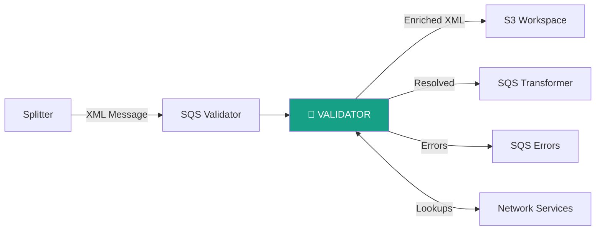
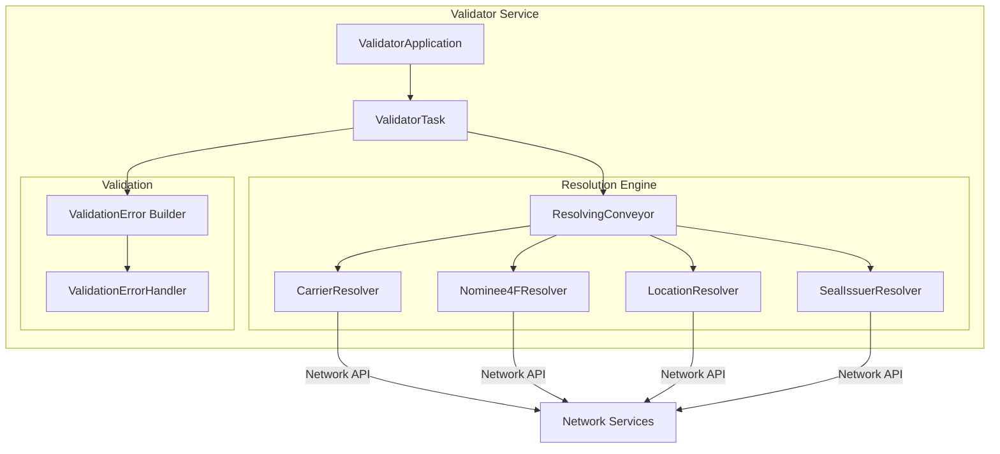
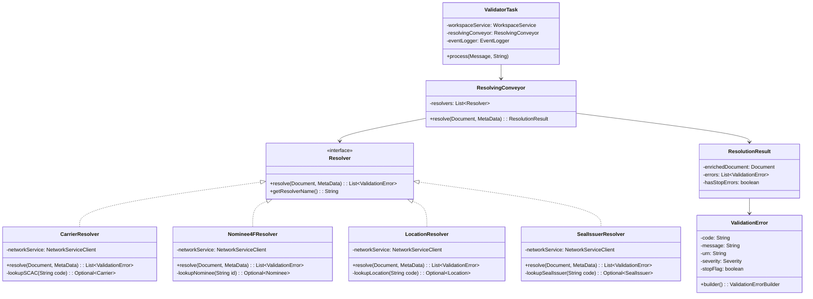
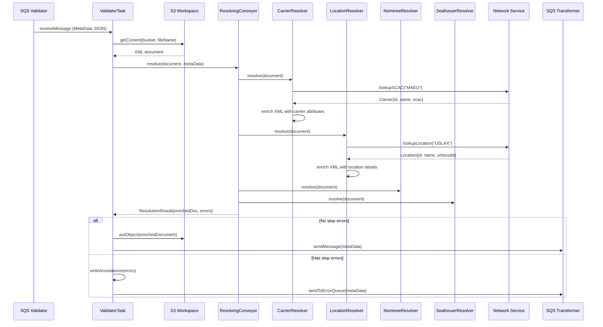
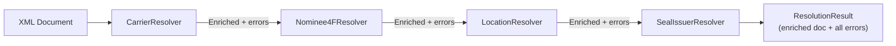

# Validator Module — Design Document

> **Module:** `validator`  
> **Generated:** 2026-05-24  
> **Artifact:** `com.inttra.mercury.validator:validator:1.0-SNAPSHOT`  
> **Java Version:** 8 | **Framework:** Dropwizard 1.1.1 + Guice 4.1.0

---

## 1. Executive Summary

The **Validator** module performs business-level XML enrichment and validation for shipping messages. It resolves reference data (carriers, locations, nominees, seal issuers) against the network service, enriches XML documents with resolved codes, and produces validation errors for unresolvable references. It acts as a data quality gate before messages proceed to transformation.

> ⚠️ **Legacy Module:** Uses older Java 8, Dropwizard 1.1.1, and Guice 4.1.0 (unlike modern modules at Java 17/Dropwizard 4.x).

---

## 2. Role in the Pipeline

---

## 3. High-Level Architecture

---

## 4. Class Diagram

---

## 5. Data Flow Diagram

---

## 6. Resolver Chain (Conveyor Pattern)

The `ResolvingConveyor` executes resolvers sequentially — each resolver enriches the document and accumulates errors:

---

## 7. Resolver Details

| Resolver | XML Elements | Network Endpoint | Enrichment |
|----------|-------------|-----------------|------------|
| `CarrierResolver` | `<carrier>`, `<scac>` | `/carriers?scac={code}` | Adds carrier ID, name |
| `Nominee4FResolver` | `<nominee>`, `<party4F>` | `/participants?id={id}` | Adds nominee details |
| `LocationResolver` | `<port>`, `<place>` | `/locations?code={code}` | Adds UN/LOCODE, name |
| `SealIssuerResolver` | `<sealIssuer>` | `/sealIssuers?code={code}` | Adds issuer ID |

---

## 8. ValidationError Structure

| Field | Type | Description |
|-------|------|-------------|
| `code` | String | URN-style error code |
| `message` | String | Human-readable description |
| `urn` | String | Full URN path for categorization |
| `severity` | Enum | `ERROR`, `WARNING`, `INFO` |
| `stopFlag` | boolean | If `true`, halts processing |

**Stop error behavior:** If any resolver produces a stop-flag error, the message is routed to the Error queue instead of continuing to Transformer.

---

## 9. Configuration Details

| Property | Type | Default | Description |
|----------|------|---------|-------------|
| `componentName` | String | `validator` | Service identity |
| `sqsPickupConfig.queueUrl` | String | — | Validator pickup queue |
| `sqsDropOffConfig.queueUrl` | String | — | Transformer queue |
| `sqsErrorConfig.queueUrl` | String | — | Error subscription queue |
| `s3WorkspaceConfig.bucket` | String | — | Workspace bucket |
| `networkServiceConfig.baseUrl` | String | — | Network service base URL |
| `networkServiceConfig.cacheSize` | int | — | Lookup cache entries |
| `networkServiceConfig.cacheTtl` | int | — | Cache TTL (minutes) |
| `snsEventConfig.topicArn` | String | — | Event topic |

---

## 10. Key Maven Dependencies

| Dependency | Version | Purpose |
|-----------|---------|---------|
| `mercury-shared` | 1.0 | Framework, S3, SQS, NetworkService |
| `dropwizard-core` | 1.1.1 | Application framework (legacy) |
| `guice` | 4.1.0 | DI container (legacy) |
| `dom4j` / `jdom2` | — | XML DOM manipulation |
| `aws-java-sdk-*` | 1.12.x | S3, SQS, SNS |
| `lombok` | 1.18.x | Code generation |

---

## 11. Design Patterns

| Pattern | Usage |
|---------|-------|
| **Chain of Responsibility** | ResolvingConveyor runs resolvers in order |
| **Builder** | ValidationError.builder() |
| **Enricher** | Each resolver adds data to the XML document |
| **Cache-Aside** | NetworkServiceClient caches lookups |
| **Specification** | Stop-flag predicate on validation errors |
