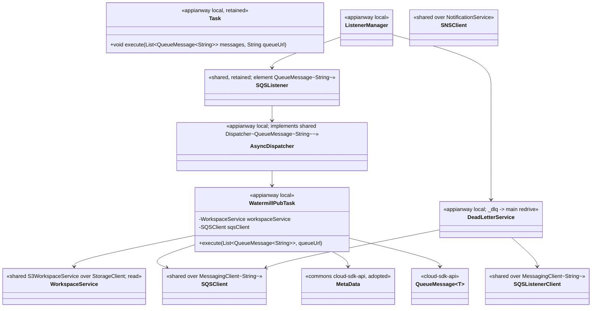
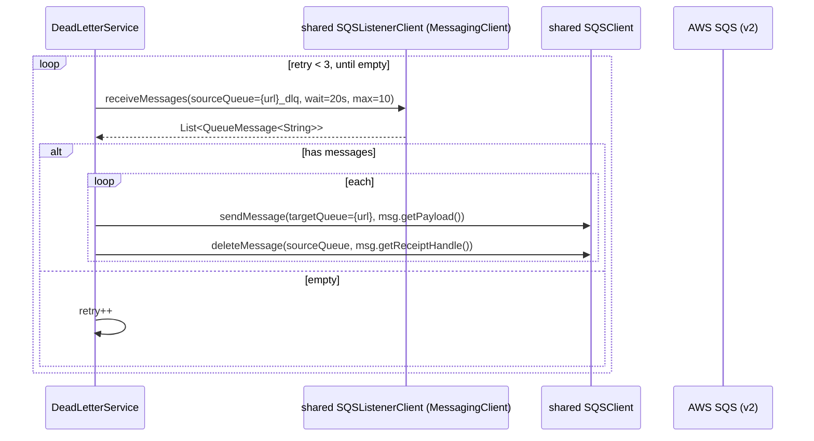

# `watermill-publisher` — AWS SDK v2 (cloud-sdk) Upgrade DESIGN (claude)

> Module: `com.inttra.mercury:watermill-publisher` · Date: 2026-05-31 · Author: Claude (Opus 4.8)
> **Chosen option: B — adopt `commons` + `cloud-sdk-api`/`cloud-sdk-aws` (`1.0.26-SNAPSHOT`) on Dropwizard 5**, consuming cloud-sdk as a client with **no module-specific cloud-sdk change** (inherits everything from `shared`).
> Companion plan: [`2026-05-31-watermill-publisher-aws2x-upgrade-plan-claude.md`](2026-05-31-watermill-publisher-aws2x-upgrade-plan-claude.md). MASTER: [shared DESIGN](../../shared/docs/2026-05-31-shared-aws2x-upgrade-DESIGN-claude.md) §4 (SQS sequences) / §5 (config) / §6 (cloud-sdk specs).

---

## 1. Overview & chosen option

watermill-publisher is a thin SQS consumer + S3 reader + SNS publisher + gRPC publisher. Every AWS touchpoint is **mediated by `shared`**; the module owns only a local `AsyncDispatcher`/`Task`/`ListenerManager` layered on `shared`'s `SQSListener` loop. Therefore the migration is almost entirely **inherited from `shared`**:

- the v1 `com.amazonaws.services.sqs.model.Message` flowing through the local `Task`/`AsyncDispatcher`/`DeadLetterService` becomes `QueueMessage<String>`;
- S3 read (`WorkspaceService.getContent`) rides `shared` `S3WorkspaceService` over `StorageClient`;
- SNS publish rides `shared` `SNSClient`/`SNSEventPublisher` over `NotificationService`;
- SSM rides `shared` `ParameterStoreModule` over `CloudParameterStore`;
- the scratch `Test.java` is deleted.

Governing rule (master plan §0): consume cloud-sdk as a client; any cloud-sdk change must be additive. watermill-publisher needs **no** cloud-sdk change at all — it does not even exercise **S-G2** (no S3 metadata write in production). gRPC (`e2open.watermill.proto`) is non-AWS and untouched.

---

## 2. Class diagram (target consumer wiring)



**Removed v1 types:** `com.amazonaws.services.sqs.model.{Message,ReceiveMessageRequest,ReceiveMessageResult,SendMessageRequest}`, `AmazonSQS/S3/SNS` + `*ClientBuilder` (the `Test.java` ones go with the file).
**Inherited from `shared`:** `SQSListener`/`SQSClient`/`SQSListenerClient` (on `MessagingClient<String>`), `WorkspaceService`/`S3WorkspaceService` (`StorageClient`), `SNSClient` (`NotificationService`), `ParameterStore` (`CloudParameterStore`).
**Adopted commons type:** `MetaData` (`com.inttra.mercury.cloudsdk.notification.workflow.MetaData`).

---

## 3. Component diagram

```mermaid
flowchart LR
    subgraph svc[watermill-publisher]
      ESM[ExternalServicesModule + WatermillPubModule]
      LM[ListenerManager]
      DISP[AsyncDispatcher x listenerThreads]
      TASK[WatermillPubTask]
      DLQ[DeadLetterService]
      GRPC[StatusEventGrpcClient  NON-AWS]
    end
    subgraph sh[shared (migrated)]
      LIS[SQSListener]
      SQSc[SQSClient / SQSListenerClient]
      WS[S3WorkspaceService read]
      SNSc[SNSClient]
      PS[ParameterStore]
    end
    subgraph cs[cloud-sdk 1.0.26-SNAPSHOT]
      MC[MessagingClient~String~ + QueueMessage~String~]
      SC[StorageClient]
      NS[NotificationService]
      CPS[CloudParameterStore]
    end
    AWS[(SQS / S3 / SNS / SSM)]

    LM --> LIS --> DISP --> TASK
    LM --> DLQ
    TASK --> WS & SQSc
    DLQ --> SQSc
    TASK -->|publish event| SNSc
    GRPC -. credentials .-> PS
    LIS & SQSc --> MC --> AWS
    WS --> SC --> AWS
    SNSc --> NS --> AWS
    PS --> CPS --> AWS
```

---

## 4. Sequence diagrams

### 4.1 Pickup consume → transform → gRPC publish (concurrency retained)
```mermaid
sequenceDiagram
    participant L as shared SQSListener (xN)
    participant M as MessagingClient~String~ (cloud-sdk)
    participant D as AsyncDispatcher (local)
    participant T as WatermillPubTask
    participant WS as WorkspaceService (StorageClient, read)
    participant G as StatusEventGrpcClient (NON-AWS)
    L->>M: receiveMessages(wait=20s, max)
    M-->>L: List<QueueMessage<String>>
    L->>D: submit(messages, queueUrl)
    D->>T: execute(List<QueueMessage<String>>, queueUrl)
    loop each message
        T->>T: MetaData = Json.fromJsonString(msg.getPayload(), MetaData.class)
        T->>WS: getContent(metaData.bucket, metaData.fileName, ISO_8859_1)
        WS-->>T: file content (read; no metadata)
        T->>T: XML -> protobuf transform
        alt transform error
            T->>M: deleteMessage(queueUrl, msg.getReceiptHandle())
        else ok
            T->>G: invoke(event, msg.getReceiptHandle())
        end
    end
```
**Accessor renames:** `message.getBody()` → `getPayload()`; `getReceiptHandle()` unchanged (master plan §3). Element type `Message` → `QueueMessage<String>` across `Task`/`AsyncDispatcher`/`WatermillPubTask`.

### 4.2 DLQ redrive (DeadLetterService — direct receive)

**Redrive routing preserved exactly:** source `{queueUrl}_dlq` → target `{queueUrl}` (WatermillPubModule L110–116).

---

## 5. Configuration (ref master DESIGN §5)

watermill-publisher inherits `shared`'s config composition. Module-specific keys (unchanged): pickup `SQSConfig` (`queueUrl`, `waitTimeSeconds`, `maxNumberOfMessages`), `listenerThreads`, `snsEventConfig.topicArn`, `watermillServiceConfig.{host,port,userIdKey,passwordKey,...}`. The DLQ source is derived as `{queueUrl}_dlq`. Per-purpose `AWSClientConfiguration` (`sqs_listener`/`sqs_sender`/`s3_read_put_copy`/`sns_publish`) maps to cloud-sdk-aws config → v2 `ClientOverrideConfiguration` with the `shared` migration. Credentials/region env/IAM via v2 default providers. Under Option B, register the composed appianway `ServerCommand` (master §5) on the `InttraServer` bootstrap.

---

## 6. cloud-sdk gaps — reference S-G2 only (not exercised)

**No module-specific cloud-sdk change.** watermill-publisher consumes only `shared`-provided surface:

| v1 element (file:line) | cloud-sdk replacement (via shared) |
|---|---|
| `Task.execute(List<Message>,...)` (Task L9) | element type → `QueueMessage<String>` |
| `WatermillPubTask` `msg.getBody()` (L52) / `getReceiptHandle()` (L70,L76) | `QueueMessage.getPayload()` / `getReceiptHandle()` |
| `WatermillPubTask` `Json.fromJsonString(body, MetaData.class)` | adopted commons `cloud-sdk-api` `MetaData` |
| `DeadLetterService` `ReceiveMessageRequest`/`Result` (L33–36) | `shared SQSListenerClient` → `MessagingClient.receiveMessages(ReceiveMessageOptions)` → `List<QueueMessage<String>>` |
| `WorkspaceService.getContent(...)` (WatermillPubTask L55) | `shared S3WorkspaceService` over `StorageClient` (read) |
| `SNSEventPublisher`/`SNSClient` (WatermillPubModule L79–81) | `shared SNSClient` over `NotificationService` |
| v1 `AmazonSQS/S3/SNS` binds (ExternalServicesModule L32–43) | cloud-sdk-aws factory-built clients (with `shared`) |
| `Test.java` (`AmazonS3.putObject`, `SendMessageRequest`) | **deleted** (scratch `main`) |

**S-G2** (StorageClient write-with-metadata overloads — master plan §11 / DESIGN §6.1) is the program's one required additive change, owned by `shared`. **watermill-publisher does not exercise it** — its only production S3 access is a metadata-free `getContent` read; the sole S3 write lived in the deleted `Test.java`. Listed here only for the master-index family reference.

---

## 7. Maven dependency changes (pin `1.0.26-SNAPSHOT`)

```xml
<properties>
  <mercury.commons.version>1.0.26-SNAPSHOT</mercury.commons.version>
</properties>
<!-- inherited transitively via migrated mercury-shared; declared explicitly if needed -->
<dependency><groupId>com.inttra.mercury</groupId><artifactId>cloud-sdk-api</artifactId><version>${mercury.commons.version}</version></dependency>
<dependency><groupId>com.inttra.mercury</groupId><artifactId>cloud-sdk-aws</artifactId><version>${mercury.commons.version}</version></dependency>
<!-- Option B -->
<dependency><groupId>com.inttra.mercury</groupId><artifactId>commons</artifactId><version>${mercury.commons.version}</version></dependency>
```
**Remove** `com.amazonaws:aws-java-sdk-sqs` (`1.12.720`) once the v1 `Message`/`ReceiveMessageRequest`/`SendMessageRequest` usages are gone (the last direct v1 SQS uses are in `DeadLetterService` and `Test.java`; deleting `Test.java` and migrating `DeadLetterService` clears them). S3/SNS v1 leave with `shared`. cloud-sdk-aws transitively supplies `software.amazon.awssdk:{sqs,s3,sns,ssm}` with Netty excluded. Keep `functional-testing` (test) pointed at the migrated `shared` surface.

---

## 8. Test details

- **`DeadLetterServiceTest`:** re-point to migrated `SQSListenerClient`/`SQSClient`; assert `{url}_dlq` → `{url}` redrive, `getPayload()` body, `getReceiptHandle()` delete, the 3-retry-on-empty loop. Use `QueueMessage<String>` test doubles instead of v1 `Message`.
- **`WatermillPubTaskTest`:** feed `List<QueueMessage<String>>`; assert `getPayload()`→`MetaData`, `WorkspaceService.getContent` read, transform-error → delete, success → gRPC invoke.
- **`WatermillPubModuleTest`:** assert N `shared.SQSListener` wired with the local `AsyncDispatcher` and the DLQ service with `_dlq`/main routing.
- **`Test.java`:** delete; no test.
- **gRPC tests** (`ResponseObserverTest`, `StatusEventProtobufTransformerTest`, `AuthCredentialsTest`): unchanged (non-AWS).
- New tests on JUnit 5 (Jupiter); existing JUnit 4 via vintage during transition.

---

## 9. Rollout & verification

1. Migrate `shared` (+ `functional-testing` fakes) — provides the `QueueMessage<String>` chain and S3/SNS/SSM rebind.
2. Swap the local `Task`/`AsyncDispatcher`/`WatermillPubTask`/`DeadLetterService` element type `Message` → `QueueMessage<String>`; rename `getBody`→`getPayload`.
3. Delete `task/Test.java`.
4. Rebind `ExternalServicesModule`/`WatermillPubModule` onto the migrated `shared` clients; (Option B) move the application onto `InttraServer`/DW5 with the composed config command.
5. `mvn -pl watermill-publisher -am verify`; run the DLQ redrive equivalence test end-to-end.
6. Roll out with the watermill consumer track.

---

## 10. Risks & mitigations

| Risk | Mitigation |
|---|---|
| DLQ redrive semantics change (`_dlq` → main) | Preserve source/target derivation (WatermillPubModule L110–116); end-to-end redrive equivalence test |
| `QueueMessage` loses body/receipt/attribute semantics | Round-trip tests; `getPayload()`/`getReceiptHandle()` + `Map<String,String>` attributes confirmed (master plan §3) |
| Accidentally porting scratch `Test.java` (only S3 write + send-with-delay) | Delete it; flag to implementers; do not model production behavior on it |
| Lockstep coupling with `shared` migration | Migrate strictly after `shared`/`functional-testing`; per-module verify gate |
| `MetaData` field drift after adopting commons type | commons `MetaData` is field-identical (master plan §2.8); assert JSON round-trip from the SQS body |
| DW4→5 (Option B) | Module already uses `io.dropwizard.core.*`; small surface; verify gate |
| Any cloud-sdk change breaking mercury-services | **N/A — watermill-publisher requires no cloud-sdk change**; S-G2 (owned by shared) is additive and not even exercised here |
