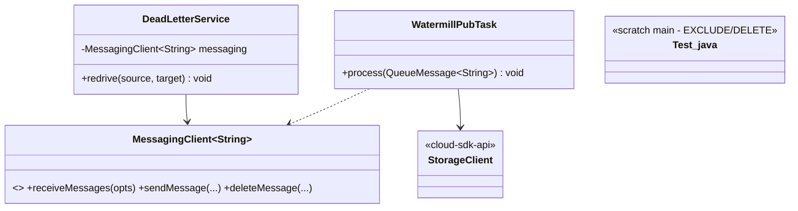
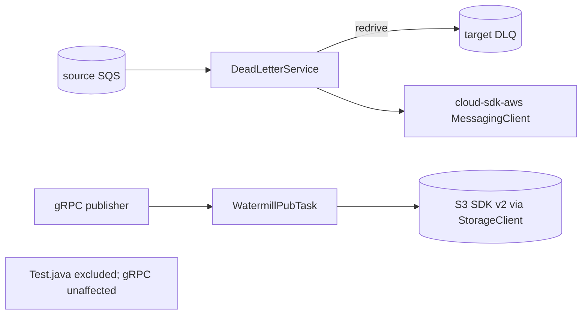
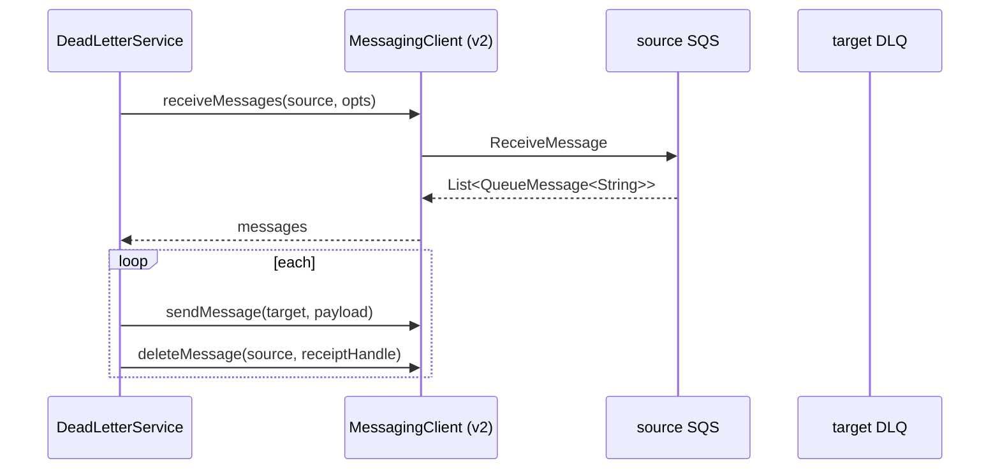

# `watermill-publisher` — AWS SDK v2 (cloud-sdk) Upgrade DESIGN

> **DIRECTIVE UPDATE (2026-05-31) — supersedes the Option-A recommendation in this document.** Per stakeholder direction the program now targets **Dropwizard 5** and **Option B — adopt `commons` + `cloud-sdk-api`/`cloud-sdk-aws`** as the directed default (recommend Option A only on a categorical technical blocker). All AWS service communication goes through `cloud-sdk-api`; new tests are written in **JUnit 5 (Jupiter)** (existing JUnit 4 runs via JUnit Vintage during transition); configuration follows the composed appianway `.properties`/`${PROFILE}`/`${ENV}` + commons `${awsps:...}` model in the master [shared plan §10](../../shared/docs/2026-05-31-shared-aws2x-upgrade-plan-copilot.md). cloud-sdk gaps are indexed in the master [shared plan §11](../../shared/docs/2026-05-31-shared-aws2x-upgrade-plan-copilot.md) with full technical specs in the master [shared DESIGN §1A.6](../../shared/docs/2026-05-31-shared-aws2x-upgrade-DESIGN.md).
> **Module-specific cloud-sdk gaps:** SNS/SQS publish via `NotificationService`/`MessagingClient` and (if it consumes) G1 concurrent listener; G6 (config). DynamoDB offset access is covered by `DatabaseRepository` (no gap); verify G4 only if an entity uses a version attribute.
> Sections below are retained as the Option-A fallback reference.

> Module: `watermill-publisher` · Date: 2026-05-31 · Author: GitHub Copilot (Claude Opus 4.8) · Option **A**
> Companion: [plan](2026-05-31-watermill-publisher-aws2x-upgrade-plan-copilot.md). Foundation: [`shared` DESIGN](../../shared/docs/2026-05-31-shared-aws2x-upgrade-DESIGN.md). Session `83b822b011714117`.

## 1. Overview
Adopt `cloud-sdk-aws` `MessagingClient`/`StorageClient` (v2). Rewrite `DeadLetterService`'s direct SQS receive to `MessagingClient.receiveMessages`; switch `WatermillPubTask` to `QueueMessage<String>` (own dispatcher) or `MessageRef` (if it uses `shared`). Exclude/delete scratch `task/Test.java`. gRPC publish unchanged.

## 2. Class diagram

## 3. Component diagram

## 4. Sequence diagram (DLQ redrive)

## 5. Configuration changes
SQS/S3 client config rebound to `cloud-sdk-aws`. DLQ source/target queue config retained. `${PROFILE}`/`${ENV}` unchanged.

## 6. Maven dependency changes
- **Remove:** `aws-java-sdk-{sqs,s3}` from `watermill-publisher/pom.xml`.
- **Add:** `cloud-sdk-api`, `cloud-sdk-aws`. Versions from the watermill aggregator `dependencyManagement` (v2 BOM 2.30.24).

## 7. Test details
- Re-point `DeadLetterServiceTest`, `WatermillPubTaskTest`, `WatermillPubModuleTest`, `ResponseObserverTest` to `MessagingClient`/`QueueMessage`.
- Add a redrive end-to-end test (source→target, delete-after-send).
- gRPC tests unchanged. JUnit 4 retained. `Test.java` removed from build.

## 8. Rollout & verification
With the watermill track. `mvn -pl watermill-publisher -am verify`. Validate DLQ redrive against dev SQS.

## 9. Risks & mitigations
| Risk | Mitigation |
|---|---|
| Redrive semantics change | End-to-end redrive test; preserve source/target + delete-after-send |
| Scratch `Test.java` ported by mistake | Exclude/delete; flag |
| Dispatcher model drift vs consumers | Align on `QueueMessage` |
