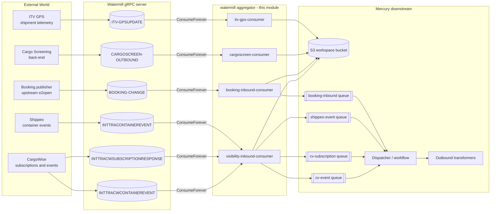
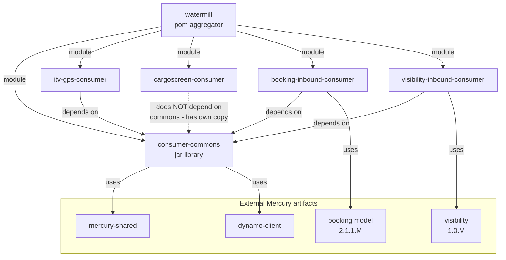
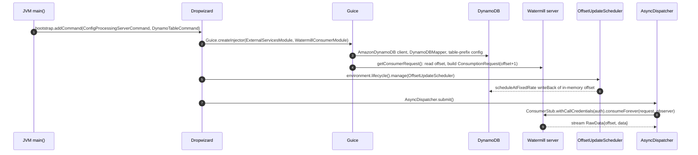
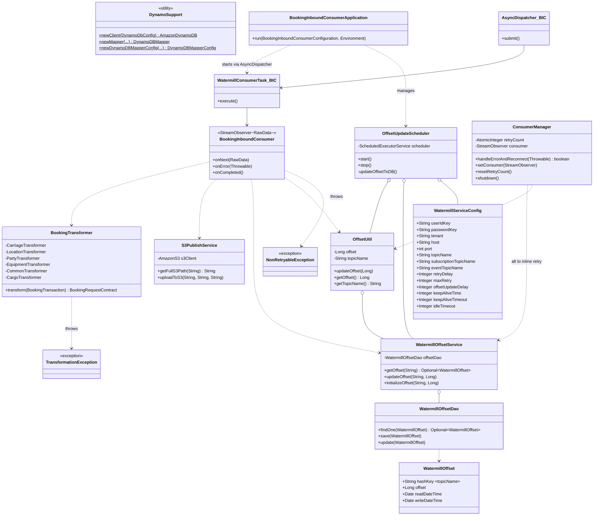
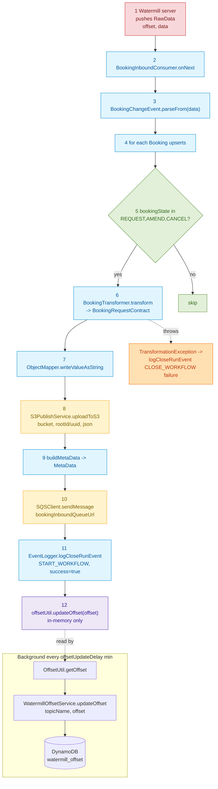
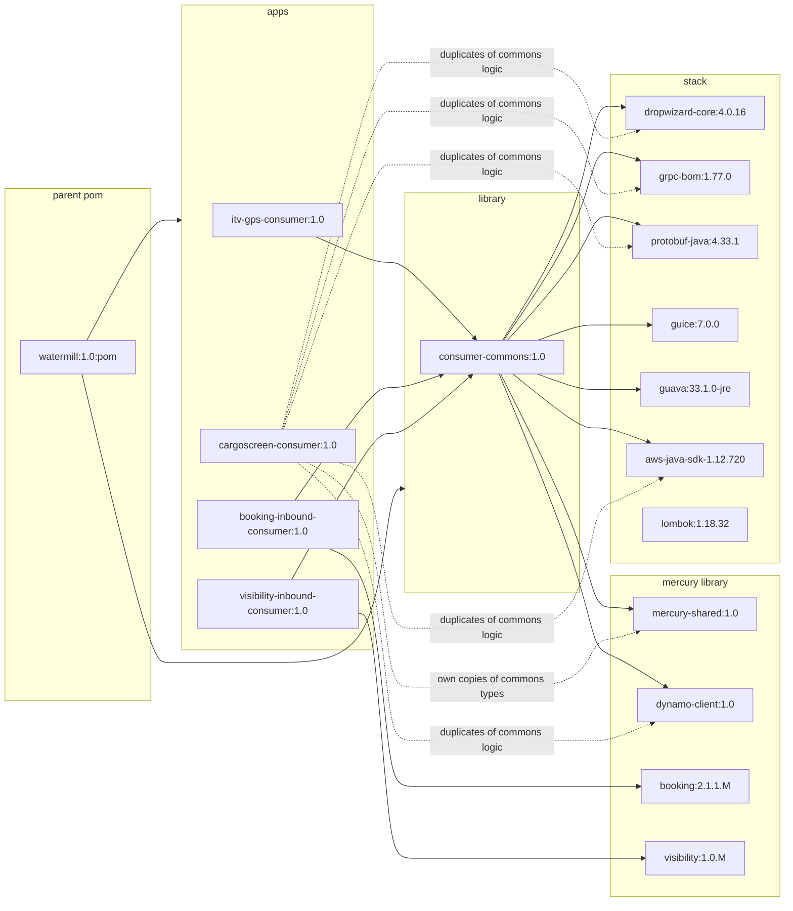

# Watermill Module — Architecture & Design

> **Author:** Principal Engineering Review · **Date:** 2026-05-24 · **Module Version:** `com.inttra.mercury:watermill:1.0` (Java 17, Maven aggregator `pom`)

---

## 1. Executive Summary

The `watermill` module is the **inbound event-streaming fabric** of the Mercury (Appian Way) platform. It is a Maven aggregator that hosts a fleet of standalone Dropwizard micro-services, each subscribed to a long-running gRPC topic exposed by the upstream **Watermill** server (operated by E2open under `git.dev.e2open.com/svcs/watermill-messages`). Whereas the rest of Mercury (the dispatcher, transformers, downstream-publishers) primarily reacts to S3 / SQS / SNS events generated by the EDI inbound pipeline, the watermill consumers are how *external systems* (carrier visibility feeds, cargo screening responses, EDI booking replays, ITV shipment telemetry) push messages **into** Mercury.

The aggregator [`watermill/pom.xml`](../pom.xml) declares five children:

| Sub-module | Type | Purpose |
|---|---|---|
| [`consumer-commons`](../consumer-commons/) | `jar` (library) | Shared abstractions: offset DAO, S3 publisher, gRPC service config, scheduled offset writer. |
| [`itv-gps-consumer`](../itv-gps-consumer/) | `jar` (app, Dropwizard) | Subscribes to `ITV-GPSUPDATE` shipment-status stream and writes JSON payloads to S3. |
| [`cargoscreen-consumer`](../cargoscreen-consumer/) | `jar` (app, Dropwizard) | Subscribes to the cargo-screening outbound topic and pushes upserts to S3. |
| [`booking-inbound-consumer`](../booking-inbound-consumer/) | `jar` (app, Dropwizard) | Subscribes to `BookingChangeEvent` stream, transforms protobuf → INTTRA `BookingRequestContract`, persists to S3, fans out via SQS, and emits workflow events. |
| [`visibility-inbound-consumer`](../visibility-inbound-consumer/) | `jar` (app, Dropwizard) | Subscribes to *three* topics simultaneously (Shippeo container events, CargoWise subscription responses, CargoWise container events) and emits transformed payloads on three separate SQS queues. |

All four consumer apps share the same architectural skeleton — a long-lived gRPC `consumeForever` stream against the Watermill server, with offsets persisted in DynamoDB to provide at-least-once delivery semantics across restarts. The sibling module **`watermill-publisher`** (out of scope here) sits on the *outbound* side and writes messages back to the Watermill server; the two modules are independent and do not share code.

This document is structured top-down: the architectural picture first (sections 2–4), then per-consumer detail (section 5), then cross-cutting concerns (sections 6–14). Where the consumers diverge from the shared `consumer-commons` baseline (notably `cargoscreen-consumer`, which carries a legacy copy of the offset stack), the deviation is called out explicitly.

---

## 2. Position in the Mercury Pipeline

To understand the watermill module's role you have to understand what *Watermill itself* is. Watermill is E2open's internal append-only log service. Its gRPC API (defined in [`itv-gps-consumer/src/main/proto/api/consumer.proto`](../itv-gps-consumer/src/main/proto/api/consumer.proto)) exposes four operations relevant here:

```protobuf
service Consumer {
  rpc ListOffsets(google.protobuf.Empty) returns (TopicOffsets);
  rpc LatestOffset(google.protobuf.Empty) returns (Offset);
  rpc Consume(ConsumptionRequest)            returns (stream RawData);
  rpc ConsumeHistorical(ConsumptionRequest)  returns (stream RawData);
  rpc ConsumeForever(ConsumptionRequest)     returns (stream RawData);
}
```

Each `RawData` envelope carries an opaque `bytes data` payload plus a monotonic `int64 offset`. The choice of `ConsumeForever` (as opposed to `Consume` or `ConsumeHistorical`) is the key architectural decision: the consumers establish a *server-streaming* RPC, hand the server a `setOffsetStart(...)` and then sit waiting for the server to push new messages indefinitely. There is no polling loop and no acknowledgement back-channel — durability is the consumer's problem to solve, which is precisely why every sub-module carries a DynamoDB-backed `WatermillOffset` table.

In the larger Mercury topology the watermill consumers sit at the *ingestion edge*:



A few observations about that picture:

1. **No back-pressure to the upstream.** Watermill's `ConsumeForever` does not let consumers nack messages. If processing fails the consumer either logs and skips (for parse-level failures) or throws a `NonRetryableException` which kills the stream and triggers a reconnection. There is no DLQ on the gRPC side.
2. **S3 is the durable hand-off.** Every consumer writes the consumed payload (raw protobuf JSON and/or transformed JSON) into the `watermill-grpc.consumer.s3WorkspaceConfig.bucket` first, *then* puts a `MetaData` envelope onto SQS pointing at the S3 key. This is the standard "claim check" pattern used throughout Mercury and keeps the SQS messages small.
3. **`itv-gps-consumer` and `cargoscreen-consumer` are S3-only.** They do not write to SQS. Their output is dropped into a date-prefixed S3 folder and a separate downstream component (out of scope) sweeps those folders. The other two consumers (`booking-inbound-consumer` and `visibility-inbound-consumer`) are "full" pipeline entry points that hand work off to the dispatcher.
4. **Visibility runs three consumers in one JVM.** This is the only sub-module where the application boots multiple gRPC streams against three different topics; everything else is one-app, one-topic.

The `watermill-publisher` module lives at the opposite end of the pipeline and is **explicitly out of scope** for this document. The two share nothing but the protobuf API package name (`com.e2open.watermill.proto.api`).

---

## 3. High-Level Architecture

### 3.1 Module-to-module dependency graph



The most important thing the diagram shows is the **deviation** of `cargoscreen-consumer`. It does *not* take a Maven dependency on `consumer-commons`; instead it carries its own copies of:

- `com.inttra.watermill.gps.consumer.service.WatermillOffsetService` (cf. [cargoscreen-consumer/.../service/WatermillOffsetService.java:14](../cargoscreen-consumer/src/main/java/com/inttra/watermill/gps/consumer/service/WatermillOffsetService.java))
- `com.inttra.watermill.gps.consumer.dao.WatermillOffsetDao`
- `com.inttra.watermill.gps.consumer.vo.WatermillOffset`
- `com.inttra.watermill.gps.consumer.util.OffsetUtil`
- `com.inttra.watermill.gps.consumer.task.OffsetUpdateScheduler`
- `com.inttra.watermill.gps.consumer.service.S3PublishService`
- `com.inttra.watermill.gps.consumer.config.WatermillServiceConfig`
- `com.inttra.watermill.gps.consumer.config.HealthCheckConfig`
- `com.inttra.watermill.gps.consumer.exception.NonRetryableException`
- `com.inttra.watermill.gps.consumer.dynamodb.DynamoSupport`
- `com.inttra.watermill.gps.consumer.vo.DateToEpochSecond`
- `com.inttra.watermill.gps.consumer.vo.Expires`

This is technical debt. Every file listed above is a near-byte-identical copy of the corresponding `consumer-commons` source. The cargo-screen consumer is the oldest of the four and predates the extraction of `consumer-commons`; the rebase has simply never been done. See section 14 (Open Questions / Risks) for the recommendation.

### 3.2 Lifecycle of a single consumer process

Every consumer application is a Dropwizard `Application<T>` that follows the same six-step boot sequence:



The piece that makes this whole module tick is `OffsetUpdateScheduler` (see [consumer-commons/.../task/OffsetUpdateScheduler.java:49](../consumer-commons/src/main/java/com/inttra/mercury/watermill/consumer/task/OffsetUpdateScheduler.java)). Without it the offset is updated in memory by every `onNext()` call but never persisted; with it, the in-memory offset is flushed to DynamoDB every `offsetUpdateDelay` minutes (default 10) **and** on graceful shutdown via `Managed.stop()`. The `getConsumerRequest()` provider re-reads that offset at boot to determine where to start streaming. This gives the consumers their at-least-once semantics: in the worst case (crash between flush windows) up to `offsetUpdateDelay` minutes of messages will be re-delivered after restart, and the consumers' `onNext` handlers must be idempotent at the S3 layer (which they are, because the S3 key is offset-derived).

### 3.3 The four consumer applications side-by-side

The four apps are structurally identical but vary in *what they do with the parsed message* and *how many topics they read*. The table below summarises the differences:

| Aspect | `itv-gps-consumer` | `cargoscreen-consumer` | `booking-inbound-consumer` | `visibility-inbound-consumer` |
|---|---|---|---|---|
| Main class | `WatermillGpsConsumerApplication` | `CargoScreenConsumerApplication` | `BookingInboundConsumerApplication` | `VisibilityInboundConsumerApplication` |
| Number of topics | 1 (`topicName`) | 1 (`topicName`) | 1 (`topicName`) | 3 (`topicName`, `subscriptionTopicName`, `eventTopicName`) |
| Number of `StreamObserver`s | 1 (`ResponseConsumerObserver`) | 1 (`ResponseConsumerObserver`) | 1 (`BookingInboundConsumer`) | 3 (`VisibilityInboundConsumer`, `CargoVisibilitySubscriptionConsumer`, `CargoVisibilityEventConsumer`) |
| Inbound protobuf type | `ITVShipmentStatusChangeEvent` | `CargoScreeningOutboundChangeEvent` | `BookingChangeEvent` | `INTTRAContainerEventChangeEvent`, `INTTRACWSubscriptionResponseChangeEvent`, `INTTRAContainerEventChangeEvent` |
| Has transformer? | No (raw proto-JSON dumped) | No (raw proto-JSON dumped) | Yes (`BookingTransformer` + 6 specialists) | Yes (`ContainerEventTransformer`, `CargoVisibilitySubscriptionTransformer`, `ContainerEventProtoMapper`) |
| Writes to SQS? | No | No | Yes (1 queue) | Yes (3 queues) |
| Emits workflow events? | No | No | Yes (`EventLogger.logCloseRunEvent`) | Yes |
| Reconnect strategy | Inline in `ResponseConsumerObserver.onError` | Inline in `ResponseConsumerObserver.onError` (with channel cleanup) | Inline in `BookingInboundConsumer.onError` | Externalised to `ConsumerManager` (single instance reused) |
| Depends on `consumer-commons` | Yes | **No (copy)** | Yes | Yes |
| Registers `DynamoTableCommand` | Yes | Yes | No | No |
| Default `maxRetry` | 3 | 10 | 3 | 3 |

The reconnect strategy column deserves particular attention. The three older consumers (`itv-gps`, `cargoscreen`, `booking-inbound`) implement the reconnect loop *inside* the `StreamObserver` itself — `onError` constructs a brand-new observer, a fresh channel, and re-invokes `consumeForever`. This works but it allocates a new observer object on every reconnection, which over a long-running connection-flap scenario can leak (the old observer is still pinned by gRPC internals while it tears down). The visibility consumer fixed this in late 2025 by extracting `ConsumerManager` (see [`ConsumerManager.java`](../visibility-inbound-consumer/src/main/java/com/inttra/watermill/consumer/visibility/inbound/grpc/ConsumerManager.java)), which reuses the **same** observer instance and only swaps out the underlying `ManagedChannel`. The visibility README at [`visibility-inbound-consumer/README.md:21`](../visibility-inbound-consumer/README.md) records this as "Memory Efficient: Fixed memory leak issues with proper resource management". The other three consumers should be retrofitted with the same pattern (see section 14).

---

## 4. Low-Level Design — `consumer-commons`

`consumer-commons` is a small library — twelve Java source files in total — but it carries the lion's share of the cross-cutting plumbing. Everything that is genuinely *common* between the four apps lives here. Below is a class-by-class walk-through with the rationale for each piece.

### 4.1 Package layout

```
com.inttra.mercury.watermill.consumer/
  config/
    HealthCheckConfig.java        - Dropwizard Configuration POJO for health checks
    WatermillServiceConfig.java   - Dropwizard Configuration POJO for the gRPC client
  dao/
    WatermillOffsetDao.java       - DynamoDB CRUD repo over WatermillOffset
  dynamodb/
    DynamoSupport.java            - Static factory helpers for AmazonDynamoDB + DynamoDBMapper
  exception/
    NonRetryableException.java    - Sentinel RuntimeException for fatal processing errors
  service/
    S3PublishService.java         - Thin AmazonS3 facade with a date-prefixed key builder
    WatermillOffsetService.java   - Service layer over WatermillOffsetDao
  task/
    OffsetUpdateScheduler.java    - Dropwizard Managed that periodically flushes offset to DDB
  util/
    OffsetUtil.java               - In-memory holder of (topicName, offset)
  vo/
    DateToEpochSecond.java        - DynamoDB type converter (Date <-> Long epoch seconds)
    Expires.java                  - Marker interface for DynamoDB TTL
    WatermillOffset.java          - DynamoDB entity, table "watermill_offset"
```

There is no `Application` class here, no `main`, and no Guice module: this is purely a library. The `pom.xml` packaging is the implicit Maven default (`jar`), see [`consumer-commons/pom.xml:13`](../consumer-commons/pom.xml).

### 4.2 `WatermillServiceConfig`

[`WatermillServiceConfig.java`](../consumer-commons/src/main/java/com/inttra/mercury/watermill/consumer/config/WatermillServiceConfig.java) is the most important configuration POJO in the module. It is loaded from YAML by Dropwizard's Jackson plumbing and represents everything needed to set up the gRPC client *and* the retry/keepalive policy:

```java
public class WatermillServiceConfig {
    @JsonProperty @NotNull private String userIdKey;            // Parameter Store key
    @JsonProperty @NotNull private String passwordKey;          // Parameter Store key
    @JsonProperty @NotNull private String tenant;               // gRPC metadata "tenant"
    @JsonProperty @NotNull private String host;                 // gRPC host
    @JsonProperty @NotNull private int port;                    // gRPC port (typically 443)
    @JsonProperty @NotNull private String topicName;            // primary topic
    @JsonProperty @NotNull private String subscriptionTopicName;// visibility only
    @JsonProperty @NotNull private String eventTopicName;       // visibility only
    @JsonProperty @NotNull private Integer retryDelay;          // seconds between reconnect attempts
    @JsonProperty @NotNull private Integer maxRetry;            // bounded retry for NonRetryable
    @JsonProperty @NotNull private Integer offsetUpdateDelay;   // minutes between DDB flush
    @JsonProperty @NotNull private Integer keepAliveTime;       // gRPC keepAliveTime (seconds)
    @JsonProperty @NotNull private Integer keepAliveTimeout;    // gRPC keepAliveTimeout (seconds)
    @JsonProperty @NotNull private Integer idleTimeout;         // gRPC idleTimeout (minutes)
}
```

A few comments on this contract.

First, `subscriptionTopicName` and `eventTopicName` are required-by-annotation even though only `visibility-inbound-consumer` populates them. The other three apps' YAMLs leave them unset, which would technically fail validation; in practice it doesn't because the validation is structural (the field exists) rather than non-empty (`@NotNull` on a `String` only checks presence of the JSON key after deserialisation, and the default of `null` does not blow up because the YAMLs simply do not mention those keys — Jackson defaults them to `null` and `@NotNull` on a *boxed* member passes because the field is `null`-initialised; this is a known Dropwizard surprise). This is a latent foot-gun if the validator is ever tightened.

Second, `userIdKey` and `passwordKey` are **not** the credentials themselves — they are SSM Parameter Store keys. The actual username/password is fetched at runtime by `mercury-shared`'s `ParameterSupplier`, see for example [`AuthCredentials.java:30`](../itv-gps-consumer/src/main/java/com/inttra/watermill/gps/consumer/grpc/AuthCredentials.java):

```java
this.userName = parameterSupplier.getValue(watermillServiceConfig.getUserIdKey());
this.password = parameterSupplier.getValue(watermillServiceConfig.getPasswordKey());
```

This keeps secrets out of YAML and out of the Docker image.

Third, the timing parameters cleanly map onto Netty/gRPC channel knobs (cf. `ConsumerInitUtil.getChannel` in any consumer):

```java
channel = NettyChannelBuilder.forAddress(host, port)
        .keepAliveTime(keepAliveTime, TimeUnit.SECONDS)
        .keepAliveTimeout(keepAliveTimeout, TimeUnit.SECONDS)
        .idleTimeout(idleTimeout, TimeUnit.MINUTES)
        .build();
```

The defaults from the YAML (`keepAliveTime=30s`, `keepAliveTimeout=20s`, `idleTimeout=30min`) are deliberately aggressive because the producer side can sit silent for hours between messages — without keepalives the NLB / firewall would tear the socket down. The visibility variant additionally sets `maxInboundMessageSize(50 MB)`; the others use the gRPC default of 4 MB, which is something to watch for on the cargoscreen topic (see section 14).

### 4.3 `HealthCheckConfig`

[`HealthCheckConfig.java`](../consumer-commons/src/main/java/com/inttra/mercury/watermill/consumer/config/HealthCheckConfig.java) is a tiny POJO:

```java
@Getter @Setter
public class HealthCheckConfig {
    @JsonProperty @NotNull @Digits(integer = 2, fraction = 2)
    private Double errorRateThreshold;
    @JsonProperty @NotEmpty
    private String networkServiceHealthCheckUrl;
}
```

Note the import of `org.hibernate.validator.constraints.NotEmpty` (deprecated in favour of `jakarta.validation`) — this is one of those low-priority modernisation tasks listed in section 14.

### 4.4 `WatermillOffset` — the persistence model

The whole at-least-once story rests on this one DynamoDB table. See [`WatermillOffset.java`](../consumer-commons/src/main/java/com/inttra/mercury/watermill/consumer/vo/WatermillOffset.java):

```java
@DynamoDBTable(tableName = "watermill_offset")
@DynamoDBStream(StreamViewType.KEYS_ONLY)
public class WatermillOffset implements DynamoHashKey<String> {
    @DynamoDBHashKey(attributeName = "topicName")
    private String hashKey;                  // the watermill topic name is the partition key

    @DynamoDBAttribute
    private Long offset;                     // the last successfully processed message offset

    @DynamoDBAttribute
    @DynamoDBTypeConverted(converter = DateToEpochSecond.class)
    private Date readDateTime;               // when the offset was last refreshed in memory

    @DynamoDBAttribute
    @DynamoDBTypeConverted(converter = DateToEpochSecond.class)
    private Date writeDateTime;              // declared but never set anywhere (latent dead field)
}
```

The hash key is the topic name and there is no sort key, so the table is essentially a key-value map of `topic -> last_offset`. In a deployed environment the table name will be prefixed with the `dynamoDbConfig.environment` value (e.g. `INT_watermill_offset`) by the `DynamoDBMapperConfig.TableNameOverride` configured in [`DynamoSupport.newDynamoDBMapperConfig`](../consumer-commons/src/main/java/com/inttra/mercury/watermill/consumer/dynamodb/DynamoSupport.java).

The `writeDateTime` field is declared but never actually written by any consumer — the code path only ever calls `setReadDateTime`. This is dead code in the current implementation; harmless but suggests an aborted refactor.

### 4.5 `WatermillOffsetDao` and `WatermillOffsetService`

The DAO ([`WatermillOffsetDao.java`](../consumer-commons/src/main/java/com/inttra/mercury/watermill/consumer/dao/WatermillOffsetDao.java)) is a one-line extension of the Mercury-wide `DynamoDBCrudRepository` generic — no custom queries, just standard `findOne`, `save`, `update`. The service layer ([`WatermillOffsetService.java`](../consumer-commons/src/main/java/com/inttra/mercury/watermill/consumer/service/WatermillOffsetService.java)) wraps three operations:

- `getOffset(topicName)` — `findOne` by hash key, returning `Optional<WatermillOffset>`.
- `updateOffset(topicName, offset)` — overwrite the row with new offset + `readDateTime = new Date()`. Wrapped in try/catch that re-throws as `RuntimeException` so the surrounding `OffsetUpdateScheduler` does not silently swallow DDB failures.
- `initializeOffset(topicName, offset)` — `save` (PutItem) used the very first time a consumer comes up against an empty table; called with `offset = -1L`.

The `@Singleton` annotation is important — the service is fronted by a single `WatermillOffsetDao` instance that internally holds the AWS SDK's `DynamoDBMapper`, which is thread-safe but expensive to create.

### 4.6 `OffsetUtil` — the in-memory cursor

This is the per-topic in-memory bookmark. See [`OffsetUtil.java`](../consumer-commons/src/main/java/com/inttra/mercury/watermill/consumer/util/OffsetUtil.java):

```java
@Singleton
public class OffsetUtil {
    private Long offset;
    private final String topicName;

    @Inject
    public OffsetUtil(WatermillOffsetService watermillOffsetService, String topicName) {
        this.topicName = topicName;
        Optional<WatermillOffset> offsetOptional = watermillOffsetService.getOffset(topicName);
        this.offset = offsetOptional.map(WatermillOffset::getOffset).orElse(-1L);
    }

    public void updateOffset(Long offset)  { this.offset = offset; }
    public Long getOffset()                { return this.offset; }
    public String getTopicName()           { return this.topicName; }
}
```

Things to note:

1. The constructor *reads from DynamoDB at injection time*. This means the first thing any consumer does at boot is a DDB round-trip. If DDB is unhealthy, the app fails to start (loud failure, which is correct).
2. The `topicName` is a constructor argument, not an injected configuration — this is what allows the visibility consumer to instantiate three `OffsetUtil` beans for three different topics via three separate `@Provides` methods using `@Named` qualifiers (see [`visibility-inbound-consumer/.../modules/WatermillConsumerModule.java:120-154`](../visibility-inbound-consumer/src/main/java/com/inttra/watermill/consumer/visibility/inbound/modules/WatermillConsumerModule.java)).
3. The class is **not thread-safe**. `offset` is a non-volatile `Long`. In practice all writes come from the gRPC `StreamObserver.onNext` callback (single-threaded per stream) and the only concurrent reader is the `OffsetUpdateScheduler` running on its own `ScheduledExecutorService`. Without `volatile` or an `AtomicLong`, the scheduler thread *could* observe a stale value due to memory-visibility, in which case the next periodic flush would write an older offset and on a crash-restart the consumer would replay a few messages. That is benign given the at-least-once guarantee, but it would be cleaner to declare the field `volatile` or convert it to `AtomicLong`. Logged as a hardening item.

### 4.7 `OffsetUpdateScheduler` — the periodic flush

See [`OffsetUpdateScheduler.java`](../consumer-commons/src/main/java/com/inttra/mercury/watermill/consumer/task/OffsetUpdateScheduler.java). The class implements Dropwizard's `Managed` interface so the lifecycle is hooked into the Jetty container:

```java
@Override public void start() throws Exception { startScheduler(); }
@Override public void stop()  throws Exception {
    log.info("Offset Update Scheduler for topic: {} shutting down.", offsetUtil.getTopicName());
    updateOffsetToDB();
    scheduler.shutdown();
}

private void startScheduler() {
    scheduler.scheduleAtFixedRate(this::updateOffsetToDB,
        watermillServiceConfig.getOffsetUpdateDelay(),
        watermillServiceConfig.getOffsetUpdateDelay(),
        TimeUnit.MINUTES);
}
```

A single-threaded `ScheduledExecutorService` writes the current `OffsetUtil.offset` to the DDB row every `offsetUpdateDelay` minutes (default 10). On graceful shutdown (e.g. SIGTERM or container stop) Dropwizard calls `stop()`, which performs one final synchronous flush before terminating the scheduler. On *non*-graceful shutdown (kill -9, OOM, instance terminated by AWS) the last 0–10 minutes of in-memory progress is lost and the consumer will replay on restart. This is the *defining* delivery semantic of the module.

The visibility consumer instantiates **three** schedulers (one per topic) — see [`VisibilityInboundConsumerApplication.java:59-72`](../visibility-inbound-consumer/src/main/java/com/inttra/watermill/consumer/visibility/inbound/VisibilityInboundConsumerApplication.java):

```java
environment.lifecycle().manage(new OffsetUpdateScheduler(...visibilityInboundConsumerOffsetUtil...));
environment.lifecycle().manage(new OffsetUpdateScheduler(...cargoSubscriptionConsumerOffsetUtil...));
environment.lifecycle().manage(new OffsetUpdateScheduler(...visibilityEventConsumerOffsetUtil...));
```

### 4.8 `S3PublishService`

[`S3PublishService.java`](../consumer-commons/src/main/java/com/inttra/mercury/watermill/consumer/service/S3PublishService.java) is the simplest helper in the module — a thin AmazonS3 facade with a date-prefixed key builder:

```java
public String getFullS3Path(String originalFileName) {
    String dateTime = ZonedDateTime.now(Clock.systemUTC()).format(FOLDER_DATE_FORMAT); // YYYYMMdd
    return dateTime + "/" + originalFileName;
}

public void uploadToS3(String bucket, String fullS3Path, String payload) {
    s3Client.putObject(bucket, fullS3Path, payload);
}
```

The `FOLDER_DATE_FORMAT` pattern is the lower-case `"YYYYMMdd"` which is — be aware — the *week-based year* in `DateTimeFormatter` terminology. For most days of the year this happens to render identically to `"yyyyMMdd"` (the calendar year), but in the last week of December / first week of January the two differ by one. This is a known sharp edge of `java.time.format` and a long-standing latent bug throughout the module; e.g. on 2024-12-31 the folder would be `20250101/...`. Logged in section 14.

The cargoscreen copy of this class ([`cargoscreen-consumer/.../service/S3PublishService.java`](../cargoscreen-consumer/src/main/java/com/inttra/watermill/gps/consumer/service/S3PublishService.java)) embeds the bucket name into the service via the `WatermillConsumerConfiguration` dependency, while the commons version takes the bucket as a method argument — that's a small API divergence between commons and the copy.

### 4.9 `NonRetryableException`

[`NonRetryableException.java`](../consumer-commons/src/main/java/com/inttra/mercury/watermill/consumer/exception/NonRetryableException.java) is a sentinel `RuntimeException` thrown by every consumer's `onNext` when it hits an unrecoverable processing error (a `NullPointerException` mid-transformation, an IAM denial on S3, etc.). The gRPC machinery routes that into `onError`, which then decides — based on `retryCount` versus `maxRetry` — whether to reconnect or to shut the application down.

### 4.10 `DynamoSupport`, `DateToEpochSecond`, `Expires`

[`DynamoSupport.java`](../consumer-commons/src/main/java/com/inttra/mercury/watermill/consumer/dynamodb/DynamoSupport.java) holds three static helpers: `newClient(DynamoDbConfig)`, `newMapper(client, cfg, mapperCfg)` and `newDynamoDBMapperConfig(cfg)`. The mapper config is where the per-environment table prefix is glued onto every table name, via a `withTableNameResolver` that turns `WatermillOffset.class` into `INT_watermill_offset` (or whatever the deploy prefix is).

[`DateToEpochSecond.java`](../consumer-commons/src/main/java/com/inttra/mercury/watermill/consumer/vo/DateToEpochSecond.java) is a `DynamoDBTypeConverter<Long, Date>` so dates land in DDB as numeric epoch seconds rather than ISO strings — cheaper to index, smaller storage, and TTL-compatible.

[`Expires.java`](../consumer-commons/src/main/java/com/inttra/mercury/watermill/consumer/vo/Expires.java) is a marker interface exposing `getExpiresOn()` for entities that opt in to DynamoDB TTL. `WatermillOffset` does *not* implement it — offsets are meant to live forever — but the interface lives in commons in case other consumer-side entities need it.

---

## 5. Sub-Module Walk-through

### 5.1 `booking-inbound-consumer`

**Purpose.** The most architecturally complex of the four consumers. Subscribes to the Watermill topic that carries `BookingChangeEvent` protobuf messages (booking creates, amends, cancellations) produced by the upstream booking publisher, transforms each booking into Mercury's canonical `BookingRequestContract`, persists the result in S3, sends a `MetaData` envelope on the `bookingInboundQueueUrl` SQS queue, and emits a workflow event via `EventLogger.logCloseRunEvent`. It is effectively the EDI-replacing path for booking onboarding inside Mercury.

**Key classes** (see [`booking-inbound-consumer/src/main/java/com/inttra/watermill/consumer/bookinginbound/`](../booking-inbound-consumer/src/main/java/com/inttra/watermill/consumer/bookinginbound/)):

- [`BookingInboundConsumerApplication`](../booking-inbound-consumer/src/main/java/com/inttra/watermill/consumer/bookinginbound/BookingInboundConsumerApplication.java) — Dropwizard entry point; identical shape to the other apps but does *not* register a `DynamoTableCommand` (the offset table is assumed to be created by an external process, presumably the same one that runs for `itv-gps-consumer`, since they share the same DDB table per environment).
- [`BookingInboundConsumerConfiguration`](../booking-inbound-consumer/src/main/java/com/inttra/watermill/consumer/bookinginbound/config/BookingInboundConsumerConfiguration.java) — adds `componentName`, `snsEventConfig`, and `bookingInboundQueueUrl` on top of the standard `WatermillServiceConfig` / `DynamoDbConfig` / `S3Config` triple.
- [`BookingInboundConsumer`](../booking-inbound-consumer/src/main/java/com/inttra/watermill/consumer/bookinginbound/grpc/BookingInboundConsumer.java) — the `StreamObserver<RawData>`. Parses each `RawData` as a `BookingChangeEvent`, iterates `bookingChangeEvent.getUpsertsList()`, filters to `BOOKING_STATE_REQUEST | _AMEND | _CANCEL` (other states are silently dropped), runs `BookingTransformer.transform`, writes the resulting JSON to S3 under `rootWorkflowId/randomUUID`, constructs a `MetaData` envelope and sends it to SQS, then logs a `START_WORKFLOW` close-run event.
- [`BookingTransformer`](../booking-inbound-consumer/src/main/java/com/inttra/watermill/consumer/bookinginbound/transformer/BookingTransformer.java) and the six specialists (`CargoTransformer`, `CarriageTransformer`, `CommonTransformer`, `EquipmentTransformer`, `LocationTransformer`, `PartyTransformer`) — the protobuf-to-`BookingRequestContract` mapping engine. ~50 type-map classes under `.../transformer/type/` (e.g. `BookingStateMap`, `MoveTypeMap`, `ServiceTypeMap`, `PartyTypeMap`, `ReferenceTypeMap`...) wrap individual enum-style fields and translate between the protobuf enum constants and the canonical INTTRA codes.
- [`TransformationException`](../booking-inbound-consumer/src/main/java/com/inttra/watermill/consumer/bookinginbound/exception/TransformationException.java) — caught separately from `NonRetryableException` so that a single bad message can be skipped without tearing down the stream. The exception path emits a `CLOSE_WORKFLOW` event with status `false` and the cause message in the `"exception"` token.
- [`WatermillConsumerTask`](../booking-inbound-consumer/src/main/java/com/inttra/watermill/consumer/bookinginbound/task/WatermillConsumerTask.java) — the executor that wires up the gRPC stub and kicks off `consumeForever`.
- [`AsyncDispatcher`](../booking-inbound-consumer/src/main/java/com/inttra/watermill/consumer/bookinginbound/task/AsyncDispatcher.java) — the trivial `submit()` shim; identical in shape across all four consumers.

**Source event stream.** `${watermill-grpc.consumer.topic.name}` — at deploy time this resolves to a topic such as `INTTRA_INT-BOOKINGCHANGE`. The protobuf type is `com.e2open.watermill.proto.logistics.BookingChangeEvent`, which carries a `repeated Booking upserts` list (a single stream message may carry multiple bookings; the consumer iterates).

**Output.** Two side-effects per accepted booking: (1) a JSON blob in the configured S3 workspace bucket under `rootWorkflowId/randomUUID`, containing the canonical `BookingRequestContract` JSON; (2) an SQS message on `bookingInboundQueueUrl` carrying the `MetaData` pointer. Additionally an event is logged via `EventLogger` (which ultimately hits the workflow's SNS topic via `SNSEventPublisher`, configured in [`WatermillConsumerModule.snsEventPublisher`](../booking-inbound-consumer/src/main/java/com/inttra/watermill/consumer/bookinginbound/modules/WatermillConsumerModule.java)).

**Configuration.** See [`booking-inbound-consumer/conf/booking-inbound-consumer.yaml`](../booking-inbound-consumer/conf/booking-inbound-consumer.yaml). The notable extras beyond the common `WatermillServiceConfig` block are `componentName`, `snsEventConfig.topicArn`, and `bookingInboundQueueUrl`. `componentName` is what shows up in every emitted workflow event as the originator — the YAML default is `booking-inbound-watermill`.

**Reconnect strategy.** Inline-in-observer (the older pattern). `onError` flushes the in-memory offset to DDB, then either constructs a new observer + new channel and re-invokes `consumeForever`, or stops the Jetty server if `retryCount > maxRetry` and the error is `NonRetryableException`-rooted. Connection-class errors retry unbounded. See [`BookingInboundConsumer.onError`](../booking-inbound-consumer/src/main/java/com/inttra/watermill/consumer/bookinginbound/grpc/BookingInboundConsumer.java) lines 183–238.

### 5.2 `cargoscreen-consumer`

**Purpose.** Subscribes to the Watermill topic carrying `CargoScreeningOutboundChangeEvent` messages — the responses from the cargo-screening back-end after a screening request is submitted via the booking pipeline. The consumer iterates `upserts`, filters out any whose `transactionHeader.exStatus == "ERROR"` (those are logged but not republished), and dumps the protobuf-JSON of the remaining upserts into S3 keyed by `offset_sourceTxId.json`.

**Key classes** (see [`cargoscreen-consumer/src/main/java/com/inttra/watermill/gps/consumer/`](../cargoscreen-consumer/src/main/java/com/inttra/watermill/gps/consumer/)):

- [`CargoScreenConsumerApplication`](../cargoscreen-consumer/src/main/java/com/inttra/watermill/gps/consumer/CargoScreenConsumerApplication.java) — entry point. Registers `DynamoTableCommand` so that `create-table` is a CLI sub-command (see the project README at [`watermill/README.md:18`](../README.md)).
- `WatermillConsumerConfiguration` — has `HealthCheckConfig`, `WatermillServiceConfig`, `DynamoDbConfig`, `S3Config`. No SQS, no SNS.
- [`ResponseConsumerObserver`](../cargoscreen-consumer/src/main/java/com/inttra/watermill/gps/consumer/grpc/ResponseConsumerObserver.java) — the `StreamObserver`. Iterates `cargoScreenResponse.getUpsertsList()`, branches on `ERROR` vs success, and on success uploads `offset_sourceTxId.json` and `offset.json` variants to S3 via the local `S3PublishService`.
- All of the *commons-like* classes (offset DAO/service, S3 publisher, OffsetUtil, OffsetUpdateScheduler, DynamoSupport, the `WatermillOffset` entity, `WatermillServiceConfig`, `HealthCheckConfig`, `NonRetryableException`, `DateToEpochSecond`, `Expires`) — **all duplicated locally** rather than inherited from `consumer-commons`. The package root is `com.inttra.watermill.gps.consumer.*` (same root that `itv-gps-consumer` uses; the two co-exist because their JARs are deployed separately).

**Source event stream.** `${watermill-grpc.consumer.topic.name}` — at deploy time resolves to the cargo-screening outbound topic (e.g. `INTTRA_INT-CARGOSCREEN-OUTBOUND`). Protobuf type: `com.e2open.watermill.proto.cargoscreening.CargoScreeningOutboundChangeEvent`, carrying `repeated CargoScreeningOutbound upserts`.

**Output.** S3 only. One JSON file per upsert under `YYYYMMdd/offset_sourceTxId.json`. The bucket is `s3WorkspaceConfig.bucket`. No SQS, no SNS, no workflow events. Errors in the upstream payload (where `exStatus == "ERROR"`) are *logged* (with the joined `bpResultMessages.messageText`) but not emitted as a message — there is no DLQ in this module.

**Configuration.** See [`cargoscreen-consumer/conf/cargoscreen-consumer.yaml`](../cargoscreen-consumer/conf/cargoscreen-consumer.yaml). The only notable difference from the GPS yaml is `maxRetry` defaulting to **10** rather than 3 — this is because cargo-screening errors are routinely transient and the team explicitly bumped the budget.

**Reconnect strategy.** Inline-in-observer, but more careful than the GPS or booking variants — it tracks the currently-active `ManagedChannel` as a field on the observer and explicitly `shutdownNow()`s it (with a 20-second `awaitTermination`) before opening the new one (see `ResponseConsumerObserver.onError` lines 147–196). It also sleeps an extra 20 seconds after creating the new channel to let it stabilise — this is an empirical workaround for an observed gRPC race where `consumeForever` calls made too soon after `Channel.newStub` returned `UNAVAILABLE`. The retry budget here is "anything goes" up to `maxRetry`; the old "unlimited connection retries" semantics from the other consumers have been replaced with a hard ceiling.

**Note on the commons divergence.** Every duplicated file in this module is essentially identical to its commons counterpart (with the package renamed) — but as we have seen with `S3PublishService`, the duplicates have drifted slightly. The cargo-screen `WatermillOffsetService` constructor takes a `WatermillServiceConfig` it never uses, whereas the commons version does not. This is harmless but speaks to the maintenance overhead of carrying duplicates.

### 5.3 `itv-gps-consumer`

**Purpose.** The original watermill consumer — the seed from which `consumer-commons` was eventually extracted. Subscribes to the `ITV-GPSUPDATE` topic carrying `ITVShipmentStatusChangeEvent` messages (GPS shipment-status updates from the INTTRA Container Visibility / "ITV" telemetry feed) and writes each event as a JSON blob to S3.

**Key classes** (see [`itv-gps-consumer/src/main/java/com/inttra/watermill/gps/consumer/`](../itv-gps-consumer/src/main/java/com/inttra/watermill/gps/consumer/)):

- [`WatermillGpsConsumerApplication`](../itv-gps-consumer/src/main/java/com/inttra/watermill/gps/consumer/WatermillGpsConsumerApplication.java) — entry point. Registers `DynamoTableCommand`.
- [`WatermillConsumerConfiguration`](../itv-gps-consumer/src/main/java/com/inttra/watermill/gps/consumer/config/WatermillConsumerConfiguration.java) — `HealthCheckConfig`, `WatermillServiceConfig`, `DynamoDbConfig`, `S3Config`.
- [`HealthCheckConfig`](../itv-gps-consumer/src/main/java/com/inttra/watermill/gps/consumer/config/HealthCheckConfig.java) — a *local* copy of the commons class. Yes, even though this module *does* take a Maven dependency on `consumer-commons` (per [`itv-gps-consumer/pom.xml:42-46`](../itv-gps-consumer/pom.xml)). The local `HealthCheckConfig` exists in addition to the commons one — historical artefact; not actually referenced in the configuration POJO chain, which uses the commons `WatermillServiceConfig` but the local `HealthCheckConfig`. This is a latent ambiguity worth tidying.
- [`ResponseConsumerObserver`](../itv-gps-consumer/src/main/java/com/inttra/watermill/gps/consumer/grpc/ResponseConsumerObserver.java) — the `StreamObserver`. Parses `ITVShipmentStatusChangeEvent`, writes the JSON to S3 under `YYYYMMdd/offset.json`, updates the in-memory offset. The `onError` path is the most aggressive of the lot: it carries a hard `MAX_RETRY_LIMIT = 100` constant (see line 33) on top of the configured `maxRetry`, so even connection errors will eventually give up and shut the app down. AWS ECS / Fargate is expected to replace the task once it exits.
- [`AuthCredentials`](../itv-gps-consumer/src/main/java/com/inttra/watermill/gps/consumer/grpc/AuthCredentials.java) — gRPC `CallCredentials` that injects four metadata headers (`username`, `password`, `tenant`, `topic`) on every RPC. `username` and `password` come from SSM via `ParameterSupplier`. The metadata is built per-call (no caching, no expiry tracking, because the credentials are static API keys).
- [`ConsumerInitUtil`](../itv-gps-consumer/src/main/java/com/inttra/watermill/gps/consumer/util/ConsumerInitUtil.java) — channel factory. **`channel` field is `static`**, which is a curious choice and almost certainly an unintended sharing risk if this code were ever copied into a multi-consumer process. The visibility-inbound version explicitly changed it to an instance field (see [`visibility-inbound-consumer/.../util/ConsumerInitUtil.java:13`](../visibility-inbound-consumer/src/main/java/com/inttra/watermill/consumer/visibility/inbound/util/ConsumerInitUtil.java) — "Changed from static to instance variable").
- [`MessageKeys`](../itv-gps-consumer/src/main/java/com/inttra/watermill/gps/consumer/grpc/MessageKeys.java) — declared but unused dataclass. Dead code; harmless.
- [`DynamoTableCommand`](../itv-gps-consumer/src/main/java/com/inttra/watermill/gps/consumer/dynamodb/command/DynamoTableCommand.java) — Dropwizard `Command` registered as `create-table`. Used in the local dev workflow per the README (`create-table itv-gps-consumer.yaml ...`) to create the `*_watermill_offset` table.

**Source event stream.** `ITV-GPSUPDATE` topic. Protobuf: `com.e2open.watermill.proto.logistics.itv.ITVShipmentStatusChangeEvent`. The proto definitions are checked into [`itv-gps-consumer/src/main/proto/`](../itv-gps-consumer/src/main/proto/).

**Output.** S3 only. One JSON file per message under `YYYYMMdd/offset.json`. No SQS, no SNS, no workflow events.

**Configuration.** See [`itv-gps-consumer/conf/itv-gps-consumer.yaml`](../itv-gps-consumer/conf/itv-gps-consumer.yaml). Plain-vanilla `WatermillServiceConfig` (`maxRetry` default 3, others as standard).

**Reconnect strategy.** Inline-in-observer, with a constructor-injected `retryCount` that increments on each retry. Two ceilings: the configured `maxRetry` (3 by default), which only applies to `NonRetryableException`-rooted or connection-class errors, and the constant `MAX_RETRY_LIMIT = 100` which is a hard kill switch independent of error type.

### 5.4 `visibility-inbound-consumer`

**Purpose.** The newest of the four and the most architecturally interesting. Subscribes to *three* separate Watermill topics from a single JVM:

1. `topicName` — Shippeo container events (`INTTRAContainerEventChangeEvent`). Drives the Shippeo inbound pipeline.
2. `subscriptionTopicName` — CargoWise subscription responses (`INTTRACWSubscriptionResponseChangeEvent`). Used to track whether a carrier accepted or rejected a subscription request.
3. `eventTopicName` — CargoWise container events (`INTTRAContainerEventChangeEvent`, same protobuf as topic 1 but routed differently downstream).

Each topic has its own `OffsetUtil`, its own `OffsetUpdateScheduler`, its own `ConsumptionRequest`, its own `AuthCredentials` (because the topic name is in the gRPC metadata), its own gRPC channel, and its own `StreamObserver` — but they all run inside the same Dropwizard application instance and share the same SNS publisher, S3 publisher, SQS client, and event logger.

**Key classes** (see [`visibility-inbound-consumer/src/main/java/com/inttra/watermill/consumer/visibility/inbound/`](../visibility-inbound-consumer/src/main/java/com/inttra/watermill/consumer/visibility/inbound/)):

- [`VisibilityInboundConsumerApplication`](../visibility-inbound-consumer/src/main/java/com/inttra/watermill/consumer/visibility/inbound/VisibilityInboundConsumerApplication.java) — instantiates three `OffsetUpdateScheduler`s (one per topic) and a single `AsyncDispatcher` that fires off all three consumer tasks. Crucially, **it re-throws Guice failures** (`throw ex` at line 55) — the older apps swallow them with `printStackTrace`, which can lead to a half-started service.
- [`VisibilityInboundConsumerConfiguration`](../visibility-inbound-consumer/src/main/java/com/inttra/watermill/consumer/visibility/inbound/config/VisibilityInboundConsumerConfiguration.java) — adds `componentName`, `snsEventConfig`, `shippeoInboundQueueUrl`, `cargoVisibilitySubscriptionQueueUrl`, `cargoVisibilityEventQueueUrl`.
- [`WatermillConsumerModule`](../visibility-inbound-consumer/src/main/java/com/inttra/watermill/consumer/visibility/inbound/modules/WatermillConsumerModule.java) — the largest module of the four. Provides three `@Named` `ConsumptionRequest` bindings and three `@Named` `OffsetUtil` bindings, one per topic.
- [`ConsumerManager`](../visibility-inbound-consumer/src/main/java/com/inttra/watermill/consumer/visibility/inbound/grpc/ConsumerManager.java) — the *new* pattern. Holds a single `StreamObserver` reference plus the retry policy and channel factory. On `onError` the consumer simply delegates to `consumerManager.handleErrorAndReconnect(throwable)`, which decides whether to reconnect (re-using the same observer instance, swapping only the underlying channel) or shut down. The retry counter is an `AtomicInteger`.
- [`VisibilityInboundConsumer`](../visibility-inbound-consumer/src/main/java/com/inttra/watermill/consumer/visibility/inbound/grpc/VisibilityInboundConsumer.java) — Shippeo events. Transforms via `ContainerEventTransformer`, writes to S3, sends `MetaData` to `shippeoInboundQueueUrl`, logs workflow event.
- [`CargoVisibilityEventConsumer`](../visibility-inbound-consumer/src/main/java/com/inttra/watermill/consumer/visibility/inbound/grpc/CargoVisibilityEventConsumer.java) — CargoWise events. Transforms via `ContainerEventProtoMapper.toModel`, writes to S3, sends to `cargoVisibilityEventQueueUrl`, logs workflow event with `componentName = "visibility-cv-event-consumer"`.
- [`CargoVisibilitySubscriptionConsumer`](../visibility-inbound-consumer/src/main/java/com/inttra/watermill/consumer/visibility/inbound/grpc/CargoVisibilitySubscriptionConsumer.java) — CargoWise subscriptions. Transforms via `CargoVisibilitySubscriptionTransformer`, writes to S3, sends to `cargoVisibilitySubscriptionQueueUrl`, logs workflow event with `componentName = "visibility-cv-subscription-consumer"`.
- [`AuthCredentials`](../visibility-inbound-consumer/src/main/java/com/inttra/watermill/consumer/visibility/inbound/grpc/AuthCredentials.java) — same as the others but takes the topic name as a *constructor* parameter rather than reading from `WatermillServiceConfig.topicName`. This is what allows three instances to coexist with different topic headers.
- [`ContainerEventTransformer`](../visibility-inbound-consumer/src/main/java/com/inttra/watermill/consumer/visibility/inbound/transformer/ContainerEventTransformer.java), [`CargoVisibilitySubscriptionTransformer`](../visibility-inbound-consumer/src/main/java/com/inttra/watermill/consumer/visibility/inbound/transformer/CargoVisibilitySubscriptionTransformer.java), [`ContainerEventProtoMapper`](../visibility-inbound-consumer/src/main/java/com/inttra/watermill/consumer/visibility/inbound/transformer/ContainerEventProtoMapper.java) — the three transformers. Output types come from the external `com.inttra.mercury:visibility:1.0.M` artifact.

**Source event streams and output.** See table in section 3.3 and the per-topic flow in section 2.

**Configuration.** See [`visibility-inbound-consumer/conf/visibility-inbound-consumer.yaml`](../visibility-inbound-consumer/conf/visibility-inbound-consumer.yaml). The interesting fields are `subscriptionTopicName`, `eventTopicName`, and three queue-URL fields (`shippeoInboundQueueUrl`, `cargoVisibilitySubscriptionQueueUrl`, `cargoVisibilityEventQueueUrl`).

**Reconnect strategy.** Externalised to `ConsumerManager`. Each topic owns one `ConsumerManager` and one observer; the observer's `onError` does nothing but call `consumerManager.handleErrorAndReconnect(throwable)`. The manager:

1. Writes the current in-memory offset to DDB (so an unrecoverable shutdown still leaves a fresh checkpoint).
2. Decides retry vs shutdown based on cause-type and `retryCount.get() >= maxRetries`.
3. Sleeps `retryDelay` seconds.
4. Calls `reconnect()` which re-reads the offset from DDB (`+1` for next), builds a fresh channel via `ConsumerInitUtil.getChannel`, builds a fresh `ConsumerStub`, builds a fresh `ConsumptionRequest`, and calls `consumeForever(request, this.consumer)` — passing the **existing** consumer reference rather than a new one.

This is the pattern the other three consumers should adopt. See section 14.

---

## 6. Key Classes — Class Diagram

The diagram below focuses on `consumer-commons` plus `booking-inbound-consumer` as a representative consumer. Visibility's `ConsumerManager` is overlaid as the "improved" replacement for the inline retry path.



A few legibility notes on the diagram:

- The `BookingInboundConsumer` (and similarly `ResponseConsumerObserver`, `VisibilityInboundConsumer`, etc.) is *the* central object in any consumer process — it is the one and only `StreamObserver` to which the `ConsumerStub.consumeForever` callback hands every incoming `RawData`. Everything else is supporting infrastructure.
- `BookingTransformer` is decomposed into six per-aspect specialists. The diagram only shows the names; each specialist is itself ~50–200 lines of straight-line code that walks the protobuf and assembles the corresponding part of the `BookingRequestContract`. The ~50 `*TypeMap` classes under `transformer/type/` (e.g. [`BookingStateMap`](../booking-inbound-consumer/src/main/java/com/inttra/watermill/consumer/bookinginbound/transformer/type/BookingStateMap.java), [`MoveTypeMap`](../booking-inbound-consumer/src/main/java/com/inttra/watermill/consumer/bookinginbound/transformer/type/MoveTypeMap.java)) act as small lookup tables; each holds a `static Map<ProtoEnum, ContractEnum>` and a `resolve(...)` method.
- `ConsumerManager` (rightmost) is the *new* pattern from `visibility-inbound-consumer`. It is logically a peer to the inline retry path inside the older observers; the older consumers currently have all of that logic embedded in `onError`.

---

## 7. Data Flow Diagram

The diagram below traces one Watermill message all the way from the gRPC server to the downstream SQS queue, for the `booking-inbound-consumer` case (which exercises every layer; the other three consumers are subsets).



For the `itv-gps-consumer` and `cargoscreen-consumer` cases the diagram collapses dramatically: steps 6 (transform), 9 (metadata), 10 (SQS), 11 (workflow event) are all absent. The flow is just `RawData -> parse -> uploadToS3(JSON of upsert) -> updateOffset`. For the `visibility-inbound-consumer` cases the diagram looks identical to the booking version, with the obvious substitutions of transformer, queue, and component name.

The background offset flush at the bottom is the same for all four consumers (just one scheduler per topic), and is what gives the at-least-once semantics. Note in particular that the in-memory write at step 12 is *not* flushed eagerly — under heavy load you can process thousands of messages between DDB writes.

---

## 8. Component Dependencies

### 8.1 Internal (Mercury) artifacts

| Group | Artifact | Version | Used by | Why |
|---|---|---|---|---|
| `com.inttra.mercury.shared` | `mercury-shared` | `1.0` (`${mercury.shared.version}`) | `consumer-commons`, `cargoscreen-consumer` (direct) | `ParameterSupplier`, `SNSClient`, `SQSClient`, `EventLogger`, `RandomGenerator`, `MetaData`, `Json`, `Annotations`, `ConfigProcessingServerCommand`, `S3ConfigurationProvider`, `AWSClientConfiguration`, `NetworkRetryerModule`, `ParameterStoreModule`, `SNSEventPublisher`, `S3Config`, `SNSConfig` |
| `com.inttra.mercury` | `dynamo-client` | `1.0` | `consumer-commons`, `booking-inbound-consumer`, `visibility-inbound-consumer`, `cargoscreen-consumer` | `DynamoDBCrudRepository`, `DynamoRepositoryConfig`, `DynamoHashKey`, `DynamoDbConfig`, `@DynamoDBStream` annotation |
| `com.inttra.mercury` | `booking` | `2.1.1.M` | `booking-inbound-consumer` | `BookingRequestContract`, `Common.Artifacts.*`, `INTTRACommon.Artifacts.*`, `BRReference`, etc. — the canonical Mercury booking model |
| `com.inttra.mercury` | `visibility` | `1.0.M` | `visibility-inbound-consumer` | `ContainerEventSubmission`, `CargoVisibilitySubscription`, `Date`, `DateFormat`, `Location`, etc. — the canonical Mercury visibility model |

### 8.2 External libraries (declared in parent `pom.xml`)

| Group | Artifact | Version (var) |
|---|---|---|
| `io.grpc` | `grpc-netty-shaded`, `grpc-protobuf`, `grpc-stub` (via `grpc-bom`) | `1.77.0` (`${grpc.version}`) |
| `com.google.protobuf` | `protobuf-java`, `protobuf-java-util` | `4.33.1` |
| `io.dropwizard` | `dropwizard-core` | `4.0.16` (`${io.dropwizard.version}`) |
| `io.dropwizard.metrics` | `metrics-annotation` | `4.2.37` |
| `com.palominolabs.metrics` | `metrics-guice` | `3.1.3` |
| `com.google.inject` | `guice` | `7.0.0` |
| `com.google.guava` | `guava` | `33.1.0-jre` |
| `com.amazonaws` | `aws-java-sdk-sqs`, `aws-java-sdk-dynamodb` | `1.12.720` (and SNS / S3 transitively) |
| `commons-cli` | `commons-cli` | `1.6.0` (commons) / `1.4` (cargoscreen) |
| `com.googlecode.protobuf-java-format` | `protobuf-java-format` | `1.4` |
| `org.projectlombok` | `lombok` | `1.18.32` |
| `ch.qos.logback` | `logback-classic` | `1.5.6` / `1.5.21` |
| `org.slf4j` | `slf4j-api` | `2.0.17` |
| `org.junit.jupiter` / `junit` / `org.mockito` / `org.assertj` | test scope | `5.10.1` / `4.13.2` / `2.23.0` / `3.24.2` |

The aggregator pins these as `<properties>` (see [`watermill/pom.xml:12-35`](../pom.xml)). The grpc family is BOM-imported in `consumer-commons`'s `<dependencyManagement>`. Dropwizard 4.x means Jakarta EE 9+ (`jakarta.validation.constraints.NotNull`), which is the reason for the Hibernate Validator import we noted in section 4.3.

Java 17 is the language target — set via `<java.version>17</java.version>`, `<maven.compiler.source>17</maven.compiler.source>`, `<maven.compiler.target>17</maven.compiler.target>`.

### 8.3 Build plugins (in each app `pom.xml`)

- **`maven-shade-plugin`** — produces a single fat JAR with a `Main-Class` manifest pointing at the application class, e.g. `com.inttra.watermill.gps.consumer.WatermillGpsConsumerApplication`. Excludes signed-JAR signatures (`META-INF/*.SF/.DSA/.RSA`) to avoid `SecurityException` at runtime.
- **`protobuf-maven-plugin`** (`org.xolstice.maven.plugins:0.6.1`) — compiles `src/main/proto/**.proto` into Java + gRPC stubs at `process-sources` time. Each app carries its own `.proto` files (the ITV consumer's is the most complete; the others reference imported types).
- **`os-maven-plugin`** (`kr.motd.maven:1.7.0`) — sets the `${os.detected.classifier}` property so the right `protoc` exe is downloaded for the build host.
- **`maven-compiler-plugin`** (`3.13.0`) — Java 17 source/target.
- **`maven-surefire-plugin`** — JUnit 4 (`surefire-junit47`) for `itv-gps-consumer`, JUnit Platform for the others.

In the parent `pom.xml`'s `sonar` profile, Jacoco aggregate reporting is wired up at `package` phase.

### 8.4 Runtime infrastructure dependencies

For every running consumer:

| Subsystem | Used for | Failure mode |
|---|---|---|
| AWS DynamoDB | `watermill_offset` table | App fails to start (`OffsetUtil` constructor throws); periodic flush throws and is logged |
| AWS S3 | event payload workspace | `onNext` throws `NonRetryableException`, stream reconnects |
| AWS SQS (booking + visibility only) | downstream queue hand-off | `onNext` throws `NonRetryableException`, stream reconnects |
| AWS SNS (booking + visibility only) | workflow event publishing via `SNSEventPublisher` | event logging fails silently (depending on `mercury-shared` behaviour) |
| AWS SSM Parameter Store | Watermill gRPC credentials | `AuthCredentials` constructor throws at injection time; app fails to start |
| Watermill gRPC server | the event stream itself | `onError`; retry-loop or shutdown |

Notably absent: any direct database connection, any cache, any internal HTTP API. The consumers are deliberately stateless beyond the offset row.

---

## 9. Configuration & Validation

Configuration is layered: Dropwizard reads a YAML file (one of `booking-inbound-consumer.yaml`, `cargoscreen-consumer.yaml`, `itv-gps-consumer.yaml`, `visibility-inbound-consumer.yaml`), substitutes `${...}` placeholders from one or more `.properties` files, and binds the result onto a `Configuration` subclass. Validation is via `jakarta.validation`. Where required by Mercury convention, the `componentName` ends up in every emitted workflow event.

### 9.1 Common `WatermillServiceConfig` fields

| Key | Type | Default | Required | Description | Validation |
|---|---|---|---|---|---|
| `watermillServiceConfig.userIdKey` | `String` | — | yes | SSM Parameter Store key for the gRPC username | `@NotNull` |
| `watermillServiceConfig.passwordKey` | `String` | — | yes | SSM Parameter Store key for the gRPC password | `@NotNull` |
| `watermillServiceConfig.tenant` | `String` | `INTTRA` | yes | gRPC metadata `tenant` header value | `@NotNull` |
| `watermillServiceConfig.host` | `String` | — | yes | Watermill gRPC server hostname | `@NotNull` |
| `watermillServiceConfig.port` | `int` | `443` | yes | Watermill gRPC server port | `@NotNull` (effectively redundant on a primitive) |
| `watermillServiceConfig.topicName` | `String` | — | yes | primary topic to subscribe to | `@NotNull` |
| `watermillServiceConfig.subscriptionTopicName` | `String` | — | declared `@NotNull` but only set by visibility | visibility's CW-subscription topic | `@NotNull` (latent foot-gun, see section 4.2) |
| `watermillServiceConfig.eventTopicName` | `String` | — | declared `@NotNull` but only set by visibility | visibility's CW-event topic | `@NotNull` (latent foot-gun) |
| `watermillServiceConfig.retryDelay` | `Integer` (seconds) | `10` | yes | sleep between reconnection attempts | `@NotNull` |
| `watermillServiceConfig.maxRetry` | `Integer` | `3` (`10` for cargoscreen) | yes | bounded retry budget for `NonRetryableException`-rooted failures | `@NotNull` |
| `watermillServiceConfig.offsetUpdateDelay` | `Integer` (minutes) | `10` | yes | period of the `OffsetUpdateScheduler` flush | `@NotNull` |
| `watermillServiceConfig.keepAliveTime` | `Integer` (seconds) | `30` | yes | gRPC `keepAliveTime` | `@NotNull` |
| `watermillServiceConfig.keepAliveTimeout` | `Integer` (seconds) | `20` | yes | gRPC `keepAliveTimeout` | `@NotNull` |
| `watermillServiceConfig.idleTimeout` | `Integer` (minutes) | `30` | yes | gRPC `idleTimeout` | `@NotNull` |

### 9.2 Common `HealthCheckConfig` fields

| Key | Type | Default | Required | Description | Validation |
|---|---|---|---|---|---|
| `healthCheckConfig.errorRateThreshold` | `Double` | `5.0` | yes | moving average of errors per second over 5-min window | `@NotNull`, `@Digits(2,2)` |
| `healthCheckConfig.networkServiceHealthCheckUrl` | `String` | — | yes | URL of the upstream network-service health probe | `@NotEmpty` (deprecated Hibernate Validator import) |

### 9.3 Common `dynamoDbConfig` fields (provided by Mercury `dynamo-client`)

| Key | Type | Default | Required | Description | Validation |
|---|---|---|---|---|---|
| `dynamoDbConfig.readCapacityUnits` | `Long` | `25` | yes | provisioned RCU for the offset table | (deferred to `dynamo-client`) |
| `dynamoDbConfig.writeCapacityUnits` | `Long` | `25` | yes | provisioned WCU | (deferred to `dynamo-client`) |
| `dynamoDbConfig.environment` | `String` | — | yes | table-name prefix (`INT`, `QA`, `PROD`, …) | `@NotNull` upstream |
| `dynamoDbConfig.sseEnabled` | `boolean` | `false` | no | SSE-at-rest flag | — |
| `dynamoDbConfig.regionEndpoint` | `String` | unset | no | DDB endpoint override (used for LocalStack dev) | — |
| `dynamoDbConfig.signingRegion` | `String` | unset | no | signing region for the endpoint override | — |

### 9.4 Common `s3WorkspaceConfig` fields

| Key | Type | Default | Required | Description | Validation |
|---|---|---|---|---|---|
| `s3WorkspaceConfig.bucket` | `String` | — | yes | S3 bucket for raw + transformed payloads | `@NotNull` |

### 9.5 Per-consumer extras

| Sub-module | Extra key | Type | Required | Description |
|---|---|---|---|---|
| `booking-inbound-consumer` | `componentName` | `String` | yes | source identifier on emitted workflow events |
| `booking-inbound-consumer` | `snsEventConfig.topicArn` | `String` | yes | SNS topic for `SNSEventPublisher` |
| `booking-inbound-consumer` | `bookingInboundQueueUrl` | `String` | yes | SQS queue URL for downstream metadata hand-off |
| `visibility-inbound-consumer` | `componentName` | `String` | yes | source identifier on emitted workflow events |
| `visibility-inbound-consumer` | `snsEventConfig.topicArn` | `String` | yes | SNS topic for `SNSEventPublisher` |
| `visibility-inbound-consumer` | `shippeoInboundQueueUrl` | `String` | yes | SQS queue URL for Shippeo container events |
| `visibility-inbound-consumer` | `cargoVisibilitySubscriptionQueueUrl` | `String` | yes | SQS queue URL for CW subscription responses |
| `visibility-inbound-consumer` | `cargoVisibilityEventQueueUrl` | `String` | yes | SQS queue URL for CW container events |

### 9.6 The `${...}` substitution pipeline

The YAMLs use `${some.key:-default}` syntax — that's the standard `ConfigProcessingServerCommand` (from `mercury-shared`) substitution, with values coming from one or more `.properties` files passed on the command line. The deploy convention is to feed three properties files:

1. App-specific (`itv-gps-consumer.properties_int_conf`, renamed at runtime to `itv-gps-consumer.properties`).
2. Shared network-services (`network-services.properties`).
3. Shared datadog (`datadog.properties`).

See [`itv-gps-consumer/run.sh:14`](../itv-gps-consumer/run.sh):

```bash
exec java -Xmx${JVM_Xmx} -XX:+UseG1GC -jar -DCONFIG_REGION=US_EAST_1 ${RELEASE_NAME}.jar \
    run ${app}.yaml ./${app}.properties ./network-services.properties ./datadog.properties
```

The build wraps these into a per-environment Docker image; see [`itv-gps-consumer/build.sh`](../itv-gps-consumer/build.sh).

---

## 10. Maven Dependencies

(See section 8 for a comprehensive declarative breakdown. This section adds visualised resolution.)

### 10.1 Resolved transitive picture (simplified)



The dashed lines from `cargoscreen-consumer` make explicit that the cargo-screen module pulls in the same upstream dependencies but bypasses `consumer-commons` for them.

### 10.2 Exclusion overhead

The `booking-inbound-consumer` and `visibility-inbound-consumer` `pom.xml` files contain extensive `<exclusions>` blocks against `com.inttra.mercury:booking:2.1.1.M`, `com.inttra.mercury:visibility:1.0.M`, and `com.inttra.mercury:dynamo-client:1.0`. The reason is that these older Mercury libraries transitively bring in (a) older AWS SDK 1.x versions, (b) older Dropwizard 2.x / Jersey 2.x families, (c) the Elasticsearch transport client, and (d) Swagger / handlebars / log4j. Each excluded path is one less version-clash to debug at runtime. See e.g. [`booking-inbound-consumer/pom.xml:83-197`](../booking-inbound-consumer/pom.xml).

If you're adding a new consumer to this module, expect to spend a non-trivial amount of time fighting transitive dependency convergence.

---

## 11. How the Module Works — Detailed Walkthrough

This section traces a single deployment lifecycle, from `mvn package` to a running consumer that successfully processes one message.

### 11.1 Build (per-app)

```bash
mvn -pl ${app_dir} --also-make package
```

Each app's Maven build:

1. Generates Java + gRPC stubs from `src/main/proto/**` via `protobuf-maven-plugin`. Output lands in `target/generated-sources/protobuf/{java,grpc-java}`.
2. Compiles `src/main/java` against `consumer-commons` and Mercury libraries.
3. Runs unit tests (`mvn-surefire`). The visibility module has a non-trivial test suite; the others are thinner.
4. Shades into `target/${RELEASE_NAME}.jar` (a fat JAR with all dependencies, signed-JAR entries stripped, main-class manifest set).
5. The `build.sh` wraps the JAR + per-env properties + `run.sh` into a Docker context.

### 11.2 Container start

The Docker image runs `run.sh` which does (see [`itv-gps-consumer/run.sh`](../itv-gps-consumer/run.sh)):

```bash
cd /app
for f in *_${ENV}_conf; do mv $f ${f/_${ENV}_conf/}; done   # promote the matching env config files
java -Xmx${JVM_Xmx} -XX:+UseG1GC -jar -DCONFIG_REGION=US_EAST_1 ${RELEASE_NAME}.jar \
     run ${app}.yaml ./${app}.properties ./network-services.properties ./datadog.properties
```

The `run` argument is Dropwizard's standard server command — but actually it's been replaced by Mercury's `ConfigProcessingServerCommand` (registered in the application's `initialize()` block), which adds the `${...}` substitution pipeline on top of standard Dropwizard server startup.

### 11.3 Dropwizard bootstrap

1. **`initialize(Bootstrap)`**: registers `ConfigProcessingServerCommand` (the patched `run`) and `DynamoTableCommand` (the `create-table` command). If running on AWS (where `S3ConfigurationProvider.requiresS3Configuration()` returns true), it swaps in `S3ConfigurationProvider` so the YAML and `.properties` files are fetched from a designated S3 bucket rather than the local filesystem.
2. **`run(Configuration, Environment)`** is called once the YAML has been loaded and validated:

   ```java
   externalServiceModule = new ExternalServicesModule(configuration);
   injector = Guice.createInjector(externalServiceModule, new WatermillConsumerModule(configuration, environment));
   environment.lifecycle().manage(new OffsetUpdateScheduler(...));
   AsyncDispatcher taskDispatcher = injector.getInstance(AsyncDispatcher.class);
   taskDispatcher.submit();
   ```

### 11.4 The two Guice modules

**`ExternalServicesModule`** wires up everything that touches external systems: `AmazonSNS`, `AmazonS3`, `AmazonSQS` (booking and visibility only), `Client` (Jersey), and installs `ParameterStoreModule` (so `ParameterSupplier` is available) and `NetworkRetryerModule` (so retryable HTTP calls work). The clock is bound to `Clock.systemUTC()` so deterministic time tests are possible.

**`WatermillConsumerModule`** wires up the consumer's own beans: the `AmazonDynamoDB` client, the `DynamoDBMapperConfig` with the env-prefix table-name resolver, the `DynamoDBMapper`, the `ConsumptionRequest` (read-offset-and-set-offsetStart at provider time), and the `OffsetUtil` instance(s). For booking-inbound the module *also* provides an `EventPublisher` (an `SNSEventPublisher` over the `mercury-shared` `SNSClient`).

The `ConsumptionRequest` provider is the most interesting piece — it does the offset-bootstrap inline:

```java
@Provides @Singleton
ConsumptionRequest getConsumerRequest(WatermillOffsetService watermillOffsetService) {
    Optional<WatermillOffset> offsetOptional = watermillOffsetService.getOffset(topicName);
    Long startOffset;
    if (offsetOptional.isPresent()) {
        startOffset = offsetOptional.get().getOffset() + 1;   // resume one past last successful
    } else {
        startOffset = 0L;
        watermillOffsetService.initializeOffset(topicName, -1L);   // initial -1 marker
    }
    return ConsumptionRequest.newBuilder().setOffsetStart(startOffset).build();
}
```

The `-1` marker is significant: it means "before message 0". When the next successful processing lands `updateOffset(0L)`, the next restart will resume at `0 + 1 = 1` — i.e. the first unconsumed message.

### 11.5 The first message arrives

Once `AsyncDispatcher.submit()` fires:

```java
public void submit() {
    log.info("Starting WatermillConsumerTask");
    watermillConsumerTask.execute();
}
```

…and `WatermillConsumerTask.execute()` runs:

```java
ConsumerInitUtil consumerInitUtil = new ConsumerInitUtil();
ManagedChannel channel = consumerInitUtil.getChannel(configuration.getWatermillServiceConfig());
ConsumerGrpc.ConsumerStub consumerStub = consumerInitUtil.getConsumerStub(channel);
ResponseConsumerObserver observer = new ResponseConsumerObserver(...);
consumerStub.withCallCredentials(authCredentials).consumeForever(consumerRequest, observer);
```

The `consumeForever` call is non-blocking — it returns once the RPC is initiated, and the Netty event loop drives subsequent callbacks. From that point on:

1. Watermill server pushes a `RawData{offset, data}` on the wire.
2. gRPC framework invokes `observer.onNext(rawData)` on the gRPC executor.
3. The observer parses the `bytes data` payload as the appropriate protobuf type (`BookingChangeEvent`, `ITVShipmentStatusChangeEvent`, etc.).
4. The observer transforms / serializes / uploads / metadata-sends per the per-consumer logic from section 5.
5. The observer calls `offsetUtil.updateOffset(rawData.getOffset())` — the in-memory cursor advances.
6. `retryCount` (where applicable) is reset to 1.

### 11.6 The offset eventually persists

Ten minutes later (`offsetUpdateDelay` default), `OffsetUpdateScheduler`'s `ScheduledExecutorService` fires:

```java
Long offset = offsetUtil.getOffset();
String topicName = offsetUtil.getTopicName();
watermillOffsetService.updateOffset(topicName, offset);   // DDB PutItem
```

That row now reflects the high-water mark. A subsequent restart will resume from `offset + 1`. Any messages processed between the last flush and the restart will be re-delivered.

### 11.7 An error happens

If the parse fails:

- `InvalidProtocolBufferException` — logged at ERROR with the offset and the raw bytes interpreted as UTF-8, and **skipped**. The stream continues from the next message. (The skipped message is still durably absent from S3, but the offset *has not* been incremented yet — it gets incremented next time `onNext` succeeds. Strictly speaking the implementation has a bug here: a skipped message will leave the offset un-bumped, and on restart from the periodically-flushed offset the message may be re-attempted. Idempotency on S3 saves us in the common case.)
- Anything else — wrapped in `NonRetryableException` and re-thrown. gRPC sees the exception come out of `onNext` and routes it to `onError`.

In `onError`:

- Status is inspected (look for `"io exception"` or `"connection timed out"`); these are deemed *connection* exceptions.
- For connection exceptions, retry is unbounded (until the `MAX_RETRY_LIMIT = 100` hard cap in `itv-gps-consumer` is hit, or the configured `maxRetry` in cargoscreen).
- For `NonRetryableException` causes, retry is bounded by `maxRetry`.
- If retry budget is exhausted: `environment.getApplicationContext().getServer().stop()` — the Jetty admin context is stopped, the JVM exits, and AWS ECS / Fargate replaces the task.
- Otherwise: sleep `retryDelay` seconds, re-read the offset from DDB (`+1`), open a fresh channel, build a new observer (older modules) or reuse the existing one (visibility module via `ConsumerManager`), and re-invoke `consumeForever`.

### 11.8 Graceful shutdown

When SIGTERM arrives (e.g. on a deploy):

1. Jetty calls `Managed.stop()` on every registered managed.
2. `OffsetUpdateScheduler.stop()` does one final `updateOffsetToDB()` flush and shuts down its executor.
3. Jetty shuts down.
4. The gRPC channel is force-closed; the `consumeForever` RPC errors out but no one is listening at that point.
5. JVM exits.

This is the *only* path that guarantees a clean offset checkpoint. Any other exit (OOM, kill -9, host failure) leaves at most `offsetUpdateDelay` minutes of work to be redone.

---

## 12. Error Handling & Edge Cases

### 12.1 Error taxonomy

| Layer | Exception type | Handling | Effect on stream |
|---|---|---|---|
| Protobuf parse | `InvalidProtocolBufferException` | log raw bytes as UTF-8, return from `onNext` | continues with next message |
| Empty payload (`data.isEmpty()`) | n/a | log "Empty payload received" | continues with next message |
| Empty JSON (`"{}"`) | n/a | log "Empty/Unparsable" with the raw bytes | continues with next message |
| Transformation failure (booking, visibility) | `TransformationException` | emit `CLOSE_WORKFLOW` event with status `false`; **do not** rethrow | continues with next message |
| Anything else inside `onNext` | wrap in `NonRetryableException` and rethrow | gRPC routes to `onError` | stream torn down, reconnection logic kicks in |
| gRPC connection error | surfaces as `onError(Throwable)` with non-`NonRetryableException` cause | inspected for "io exception" / "connection timed out"; either retry or shutdown | stream restarts (new channel) |
| Max retry exhausted | n/a | call `environment.getApplicationContext().getServer().stop()` | JVM exits; ECS reschedules |
| OffsetUpdateScheduler flush failure | wraps in `RuntimeException` and rethrows from `WatermillOffsetService.updateOffset` | logged; **scheduled task may stop scheduling** depending on `ScheduledExecutorService` semantics | latent (see 12.4) |

### 12.2 The "skip and stay on the same offset" hazard

The protobuf-parse-failure path logs the failure and returns from `onNext` *without* calling `offsetUtil.updateOffset(offset)`. That means the in-memory offset still points at the *previous* successfully-processed message. If the process now crashes before the next successful message arrives, on restart the offset is `prev + 1` — which is the *failed* message. The consumer will re-fetch it, fail to parse again, log again, skip again. This is benign in steady state (the message just keeps getting skipped forever) but does mean log spam and persistent dead-letter-style behaviour for poison messages.

A future hardening would be to bump the offset even on parse failures — `offsetUtil.updateOffset(offset)` — but that requires confirming with the Watermill team that there is no upstream replay-on-failure expectation.

### 12.3 Idempotency at the S3 layer

For every consumer the S3 key is offset-derived (or `rootWorkflowId/randomUUID`-derived). In the offset case (`itv-gps-consumer`, `cargoscreen-consumer`):

- `YYYYMMdd/offset.json` for ITV
- `YYYYMMdd/offset_sourceTxId.json` for cargo-screen

A duplicate delivery on restart will simply overwrite the same S3 object with the same bytes — idempotent at the storage level.

In the workflow-id case (`booking-inbound-consumer`, `visibility-inbound-consumer`):

- `rootWorkflowId/randomUUID` per booking / per container event.

A duplicate delivery on restart will generate a *new* workflow id — so the downstream pipeline will see two workflow events for the same business message. Downstream is expected to dedupe by business key (e.g. `inttraReferenceNumber` for bookings). This is a weaker guarantee and worth flagging.

### 12.4 The scheduler-stop-on-error hazard

`OffsetUpdateScheduler.updateOffsetToDB` catches no exceptions internally (it just calls `watermillOffsetService.updateOffset`, which rethrows DDB failures as `RuntimeException`). When a `ScheduledExecutorService.scheduleAtFixedRate` task throws, subsequent executions of *that task* are cancelled. So a single DDB error during a flush will silently disable offset persistence for the rest of the process lifetime — without crashing the process. The consumer will keep accepting messages, the in-memory offset will keep advancing, and on next restart the offset will be very stale (back to whenever the last successful flush was), causing a large replay window.

This is a real risk worth a follow-up: the runnable inside `updateOffsetToDBTask()` should `try`/`catch` and log the failure rather than allowing the schedule to be cancelled.

### 12.5 Static channel field in `itv-gps-consumer`

[`itv-gps-consumer/.../ConsumerInitUtil.java:15`](../itv-gps-consumer/src/main/java/com/inttra/watermill/gps/consumer/util/ConsumerInitUtil.java) holds `channel` as a `static` field. There is only ever one `ConsumerInitUtil` per process, so this is harmless in production — but it makes the class non-reusable in any context with multiple `ConsumerInitUtil` instances (such as a multi-topic consumer). The visibility consumer explicitly changed this to an instance field. The other two should be aligned.

### 12.6 `cargoscreen-consumer`'s extra `20-second sleep` after channel creation

[`cargoscreen-consumer/.../grpc/ResponseConsumerObserver.java:186`](../cargoscreen-consumer/src/main/java/com/inttra/watermill/gps/consumer/grpc/ResponseConsumerObserver.java) sleeps 20 seconds between opening the new channel and calling `consumeForever`. The comment says `// Wait for channel to be ready before consuming`. This is an empirical workaround for `UNAVAILABLE` errors immediately after channel creation. The right fix is to call `channel.getState(true)` to force connect, or to use `consumerStub.withWaitForReady()`. Logged as cleanup.

### 12.7 The `MAX_RETRY_LIMIT = 100` constant in `itv-gps-consumer`

[`itv-gps-consumer/.../grpc/ResponseConsumerObserver.java:33`](../itv-gps-consumer/src/main/java/com/inttra/watermill/gps/consumer/grpc/ResponseConsumerObserver.java) carries a hard-coded `MAX_RETRY_LIMIT = 100` independent of `maxRetry`. This was added to prevent runaway reconnection loops that survive an indefinite Watermill outage. The mechanism is that `retryCount` increments on every reconnect (and resets to 1 on every successful `onNext`); once it hits 100 the process exits and AWS will start a fresh task with a fresh counter. Operationally this is reasonable, but the constant is *hardcoded* and is not exposed via configuration. None of the other consumers carry this safety belt. Recommendation: lift to commons and make configurable.

### 12.8 The `componentName` vs `@NotNull` mismatch in cargoscreen/itv

The booking and visibility configurations declare `componentName` as `@NotNull`. The cargoscreen and itv-gps configurations don't declare it at all — those consumers never log workflow events. Conversely, the visibility consumer's individual sub-observers hardcode their `componentName` as a string literal (`"visibility-cv-event-consumer"`, `"visibility-cv-subscription-consumer"`) rather than using the configured value (which is `componentName: ${componentName:-visibility-inbound-consumer}` in the YAML and only used by the Shippeo consumer). This is an inconsistency to clean up.

### 12.9 The week-year date pattern

`DateTimeFormatter.ofPattern("YYYYMMdd")` rather than `"yyyyMMdd"` — as discussed in section 4.8, this rolls over on the wrong day at year boundaries. Affected key paths in S3 are the daily prefix folders for `itv-gps-consumer`'s output, `cargoscreen-consumer`'s output, and the `_proto` raw bytes folders for the visibility consumers (although those use `rootWorkflowId/randomUUID` and so are not affected).

---

## 13. Operational Notes

### 13.1 Topology

Each consumer app deploys as its own ECS / Fargate task family. There is no scaling out — each topic has exactly one consumer instance (because Watermill's `ConsumeForever` is per-stream and there is no native consumer-group / partitioning concept here). This means:

- A topic's throughput is bounded by a single JVM's processing rate.
- On task replacement (deploy, scale, AZ failure), there is a brief window (a few seconds) when no consumer is reading. Messages buffer on the Watermill server side.
- A long-running task crash that fails to gracefully stop will replay up to 10 minutes of messages.

The visibility consumer is the exception: three streams in one JVM, but still only one consumer per stream.

### 13.2 Observability

The consumers emit logs in the format defined in each YAML's `logging` block — a single Dropwizard console appender with the pattern `%-5p [%date{ISO8601,GMT}] %-17([%thread]) %-40logger{40}:  %message%n%rEx{3}`. Key log lines to watch in production:

- `"Message consumed from Watermill offset X"` — the heartbeat. If this stops, something is wrong.
- `"Offset updated to table. Topic name X Offset: Y"` — periodic flush success.
- `"Received exception. Restarting consumer after delay of N seconds"` — reconnection in progress.
- `"Max retries attempted. Consumer shutting down."` — the consumer is giving up; expect ECS to replace the task.
- `"Empty/Unparsable payload received. Offset X rawpayload Y"` — skipped message; warrants investigation if it persists.

There are no Dropwizard metrics exported for *consumer-specific* counters (messages-processed, retry-count, parse-failures). The `dropwizard-metrics-annotation` and `metrics-guice` dependencies are pulled in (via [`consumer-commons/pom.xml`](../consumer-commons/pom.xml)) but not actually applied to the consumer code. This is a substantial observability gap — anything you need to know operationally has to be teased out of log lines. Suggested follow-up: instrument with `@Timed`, `@Metered`, `@Counted` from `metrics-annotation` and Datadog ship.

The `healthCheckConfig.networkServiceHealthCheckUrl` and `errorRateThreshold` are read in — but neither is actually wired into the consumer's `/health` endpoint anywhere in the four sub-modules. They are inert configuration. This is also a follow-up.

### 13.3 The DynamoDB offset table

One table per environment, e.g. `INT_watermill_offset`. Provisioned at 25/25 RCU/WCU per the YAML — this is low, but the table is *very* low-traffic (one write per consumer per 10 minutes, one read per consumer per restart). The hash key is the topic name. Rows are created by `WatermillOffsetService.initializeOffset` on first boot of a fresh consumer / fresh topic; from then on it's just `update`. There is no TTL on the row — offsets live forever.

To force a consumer to replay from the beginning: delete its row from the table and restart the consumer. To force a consumer to skip past a poison message range: directly update the `offset` field with the desired resumption point.

### 13.4 Where to find logs and configuration

- Logs: stdout/stderr captured by ECS → CloudWatch Logs. Log group naming is environment-dependent.
- YAML configs: baked into the Docker image at `/app/{app}.yaml`.
- Properties files: baked into the Docker image at `/app/{app}.properties`, `/app/network-services.properties`, `/app/datadog.properties`. The build script ([`itv-gps-consumer/build.sh:19-28`](../itv-gps-consumer/build.sh)) materialises one of each per environment with a `_${env}_conf` suffix; the `run.sh` rename loop promotes the matching one at container start.
- Secrets: SSM Parameter Store, under keys defined by `watermillServiceConfig.userIdKey` and `watermillServiceConfig.passwordKey`.

### 13.5 Local development

Per the parent [`README.md`](../README.md):

```bash
create-table itv-gps-consumer.yaml conf/int/itv-gps-consumer.properties \
    ../../configuration/int/network-services.properties \
    ../../configuration/dev/datadog.properties
```

`create-table` is the Dropwizard CLI sub-command registered in `WatermillGpsConsumerApplication.initialize` (and similarly in `CargoScreenConsumerApplication`). It points at the same YAML and creates the `*_watermill_offset` table if it doesn't already exist. Note that `booking-inbound-consumer` and `visibility-inbound-consumer` do *not* register this command — they expect the table to be created by one of the GPS / cargoscreen consumers first, which is a coupling worth removing.

The `img.png` in [`watermill/`](../) appears to be a local-dev architecture screenshot referenced from the README; this design document deliberately does not reproduce it.

### 13.6 Build pipeline

Per the README, the ITV GPS consumer's pipeline is at:

> https://ci.inttra.com/view/Appian%20Way/job/ITV-GPS-Consumer_Build/

Each consumer has its own Jenkins job following the same pattern. The build script runs Sonar with project names like `Ocean-Logistics-AppianWay-watermill-itv-gps-consumer` and project keys like `AppianWay.watermill-itv-gps-consumer`. Jacoco aggregate reports are produced via the `sonar` profile in the parent pom.

---

## 14. Open Questions / Risks

The list below captures the technical debt and risks identified during this review, ranked by impact.

### 14.1 Critical / high

1. **`cargoscreen-consumer` does not depend on `consumer-commons`.** It carries 12 duplicate Java files that are drifting copies of the commons originals. Any fix made to commons (e.g. the week-year format bug, the OffsetUpdateScheduler exception-swallow bug, observability instrumentation) does *not* propagate to cargoscreen. Recommendation: refactor cargoscreen to depend on commons and delete the duplicates. This is mechanical work but touches the runtime hot path, so requires solid integration testing.
2. **`OffsetUpdateScheduler` swallow-and-cancel hazard.** As described in 12.4, an exception during DDB flush will cancel the schedule for the rest of the process. Wrap `updateOffsetToDB` in a try/catch and log-but-continue. Low risk, high impact.
3. **Three consumers still use the inline retry pattern.** `itv-gps-consumer`, `cargoscreen-consumer`, and `booking-inbound-consumer` allocate a new `StreamObserver` on every reconnection. The visibility consumer's `ConsumerManager` approach is superior. Recommendation: lift `ConsumerManager` to `consumer-commons` and refit the three older consumers. Medium effort, medium risk.

### 14.2 Medium

4. **Workflow events use random UUIDs for `rootWorkflowId`.** This means duplicate delivery (within the at-least-once replay window) generates two workflows for the same booking / container event. Downstream is expected to dedupe by business key; verify that dedupe actually exists.
5. **No consumer-level Dropwizard metrics.** The metrics dependencies are pulled in but never used. Datadog only sees logs. Add `@Timed`/`@Counted` to the hot paths.
6. **`healthCheckConfig` is inert.** Both `errorRateThreshold` and `networkServiceHealthCheckUrl` are read in but never connected to the `/health` endpoint or any monitoring. They are dead configuration.
7. **`MAX_RETRY_LIMIT = 100` hardcoded in `itv-gps-consumer` only.** Lift to `WatermillServiceConfig` and apply uniformly across all consumers.
8. **Week-year date pattern.** `DateTimeFormatter.ofPattern("YYYYMMdd")` should be `"yyyyMMdd"`. Affects S3 daily folder names around year boundaries.
9. **`writeDateTime` field on `WatermillOffset` is dead.** Either start writing it (it would be useful for observability — "when was this offset row last touched by the scheduler") or delete it.
10. **`MessageKeys` class in `itv-gps-consumer` is unused.** Delete.
11. **`HealthCheckConfig` exists in both `consumer-commons` and `itv-gps-consumer`.** The local copy is unused. Delete.
12. **`booking-inbound-consumer` and `visibility-inbound-consumer` do not register `DynamoTableCommand`.** They piggy-back on the other consumers having created the table. Either lift the command to commons or register it explicitly.

### 14.3 Low / hygiene

13. **`@NotNull` on `subscriptionTopicName` and `eventTopicName` in commons `WatermillServiceConfig`** even though only the visibility consumer uses them. Move them to a visibility-specific config subtype or make them `@Nullable` in commons.
14. **`OffsetUtil.offset` is non-volatile.** Make it `volatile` or `AtomicLong`. Memory-visibility-only concern.
15. **`HealthCheckConfig` imports the deprecated `org.hibernate.validator.constraints.NotEmpty`.** Switch to `jakarta.validation.constraints.NotEmpty`.
16. **Static `channel` field in `itv-gps-consumer/.../ConsumerInitUtil`.** Make it an instance field (already done in visibility).
17. **`cargoscreen-consumer`'s 20-second post-channel-creation sleep** is a workaround for a startup race that should be addressed via `consumerStub.withWaitForReady()` or `channel.getState(true)`.
18. **`Json` formatter for `MetaData.Projection.INFTPFILEPICKUPTIME`** uses `Json.DATE_FORMATTER` — verify this format is what the downstream dispatcher expects.
19. **`componentName` hardcoded** in two of the visibility consumers (`"visibility-cv-event-consumer"`, `"visibility-cv-subscription-consumer"`) rather than read from configuration. The Shippeo consumer correctly uses the YAML value.
20. **Default values diverge across YAMLs.** `cargoscreen-consumer.yaml` defaults `maxRetry` to 10; the others to 3. Document the rationale or unify.
21. **The `Hystrix` bundle is commented out in every `initialize()`** — every app has a `//bootstrap.addBundle(HystrixBundle.withDefaultSettings());` line. Either delete the comment or commit to using the bundle.
22. **Tests on cargoscreen-consumer use JUnit 4, others use JUnit 5.** Standardise on 5.

### 14.4 Future directions to consider

- **Multi-instance consumption.** If any of the topics grows past the single-JVM throughput ceiling, the architecture needs partitioning. Watermill's gRPC API does not natively support this; the team would need to either request server-side partitioning support or implement client-side sharding (which is fraught).
- **DLQ for poison messages.** Today a `InvalidProtocolBufferException` or repeated `NonRetryableException` on the same message blocks-or-skips silently. Introducing an S3-backed dead-letter prefix (e.g. `dlq/YYYYMMdd/offset.proto`) per consumer would let operators audit and replay.
- **Migrate off Dropwizard 4.x** at some point — Mercury is heterogenous; aligning runtimes would simplify dependency exclusions.
- **Consolidate the four apps into one multi-tenant binary?** Probably not — the deployment cadence and resource profile of each is genuinely different. But the *Guice / Dropwizard plumbing* could be unified into commons such that each app's `Application` class is ten lines and a wiring object.

---

*End of document.*
