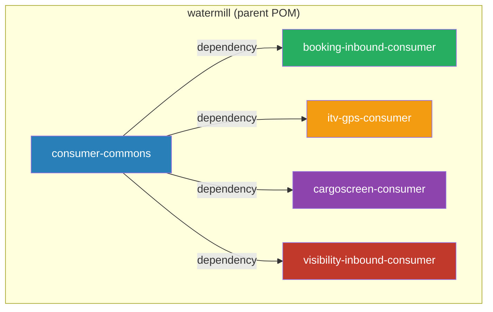
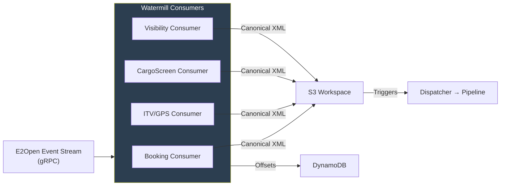
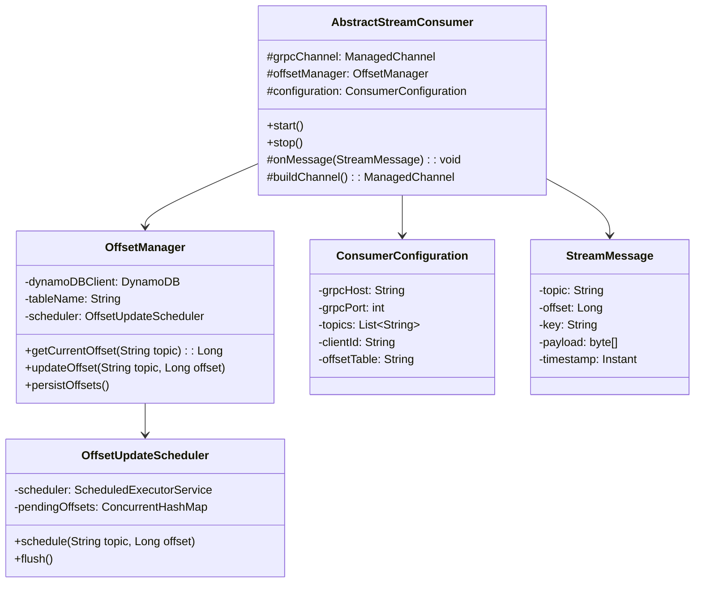
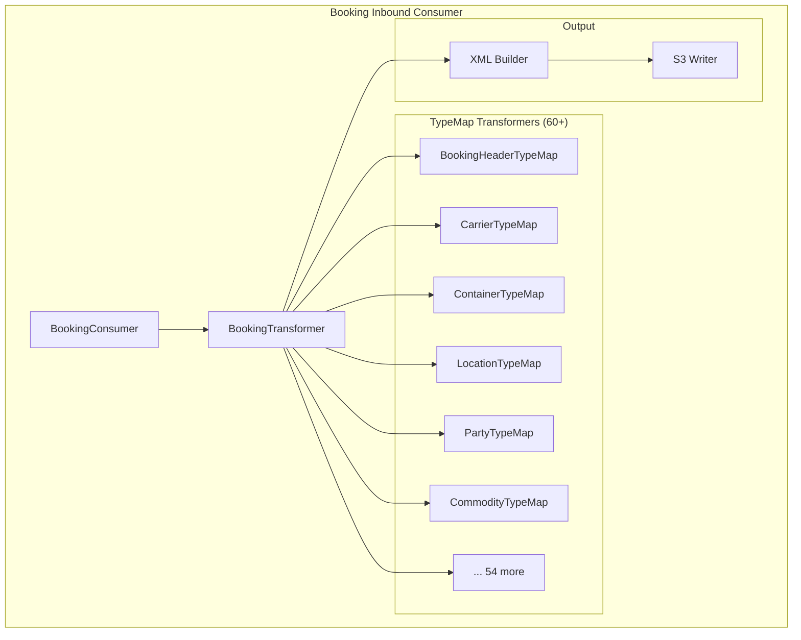
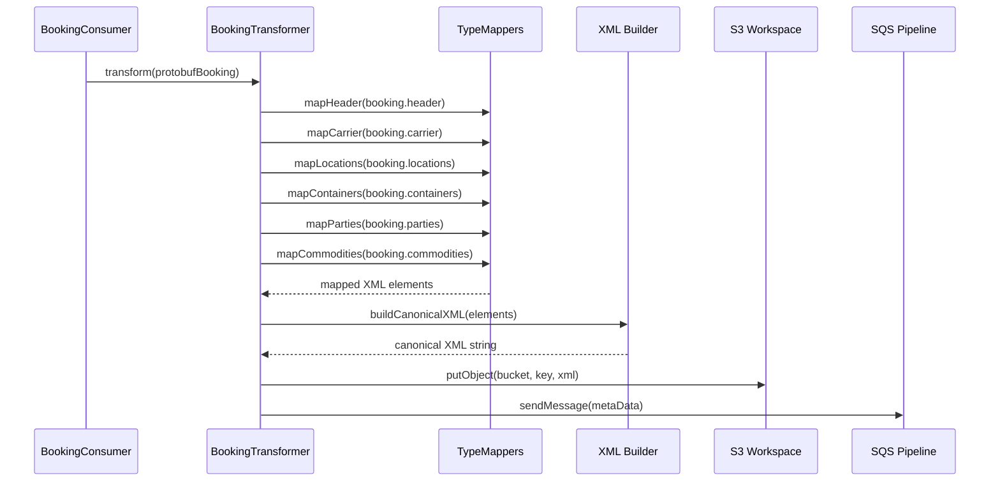
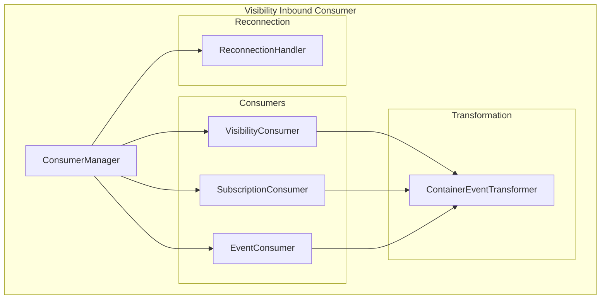
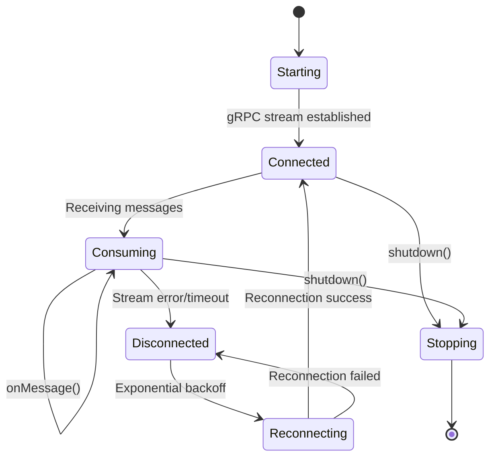
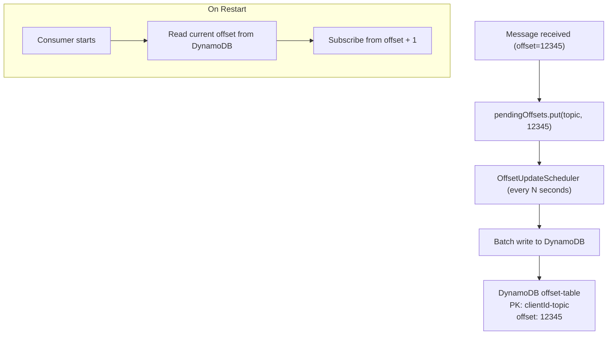

# Watermill Module — Design Document

> **Module:** `watermill`  
> **Generated:** 2026-05-24  
> **Artifact:** `com.inttra.mercury.watermill:watermill:1.0-SNAPSHOT`  
> **Java Version:** 17 | **Framework:** Dropwizard 4.x + Guice 7.x + gRPC 1.77.0 + Protobuf 4.33.1

---

## 1. Executive Summary

The **Watermill** is a multi-module gRPC streaming consumer suite that ingests real-time events from E2Open's event streaming platform. It subscribes to topics (Booking, ITV/GPS, Cargo Screen, Visibility) via bidirectional gRPC streams, transforms incoming Protobuf messages into AppianWay's canonical XML format, and injects them into the pipeline via S3 + SQS. It includes DynamoDB-based offset tracking for reliable at-least-once delivery.

---

## 2. Sub-Module Structure

---

## 3. Role in the Pipeline

---

## 4. Consumer-Commons Architecture

The shared infrastructure for all consumers:

---

## 5. Booking-Inbound-Consumer

The largest sub-module (81 files) handling booking message transformation:

### BookingTransformer Chain

---

## 6. Visibility-Inbound-Consumer

Handles container visibility events with multiple consumer types:

### ConsumerManager Lifecycle

---

## 7. DynamoDB Offset Tracking

**Offset persistence strategy:**
- Offsets are batched in memory (ConcurrentHashMap)
- Periodic flush (scheduler) persists to DynamoDB
- On graceful shutdown: final flush
- On crash: messages since last flush are re-delivered (at-least-once)

---

## 8. gRPC Streaming Configuration

| Parameter | Type | Default | Description |
|-----------|------|---------|-------------|
| `grpcHost` | String | — | E2Open streaming endpoint |
| `grpcPort` | int | `443` | gRPC port |
| `useTls` | boolean | `true` | Enable TLS |
| `clientId` | String | — | Consumer identity |
| `topics` | List | — | Subscribed topics |
| `keepAliveTime` | Duration | `30s` | gRPC keepalive |
| `keepAliveTimeout` | Duration | `10s` | Keepalive timeout |
| `maxInboundMessageSize` | int | `4MB` | Max message bytes |
| `reconnectBackoff` | Duration | `5s` | Initial reconnect delay |
| `reconnectMaxBackoff` | Duration | `60s` | Max reconnect delay |

---

## 9. Configuration Details

| Property | Type | Description |
|----------|------|-------------|
| `consumers[].type` | String | `booking`, `visibility`, `itv-gps`, `cargoscreen` |
| `consumers[].grpcConfig.*` | Object | Per-consumer gRPC settings |
| `consumers[].topics` | List | Topic subscriptions |
| `dynamoDBConfig.tableName` | String | Offset tracking table |
| `dynamoDBConfig.region` | String | AWS region |
| `s3WorkspaceConfig.bucket` | String | Output bucket |
| `sqsDropOffConfig.queueUrl` | String | Pipeline entry queue |
| `offsetFlushInterval` | Duration | DynamoDB write frequency |
| `healthCheck.maxLag` | Duration | Max acceptable consumer lag |

---

## 10. Key Maven Dependencies

| Dependency | Version | Purpose |
|-----------|---------|---------|
| `grpc-netty-shaded` | 1.77.0 | gRPC transport |
| `grpc-protobuf` | 1.77.0 | Protobuf serialization |
| `grpc-stub` | 1.77.0 | Generated stubs |
| `protobuf-java` | 4.33.1 | Protobuf runtime |
| `mercury-shared` | 1.0 | S3, SQS, DynamoDB |
| `dropwizard-core` | 4.0.16 | Application framework |
| `guice` | 7.0.0 | DI container |
| `aws-java-sdk-dynamodb` | 1.12.720 | Offset persistence |
| `netty-*` | 4.2.7 | Network I/O |

---

## 11. Error Handling

| Scenario | Behavior |
|----------|----------|
| gRPC stream error | Reconnect with exponential backoff |
| Transformation failure | Log error, skip message, advance offset |
| DynamoDB write failure | Retry; consumer pauses if persistent |
| S3 upload failure | Retry (shared ExternalCallWrapper) |
| Protobuf parse error | Log + skip (corrupted message) |
| Consumer lag excessive | Health check fails |

---

## 12. Design Patterns

| Pattern | Usage |
|---------|-------|
| **Template Method** | AbstractStreamConsumer base for all consumers |
| **Observer** | gRPC StreamObserver for message delivery |
| **Mapper** | 60+ TypeMap classes (Protobuf → XML) |
| **Scheduler** | OffsetUpdateScheduler for batched persistence |
| **Circuit Breaker** | Reconnection with backoff |
| **Pipeline** | ConsumerManager → Transformer → Writer chain |
