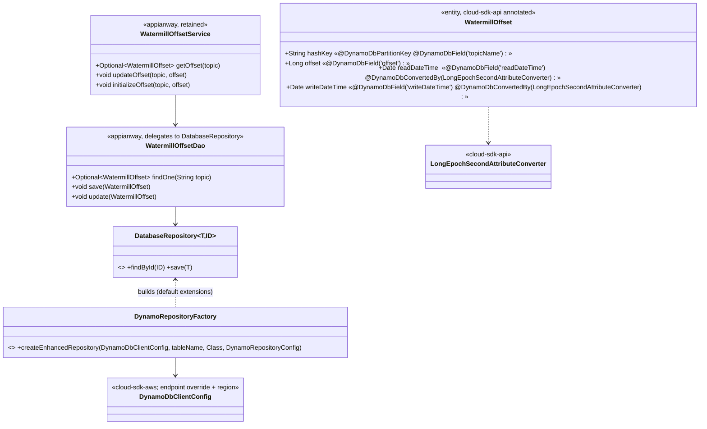
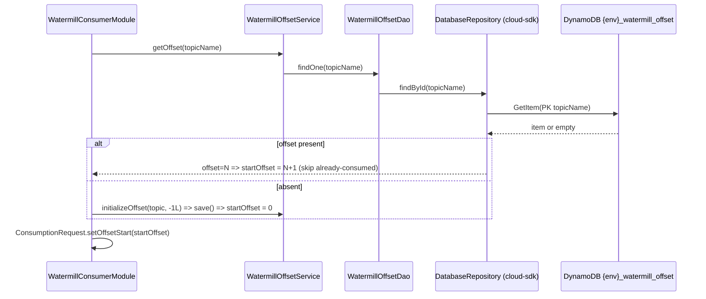
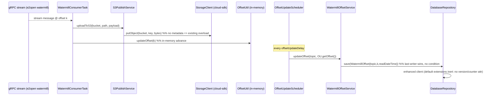
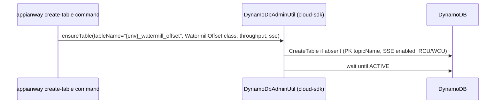

# `watermill` — AWS SDK v2 (cloud-sdk) Upgrade DESIGN (claude)

> Module: `com.inttra.mercury:watermill:1.0` (aggregator + 5 sub-modules) · Date: 2026-05-31 · Author: Claude (Opus 4.8)
> **Chosen option: B — adopt `commons` + `cloud-sdk-api`/`cloud-sdk-aws` (`1.0.26-SNAPSHOT`) on Dropwizard 5**, consuming cloud-sdk as a normal client with **zero module-specific cloud-sdk changes**. Dynamo offset remap is sequenced first as the cloud-sdk DynamoDB pilot.
> Companion plan: [`2026-05-31-watermill-aws2x-upgrade-plan-claude.md`](2026-05-31-watermill-aws2x-upgrade-plan-claude.md). MASTER: [shared DESIGN](../../shared/docs/2026-05-31-shared-aws2x-upgrade-DESIGN-claude.md) §5 (config) / §6 (cloud-sdk specs).

---

## 1. Overview & chosen option

watermill's **only AWS surface** is the DynamoDB `watermill_offset` cursor store, plus a metadata-free S3 write, SNS publish, and SSM credential lookup that ride `shared`. The gRPC stream consumers (`e2open.watermill.proto`) are **not AWS** and are untouched.

Governing rule (master plan §0): **consume cloud-sdk as a client; no cloud-sdk/commons change.** watermill satisfies this with no exceptions — the Dynamo path is fully covered by `DatabaseRepository`/`DynamoRepositoryFactory`/`@Table`/`@DynamoDbField`/`LongEpochSecondAttributeConverter`/`DynamoDbAdminUtil`/`dynamo-integration-test`, and the S3 write needs no metadata (so **S-G2 is not required**).

The migration:
1. re-annotates `WatermillOffset` from v1 datamodeling to `cloud-sdk-api` `@Table`/`@DynamoDbField`, **preserving every attribute name and the physical table name** (§10);
2. replaces `WatermillOffsetDao extends DynamoDBCrudRepository` + `DynamoSupport` (v1 `DynamoDBMapper`) with a `DatabaseRepository<WatermillOffset,String>` built by `DynamoRepositoryFactory.createEnhancedRepository(...)`;
3. replaces per-consumer `DynamoTableCommand` with `DynamoDbAdminUtil`;
4. consolidates the duplicated `cargoscreen`/`itv-gps` copies onto `consumer-commons`;
5. moves the consumer applications onto `commons` `InttraServer` (DW5) with the composed appianway config command (master §5).

---

## 2. Class diagram (target offset persistence)



**Removed v1 types:** `AmazonDynamoDB`, `AmazonDynamoDBClientBuilder`, `DynamoDBMapper`, `DynamoDBMapperConfig`, `@DynamoDBTable/@DynamoDBHashKey/@DynamoDBAttribute/@DynamoDBTypeConverted`, `DynamoDBTypeConverter`, `TableUtils`, `CreateTableRequest`/`ProvisionedThroughput`/`SSESpecification`, `AwsClientBuilder.EndpointConfiguration`, in-house `DynamoDBCrudRepository`/`DynamoHashKey`.
**Consumed cloud-sdk:** `DatabaseRepository<WatermillOffset,String>`, `DynamoRepositoryFactory`, `@Table`/`@DynamoDbField`/(`@DynamoDbPartitionKey`), `LongEpochSecondAttributeConverter`, `DynamoDbClientConfig`, `DynamoDbAdminUtil`.

> `WatermillOffsetDao` keeps its `findOne`/`save`/`update` shape as a thin adapter over `DatabaseRepository.findById`/`save`, so `WatermillOffsetService`/`OffsetUtil`/`OffsetUpdateScheduler` are **unchanged**.

---

## 3. Component diagram

```mermaid
flowchart LR
    subgraph svc[watermill consumer (e.g. cargoscreen / booking-inbound)]
      GRPC[gRPC stream consumer  NON-AWS]
      Task[WatermillConsumerTask]
      OU[OffsetUtil + OffsetUpdateScheduler]
      Svc[WatermillOffsetService]
      Dao[WatermillOffsetDao adapter]
      S3P[S3PublishService]
      SNSpub[SNSEventPublisher]
    end
    subgraph cc[consumer-commons (consolidated)]
      Ent[WatermillOffset entity + converter]
    end
    subgraph cs[cloud-sdk 1.0.26-SNAPSHOT]
      Repo[DatabaseRepository / DynamoRepositoryFactory]
      Store[StorageClient]
      Notif[NotificationService]
      PS[CloudParameterStore]
    end
    DDB[(DynamoDB watermill_offset)]
    S3[(S3)]
    SNS[(SNS)]

    GRPC --> Task --> OU --> Svc --> Dao --> Repo --> DDB
    Task --> S3P --> Store --> S3
    Task --> SNSpub --> Notif --> SNS
    Dao -. uses .-> Ent
    PS -. credentials .-> GRPC
```

gRPC ↔ offset repo ↔ cloud-sdk `DatabaseRepository` ↔ DynamoDB is the spine; S3/SNS/SSM are peripheral and ride `shared`'s migrated wrappers.

---

## 4. Sequence diagrams

### 4.1 Startup — seed consumption offset (at-least-once)


### 4.2 Steady state — consume gRPC msg → process → commit offset


**At-least-once contract preserved:** the cursor is advanced in-memory per message and flushed to DynamoDB by the scheduler; on restart the consumer resumes at `persisted+1`. A crash between flushes re-consumes from the last persisted offset — identical to the v1 behavior (the table, not a conditional write, provides the guarantee).

### 4.3 Create table (admin command)


---

## 5. Configuration (ref master DESIGN §5)

- **Endpoint / region:** v1 `AwsClientBuilder.EndpointConfiguration(regionEndpoint, signingRegion)` (DynamoSupport L61–73) → `DynamoDbClientConfig` with `endpointOverride(regionEndpoint)` + `Region.of(signingRegion)`. When `regionEndpoint` is blank, use the default chain (matches v1 `AmazonDynamoDBClientBuilder.standard().build()`).
- **Table name:** physical name = `"{DynamoDbConfig.environment}_watermill_offset"`, passed explicitly as the `tableName` argument to `DynamoRepositoryFactory.createEnhancedRepository(...)` (reproduces the v1 prefix resolver, DynamoSupport L44–51). `@Table(name="watermill_offset")` is the logical default; the explicit `tableName` wins.
- **SSE / throughput:** carried on the create path via `DynamoDbAdminUtil` (SSE from `DynamoDbConfig.sseEnabled`; RCU/WCU 10/10 as today, or `onDemand` if elected).
- **Credentials:** env/IAM via v2 default providers; SSM lookups (`userIdKey`/`passwordKey`) move to `CloudParameterStore` with the `shared` migration.
- **Option B:** register the composed appianway `ServerCommand` (master §5) on each consumer's `InttraServer` bootstrap.

---

## 6. cloud-sdk gaps — **NONE (full mapping below)**

| v1 element (file:line) | cloud-sdk replacement | Notes |
|---|---|---|
| `@DynamoDBTable(tableName="watermill_offset")` (WatermillOffset L19) | `@Table(name="watermill_offset")` (cloud-sdk-api) | logical name; physical via explicit `tableName` |
| `@DynamoDBHashKey(attributeName="topicName") hashKey` (L29) | `@DynamoDbPartitionKey @DynamoDbField("topicName")` on `hashKey` | **attribute name preserved** |
| `@DynamoDBAttribute Long offset` (L33) | `@DynamoDbField("offset")` | preserved |
| `@DynamoDBAttribute @DynamoDBTypeConverted(DateToEpochSecond) Date readDateTime/writeDateTime` (L37–43) | `@DynamoDbField(...)` + `LongEpochSecondAttributeConverter` | epoch-**seconds** `Long` stored — identical shape |
| `DateToEpochSecond` (DateToEpochSecond L7–17) | `LongEpochSecondAttributeConverter` (cloud-sdk-api) | `getTime()/1000` ↔ `new Date(epoch*1000)` |
| `WatermillOffsetDao extends DynamoDBCrudRepository` + injected `DynamoDBMapper`/`Config` | `DatabaseRepository<WatermillOffset,String>` via `DynamoRepositoryFactory.createEnhancedRepository(...)` | DAO becomes a thin adapter keeping `findOne/save/update` |
| `DynamoSupport.newClient/newMapper/newDynamoDBMapperConfig` (L22–73) | `DynamoDbClientConfig` + `DynamoRepositoryFactory` | client+mapper construction folded into the factory |
| `DynamoTableCommand` (TableUtils + generateCreateTableRequest + SSE/throughput) | `DynamoDbAdminCommand` / `DynamoDbAdminUtil` | SSE + RCU/WCU on the create request |
| `AwsClientBuilder.EndpointConfiguration` | `DynamoDbClientConfig` endpoint override | DynamoDB-Local / regional |
| v1 local-dynamo test setup | `dynamo-integration-test` (DynamoDB-Local, JUnit 5) | offset round-trip tests |

`@DynamoDbVersionAttribute` (default `VersionedRecordExtension`) is available but **unused** (no optimistic locking — plan §3.4). S3 write is metadata-free ⇒ **S-G2 not used here**.

---

## 7. Maven dependency changes (pin `1.0.26-SNAPSHOT`)

Aggregator `dependencyManagement` + each sub-module:
```xml
<properties>
  <mercury.commons.version>1.0.26-SNAPSHOT</mercury.commons.version>
</properties>
<dependency><groupId>com.inttra.mercury</groupId><artifactId>cloud-sdk-api</artifactId><version>${mercury.commons.version}</version></dependency>
<dependency><groupId>com.inttra.mercury</groupId><artifactId>cloud-sdk-aws</artifactId><version>${mercury.commons.version}</version></dependency>
<!-- Option B only -->
<dependency><groupId>com.inttra.mercury</groupId><artifactId>commons</artifactId><version>${mercury.commons.version}</version></dependency>
<dependency><groupId>com.inttra.mercury</groupId><artifactId>dynamo-integration-test</artifactId><version>${mercury.commons.version}</version><scope>test</scope></dependency>
```
**Remove** `com.amazonaws:aws-java-sdk-{dynamodb,sqs}` from `consumer-commons` and each consumer; remove the in-house `dynamo-client` dependency once `DynamoDBCrudRepository` usage is gone; drop `<aws-java-sdk.version>` when unreferenced. S3/SNS v1 (`aws-java-sdk-{s3,sns}`) leave with the `shared` migration. cloud-sdk-aws transitively brings `software.amazon.awssdk:dynamodb-enhanced` (+ s3/sns/ssm) with Netty excluded. Tests already on `junit-jupiter` (no vintage bridge needed).

---

## 8. Test details

- **Offset persistence:** `WatermillOffsetDaoTest`/`WatermillOffsetServiceTest` move to `dynamo-integration-test` (DynamoDB-Local) — assert: write→read round-trip; `topicName`/`offset`/`readDateTime`/`writeDateTime` stored under the **exact** attribute names; epoch-seconds value of the date fields; `findById(absent)` → empty → `initializeOffset` path.
- **Backward-compat fixture (critical):** seed DynamoDB-Local with an item shaped like a real `{env}_watermill_offset` row (string PK, numeric epoch-seconds dates) and assert the migrated entity deserializes it and `+1` resume works (DESIGN §10 / §4.1).
- **Converter:** `DateToEpochSecondTest` → assert `LongEpochSecondAttributeConverter` produces the same stored `Long` for representative dates.
- **`S3PublishService`:** re-point to a `StorageClient` fake (functional-testing); assert `putObject(bucket,key,bytes)` called, return ignored.
- **Create-table:** per-consumer `DynamoTableCommandTest` → assert `DynamoDbAdminUtil` creates `{env}_watermill_offset` with SSE + throughput.
- **gRPC consumer tests:** unchanged (non-AWS).

---

## 9. Rollout & verification

1. Land cloud-sdk `1.0.26-SNAPSHOT` consumption (no cloud-sdk change required for watermill).
2. **Pilot:** migrate `consumer-commons` Dynamo path (entity + converter + DAO adapter + repository factory wiring) → `mvn -pl consumer-commons -am verify` with `dynamo-integration-test`.
3. **Consolidate:** delete the `cargoscreen`/`itv-gps` duplicate `vo`/`dao`/`dynamodb` copies; repoint to `consumer-commons`.
4. Migrate each consumer's `WatermillConsumerModule` (bind `DatabaseRepository`-built DAO instead of `DynamoDBMapper`) and replace `DynamoTableCommand` → `DynamoDbAdminUtil`; `mvn -pl <consumer> -am verify` one at a time.
5. After `shared`/`functional-testing` migrate, rebind S3 (`StorageClient`)/SNS (`NotificationService`)/SSM (`CloudParameterStore`) and (Option B) move applications onto `InttraServer`/DW5 with the composed config command.
6. Aggregator `mvn verify`; **gate the production cutover on the backward-compat offset fixture passing against a snapshot of real table items.**

---

## 10. Risks & mitigations

| Risk | Mitigation |
|---|---|
| **Offset-table data-shape incompatibility** — migrated entity maps to a different physical table or renames an attribute ⇒ in-flight offsets lost → silent re-consumption from 0 / duplicate or skipped delivery | **Highest-priority.** Preserve the **physical table name** `{env}_watermill_offset` (explicit `tableName` to the factory) and the **exact** attribute names `topicName`/`offset`/`readDateTime`/`writeDateTime` via `@DynamoDbField`. Keep epoch-**seconds** via `LongEpochSecondAttributeConverter`. Verify with a `dynamo-integration-test` fixture seeded from real items before cutover. |
| Enhanced-client default extensions alter writes | Confirmed inert (no `@DynamoDbVersionAttribute`/`@DynamoDbAtomicCounter` on the entity); assert plain put semantics in tests |
| Four divergent conversions across sub-modules | Consolidate to `consumer-commons` first; delete duplicates |
| SSE / throughput dropped on create | Carry SSE + RCU/WCU through `DynamoDbAdminUtil`; assert in `DynamoTableCommandTest` |
| `@DynamoDBStream(KEYS_ONLY)` create-time stream spec lost | Confirm whether the v2 create path must set the stream spec; if so, set it on the create request (or manage out-of-band) |
| DW4→5 on a live cursor store (Option B) | Sequence the Dynamo remap first/independently; framework move after `shared`; per-module verify gates |
| Region/endpoint resolution drift | Map `regionEndpoint`/`signingRegion` to `DynamoDbClientConfig`; dev-run parity check |
