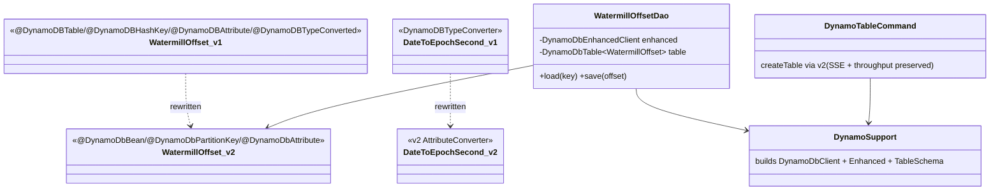
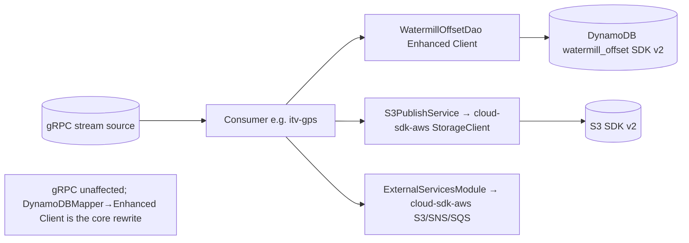
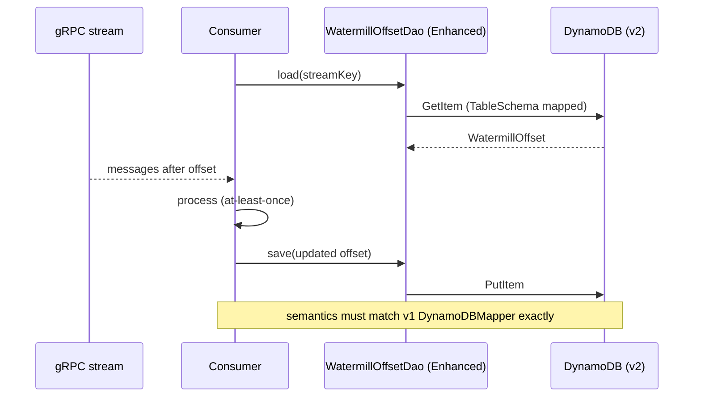

# `watermill` (aggregator + sub-modules) — AWS SDK v2 (cloud-sdk) Upgrade DESIGN

> **DIRECTIVE UPDATE (2026-05-31) — supersedes the Option-A recommendation in this document.** Per stakeholder direction the program now targets **Dropwizard 5** and **Option B — adopt `commons` + `cloud-sdk-api`/`cloud-sdk-aws`** as the directed default (recommend Option A only on a categorical technical blocker). All AWS service communication goes through `cloud-sdk-api`; new tests are written in **JUnit 5 (Jupiter)** (existing JUnit 4 runs via JUnit Vintage during transition); configuration follows the composed appianway `.properties`/`${PROFILE}`/`${ENV}` + commons `${awsps:...}` model in the master [shared plan §10](../../shared/docs/2026-05-31-shared-aws2x-upgrade-plan-copilot.md). cloud-sdk gaps are indexed in the master [shared plan §11](../../shared/docs/2026-05-31-shared-aws2x-upgrade-plan-copilot.md) with full technical specs in the master [shared DESIGN §1A.6](../../shared/docs/2026-05-31-shared-aws2x-upgrade-DESIGN.md).
> **Module-specific cloud-sdk gaps:** G6 (config). DynamoDB is **fully covered** by cloud-sdk: `WatermillOffsetDao`→`DatabaseRepository`, `DateToEpochSecond`→`DateEpochSecondAttributeConverter`, `DynamoTableCommand`→`DynamoDbAdminCommand`/`DynamoDbAdminUtil`; verify G4 only if an entity uses a version attribute. The gRPC stream consumers are not SQS, so G1 does not apply; use `dynamo-integration-test` for the DynamoDB `watermill_offset` at-least-once delivery tests.
> Sections below are retained as the Option-A fallback reference.

> Module: `watermill` (`consumer-commons` + itv-gps/cargoscreen/booking-inbound/visibility-inbound consumers) · Date: 2026-05-31 · Author: GitHub Copilot (Claude Opus 4.8) · Option **A**
> Companion: [plan](2026-05-31-watermill-aws2x-upgrade-plan-copilot.md). Session `83b822b011714117`.

## 1. Overview
Rewrite the DynamoDB layer from the v1 `DynamoDBMapper` data-modeling API to the **AWS SDK v2 DynamoDB Enhanced Client**, and rebind S3/SNS/SQS to `cloud-sdk-aws`. Preserve at-least-once offset semantics exactly. gRPC stream consumption unchanged. Keep Dropwizard 4 / JUnit 4 (unit tests); use `dynamo-integration-test` for DynamoDB integration tests.

## 2. Class diagram (DynamoDB layer before → after)

## 3. Component diagram

## 4. Sequence diagram (offset read → process → commit)

## 5. Configuration changes
- DynamoDB region/table config retained; mapped to v2 `DynamoDbClient` builder. SSE + provisioned-throughput preserved in `DynamoTableCommand`.
- S3/SNS/SQS client config rebound to `cloud-sdk-aws` factories. `${PROFILE}`/`${ENV}` naming unchanged.

## 6. Maven dependency changes (per sub-module)
- **Remove:** `aws-java-sdk-{dynamodb,s3,sns,sqs}`.
- **Add:** `cloud-sdk-api`, `cloud-sdk-aws`, `software.amazon.awssdk:dynamodb-enhanced` (if used directly), `dynamo-integration-test` (test).
- Manage versions in the watermill aggregator `dependencyManagement` (v2 BOM 2.30.24).

## 7. Test details
- **DynamoDB:** adopt `dynamo-integration-test`; rewrite `WatermillOffsetDao`/`DynamoSupport` tests against the Enhanced Client; add a **serialization round-trip** test for `WatermillOffset` (incl. `DateToEpochSecond`) and **offset-equivalence** tests vs the v1 behavior.
- **S3PublishService:** re-point to `StorageClient` fakes; drop ignored `PutObjectResult`.
- **gRPC:** unchanged.
- Unit tests JUnit 4; note if `dynamo-integration-test` requires Jupiter for its integration tests.

## 8. Rollout & verification
Independent track (if no `shared` dependency). Order: `consumer-commons` → consumers. `mvn -pl watermill/... verify`. Validate offset behavior against local/real DynamoDB with `dynamo-integration-test`.

## 9. Risks & mitigations
| Risk | Mitigation |
|---|---|
| Offset semantics drift | Equivalence + integration tests on real/local DynamoDB |
| Annotation/converter mapping gaps | Explicit v2 `@DynamoDbBean`/`AttributeConverter`; round-trip tests |
| SSE/throughput dropped | Preserve in v2 createTable; assert |
| Divergent conversions across 5 modules | Optionally centralize in consumer-commons |
| Test-framework split (JUnit4 vs Jupiter) | Isolate harness; flag if forced |
