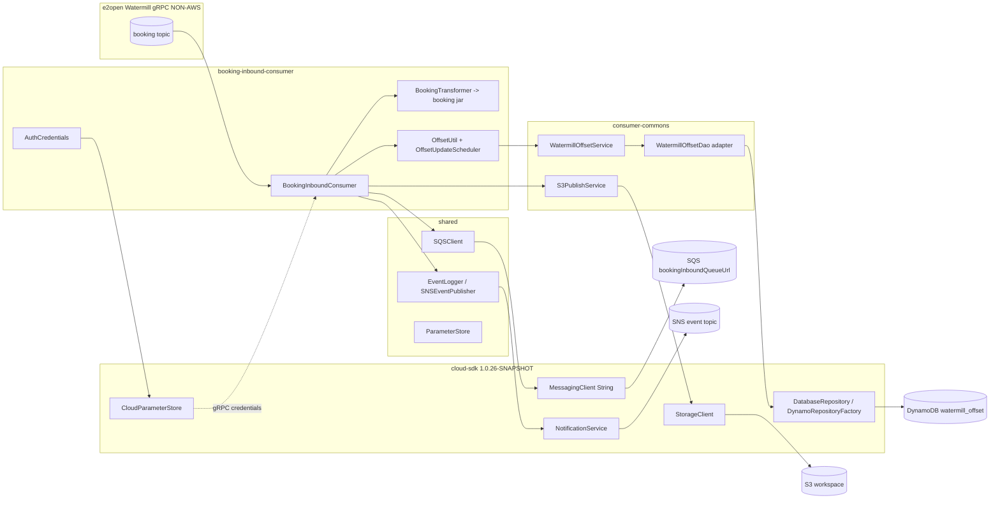
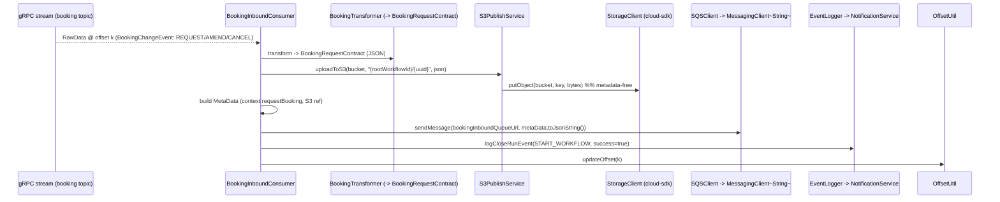
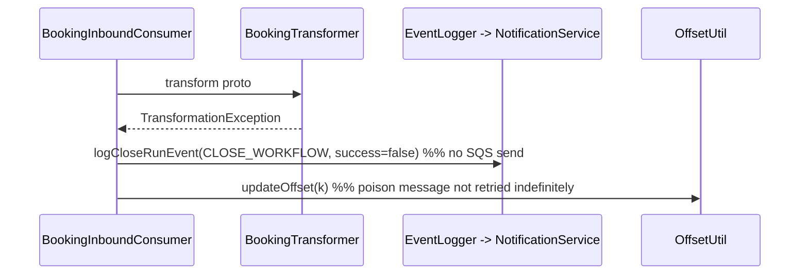
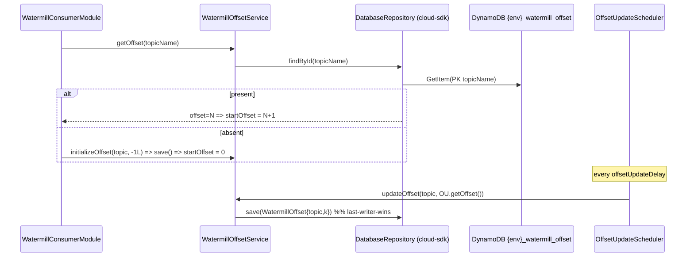

# `booking-inbound-consumer` — AWS SDK v2 (cloud-sdk) Upgrade DESIGN (claude)

> Module: `com.inttra.mercury:booking-inbound-consumer` (sub-module of `watermill`) · Date: 2026-06-30 · Author: Claude (Opus 4.8)
> **Chosen option: B — adopt `commons` + `cloud-sdk-api`/`cloud-sdk-aws` (`1.0.26-SNAPSHOT`) on Dropwizard 5**, consuming cloud-sdk as a normal client with **zero module-specific cloud-sdk changes** (all S3 writes are metadata-free ⇒ **S-G2 not required**).
> Companion plan: [`2026-06-30-booking-inbound-consumer-aws2x-upgrade-plan-claude.md`](2026-06-30-booking-inbound-consumer-aws2x-upgrade-plan-claude.md).
> MASTERs: [shared DESIGN](../../../shared/docs/2026-05-31-shared-aws2x-upgrade-DESIGN-claude.md) §5/§6 · [watermill DESIGN](../../docs/2026-05-31-watermill-aws2x-upgrade-DESIGN-claude.md) (offset-store remap + `consumer-commons` consolidation).
> Cross-workspace parity: depends on the `mercury-services` `booking` model jar (`booking:2.1.1.M`) for `BookingRequestContract` — version alignment is a first-class concern (§6, §10).

---

## 1. Overview & chosen option

`booking-inbound-consumer` is a **full pipeline-entry** consumer (like `visibility-inbound-consumer`, but single-topic). It subscribes to one e2open Watermill gRPC booking topic, parses proto `BookingChangeEvent` (filtering REQUEST/AMEND/CANCEL states), transforms it to INTTRA's `BookingRequestContract` via `BookingTransformer` + ~41 type-map classes, archives the JSON to S3 (`{rootWorkflowId}/{uuid}`), sends a `MetaData` envelope to **one** SQS queue (`bookingInboundQueueUrl`) that feeds the booking workflow engine, and logs `START_WORKFLOW`/`CLOSE_WORKFLOW` events to SNS.

Its AWS surface: **S3 (write, metadata-free) + SQS (send, 1 queue) + SNS (event publish) + DynamoDB (single consumption offset) + SSM (gRPC credentials)**. The gRPC/Watermill layer (`BookingInboundConsumer` `StreamObserver`, transformers, type-maps, reconnect) is **not AWS** and is untouched.

**Governing rule (master plan §0):** consume cloud-sdk as a client; **no cloud-sdk/commons change.** booking-inbound satisfies it cleanly:

- **DynamoDB offset** → re-annotate `WatermillOffset` to cloud-sdk-api `@Table`/`@DynamoDbPartitionKey`/`@DynamoDbField` and use `DatabaseRepository<WatermillOffset,String>` via `DynamoRepositoryFactory`. booking-inbound **already reuses `consumer-commons`** (not a duplicate), so it inherits the consolidated offset layer (watermill DESIGN §1–§2).
- **S3 write** → `S3PublishService` over `StorageClient.putObject(bucket,key,bytes)` — metadata-free, **S-G2 not used**.
- **SQS send (1 queue)** → `shared` `SQSClient` over cloud-sdk-api `MessagingClient<String>.sendMessage(url, body)`.
- **SNS publish** → `shared` `SNSEventPublisher`/`EventLogger` over cloud-sdk-api `NotificationService`.
- **SSM gRPC credentials** (`AuthCredentials`) → `shared` `ParameterStore` over `CloudParameterStore`.
- **Dropwizard 4→5** → move onto `commons` `InttraServer` with the composed appianway config command (master §5).

> **Model-jar coupling (module-specific):** the transformer output type `BookingRequestContract` comes from `com.inttra.mercury:booking:2.1.1.M`. The `booking` module is one of the already-cloud-sdk-upgraded `mercury-services` consumers, so its jar may already be cloud-sdk-aligned; the contract is the **JSON shape** the booking workflow engine consumes. Align the jar version deliberately (§6, §10, plan §2.7/§3).

---

## 2. Class diagram (target consumer wiring)

```mermaid
classDiagram
    class BookingInboundConsumer { <<StreamObserver~RawData~; parses BookingChangeEvent; NON-AWS transform>> }
    class BookingTransformer { <<+41 type-maps -> BookingRequestContract (booking jar); NON-AWS>> }
    class S3PublishService { <<consumer-commons, over StorageClient>> }
    class SQSClient { <<shared, over MessagingClient~String~>> }
    class EventLogger { <<shared, over SNSEventPublisher/NotificationService>> }
    class WatermillOffsetService { <<consumer-commons, retained>> }
    class WatermillOffsetDao { <<consumer-commons, adapter over DatabaseRepository>> }
    class AuthCredentials { <<gRPC creds from CloudParameterStore>> }

    class WatermillOffset { <<entity: @Table/@DynamoDbPartitionKey/@DynamoDbField>> }
    class DatabaseRepository~T,ID~ { <<cloud-sdk-api>> +findById(ID) +save(T) }
    class StorageClient { <<cloud-sdk-api>> +putObject(bucket,key,bytes) }
    class MessagingClient~T~ { <<cloud-sdk-api>> +sendMessage(url,body) }
    class NotificationService { <<cloud-sdk-api>> }
    class CloudParameterStore { <<cloud-sdk-api>> }
    class BookingRequestContract { <<mercury-services booking jar>> }

    BookingInboundConsumer --> BookingTransformer --> BookingRequestContract
    BookingInboundConsumer --> S3PublishService --> StorageClient
    BookingInboundConsumer --> SQSClient --> MessagingClient
    BookingInboundConsumer --> EventLogger --> NotificationService
    BookingInboundConsumer --> WatermillOffsetService --> WatermillOffsetDao --> DatabaseRepository
    AuthCredentials --> CloudParameterStore
```

**Removed v1 types:** `AmazonS3`/`AmazonS3ClientBuilder`, `AmazonSQS`/`AmazonSQSClientBuilder`, `AmazonSNS`/`AmazonSNSClientBuilder`, `AWSSimpleSystemsManagement`, `AmazonDynamoDB`/`AmazonDynamoDBClientBuilder`, `DynamoDBMapper`/`DynamoDBMapperConfig`, `@DynamoDBTable/@DynamoDBHashKey/@DynamoDBAttribute/@DynamoDBTypeConverted`, `DynamoDBTypeConverter`, `AwsClientBuilder.EndpointConfiguration`, `ClientConfiguration`, `DefaultAWSCredentialsProviderChain`, `PutObjectResult`/`SendMessageRequest`/`PublishRequest`/`GetParametersRequest`.
**Consumed cloud-sdk:** `StorageClient`, `MessagingClient<String>`, `NotificationService`, `CloudParameterStore`, `DatabaseRepository<WatermillOffset,String>`, `DynamoRepositoryFactory`, `@Table`/`@DynamoDbPartitionKey`/`@DynamoDbField`, `LongEpochSecondAttributeConverter`, `DynamoDbClientConfig`, `DynamoDbAdminUtil`/`DynamoDbAdminCommand`.

---

## 3. Component diagram



The spine is **gRPC stream → transform to `BookingRequestContract` → S3 archive + SQS handoff + SNS event → commit offset**. Every AWS edge terminates in a cloud-sdk-api client.

---

## 4. Sequence diagrams

### 4.1 Steady state — consume → transform → S3 + SQS + SNS → offset


### 4.2 Transformation failure path


### 4.3 Startup seed + periodic offset flush


**At-least-once preserved:** the cursor advances in-memory per message and flushes on the scheduler; on restart the stream resumes at `persisted+1`. On reconnect the offset is persisted and incremented by 1 to avoid duplicates (existing behavior).

---

## 5. Configuration (ref master DESIGN §5)

- **Single topic / single offset row:** the configured booking topic; one `WatermillOffset` row keyed by topic name; physical `tableName = "{environment}_watermill_offset"` passed explicitly to `DynamoRepositoryFactory`.
- **SQS queue preserved:** `bookingInboundQueueUrl`; `SQSClient.sendMessage(url, body)` → `MessagingClient<String>.sendMessage(url, body)` (no `FAILED_ATTEMPTS` used here).
- **SNS event topic:** `snsEventConfig.topicArn`; `EventLogger`/`SNSEventPublisher` ride `shared` over `NotificationService`.
- **S3 bucket:** `s3WorkspaceConfig.bucket`; metadata-free `StorageClient.putObject`; key `{rootWorkflowId}/{uuid}` preserved.
- **DynamoDB endpoint/region:** v1 `AwsClientBuilder.EndpointConfiguration` → `DynamoDbClientConfig.endpointOverride(regionEndpoint)` + `Region.of(signingRegion)`. SSE/throughput via `DynamoDbAdminUtil`.
- **gRPC credentials:** `watermillServiceConfig.userIdKey`/`passwordKey` from `ParameterStore` → `CloudParameterStore`. gRPC reconnect is non-AWS and unchanged.
- **Config loading:** v1 `S3ConfigurationProvider` + `ConfigProcessingServerCommand`. **Option B:** register the composed appianway `ServerCommand` (master §5/§10.3) on the `InttraServer` bootstrap. Config keys unchanged.

---

## 6. cloud-sdk gaps — **NONE (full mapping below)**

| v1 element | cloud-sdk replacement | Notes |
|---|---|---|
| `S3PublishService.uploadToS3` → `s3.putObject(bucket,key,String)` | `StorageClient.putObject(bucket,key,bytes)` | **metadata-free ⇒ S-G2 NOT required** |
| `SQSClient.sendMessage(url, body)` (1 queue) | `MessagingClient<String>.sendMessage(url, body)` | shared wrapper; `MetaData.toJsonString()` body |
| `SNSEventPublisher`/`EventLogger.logCloseRunEvent` (`AmazonSNS`) | `NotificationService` (via shared `SNSEventPublisher`) | START/CLOSE_WORKFLOW events |
| `ParameterStore`/`SsmParameterSupplier` (`AWSSimpleSystemsManagement`) | `CloudParameterStore` (via shared `ParameterStore`) | gRPC `AuthCredentials` |
| `@DynamoDBTable("watermill_offset")` + `@DynamoDBHashKey("topicName")` + `@DynamoDBAttribute offset/readDateTime/writeDateTime` + `@DynamoDBTypeConverted(DateToEpochSecond)` | `@Table("watermill_offset")` + `@DynamoDbPartitionKey @DynamoDbField("topicName")` + `@DynamoDbField(...)` + `LongEpochSecondAttributeConverter` | **attribute names + epoch-seconds preserved**; entity is **shared via `consumer-commons`** (no local copy) |
| `WatermillOffsetDao extends DynamoDBCrudRepository` + `DynamoSupport` (`DynamoDBMapper`) | `DatabaseRepository<WatermillOffset,String>` via `DynamoRepositoryFactory` | adapter in `consumer-commons` (already reused) |
| `DynamoTableCommand` (TableUtils + SSE + throughput) | `DynamoDbAdminCommand`/`DynamoDbAdminUtil` | preserve SSE + RCU/WCU |
| `AwsClientBuilder.EndpointConfiguration` | `DynamoDbClientConfig` endpoint override | DynamoDB-Local / regional |
| `DefaultAWSCredentialsProviderChain` | v2 `DefaultCredentialsProvider`/`DefaultAwsRegionProviderChain` | env/IAM unchanged |

`@DynamoDbVersionAttribute` available but **unused**. **S-G2 not used.** No module-specific cloud-sdk change required.

> **Parity note:** because booking-inbound feeds the `booking` domain (already cloud-sdk-aligned in `mercury-services`), it uses the identical cloud-sdk-api abstractions (`MessagingClient`, `NotificationService`, `StorageClient`, `DatabaseRepository`) the booking platform uses — keeping the SQS body byte-compatible with the booking workflow engine.

---

## 7. Maven dependency changes (pin `1.0.26-SNAPSHOT`)

`watermill` aggregator `dependencyManagement` + this module's `pom.xml`:
```xml
<properties><mercury.commons.version>1.0.26-SNAPSHOT</mercury.commons.version></properties>
<dependency><groupId>com.inttra.mercury</groupId><artifactId>cloud-sdk-api</artifactId><version>${mercury.commons.version}</version></dependency>
<dependency><groupId>com.inttra.mercury</groupId><artifactId>cloud-sdk-aws</artifactId><version>${mercury.commons.version}</version></dependency>
<!-- Option B -->
<dependency><groupId>com.inttra.mercury</groupId><artifactId>commons</artifactId><version>${mercury.commons.version}</version></dependency>
<dependency><groupId>com.inttra.mercury</groupId><artifactId>dynamo-integration-test</artifactId><version>${mercury.commons.version}</version><scope>test</scope></dependency>
```
**Remove:** `com.amazonaws:aws-java-sdk-{dynamodb,sqs,sns,s3,ssm}` (direct in `consumer-commons` / transitive via `shared`); the in-house `dynamo-client` once `DynamoDBCrudRepository` usage is gone; drop `<aws-java-sdk.version>`. `cloud-sdk-aws` transitively brings `software.amazon.awssdk:{dynamodb-enhanced,sqs,sns,s3,ssm,apache-client}` with **Netty excluded**.
**Align (module-specific):** keep `com.inttra.mercury:booking` (`2.1.1.M`) at a version whose `BookingRequestContract` matches the cloud-sdk-aligned `booking` platform; confirm it pulls no residual AWS v1 (its existing pom exclusions already strip v1 SDK jars).
**Tests:** module is **already on JUnit 5** (Jupiter `5.10.1`) — **no `junit-vintage-engine` bridge needed**.
**gRPC/proto:** `io.grpc:*` `1.77.0` + the `e2open.watermill.proto` booking deps are **unchanged** (non-AWS).

---

## 8. Test details

- **Offset persistence:** inherited from the `consumer-commons` pilot (DynamoDB-Local round-trip; exact attribute names; epoch-seconds; absent→`initializeOffset`); add a booking-topic-keyed fixture.
- **Backward-compat fixture (critical):** seed a real-shaped `{env}_watermill_offset` item for the booking topic key; assert `+1` resume.
- **S3 write:** re-point `S3PublishService` to a `StorageClient` fake; assert `putObject(bucket,"{rootWorkflowId}/{uuid}",bytes)`.
- **SQS send:** re-point `SQSClient` to a `MessagingClient<String>` fake; assert `sendMessage(bookingInboundQueueUrl, metaData.toJsonString())` on the success path and **no send** on the `TransformationException` path.
- **SNS:** assert `EventLogger` emits `START_WORKFLOW` (success) / `CLOSE_WORKFLOW` (failure) to `snsEventConfig.topicArn` over the `NotificationService` fake.
- **Transformers (~41 classes):** unchanged unit tests, but **recompile against the aligned `booking` jar**; assert proto→`BookingRequestContract` JSON shape is unchanged (contract for the booking workflow engine).
- **gRPC consumer / reconnect:** unchanged (non-AWS) — keep green.

---

## 9. Rollout & verification

1. Land cloud-sdk `1.0.26-SNAPSHOT` consumption (no cloud-sdk change required).
2. **Pilot the Dynamo offset path in `consumer-commons`** → `mvn -pl watermill/consumer-commons -am verify` with `dynamo-integration-test`. (booking-inbound already reuses it — no local duplicate to delete.)
3. After `shared`/`functional-testing` migrate, rebind **S3 (`StorageClient`) / SQS (`MessagingClient`) / SNS (`NotificationService`) / SSM (`CloudParameterStore`)**.
4. **Align the `booking` model jar** version; recompile transformers; fix any model/package moves.
5. Move the application onto `commons` `InttraServer`/DW5 with the composed appianway config command.
6. `mvn -pl watermill/booking-inbound-consumer -am verify`; then aggregator `mvn verify`.
7. **Gate cutover** on (a) the backward-compat offset fixture for the booking topic and (b) a contract check that the SQS body (`MetaData` + `BookingRequestContract` JSON) is still accepted by the booking workflow engine.

---

## 10. Risks & mitigations

| Risk | Mitigation |
|---|---|
| **Offset-table data-shape incompatibility** — wrong physical table or renamed attribute ⇒ booking offset lost → silent re-consumption from 0 (duplicate booking workflows) | **Highest priority.** Preserve `{env}_watermill_offset` (explicit `tableName`) + exact attribute names; epoch-seconds via `LongEpochSecondAttributeConverter`; verify with a real-item `dynamo-integration-test` fixture before cutover. |
| **`booking` model jar drift** — recompiling against an aligned `booking` release whose `BookingRequestContract` shape moved ⇒ SQS body changes and the booking workflow engine rejects it | Align the jar version deliberately (§7); diff produced JSON against a captured sample; add a contract test on the SQS body; coordinate with the booking platform owners. |
| SQS body / message size | The S3 archive holds the full `BookingRequestContract`; only the `MetaData` (S3 ref) goes on SQS, so SQS stays under 256 KB. Assert the S3-offload path. |
| Duplicate booking on poison-message offset advance | Existing behavior preserved (failure logs CLOSE_WORKFLOW, advances offset); ensure the migrated offset write semantics are unchanged. |
| Enhanced-client default extensions alter writes | Confirmed inert; assert plain put. |
| SSE / throughput / stream spec dropped on create | Carry through `DynamoDbAdminUtil`; assert in `DynamoTableCommandTest`. |
| Retry/timeout parity on SQS/SNS | Reapply v1 tuning via `ClientOverrideConfiguration`/`ApacheHttpClient` at the shared/factory boundary; unit-test v2 `SdkException` → `RecoverableException`. |
| DW4→5 on a live booking feed (Option B) | Sequence Dynamo remap first; framework move after `shared`; per-module verify gate. |
| Region/endpoint resolution drift | Map `regionEndpoint`/`signingRegion` to `DynamoDbClientConfig`; dev-run parity check. |
