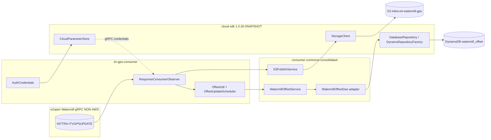
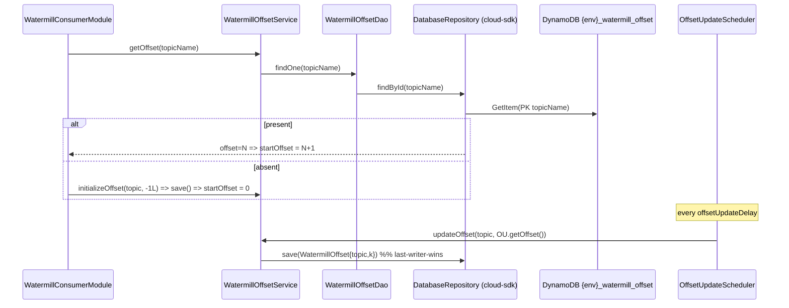
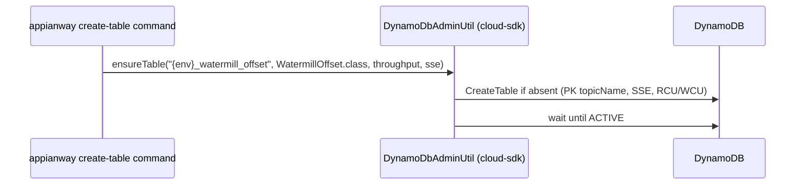

# `itv-gps-consumer` — AWS SDK v2 (cloud-sdk) Upgrade DESIGN (claude)

> Module: `com.inttra.mercury:itv-gps-consumer` (sub-module of `watermill`) · Date: 2026-06-30 · Author: Claude (Opus 4.8)
> **Chosen option: B — adopt `commons` + `cloud-sdk-api`/`cloud-sdk-aws` (`1.0.26-SNAPSHOT`) on Dropwizard 5**, consuming cloud-sdk as a normal client with **zero module-specific cloud-sdk changes** (all S3 writes are metadata-free ⇒ **S-G2 not required**).
> Companion plan: [`2026-06-30-itv-gps-consumer-aws2x-upgrade-plan-claude.md`](2026-06-30-itv-gps-consumer-aws2x-upgrade-plan-claude.md).
> MASTERs: [shared DESIGN](../../../shared/docs/2026-05-31-shared-aws2x-upgrade-DESIGN-claude.md) §5/§6 · [watermill DESIGN](../../docs/2026-05-31-watermill-aws2x-upgrade-DESIGN-claude.md) (offset-store remap + `consumer-commons` consolidation).

---

## 1. Overview & chosen option

`itv-gps-consumer` is an **S3-only sink** consumer: it subscribes to the single e2open Watermill gRPC topic **`INTTRA-ITVGPSUPDATE`**, parses proto `ITVShipmentStatusChangeEvent`, serializes it back to JSON (`JsonFormat`), and writes it to **S3 `inttra-int-watermill-gps`** as `{offset}.json`. A separate downstream component — `mercury-services` `visibility-itv-gps-processor` — picks those files up via an S3→SNS→SQS notification (see the workspace module map doc). itv-gps **does not send to SQS and does not publish SNS**.

Its AWS surface is therefore narrow: **S3 (write, metadata-free) + DynamoDB (single consumption offset) + SSM (gRPC credentials)**. The gRPC/Watermill layer (`com.e2open.watermill.proto.logistics.itv.*`, `ResponseConsumerObserver`, `ConsumerInitUtil`, `MAX_RETRY_LIMIT=100`) is **not AWS** and is untouched.

**Governing rule (master plan §0):** consume cloud-sdk as a client; **no cloud-sdk/commons change.** itv-gps satisfies it cleanly:

- **DynamoDB offset** → re-annotate the offset entity to cloud-sdk-api `@Table`/`@DynamoDbPartitionKey`/`@DynamoDbField`, replace the v1 `DynamoDBMapper` path with a `DatabaseRepository<WatermillOffset,String>` built by `DynamoRepositoryFactory`, and **consolidate this module's local Dynamo duplicates** (`DynamoSupport`, `DynamoTableCommand`, `vo/DateToEpochSecond`, `vo/Expires`) onto the migrated `consumer-commons` layer (watermill DESIGN §1–§2, §9).
- **S3 write** → `S3PublishService` over cloud-sdk-api `StorageClient.putObject(bucket,key,bytes)` — metadata-free, **S-G2 not used**.
- **SSM gRPC credentials** (`AuthCredentials`) → `shared` `ParameterStore` over `CloudParameterStore`.
- **Dead AWS bindings** → the Guice-bound but never-invoked `AmazonSNS` (and the transitive `aws-java-sdk-sqs`) are removed.
- **Dropwizard 4→5** → move the application onto `commons` `InttraServer` with the composed appianway config command (master §5).

> **TTL note (module-specific):** itv-gps carries a local `vo/Expires` interface defining a TTL `expiresOn` attribute. If the offset (or any) entity persists a TTL, map it to cloud-sdk-api `@TTL`; otherwise delete the unused helper during consolidation (plan §2.4/§3).

---

## 2. Class diagram (target offset persistence)

```mermaid
classDiagram
    class ResponseConsumerObserver { <<StreamObserver~RawData~; parses ITVShipmentStatusChangeEvent; NON-AWS>> }
    class WatermillConsumerTask { <<gRPC stream task; NON-AWS>> }
    class S3PublishService { <<consumer-commons, over StorageClient>> }
    class WatermillOffsetService { <<consumer-commons, retained>> }
    class WatermillOffsetDao { <<consumer-commons, adapter over DatabaseRepository>> }
    class OffsetUtil { <<consumer-commons, in-memory>> }
    class AuthCredentials { <<gRPC creds from CloudParameterStore>> }

    class WatermillOffset { <<entity: @Table/@DynamoDbPartitionKey/@DynamoDbField>> }
    class DatabaseRepository~T,ID~ { <<cloud-sdk-api>> +findById(ID) +save(T) }
    class DynamoRepositoryFactory { <<cloud-sdk-aws>> +createEnhancedRepository(...) }
    class StorageClient { <<cloud-sdk-api>> +putObject(bucket,key,bytes) }
    class CloudParameterStore { <<cloud-sdk-api>> }
    class LongEpochSecondAttributeConverter { <<cloud-sdk-api>> }

    ResponseConsumerObserver --> S3PublishService
    ResponseConsumerObserver --> OffsetUtil --> WatermillOffsetService
    WatermillOffsetService --> WatermillOffsetDao --> DatabaseRepository
    DatabaseRepository <.. DynamoRepositoryFactory : builds (default extensions)
    S3PublishService --> StorageClient
    AuthCredentials --> CloudParameterStore
    WatermillOffset ..> LongEpochSecondAttributeConverter
```

**Removed v1 types:** `AmazonS3`/`AmazonS3ClientBuilder`, `AmazonDynamoDB`/`AmazonDynamoDBClientBuilder`, `DynamoDBMapper`/`DynamoDBMapperConfig`, `@DynamoDBTable/@DynamoDBHashKey/@DynamoDBAttribute/@DynamoDBTypeConverted`, `DynamoDBTypeConverter` (`DateToEpochSecond`), `TableUtils`/`CreateTableRequest`/`SSESpecification`, `AwsClientBuilder.EndpointConfiguration`, `AWSSimpleSystemsManagement`, `DefaultAWSCredentialsProviderChain`, **dead** `AmazonSNS`/`AmazonSNSClientBuilder`.
**Consumed cloud-sdk:** `StorageClient`, `CloudParameterStore`, `DatabaseRepository<WatermillOffset,String>`, `DynamoRepositoryFactory`, `@Table`/`@DynamoDbPartitionKey`/`@DynamoDbField`, `LongEpochSecondAttributeConverter`, `DynamoDbClientConfig`, `DynamoDbAdminUtil`/`DynamoDbAdminCommand`, (`@TTL` if needed).

---

## 3. Component diagram



The spine is **gRPC stream → write {offset}.json to S3 → commit offset to DynamoDB**, with SSM-sourced gRPC credentials on the side. No SQS, no SNS.

---

## 4. Sequence diagrams

### 4.1 Steady state — consume → write S3 → advance offset
```mermaid
sequenceDiagram
    participant G as gRPC stream (INTTRA-ITVGPSUPDATE)
    participant O as ResponseConsumerObserver
    participant S3P as S3PublishService
    participant SC as StorageClient (cloud-sdk)
    participant OU as OffsetUtil (in-memory)
    G-->>O: RawData @ offset k (ITVShipmentStatusChangeEvent)
    O->>O: JsonFormat.print(proto) -> JSON
    O->>S3P: uploadToS3(bucket, "{offset}.json", json)
    S3P->>SC: putObject(bucket, key, bytes)  %% metadata-free => existing overload
    O->>OU: updateOffset(k)  %% in-memory; flushed by scheduler
```

### 4.2 Startup seed + periodic offset flush


### 4.3 Create table (admin command)


**At-least-once preserved:** the cursor advances in-memory per message and flushes on the scheduler; on restart the stream resumes at `persisted+1`. A crash between flushes re-consumes from the last persisted offset — identical to v1.

---

## 5. Configuration (ref master DESIGN §5)

- **Single topic / single offset row:** `watermill-grpc.consumer.topic.name = INTTRA-ITVGPSUPDATE`; one `WatermillOffset` row keyed by topic name.
- **Physical table name preserved:** `"{dynamoDbConfig.environment}_watermill_offset"` passed explicitly as the `tableName` to `DynamoRepositoryFactory.createEnhancedRepository(...)`.
- **DynamoDB endpoint/region:** v1 `AwsClientBuilder.EndpointConfiguration(regionEndpoint, signingRegion)` → `DynamoDbClientConfig.endpointOverride(regionEndpoint)` + `Region.of(signingRegion)`; blank ⇒ default chain. SSE/throughput via `DynamoDbAdminUtil`.
- **S3 bucket:** `s3WorkspaceConfig.bucket = inttra-int-watermill-gps`; `S3PublishService.uploadToS3` metadata-free → `StorageClient.putObject(bucket,key,bytes)`.
- **gRPC credentials:** `watermillServiceConfig.userIdKey`/`passwordKey` from `ParameterStore` → `CloudParameterStore`. gRPC `maxInboundMessageSize` and reconnect (`MAX_RETRY_LIMIT=100`) are non-AWS and unchanged.
- **Config loading:** v1 `S3ConfigurationProvider` + `ConfigProcessingServerCommand`. **Option B:** register the composed appianway `ServerCommand` (master §5/§10.3) on the consumer's `InttraServer` bootstrap. Config keys unchanged.

---

## 6. cloud-sdk gaps — **NONE (full mapping below)**

| v1 element | cloud-sdk replacement | Notes |
|---|---|---|
| `S3PublishService.uploadToS3` → `s3.putObject(bucket,key,String)`, result ignored | `StorageClient.putObject(bucket,key,bytes)` | **metadata-free ⇒ S-G2 NOT required** |
| `@DynamoDBTable("watermill_offset")` + `@DynamoDBHashKey("topicName")` + `@DynamoDBAttribute offset/readDateTime/writeDateTime` + `@DynamoDBTypeConverted(DateToEpochSecond)` | `@Table("watermill_offset")` + `@DynamoDbPartitionKey @DynamoDbField("topicName")` + `@DynamoDbField(...)` + `LongEpochSecondAttributeConverter` | **attribute names + epoch-seconds shape preserved** |
| local `DynamoSupport` (`DynamoDBMapper`/`DynamoDBMapperConfig`/`AmazonDynamoDBClientBuilder`) | `DynamoDbClientConfig` + `DynamoRepositoryFactory` | **delete local duplicate; consolidate on `consumer-commons`** |
| local `DynamoTableCommand` (`TableUtils`+SSE+throughput) | `DynamoDbAdminCommand`/`DynamoDbAdminUtil` | preserve SSE + RCU/WCU |
| local `vo/DateToEpochSecond` | `LongEpochSecondAttributeConverter` | duplicate — delete |
| local `vo/Expires` (TTL `expiresOn`) | `@TTL` (cloud-sdk-api) **if persisted**, else delete | confirm whether any entity stores a TTL |
| `AWSSimpleSystemsManagement` (`ParameterStore`) | `CloudParameterStore` (via shared) | gRPC `AuthCredentials` source |
| `AwsClientBuilder.EndpointConfiguration` | `DynamoDbClientConfig` endpoint override | DynamoDB-Local / regional |
| **dead** `AmazonSNS`/`AmazonSNSClientBuilder` binding | — | **remove** (never invoked) |
| `DefaultAWSCredentialsProviderChain` | v2 `DefaultCredentialsProvider`/`DefaultAwsRegionProviderChain` | env/IAM unchanged |

`@DynamoDbVersionAttribute` available but **unused** (last-writer-wins offset). **S-G2 not used.** No module-specific cloud-sdk change required.

---

## 7. Maven dependency changes (pin `1.0.26-SNAPSHOT`)

`watermill` aggregator `dependencyManagement` + this module's `pom.xml`:
```xml
<properties><mercury.commons.version>1.0.26-SNAPSHOT</mercury.commons.version></properties>
<dependency><groupId>com.inttra.mercury</groupId><artifactId>cloud-sdk-api</artifactId><version>${mercury.commons.version}</version></dependency>
<dependency><groupId>com.inttra.mercury</groupId><artifactId>cloud-sdk-aws</artifactId><version>${mercury.commons.version}</version></dependency>
<!-- Option B -->
<dependency><groupId>com.inttra.mercury</groupId><artifactId>commons</artifactId><version>${mercury.commons.version}</version></dependency>
<dependency><groupId>com.inttra.mercury</groupId><artifactId>dynamo-integration-test</artifactId><version>${mercury.commons.version}</version><scope>test</scope></dependency>
```
**Remove:** `com.amazonaws:aws-java-sdk-{dynamodb,s3,ssm}` (direct in `consumer-commons` / transitive via `shared`); the unused transitive `aws-java-sdk-sqs` and the **dead** SNS binding; the in-house `dynamo-client` once `DynamoDBCrudRepository`/local `DynamoSupport` usage is gone; drop `<aws-java-sdk.version>` when unreferenced. `cloud-sdk-aws` transitively brings `software.amazon.awssdk:{dynamodb-enhanced,s3,ssm,apache-client}` with **Netty excluded**.
**Tests:** module is on **JUnit 4** (surefire-junit47) — add `junit-vintage-engine` during transition so existing JUnit 4 tests run on the JUnit 5 platform; write new offset tests in Jupiter.
**gRPC/proto:** `io.grpc:*` `1.77.0` + the `e2open.watermill.proto` ITV deps are **unchanged** (non-AWS).

---

## 8. Test details

- **Offset persistence:** move `WatermillOffsetServiceTest` to `dynamo-integration-test` (DynamoDB-Local). Assert write→read round-trip; attribute names `topicName`/`offset`/`readDateTime`/`writeDateTime` stored exactly; epoch-seconds value; `findById(absent)` → empty → `initializeOffset`.
- **Backward-compat fixture (critical):** seed DynamoDB-Local with a real-shaped `{env}_watermill_offset` item for the ITV topic key; assert the migrated entity deserializes it and `+1` resume works.
- **Converter:** assert `LongEpochSecondAttributeConverter` yields the same stored `Long` as `DateToEpochSecond`.
- **S3 write:** re-point `S3PublishService` to a `StorageClient` fake; assert `putObject(bucket,"{offset}.json",bytes)`, return ignored.
- **Create-table:** `DynamoTableCommandTest` → assert `DynamoDbAdminUtil` creates `{env}_watermill_offset` with SSE + throughput (+ stream spec if required).
- **gRPC consumer / reconnect (MAX_RETRY_LIMIT=100):** unchanged (non-AWS) — keep green.
- **JUnit 4→5:** existing tests run via `junit-vintage-engine`; migrate opportunistically.

---

## 9. Rollout & verification

1. Land cloud-sdk `1.0.26-SNAPSHOT` consumption (no cloud-sdk change required).
2. **Pilot the Dynamo offset path in `consumer-commons`** → `mvn -pl watermill/consumer-commons -am verify` with `dynamo-integration-test`.
3. **Delete this module's local Dynamo duplicates** (`dynamodb/DynamoSupport`, `dynamodb/command/DynamoTableCommand`, `vo/DateToEpochSecond`, `vo/Expires`); repoint to the migrated `consumer-commons` + `DynamoDbAdminUtil`.
4. After `shared` migrates, rebind **S3 (`StorageClient`)** and **SSM (`CloudParameterStore`)**; remove the dead SNS binding and unused SQS dep.
5. Move the application onto `commons` `InttraServer`/DW5 with the composed config command; add `junit-vintage-engine`.
6. `mvn -pl watermill/itv-gps-consumer -am verify`; then aggregator `mvn verify`.
7. **Gate cutover** on the backward-compat offset fixture passing against a snapshot of the real ITV `{env}_watermill_offset` item; and confirm `{offset}.json` files still land in `inttra-int-watermill-gps` so `visibility-itv-gps-processor` keeps receiving them.

---

## 10. Risks & mitigations

| Risk | Mitigation |
|---|---|
| **Offset-table data-shape incompatibility** — wrong physical table name or renamed attribute ⇒ ITV offset lost → silent re-consumption from 0 (GPS re-replay) | **Highest priority.** Preserve `{env}_watermill_offset` (explicit `tableName`) + exact attribute names via `@DynamoDbField`; epoch-seconds via `LongEpochSecondAttributeConverter`; verify with a real-item `dynamo-integration-test` fixture before cutover. |
| **S3 key/bucket drift** breaks the downstream visibility pickup | Keep bucket `inttra-int-watermill-gps` and key `{offset}.json` exactly; the S3→SNS→SQS notification to `visibility-itv-gps-processor` depends on them (see workspace module-map doc). |
| Removing the dead SNS binding / unused SQS dep | Confirmed never invoked; safe to delete — assert no runtime wiring references them. |
| `vo/Expires` TTL semantics lost | Confirm whether any entity persists `expiresOn`; if so map to `@TTL`, else delete the unused helper. |
| Enhanced-client default extensions alter writes | Confirmed inert (no version/counter attr); assert plain put. |
| SSE / throughput / stream spec dropped on create | Carry through `DynamoDbAdminUtil`; assert in `DynamoTableCommandTest`. |
| **JUnit 4 → 5 platform move** | Add `junit-vintage-engine` for transition; migrate tests opportunistically. |
| DW4→5 on a live GPS feed (Option B) | Sequence Dynamo remap first; framework move after `shared`; per-module verify gate. |
| Region/endpoint resolution drift | Map `regionEndpoint`/`signingRegion` to `DynamoDbClientConfig`; dev-run parity check. |
