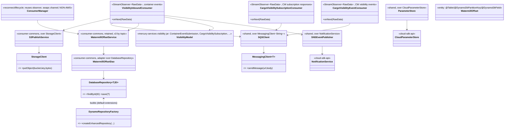
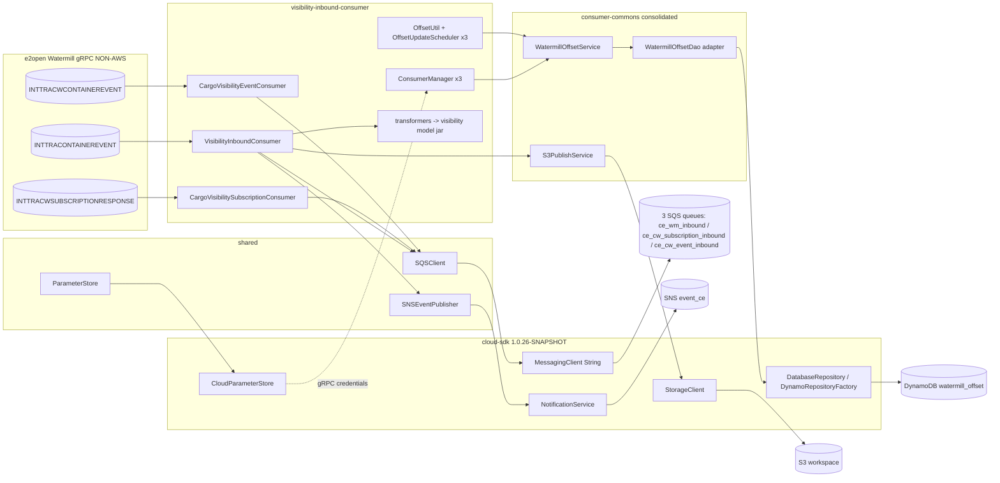
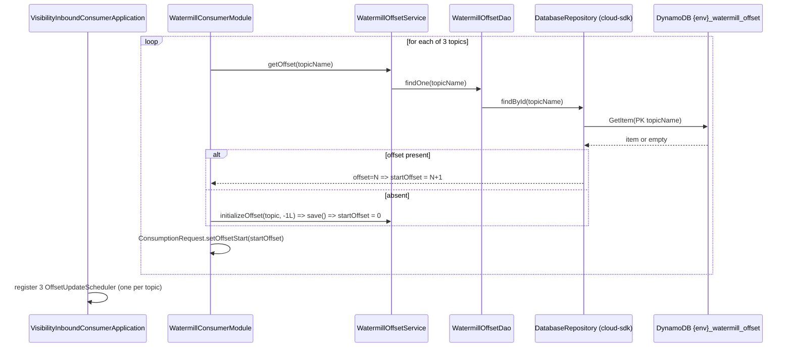
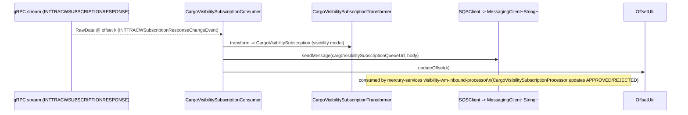

# `visibility-inbound-consumer` — AWS SDK v2 (cloud-sdk) Upgrade DESIGN (claude)

> Module: `com.inttra.mercury:visibility-inbound-consumer` (sub-module of `watermill`) · Date: 2026-06-30 · Author: Claude (Opus 4.8)
> **Chosen option: B — adopt `commons` + `cloud-sdk-api`/`cloud-sdk-aws` (`1.0.26-SNAPSHOT`) on Dropwizard 5**, consuming cloud-sdk as a normal client with **zero module-specific cloud-sdk changes** (S-G2 not required — all S3 writes are metadata-free).
> Companion plan: [`2026-06-30-visibility-inbound-consumer-aws2x-upgrade-plan-claude.md`](2026-06-30-visibility-inbound-consumer-aws2x-upgrade-plan-claude.md).
> MASTERs referenced: [shared DESIGN](../../../shared/docs/2026-05-31-shared-aws2x-upgrade-DESIGN-claude.md) §5 (config) / §6 (cloud-sdk specs) · [watermill DESIGN](../../docs/2026-05-31-watermill-aws2x-upgrade-DESIGN-claude.md) (offset-store remap, consolidation onto `consumer-commons`).
> Cross-workspace parity: `mercury-services` `visibility` cloud-sdk migration (ION-12316) — this module **shares the `visibility` model jar**, so it adopts the same cloud-sdk contract.

---

## 1. Overview & chosen option

`visibility-inbound-consumer` is the **busiest** of the five appianway Watermill consumers and has the **largest AWS surface** of the set. It subscribes to **three** e2open Watermill gRPC topics simultaneously, transforms each protobuf event to an INTTRA domain model, archives the payload to S3, and routes a `MetaData` envelope to one of **three** SQS queues that the `mercury-services` `visibility` service consumes. It also publishes workflow lifecycle events to SNS and persists one consumption **offset per topic** in DynamoDB.

Unlike the generic watermill aggregator DESIGN — which treats every consumer as "DynamoDB-offset only, S3/SNS ride `shared`" — this module is **also an active SQS producer (3 queues) and SNS publisher**, and it **depends on the `mercury-services` `visibility` model jar** for its domain types. Those three facts drive every design decision below.

**Governing rule (master plan §0):** consume cloud-sdk as a client; **no cloud-sdk/commons change.** This module satisfies it with no exceptions:

- **gRPC/Watermill is not AWS** (`com.e2open.watermill.proto.*`) and is **untouched** — the three `StreamObserver` consumers, `ConsumerManager`, transformers, type-maps, `ConsumerInitUtil`, and the gRPC `maxInboundMessageSize` tuning from ION-15497 all stay as-is.
- **DynamoDB offset store** → re-annotate `WatermillOffset` to cloud-sdk-api `@Table`/`@DynamoDbPartitionKey`/`@DynamoDbField`, replace the v1 `DynamoDBMapper` DAO with a `DatabaseRepository<WatermillOffset,String>` built by `DynamoRepositoryFactory` — **consolidated in `consumer-commons`** (per watermill DESIGN §1–§2).
- **SQS sends (3 queues)** → ride `shared`'s migrated `SQSClient` over cloud-sdk-api `MessagingClient<String>.sendMessage(url, body)`.
- **SNS publish** → ride `shared`'s migrated `SNSEventPublisher`/`SNSClient` over cloud-sdk-api `NotificationService`.
- **S3 writes** → ride `shared`'s migrated `S3WorkspaceService`/`S3PublishService` over cloud-sdk-api `StorageClient.putObject(bucket,key,bytes)` — **metadata-free, so S-G2 is not used**.
- **SSM gRPC credentials** (`AuthCredentials` per topic) → `shared` `ParameterStore` over cloud-sdk-api `CloudParameterStore`.
- **Dropwizard 4→5** → move the application onto `commons` `InttraServer` with the composed appianway config command (master §5), matching how `mercury-services` `visibility` runs.

The domain transform layer (`ContainerEventTransformer`, `ContainerEventProtoMapper`, `CargoVisibilitySubscriptionTransformer`) is **appianway-owned and unchanged**, but its **output model types come from the `visibility` jar**, which is itself migrating under ION-12316 — see §6 and the plan §2.7 / §3.

---

## 2. Class diagram (target consumer wiring)



**Removed v1 types:** `AmazonS3`/`AmazonS3ClientBuilder`, `AmazonSQS`/`AmazonSQSClientBuilder`, `AmazonSNS`/`AmazonSNSClientBuilder`, `AWSSimpleSystemsManagement`/`...ClientBuilder`, `AmazonDynamoDB`/`AmazonDynamoDBClientBuilder`, `DynamoDBMapper`/`DynamoDBMapperConfig`, `@DynamoDBTable/@DynamoDBHashKey/@DynamoDBAttribute/@DynamoDBTypeConverted`, `DynamoDBTypeConverter`, `AwsClientBuilder.EndpointConfiguration`, `ClientConfiguration`, `DefaultAWSCredentialsProviderChain`/`AWSStaticCredentialsProvider`/`BasicAWSCredentials`, `PutObjectResult`/`SendMessageRequest`/`MessageAttributeValue`/`PublishRequest`/`GetParametersRequest`, in-house `DynamoDBCrudRepository`/`DynamoHashKey`.
**Consumed cloud-sdk-api/aws:** `StorageClient`, `MessagingClient<String>`, `NotificationService`, `CloudParameterStore`, `DatabaseRepository<WatermillOffset,String>`, `DynamoRepositoryFactory`, `@Table`/`@DynamoDbPartitionKey`/`@DynamoDbField`, `LongEpochSecondAttributeConverter`, `DynamoDbClientConfig`, `DynamoDbAdminUtil`/`DynamoDbAdminCommand`.

> The S3/SQS/SNS/SSM wrappers are **`shared`/`consumer-commons` types** that this module consumes unchanged in shape; only their internals swap from v1 to cloud-sdk. The offset DAO keeps `findOne`/`save`/`update` so `WatermillOffsetService`/`OffsetUtil`/`OffsetUpdateScheduler` (and the three per-topic scheduler instances) are unchanged.

---

## 3. Component diagram



The spine is **three gRPC streams → transform → (S3 archive + SQS route) → per-topic offset commit**, with SNS event logging and SSM-sourced gRPC credentials on the side. Every AWS edge terminates in a cloud-sdk-api client.

---

## 4. Sequence diagrams

### 4.1 Startup — seed three consumption offsets (at-least-once, per topic)


### 4.2 Steady state — container event: consume → transform → S3 + SQS → offset
```mermaid
sequenceDiagram
    participant G as gRPC stream (INTTRACONTAINEREVENT)
    participant C as VisibilityInboundConsumer
    participant TR as ContainerEventTransformer (-> visibility model)
    participant S3P as S3PublishService
    participant SC as StorageClient (cloud-sdk)
    participant Q as SQSClient -> MessagingClient~String~
    participant OU as OffsetUtil (in-memory)
    G-->>C: RawData @ offset k (INTTRAContainerEventChangeEvent)
    C->>TR: transform proto -> ContainerEventSubmission
    C->>S3P: uploadToS3(bucket, datePath, json)
    S3P->>SC: putObject(bucket, key, bytes)   %% metadata-free => existing overload
    C->>C: build MetaData (S3 bucket/fileName ref)
    C->>Q: sendMessage(shippeoInboundQueueUrl, metaData.toJsonString())
    C->>OU: updateOffset(k)   %% in-memory; flushed by scheduler
```

### 4.3 CW subscription response — consume → transform → SQS (subscription state return path)


### 4.4 Periodic offset flush + reconnect (ConsumerManager, non-AWS reconnect, AWS offset write)
```mermaid
sequenceDiagram
    participant Sched as OffsetUpdateScheduler (per topic)
    participant Svc as WatermillOffsetService
    participant R as DatabaseRepository
    participant DDB as DynamoDB
    participant CM as ConsumerManager
    Note over Sched: every offsetUpdateDelay
    Sched->>Svc: updateOffset(topic, OU.getOffset())
    Svc->>R: save(WatermillOffset{topic,k,writeDateTime})  %% last-writer-wins, no condition
    R->>DDB: PutItem (enhanced client; default extensions inert)
    Note over CM: on gRPC onError
    CM->>Svc: persist current offset before reconnect
    CM->>CM: reuse same observer, swap ManagedChannel, consumeForever(persisted+1)
```

**At-least-once preserved per topic:** each topic advances its cursor in-memory and is flushed by its own scheduler; on restart each stream resumes at `persisted+1`. A crash between flushes re-consumes from the last persisted offset — identical to v1 (the table, not a conditional write, provides the guarantee).

---

## 5. Configuration (ref master DESIGN §5)

- **Three topics / three offset rows:** `watermill-grpc.consumer.topic.name` (container), `...cargo-visibility.subscription.topic.name`, `...cargo-visibility.event.topic.name`; each maps to its own `WatermillOffset` row keyed by the topic name. **Physical table name `"{environment}_watermill_offset"` is preserved** (explicit `tableName` arg to `DynamoRepositoryFactory.createEnhancedRepository(...)`).
- **Three SQS queue URLs preserved as-is:** `shippeoInboundQueueUrl` (→ `…_sqs_ce_wm_inbound`), `cargoVisibilitySubscriptionQueueUrl` (→ `…_sqs_ce_cw_subscription_inbound`), `cargoVisibilityEventQueueUrl` (→ `…_sqs_ce_cw_event_inbound`). `SQSClient.sendMessage(url, body)` maps to `MessagingClient<String>.sendMessage(url, body)`.
- **SNS event topic:** `snsEventConfig.topicArn` (→ `…_sns_event_ce`) preserved; `SNSEventPublisher` rides `shared` over `NotificationService`.
- **S3 workspace bucket:** `s3WorkspaceConfig.bucket` preserved; `S3PublishService.uploadToS3` is metadata-free → `StorageClient.putObject(bucket,key,bytes)` existing overload.
- **DynamoDB endpoint/region:** v1 `AwsClientBuilder.EndpointConfiguration(regionEndpoint, signingRegion)` → `DynamoDbClientConfig.endpointOverride(regionEndpoint)` + `Region.of(signingRegion)`; blank `regionEndpoint` ⇒ default chain. SSE/throughput on the create path via `DynamoDbAdminUtil`.
- **gRPC credentials:** `AuthCredentials` reads `watermillServiceConfig.userIdKey`/`passwordKey` (one per topic) from `ParameterStore` → `CloudParameterStore` (env/IAM via v2 default providers). The gRPC channel and `maxInboundMessageSize` (>10 MB, ION-15497) are non-AWS and unchanged.
- **Config loading:** v1 path is `S3ConfigurationProvider` + shared `ConfigProcessingServerCommand`. **Option B:** register the composed appianway `ServerCommand` (master §5/§10.3) on the consumer's `InttraServer` bootstrap; YAML keys (`${PROFILE}/${ENV}` and any `${awsps:…}`) resolve through that chain. Config field names are **unchanged**.

---

## 6. cloud-sdk gaps — **NONE (full mapping below)**

| v1 element (this module / its libs) | cloud-sdk replacement | Notes |
|---|---|---|
| `S3PublishService.uploadToS3` → `s3.putObject(bucket,key,String)`, result ignored | `StorageClient.putObject(bucket,key,bytes)` (via `S3WorkspaceService`/`S3PublishService`) | **metadata-free ⇒ S-G2 NOT required** |
| `SQSClient.sendMessage(url, body)` (×3 queues) | `MessagingClient<String>.sendMessage(url, body)` | shared wrapper; producer-only here |
| `SQSClient.sendMessage(url, body, delay, failedAttempts)` (`FAILED_ATTEMPTS` attr) | `MessagingClient<String>.sendMessage(url, body, Map attrs)` | attributes are `Map<String,String>` — `FAILED_ATTEMPTS` round-trips as String |
| `SNSEventPublisher`/`SNSClient.publishRequest(arn, msg)` | `NotificationService` (via shared `SNSEventPublisher`) | event-logging publish |
| `ParameterStore`/`SsmParameterSupplier` (`AWSSimpleSystemsManagement`) | `CloudParameterStore` (via shared `ParameterStore`) | gRPC `AuthCredentials` source |
| `@DynamoDBTable("watermill_offset")` + `@DynamoDBHashKey("topicName")` + `@DynamoDBAttribute offset/readDateTime/writeDateTime` + `@DynamoDBTypeConverted(DateToEpochSecond)` | `@Table("watermill_offset")` + `@DynamoDbPartitionKey @DynamoDbField("topicName")` + `@DynamoDbField(...)` + `LongEpochSecondAttributeConverter` | **attribute names + epoch-seconds shape preserved** |
| `WatermillOffsetDao extends DynamoDBCrudRepository` + `DynamoSupport`(`DynamoDBMapper`) | `DatabaseRepository<WatermillOffset,String>` via `DynamoRepositoryFactory` | DAO becomes a thin adapter (`findOne/save/update`) — **consolidated in `consumer-commons`** |
| `DynamoTableCommand` (TableUtils + SSE + throughput) | `DynamoDbAdminCommand`/`DynamoDbAdminUtil` | preserve SSE + RCU/WCU; confirm `@DynamoDBStream(KEYS_ONLY)` spec handled |
| `AwsClientBuilder.EndpointConfiguration` | `DynamoDbClientConfig` endpoint override | DynamoDB-Local / regional |
| `ClientConfiguration` (retry/timeout on SQS/SNS clients) | `ClientOverrideConfiguration` + `ApacheHttpClient` tuning | reapply 1s/5s/50-conn tuning at the shared/factory boundary |
| `DefaultAWSCredentialsProviderChain` / static creds | v2 `DefaultCredentialsProvider` / `DefaultAwsRegionProviderChain` | env/IAM unchanged |

`@DynamoDbVersionAttribute` (default `VersionedRecordExtension`) is available but **unused** (offset write is last-writer-wins, no optimistic lock). **S-G2 not used here.** No module-specific cloud-sdk-api/aws/commons change is required.

> **Parity note (cross-workspace):** `mercury-services` `visibility` (ION-12316) consumes the identical abstractions — `StorageClient`/`StorageClientFactory`, `MessagingClient<String>`/`MessagingClientFactory`, `NotificationService`/`EventLogger`, `DatabaseRepository`/`DynamoRepositoryFactory`/`EnhancedDynamoRepository`, `@Table`+`@DynamoDbBean`+`@DynamoDbPartitionKey`, `DynamoDbAdminCommand`, `${awsps:…}` via `ParameterStoreConfigTransform`, and `InttraServer` on DW5. Adopting the same names keeps both halves of the visibility integration on one contract.

---

## 7. Maven dependency changes (pin `1.0.26-SNAPSHOT`)

`watermill` aggregator `dependencyManagement` + this module's `pom.xml`:
```xml
<properties>
  <mercury.commons.version>1.0.26-SNAPSHOT</mercury.commons.version>
</properties>
<dependency><groupId>com.inttra.mercury</groupId><artifactId>cloud-sdk-api</artifactId><version>${mercury.commons.version}</version></dependency>
<dependency><groupId>com.inttra.mercury</groupId><artifactId>cloud-sdk-aws</artifactId><version>${mercury.commons.version}</version></dependency>
<!-- Option B -->
<dependency><groupId>com.inttra.mercury</groupId><artifactId>commons</artifactId><version>${mercury.commons.version}</version></dependency>
<dependency><groupId>com.inttra.mercury</groupId><artifactId>dynamo-integration-test</artifactId><version>${mercury.commons.version}</version><scope>test</scope></dependency>
```
**Remove:** `com.amazonaws:aws-java-sdk-{dynamodb,sqs,sns,s3,ssm}` (direct from `consumer-commons` + transitive via `shared`); the in-house `dynamo-client` once `DynamoDBCrudRepository`/`DynamoSupport` usage is gone; drop `<aws-java-sdk.version>` (`1.12.720`) when unreferenced. `cloud-sdk-aws` transitively brings `software.amazon.awssdk:{dynamodb-enhanced,sqs,sns,s3,ssm,apache-client}` with **Netty excluded**.
**Bump (critical, module-specific):** the `com.inttra.mercury:visibility` model jar from `1.0.M` to the **cloud-sdk-aligned `visibility` release** produced by ION-12316, so the domain model types this module imports (`com.inttra.mercury.visibility.common.model.*`, `ContainerEventSubmission`, `CargoVisibilitySubscription`) match the migrated `MetaData`/converter contract (plan §2.7 / §3).
**Tests:** already on JUnit 5 (Jupiter) + Mockito 5 — **no `junit-vintage-engine` bridge needed**.
**gRPC/proto:** `io.grpc:*` `1.77.0` + `protoc-gen-grpc-java` and the `e2open.watermill.proto` deps are **unchanged** (non-AWS).

---

## 8. Test details

- **Offset persistence (per topic):** move `WatermillOffsetDaoTest`/`WatermillOffsetServiceTest` to `dynamo-integration-test` (DynamoDB-Local, JUnit 5). Assert write→read round-trip; attribute names `topicName`/`offset`/`readDateTime`/`writeDateTime` stored **exactly**; epoch-**seconds** date value; `findById(absent)` → empty → `initializeOffset`; and that **three distinct topic rows** coexist independently.
- **Backward-compat fixture (critical):** seed DynamoDB-Local with real-shaped `{env}_watermill_offset` items for all three topic keys; assert the migrated entity deserializes them and `+1` resume works per topic (§4.1, §10).
- **Converter:** `DateToEpochSecondTest` → assert `LongEpochSecondAttributeConverter` yields the same stored `Long`.
- **S3 publish:** re-point `S3PublishService` to a `StorageClient` fake (functional-testing); assert `putObject(bucket,key,bytes)`, return ignored, date-partitioned key unchanged.
- **SQS send (3 queues):** re-point `SQSClient` to a `MessagingClient<String>` fake; assert `sendMessage` to each of `shippeoInboundQueueUrl`/`cargoVisibilitySubscriptionQueueUrl`/`cargoVisibilityEventQueueUrl` with the correct `MetaData.toJsonString()` body; assert `FAILED_ATTEMPTS` attribute round-trips where used.
- **SNS publish:** assert `SNSEventPublisher` over the `NotificationService` fake emits the close-run event to `snsEventConfig.topicArn`.
- **Transformers:** unchanged unit tests, but **recompile against the bumped `visibility` model jar**; assert proto→model mapping still produces the same JSON shape consumed by `mercury-services` `visibility`.
- **gRPC consumer / ConsumerManager / 3-scheduler lifecycle:** unchanged (non-AWS) — keep existing reconnect and message-size (ION-15497) tests green.
- **Create-table:** `DynamoTableCommandTest` → assert `DynamoDbAdminUtil` creates `{env}_watermill_offset` with SSE + throughput (+ stream spec if required).

---

## 9. Rollout & verification

1. Land cloud-sdk `1.0.26-SNAPSHOT` consumption (no cloud-sdk change required).
2. **Pilot the Dynamo offset path in `consumer-commons`** (entity remap + converter + DAO adapter + repository factory wiring) → `mvn -pl watermill/consumer-commons -am verify` with `dynamo-integration-test`. (Per watermill DESIGN §9 this is the shared pilot for all consumers.)
3. After `shared`/`functional-testing` migrate (master §9), rebind this module's **S3 (`StorageClient`) / SQS (`MessagingClient`) / SNS (`NotificationService`) / SSM (`CloudParameterStore`)**.
4. **Bump and re-resolve the `visibility` model jar** to the ION-12316 cloud-sdk release; recompile transformers; fix any model/`MetaData` package moves.
5. Move the application onto `commons` `InttraServer`/DW5 with the composed appianway config command; keep the **three** `OffsetUpdateScheduler`s and `ConsumerManager` wiring intact.
6. `mvn -pl watermill/visibility-inbound-consumer -am verify`; then aggregator `mvn verify`.
7. **Gate production cutover** on (a) the per-topic backward-compat offset fixture passing against a snapshot of real `{env}_watermill_offset` items, and (b) an end-to-end check that the three SQS queues still receive byte-compatible `MetaData` that `mercury-services` `visibility-wm-inbound-processor` accepts.

---

## 10. Risks & mitigations

| Risk | Mitigation |
|---|---|
| **Offset-table data-shape incompatibility** (per topic) — wrong physical table name or renamed attribute ⇒ in-flight offsets lost → silent re-consumption from 0 / duplicate or skipped delivery on a live tracking feed | **Highest priority.** Preserve physical name `{env}_watermill_offset` (explicit `tableName`) and exact attribute names via `@DynamoDbField`; keep epoch-seconds via `LongEpochSecondAttributeConverter`; verify with a `dynamo-integration-test` fixture seeded from **real items for all three topic keys** before cutover. |
| **`visibility` model jar drift** — appianway recompiles against an ION-12316 `visibility` release whose `MetaData`/model package or fields moved ⇒ transformer output changes shape and `visibility-wm-inbound-processor` rejects it | Bump the jar deliberately (§7); diff the produced JSON against a captured sample; coordinate the `visibility` release version with the mercury-services team; add a contract test asserting the SQS body shape. |
| **SQS body / message size** — large container-event payloads | Payloads are archived to S3; only the `MetaData` (S3 ref) goes on SQS, so SQS stays well under 256 KB. gRPC `maxInboundMessageSize` (>10 MB, ION-15497) is non-AWS and unchanged. Assert the S3-offload path in tests. |
| Enhanced-client default extensions alter offset writes | Confirmed inert (no `@DynamoDbVersionAttribute`/`@DynamoDbAtomicCounter`); assert plain put semantics. |
| SSE / throughput / `@DynamoDBStream(KEYS_ONLY)` dropped on create | Carry SSE + RCU/WCU (and stream spec if needed) through `DynamoDbAdminUtil`; assert in `DynamoTableCommandTest`. |
| Retry/timeout parity on SQS/SNS (1s/5s/50-conn v1 tuning) | Reapply via `ClientOverrideConfiguration`/`ApacheHttpClient` at the shared/factory boundary; unit-test classification of v2 `SdkException` → `RecoverableException`. |
| DW4→5 on a live 3-stream consumer (Option B) | Sequence the Dynamo remap first/independently; framework move after `shared`; keep the three schedulers + `ConsumerManager`; per-module verify gate. |
| Region/endpoint resolution drift | Map `regionEndpoint`/`signingRegion` to `DynamoDbClientConfig`; dev-run parity check before broad rollout. |
| Credential resolution for gRPC `AuthCredentials` via SSM | `CloudParameterStore` over v2 default providers; verify all three topics' `userIdKey`/`passwordKey` resolve in a dev run. |
