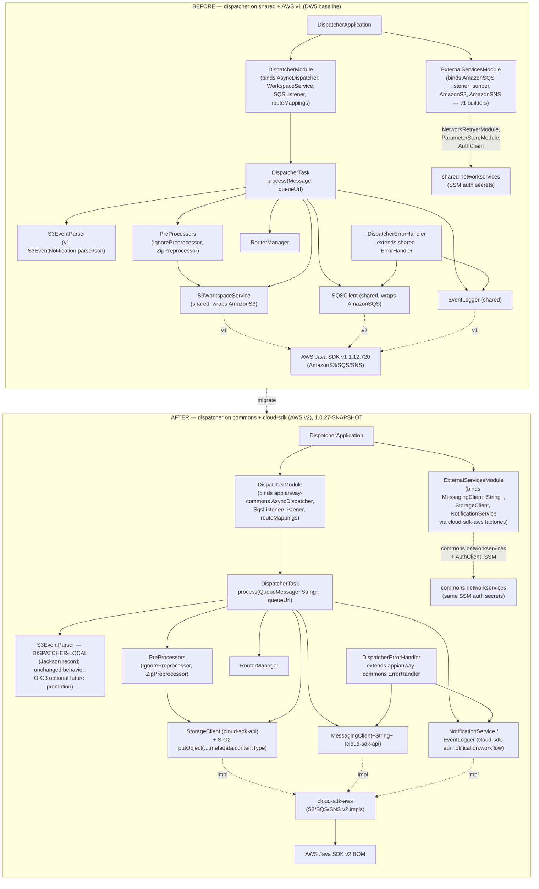
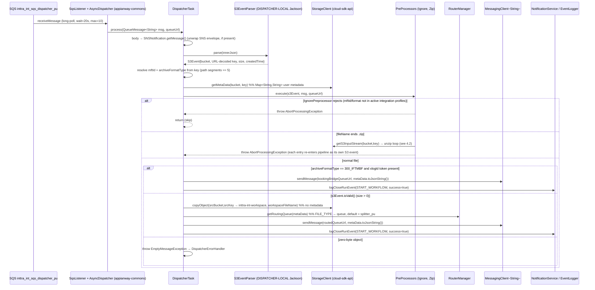
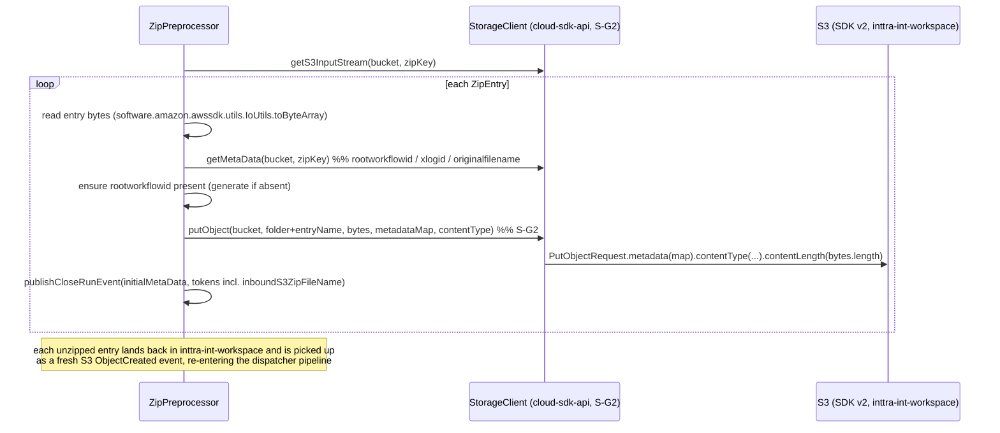
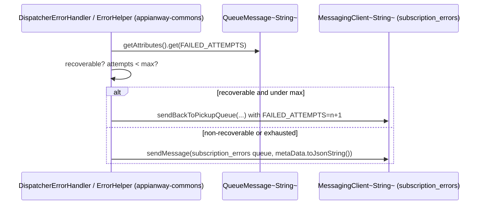
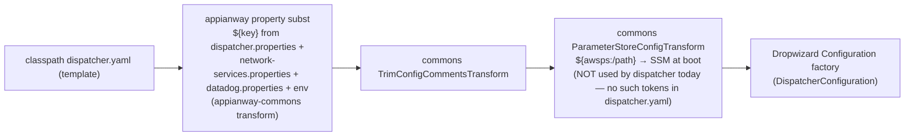

# `dispatcher` — AWS SDK v2 (cloud-sdk) Upgrade Design

> Module: `com.inttra.mercury.appian-way:dispatcher:1.0` · Date: 2026-07-22 · Author: Claude (Sonnet 5)
> **Program foundation:** [`2026-07-22-appianway-awsupgrade-foundation-claude.md`](../../2026-07-22-appianway-awsupgrade-foundation-claude.md) — read first; this doc adds only dispatcher-specific detail on top of the common `shared→commons/cloud-sdk` mapping (§2), slim `appianway-commons` (§3), config/SSM model (§4), assumed cloud-sdk changes (§5), Maven template (§6), rollout order (§8).
> **Baseline (done, ION-16098):** Dropwizard 5.0.2 / Jetty 12.1.9 / Java 17 / Jackson 2.21.4 — verified booting green against INT per [`2026-07-22-appway-app-checkouts-run-config.md`](../../2026-07-22-appway-app-checkouts-run-config.md) §4.1.
> **This doc's scope:** AWS SDK v1→v2 + drop-`shared` only. Target line **`1.0.27-SNAPSHOT`**.
> **Supersedes/updates:** [`2026-05-31-dispatcher-aws2x-upgrade-DESIGN-claude.md`](2026-05-31-dispatcher-aws2x-upgrade-DESIGN-claude.md) and [`-plan-claude.md`](2026-05-31-dispatcher-aws2x-upgrade-plan-claude.md) (still-accurate design content is carried forward; version pins moved `1.0.26-SNAPSHOT`→`1.0.27-SNAPSHOT`, and this doc adds the full §5 config/SSM table, the W-G9 workflow-model dependency, and the port/health-check evidence from the INT run-config check-out).

---

## 1. Overview

**Purpose:** `dispatcher` is the **S3→SQS routing gate** of the ETL pipeline. It consumes S3 `ObjectCreated` notifications (delivered either raw S3→SQS or wrapped S3→SNS→SQS), resolves the MFT id and archive-format type from the object key, optionally unzips container files (re-landing each entry in S3 so it re-enters the pipeline as its own event), copies the inbound object into the workspace bucket, and routes a `MetaData` envelope to the correct downstream splitter queue (or the booking-bridge queue for `300_IFTMBF` bookings) while emitting `START_WORKFLOW`/`CLOSE_WORKFLOW` lineage events.

**Current state:** DW5 baseline (done). Still on **AWS Java SDK v1 (1.12.720)** + the appianway **`shared`** module for SQS listening/sending (`SQSClient`, `SQSListener`, `AsyncDispatcher`), S3 I/O (`WorkspaceService`/`S3WorkspaceService`), SNS-envelope parsing (`SNSNotification`), the workflow model (`MetaData`, `Event`), network-services (`AuthClient`, `IntegrationProfileService`), and health-check base (`HealthCheckRegistrar`, `indicator.*`).

**Target:** `commons` + `cloud-sdk-api`/`cloud-sdk-aws` (`1.0.27-SNAPSHOT`) as a normal client, plus the slim **`appianway-commons`** residue (`AsyncDispatcher`, `ErrorHandler`/`RecoverableException`, error codes, health-indicator glue). AWS SDK v2 arrives transitively via `cloud-sdk-aws`.

**Headline change (per foundation §9, row 1):** dispatcher keeps its **S3-event parser dispatcher-local** (not promoted to cloud-sdk; O-G3 is optional-upstream, single-consumer) and is the module that exercises **S-G2** on the *write* path — `ZipPreprocessor` unzips a container and writes each entry back to S3 **with user metadata and content-type** via `StorageClient.putObject(bucket,key,bytes,metadata,contentType)`.

---

## 2. Current vs Target architecture

### 2.1 Component diagram — before / after



### 2.2 Class-level mapping — `shared`/v1 type → replacement

| dispatcher class | Current (`shared`/AWS v1) | Target | Home |
|---|---|---|---|
| `modules.ExternalServicesModule` | binds `AmazonSQS`(×2 named)/`AmazonS3`/`AmazonSNS` v1 builders; `NetworkRetryerModule`, `ParameterStoreModule`, `AuthClient` (shared) | binds `MessagingClient<String>` (listener + sender), `StorageClient`, `NotificationService` via cloud-sdk-aws factories (mirrors `mercury-services` `BookingMessagingModule`); `AuthClient`/network-services from **commons** | module (rebind only) |
| `modules.DispatcherModule` | binds `shared.threaddispatcher.AsyncDispatcher`, `shared.workspace.WorkspaceService`→`S3WorkspaceService`, `shared.listener.SQSListener`, `shared.messaging.{SQSListenerClient,SNSClient}`, `shared.event.{EventPublisher,SNSEventPublisher}` | binds **appianway-commons** `AsyncDispatcher`/`AbstractTask`, cloud-sdk-api `MessagingClient<String>`/`StorageClient`/`NotificationService`, cloud-sdk-api `notification.workflow.EventPublisher` | module + appianway-commons |
| `task.DispatcherTask` | `process(com.amazonaws.services.sqs.model.Message, String queueUrl)`; extends `shared.task.AbstractTask`; uses `shared.event.{Event,SNSNotification}`, `shared.task.MetaData`, `shared.messaging.SQSClient`, `shared.event.EventLogger`, `shared.workspace.WorkspaceService` | `process(QueueMessage<String>, String queueUrl)`; extends appianway-commons `AbstractTask`; uses cloud-sdk-api `notification.workflow.{Event,MetaData}`, `MessagingClient<String>`, `NotificationService`/`EventLogger`, `StorageClient` | module (signature/import swap only — domain logic unchanged) |
| `services.S3EventParser` | wraps `com.amazonaws.services.s3.event.S3EventNotification.parseJson(json)` | **dispatcher-local** Jackson record + parser (no AWS SDK type at all); identical behavior (first record, URL-decoded key, `size`, formatted event time); handles both raw-S3→SQS and SNS-unwrapped envelopes | **module** (unchanged home — was already dispatcher-owned; only the v1 dependency drops) |
| `preprocessor.ZipPreprocessor` | `com.amazonaws.services.s3.model.ObjectMetadata` (content-length, then discarded), `com.amazonaws.util.IOUtils.toByteArray`; calls `workspaceService.putObjectWithMetaData(bucket,key,bytes,Map)` | drop `ObjectMetadata` entirely (length derives from `bytes.length` inside `StorageClient.putObject`); `com.amazonaws.util.IOUtils`→`software.amazon.awssdk.utils.IoUtils` (or Guava `ByteStreams`); call `StorageClient.putObject(bucket,key,bytes,metadata,contentType)` **(S-G2)** | module (consumes S-G2, does not implement it) |
| `preprocessor.{PreProcessor,PreProcessors,IgnorePreprocessor}`, `routers.RouterManager` | `process(S3Event, com.amazonaws.services.sqs.model.Message, String queueUrl)` | `process(S3Event, QueueMessage<String>, String queueUrl)` — mechanical element-type swap only; routing/filter logic unchanged | module |
| `errors.DispatcherErrorHandler` | extends `shared.task.ErrorHandler`, uses `shared.task.errorhandler.ErrorHelper` | extends **appianway-commons** `ErrorHandler`, uses appianway-commons `ErrorHelper`/`RecoverableException`; error-code map (`EmptyMessageException`, `UnableToResolveMftIdException`) unchanged | appianway-commons (base) + module (codes) |
| `DispatcherApplication.registerHealthChecks` | `shared.healthcheck.{HealthCheckRegistrar, indicator.*}` (`InboundSqsHealthCheck`, `OutboundSqsHealthCheck`, `S3ReadHealthCheck`, `S3WriteHealthCheck`, `SnsPublishHealthCheck`, `ErrorThresholdHealthCheck`) | commons `health.*` base + **appianway-commons** indicator wrappers re-pointed to injected `MessagingClient<String>`/`StorageClient`/`NotificationService` — same 6 checks, same signatures | commons + appianway-commons |
| `DispatcherApplication.initialize` | `shared.command.ConfigProcessingServerCommand`, `shared.config.S3ConfigurationProvider` | commons `ConfigProcessingServerCommand` + composed transforms (§5.3); `S3ConfigurationProvider` stays appianway-local (or drops if `CONFIG_LOCATION=s3` unused for dispatcher — verify) | commons + appianway-commons |
| `config.DispatcherConfiguration`/`BookingBridgeConfiguration` | extends `shared.config.BaseConfiguration`; fields `S3Config`, `NetworkServiceConfig` (shared types) | extends appianway-commons/commons config base; field types move to cloud-sdk config POJOs (`CloudStorageConfig`, `AwsMessagingClientConfig`, `NotificationClientConfig`) where shared types are retired — **YAML keys unchanged** | module |
| `model.S3Event` | pure value type, no AWS import | **unchanged** | module |

**Not touched by this migration (domain logic, zero AWS surface):** `RouterManager` routing rules, `IgnorePreprocessor`/`FileFilterService` (uses `IntegrationProfile{Format}Service` from network-services, not AWS), `ArchiveFormatTypeMappings`, `getArchiveFormatType`/`getMftId` key-parsing.

---

## 3. AWS touchpoints

| Surface | Direction | INT resource | cloud-sdk client used | Metadata? |
|---|---|---|---|---|
| SQS inbound (pickup) | consume | `inttra_int_sqs_dispatcher_pu` (`https://sqs.us-east-1.amazonaws.com/081020446316/inttra_int_sqs_dispatcher_pu`) | `MessagingClient<String>` (listener side) via appianway-commons `SqsListener`/`AsyncDispatcher` | n/a (message attributes: `FAILED_ATTEMPTS`) |
| SQS outbound (routing — default) | produce | `inttra_int_sqs_splitter_pu` | `MessagingClient<String>` `sendMessage` | no |
| SQS outbound (routing — `315_IFTSTA`) | produce | `inttra_int_sqs_splitter_ce_pu` | `MessagingClient<String>` `sendMessage` | no |
| SQS outbound (routing — `WEBBL_PDF`) | produce | `inttra_int_sqs_webbl_pdf_inbound` | `MessagingClient<String>` `sendMessage` | no |
| SQS outbound (booking bridge) | produce | `inttra_int_sqs_booking_bridge_inbound` | `MessagingClient<String>` `sendMessage` (only when `archiveFormatType==300_IFTMBF` and an `xlogId` token is present) | no |
| SQS outbound (error) | produce | `inttra_int_sqs_subscription_errors` | `MessagingClient<String>` `sendMessage` (via `ErrorHandler`) | no |
| S3 read (pickup) | read | `inttra-int-inbound-pickup` | `StorageClient.getContent` / `getS3InputStream` (zip unzip), `.getMetaData` | reads user metadata (`rootworkflowid`, `xlogid`, `originalfilename`) |
| S3 write (workspace) | write | `inttra-int-workspace` | `StorageClient.copyObject` (plain copy, no metadata — `copyInitialFileToWorkspace`) **and** `StorageClient.putObject(bucket,key,bytes,metadata,contentType)` **(S-G2, `ZipPreprocessor`)** | copy = none; zip-entry write = **yes**, S-G2 |
| SNS | publish | `arn:aws:sns:us-east-1:081020446316:inttra_int_sns_event` | `NotificationService.publish` / `EventLogger.logCloseRunEvent` (via `EventPublisher`→`SnsEventPublisher`) | n/a |
| DynamoDB | — | not used by dispatcher | — | — |
| SES | — | not used by dispatcher | — | — |
| Param Store (SSM) | resolve at boot | `/inttra/int/appianway/networkservices/authclientid`, `/inttra/int/appianway/networkservices/authclientsecret` | commons `networkservices.client.AuthClient` + `ParameterStoreModule`/`CloudParameterStore` (`usePassThrough=false`) | n/a |
| gRPC | — | not used by dispatcher | — | — |
| network-services (HTTP, not AWS but SSM-gated) | call | `https://api-alpha.inttra.com/auth`, `.../participant/integrationProfile`, `.../participant/integrationProfile/format` | commons `AuthClient`, `IntegrationProfileService`/`IntegrationProfileFormatService` (used by `FileFilterService` cache, 30-min TTL) | n/a |

---

## 4. Sequence diagram — consume → unzip+put(metadata) → route

### 4.1 Primary flow: S3-event → route to splitter / booking-bridge



### 4.2 Zip preprocessor: unzip → put-with-metadata (S-G2)



### 4.3 Failure / retry path (inherited, appianway-commons)



---

## 5. Configuration changes

### 5.1 Property-key table — `dispatcher.yaml` ↔ `conf/int/dispatcher.properties` (exact INT values)

| YAML path | `${...}` placeholder | INT value (`conf/int/dispatcher.properties`) |
|---|---|---|
| `componentName` | `${componentName:-dispatcher}` | `dispatcher` |
| `errorRateThreshold` | `${dispatcher.errorRateThreshold:-5.0}` | (default `5.0`, not overridden) |
| `sqsPickupConfig.queueUrl` | `${dispatcher.sqsDispatcherConfig.queueUrl}` | `https://sqs.us-east-1.amazonaws.com/081020446316/inttra_int_sqs_dispatcher_pu` |
| `sqsPickupConfig.waitTimeSeconds` | `${dispatcher.sqsDispatcherConfig.waitTimeSeconds:-20}` | (default `20`) |
| `sqsPickupConfig.maxNumberOfMessages` | `${dispatcher.sqsDispatcherConfig.maxNumberOfMessages:-10}` | (default `10`) |
| `sqsRouteMappingConfig.315_IFTSTA` | `${dispatcher.sqsCESplitterConfig.queueUrl}` | `https://sqs.us-east-1.amazonaws.com/081020446316/inttra_int_sqs_splitter_ce_pu` |
| `sqsRouteMappingConfig.WEBBL_PDF` | `${dispatcher.sqsWebBLPDF.queueUrl}` | `https://sqs.us-east-1.amazonaws.com/081020446316/inttra_int_sqs_webbl_pdf_inbound` |
| `sqsRouteMappingConfig.default` | `${dispatcher.sqsSplitterConfig.queueUrl}` | `https://sqs.us-east-1.amazonaws.com/081020446316/inttra_int_sqs_splitter_pu` |
| `sqsErrorConfig.queueUrl` | `${dispatcher.sqsErrorSubscriptionConfig.queueUrl}` | `https://sqs.us-east-1.amazonaws.com/081020446316/inttra_int_sqs_subscription_errors` |
| `snsEventConfig.topicArn` | `${dispatcher.snsEventConfig.topicArn}` | `arn:aws:sns:us-east-1:081020446316:inttra_int_sns_event` |
| `s3WorkspaceConfig.bucket` | `${dispatcher.s3WorkspaceConfig.bucket}` | `inttra-int-workspace` |
| `s3InboundPickupConfig.bucket` | `${dispatcher.s3InboundPickupConfig.bucket}` | `inttra-int-inbound-pickup` |
| `bookingBridgeConfig.queueUrl` | `${dispatcher.sqsBKBridge.queueUrl}` | `https://sqs.us-east-1.amazonaws.com/081020446316/inttra_int_sqs_booking_bridge_inbound` |
| `networkServiceConfig.networkBaseUrl` | `${networkservices.networkBaseUrl}` | `https://api-alpha.inttra.com/network` (from `configuration/int/network-services.properties`) |
| `networkServiceConfig.authEndpointUrl` | `${networkservices.authEndpointUrl}` | `https://api-alpha.inttra.com/auth` |
| `networkServiceConfig.clientId` | `${networkservices.clientId}` | `/inttra/int/appianway/networkservices/authclientid` (SSM **path**, see §5.2) |
| `networkServiceConfig.clientSecret` | `${networkservices.clientSecret}` | `/inttra/int/appianway/networkservices/authclientsecret` (SSM **path**, see §5.2) |
| `networkServiceConfig.servicePaths.integrationProfileServicePath` | `${networkservices.integrationProfileServicePath}` | `/participant/integrationProfile` |
| `networkServiceConfig.servicePaths.integrationProfileFormatServicePath` | `${networkservices.integrationProfileFormatServicePath}` | `/participant/integrationProfile/format` |
| `server.connector.port` | `${server.connector.port:-8081}` | (default **8081**; single `simple` server, `/application`+`/admin` share the port — verified in run-config §4.1) |
| `logging.level` | `${dispatcher.logging.level:-INFO}` | (default `INFO`) |
| `metrics.frequency` | `${metrics.frequency}` | from `datadog.properties` |

All of the above are **unchanged property keys/values** — this migration does not rename any queue, topic, bucket, or SSM path (foundation §4.3 rule). CLI shape is unchanged:
```
run dispatcher.yaml conf/int/dispatcher.properties ../configuration/int/network-services.properties ../configuration/int/datadog.properties
```

### 5.2 SSM parameters — resolution mechanism

| Secret | SSM path | Today (DW5 baseline) | After migration | `usePassThrough` |
|---|---|---|---|---|
| network-services `clientId` | `/inttra/int/appianway/networkservices/authclientid` | resolved **at runtime** by shared `AuthClient` (via `ParameterStoreModule`) on first auth call | **decision: keep runtime resolution** — commons `networkservices.client.AuthClient` + commons `ParameterStoreModule`/`CloudParameterStore`, same lazy-fetch-on-auth-call semantics (no yaml shape change, no boot-time SSM read added) | `false` (SSM-backed; a `PassThroughParameterSupplier` would treat it as plain text — not used here) |
| network-services `clientSecret` | `/inttra/int/appianway/networkservices/authclientsecret` | same as above | same as above | `false` |

**Why keep runtime resolution instead of moving to boot-time `${awsps:/path}` (foundation §4.2):** dispatcher's `networkServiceConfig.clientId`/`clientSecret` yaml fields are typed as the **SSM path itself** (`String`), consumed by `AuthClient` — not as a resolved secret value substituted into the yaml. Switching to `${awsps:/inttra/int/appianway/networkservices/authclientid}` would require the *config command* to resolve it at boot (a `ParameterStoreConfigTransform` pass) and change the field's role from "path to look up" to "already-resolved secret" — a behavior change to the `AuthClient`/`ParameterStoreModule` contract, not a pure library-swap. Out of scope for this AWS-v1→v2 migration; retained as-is. (No dispatcher-specific reason to prefer boot-time; if the program later standardizes all modules on `${awsps:...}`, dispatcher follows in lockstep with `commons`/`AuthClient` changes, not before.)

No **other** SSM parameters are used by dispatcher (no gRPC creds — that's watermill-only).

### 5.3 Config-command composition



`DispatcherApplication.initialize` swaps `com.inttra.mercury.shared.command.ConfigProcessingServerCommand` → `com.inttra.mercury.config.ConfigProcessingServerCommand` (commons), composed per foundation §4.2/C-G6 with the appianway property-substitution transform (appianway-commons) run first, then `TrimConfigCommentsTransform`, then `ParameterStoreConfigTransform`. Because dispatcher's yaml has **no `${awsps:...}` tokens**, `ParameterStoreConfigTransform` is a no-op pass-through for this module today — it is wired for consistency/future-proofing, not because dispatcher currently needs boot-time SSM resolution (§5.2 explains why the SSM secrets stay runtime-resolved via `AuthClient` instead).

### 5.4 What is unchanged

- CLI arg shape and arg order (`run <yaml> <props...>`), `cwd`-relative `.properties` resolution, `-DCONFIG_REGION=US_EAST_1`.
- `S3ConfigurationProvider` conditional install (`CONFIG_LOCATION=s3` check) — stays appianway-local per foundation §2 (mapping table), moves into `appianway-commons` (or stays module-local if truly single-consumer; verify at implementation time whether any other module still needs it before duplicating vs. sharing).
- `datadog.properties` passthrough for `metrics.frequency`.
- No run profiles for dispatcher (unlike splitter/ingestor/transformer's `ce-`/`os-` variants) — single deployment.
- Port **8081**, single `simple` Dropwizard server (`/application` + `/admin` share the connector) — unchanged.

---

## 6. cloud-sdk / commons dependencies & assumed gaps

| ID | Does dispatcher exercise it? | How |
|---|---|---|
| **S-G2** | **Yes — primary consumer on the write side (per foundation §5 row 1)** | `ZipPreprocessor` calls `StorageClient.putObject(bucket,key,bytes,metadata,contentType)` for every unzipped entry, replacing `WorkspaceService.putObjectWithMetaData(...)`. This is the **only** metadata-bearing S3 write in dispatcher; `copyInitialFileToWorkspace`'s `copyObject` is metadata-less and needs no new overload. |
| **W-G9** | **Yes — dispatcher both publishes and consumes `MetaData`/`Event`/tokens** | `DispatcherTask` builds `MetaData` (via `MetaData.Builder`, `Projection.{MFT_ID,FILE_TYPE,S3_EVENT_CREATED_TIME,DISPATCHER_RECEIVED_TIME,PICKUP_FILENAME}`) and publishes it to splitter/booking-bridge queues; it reads `Event.Token.{MFT_ID,FILE_TYPE,ORIGINAL_FILE_SIZE,INBOUND_S3_FILE_NAME,XLOG_ID,ORIGINAL_FILE_NAME,PICK_UP_QUEUE,DROP_OFF_QUEUE}` and calls `EventLogger.logCloseRunEvent(metaData, subType, runId, body, componentName, startDateTime, success, tokens)`. Per foundation §5A, the wire data is compatible; dispatcher needs the **constant-parity** fix (`Event.Token.ORIGINAL_FILE_SIZE` must exist in cloud-sdk-api — it is used directly at `DispatcherTask` line building tokens) for source compilation. The `Event.Builder.setAnnotations` round-trip defect (W-G9.1) does not block dispatcher directly (dispatcher does not set `Annotations` today) but dispatcher consumes the **same** `Event`/`MetaData` classes as every other module, so it benefits from and depends on W-G9 landing before/with its own migration. |
| **X-G7** (email reply-to) | No | dispatcher sends no email. |
| **X-G8** (Jest/OpenSearch signing) | No | dispatcher has no ES dependency. |
| **C-G6** (widen `getConfigTransformer`) | Optional, not required | §5.3 composition works today via the proven pattern without the widening. |
| **O-G1/O-G3** (upstream listener/S3-event parser) | Not depended on | dispatcher keeps `AsyncDispatcher` (appianway-commons) and its **local** `S3EventParser` (§2.2); O-G3 promotion is a future, optional, additive move — tracked, not required. |

**What dispatcher consumes from `commons`:** `ConfigProcessingServerCommand` + transforms, `networkservices.*` (`AuthClient`, `IntegrationProfileService`, `IntegrationProfileFormatService`), health-check base (`InttraServer`/`health.*`).

**What dispatcher consumes from `cloud-sdk-api`/`cloud-sdk-aws`:** `StorageClient` (+ S-G2 overloads), `MessagingClient<String>` (+ `QueueMessage<String>`), `NotificationService`, `notification.workflow.{MetaData,Event,EventLogger,EventPublisher}` (+ W-G9 constants).

**What moves to `appianway-commons`:** `AsyncDispatcher`/`AbstractTask` (task lifecycle), `ErrorHandler`/`RecoverableException`/`ExternalCallExecutionException` + dispatcher's error-code map wiring, the health-indicator wrappers (`InboundSqsHealthCheck`, `OutboundSqsHealthCheck`, `S3ReadHealthCheck`, `S3WriteHealthCheck`, `SnsPublishHealthCheck`, `ErrorThresholdHealthCheck`) re-pointed to the injected cloud-sdk clients, and the config property-substitution transform.

**What stays dispatcher-local (not appianway-commons, not cloud-sdk):** `services.S3EventParser` + its Jackson DTOs (single consumer — O-G3 is the optional future promotion path), `model.S3Event`, `preprocessor.*`, `routers.RouterManager`, `errors.DispatcherErrorHandler`'s error-code map, `task.{FileFilterService,S3MetaDataKeys}`, `model.ArchiveFormatTypeMappings`.

---

## 7. Maven dependency changes

[`dispatcher/pom.xml`](../pom.xml):

**Remove**
- `com.inttra.mercury.shared:mercury-shared:${mercury.shared.version}` ([pom.xml:24-29](../pom.xml)) — retired.
- `com.amazonaws:aws-java-sdk-sqs:${aws-java-sdk.version}` ([pom.xml:47-51](../pom.xml)) — dispatcher's only *direct* v1 dependency (S3/SNS v1 clients came in transitively via `mercury-shared`).
- (verify no other stray `com.amazonaws:*` transitive-only artifacts remain after the `shared` removal — `mvn dependency:tree` check.)

**Add**
- `com.inttra.mercury:cloud-sdk-api:1.0.27-SNAPSHOT`
- `com.inttra.mercury:cloud-sdk-aws:1.0.27-SNAPSHOT`
- `com.inttra.mercury:commons:1.0.27-SNAPSHOT` (config command, network-services, health base)
- `com.inttra.mercury:appianway-commons:1.0-SNAPSHOT` (slim residue — `AsyncDispatcher`, `ErrorHandler`, health-indicator wrappers, config transform)
- AWS SDK **v2** arrives transitively via `cloud-sdk-aws` (managed by the mercury-services-commons BOM) — do **not** declare v1 or v2 AWS artifacts directly.

**No module-specific extras** — dispatcher has no schema-beans/gen2-parser/Contivo/protobuf/Jest dependency (unlike transformer/ingestor). It is a lean routing gate; only the standard 4 artifacts above are added.

**Align (already done by ION-16098 baseline, keep consistent)**
- `io.dropwizard:dropwizard-core` stays at the root-managed `${io.dropwizard.version}` = 5.0.2, inherited where possible from `mercury-services-commons` dependency management rather than re-pinned locally.
- `com.google.inject:guice`, `com.google.guava:guava`, `com.palominolabs.metrics:metrics-guice`, `io.dropwizard.metrics:metrics-annotation` — retained as-is (Guice/Guava are not AWS/`shared` concerns).
- Drop the commented-out `org.zapodot.hystrix.bundle.HystrixBundle` import in `DispatcherApplication` (already unused/commented; delete the dead import + line when touching the file).
- `com.inttra.mercury.test:functional-testing:1.0` (test scope) — migrates alongside dispatcher per foundation §8 (its fakes are re-pointed to `cloud-sdk-api` in lockstep with the rest of the program, not dispatcher-specific work).

**Verify**
- `mvn -pl dispatcher -am clean verify` green (shade plugin requires `clean` first — stale fat jars otherwise given `maven-shade-plugin:2.3`'s `ManifestResourceTransformer` pin to `com.inttra.mercury.dispatcher.DispatcherApplication`).
- Fat-jar boot + `GET /admin/opsHealthcheck` green against INT, reusing the exact procedure already verified in [`2026-07-22-appway-app-checkouts-run-config.md`](../../2026-07-22-appway-app-checkouts-run-config.md) §4.1 (same run command, same 5 AWS-resolution checks — see §9 below).

---

## 8. Tests

- **Move to JUnit 5** for new/rewritten tests; existing JUnit 4 tests run via `junit-vintage-engine` during transition (dispatcher's `pom.xml` currently declares plain `junit:${junit.version}` — add the JUnit 5 BOM/engine alongside).
- **`S3EventParser` — pin exact current behavior (regression-critical, since it stays local and unowned by cloud-sdk):**
  - valid raw-S3→SQS event → correct `S3Event{bucket,key,size,createdTime}`.
  - S3→SNS→SQS (SNS-wrapped) event — unwrap via `SNSNotification.getMessage()` first, then parse the inner JSON identically.
  - **URL-encoded key** cases: `a%2Fb`→`a/b`, encoded spaces (`+`/`%20`) — must match the old `URLDecoder.decode(key,"UTF-8")` exactly.
  - zero-size object → `S3Event.isValid()==false` → `EmptyMessageException` path exercised.
  - missing/empty `Records` array → fail-fast (preserve current "no record" semantics — note: current v1 code has a `// FIXME` for this case; carry the same behavior unless explicitly fixed as part of this work, and call it out if changed).
  - event-time formatting: byte-for-byte parity with the existing Joda `DateTimeFormatter` output (`Json.DEFAULT_DATE_TIME_PATTERN`).
  - Use a **captured real S3 event** JSON fixture (both envelope shapes) as golden test data.
- **`ZipPreprocessor` (S-G2 consumer):**
  - assert `StorageClient.putObject(bucket,key,bytes,metadataMap,contentType)` receives the **same metadata map** as today's `putObjectWithMetaData` (including injected `rootworkflowid` when absent from source metadata).
  - assert byte-for-byte parity of the unzipped entry content after the `IOUtils`→`IoUtils` swap (stream-close semantics).
  - assert each entry still triggers `logCloseRunEvent` with `inboundS3ZipFileName` token.
- **`DispatcherTask` routing/lineage (unchanged domain logic, changed element types):**
  - `QueueMessage<String>` double replaces the v1 `Message` mock/stub in existing tests.
  - assert `RouterManager.getRoutingQueue` still resolves `315_IFTSTA`→ce-splitter, `WEBBL_PDF`→webbl queue, everything else→default splitter queue.
  - assert booking-bridge branch (`300_IFTMBF` + non-blank `xlogId`) still routes to `bookingBridgeConfig.queueUrl` and does **not** fall through to the normal copy/route path (`return` after booking-bridge send is preserved).
  - assert `s3MetaData`-derived `rootWorkflowId` override (`S3MetaDataKeys.S3_META_DATA_ROOT_WORKFLOW_ID`) still short-circuits `initialMetadata`/`workspaceFileName` recomputation.
- **`DispatcherErrorHandler`:** error-code map (`EmptyMessageException`, `UnableToResolveMftIdException`) unchanged; retry/`FAILED_ATTEMPTS` path exercised against appianway-commons `ErrorHandler`.
- **Round-trip corpus test (W-G9 verification gate, foundation §5A):** dispatcher's `MetaData`/`Event`/tokens must serialize/deserialize identically between `shared` (pre-migration baseline capture) and cloud-sdk-api (post-migration) — reuse the program-wide corpus test; dispatcher does not need its own copy but its CI must stay green against it since it is both a publisher and (indirectly, via S3 metadata round-trip) a consumer of the workflow model.
- **`functional-testing` fakes** re-pointed to `cloud-sdk-api` interfaces (in-memory S3/SQS/SNS) — lockstep with the rest of the program (foundation §8); preserve dispatcher's copy-to-workspace + route-to-splitter + zip re-entry + booking-bridge + lineage assertions end-to-end.

---

## 9. Rollout & verification

Per foundation §8 program order, dispatcher sits in the **"S-G2 write/copy consumers"** wave — after `appianway-commons`, `functional-testing`, the pilot (`event-writer`), and the light consumers (`distributor-rest`, `structuralvalidator`, `splitter`, `ingestor`), migrated together with `distributor` and `error-processor` (its siblings on the S-G2 write path).

1. **Pre-condition:** S-G2 landed additively in cloud-sdk `1.0.27-SNAPSHOT` (cloud-sdk CI + full mercury-services build green before/after); W-G9 landed (constant parity, at minimum).
2. **pom swap** (§7) → `mvn -pl dispatcher -am clean verify` green.
3. **Rebind `ExternalServicesModule`** to cloud-sdk factories; **rebind `DispatcherModule`** to appianway-commons `AsyncDispatcher` + cloud-sdk `MessagingClient<String>`/`StorageClient`.
4. **Element-type swap:** `Message`→`QueueMessage<String>` through `DispatcherTask`/`PreProcessor`/`PreProcessors`/`IgnorePreprocessor`/`ZipPreprocessor`/`DispatcherErrorHandler`.
5. **`ZipPreprocessor` cleanup:** drop `ObjectMetadata`, swap `IOUtils`→`IoUtils`, call the S-G2 `putObject` overload.
6. **`S3EventParser`:** confirm it already needs no cloud-sdk change (dispatcher-local, Jackson-only) — only its transitive `shared`-sourced imports (`Json`, `EmptyMessageException` base, if any) get re-pointed to appianway-commons/cloud-sdk-api equivalents.
7. **Health checks:** re-point the 6 indicator instances in `DispatcherApplication.registerHealthChecks` to the injected `MessagingClient<String>`/`StorageClient`/`NotificationService` (appianway-commons wrappers) — same queue/bucket/topic arguments, same read/write split.
8. **`mvn -pl dispatcher -am clean verify`** green (JUnit 5 + vintage).
9. **INT boot + health-check evidence** — reuse exactly the [run-config §4.1](../../2026-07-22-appway-app-checkouts-run-config.md#41-dispatcher--verified-2026-07-22) procedure:
   ```
   java -DCONFIG_REGION=US_EAST_1 -jar target/dispatcher-1.0.jar run \
     dispatcher.yaml conf/int/dispatcher.properties \
     ../configuration/int/network-services.properties ../configuration/int/datadog.properties
   ```
   Confirm: Jetty 12.1.9/JVM 17 boot unchanged, `AuthClient` GET `/auth` still succeeds (now via commons `networkservices`), `SqsListener`/`AsyncDispatcher` (appianway-commons) starts polling `inttra_int_sqs_dispatcher_pu` with zero exceptions, and `GET /admin/opsHealthcheck` returns **HTTP 200** with all 5 AWS-resolution checks green: Inbound SQS (`inttra_int_sqs_dispatcher_pu`), Outbound SQS (`inttra_int_sqs_subscription_errors`), S3 read (`inttra-int-inbound-pickup`), S3 write (`inttra-int-workspace`), SNS publish (`inttra_int_sns_event`).
10. **Dev/INT smoke beyond the boot check** — drop a normal file and a `.zip` container through `inttra-int-inbound-pickup`; confirm: copy-to-workspace, archive-type routing to the correct splitter queue, zip-entry re-landing with metadata (S-G2) triggering its own downstream event, booking-bridge XLOG path (`300_IFTMBF` + `xlogId`), and START/CLOSE lineage events all behave identically to pre-migration.

---

## 10. Risks & mitigations

| Risk | Mitigation |
|---|---|
| S3-event JSON shape mismatch after dropping the v1 `S3EventNotification` (dispatcher-local parser is hand-rolled, no library backing) | Captured-event fixtures (raw + SNS-wrapped) locked in as golden tests (§8); explicit URL-decode/zero-byte/missing-Records cases |
| `URLDecoder.decode` regression on keys with `+`/`%2F`/spaces | Explicit test cases mirroring v1 exactly (§8) |
| `software.amazon.awssdk.utils.IoUtils` vs v1 `com.amazonaws.util.IOUtils` stream-close semantics differ in the zip-unzip loop | Unit-test the entry-copy path; verify streams closed identically; consider Guava `ByteStreams.toByteArray` as a fallback if `IoUtils` behavior differs |
| S-G2 not yet landed in cloud-sdk when dispatcher's Maven build runs | Sequence dispatcher strictly after S-G2 lands (foundation §8 gate); S-G2 is additive and version-pinned to `1.0.27-SNAPSHOT` |
| W-G9 constant gaps (`Event.Token`/`MetaData.Projection`) block compilation | Land W-G9 alongside/before dispatcher (foundation §5A); dispatcher references `Event.Token.ORIGINAL_FILE_SIZE` directly, which must exist in cloud-sdk-api |
| Health-check re-point breaks the ops-healthcheck contract silently (dispatcher's 6-check ops registry is a primary INT verification signal) | Reuse the exact run-config §4.1 boot+curl procedure post-migration; assert the same 5 AWS-resolution rows (§9) plus the error-rate meter |
| Zip-entry re-landing loop amplifies any metadata-write regression (every unzipped file re-enters the pipeline as a fresh event) | Golden-path smoke test with a real multi-entry `.zip` against INT before/after; assert entry count and per-entry metadata parity |
| Booking-bridge branch (`300_IFTMBF`) is a narrow, easy-to-miss code path in `DispatcherTask.process` | Explicit unit test asserting the `return` short-circuit and the distinct `sendMessageAndPublishCloseRunEventForBookingBridge` call |
| Any cloud-sdk/commons change breaking mercury-services production | dispatcher introduces **no** new cloud-sdk change of its own; it only **consumes** the additive S-G2/W-G9 (foundation §0 non-negotiable contract) |
| DW4→5 inherited churn resurfacing during the AWS-v2 rebind (e.g. Guice binding order, health registry API shape) | Already verified clean on DW5 baseline (ION-16098, run-config §4.1) before this migration starts — isolates this doc's risk to the AWS-client swap only |
