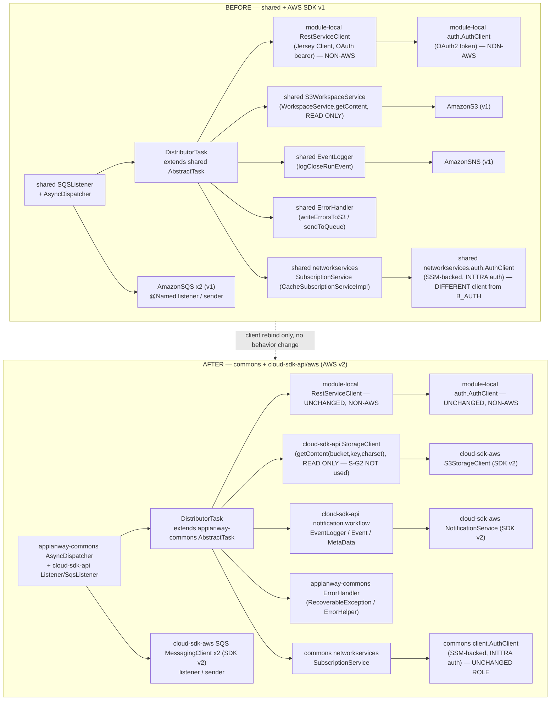
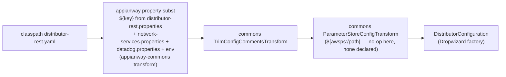

# `distributor-rest` — AWS SDK v2 (cloud-sdk) Upgrade Design

> Module: `distributor-rest` · Date: 2026-07-22 · Author: Claude (Opus 4.8)
> **Program brief (read first, do not duplicate):** [`2026-07-22-appianway-awsupgrade-foundation-claude.md`](../../2026-07-22-appianway-awsupgrade-foundation-claude.md) §2–§8 — `shared`→`commons`/`cloud-sdk-api`/`cloud-sdk-aws`/slim `appianway-commons` mapping, the config/SSM composition model, the assumed cloud-sdk gaps (S-G2/W-G9/X-G7/X-G8/C-G6), the Maven template, and this per-module section template (§7).
> **Verified INT run state (baseline, current `shared`/DW5 code):** [`2026-07-22-appway-app-checkouts-run-config.md`](../../2026-07-22-appway-app-checkouts-run-config.md) §4.3 — distributor-rest boots clean on Dropwizard 5.0.2 / Jetty 12.1.9 / Java 17, **registers no health checks**, and its AWS resolution is proven by boot evidence, not an ops probe.
> **Supersedes / updates:** [2026-05-31 DESIGN](2026-05-31-distributor-rest-aws2x-upgrade-DESIGN-claude.md) + [2026-05-31 PLAN](2026-05-31-distributor-rest-aws2x-upgrade-plan-claude.md) (both now carry a pointer banner to this doc — see their §0). This doc is scoped narrower than those: **AWS v1→v2 + drop-`shared` only** (DW4→5/Jetty12 is already DONE, per ION-16098 — those prior docs still bundled the DW5 jump into the same migration; that work is now baseline).
> **Target:** `mercury-services-commons` **`1.0.27-SNAPSHOT`** (supersedes the `1.0.26-SNAPSHOT` cited in the 2026-05-31 docs).

---

## 1. Overview

`distributor-rest` is the **REST-delivery leg of the distribution fan-out**: it consumes a `MetaData` envelope from the `inttra_int_sqs_rest_delivery` SQS queue, reads the referenced payload from S3 (`inttra-int-workspace`, read-only, **ISO-8859-1**), looks up the target `Subscription` via network-services, builds an HTTP request, and **POSTs** the payload to the subscriber's REST/webhook endpoint with an OAuth2 bearer token obtained from a module-local `AuthClient`. On success it logs a close-run lineage event (SNS `inttra_int_sns_event`); on failure it routes through `shared` `ErrorHandler` (which can write to the error SQS `inttra_int_sqs_subscription_errors`).

- **Current state:** DW5/Jetty12/Java17 baseline (ION-16098, done); AWS Java SDK **v1** (`AmazonSQS`/`AmazonS3`/`AmazonSNS`) bound directly in `ExternalServicesModule`; appianway `shared` for config command, network-services, event/`MetaData` model, `SQSListener`/`AsyncDispatcher`, `ErrorHandler`.
- **Target state:** `commons` (config command, network-services `AuthClient`, health base — unused here) + `cloud-sdk-api`/`cloud-sdk-aws` (`MessagingClient<String>`, `StorageClient`, `NotificationService`) + slim `appianway-commons` (`AsyncDispatcher`/`AbstractTask`, `ErrorHandler`/`RecoverableException`).
- **Headline change:** this is the **lightest migration in the program — a pure client rebind**. There is exactly **one** AWS binding point (`ExternalServicesModule`), S3 usage is **read-only** (S-G2 not exercised), and the module's entire HTTP/OAuth egress half (Jersey client, module-local `AuthClient`, `Retryer`, `RequestBuilder`, `e2net.*`) is **non-AWS and completely untouched** by this migration.
- **Distinguishing fact carried over from the run-config verification:** `DistributorApplication.run()` **registers no health checks** (`registerHealthChecks(...)` is never called; only an unused `HealthCheckConfig` bean exists). `GET /admin/opsHealthcheck` → 404; `/admin/healthcheck` → 200 with only the default `deadlocks` check. Verification of the AWS rebind is therefore by **boot evidence** (SQSListener starts + polls with zero errors, `AuthClient`/SSM succeeds), exactly as documented in the checkouts doc — **not** by an ops-healthcheck endpoint. This doc calls it out again in §4/§9/§10 so it isn't lost.

---

## 2. Current vs Target architecture



### Class/type mapping

| `shared` (`com.inttra.mercury.shared.*`) / v1 type | Replacement | Home | Notes |
|---|---|---|---|
| `command.ConfigProcessingServerCommand` | `com.inttra.mercury.config.ConfigProcessingServerCommand` + composed appianway property-substitution transform | commons + appianway-commons | §5 |
| `config.S3ConfigurationProvider` | kept as-is (module still guards it with `S3ConfigurationProvider.requiresS3Configuration()`) | appianway-commons | unchanged behavior |
| `config.BaseConfiguration`, `SQSConfig`, `SNSConfig`, `S3Config`, `NetworkServiceConfig`, `AWSClientConfiguration` | cloud-sdk config types (`AwsMessagingClientConfig`, `NotificationClientConfig`, `CloudStorageConfig`) bound in `ExternalServicesModule`; `DistributorConfiguration` (module POJO) keeps `healthCheckConfig`/`networkServiceConfig`/`restClientConfig` as today | cloud-sdk-aws / module | field names/YAML keys unchanged |
| `messaging.SQSListenerClient`, `messaging.SQSClient` (v1 `AmazonSQS`) | `cloud-sdk-api` `MessagingClient<String>` (listener + sender instances) | cloud-sdk-api/aws | two `@Named` bindings retained |
| `listener.SQSListener`, `listener.support.ListenerManager` | kept — appianway concurrency model, re-typed onto `MessagingClient<String>`/`QueueMessage<String>` | appianway-commons | not replaced by cloud-sdk `Listener` (O-G1 optional, not taken) |
| `threaddispatcher.AsyncDispatcher`, `task.AbstractTask`, `task.TaskFactory` | same classes, moved | appianway-commons | no logic change |
| `event.EventPublisher`, `event.SNSEventPublisher` (v1 `AmazonSNS`) | `cloud-sdk-api` `NotificationService.publish` + `notification.workflow.EventPublisher`/`SnsEventPublisher` | cloud-sdk-api/aws | |
| `event.Event`, `event.EventLogger`, `event.RandomGenerator` | `cloud-sdk-api` `notification.workflow.{Event,EventLogger,EventGenerator}` | cloud-sdk-api | **W-G9 relevant** — see §6 |
| `task.MetaData` | `cloud-sdk-api` `notification.workflow.MetaData` | cloud-sdk-api | field-identical (foundation §5A); `Projection.SUBSCRIPTION_ID` read here — one of the 6 constants in the W-G9.2 gap, must exist for this module to compile |
| `task.ErrorHandler`, `task.errorhandler.ErrorHelper`, `externalwrapper.exception.RecoverableException` | same classes, moved | appianway-commons | writes to error SQS + S3 error path unchanged |
| `workspace.WorkspaceService`, `workspace.S3WorkspaceService` (v1 `AmazonS3`) | `cloud-sdk-api` `StorageClient` (only `getContent(bucket,key,Charset)` used) | cloud-sdk-api/aws | **read-only — S-G2 not exercised** |
| `networkservices.auth.AuthClient`, `networkservices.subscription.{SubscriptionService, CacheSubscriptionServiceImpl}`, `networkservices.format.*`, `networkservices.integrationprofile*.*`, `parameterstore.ParameterStoreModule`, `networkservices.NetworkRetryerModule` | `commons` `com.inttra.mercury.networkservices.*` + `client.AuthClient` | commons | SSM-backed INTTRA auth — **not** the module-local REST `AuthClient` (see next row) |
| `distributorrest.auth.AuthClient`, `task.RestServiceClient`, `task.RequestBuilder`, `task.Request`, `auth.OAuthRequest`, `e2net.*` | **unchanged, no home change** — pure Jersey/JAX-RS OAuth2 client to the downstream subscriber webhook | module-local | **non-AWS; zero migration work** |
| `com.amazonaws.services.sqs.model.Message` | `cloud-sdk-api` `messaging.QueueMessage<String>` (`getPayload()` replaces `getBody()`) | cloud-sdk-api | drives `DistributorTask.process` re-typing |

---

## 3. AWS touchpoints

| Direction | Resource (INT) | cloud-sdk client | Notes |
|---|---|---|---|
| SQS in (pickup) | `inttra_int_sqs_rest_delivery` (`https://sqs.us-east-1.amazonaws.com/081020446316/inttra_int_sqs_rest_delivery`) | `MessagingClient<String>` `@Named("amazonSQSForListener")` equivalent | `SQSListener` polls, `waitTimeSeconds=20`, `maxNumberOfMessages=5` |
| SQS out (error) | `inttra_int_sqs_subscription_errors` | `MessagingClient<String>` `@Named("amazonSQSForSender")` equivalent | used by `ErrorHandler`/`ErrorHelper` on non-recoverable failure |
| SNS (lineage) | `inttra_int_sns_event` (`arn:aws:sns:us-east-1:081020446316:inttra_int_sns_event`) | `NotificationService` | close-run event publish only, no domain payload |
| S3 read | `inttra-int-workspace` | `StorageClient.getContent(bucket, key, Charset.ISO_8859_1)` | **read-only** — the payload file referenced by `MetaData.getBucket()/getFileName()`; **no write, no copy** in this module (`s3OutboundConfig.bucket=inttra-int-outbound-delivery` is declared in `conf/int/distributor-rest.properties` but is **not referenced anywhere** in `distributor-rest.yaml` or the source — dead property, carry forward as-is, do not remove without separate cleanup) |
| DynamoDB | none | n/a | not used by this module |
| SES | none | n/a | not used by this module |
| Param Store (SSM) | `/inttra/int/appianway/networkservices/authclientid`, `/inttra/int/appianway/networkservices/authclientsecret` | commons `CloudParameterStore` (via `client.AuthClient`/`ParameterStoreModule` equivalent) | resolved at **runtime**, not boot-time `${awsps:}` — unchanged mechanism (§5) |
| gRPC | none | n/a | not used by this module |
| HTTP egress (non-AWS) | subscriber webhook URL (per-`Subscription`, dynamic) + subscriber's own OAuth token endpoint | n/a — Jersey/JAX-RS `Client`, module-local `AuthClient` | untouched by this migration |

---

## 4. Sequence diagram — consume → S3 read → REST deliver → lineage

```mermaid
sequenceDiagram
    participant Q as SQS inttra_int_sqs_rest_delivery
    participant L as SQSListener (appianway-commons)
    participant D as AsyncDispatcher (appianway-commons)
    participant T as DistributorTask
    participant SC as StorageClient (cloud-sdk-api, READ)
    participant NSV as commons networkservices.SubscriptionService
    participant RB as RequestBuilder (local)
    participant RSC as RestServiceClient (local, non-AWS)
    participant AC as module-local auth.AuthClient (OAuth2, non-AWS)
    participant SUB as Subscriber REST webhook (external)
    participant EL as EventLogger (cloud-sdk-api)
    participant NS as NotificationService -> SNS inttra_int_sns_event
    participant ERR as ErrorHandler (appianway-commons)
    participant EQ as SQS inttra_int_sqs_subscription_errors

    L->>Q: receiveMessages (wait=20s, max=5)
    Q-->>L: List<QueueMessage<String>>
    L->>D: dispatch(messages, queueUrl)
    D->>T: process(QueueMessage<String>, queueUrl)
    T->>T: MetaData = Json.fromJsonString(msg.getPayload())
    T->>T: subscriptionId = metaData.getProjections().get(SUBSCRIPTION_ID)
    alt subscriptionId present
        T->>SC: getContent(metaData.getBucket(), metaData.getFileName(), ISO_8859_1)
        SC-->>T: fileContent (String)
        T->>NSV: findSubscriptions(subscriptionId)
        NSV-->>T: Subscription
        T->>RB: build(subscription) -> Request{url, headers, OAuthRequest}
        T->>RSC: post(request, fileContent)
        RSC->>AC: getToken(oAuthRequest)
        AC-->>RSC: bearer token (cached; refreshed on 401)
        RSC->>SUB: POST fileContent, Authorization: bearer <token>
        SUB-->>RSC: 2xx {status, e2openTransactionId}
        RSC-->>T: transactionId
        T->>EL: logCloseRunEvent(CLOSE_WORKFLOW, success, {PICK_UP_QUEUE, E2OPEN_TRANSACTION_ID})
        EL->>NS: publish(event) -> SNS
        T->>L: deleteMessage (ack, via AbstractTask.execute)
    else subscriptionId absent
        T->>T: log.error("No subscriptionId!!!") — no delivery, no error routed
    else NonRecoverableException / IOException
        T->>ERR: handleException(message, metaData, runId, tokens, ex)
        ERR->>ERR: writeErrorsToS3 (if applicable) + buildErrorMetaData
        ERR->>EQ: sendToQueue (error SQS) / sendBackToPickupQueue (recoverable)
        ERR->>EL: logCloseRunEvent (failure)
    end
```

---

## 5. Configuration changes (§4.3 checklist, fully worked)

### 5.1 Property-key table (`conf/distributor-rest.yaml` ← `conf/int/distributor-rest.properties` + `configuration/int/network-services.properties`)

| YAML path | `${key}` | INT value | Notes |
|---|---|---|---|
| `componentName` | `${componentName:-distributor-rest}` | `distributor-rest` | |
| `healthCheckConfig.errorRateThreshold` | `${distributor.healthCheckConfig.errorRateThreshold:-5.0}` | `5.0` (default, not set in `.properties`) | **unused** — `registerHealthChecks` never called, so this bean is dead config |
| `healthCheckConfig.networkServiceHealthCheckUrl` | `${networkservices.healthCheckUrl}` | `https://api-alpha.inttra.com/network/services/ping` | same — unused (no health check consumes it) |
| `snsEventConfig.topicArn` | `${distributor.snsEventConfig.topicArn}` | `arn:aws:sns:us-east-1:081020446316:inttra_int_sns_event` | |
| `sqsErrorConfig.queueUrl` | `${distributor.sqsErrorSubscriptionConfig.queueUrl}` | `https://sqs.us-east-1.amazonaws.com/081020446316/inttra_int_sqs_subscription_errors` | |
| `sqsPickupConfig.queueUrl` | `${distributor.pickupSQSConfig.queueUrl}` | `https://sqs.us-east-1.amazonaws.com/081020446316/inttra_int_sqs_rest_delivery` | |
| `sqsPickupConfig.waitTimeSeconds` | `${distributor.pickupSQSConfig.waitTimeSeconds:-20}` | `20` (default) | |
| `sqsPickupConfig.maxNumberOfMessages` | `${distributor.pickupSQSConfig.maxNumberOfMessages:-5}` | `5` (default) | |
| `restClientConfig.connectTimeout` | literal `60000` (not templated) | `60000` | **local, non-AWS**; unaffected by this migration |
| `restClientConfig.readTimeout` | literal `60000` (not templated) | `60000` | **local, non-AWS**; unaffected |
| `s3WorkspaceConfig.bucket` | `${distributor.s3WorkspaceConfig.bucket}` | `inttra-int-workspace` | read-only |
| *(dead property, not in YAML)* | `distributor.s3OutboundConfig.bucket` | `inttra-int-outbound-delivery` | present in `.properties`, referenced by neither YAML nor code — carry forward unchanged |
| `networkServiceConfig.networkBaseUrl` | `${networkservices.networkBaseUrl}` | `https://api-alpha.inttra.com/network` | |
| `networkServiceConfig.authEndpointUrl` | `${networkservices.authEndpointUrl}` | `https://api-alpha.inttra.com/auth` | |
| `networkServiceConfig.clientId` | `${networkservices.clientId}` | `/inttra/int/appianway/networkservices/authclientid` | **SSM path**, see §5.2 |
| `networkServiceConfig.clientSecret` | `${networkservices.clientSecret}` | `/inttra/int/appianway/networkservices/authclientsecret` | **SSM path**, see §5.2 |
| `networkServiceConfig.usePassThrough` | `${networkservices.usePassThrough}` | `false` | drives SSM vs. plain-text resolution |
| `networkServiceConfig.servicePaths.integrationProfileServicePath` | `${networkservices.integrationProfileServicePath}` | `/participant/integrationProfile` | |
| `networkServiceConfig.servicePaths.integrationProfileFormatServicePath` | `${networkservices.integrationProfileFormatServicePath}` | `/participant/integrationProfile/format` | |
| `networkServiceConfig.servicePaths.formatServicePath` | `${networkservices.formatServicePath}` | `/message/format` | |
| `networkServiceConfig.servicePaths.subscriptionSearchPath` | `${networkservices.subscriptionSearchPath}` | `/subscription/subscription` | **used directly** by `DistributorTask` → `SubscriptionService.findSubscriptions` |
| `server.connector.port` | `${server.connector.port:-8081}` | **8081** | single `simple` connector, `/application` + `/admin` share the port |
| `logging.level` | `${distributor.logging.level:-INFO}` | `INFO` (default) | |
| `metrics.frequency` | `${metrics.frequency}` | (set in `datadog.properties`) | unchanged |

### 5.2 SSM parameter table

| SSM path | Resolved by | Mechanism | Post-migration decision |
|---|---|---|---|
| `/inttra/int/appianway/networkservices/authclientid` | commons `client.AuthClient` (network-services auth, via `CloudParameterStore`) | **runtime**, at `AuthClient` construction (`asEagerSingleton()` — fail-fast on boot) | **Keep runtime resolution.** Do not move to boot-time `${awsps:/path}` YAML substitution — `usePassThrough=false` semantics (SSM vs. `PassThroughParameterSupplier`) is preserved as-is by commons' equivalent of `ParameterStoreModule`. |
| `/inttra/int/appianway/networkservices/authclientsecret` | same | same | same |

- `usePassThrough` handling: `networkServiceConfig.usePassThrough=${networkservices.usePassThrough}` (INT = `false`) continues to select the SSM-backed supplier over `PassThroughParameterSupplier`; commons' network-services module preserves this toggle 1:1.
- **No boot-time `${awsps:...}` substitution is introduced in this module** — there is nothing else secret-shaped in `distributor-rest.yaml` to move to `ParameterStoreConfigTransform`. The composition in §5.3 still runs the transform (harmless no-op here) for consistency with every other module.
- The module-local `auth.AuthClient` (OAuth2 bearer to the subscriber webhook) has **no SSM involvement at all** — `clientUserId`/`clientSecret` for that flow come from the `Subscription`'s `Action`/`ActionParameter` records (network-services data), not SSM.

### 5.3 Config-command composition



- CLI shape unchanged: `run distributor-rest.yaml conf/int/distributor-rest.properties ../configuration/int/network-services.properties ../configuration/int/datadog.properties`.
- `DistributorApplication.initialize(bootstrap)` still guards `S3ConfigurationProvider.requiresS3Configuration()` (`CONFIG_LOCATION=s3`) before installing `bootstrap.addCommand(new ConfigProcessingServerCommand<>(this))` — swap only the import from `com.inttra.mercury.shared.command.ConfigProcessingServerCommand` to the commons equivalent (composed with the appianway transform per foundation §4.2/C-G6).
- `CONFIG_REGION` (`-DCONFIG_REGION=US_EAST_1`) and `datadog.properties` pass-through: **unchanged**.

### 5.4 What is unchanged
- CLI arg shape, port 8081, single `simple` server (`/application` + `/admin` share the port).
- `RestClientConfig` (connect/read timeout = 60000ms, literal in YAML, not templated) — local, non-AWS.
- The module-local OAuth2 `AuthClient`/`RequestBuilder`/`RestServiceClient`/`e2net.*` chain — zero change.
- No `ce-`/`os-` run-profile variants for this module (single deployment, single properties file, unlike ingestor/splitter/transformer).
- Queue names, topic ARN, bucket name, SSM paths — **none renamed** (per foundation §4.3 contract).

---

## 6. cloud-sdk / commons dependencies & assumed gaps

| Gap ID | Exercised by this module? | Detail |
|---|---|---|
| **S-G2** (S3 `putObject`/`copyObject` with metadata) | **No.** Verified — `DistributorTask` calls only `workspaceService.getContent(bucket, fileName, ISO_8859_1)`; there is no `putObject`/`copyObject` call anywhere in `distributor-rest` source. `s3OutboundConfig.bucket` is a dead, unreferenced property. This module needs only the existing `StorageClient.getContent(bucket,key,Charset)` read API. |
| **W-G9** (workflow-model parity) | **Yes — this module both consumes and produces on the wire.** It deserializes `MetaData` off `inttra_int_sqs_rest_delivery` (reads `Projection.SUBSCRIPTION_ID` — one of the foundation §5A W-G9.2 constant-parity additions) and calls `eventLogger.logCloseRunEvent(...)` with `Event.SubType.CLOSE_WORKFLOW` and `Event.Token.PICK_UP_QUEUE`/`E2OPEN_TRANSACTION_ID` tokens (`E2OPEN_TRANSACTION_ID` is not in the current cloud-sdk-api `Event.Token` set surveyed in foundation §5A and must be included in the W-G9.2 constant-parity list, or added locally if it is appianway-distributor-rest-specific — **verify against the final W-G9.2 constant diff before cutover**). This module does not itself carry `Annotations` on its events (no `setAnnotations` call in `DistributorTask`/`ErrorHandler`), so it is not exposed to the W-G9.1 builder defect as a producer, but as a consumer of the shared `inttra_int_sqs_rest_delivery` envelope it benefits from the fix being landed program-wide. |
| **X-G7** (email reply-to) | No — no email sending in this module. |
| **X-G8** (Jest/OpenSearch signing) | No — no Elasticsearch/Jest usage. |
| **C-G6** (config transformer visibility) | Optional convenience only; §5.3 composition works without it. |

**Consumed from commons:** `com.inttra.mercury.config.ConfigProcessingServerCommand`, `com.inttra.mercury.networkservices.*` (`FormatService`, `IntegrationProfileByIdService`, `IntegrationProfileFormatByIdService`, `SubscriptionService`), `client.AuthClient`, `CloudParameterStore`/SSM auth resolution.
**Consumed from cloud-sdk-api/aws:** `MessagingClient<String>` (×2, listener + sender), `QueueMessage<String>`, `StorageClient` (read only), `NotificationService`, `notification.workflow.{MetaData, Event, EventLogger, EventGenerator}`.
**Moves to appianway-commons:** `AsyncDispatcher`, `AbstractTask`, `TaskFactory`, `Dispatcher`, `SQSListener`, `ListenerManager`, `ErrorHandler`, `ErrorHelper`, `RecoverableException`, `NonRecoverableException` (module-local, extends the appianway-commons exception taxonomy).
**Stays module-local (no commons/cloud-sdk involvement at all):** `auth.AuthClient`, `auth.OAuthRequest`, `task.RestServiceClient`, `task.RequestBuilder`, `task.Request`, `e2net.{Response,ResponseWrapper,Status,Token}`, `RetryerBuilder` — the entire OAuth2/Jersey egress half.

---

## 7. Maven dependency changes

Applying the foundation §6 template concretely to `distributor-rest/pom.xml`:

**Remove**
```xml
<!-- retired -->
<dependency>
    <groupId>com.inttra.mercury.shared</groupId>
    <artifactId>mercury-shared</artifactId>
    <version>${mercury.shared.version}</version>
</dependency>
<!-- v1 SQS, the module's only direct AWS dep -->
<dependency>
    <groupId>com.amazonaws</groupId>
    <artifactId>aws-java-sdk-sqs</artifactId>
    <version>${aws-java-sdk.version}</version>
</dependency>
```
(S3/SNS v1 arrive only transitively via `shared` today — they disappear automatically once `shared` is removed; no separate direct exclusion needed.)

**Add**
```xml
<dependency>
    <groupId>com.inttra.mercury</groupId>
    <artifactId>cloud-sdk-api</artifactId>
    <version>1.0.27-SNAPSHOT</version>
</dependency>
<dependency>
    <groupId>com.inttra.mercury</groupId>
    <artifactId>cloud-sdk-aws</artifactId>
    <version>1.0.27-SNAPSHOT</version>
</dependency>
<dependency>
    <groupId>com.inttra.mercury</groupId>
    <artifactId>commons</artifactId>
    <version>1.0.27-SNAPSHOT</version>
</dependency>
<dependency>
    <groupId>com.inttra.mercury</groupId>
    <artifactId>appianway-commons</artifactId>
    <version>1.0-SNAPSHOT</version>
</dependency>
```
AWS SDK **v2** arrives transitively via `cloud-sdk-aws`'s BOM management — do not declare it directly.

**Unchanged (module-specific, non-AWS)**
- `jersey-common`/`jersey-client`/`jersey-hk2`/`jersey-media-multipart`/`jersey-server`/`jersey-container-servlet-core` (3.1.11) — the JAX-RS egress stack.
- `com.github.rholder:guava-retrying`-style `Retryer` (`RetryerBuilder`) — via whichever coordinate currently supplies `com.github.rholder.retry.*` (transitively today, likely via `shared` — **verify it still resolves once `shared` is removed; add an explicit dependency if it was only a transitive hitchhiker**).
- `com.palominolabs.metrics:metrics-guice`, `io.dropwizard.metrics:metrics-annotation`, `com.google.guava:guava`, `com.google.inject:guice`.
- `dropwizard-core` (already at DW5 per ION-16098 baseline) — inherit version from root/commons dependency management.
- `functional-testing` (test scope) — re-pointed to cloud-sdk-api in lockstep (§8); still declared as `1.0` unless the rollout also bumps it.
- `org.projectlombok:lombok`, `mockito-core`, `junit`, `assertj-core`.

**Align (already done by ION-16098 baseline)**
- Dropwizard 5.0.2 / Jetty 12.1.9 / Jackson 2.21.4 / Java 17 — inherit from mercury-services-commons dependency management where the parent pom allows.

**Verify**
```
mvn -pl distributor-rest -am clean verify
```
(`clean` is required — the shade plugin otherwise leaves stale v1 classes in the fat jar.)

---

## 8. Tests

- **JUnit 5 direction:** new/updated tests target JUnit 5 (`dropwizard-testing`); existing JUnit 4 tests run under Vintage during the transition window, then are converted.
- **Mock re-pointing:** `AmazonSQS`/`AmazonS3`/`AmazonSNS` mocks → `MessagingClient<String>`/`StorageClient`/`NotificationService`; `com.amazonaws.services.sqs.model.Message` → `QueueMessage<String>` (`getBody()`→`getPayload()`).
- **`DistributorTask` unit tests must assert:**
  - `StorageClient.getContent(bucket, fileName, StandardCharsets.ISO_8859_1)` invoked with exactly that charset (regression guard — the prior 2026-05-31 doc's charset-preservation risk carries forward unchanged).
  - `SubscriptionService.findSubscriptions(subscriptionId)` invoked with the value read from `MetaData.Projection.SUBSCRIPTION_ID`.
  - `RestServiceClient.post(request, fileContent)` invoked with the S3-read content (mock the egress boundary — do not exercise real HTTP).
  - `EventLogger.logCloseRunEvent(..., Event.SubType.CLOSE_WORKFLOW, ..., success=true, {PICK_UP_QUEUE, E2OPEN_TRANSACTION_ID})` on success.
  - Missing-`subscriptionId` branch logs and does **not** call `restServiceClient`/`eventLogger`.
  - `NonRecoverableException`/`IOException` branch → `ErrorHandler.handleException(...)` invoked with the right `MetaData`/tokens.
- **W-G9 round-trip guard (per foundation §5A):** include (or reuse the shared corpus for) a `MetaData` JSON fixture carrying `Projection.SUBSCRIPTION_ID`, parsed through cloud-sdk-api, to prove the constant-parity fix (W-G9.2) is present before this module's `mvn verify` is trusted.
- **Egress tests unaffected:** WireMock/JAX-RS tests around `RestServiceClient`/module-local `AuthClient`/`RequestBuilder` should stay green with **zero** changes — this is the acceptance bar proving the AWS-boundary-only scope held.
- **`functional-testing` fakes:** re-pointed to cloud-sdk-api types in lockstep with the shared migration (program rollout order, foundation §8); distributor-rest's own tests consume those fakes for `MessagingClient`/`StorageClient`/`NotificationService`.

---

## 9. Rollout & verification

- **Position in program order (foundation §8):** after `appianway-commons` + `functional-testing` fakes + the `event-writer` pilot; grouped with `structuralvalidator` as the "light / read-only" pair — **before** the heavier `distributor`/`dispatcher`/`error-processor` S-G2 write consumers.
- **Build gate:** `mvn -pl distributor-rest -am verify` green (with `clean` first).
- **INT boot + verification procedure** (reuse [`2026-07-22-appway-app-checkouts-run-config.md`](../../2026-07-22-appway-app-checkouts-run-config.md) §5, adapted per §4.3's explicit caveat for this module):
  1. From `distributor-rest/`: `java -DCONFIG_REGION=US_EAST_1 -jar target/distributor-rest-1.0.jar run distributor-rest.yaml conf/int/distributor-rest.properties ../configuration/int/network-services.properties ../configuration/int/datadog.properties`.
  2. Confirm Jetty 12.1.9/Java 17 boot, `AuthClient` (commons network-services) `GET /auth` succeeds (SSM resolved), `SQSListener starting` on `inttra_int_sqs_rest_delivery` with **zero** errors post-boot.
  3. **Because this module registers no health checks, do NOT rely on `/admin/opsHealthcheck`** (it will 404, same as the pre-migration baseline) — verification is by boot-log evidence exactly as §4.3 documents: SSM+auth success line, clean SQSListener start, no exceptions in the polling loop.
  4. Optional deeper proof (out of scope for a pure rebind check, but available): drive one message through `inttra_int_sqs_rest_delivery` end-to-end and confirm a `StorageClient.getContent` read + a subscriber POST + a `logCloseRunEvent` all succeed, exercising the S3-read, SNS-lineage, and error-SQS paths that are otherwise only config-resolved at boot.
- **Regression bar:** WireMock/JAX-RS egress suite green with no changes (§8); confirms the AWS-boundary-only scope was actually held.

---

## 10. Risks & mitigations

| Risk | Mitigation |
|---|---|
| **No health checks to prove the rebind** — a broken `MessagingClient`/`StorageClient`/`NotificationService` binding might only surface as a silent SQS-polling stall, not an HTTP 500 | Rely on boot-log evidence (SQSListener start + zero-error polling window) per §9; consider — as a follow-up, **out of scope for this AWS migration** — adding `registerHealthChecks` wiring (the run-config doc flags this as a known gap, not something to fix silently as a side effect of the AWS rebind) |
| Two distinct `AuthClient` classes with the same simple name (`shared.networkservices.auth.AuthClient` → commons vs. `distributorrest.auth.AuthClient`, module-local OAuth2) causing confusion during the rebind | Explicit in §2/§6 tables; keep fully-qualified imports; do not let the commons migration touch the module-local class |
| ISO-8859-1 charset drift on the S3 read (binary-safe POST body) | Preserve `getContent(bucket, fileName, StandardCharsets.ISO_8859_1)` call exactly; unit-test asserts the charset argument (§8) |
| `Message`→`QueueMessage<String>` re-typing misses a call site (`getBody()`→`getPayload()`, `getReceiptHandle()`, `getMessageId()`) | Compiler-driven — the type change will not compile until every site is updated; `AbstractTask`/`ErrorHelper` sites move with the appianway-commons library, not per-module |
| `com.github.rholder.retry.Retryer` dependency currently arrives transitively (possibly via `shared`) | Verify resolution after `shared` removal (§7); add an explicit dependency if needed — do this **before** relying on a green `mvn verify` |
| W-G9.2 constant gap (`Projection.SUBSCRIPTION_ID`, `Event.Token.E2OPEN_TRANSACTION_ID` if not already in cloud-sdk-api) blocks compilation | Gate this module's migration behind the W-G9 cloud-sdk-api landing (foundation §5A); confirm both constants exist before starting the rebind PR |
| S3 dead property (`distributor.s3OutboundConfig.bucket`) mistaken for an active write path during review | Called out explicitly in §3/§5.1 as unreferenced; do not add a write capability as part of this migration — that would be scope creep beyond "pure client rebind" |
| Regression on the live subscriber-delivery path (this module sits on the hot egress path even though the AWS surface is thin) | Strict AWS-boundary-only scope (§1, §8); WireMock/JAX-RS suite must stay green; sequence after the lower-risk `event-writer` pilot per foundation §8 |
