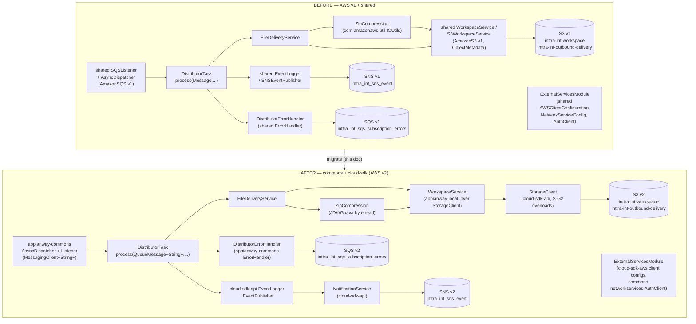

# `distributor` — AWS SDK v2 (cloud-sdk) Upgrade Design (claude)

> Module: `com.inttra.mercury.appian-way:distributor:1.0` · Date: 2026-07-22 · Author: Claude (Sonnet 5)
> **Program foundation:** [`2026-07-22-appianway-awsupgrade-foundation-claude.md`](../../2026-07-22-appianway-awsupgrade-foundation-claude.md) — read first; this doc references its §2 mapping, §3 slim `appianway-commons`, §4 config/SSM model, §5/§5A gap IDs, §6 Maven template, §7 section template, §8 rollout order verbatim and adds only distributor-specific detail.
> **INT run/health evidence:** [`2026-07-22-appway-app-checkouts-run-config.md`](../../2026-07-22-appway-app-checkouts-run-config.md) §4.2 — distributor boots clean on the DW5/Jetty12 baseline today; this doc is the AWS v1→v2 + drop-`shared` layer on top of that already-verified baseline.
> **This doc UPDATES/supersedes** the pre-DW5 pair [`2026-05-31-distributor-aws2x-upgrade-DESIGN-claude.md`](2026-05-31-distributor-aws2x-upgrade-DESIGN-claude.md) / [`-plan-claude.md`](2026-05-31-distributor-aws2x-upgrade-plan-claude.md) (target line was `1.0.26-SNAPSHOT`, `shared` was still going to be *retained* and internally migrated). **What's new here:** `shared` is retired outright (not migrated-in-place); target line is `1.0.27-SNAPSHOT`; the slim `appianway-commons` residue library is the heir of `shared`'s appianway-only parts; the config composition is now explicit (§5); W-G9 is called out as a **required** distributor-relevant gap (distributor's own `REPROCESS` projection key is one of the six missing `MetaData.Projection` constants — see §6).
> Baseline already in `develop`: Dropwizard 5.0.2 / Jetty 12.1.9 / Java 17 / Jackson 2.21.4 (ION-16098). This doc = AWS v1→v2 + drop-`shared` only.

---

## 1. Overview

**Purpose:** distributor is the ETL egress worker for outbound file delivery. It consumes a `MetaData` envelope off SQS, resolves delivery-attribute metadata (filename pattern, delivery/archive paths, zip flag) from the INTTRA integration-profile-format network service, renders the delivery filename via token resolvers, optionally zips the source object, then **copies the source object to two destinations with replaced S3 user-metadata** — the outbound delivery bucket and an archive path in the workspace bucket — before publishing a `CLOSE_WORKFLOW` event to SNS.

- **Current state:** DW5 baseline (ION-16098) already landed; still on **AWS Java SDK v1 1.12.720** end-to-end (`AmazonSQS`/`AmazonS3`/`AmazonSNS` via `com.amazonaws.*`) and the appianway `shared` module (`ConfigProcessingServerCommand`, `SQSListener`/`AsyncDispatcher`, `WorkspaceService`/`S3WorkspaceService`, `MetaData`/`Event`/`EventLogger`, `networkservices.*`, `ErrorHandler`).
- **Target state:** `commons` + `cloud-sdk-api` + `cloud-sdk-aws` (`1.0.27-SNAPSHOT`, AWS SDK v2, Guice 7, DW5) for everything `shared` provided, **except** the appianway-only residue (`AsyncDispatcher`/`AbstractTask`, `ErrorHandler`/`RecoverableException`, health-indicator glue, config-transform glue) which moves to the new slim **`appianway-commons`** library.
- **Headline change (per foundation §9 row 2):** distributor is the **primary S-G2 copy-with-replaced-metadata consumer** — its `FileDeliveryService.processMessage(...)` calls `WorkspaceService.copyObjectWithMetaDate(...)` **twice per message** (delivery copy + archive copy), each carrying a workflow-lineage + projection-key metadata map. This is the module that most directly depends on S-G2's `copyObject(..., Map replacedMetadata, String contentType)` overload with S3 `MetadataDirective.REPLACE`.

---

## 2. Current vs Target architecture



### 2.1 Class-level mapping — `shared`/v1 type → replacement

| Current (`com.inttra.mercury.shared.*` / v1) | Replacement | Home | Distributor call site |
|---|---|---|---|
| `command.ConfigProcessingServerCommand` | `com.inttra.mercury.config.ConfigProcessingServerCommand` + composed appianway property-substitution transform | commons + appianway-commons | `DistributorApplication.initialize()` |
| `config.S3ConfigurationProvider` | keep appianway-local (unchanged behavior) | appianway-commons / module | `DistributorApplication.initialize()` |
| `config.BaseConfiguration`, `SQSConfig`, `SNSConfig`, `S3Config`, `NetworkServiceConfig`, `AWSClientConfiguration` | cloud-sdk config types (`AwsMessagingClientConfig`, `NotificationClientConfig`, `CloudStorageConfig`) + module POJOs (`DistributorConfiguration` keeps the same field names/paths) | cloud-sdk-aws / module | `DistributorConfiguration`, `ExternalServicesModule` |
| `com.amazonaws.services.sqs.AmazonSQS` (×2 named bindings: `amazonSQSForListener`/`amazonSQSForSender`) | `cloud-sdk-api` `MessagingClient<String>` (listener + sender roles) | cloud-sdk-aws | `ExternalServicesModule.configure()` |
| `com.amazonaws.services.s3.AmazonS3` (`s3_read_put_copy`) | `cloud-sdk-api` `StorageClient` | cloud-sdk-aws | `ExternalServicesModule.configure()` |
| `com.amazonaws.services.sns.AmazonSNS` (`sns_publish`) | `cloud-sdk-api` `NotificationService` | cloud-sdk-aws | `ExternalServicesModule.configure()` |
| `listener.SQSListener` / `listener.support.ListenerManager` | `appianway-commons` (retained concurrency model, wired over `MessagingClient<String>`) | appianway-commons | `DistributorModule.getSQSListener/listenerManager` |
| `threaddispatcher.AsyncDispatcher`, `task.TaskFactory`, `task.AbstractTask` | `appianway-commons` (unchanged semantics) | appianway-commons | `DistributorModule.configure()`, `DistributorTask` |
| `com.amazonaws.services.sqs.model.Message` (`message.getBody()`) | `cloud-sdk-api` `QueueMessage<String>` (`.getPayload()`) | cloud-sdk-api | `DistributorTask.process(...)` |
| `workspace.WorkspaceService` / `S3WorkspaceService` (`copyObjectWithMetaDate`, `putObject`, `getS3InputStream`) | appianway-local `WorkspaceService` facade over `cloud-sdk-api` `StorageClient` (**S-G2**) | appianway-local (thin) over cloud-sdk-api | `FileDeliveryService.copyFile(...)`, `ZipCompression.process(...)` |
| `task.MetaData` | `cloud-sdk-api` `notification.workflow.MetaData` (field-identical per foundation §5A; `Projection.REPROCESS` needs **W-G9.2**) | cloud-sdk-api | `FileDeliveryService`, `DistributorTask`, `FileDeliveryAttributesProvider` |
| `event.Event`, `EventLogger`, `SNSEventPublisher`, `event.EventPublisher` | `cloud-sdk-api` `notification.workflow.{Event,EventLogger,EventPublisher}` (`Event.Token.PICK_UP_QUEUE`, `S3_DELIVERY_FILE_NAME_TOKEN` unaffected by the W-G9 gap) | cloud-sdk-api | `DistributorTask.process(...)`, `DistributorModule.snsEventPublisher(...)` |
| `networkservices.auth.AuthClient`, `format.CacheFormatService`, `integrationprofileformat.CacheIntegrationProfileFormatByIdService`, `integrationprofile.CacheIntegrationProfileByIdService`, `parameterstore.ParameterStoreModule`, `networkservices.NetworkRetryerModule` | `commons` `com.inttra.mercury.networkservices.*` + `client.AuthClient` | commons | `ExternalServicesModule.configure()`, `FileDeliveryAttributesProvider` |
| `healthcheck.HealthCheckRegistrar`, `indicator.{InboundSqsHealthCheck,OutboundSqsHealthCheck,SnsPublishHealthCheck,HttpGetHealthCheck,ErrorThresholdHealthCheck}` | commons `health.*` base + appianway-commons indicator wrappers re-pointed to injected `MessagingClient`/`NotificationService` | commons + appianway-commons | `DistributorApplication.registerHealthChecks(...)` |
| `task.ErrorHandler`, `task.errorhandler.ErrorHelper`, `externalwrapper.exception.RecoverableException` | `appianway-commons` (appianway error taxonomy preserved: `/exception/distributor/business/...`, `/exception/distributor/system/...`) | appianway-commons | `DistributorErrorHandler`, `ErrorConstants` |
| `com.amazonaws.util.IOUtils.toByteArray(...)` | JDK `InputStream.readAllBytes()` (no library replacement needed) | module-local | `ZipCompression.process(...)` |
| `org.zapodot.hystrix.bundle.HystrixBundle` (already commented out at [`DistributorApplication.java:50`](../src/main/java/com/inttra/mercury/distributor/DistributorApplication.java)) | **drop** (dead import + dependency) | n/a | `DistributorApplication` |

**Unchanged (no library involvement):** `TokensProcessor` + all 8 `TokenResolver` implementations, `Handler`/`Handlers`/`ZipCompression`'s JDK `java.util.zip` core, `FileDeliveryAttributes`/`OutputFileProperties` model classes, `AttributeNotFoundException`/`MissingProjectionException`.

---

## 3. AWS touchpoints

| Type | Direction | INT resource | cloud-sdk client | Notes |
|---|---|---|---|---|
| SQS | inbound (pickup) | `inttra_int_sqs_file_delivery` (queue URL `https://sqs.us-east-1.amazonaws.com/081020446316/inttra_int_sqs_file_delivery`) | `MessagingClient<String>` (listener role) | Consumed via `SQSListener`+`AsyncDispatcher` (appianway-commons), `waitTimeSeconds=20`, `maxNumberOfMessages=10` |
| SQS | outbound (error/dead-letter) | `inttra_int_sqs_subscription_errors` | `MessagingClient<String>` (sender role) | Written by `DistributorErrorHandler` on unrecoverable exceptions |
| SNS | publish | `inttra_int_sns_event` (`arn:aws:sns:us-east-1:081020446316:inttra_int_sns_event`) | `NotificationService` | `CLOSE_WORKFLOW` event per processed message, success or failure |
| S3 | read + copy-source | `inttra-int-workspace` | `StorageClient` | Source object for both copies; also target of the optional zip `putObject` |
| S3 | write (copy target #1 — delivery) | `inttra-int-outbound-delivery` | `StorageClient` (`copyObject` **S-G2**, `MetadataDirective.REPLACE`) | `FileDeliveryService.copyFile(source, deliveryFileName, s3MetaData)` |
| S3 | write (copy target #2 — archive) | `inttra-int-workspace` (archive path under the same bucket, rendered via token resolvers) | `StorageClient` (`copyObject` **S-G2**, `MetadataDirective.REPLACE`) | `FileDeliveryService.copyFile(source, archiveFileName, s3MetaData)` |
| S3 | write (zip, no metadata) | `inttra-int-workspace` | `StorageClient` (`putObject(bucket,key,byte[])`, existing metadata-less overload) | `ZipCompression.process(...)`, only when `zipCompression=true` from the integration-profile-format attributes |
| DynamoDB | — | none | — | not used by distributor |
| SES | — | none | — | not used by distributor |
| Param Store (SSM) | auth secrets | `/inttra/int/appianway/networkservices/authclientid`, `/inttra/int/appianway/networkservices/authclientsecret` | `commons` `networkservices.client.AuthClient` (runtime resolution, unchanged) | `usePassThrough=false`; resolved at boot via `ParameterStoreModule`/`CloudParameterStore` |
| gRPC | — | none | — | not used by distributor |
| Network-services (non-AWS, HTTP) | integration-profile-format lookup + health ping | `https://api-alpha.inttra.com/network/participant/integrationProfile/format`, `.../network/services/ping` | `commons` `networkservices.integrationprofileformat.CacheIntegrationProfileFormatByIdService` | `FileDeliveryAttributesProvider` resolves `fileNamePattern`/`fileNameSuffix`/`fileDeliveryPath`/`fileArchivePath`/`zipCompression` per message |

**Health-check shape (per run-config §4.2, unchanged by this migration):** read = inbound SQS + network-service HTTP GET + error-rate; write = outbound (error) SQS + SNS publish. **No S3 health check exists today** — both S3 buckets are config-resolved only. This migration re-points the same 5 checks to the injected v2 clients (`MessagingClient.getQueueAttributes` for SQS, `NotificationService` for SNS) without adding S3 coverage (out of scope; call out as a residual gap in §10 if desired later).

---

## 4. Sequence diagram — consume → resolve attributes → optional zip → copy-with-metadata (delivery + archive) → event

```mermaid
sequenceDiagram
    participant L as appianway-commons Listener\n(MessagingClient~String~)
    participant T as DistributorTask
    participant FAP as FileDeliveryAttributesProvider
    participant NS as commons networkservices\n(IntegrationProfileFormat)
    participant FDS as FileDeliveryService
    participant TP as TokensProcessor
    participant Z as ZipCompression (optional)
    participant WS as WorkspaceService (appianway-local)
    participant SC as StorageClient (cloud-sdk-aws, S-G2)
    participant S3 as S3 (SDK v2)
    participant EL as EventLogger → EventPublisher → NotificationService
    participant SNS as SNS (SDK v2)
    participant ERR as DistributorErrorHandler → MessagingClient (error queue)

    L->>T: process(QueueMessage<String> msg, pickupQueueUrl)
    T->>T: metaData = Json.fromJsonString(msg.getPayload(), MetaData.class)
    T->>FDS: processMessage(metaData)
    FDS->>FAP: apply(metaData)  %% needs Projection.OUTBOUND_INTEGRATION_PROFILE_FORMAT_ID
    FAP->>NS: getIntegrationProfileFormat(ipFormatId)
    NS-->>FAP: fileNamePattern, fileNameSuffix, fileDeliveryPath, fileArchivePath, zipCompression
    FAP-->>FDS: FileDeliveryAttributes
    FDS->>TP: render deliveryFileName / archiveFileName (token resolvers)
    opt attributes.isZipCompression() == true
        FDS->>Z: process(metaData, attributes, outputFileProperties)
        Z->>WS: getS3InputStream(workspaceBucket, metaData.getFileName())
        WS->>SC: getObject(...)
        Z->>Z: zip via JDK java.util.zip, JDK readAllBytes()
        Z->>WS: putObject(workspaceBucket, zipKey, bytes)  %% no metadata
        WS->>SC: putObject(bucket,key,bytes)  %% existing overload
        SC->>S3: PutObject
    end
    FDS->>FDS: build s3MetaData{rootWorkflowId, parentWorkflowId, workflowId,\nOUTBOUND_INTEGRATION_PROFILE_FORMAT_ID, CONTEXT_CODE, OUTBOUND_EDI_ID,\n+optional INFTPFILEPICKUPTIME, +optional REPROCESS}
    FDS->>WS: copyObjectWithMetaDate(workspaceBucket, source, outboundBucket, deliveryFileName, s3MetaData)
    WS->>SC: copyObject(src,srcKey,dst,dstKey, replacedMetadata, contentType)  %% S-G2, MetadataDirective.REPLACE
    SC->>S3: CopyObject(.metadata(meta).metadataDirective(REPLACE))
    FDS->>WS: copyObjectWithMetaDate(workspaceBucket, source, workspaceBucket, archiveFileName, s3MetaData)
    WS->>SC: copyObject(src,srcKey,dst,dstKey, replacedMetadata, contentType)  %% S-G2 again
    SC->>S3: CopyObject(.metadata(meta).metadataDirective(REPLACE))
    FDS-->>T: deliveryFileName
    T->>EL: logCloseRunEvent(metaData, CLOSE_WORKFLOW, runId, msg.getPayload(),\ncomponentName, startDateTime, success=true,\n{S3_DELIVERY_FILE_NAME_TOKEN: deliveryFileName, PICK_UP_QUEUE: pickupQueueUrl})
    EL->>SNS: publish(event JSON)
    alt exception during processMessage
        T->>ERR: handleException(msg, CLOSE_WORKFLOW, metaData, runId, startDateTime, {PICK_UP_QUEUE}, ex)
        ERR->>EL: logCloseRunEvent(success=false, error annotation)
        ERR->>ERR: send to inttra_int_sqs_subscription_errors (MessagingClient sender role)
    end
    L->>L: deleteMessage(pickupQueueUrl, receiptHandle) on success
```



> Verified against source: [`DistributorTask.java:46-79`](../src/main/java/com/inttra/mercury/distributor/task/DistributorTask.java), [`FileDeliveryService.java:38-108`](../src/main/java/com/inttra/mercury/distributor/services/FileDeliveryService.java), [`ZipCompression.java:29-58`](../src/main/java/com/inttra/mercury/distributor/handlers/ZipCompression.java), [`FileDeliveryAttributesProvider.java:35-46`](../src/main/java/com/inttra/mercury/distributor/services/FileDeliveryAttributesProvider.java). The two `copyObjectWithMetaDate` calls (delivery + archive), each carrying a 6–8 entry `Map<String,String>`, are the load-bearing S-G2 dependency for this module.

---

## 5. Configuration changes

Per foundation §4.3 checklist, fully worked for distributor.

### 5.1 Property-key table (INT values, `conf/int/distributor.properties` + `conf/distributor.yaml`)

| YAML path (`${key}`) | `conf/int/distributor.properties` value | Notes |
|---|---|---|
| `componentName` | `distributor` | unchanged |
| `healthCheckConfig.errorRateThreshold` | *(default)* `5.0` | `${distributor.healthCheckConfig.errorRateThreshold:-5.0}` — no INT override |
| `healthCheckConfig.networkServiceHealthCheckUrl` | `${networkservices.healthCheckUrl}` → `https://api-alpha.inttra.com/network/services/ping` (from `configuration/int/network-services.properties`) | unchanged |
| `snsEventConfig.topicArn` | `arn:aws:sns:us-east-1:081020446316:inttra_int_sns_event` | unchanged — **do not rename** |
| `sqsErrorConfig.queueUrl` | `https://sqs.us-east-1.amazonaws.com/081020446316/inttra_int_sqs_subscription_errors` | unchanged |
| `sqsPickupConfig.queueUrl` | `https://sqs.us-east-1.amazonaws.com/081020446316/inttra_int_sqs_file_delivery` | unchanged |
| `sqsPickupConfig.waitTimeSeconds` | *(default)* `20` | no INT override |
| `sqsPickupConfig.maxNumberOfMessages` | *(default)* `10` | no INT override |
| `s3WorkspaceConfig.bucket` | `inttra-int-workspace` | source + archive-copy target |
| `s3OutboundConfig.bucket` | `inttra-int-outbound-delivery` | delivery-copy target |
| `networkServiceConfig.networkBaseUrl` | `https://api-alpha.inttra.com/network` (from `network-services.properties`) | unchanged |
| `networkServiceConfig.authEndpointUrl` | `https://api-alpha.inttra.com/auth` | unchanged |
| `networkServiceConfig.clientId` / `.clientSecret` | SSM paths (§5.2) | unchanged |
| `networkServiceConfig.usePassThrough` | `false` | unchanged |
| `networkServiceConfig.servicePaths.integrationProfileFormatServicePath` | `/participant/integrationProfile/format` | primary lookup for `FileDeliveryAttributesProvider` |
| `networkServiceConfig.servicePaths.integrationProfileServicePath` | `/participant/integrationProfile` | bound but not on distributor's main path |
| `networkServiceConfig.servicePaths.formatServicePath` | `/message/format` | bound but not on distributor's main path |
| `server.connector.port` | *(default)* `8081` | matches run-config §4.2 evidence |
| `logging.level` | *(default)* `INFO` | unchanged |
| `metrics.frequency` | from `configuration/int/datadog.properties` | unchanged |

None of these keys, queue names, topic ARNs, or bucket names are renamed by this migration (foundation §4.3 rule 4 / §0 contract).

### 5.2 SSM parameters

| Parameter | Path | Resolution mechanism | Decision |
|---|---|---|---|
| `networkservices.clientId` | `/inttra/int/appianway/networkservices/authclientid` | **Keep runtime resolution** via commons `networkservices.client.AuthClient` / `CloudParameterStore` (unchanged behavior — `ParameterStoreModule` today, commons equivalent after) | No change to timing (still resolved at app-start, not baked into the YAML template) |
| `networkservices.clientSecret` | `/inttra/int/appianway/networkservices/authclientsecret` | same as above | same |
| `networkservices.usePassThrough=false` | n/a (literal) | `PassThroughParameterSupplier` bypass stays disabled — distributor always resolves real secrets from SSM | unchanged |

Distributor does **not** need any `${awsps:/path}` boot-time YAML substitution — its only secrets are the two network-services auth values, which are already runtime-resolved and stay that way. No SSM parameter migrates from runtime-resolution to boot-time resolution for this module.

### 5.3 Config-command composition

`appianway property-substitution transform` (multi-`.properties` + env, appianway-commons) **→** commons `TrimConfigCommentsTransform` **→** commons `ParameterStoreConfigTransform` (`${awsps:...}` — unused by distributor today, but composed for consistency across the program per foundation §4.2/C-G6). CLI shape and argument order are unchanged:

```
run distributor.yaml conf/int/distributor.properties \
  ../configuration/int/network-services.properties ../configuration/int/datadog.properties
```

### 5.4 What's unchanged

- CLI verb `run`, argument order/count, `-DCONFIG_REGION=US_EAST_1`.
- `datadog.properties` pass-through (metrics frequency only).
- `S3ConfigurationProvider` conditional install (`CONFIG_LOCATION=s3`) — stays appianway-local, no cloud-sdk involvement.
- No run profiles/variants for distributor (unlike ingestor's `ce-`/splitter's `ce-`/transformer's `ce-`/`os-`) — single deployment, single `distributor.yaml`.
- Port 8081, single `simple` Dropwizard server (`/application` + `/admin` share the port).

---

## 6. cloud-sdk / commons dependencies & assumed gaps

| Gap ID | Relevance to distributor | Detail |
|---|---|---|
| **S-G2** | **Primary consumer** | `StorageClient.copyObject(srcBucket,srcKey,dstBucket,dstKey, Map<String,String> replacedMetadata, String contentType)` (`MetadataDirective.REPLACE`) backs `WorkspaceService.copyObjectWithMetaDate(...)`, called **twice per message** (delivery + archive) at [`FileDeliveryService.java:97-108`](../src/main/java/com/inttra/mercury/distributor/services/FileDeliveryService.java). The metadata-less `putObject(bucket,key,byte[])` overload (already present) backs the zip write at [`ZipCompression.java:40`](../src/main/java/com/inttra/mercury/distributor/handlers/ZipCompression.java) — no new overload needed there. **No distributor-specific cloud-sdk change** — it consumes the program-wide S-G2 spec exactly as designed. |
| **W-G9** | **Directly exercised** — distributor's own metadata map uses `MetaData.Projection.REPROCESS` ([`FileDeliveryService.java:61-63`](../src/main/java/com/inttra/mercury/distributor/services/FileDeliveryService.java)), which is one of the **6 missing `Projection` constants** identified in foundation §5A. Distributor will not compile against cloud-sdk-api's current 26-key set until W-G9.2 lands the constant. The `Event.Token.PICK_UP_QUEUE` / `S3_DELIVERY_FILE_NAME_TOKEN` tokens used in `logCloseRunEvent(...)` are **not** among the 8 missing `Event.Token` keys (those are FTP_*/`ORIGINAL_FILE_SIZE`), so they are unaffected. Distributor does not itself send `Annotations` on its `Event`, so W-G9.1 (builder round-trip defect) does not block distributor's own publish path, but distributor's events still flow through the shared event-writer archive, so the corpus round-trip test (foundation §5A) gates the whole program including this module's events. |
| X-G7 | Not applicable | distributor sends no email |
| X-G8 | Not applicable | distributor has no OpenSearch/Jest dependency |
| C-G6 | Optional, not required | config composition works today with commons' `getConfigTransformer` staying `private` (§5.3) |

**Consumed from commons:** `ConfigProcessingServerCommand` (+ appianway transform composition), `networkservices.*` (`AuthClient`, `CacheFormatService`, `CacheIntegrationProfileByIdService`, `CacheIntegrationProfileFormatByIdService`, `ParameterStoreModule`-equivalent, `NetworkRetryerModule`-equivalent), `health.*` base.

**Consumed from cloud-sdk-api:** `MessagingClient<String>`, `QueueMessage<String>`, `StorageClient` (incl. S-G2 overloads), `NotificationService`, `notification.workflow.{MetaData,Event,EventLogger,EventPublisher}`, `notification.annotation.ErrorHelper`.

**Moves to `appianway-commons`:** `AsyncDispatcher`/`AbstractTask`/`TaskFactory`/`Dispatcher` (retained concurrency model, [`DistributorModule.java:58-61`](../src/main/java/com/inttra/mercury/distributor/modules/DistributorModule.java)), `SQSListener`/`ListenerManager` wiring, `ErrorHandler`/`RecoverableException` base (`DistributorErrorHandler` extends it), health-indicator wrappers (`InboundSqsHealthCheck`, `OutboundSqsHealthCheck`, `SnsPublishHealthCheck`, `HttpGetHealthCheck`, `ErrorThresholdHealthCheck` re-pointed to injected clients), the appianway property-substitution config transform.

**appianway-local (thin, not in appianway-commons — single/few consumers):** the `WorkspaceService` facade interface + its `StorageClient`-backed implementation (kept in distributor or a small shared internal package alongside dispatcher/error-processor, since multiple modules use the same `copyObjectWithMetaDate`/`putObject`/`getS3InputStream` shape — evaluate promoting to `appianway-commons` if ≥2 modules need the identical facade, per foundation §3 "more than one app needs" test).

---

## 7. Maven dependency changes

Per foundation §6 template, pinned to **`1.0.27-SNAPSHOT`**.

**Remove from [`distributor/pom.xml`](../pom.xml):**
- `com.inttra.mercury.shared:mercury-shared` ([pom.xml:22-27](../pom.xml)) — retired.
- `com.amazonaws:aws-java-sdk-sqs` ([pom.xml:44-49](../pom.xml)) — the only v1 AWS dep declared directly; S3/SNS v1 clients arrived transitively via `mercury-shared` and disappear once it's removed.
- `javax.xml.bind:jaxb-api:2.3.1` ([pom.xml:65-69](../pom.xml)) — verify still needed; drop if nothing in the migrated stack requires JAXB (DW5/Jetty12 baseline already assumes Jakarta namespaces).

**Add:**
- `com.inttra.mercury:cloud-sdk-api:1.0.27-SNAPSHOT`
- `com.inttra.mercury:cloud-sdk-aws:1.0.27-SNAPSHOT`
- `com.inttra.mercury:commons:1.0.27-SNAPSHOT`
- `com.inttra.mercury:appianway-commons:1.0-SNAPSHOT`
- AWS SDK v2 arrives transitively via `cloud-sdk-aws` (managed by the mercury-services-commons BOM) — do **not** declare v1 or v2 AWS artifacts directly.

**Align (already done by ION-16098, keep consistent — no action needed):**
- `io.dropwizard:dropwizard-core` (DW5) ([pom.xml:28-38](../pom.xml)), `io.dropwizard.metrics:metrics-annotation`, Jetty 12.1.9/Jackson 2.21.4 via parent dependency management.

**Unchanged / module-specific, keep as-is:**
- `com.google.inject:guice`, `com.palominolabs.metrics:metrics-guice`, `com.google.guava:guava` — no AWS coupling.
- `com.inttra.mercury.test:functional-testing:1.0` (test scope) — re-point its fakes to cloud-sdk-api lockstep with the program rollout (foundation §8).
- `org.mockito:mockito-core`, `junit:junit` (JUnit 4 today), `org.assertj:assertj-core` — add `dropwizard-testing` + JUnit 5 (Jupiter) for new tests; keep `junit-vintage-engine` during transition so [pom.xml:85-90](../pom.xml)'s existing JUnit 4 tests keep running.
- `org.projectlombok:lombok` (provided) — unchanged.
- `maven-shade-plugin` execution (main class `com.inttra.mercury.distributor.DistributorApplication`) — unchanged; run with `clean verify`/`clean package` (shade needs `clean` — stale fat jars otherwise, per foundation §6 "Verify").

**Verify:**
- `mvn -pl distributor -am clean verify` green (after `appianway-commons` + `commons`/`cloud-sdk-api`/`cloud-sdk-aws` are available at `1.0.27-SNAPSHOT`).
- Fat-jar boot + `GET /admin/opsHealthcheck` green against INT, reusing the exact procedure in `2026-07-22-appway-app-checkouts-run-config.md` §4.2 (5 checks: inbound SQS `inttra_int_sqs_file_delivery`, network-service ping, error-rate, outbound error SQS `inttra_int_sqs_subscription_errors`, SNS publish `inttra_int_sns_event`).

---

## 8. Tests

- **Direction:** new tests in JUnit 5 (Jupiter) via `dropwizard-testing`; existing JUnit 4 suite ([pom.xml:85-90](../pom.xml)) bridges via `junit-vintage-engine` until fully ported.
- **`functional-testing` fakes** re-pointed to cloud-sdk-api interfaces (`StorageClient`, `MessagingClient<String>`, `NotificationService`) in lockstep with the program-wide rollout (foundation §8) — distributor's tests depend on this module migrating first.
- **What to assert:**
  - `Message`→`QueueMessage<String>` parity: `DistributorTask` reads `getPayload()` instead of `getBody()`; add a test double producing `QueueMessage<String>` with the same `MetaData` JSON body.
  - **Metadata round-trip on both `copyObjectWithMetaDate` calls (delivery + archive)** — assert via a fake `StorageClient` that the destination object's `replacedMetadata` map contains `rootWorkflowId`, `parentWorkflowId`, `workflowId`, `OUTBOUND_INTEGRATION_PROFILE_FORMAT_ID`, `CONTEXT_CODE`, `OUTBOUND_EDI_ID`, and (when present in the incoming `MetaData.Projection` map) `INFTPFILEPICKUPTIME` and `REPROCESS`. This is the primary S-G2 regression guard for this module.
  - `REPROCESS` projection constant compiles and round-trips through cloud-sdk-api's `MetaData.Projection` once W-G9.2 lands — add a unit test asserting `MetaData.Projection.REPROCESS` resolves and is carried into the copy-metadata map when set on the inbound envelope.
  - `putObject(bucket,key,byte[])` (zip path) — return value still ignored at [`ZipCompression.java:40`](../src/main/java/com/inttra/mercury/distributor/handlers/ZipCompression.java); assert only the byte content written, not the return type.
  - Filename rendering (`TokensProcessor` + all 8 resolvers) — unaffected by the AWS migration; keep existing coverage green as a regression check.
  - Optional-zip on/off branching in `FileDeliveryService.compression(...)` / `Handlers.apply(...)` — unaffected logic, verify it still gates correctly with the new `WorkspaceService` facade.
  - `DistributorErrorHandler` error-code map (`AttributeNotFoundException` → `.../missingAttribute`, `MissingProjectionException` → `.../missingProjection`) — unaffected by AWS/library swap; keep as regression coverage.
  - JSON round-trip corpus test (foundation §5A gate) — distributor doesn't own this test, but its production `MetaData`/`Event` traffic (including `REPROCESS` and the two workflow-token keys) should be represented in the corpus since distributor is a genuine consumer of the gap constants.

---

## 9. Rollout & verification

Per foundation §8: `appianway-commons` (slim residue) → `functional-testing` fakes → event-writer (S3 pilot) → distributor-rest, structuralvalidator → splitter, ingestor → **dispatcher, distributor, error-processor (S-G2 write/copy consumers)** → email-sender, transformer → watermill.

1. Prerequisite: `appianway-commons` published, `functional-testing` fakes re-pointed, event-writer pilot green (proves S-G2 end-to-end in production shape), cloud-sdk `1.0.27-SNAPSHOT` available with W-G9 landed (distributor needs `Projection.REPROCESS` to compile).
2. Migrate distributor: rebind `ExternalServicesModule` to cloud-sdk-aws client configs + commons `networkservices`/`AuthClient`; `DistributorTask.process(Message,...)` → `process(QueueMessage<String>,...)`; swap `com.amazonaws.util.IOUtils` for JDK `readAllBytes()`; drop `aws-java-sdk-sqs` + `mercury-shared` from the pom; add `appianway-commons`/`commons`/`cloud-sdk-api`/`cloud-sdk-aws`.
3. `mvn -pl distributor -am clean verify` (pairs naturally with `error-processor`/`dispatcher` — all three are S-G2 write/copy consumers landing in the same rollout step per foundation §8).
4. INT boot + health-check evidence: reuse `2026-07-22-appway-app-checkouts-run-config.md` §4.2 procedure — run `java -DCONFIG_REGION=US_EAST_1 -jar target/distributor-1.0.jar run distributor.yaml conf/int/distributor.properties ../configuration/int/network-services.properties ../configuration/int/datadog.properties` from `distributor/`, confirm clean boot (`AuthClient` GET `/auth` succeeds, `SQSListener starting`, connector bound `0.0.0.0:8081`), and `GET /admin/opsHealthcheck` returns HTTP 200 with the same 5 checks (inbound SQS, network-service ping, error-rate, outbound error SQS, SNS publish).
5. Smoke test beyond boot evidence (not covered by the ops health check, since there's no S3 probe): deliver one document **with** zip enabled and one **without**, and confirm both the outbound-delivery object and the workspace-archive object carry the expected user-metadata keys and correct filenames.

---

## 10. Risks & mitigations

| Risk | Mitigation |
|---|---|
| `Projection.REPROCESS` missing from cloud-sdk-api until W-G9.2 lands | Gate distributor's migration behind cloud-sdk `1.0.27-SNAPSHOT` actually containing W-G9; do not attempt to compile distributor against an older cloud-sdk-api snapshot |
| S-G2 metadata not applied on copy (`REPLACE` directive dropped or defaulted to `COPY`) | Functional test asserting destination object's replaced-metadata map via fake `StorageClient`, for **both** the delivery and archive copies independently (they use different target buckets/keys) |
| Two sequential `copyObjectWithMetaDate` calls per message (delivery + archive) — partial failure leaves one copy done, one not | Preserve existing behavior (no transactionality today); document as a pre-existing condition, not a regression introduced by this migration |
| No S3 health check exists (per run-config §4.2 caveat) — a broken `StorageClient` binding could pass ops health while quietly failing the actual copy path | Out of scope for this migration (pre-existing gap); flag as a candidate follow-up to add an `S3ReadHealthCheck`/`S3WriteHealthCheck` from commons' health base once available |
| `Message`→`QueueMessage<String>` drift (`getBody()` vs `getPayload()`) | Parity test on `DistributorTask.process(...)`; same JSON envelope semantics, same `Json.fromJsonString` deserialization |
| `com.amazonaws.util.IOUtils` behavior diff after JDK swap | Unit test the zip helper (`ZipCompression.createZipInputStream` + byte read) for identical output bytes |
| In-memory buffering of large zipped payloads (`ByteArrayOutputStream`/`readAllBytes()`) | Parity preserved as-is; optional streaming `putObject(InputStream,long)` overload could be adopted later if memory pressure becomes an issue — not required for this migration |
| Any cloud-sdk/commons change breaking mercury-services production consumers | All changes distributor depends on (S-G2, W-G9) are strictly additive per foundation §5/§5A; no existing signature changes |
| `jaxb-api:2.3.1` removal breaking an undiscovered runtime dependency | Verify via `mvn -pl distributor -am clean verify` + full boot before removing; keep if any transitive consumer still needs `javax.xml.bind` |
