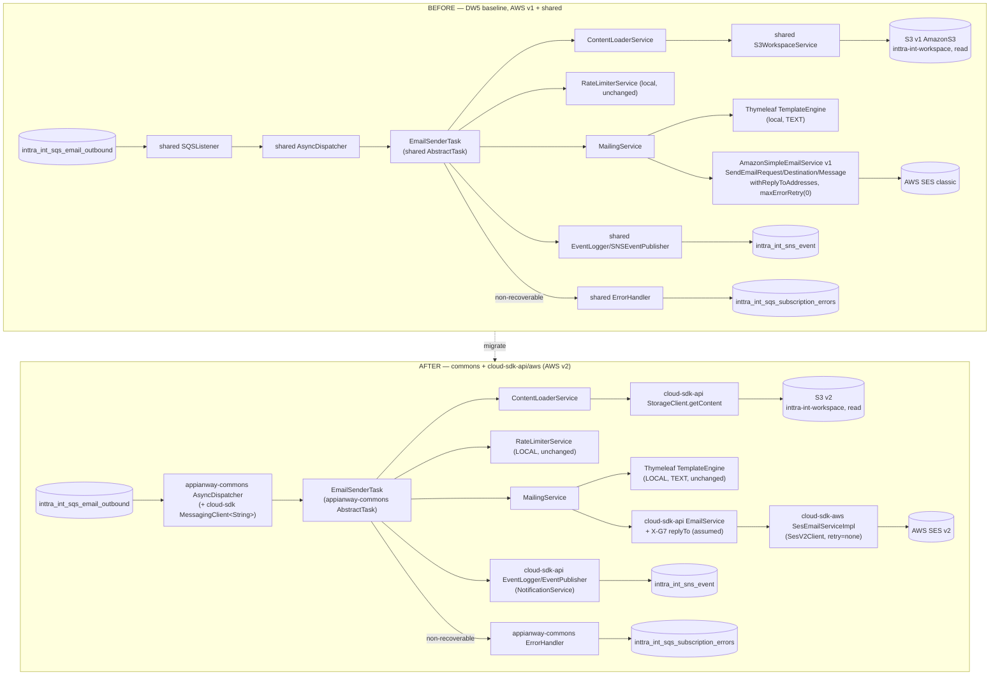
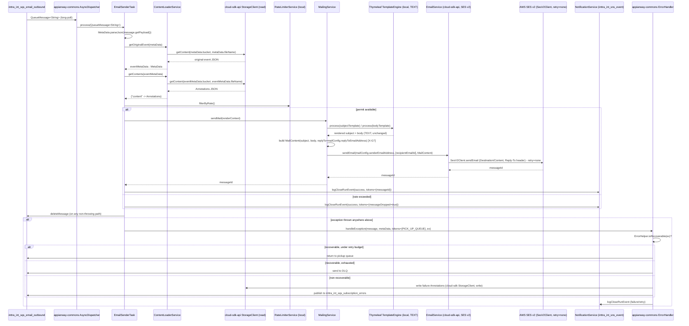
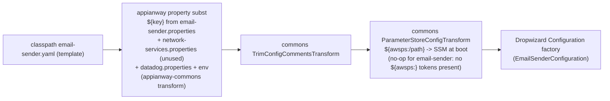

# `email-sender` — AWS SDK v2 (cloud-sdk) Upgrade Design (claude)

> Module: `com.inttra.mercury.appian-way:email-sender:1.0` · Date: 2026-07-22 · Author: Claude (Opus 4.8)
> Baseline: **Dropwizard 5.0.2 / Jetty 12.1.9 / Java 17 / Jackson 2.21.4** (ION-16098, already in `develop`; verified booting against INT — see [`2026-07-22-appway-app-checkouts-run-config.md`](../../2026-07-22-appway-app-checkouts-run-config.md) §4.4).
> This doc: **AWS v1 → v2 + drop `com.inttra.mercury.shared:mercury-shared`**, per the shared program brief [`2026-07-22-appianway-awsupgrade-foundation-claude.md`](../../2026-07-22-appianway-awsupgrade-foundation-claude.md) (§§2–8). Target line: **`mercury-services-commons` `1.0.27-SNAPSHOT`** (`commons` + `cloud-sdk-api` + `cloud-sdk-aws`) + slim **`appianway-commons:1.0-SNAPSHOT`**.
> Updates/supersedes: [`2026-05-31-email-sender-aws2x-upgrade-DESIGN-claude.md`](2026-05-31-email-sender-aws2x-upgrade-DESIGN-claude.md) + [`...-plan-claude.md`](2026-05-31-email-sender-aws2x-upgrade-plan-claude.md) (Option B chosen there is now the only option — `shared` is retired, not just de-emphasized) and the Copilot [`...-DESIGN.md`](2026-05-31-email-sender-aws2x-upgrade-DESIGN.md). Architecture reference: [`2026-05-24-email-sender-claude.design.md`](2026-05-24-email-sender-claude.design.md).

---

## 1. Overview

`email-sender` is the terminal notification leaf of the Mercury/Appian Way pipeline: it drains `inttra_int_sqs_email_outbound`, performs **two S3 reads** (the original workflow event, then that event's `Annotations` error document), renders subject + body **locally with Thymeleaf** (`TemplateMode.TEXT`), applies a **local Guava rate limiter**, and sends the message through **Amazon SES**. It is a pure queue worker — no REST resources, no `networkServiceConfig` block, no SSM-backed auth call at boot (confirmed by the 2026-07-22 INT boot: `EmailSenderApplication` never invokes `AuthClient`).

- **Current state:** DW5 baseline (ION-16098 done) + **AWS SDK v1 1.12.720** + `mercury-shared` (`AmazonSimpleEmailService`, `AmazonSQS`×2, `AmazonS3`, `AmazonSNS`, shared `SQSListener`/`AsyncDispatcher`/`ErrorHandler`/`MailContext`/`MetaData`/`Event`/`EventLogger`).
- **Target state:** `commons` + `cloud-sdk-api`/`cloud-sdk-aws` (SES v2, SQS v2, S3 v2, SNS v2) + slim `appianway-commons` for the concurrency/error/health residue. Thymeleaf and the rate limiter stay **exactly as they are today** — nothing about rendering or throttling changes.
- **Headline change (X-G7):** every email this module sends carries a **reply-to address** (`mailConfig.replyToEmailAddress`, INT value `no-reply@appianway-alpha.inttra.com`) via v1 `SendEmailRequest.withReplyToAddresses(...)` ([`MailingService.java:93`](../src/main/java/com/inttra/mercury/email/services/MailingService.java)). cloud-sdk-api's `MailContent`/`EmailService` today expose **no reply-to field** — confirmed gap in the foundation brief (§5, X-G7) and the consolidated gap doc. This is the one piece of module-specific cloud-sdk work email-sender depends on; everything else is a normal-client rebind.
- **Secondary theme:** template rendering (Thymeleaf, `TemplateMode.TEXT`) stays **entirely local** — G5 (a `ThymeleafTemplateService` in cloud-sdk-aws) is **de-scoped**; adding Thymeleaf to a library every mercury-services app depends on would violate the zero-transitive-impact constraint. cloud-sdk-api does have a `TemplateService`/Handlebars implementation, but email-sender does not adopt it — it sends pre-rendered text.

---

## 2. Current vs Target architecture



### 2.1 Class/type-level mapping

| Today (`shared` / AWS v1) | Target | Home | Notes |
|---|---|---|---|
| `com.amazonaws.services.simpleemail.AmazonSimpleEmailService` ([`ExternalServicesModule.java:31-33`](../src/main/java/com/inttra/mercury/email/modules/ExternalServicesModule.java)) | `cloud-sdk-api` `email.EmailService` backed by `cloud-sdk-aws` `SesEmailServiceImpl` (`SesV2Client`) | cloud-sdk | SES classic → SES v2, genuine model change |
| `SendEmailRequest`/`Destination`/`simpleemail.model.{Message,Body,Content}`/`SendEmailResult` ([`MailingService.java:86-105`](../src/main/java/com/inttra/mercury/email/services/MailingService.java)) | `email.MailContent` (subject + text body **+ replyTo, X-G7**) built by `MailingService`, `EmailService.sendEmail(from, List<to>, MailContent)` → message-id | cloud-sdk-api | `withReplyToAddresses` is the field with no home today (§6) |
| `new ClientConfiguration().withMaxErrorRetry(0)` ([`ExternalServicesModule.java:30`](../src/main/java/com/inttra/mercury/email/modules/ExternalServicesModule.java)) | `cloud-sdk-aws` SES client, `ClientOverrideConfiguration` retry policy = **none** | cloud-sdk-aws | must preserve — no SDK-level retry |
| `AmazonSQS` ×2 (`amazonSQSForListener`/`amazonSQSForSender`, [`ExternalServicesModule.java:22-25`](../src/main/java/com/inttra/mercury/email/modules/ExternalServicesModule.java)) + `com.amazonaws.services.sqs.model.Message` ([`EmailSenderTask.java:3,56,88,96`](../src/main/java/com/inttra/mercury/email/task/EmailSenderTask.java)) | `cloud-sdk-api` `messaging.MessagingClient<String>` / `QueueMessage<String>`, one client injected | cloud-sdk | `Message.getBody()` → `QueueMessage<String>.getPayload()` |
| `AmazonS3` ([`ExternalServicesModule.java:26-27`](../src/main/java/com/inttra/mercury/email/modules/ExternalServicesModule.java)), `shared.workspace.{WorkspaceService,S3WorkspaceService}` | `cloud-sdk-api` `storage.StorageClient` (`getContent` only — **read-only**, no S-G2 need) | cloud-sdk | `ContentLoaderService` unchanged in shape, rebinds the client |
| `AmazonSNS` ([`ExternalServicesModule.java:28-29`](../src/main/java/com/inttra/mercury/email/modules/ExternalServicesModule.java)), `shared.event.SNSEventPublisher`/`SNSClient` | `cloud-sdk-api` `notification.NotificationService` (`publish`) + `notification.workflow.EventPublisher` | cloud-sdk-api | topic ARN unchanged |
| `shared.listener.SQSListener`, `shared.threaddispatcher.{AsyncDispatcher,Dispatcher}`, `shared.task.{AbstractTask,TaskFactory}` | **`appianway-commons`** `AsyncDispatcher`/`AbstractTask`/task lifecycle (same semaphore-bounded worker-pool model) | appianway-commons | not in commons; appianway concurrency model retained verbatim |
| `shared.mail.MailContext` (+ `MailContext.Builder`) | `cloud-sdk-api` `email.MailContent` (send-side) **+** a small local value object carrying `MetaData`/recipient/contents for template placeholders (the shared `MailContext` had no cloud-sdk equivalent for the *rendering* side — that stays appianway-local) | cloud-sdk-api (send) + module (render context) | see §6 |
| `MailDetails` (local, holds v1 `simpleemail.model.Message`, [`MailDetails.java:3,22`](../src/main/java/com/inttra/mercury/email/model/MailDetails.java)) | refactor to hold the **rendered subject/body strings** (no AWS type) | module | drops the v1 `Message` field entirely |
| `PropertyPlaceholdersResolver` (returns v1 `simpleemail.model.Message`, [`PropertyPlaceholdersResolver.java:23-31`](../src/main/java/com/inttra/mercury/email/services/resolvers/PropertyPlaceholdersResolver.java)) | same Thymeleaf call, **returns rendered subject + body `String`s** (or a local `RenderedMail` DTO) instead of a v1 SES DTO | module (unchanged rendering, changed return type) | Thymeleaf itself untouched |
| `shared.event.{Event,EventLogger,EventGenerator,RandomGenerator}`, `shared.task.MetaData`, `shared.workspace.Annotations` | `cloud-sdk-api` `notification.workflow.{Event,EventLogger,EventGenerator,MetaData,WorkflowAware}`, `notification.annotation.{Annotations,Annotation}` | cloud-sdk-api | **W-G9 gate applies** — see §6; email-sender both reads (`Annotations`, original-event `MetaData`) and writes (close-run `Event`) this model |
| `shared.task.{ErrorHandler,errorhandler.ErrorHelper}`, `shared.externalwrapper.exception.RecoverableException` | **`appianway-commons`** `ErrorHandler`/`RecoverableException`/error codes | appianway-commons | `EmailSenderErrorHandler`'s 3-entry error-code map is unchanged application logic |
| `shared.healthcheck.{HealthCheckRegistrar, indicator.InboundSqsHealthCheck, indicator.SnsPublishHealthCheck}` | `commons` health base + **appianway-commons** indicator wrappers re-pointed at the injected `MessagingClient`/`NotificationService` | commons + appianway-commons | only 2 checks registered today (§3) |
| `shared.command.ConfigProcessingServerCommand`, `shared.config.S3ConfigurationProvider` | `commons` `ConfigProcessingServerCommand` + composed appianway transform (§4); `S3ConfigurationProvider` kept appianway-local (currently **unused** at INT — `CONFIG_LOCATION=s3` not set) | commons (+ appianway-commons transform) | §5 |
| `org.thymeleaf.TemplateEngine`/`StringTemplateResolver` (`TemplateMode.TEXT`) | **unchanged, local** | module | G5 de-scoped (§6) |
| `com.google.common.util.concurrent.RateLimiter` (`RateLimiterService`) | **unchanged, local** | module | no cloud-sdk equivalent needed |

---

## 3. AWS touchpoints

| Touchpoint | Direction | INT resource | cloud-sdk client used | Health-probed today? |
|---|---|---|---|---|
| SQS pickup | in | `inttra_int_sqs_email_outbound` (`https://sqs.us-east-1.amazonaws.com/081020446316/inttra_int_sqs_email_outbound`) | `MessagingClient<String>` (listener side) | ✅ `InboundSqsHealthCheck` → default + ops |
| SQS error/outbound | out (non-recoverable only) | `inttra_int_sqs_subscription_errors` | `MessagingClient<String>` (sender side, via appianway-commons `ErrorHandler`) | ❌ config-resolved only |
| SNS publish | out | `arn:aws:sns:us-east-1:081020446316:inttra_int_sns_event` | `NotificationService` | ✅ `SnsPublishHealthCheck` → ops |
| S3 read | in (2× GETs per message: original event, then `Annotations`) | `inttra-int-workspace` | `StorageClient.getContent(bucket, fileName)` | ❌ config-resolved only |
| S3 write | — | none | — | n/a — email-sender never writes S3 (S-G2 not applicable) |
| DynamoDB | — | none | — | n/a |
| SES send | out | AWS SES (no INT-specific ARN/config-set in code) — sender `mailConfig.senderEmailAddress`, reply-to `mailConfig.replyToEmailAddress` | `EmailService` (SES v2, `SesEmailServiceImpl`) | ❌ not probed — a real email requires a real inbound message |
| Param Store (SSM) | — | **none** | — | **No `networkServiceConfig` block in the yaml** → no `AuthClient`/SSM call at boot (verified 2026-07-22: email-sender is one of the modules, alongside error-processor/event-writer, with no network-services auth call). AWS creds for SQS/S3/SNS/SES come from the **default credential chain** only. |
| gRPC | — | none | — | n/a |

> **Call-out (per foundation §5A W-G9):** email-sender is both a **consumer** (original-event `MetaData`, `Annotations`) and a **producer** (close-run `Event` via `EventLogger`) of the workflow model. It reads `MetaData.Projection.RECIPIENT_EMAIL_ID` ([`EmailSenderTask.java:83`](../src/main/java/com/inttra/mercury/email/task/EmailSenderTask.java)) — one of the 32 `shared` projection keys already present in cloud-sdk-api's 26 (✅ per §5A audit) — so no additive-constant gap blocks this module specifically. The `Event.Builder` annotations round-trip defect (W-G9.1) does not affect email-sender's own close-run events (it does not set `Event` annotations), but the module still depends on the overall W-G9 fix landing first because it shares the wire model with every upstream producer (error-processor, validators) whose `MetaData`/`Annotations` it deserializes.

---

## 4. Sequence diagram — consume → load S3 (2×) → render (local Thymeleaf) → SES send (+ reply-to) → publish



---

## 5. Configuration changes

### 5.1 Property-key table (exact INT values)

Source: [`conf/email-sender.yaml`](../conf/email-sender.yaml) (template) + [`conf/int/email-sender.properties`](../conf/int/email-sender.properties) (INT overlay). All keys/values are **unchanged by this migration** — the substitution *mechanism* changes (§5.3), not the environment contract.

| YAML key | `${...}` placeholder | INT value | Source |
|---|---|---|---|
| `componentName` | `${componentName:-email-sender}` | `email-sender` | `email-sender.properties:11` |
| `environment` | `${email-sender.environment}` | `int` | `email-sender.properties:8` |
| `sqsPickupConfig.queueUrl` | `${email-sender.pickupSQSConfig.queueUrl}` | `https://sqs.us-east-1.amazonaws.com/081020446316/inttra_int_sqs_email_outbound` | `email-sender.properties:3` |
| `sqsPickupConfig.waitTimeSeconds` | `${email-sender.pickupSQSConfig.waitTimeSeconds:-20}` | **20** (default, not overridden) | yaml default |
| `sqsPickupConfig.maxNumberOfMessages` | `${email-sender.pickupSQSConfig.maxNumberOfMessages:-1}` | **1** (default, not overridden) | yaml default |
| `snsEventConfig.topicArn` | `${email-sender.snsEventConfig.topicArn}` | `arn:aws:sns:us-east-1:081020446316:inttra_int_sns_event` | `email-sender.properties:5` |
| `s3WorkspaceConfig.bucket` | `${email-sender.s3WorkspaceConfig.bucket}` | `inttra-int-workspace` | `email-sender.properties:9` |
| `sqsErrorConfig.queueUrl` | `${email-sender.sqsErrorConfig.queueUrl}` | `https://sqs.us-east-1.amazonaws.com/081020446316/inttra_int_sqs_subscription_errors` | `email-sender.properties:4` |
| `mailConfig.senderEmailAddress` | `${email-sender.mailConfig.senderEmailAddress}` | `'"INTTRA" <no-reply@appianway-alpha.inttra.com>'` | `email-sender.properties:6` |
| `mailConfig.replyToEmailAddress` | `${email-sender.mailConfig.replyToEmailAddress}` | `no-reply@appianway-alpha.inttra.com` | `email-sender.properties:7` |
| `mailConfig.rateLimitInSeconds` | `${email-sender.mailConfig.rateLimitInSeconds:-120}` | **120** (default, not overridden) | yaml default |
| `server.connector.port` | `${server.connector.port:-8081}` | **8081** (default) | yaml default |
| `logging.level` | `${email-sender.logging.level:-INFO}` | **INFO** (default) | yaml default |
| `metrics.frequency` | `${metrics.frequency}` | required, resolved from `datadog.properties` (not module-specific) | `configuration/int/datadog.properties` |

**No queue/topic/bucket names are renamed** — this is a client-rebind only, per the foundation's non-negotiable environment-contract rule.

### 5.2 SSM parameter table — **NONE**

email-sender's yaml has **no `networkServiceConfig` block**, so it makes **no runtime SSM call** and needs **no `${awsps:/path}` boot-time substitution** either. `network-services.properties` is still passed on the CLI (matching the Dockerfile/`run.sh` convention shared by all 14 modules), but nothing in `email-sender.yaml` references its keys — confirmed by the clean 2026-07-22 INT boot log showing no `AuthClient` call. **This module needs zero SSM/`CloudParameterStore` wiring.** AWS creds for SQS/S3/SNS/SES resolve purely through the default credential chain (SSO profile locally; task/instance role in deployed environments).

### 5.3 Config-command composition

Same 3-step chain as every other module (foundation §4.2), composed in `EmailSenderApplication.initialize(...)`:



`ParameterStoreConfigTransform` is composed **for consistency with the other 13 modules** (single shared `ConfigProcessingServerCommand` wiring in `appianway-commons`), even though it is a pass-through no-op here — email-sender's yaml carries zero `${awsps:...}` placeholders today, and none should be introduced by this migration.

### 5.4 Run profiles

**Single profile — no ce-/os- variants.** CLI shape is unchanged:

```
run  email-sender.yaml  conf/int/email-sender.properties  ../configuration/int/network-services.properties  ../configuration/int/datadog.properties
```

`-DCONFIG_REGION=US_EAST_1` unchanged. `CONFIG_LOCATION=s3` (→ `S3ConfigurationProvider`) is supported in code but **not set at INT** — config is read from the filesystem/classpath as today.

### 5.5 What is unchanged

CLI arg shape and order; `CONFIG_REGION`; `datadog.properties`; `S3ConfigurationProvider` conditional install (kept appianway-local, dead-if-unused); all `${key:-default}` fallback values; port **8081**; no networkServiceConfig.

---

## 6. cloud-sdk / commons dependencies & assumed gaps

| Gap ID | Applies to email-sender? | Detail |
|---|---|---|
| **X-G7 (headline)** | **YES — the module's one required cloud-sdk dependency** | `MailingService.sendMail` sets `replyToAddresses` on every outbound email today ([`MailingService.java:57,93`](../src/main/java/com/inttra/mercury/email/services/MailingService.java)) from `mailConfig.replyToEmailAddress`. cloud-sdk-api's `MailContent`/`EmailService.sendEmail` expose **subject/html/text/attachments only — no reply-to field** (confirmed absent in current source, foundation §5). **Assumed done:** an additive `replyTo` field + builder setter on `MailContent`, mapped by `SesEmailServiceImpl` to SES v2 `replyToAddresses`. **Fallback if not delivered:** email-sender renders the finished MIME/Reply-To handling **locally** — i.e. keep constructing the outbound send request itself (bypassing the high-level `MailContent.replyTo` convenience and instead composing a raw send / setting the Reply-To header directly against the underlying `SesV2Client` that `cloud-sdk-aws` already builds) rather than blocking the whole module migration on the cloud-sdk change landing. This is strictly a contingency — the additive `MailContent.replyTo` path is preferred and is what the class-mapping in §2 assumes. |
| **G5 (Thymeleaf/TemplateService) — explicitly NOT adopted** | De-scoped | cloud-sdk-api does have a `TemplateService` (Handlebars-backed, `HandlebarsTemplateServiceImpl` in cloud-sdk-aws), but email-sender **does not use it**. Forcing Thymeleaf into cloud-sdk-aws would push a heavy transitive dependency onto **every** mercury-services consumer of `EmailService` — a violation of the additive/zero-impact contract. Thymeleaf (`TemplateEngine` + `StringTemplateResolver`, `TemplateMode.TEXT`) stays a **local, unchanged** email-sender dependency; only the pre-rendered subject/body strings cross into `MailContent`. |
| **S-G2** | Not applicable | email-sender's only S3 verb is `getContent` (read) — no `putObject`/`copyObject`, so the metadata/content-type overloads S-G2 adds are irrelevant here. |
| **W-G9** | Applies indirectly | email-sender consumes `MetaData` (`RECIPIENT_EMAIL_ID` projection) and `Annotations` produced upstream, and produces its own close-run `Event`s. It doesn't hit the `Event.Builder` annotations defect directly (doesn't round-trip `Event.annotations`), but shares the wire model with every upstream producer — gate this module's migration behind the W-G9 JSON round-trip corpus test (foundation §5A) passing for the whole program. |
| **X-G8 / C-G6 / O-G1 / O-G3** | Not applicable | ingestor-only (X-G8, Jest signing) and program-wide optional conveniences (C-G6, O-G1, O-G3) — email-sender needs none of them; it keeps `AsyncDispatcher`/`AbstractTask` (appianway-commons) and composes config transforms the standard way (§5.3). |

**What moves to `appianway-commons`:** `AsyncDispatcher`, `AbstractTask`/`TaskFactory` lifecycle (email-sender's single-listener, semaphore-bounded worker model, unchanged behavior — `maxNumberOfMessages` still doubles as thread-pool width); `ErrorHandler`/`RecoverableException`/`EmailSenderErrorHandler`'s error-code map pattern; the `InboundSqsHealthCheck`/`SnsPublishHealthCheck` indicator wrappers, re-pointed to the injected `MessagingClient`/`NotificationService` instead of v1 `AmazonSQS`/`AmazonSNS`; the appianway property-substitution config transform.

**What stays fully local to `email-sender` (neither commons nor cloud-sdk):** Thymeleaf `TemplateEngine`, `RateLimiterService` (Guava `RateLimiter`), `ContentLoaderService`'s hard-coded `Annotations.class`/`"content"` mapping, `MailTemplateResolver`/`ErrorSubjectResolver`/`ErrorBodyResolver` strategy chain, `MailConfig`/`EmailSenderConfiguration` POJOs.

---

## 7. Maven dependency changes

`email-sender/pom.xml` — concrete diff against the current file:

**Remove**
```xml
<!-- shared -->
<dependency>
    <groupId>com.inttra.mercury.shared</groupId>
    <artifactId>mercury-shared</artifactId>
    <type>jar</type>
    <version>${mercury.shared.version}</version>
</dependency>
<!-- AWS v1 -->
<dependency>
    <groupId>com.amazonaws</groupId>
    <artifactId>aws-java-sdk-sqs</artifactId>
    <version>${aws-java-sdk.version}</version>
</dependency>
<dependency>
    <groupId>com.amazonaws</groupId>
    <artifactId>aws-java-sdk-ses</artifactId>
    <version>${aws-java-sdk.version}</version>
</dependency>
```
(no `aws-java-sdk-s3`/`-sns` declared directly in this pom — those came transitively via `mercury-shared` and disappear with it.)

**Add**
```xml
<dependency>
    <groupId>com.inttra.mercury</groupId>
    <artifactId>cloud-sdk-api</artifactId>
    <version>1.0.27-SNAPSHOT</version>
</dependency>
<dependency>
    <groupId>com.inttra.mercury</groupId>
    <artifactId>cloud-sdk-aws</artifactId>
    <version>1.0.27-SNAPSHOT</version>
</dependency>
<dependency>
    <groupId>com.inttra.mercury</groupId>
    <artifactId>commons</artifactId>
    <version>1.0.27-SNAPSHOT</version>
</dependency>
<dependency>
    <groupId>com.inttra.mercury</groupId>
    <artifactId>appianway-commons</artifactId>
    <version>1.0-SNAPSHOT</version>
</dependency>
```
AWS SDK **v2** (`sesv2`, `sqs`, `s3`, `sns`) arrives transitively via `cloud-sdk-aws`'s BOM — do **not** declare v2 artifacts directly.

**Keep, unchanged**
```xml
<dependency>
    <groupId>org.thymeleaf</groupId>
    <artifactId>thymeleaf</artifactId>
    <version>${thymeleaf.version}</version> <!-- 3.0.7.RELEASE -->
</dependency>
```
plus `dropwizard-core`, `dropwizard-metrics:metrics-annotation`, `com.google.inject:guice`, `com.palominolabs.metrics:metrics-guice`, `com.google.guava:guava`, `lombok` — all already DW5-aligned by the ION-16098 baseline.

**Test scope**
- Keep `com.inttra.mercury.test:functional-testing` (test scope) — but it must land its cloud-sdk-api-backed `EmailService` fake first (replacing the v1 `AmazonSESAdaptor`) before email-sender's functional tests re-point.
- Add `dropwizard-testing` for JUnit 5 (Jupiter); keep `junit-vintage-engine` during transition so the existing JUnit 4 suite (`MailingServiceTest`, `EmailSenderTaskTest`, `PropertyPlaceholdersResolverTest`, `EmailSenderFuncTest`) keeps running until rewritten.
- Keep `mockito-core`, `junit`, `assertj-core`.

**Shade/verify**
- `maven-shade-plugin` (currently 2.3) output must be checked for zero leftover `com.amazonaws.*`/v1 classes and no `META-INF/services` clashes against `software.amazon.awssdk:*`/`apache-client` brought in by `cloud-sdk-aws`.
- Run `mvn -pl email-sender -am clean verify` (clean is required — stale shaded fat jars otherwise, per foundation §6).

---

## 8. Tests

- **New tests in JUnit 5 (Jupiter).** Existing JUnit 4 tests run via `junit-vintage-engine` until individually rewritten.
- **Re-point** `MailingServiceTest` from the v1 SES model (`SendEmailRequest`/`Destination`/`Message`) to `EmailService`/`MailContent`; assert the field mapping from/to/subject/text-body/**reply-to**/message-id.
- **X-G7 contract test:** a field-mapping test that fails loudly if `MailContent` has no reply-to accessor — this is the canary for the assumed cloud-sdk change; keep it red until X-G7 lands, then green with no other code change.
- **Preserve Thymeleaf tests unchanged in intent:** `PropertyPlaceholdersResolverTest` keeps asserting local `TemplateMode.TEXT` rendering; only the return type changes (rendered `String`s instead of a v1 `simpleemail.model.Message`).
- **Retry=none test:** assert the cloud-sdk-aws SES client is built with `ClientOverrideConfiguration` retry policy = none (preserves `maxErrorRetry(0)`).
- **SQS DTO tests:** `EmailSenderTaskTest` re-pointed from `com.amazonaws.services.sqs.model.Message` to `QueueMessage<String>`.
- **Rate-limiter test** (`RateLimiterServiceTest` if present, or equivalent coverage in `EmailSenderTaskTest`) retained unchanged — local Guava `RateLimiter`, no cloud-sdk involvement.
- **`functional-testing` SES fake — hard prerequisite:** the existing `AmazonSESAdaptor` (implements v1 `AmazonSimpleEmailService`) must be reworked to back the **cloud-sdk-api `EmailService`** fake, including a reply-to assertion hook once X-G7 lands; SQS/S3/SNS fakes re-pointed to cloud-sdk-api in the same functional-testing wave that services every other module.
- **W-G9 round-trip coverage:** email-sender's own functional tests should include a representative `MetaData` + `Annotations` JSON fixture (as consumed from `getOriginalEvent`/`getContents`) in the program-wide W-G9 corpus test (foundation §5A) to confirm no silent field loss on the read side this module depends on.

---

## 9. Rollout & verification

Per the foundation §8 program order, email-sender is grouped with **wave 6** — after the S-G2 write/copy consumers (dispatcher, distributor, error-processor) and before transformer (last of the core):

```
appianway-commons -> functional-testing (incl. EmailService fake)
   -> event-writer -> distributor-rest, structuralvalidator -> splitter, ingestor
   -> dispatcher, distributor, error-processor
   -> email-sender (X-G7 reply-to)  <-- this module
   -> transformer
   -> watermill-publisher + 4 watermill consumers
```

Sequencing rationale: email-sender sits **downstream of error-processor** (which feeds its pickup queue) — migrating error-processor's `MetaData`/`Annotations` production first, and confirming W-G9 wire-compat, de-risks what email-sender reads.

**Gates:**
1. `mvn -pl email-sender -am clean verify` green.
2. INT boot (fat jar or VSCode launch config, same CLI shape as §5.4) — reproduce the 2026-07-22 verified baseline behavior:
   - Clean boot, Jetty 12.1.9 / Java 17, **no `AuthClient`/SSM call** (yaml still has no `networkServiceConfig`).
   - `GET /admin/opsHealthcheck` → **HTTP 200** with exactly the same **2 checks**: inbound SQS (`inttra_int_sqs_email_outbound`) + SNS publish (`inttra_int_sns_event`), now resolved through the injected cloud-sdk `MessagingClient`/`NotificationService` instead of v1 `AmazonSQS`/`AmazonSNS`.
   - Confirm the still-not-health-probed set is unchanged in shape: error SQS, S3 workspace read, SES send remain config-resolved only (consistent with the pre-migration baseline — this migration does not add new health checks).
3. A dev/INT smoke send: push one message through `inttra_int_sqs_email_outbound` and confirm (a) delivery, (b) rendered subject/body content unchanged, (c) the **Reply-To header is present** on the received message (X-G7 proof), (d) no SDK-level retry occurred on a simulated transient SES error.

---

## 10. Risks & mitigations

| Risk | Mitigation |
|---|---|
| **X-G7 (reply-to) not delivered / delivered with a different shape than assumed** | Contract test in §8 stays red until the field lands; documented fallback is to compose the Reply-To header locally against the underlying SES v2 client rather than blocking the module's migration indefinitely. This is customer-facing (trading-partner support replies) — do not silently drop it. |
| **`maxErrorRetry(0)` regression** — SDK-level retries silently re-enabled | Explicit retry=none test (§8); the app's own rate limiter + workflow-level retry (via `ErrorHandler`) is the only retry path that should exist. |
| **Accidentally pulling Thymeleaf into cloud-sdk (G5)** | Explicitly forbidden per §6 — Thymeleaf stays local; PR review should reject any `ThymeleafTemplateService` addition to cloud-sdk-aws. |
| **`functional-testing` SES fake not ready** | Gate the email-sender wave behind the fake landing (§9); do not hand-roll a throwaway fake in email-sender itself. |
| **Two-step S3 read (`getOriginalEvent` then `getContents`) breaks on cloud-sdk `StorageClient` error semantics** | `ContentLoaderService` is unchanged in shape; verify `StorageClient.getContent` throws an equivalent-enough exception type that the existing `catch (Exception ex)` in `EmailSenderTask.process` still routes to `ErrorHandler` correctly. |
| **W-G9 wire drift on `MetaData`/`Annotations` read side** | Gate behind the program-wide W-G9 round-trip corpus test (foundation §5A); email-sender contributes a fixture from its own S3 reads. |
| **No `networkServiceConfig` — do not accidentally introduce an SSM/AuthClient dependency this module never had** | §5.2 explicitly documents zero SSM usage; any PR that adds a `networkServiceConfig` block or `${awsps:...}` token to `email-sender.yaml` should be treated as a scope change, not a routine part of this migration. |
| **Rate limiter is per-process** (pre-existing, unrelated to this migration but worth re-confirming post-migration) | Unchanged — `RateLimiterService` stays local; horizontal scaling still multiplies effective throughput by replica count. Not introduced or worsened by this upgrade. |
| **`MailDetails`/`MailContext` refactor ripples into template-resolver tests** | `PropertyPlaceholdersResolverTest`/`MailTemplateResolver` tests unaffected in intent — only the carrier type at the SES boundary changes, not the Thymeleaf contract or the strategy-resolution logic. |
