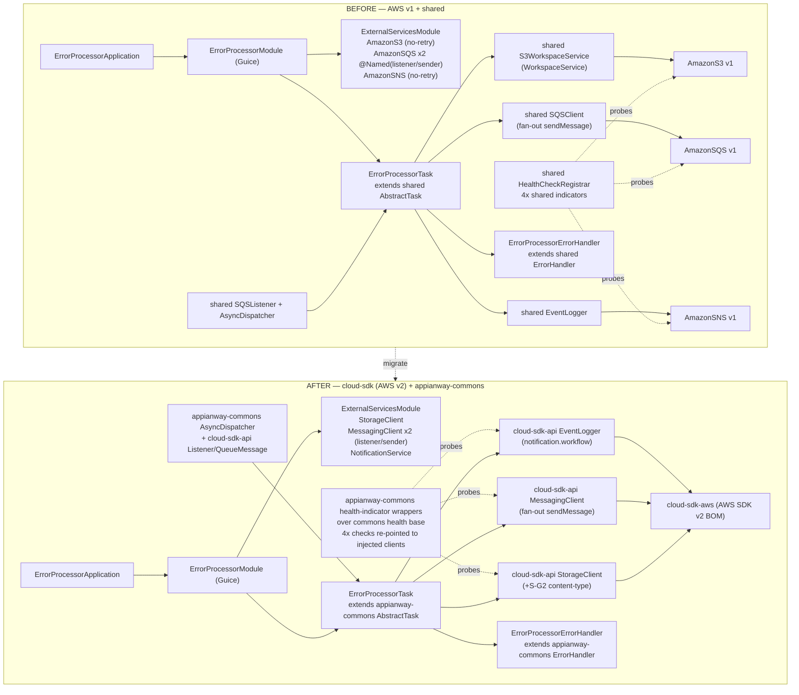
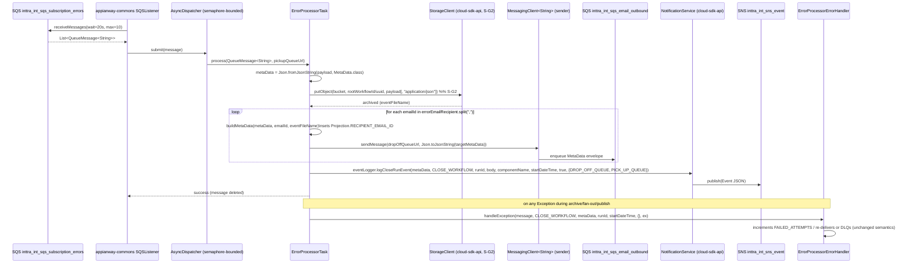
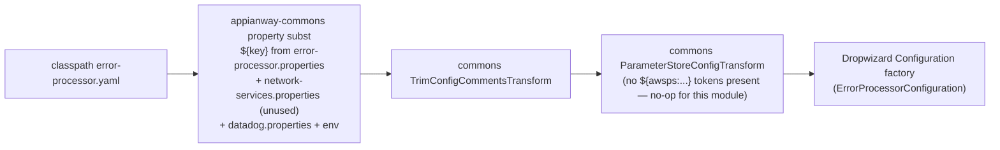

# `error-processor` — AWS SDK v2 (`cloud-sdk`) Upgrade Design

> Module: `error-processor` · Date: 2026-07-22 · Author: Claude (Sonnet 5)
> Program foundation (read first, do not duplicate): [`2026-07-22-appianway-awsupgrade-foundation-claude.md`](../../2026-07-22-appianway-awsupgrade-foundation-claude.md) — §2 `shared`→replacement mapping, §3 slim `appianway-commons`, §4 config/SSM model, §5/§5A cloud-sdk assumed gaps (S-G2, W-G9), §6 Maven template, §7 this section template, §8 rollout order.
> INT verification baseline: [`2026-07-22-appway-app-checkouts-run-config.md`](../../2026-07-22-appway-app-checkouts-run-config.md) §4.5 — error-processor boots clean on DW5/Jetty12/Java17 with all 4 ops health checks green.
> Supersedes/updates: [`2026-05-31-error-processor-aws2x-upgrade-DESIGN-claude.md`](2026-05-31-error-processor-aws2x-upgrade-DESIGN-claude.md) + companion PLAN (pre-DW5, targeted `1.0.26-SNAPSHOT`, referenced a `shared` DESIGN/PLAN pair that no longer exists as the retirement target). **Fixed context now:** DW5/Jetty12/Java17/Jackson 2.21.4 baseline is DONE (ION-16098, already in `develop`); this doc is **AWS v1→v2 + drop-`shared`-only**, target line **`1.0.27-SNAPSHOT`**.

---

## 1. Overview

**Purpose.** `error-processor` is the pipeline's **error fan-in / fan-out hub**. It consumes every failed-message `MetaData` envelope the platform produces (from `dispatcher`, `distributor`, `splitter`, `transformer`, …) off a single shared error queue, archives the original failure payload to S3, splits the configured recipient list, and re-emits one email-drop-off envelope per recipient — then closes the workflow with an SNS event. It has no REST surface and no SES/network-services dependency of its own; it is a pure SQS/S3/SNS worker.

**Current state (DW5 baseline, this branch).** Dropwizard 5.0.2 / Jetty 12.1.9 / Java 17 / Jackson 2.21.4 (ION-16098, done). AWS access is 100% **AWS Java SDK v1** (`AmazonS3`, `AmazonSQS` ×2 named bindings, `AmazonSNS`) wrapped by the appianway **`shared`** module (`mercury-shared`) — `S3WorkspaceService`/`WorkspaceService`, `SQSClient`/`SQSListenerClient`/`SQSListener`, `SNSClient`/`SNSEventPublisher`, `MetaData`/`Event`/`EventLogger`, `AsyncDispatcher`/`AbstractTask`, `ErrorHandler`, `HealthCheckRegistrar` + 4 `shared` health indicators. Verified booting clean against INT (§4.5 of the run-config doc): inbound SQS, outbound SQS, S3 read, SNS all green on `/admin/opsHealthcheck`.

**Target state.** `shared` retired. AWS v1 SDK types replaced by **`cloud-sdk-api`** interfaces (`StorageClient`, `MessagingClient<String>`, `NotificationService`) backed by **`cloud-sdk-aws`** (AWS SDK v2). The workflow/event model (`MetaData`, `Event`, `EventLogger`, `Annotations`) moves to `cloud-sdk-api` `notification.*`. The appianway-only concurrency/error-handling residue (`AsyncDispatcher`, `AbstractTask`, `ErrorHandler`, `RecoverableException`, health-indicator glue) moves to the new slim **`appianway-commons`** library (foundation §3). Config command moves to **`commons`**' `ConfigProcessingServerCommand` composed with the appianway property-substitution transform (foundation §4). Target coordinate line: **`1.0.27-SNAPSHOT`**.

**Headline change for this module.** (a) The archive-to-S3 write (`saveEventMetaData`) is a direct **S-G2** consumer — it currently writes the raw failure JSON via the metadata-less `String` `putObject` overload; cloud-sdk-api's additive S-G2 overload lets it optionally set `contentType=application/json` (behavior-preserving; bytes unchanged either way). (b) error-processor is one of the **heaviest W-G9 consumers in the program**: it both *deserializes* an incoming `MetaData` (built by an upstream producer), *constructs and re-serializes* N outbound `MetaData` envelopes (using `MetaData.Projection.RECIPIENT_EMAIL_ID` — a cross-service wire contract with email-sender), and *publishes* a `closeWorkflow` `Event` via `EventLogger.logCloseRunEvent(...)` carrying `Event.Token.DROP_OFF_QUEUE`/`PICK_UP_QUEUE`. Any wire-shape drift in cloud-sdk-api's `MetaData`/`Event` directly corrupts the email pipeline or the event-store archive — see §6.
- **No network-services, no SSM.** error-processor's yaml has no `networkServiceConfig` block (confirmed both by source inspection and by the INT boot evidence in the run-config doc §4.5 — no `AuthClient`/SSM call at startup). This module needs **zero** SSM/network-services migration work.

---

## 2. Current vs. target architecture



### 2.1 Class/type mapping (this module)

| # | `shared` (`com.inttra.mercury.shared.*`) — v1 | Replacement | Home | Notes |
|---|---|---|---|---|
| 1 | `config.BaseConfiguration` | module `ErrorProcessorConfiguration` extends commons/cloud-sdk-aware base config type | module + commons | `errorEmailRecipient`, `dropOffSQSConfig` stay module-owned fields |
| 2 | `config.SQSConfig` (pickup + drop-off) | cloud-sdk-aws `AwsMessagingClientConfig` (or equivalent SQS config POJO) | cloud-sdk-aws | 2 instances: pickup, drop-off |
| 3 | `workspace.WorkspaceService` / `S3WorkspaceService` | `cloud-sdk-api` `StorageClient` (+ S-G2 `putObject(bucket,key,byte[]/String,Map,contentType)`) | cloud-sdk-api/aws | `ErrorDetailsService.getContent`, `ErrorProcessorTask.saveEventMetaData` |
| 4 | `messaging.SQSClient` / `SQSListenerClient` | `cloud-sdk-api` `MessagingClient<String>` (2 bound instances: listener, sender) | cloud-sdk-api/aws | `AWSClientConfiguration.sqs_listener` / `sqs_sender` retry profiles map to per-client `MessagingClient` config |
| 5 | `event.SNSEventPublisher` / `EventPublisher` | `cloud-sdk-api` `notification.workflow.EventPublisher` / `NotificationService.publish` | cloud-sdk-api | `snsEventPublisher` Guice provider in `ErrorProcessorModule` |
| 6 | `task.MetaData` | `cloud-sdk-api` `notification.workflow.MetaData` (Builder, `Projection.RECIPIENT_EMAIL_ID`, `EXIT_STATUS_SUCCESS`) | cloud-sdk-api | **W-G9 relevant** — §6 |
| 7 | `event.Event`, `EventLogger`, `RandomGenerator` | `cloud-sdk-api` `notification.workflow.{Event,EventLogger}`; `RandomGenerator` → appianway-commons or cloud-sdk-api util | cloud-sdk-api (+ appianway-commons) | `Event.SubType.CLOSE_WORKFLOW`, `Event.Token.DROP_OFF_QUEUE`/`PICK_UP_QUEUE` — **W-G9 relevant** |
| 8 | `workspace.Annotations` | `cloud-sdk-api` `notification.annotation.Annotations` | cloud-sdk-api | used by `ErrorDetailsService` (currently unreferenced by `ErrorProcessorTask` itself — dead-code candidate, verify at migration time) |
| 9 | `externalwrapper.exception.RecoverableException` | appianway-commons `RecoverableException` | appianway-commons | thrown by `ErrorProcessorTask.process` signature |
| 10 | `task.AbstractTask`, `threaddispatcher.{AsyncDispatcher,Dispatcher}`, `task.TaskFactory` | appianway-commons (unchanged concurrency model) | appianway-commons | `ErrorProcessorModule` binds `Dispatcher` → `AsyncDispatcher` |
| 11 | `task.ErrorHandler`, `task.errorhandler.ErrorHelper` | appianway-commons `ErrorHandler`/`ErrorHelper` | appianway-commons | `ErrorProcessorErrorHandler extends ErrorHandler` unchanged shape |
| 12 | `listener.SQSListener`, `listener.support.ListenerManager` | appianway-commons `SQSListener`/`ListenerManager` over `cloud-sdk-api` `MessagingClient`/`Listener` | appianway-commons + cloud-sdk-api | `ErrorProcessorModule.getSQSListener`/`listenerManager` providers |
| 13 | `healthcheck.HealthCheckRegistrar`, `healthcheck.indicator.{InboundSqsHealthCheck,OutboundSqsHealthCheck,S3ReadHealthCheck,SnsPublishHealthCheck}` | commons health base + appianway-commons indicator wrappers re-pointed to `StorageClient`/`MessagingClient`/`NotificationService` | commons + appianway-commons | 4 checks, §3 |
| 14 | `config.S3ConfigurationProvider` | appianway-commons (kept, conditional on `CONFIG_LOCATION=s3`) | appianway-commons | unchanged behavior; not exercised in local/INT runs |
| 15 | `command.ConfigProcessingServerCommand` | commons `ConfigProcessingServerCommand` + composed appianway property-substitution transform | commons + appianway-commons | foundation §4 |
| 16 | `com.amazonaws.services.sqs.model.Message` | `cloud-sdk-api` `messaging.QueueMessage<String>` | cloud-sdk-api | `ErrorProcessorTask.process(Message,...)` → `process(QueueMessage<String>,...)`; `getBody()`→`getPayload()` |
| 17 | `com.amazonaws.ClientConfiguration` (`withMaxErrorRetry(0)`) | cloud-sdk-aws `ClientOverrideConfiguration`/retry-policy equivalent (zero-retry) | cloud-sdk-aws | **preserve** the deliberate no-retry S3/SNS behavior — §6 |
| 18 | `org.zapodot.hystrix.bundle.HystrixBundle` (already commented out in `ErrorProcessorApplication.initialize`) | none — dead code, drop the import/dependency | — | Hystrix is dead everywhere per foundation §6 |

---

## 3. AWS touchpoints

| Direction | Resource | INT value | cloud-sdk client | Notes |
|---|---|---|---|---|
| SQS — inbound (pickup / fan-in) | `inttra_int_sqs_subscription_errors` | `https://sqs.us-east-1.amazonaws.com/081020446316/inttra_int_sqs_subscription_errors` | `MessagingClient<String>` (`@Named` listener instance) | Long-poll, `waitTimeSeconds`, `maxNumberOfMessages`; this is the **shared platform-wide error queue** — every module's failures land here |
| SQS — outbound (drop-off / fan-out) | `inttra_int_sqs_email_outbound` | `https://sqs.us-east-1.amazonaws.com/081020446316/inttra_int_sqs_email_outbound` | `MessagingClient<String>` (`@Named` sender instance) | One `sendMessage` per recipient email (N messages per 1 inbound failure) |
| S3 — write (archive) | `inttra-int-workspace` | bucket `inttra-int-workspace`, key `{rootWorkflowId}/{uuid}` | `StorageClient.putObject` (**S-G2** site — optional `contentType`/metadata) | Archives the raw failure-message body verbatim before fan-out |
| S3 — read | `inttra-int-workspace` | same bucket | `StorageClient.getContent` | Used by `ErrorDetailsService.getErrorDetails` (`Annotations` lookup) — verify still called; health-checked as S3-read in §4.5 |
| SNS — publish | `inttra_int_sns_event` | `arn:aws:sns:us-east-1:081020446316:inttra_int_sns_event` | `NotificationService.publish` (via `EventLogger`/`EventPublisher`) | `closeWorkflow` `Event`, `SubType.CLOSE_WORKFLOW`, `isSuccess=true/false` |
| DynamoDB | — | none | — | not used by this module |
| SES | — | none | — | no direct email send here — email is *requested* via the SQS drop-off queue; email-sender does the actual SES send |
| Param Store (SSM) | — | **none** | — | no `networkServiceConfig` in yaml; confirmed by INT boot evidence (§4.5 of run-config doc) — no `AuthClient`/SSM call at startup |
| gRPC | — | none | — | not applicable to this module |

---

## 4. Sequence diagram — consume → archive → fan-out → close



**Preserved failure semantics (do not change):** if the archive `putObject` throws, `ErrorProcessorTask.process` catches the exception, calls `errorHandler.handleException(...)`, and the message is **not** deleted from `subscription_errors` — it is redelivered per the appianway-commons `ErrorHandler`/`FAILED_ATTEMPTS` model. Since error-processor is itself the error sink, a persistent archive-write failure must not silently swallow messages; this loop-avoidance behavior is unchanged by the AWS-v2 migration and must be covered by an explicit test (§8).

---

## 5. Configuration changes

### 5.1 Property-key table (exact INT values, `conf/int/error-processor.properties`)

| Property key | INT value | Consumed by (yaml path) | Notes |
|---|---|---|---|
| `error-processor.pickupSQSConfig.queueUrl` | `https://sqs.us-east-1.amazonaws.com/081020446316/inttra_int_sqs_subscription_errors` | `sqsPickupConfig.queueUrl`, `sqsErrorConfig.queueUrl` | inbound fan-in queue; also referenced twice in the yaml (`sqsPickupConfig` and legacy `sqsErrorConfig` block — both resolve to the same URL, `sqsErrorConfig` appears to be a vestigial/duplicate block, verify at migration time whether still bound anywhere) |
| `error-processor.dropOffSQSConfig.queueUrl` | `https://sqs.us-east-1.amazonaws.com/081020446316/inttra_int_sqs_email_outbound` | `dropOffSQSConfig.queueUrl` | outbound fan-out queue → feeds email-sender |
| `error-processor.snsEventConfig.topicArn` | `arn:aws:sns:us-east-1:081020446316:inttra_int_sns_event` | `snsEventConfig.topicArn` | closeWorkflow event topic |
| `error-processor.s3WorkspaceConfig.bucket` | `inttra-int-workspace` | `s3WorkspaceConfig.bucket` | archive + `ErrorDetailsService` read bucket |
| `error-processor.errorEmailRecipient` | `appianway@inttra.com` | `errorEmailRecipient` (top-level) | **CSV list** — split on `,` in `ErrorProcessorTask.process`; one outbound envelope per address |
| `componentName` | `error-processor` (optional, defaults `error-processor`) | `componentName` | used as `MetaData.Builder` componentName + `EventLogger` componentName |
| *(not set in properties file — yaml defaults apply)* `server.connector.port` | defaults to **`8081`** (`${server.connector.port:-8081}`) | `server.connector.port` | single `simple` server; `/application` + `/admin` share the port |
| *(not set)* `error-processor.pickupSQSConfig.waitTimeSeconds` | defaults `20` | `sqsPickupConfig.waitTimeSeconds` | long-poll |
| *(not set)* `error-processor.pickupSQSConfig.maxNumberOfMessages` | defaults `10` | `sqsPickupConfig.maxNumberOfMessages` | also sizes the `AsyncDispatcher` semaphore bound |
| *(not set)* `error-processor.logging.level` | defaults `INFO` | `logging.level` | |
| `metrics.frequency` | required, from `configuration/int/datadog.properties` | `metrics.frequency` | unchanged, not module-specific |

**Do not rename** `inttra_int_sqs_subscription_errors`, `inttra_int_sqs_email_outbound`, `inttra_int_sns_event`, `inttra-int-workspace`, or any of the property keys above — they are environment contracts shared with dispatcher/distributor/splitter/transformer (all fan into `subscription_errors`) and email-sender (which consumes `email_outbound`).

### 5.2 SSM parameters

**None.** error-processor's yaml has **no `networkServiceConfig` block** — confirmed both by source (`ErrorProcessorConfiguration`/`error-processor.yaml` have no networkservices fields) and by the INT run-config doc §4.5 boot evidence (no `AuthClient`/SSM call logged at startup, matching the email-sender/event-writer pattern, not the dispatcher/splitter/transformer pattern). `configuration/int/network-services.properties` is still passed on the CLI (to match the uniform run-script/launch-config shape across all 14 modules) but **nothing in error-processor's yaml references its keys**. No `${awsps:/path}` boot-time SSM resolution is needed for this module either — there is simply no secret to resolve.

### 5.3 Config-command composition

Per foundation §4.2: commons `ConfigProcessingServerCommand` runs `TrimConfigCommentsTransform.andThen(ParameterStoreConfigTransform)`; since this module resolves no `${awsps:...}` tokens, `ParameterStoreConfigTransform` is a no-op pass-through for error-processor specifically (harmless — kept for template consistency across all 14 apps). The **required** composition point is still the appianway property-substitution transform (from appianway-commons) prepended in front, so that `${error-processor.pickupSQSConfig.queueUrl}` etc. resolve from `conf/int/error-processor.properties` + env before the commons transforms run:



`ErrorProcessorApplication.initialize(bootstrap)` registers this composed command in place of `shared`'s `ConfigProcessingServerCommand`, keeping the conditional `S3ConfigurationProvider` install (`CONFIG_LOCATION=s3`) unchanged (moves to appianway-commons per §2.1 row 14).

### 5.4 What is unchanged

- **CLI arg shape:** `run error-processor.yaml conf/int/error-processor.properties ../configuration/int/network-services.properties ../configuration/int/datadog.properties` — identical, all 4 args still passed even though 2 of them (network-services) are unreferenced by this module's yaml.
- **`CONFIG_REGION=US_EAST_1`** system property — unchanged.
- **Port 8081**, single `simple` Dropwizard server, `/application` + `/admin` sharing the connector — unchanged.
- **No run profiles / variants** for this module (unlike ingestor's ce-/splitter's ce-/transformer's ce-/os-) — error-processor has exactly one deployment shape.
- **`datadog.properties`** → `metrics.frequency` — unchanged, not migration-relevant.

---

## 6. cloud-sdk / commons dependencies & assumed gaps

| Gap ID | Relevant to error-processor? | Detail |
|---|---|---|
| **S-G2** | **Yes — direct consumer.** | `ErrorProcessorTask.saveEventMetaData` archives `message.getBody()` (raw failure JSON) via the metadata-less `String putObject` overload today. Migrating to cloud-sdk-api's additive `StorageClient.putObject(bucket,key,byte[]/String,Map metadata,String contentType)` lets the archive object carry `contentType=application/json` (optional — behavior-preserving either way; the archived bytes are identical). No cloud-sdk change is module-specific; error-processor simply exercises the same S-G2 overload as event-writer/dispatcher/distributor. |
| **W-G9** | **Yes — primary/heaviest consumer in the program alongside event-writer.** | error-processor sits at the center of the workflow-model wire contract: (1) it **deserializes** `MetaData` produced by every upstream module (dispatcher, distributor, splitter, transformer, …) off `subscription_errors`; (2) it **constructs N new `MetaData` envelopes** via `MetaData.Builder`, setting `Projection.RECIPIENT_EMAIL_ID` — this is the exact cross-service contract email-sender depends on to know who to mail; (3) it **publishes a `closeWorkflow` `Event`** via `EventLogger.logCloseRunEvent(metaData, Event.SubType.CLOSE_WORKFLOW, runId, body, componentName, startDateTime, isSuccess, {Event.Token.DROP_OFF_QUEUE, Event.Token.PICK_UP_QUEUE})` — feeding event-writer's S3 event-store archive via SNS. Per foundation §5A: the wire *data* is compatible (identical `MetaData` fields/date-pattern/`@JsonInclude`, identical `Event` fields), but the confirmed **W-G9.1 defect** (`Event.Builder` drops `annotations` on `parseJson`) and **W-G9.2 constant-set lag** (`MetaData.Projection` missing 6 keys incl. none used directly by this module today, `Event.Token` missing 8 keys) must land in cloud-sdk-api before/alongside this migration — error-processor uses `Event.Token.DROP_OFF_QUEUE`/`PICK_UP_QUEUE` and `MetaData.Projection.RECIPIENT_EMAIL_ID`, all of which **are** present in the current 26/9-key cloud-sdk-api sets, so this module compiles today against the gap — but any annotation-carrying `Event` that transits through error-processor's `logCloseRunEvent` call (if `Annotations` are ever attached upstream) is subject to the W-G9.1 round-trip defect downstream at event-writer. **Recommendation: land W-G9 before or in lockstep with this module**, and run the foundation §5A JSON round-trip corpus test using production `subscription_errors` payloads (which are the richest `MetaData`/`Event` samples in the platform — they are literally *other modules'* failure envelopes) as part of this module's own test gate (§8). |
| **X-G7** | No. | No email send (SES) in this module — email is requested via SQS, not sent directly. |
| **X-G8** | No. | No OpenSearch/Jest in this module. |
| **C-G6** | Optional, not required. | The appianway property-substitution transform composes in front of commons' `TrimConfigCommentsTransform`/`ParameterStoreConfigTransform` without needing `getConfigTransformer` widened (foundation §4.2). |

**What error-processor consumes from `commons`:** `ConfigProcessingServerCommand` (composed, §5.3), health base (`com.inttra.mercury.health.*`), `InttraServer` DW5 base if adopted at the bootstrap level.

**What moves to `appianway-commons`:** `AsyncDispatcher`/`AbstractTask`/`TaskFactory`/`Dispatcher` (concurrency, unchanged model), `ErrorHandler`/`ErrorHelper`/`RecoverableException` (error taxonomy, unchanged semantics), the 4 health-indicator wrappers (`InboundSqsHealthCheck`, `OutboundSqsHealthCheck`, `S3ReadHealthCheck`, `SnsPublishHealthCheck`) re-pointed to injected `MessagingClient`/`StorageClient`/`NotificationService`, `SQSListener`/`ListenerManager` (appianway concurrency wrapper over `cloud-sdk-api` `Listener`/`QueueMessage`), and the conditional `S3ConfigurationProvider`.

---

## 7. Maven dependency changes

**Remove** (from `error-processor/pom.xml`):
```xml
<!-- shared -->
<dependency>
    <groupId>com.inttra.mercury.shared</groupId>
    <artifactId>mercury-shared</artifactId>
    <type>jar</type>
    <version>${mercury.shared.version}</version>
</dependency>
<!-- v1 SDK -->
<dependency>
    <groupId>com.amazonaws</groupId>
    <artifactId>aws-java-sdk-sqs</artifactId>
    <version>${aws-java-sdk.version}</version>
</dependency>
```
- Also drop the now-orphaned `org.zapodot.hystrix.bundle.HystrixBundle` import in `ErrorProcessorApplication` (already commented out at the call site — dead code, remove the import/dependency entirely per foundation §6 Hystrix-is-dead directive).
- Any transitive v1 S3/SNS pulled in via `mercury-shared` disappears once `shared` is removed — no direct `aws-java-sdk-s3`/`aws-java-sdk-sns` was ever declared in this pom, so nothing else to strip explicitly (verify with `mvn dependency:tree` post-change that no v1 artifact remains).

**Add:**
```xml
<dependency>
    <groupId>com.inttra.mercury</groupId>
    <artifactId>cloud-sdk-api</artifactId>
    <version>1.0.27-SNAPSHOT</version>
</dependency>
<dependency>
    <groupId>com.inttra.mercury</groupId>
    <artifactId>cloud-sdk-aws</artifactId>
    <version>1.0.27-SNAPSHOT</version>
</dependency>
<dependency>
    <groupId>com.inttra.mercury</groupId>
    <artifactId>commons</artifactId>
    <version>1.0.27-SNAPSHOT</version>
</dependency>
<dependency>
    <groupId>com.inttra.mercury</groupId>
    <artifactId>appianway-commons</artifactId>
    <version>1.0-SNAPSHOT</version>
</dependency>
```
AWS SDK v2 arrives transitively via `cloud-sdk-aws`'s managed BOM — **do not** declare any `software.amazon.awssdk:*` artifact directly in this pom.

**Align (already true from ION-16098, keep as-is):** `dropwizard-core`/`dropwizard-metrics:metrics-annotation` versions, Java 17 `source`/`target` in `maven-compiler-plugin`, `maven-shade-plugin` `ManifestResourceTransformer` mainClass (`com.inttra.mercury.error.processor.ErrorProcessorApplication`, unchanged), `ServicesResourceTransformer`. No module-specific version deltas beyond the parent's existing DW5/Jetty12/Jackson pins — inherit from the `appian-way` parent pom / mercury-services-commons dependency management wherever the parent centralizes them.

**No other module-specific artifacts** (no schema-beans/gen2-parser/protobuf/Contivo/Jest — error-processor is a plain JSON-`MetaData` consumer).

**Verify:** `mvn -pl error-processor -am clean verify` (note: `-am` will build `cloud-sdk-api`/`cloud-sdk-aws`/`commons`/`appianway-commons` too since they're new reactor modules — confirm the root `pom.xml` `<modules>` includes `appianway-commons`). Fat-jar boot + `/admin/opsHealthcheck` green against INT reusing the §4.5 procedure in the run-config doc — `clean` is required before verify because of the shade plugin (stale fat jars otherwise, per foundation §6).

---

## 8. Tests

- **JUnit 5** direction (existing tests are JUnit 4 — migrate or bridge via `junit-vintage-engine` during transition, per foundation/program convention).
- **Re-point mocks:** `AmazonSQS`/`AmazonS3`/`AmazonSNS` → `MessagingClient<String>` (2 instances)/`StorageClient`/`NotificationService`; `com.amazonaws.services.sqs.model.Message` → `cloud-sdk-api` `QueueMessage<String>` (`getBody()`→`getPayload()`).
- **`ErrorProcessorTask` unit tests must assert:**
  1. `saveEventMetaData` calls `StorageClient.putObject` with key **exactly** `{rootWorkflowId}/{uuid}` and (post S-G2 adoption) `contentType=application/json` if that overload is used — bucket = `s3WorkspaceConfig.bucket`.
  2. **Fan-out count** — one `MessagingClient.sendMessage(dropOffQueueUrl, json)` call **per** entry in `errorEmailRecipient.split(",")`, each with a **distinct** `workflowId` (via `randomGenerator.randomUUID()`) but the **same** `rootWorkflowId`/`eventFileName`.
  3. **`Projection.RECIPIENT_EMAIL_ID`** is set on every outbound `MetaData` to the corresponding split email address — this is the wire contract email-sender reads; a round-trip test (build → `Json.toJsonString` → `Json.fromJsonString` on the cloud-sdk-api `MetaData`) must show the projection key survives.
  4. **`closeWorkflow` Event** publish: `Event.SubType.CLOSE_WORKFLOW`, `isSuccess=true` on the happy path, tokens map contains exactly `Event.Token.DROP_OFF_QUEUE`→dropOffQueueUrl and `Event.Token.PICK_UP_QUEUE`→pickupQueueUrl.
  5. **Failure-path / loop-avoidance test (critical — this module is the error sink):** force `StorageClient.putObject` (or the fan-out `sendMessage`) to throw; assert `ErrorProcessorErrorHandler.handleException(...)` is invoked with `Event.SubType.CLOSE_WORKFLOW`, and that the inbound message is **not** deleted (i.e. `FAILED_ATTEMPTS` semantics / redelivery are preserved, not a silent drop). No new infinite-loop risk introduced by the client swap.
- **W-G9 verification gate (foundation §5A):** include this module's own `subscription_errors` sample payloads (real upstream failure `MetaData`/`Event` JSON, which by definition already exercise many producers' shapes) in the shared JSON round-trip corpus test — assert `parseJson → toJsonString` byte-stability, **including at least one sample that carries `Annotations`**, to guard the W-G9.1 builder defect from this module's consume-side.
- **`functional-testing` fakes** re-pointed to `cloud-sdk-api` (lockstep with the `appianway-commons`/functional-testing migration order in foundation §8) — no behavior change expected, just fake-implementation retargeting.
- Preserve **zero-retry** S3/SNS client behavior in test assertions (config mapping to cloud-sdk-aws `ClientOverrideConfiguration` retry policy) so `ErrorProcessorErrorHandler`'s fail-fast/redeliver expectations aren't silently changed by a default-retry AWS v2 client.

---

## 9. Rollout & verification

Per foundation §8 order: `appianway-commons` → functional-testing fakes → event-writer (S-G2 pilot) → distributor-rest/structuralvalidator → splitter/ingestor → **dispatcher, distributor, error-processor** (this module — S-G2 write/copy consumers wave) → email-sender/transformer → watermill.

1. Confirm `appianway-commons` and the migrated `functional-testing` are available in the reactor.
2. Confirm **event-writer** has landed first (primary S-G2 pilot) and cloud-sdk CI + a full mercury-services build are green (proof of zero blast-radius from S-G2/W-G9).
3. Migrate `ExternalServicesModule` (rebind 4 clients), re-type `ErrorProcessorTask`/`ErrorDetailsService`/`ErrorProcessorErrorHandler`, adopt `cloud-sdk-api` `MetaData`/`Event`/`EventLogger`, compose the config command (§5.3).
4. `mvn -pl error-processor -am clean verify` green.
5. Boot the fat jar against INT exactly as in the run-config doc §4.5: `java -DCONFIG_REGION=US_EAST_1 -jar target/error-processor-1.0.jar run error-processor.yaml conf/int/error-processor.properties ../configuration/int/network-services.properties ../configuration/int/datadog.properties`.
6. Confirm all **4** `/admin/opsHealthcheck` checks green (inbound SQS `subscription_errors`, outbound SQS `email_outbound`, S3 read `inttra-int-workspace`, SNS publish `inttra_int_sns_event`) — matching the pre-migration baseline in §4.5 exactly, same targets, same count.
7. If feasible, drive one real message through `subscription_errors` in INT (or a scratch queue) and confirm: the archive object lands at `{rootWorkflowId}/{uuid}` in `inttra-int-workspace`, N messages land in `email_outbound` (N = recipient count, currently 1 — `appianway@inttra.com`), and a `closeWorkflow` event is observable on `inttra_int_sns_event`.

---

## 10. Risks & mitigations

| Risk | Mitigation |
|---|---|
| Archive-write failure creates a silent-drop or infinite-redelivery loop (error-processor is itself the error sink) | Explicit failure-path test (§8.5); preserve `RecoverableException`/no-delete semantics unchanged from `shared` |
| W-G9 `Event.Builder` annotations round-trip defect (foundation §5A) affects a `closeWorkflow` event carrying annotations published from here | Land W-G9 in cloud-sdk-api before/alongside this migration; run the JSON round-trip corpus test with this module's own sample payloads (§8) |
| Losing the deliberate **zero-retry** S3/SNS client config (`withMaxErrorRetry(0)`) during the v1→v2 client rebind, silently changing fail-fast/redeliver timing | Map explicitly to a zero-retry `ClientOverrideConfiguration`/retry policy in `ExternalServicesModule`; assert in tests |
| `Message`→`QueueMessage<String>` misses a call site (`getBody()`, attribute reads in `ErrorHelper`) | Compiler-driven type change; `FAILED_ATTEMPTS` confirmed to round-trip as a `String` attribute (foundation §2/§3 precedent) |
| Two named `MessagingClient<String>` bindings (listener vs. sender) accidentally collapsed into one, changing retry/timeout profile per direction | Keep the two `@Named` bindings distinct in the migrated `ExternalServicesModule`, mirroring `AWSClientConfiguration.sqs_listener`/`sqs_sender` today |
| Vestigial `sqsErrorConfig` yaml block (duplicate of `sqsPickupConfig.queueUrl`) causes confusion or an unused binding during rebind | Verify at migration time whether `sqsErrorConfig` is bound anywhere in code; if truly dead, remove the yaml block (call out explicitly, do not silently drop if it turns out to be referenced) |
| `ErrorDetailsService`/`Annotations` path looks unreferenced by `ErrorProcessorTask` today — risk of migrating dead code or, conversely, missing a live caller | Grep for `ErrorDetailsService` usage across the module before finalizing the class-mapping; migrate faithfully either way (keep if referenced, drop cleanly if confirmed dead) |
| Cloud-sdk-api/`commons` change breaking mercury-services production consumers | S-G2 and W-G9 are strictly additive (foundation §5/§5A); cloud-sdk CI + full mercury-services build green before/after, per foundation §1 non-negotiable contract |
