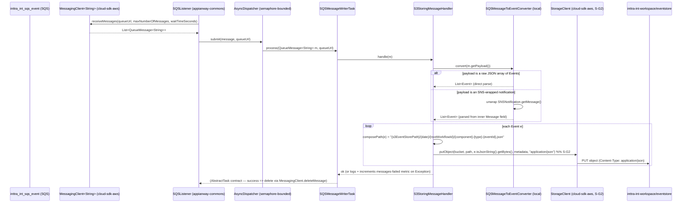
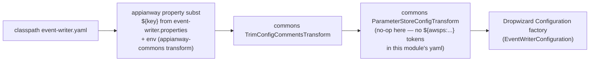

# `event-writer` — AWS SDK v2 (cloud-sdk) Upgrade Design (claude)

> Module: `event-writer` · Date: 2026-07-22 · Author: Claude (Opus 4.8)
> **Program foundation (do not duplicate):** [`2026-07-22-appianway-awsupgrade-foundation-claude.md`](../../2026-07-22-appianway-awsupgrade-foundation-claude.md) — shared→commons/cloud-sdk mapping (§2), slim `appianway-commons` (§3), config/SSM model (§4), assumed cloud-sdk gaps S-G2/W-G9/X-G7/X-G8/C-G6 (§5, §5A), Maven template (§6), rollout order (§8).
> **INT run/health evidence:** [`2026-07-22-appway-app-checkouts-run-config.md`](../../2026-07-22-appway-app-checkouts-run-config.md) §4.6 (verified 2026-07-22 on the DW5/Jetty12 baseline — reused verbatim here for resource names).
> **Supersedes / updates:** [`2026-05-31-event-writer-aws2x-upgrade-DESIGN-claude.md`](2026-05-31-event-writer-aws2x-upgrade-DESIGN-claude.md) and [`...-plan-claude.md`](2026-05-31-event-writer-aws2x-upgrade-plan-claude.md) (pre-`shared`-retirement drafts, cloud-sdk `1.0.26-SNAPSHOT`, referenced a since-superseded "master shared DESIGN"). This doc re-bases those onto the locked 2026-07-22 decisions: `shared` is **retired** (not migrated in place), the replacement is `commons` + `cloud-sdk-api` + `cloud-sdk-aws` + slim `appianway-commons`, target `mercury-services-commons 1.0.27-SNAPSHOT`, and `Event`/`MetaData`/`Annotations` come from cloud-sdk-api subject to the **W-G9** workflow-model-parity fix.
> **Baseline (unaffected by this doc):** Dropwizard 5.0.2 / Jetty 12.1.9 / Java 17 / Jackson 2.21.4 — DONE in `develop` (ION-16098). event-writer boots clean on that stack today (still on AWS v1 + `shared`) — see run-config §4.6.

---

## 1. Overview

**Purpose.** `event-writer` is the platform's audit sink: it is the **sole subscriber** of the platform SNS event topic (via its own SQS pickup queue), and persists every workflow `Event` it receives as a JSON object in the shared workspace S3 bucket, at `{s3EventStorePath}/{date}/{rootWorkflowId}/{component}-{type}-{eventId}.json`. It is a strict one-way sink: consume → parse → write. No SNS publish, no SQS fan-out, no email, no DynamoDB, no network-services/SSM auth call (confirmed at INT: no `networkServiceConfig` block, no `AuthClient` call on boot — run-config §4.6).

**Current state.** AWS Java SDK v1 (`AmazonSQS`, `AmazonS3`) constructed directly in `ExternalServicesModule`; the task chain (`SQSMessageWriterTask` → `SQSMessageHandler` → `S3StoringMessageHandler` → `SQSMessageToEventConverter`) is typed on v1 `com.amazonaws.services.sqs.model.Message`; the workflow model is `shared`'s `event.Event` + `event.SNSNotification`; S3 writes go through `shared` `WorkspaceService.putObject(bucket, key, String)`, which **hardcodes `text/plain`** even though every object written is `.json`.

**Target.** `commons` + `cloud-sdk-api` + `cloud-sdk-aws` (`1.0.27-SNAPSHOT`) + slim `appianway-commons`. The task chain re-types to `QueueMessage<String>`; the workflow model becomes cloud-sdk-api's `notification.workflow.Event` (+ `notification.annotation.Annotations`); S3 writes move to `StorageClient` using the **S-G2** content-type overload to stamp `Content-Type: application/json`; the appianway `SQSListener`/`AsyncDispatcher` concurrency model is retained via `appianway-commons`.

**Headline change.** event-writer is the **program's rollout pilot** (§8 of the foundation brief) and the **primary S-G2 consumer** — it is the module that most wants `StorageClient.putObject(bucket,key,bytes,metadata,contentType)` because every object it writes is JSON and today gets `text/plain`. It is also the module where **W-G9 matters most**: it is the only module that **archives raw `Event` JSON verbatim** to durable storage, so if cloud-sdk-api's `Event` deserializes annotations differently from `shared`'s (it currently does — see §6), the archive silently loses data. The round-trip corpus test (foundation §5A) **gates this module's rollout**.

---

## 2. Current vs Target architecture

```mermaid
flowchart TB
    subgraph before["BEFORE — AWS v1 + shared"]
        direction TB
        B_SQS[("inttra_int_sqs_event\n(SQS pickup)")] --> B_LIS["shared SQSListener\n+ AsyncDispatcher"]
        B_LIS --> B_TASK["SQSMessageWriterTask\nextends shared AbstractTask\nprocess(v1 Message, queueUrl)"]
        B_TASK --> B_HAND["S3StoringMessageHandler\nimplements SQSMessageHandler\nhandle(v1 Message)"]
        B_HAND --> B_CONV["SQSMessageToEventConverter\nconvert(v1 Message) -> List&lt;shared Event&gt;"]
        B_HAND --> B_WS["shared S3WorkspaceService\nimplements WorkspaceService\nputObject(bucket,key,String) -- text/plain hardcoded"]
        B_LIS --> B_V1SQS["v1 AmazonSQS\n(2 clients: listener + sender)"]
        B_WS --> B_V1S3["v1 AmazonS3"]
        B_V1SQS --> B_SQS
        B_WS --> B_BKT[("inttra-int-workspace/eventstore")]
    end
    subgraph after["AFTER — commons + cloud-sdk (AWS v2)"]
        direction TB
        A_SQS[("inttra_int_sqs_event\n(SQS pickup, unchanged)")] --> A_LIS["appianway-commons SQSListener\n+ AsyncDispatcher (retained)"]
        A_LIS --> A_TASK["SQSMessageWriterTask\nextends appianway-commons AbstractTask\nprocess(QueueMessage&lt;String&gt;, queueUrl)"]
        A_TASK --> A_HAND["S3StoringMessageHandler\nhandle(QueueMessage&lt;String&gt;)"]
        A_HAND --> A_CONV["SQSMessageToEventConverter\nconvert(QueueMessage&lt;String&gt;) -> List&lt;cloud-sdk-api Event&gt;\n(kept local: raw-array + SNS-envelope parsing)"]
        A_HAND --> A_SC["cloud-sdk-api StorageClient\nputObject(bucket,key,bytes,metadata,\"application/json\")  -- S-G2"]
        A_LIS --> A_MC["cloud-sdk-api MessagingClient&lt;String&gt;\n(cloud-sdk-aws SQS impl)"]
        A_SC --> A_S3IMPL["cloud-sdk-aws S3StorageClient (AWS v2)"]
        A_MC --> A_SQS
        A_SC --> A_BKT[("inttra-int-workspace/eventstore")]
    end
    before -.migrate.-> after
```

### 2.1 Class-level mapping

| `shared` (v1) type | Replacement | Home | Notes |
|---|---|---|---|
| `com.amazonaws.services.sqs.model.Message` | `com.inttra.mercury.cloudsdk.messaging.api.QueueMessage<String>` | cloud-sdk-api | `getBody()`→`getPayload()`; `getMessageId()`/`getReceiptHandle()` unchanged (interface has both). Mechanical, compiler-driven across the 4 chain classes. |
| `shared.listener.SQSListener`, `listener.support.ListenerManager`, `messaging.SQSListenerClient`, `threaddispatcher.{AsyncDispatcher,Dispatcher}`, `task.{AbstractTask,TaskFactory}` | same appianway concurrency model, **retained** | `appianway-commons` | No commons/cloud-sdk equivalent; appianway's semaphore-bounded worker-pool. Re-pointed onto `MessagingClient<String>` instead of v1 `AmazonSQS`. |
| `shared.externalwrapper.exception.RecoverableException` | `RecoverableException` (same semantics) | `appianway-commons` | Thrown from `AbstractTask.process(...)`; unchanged signature. |
| `shared.event.Event` | `com.inttra.mercury.cloudsdk.notification.workflow.Event` | cloud-sdk-api | Field-identical **except** `Builder` currently has no `annotations`/`setAnnotations()` — **W-G9.1** (§6). |
| `shared.event.SNSNotification` | kept **local** to `SQSMessageToEventConverter` (no cloud-sdk equivalent needed — it's the raw AWS SNS delivery envelope, not a workflow type) | module | See §4 — the converter still needs to unwrap an SNS-delivered notification body. |
| `shared.workspace.WorkspaceService` / `S3WorkspaceService` | `com.inttra.mercury.cloudsdk.storage.api.StorageClient` | cloud-sdk-api (+ cloud-sdk-aws `S3StorageClient` impl) | Today's `putObject(bucket,key,String)` maps to `StorageClient.putObject(String bucket, String key, String content)` (also `text/plain`-only — see §6). Target uses the **S-G2** `putObject(bucket,key,byte[],Map<String,String> metadata,String contentType)` overload. |
| `shared.command.ConfigProcessingServerCommand` | `com.inttra.mercury.config.ConfigProcessingServerCommand` + composed appianway transform | commons + appianway-commons | §5. |
| `shared.config.S3ConfigurationProvider` | kept appianway-local (only used if `CONFIG_LOCATION=s3`) | appianway-commons or module | Not exercised at INT today (filesystem config). |
| `shared.healthcheck.HealthCheckRegistrar` + `indicator.{InboundSqsHealthCheck, ErrorThresholdHealthCheck, S3WriteHealthCheck}` | commons `health.*` base + appianway-commons indicator wrappers re-pointed to `MessagingClient`/`StorageClient` | commons + appianway-commons | 3 checks unchanged in shape (§4). |
| `shared.config.{SQSConfig,S3Config}`, `shared.config.AWSClientConfiguration.{sqs_listener,sqs_sender,s3_read_put_copy}` | cloud-sdk config types (`AwsMessagingClientConfig`, `CloudStorageConfig`) bound in `ExternalServicesModule`; `EventWriterConfiguration` POJO fields (`pickupSqsConfig`, `s3Config`, `s3EventStorePath`, `errorRateThreshold`) **unchanged** | cloud-sdk-aws / module | No YAML field renames. |
| `shared.support.Json` | cloud-sdk-api's own `Event.parseJson(String)` / `Event#toJsonString()` (or `notification.util.JsonSupport`) for the workflow type; plain Jackson `ObjectMapper`/`TypeReference` retained locally for the raw-array/SNS-envelope shapes | cloud-sdk-api + module | Converter no longer needs `shared`'s `Json` helper for `Event`, still needs a `TypeReference<List<Event>>` for the array-of-events envelope. |

---

## 3. AWS touchpoints

| Touchpoint | Direction | INT resource name | cloud-sdk client | Notes |
|---|---|---|---|---|
| SQS | inbound (consume) | `inttra_int_sqs_event` (queue URL: `https://sqs.us-east-1.amazonaws.com/081020446316/inttra_int_sqs_event`, from `event-writer.pickupSqsConfig.queueUrl`) | `MessagingClient<String>` (listener instance) | Sole inbound path. Long-poll via `receiveMessages(ReceiveMessageOptions{waitTimeSeconds, maxNumberOfMessages})`; delete-on-success via `deleteMessage(queueUrl, receiptHandle)`. |
| SNS | — | none (event-writer does **not** publish; it is the **terminal subscriber** of the platform's `inttra_int_sns_event` topic — the SNS→SQS subscription lives on `inttra_int_sqs_event`, outside this module) | n/a | No `NotificationService` binding needed. |
| S3 | write only | `inttra-int-workspace`, prefix `eventstore` (`event-writer.s3Config.bucket` + `event-writer.s3EventStorePath`) | `StorageClient` (S-G2 `putObject` overload) | Every event → one JSON object at `eventstore/{yyyy-MM-dd}/{rootWorkflowId}/{component}-{type}-{eventId}.json`. No S3 read, no copy. |
| DynamoDB | — | n/a | n/a | Not used. |
| SES | — | n/a | n/a | Not used. |
| Param Store (SSM) | — | **none** | n/a | No `networkServiceConfig` in `event-writer.yaml`; confirmed at INT boot: no `AuthClient` call (run-config §4.6). See §5.2. |
| gRPC | — | n/a | n/a | Not used (appianway core module, not watermill). |

---

## 4. Sequence diagram — consume → convert → S3 write



Notes carried over from the current implementation (unchanged behavior, only client/type swapped):
- `S3StoringMessageHandler.handle(...)` today catches all `Exception`s per message and logs + `@Metered` bumps `messages-failed` rather than rethrowing — this is preserved so a single malformed event doesn't stall the queue or trip `RecoverableException`-driven redelivery.
- `composePath` truncates the timestamp to `yyyy-MM-dd` (`DateTimeFormatter.ofPattern("yyyy-MM-dd")`) — unchanged.
- Two parse branches in `SQSMessageToEventConverter` are preserved as-is (try raw `List<Event>` array first, fall back to unwrapping an SNS envelope) — this is appianway-local logic with no cloud-sdk/commons equivalent, so it stays in the module.

---

## 5. Configuration changes

### 5.1 Property-key table (INT values — unchanged names/values, verified live 2026-07-22)

| YAML key | `.properties` source | INT value | Notes |
|---|---|---|---|
| `errorRateThreshold` | `event-writer.errorRateThreshold` | *(unset → default `5.0`)* | `${event-writer.errorRateThreshold:-5.0}` |
| `pickupSqsConfig.queueUrl` | `event-writer.pickupSqsConfig.queueUrl` | `https://sqs.us-east-1.amazonaws.com/081020446316/inttra_int_sqs_event` | The **only** inbound source. |
| `pickupSqsConfig.waitTimeSeconds` | `event-writer.pickupSqsConfig.waitTimeSeconds` | *(unset → default `20`)* | Long-poll seconds. |
| `pickupSqsConfig.maxNumberOfMessages` | `event-writer.pickupSqsConfig.maxNumberOfMessages` | *(unset → default `10`)* | Also sizes the `AsyncDispatcher` semaphore (`EventWriterModule` passes it straight through). |
| `s3Config.bucket` | `event-writer.s3Config.bucket` | `inttra-int-workspace` | |
| `s3EventStorePath` | `event-writer.s3EventStorePath` | `eventstore` | Path prefix, not a bucket — do not confuse with `s3Config.bucket`. |
| `server.connector.port` | `server.connector.port` | *(unset → default `8081`)* | Single `simple` server; `/application` + `/admin` share the port. |
| `logging.level` | `event-writer.logging.level` | *(unset → default `INFO`)* | |
| `metrics.frequency` | `metrics.frequency` | *(from `datadog.properties`, unset here → **required**, no default)* | Fed by `../configuration/int/datadog.properties`, not `event-writer.properties`. |
| `componentName` | *(properties-only, not a YAML key)* | `event-writer` | Used by cross-cutting logging/metrics naming, not referenced in the YAML template shown. |

**No renames.** All of the above are unchanged from today's `conf/event-writer.yaml` / `conf/int/event-writer.properties` — this is a client/library migration, not a config migration. `network-services.properties` and `datadog.properties` continue to be passed on the CLI (Dockerfile/`run.sh`/VSCode launch configs unchanged) even though `network-services.properties`' auth vars are **not referenced** by this module's YAML (no `networkServiceConfig` block) — kept only for CLI-shape consistency with the other 13 modules.

### 5.2 SSM parameter table

**None for this module.** event-writer's YAML has no `networkServiceConfig` block, so it never calls `AuthClient`/`CloudParameterStore` at boot — confirmed live at INT (run-config §4.6: "No `AuthClient`/SSM call at boot"). This is unchanged after the migration: no `${awsps:/path}` placeholders are introduced, because there is nothing here that resolves from SSM today. (Contrast with splitter/transformer/ingestor, which do call `AuthClient` and thus do resolve `networkservices.clientId`/`clientSecret` from SSM via `network-services.properties`.)

### 5.3 Config-command wiring

Per foundation §4.2/§4.3, event-writer composes:



`T3` is present in the composed chain (for consistency with the other 13 modules and in case a future `${awsps:...}` is added) but is a **structural no-op** for event-writer today — there is nothing in `event-writer.yaml` for it to resolve. `EventWriterApplication.initialize(...)` swaps `ConfigProcessingServerCommand` (currently `com.inttra.mercury.shared.command.ConfigProcessingServerCommand`) for the commons one wrapped by the appianway composition, exactly as every other module does.

### 5.4 Run profiles

event-writer has **no** ce-/os- variant — one artifact, one YAML, one properties file, one queue. Simplest of the 14 modules on this axis (contrast splitter/ingestor/transformer, which each ship 2–3 profiles).

### 5.5 What's unchanged

- CLI arg shape: `run event-writer.yaml conf/int/event-writer.properties ../configuration/int/network-services.properties ../configuration/int/datadog.properties`.
- `-DCONFIG_REGION=US_EAST_1` VM arg.
- `S3ConfigurationProvider` conditional install (`CONFIG_LOCATION=s3`) — not exercised at INT (filesystem config), retained as-is (moves to appianway-commons per foundation §2/§3).
- Queue name (`inttra_int_sqs_event`), bucket name (`inttra-int-workspace`), path prefix (`eventstore`) — **none renamed**.

---

## 6. cloud-sdk / commons dependencies & assumed gaps

| Gap ID | Relevant here? | How event-writer exercises it |
|---|---|---|
| **S-G2** | **Yes — primary consumer.** | Every S3 write in this module is a `.json` audit object. Today's `WorkspaceService.putObject(bucket,key,String)` (and the plain `StorageClient.putObject(String bucket,String key,String content)` shown in the local cloud-sdk-api checkout) has **no metadata/content-type parameter** and effectively defaults to `text/plain`-equivalent behavior. **S-G2** adds `StorageClient.putObject(String bucket, String key, byte[] content, Map<String,String> metadata, String contentType)` (`S3StorageClient` overrides it with the S3 v2 `PutObjectRequest.contentType(...)`). `S3StoringMessageHandler` calls this overload with `contentType = "application/json"` and an empty/absent metadata map. **Bytes are unchanged** — this is a header-only, strictly-additive improvement; verified: current `StorageClient` interface (`cloud-sdk-api/.../storage/api/StorageClient.java`) has only `putObject(bucket,key,byte[])`, `putObject(bucket,key,InputStream,long)`, `putObject(bucket,key,File)`, `putObject(bucket,key,String)` — confirming the S-G2 overload does **not** exist yet and must be added upstream before this module's rollout can complete end-to-end (it can still land with the pre-S-G2 4-arg `putObject(bucket,key,byte[])`, deferring the content-type stamp, if S-G2 is not yet merged — see §10). |
| **W-G9** | **Yes — critical, gates rollout.** | event-writer is the **only** module that archives raw `Event` JSON to durable storage — it is therefore the module where a workflow-model wire defect is most consequential (a bug here means silent, permanent data loss in the audit trail, not just a transient in-flight message). Source-verified against the local `cloud-sdk-api` checkout (`cloud-sdk-api/src/main/java/.../notification/workflow/Event.java`): `Event.Builder` has **no `annotations` field and no `setAnnotations(...)` method**, and `Builder(Event e)` (the copy constructor) does **not** copy `annotations` either. Since `Event.parseJson(...)` deserializes via `@JsonDeserialize(builder = Event.Builder.class)`, any `Event` JSON containing an `"annotations"` key is **silently dropped** on parse (`@JsonIgnoreProperties(ignoreUnknown = true)` swallows it rather than erroring) — confirming the foundation §5A audit finding (W-G9.1) firsthand. The class is currently **write-only** for annotations: Lombok's `@Data` generates a getter/setter pair and serialization includes `annotations` when present, but nothing populates it back in from JSON. **event-writer must not roll out past the point of consuming annotation-bearing events until W-G9.1 (builder `setAnnotations` + copy-constructor fix) lands in cloud-sdk-api** — otherwise its S3 archive becomes a lossy copy of what appianway `shared` would have archived. W-G9.2 (missing `MetaData.Projection`/`Event.Token` constants) is source-parity only and does not block event-writer specifically (it doesn't reference those constants directly), but is required for other modules in the same cloud-sdk-api release. |
| **X-G7** | No. | No email in this module. |
| **X-G8** | No. | No OpenSearch/Jest in this module. |
| **C-G6** | Optional, not required. | §5.3 composition works today without commons widening `getConfigTransformer` visibility (the appianway command composes the public commons transforms directly). |

**What moves to `appianway-commons` (§3 of the foundation brief) for this module specifically:**
- `AsyncDispatcher` / `AbstractTask` / `TaskFactory` (concurrency model — `SQSMessageWriterTask` extends `AbstractTask`, unchanged shape, re-pointed onto `QueueMessage<String>`).
- `SQSListener` / `ListenerManager` / `SQSListenerClient` (retained, re-pointed onto `MessagingClient<String>` instead of v1 `AmazonSQS`).
- `RecoverableException` (still thrown from `AbstractTask.process(...)`'s contract, even though `S3StoringMessageHandler.handle(...)` itself swallows exceptions locally rather than throwing).
- The 3 health-check indicator wrappers (`InboundSqsHealthCheck`, `ErrorThresholdHealthCheck`, `S3WriteHealthCheck`) — thin classes re-pointed to injected `MessagingClient`/`StorageClient` instances instead of v1 `AmazonSQS`/`AmazonS3`.
- The appianway property-substitution config transform (§5.3, T1).

**What stays module-local (not commons, not appianway-commons — single consumer):**
- `SQSMessageToEventConverter`'s two-branch parsing logic (raw array vs. SNS-envelope) and its local handling of the SNS delivery envelope shape (`Type`/`MessageId`/`TopicArn`/`Message`/`Timestamp`/`Signature`/...) — this is event-writer's own inbound-shape knowledge, not shared with any other module.
- `composePath(event)` — event-writer's own S3 key-naming convention.

---

## 7. Maven dependency changes

**Remove**
```xml
<!-- current sole dependency line in event-writer/pom.xml -->
<dependency>
    <groupId>com.inttra.mercury.shared</groupId>
    <artifactId>mercury-shared</artifactId>
    <type>jar</type>
    <version>${mercury.shared.version}</version>
</dependency>
```
- `com.inttra.mercury.shared:mercury-shared` (retired program-wide).
- No direct `com.amazonaws:aws-java-sdk-*` v1 dependency is declared in `event-writer/pom.xml` today — v1 SQS/S3 arrive **transitively** through `mercury-shared`; removing `mercury-shared` removes them. Nothing orphaned to clean up here (unlike structuralvalidator's stray v1 SQS dep called out in the foundation §6).

**Add**
```xml
<dependency>
    <groupId>com.inttra.mercury</groupId>
    <artifactId>cloud-sdk-api</artifactId>
    <version>${mercury-services-commons.version}</version> <!-- 1.0.27-SNAPSHOT -->
</dependency>
<dependency>
    <groupId>com.inttra.mercury</groupId>
    <artifactId>cloud-sdk-aws</artifactId>
    <version>${mercury-services-commons.version}</version>
</dependency>
<dependency>
    <groupId>com.inttra.mercury</groupId>
    <artifactId>commons</artifactId>
    <version>${mercury-services-commons.version}</version>
</dependency>
<dependency>
    <groupId>com.inttra.mercury</groupId>
    <artifactId>appianway-commons</artifactId>
    <version>1.0-SNAPSHOT</version>
</dependency>
```
- AWS SDK v2 arrives transitively via `cloud-sdk-aws` (managed by the mercury-services-commons BOM) — do **not** declare v1 or v2 AWS artifacts directly.
- No module-specific extra artifacts needed (event-writer has no schema-beans/gen2-parser/protobuf/Contivo/Jest dependency — it is a pure JSON-in, JSON-out sink).

**Align (already done by ION-16098, keep consistent — no action needed here)**
- Dropwizard 5.0.2 / Jetty 12.1.9 / Jackson 2.21.4 / Java 17 already in the root `appian-way` parent pom's `dependencyManagement`; inherit from mercury-services-commons where the BOM and root pom overlap (reconcile duplicate managed versions if the BOM pins a different Jackson/Dropwizard patch — not expected given both target the same DW5.0.x/Jackson 2.21.x line).
- `event-writer` **has** a parent (`appian-way`), unlike the 4 watermill consumer modules — no special no-parent handling needed here.

**Unaffected in this pom**
- `google-guice`, `lombok`, `dropwizard-core`, `dropwizard-metrics:metrics-annotation`, `guava`, `metrics-guice`, `slf4j-api`, `logback-classic` — no changes.
- `functional-testing` test-scope dependency stays (its internal fakes migrate lockstep with cloud-sdk-api per the foundation brief — event-writer just consumes the already-migrated test module).
- `junit:junit` (JUnit 4) is currently declared; see §8 for the JUnit 5 direction — add `junit-jupiter`/`dropwizard-testing` alongside during transition, do not hard-cut.
- Maven shade plugin config (`mainClass = com.inttra.mercury.eventstore.EventWriterApplication`) unchanged; note the plugin is on the old `2.3` version — **not** in scope for this doc, but the foundation brief's "clean needed, shade needs `clean verify`" caveat (§6) applies at build time regardless.

**Verify**
- `mvn -pl event-writer -am clean verify` green.
- Fat-jar boot + `curl http://localhost:8081/admin/opsHealthcheck` → HTTP 200, all 3 checks green — reuse the exact procedure in run-config §4.6/§5.

---

## 8. Tests

**Direction:** JUnit 5 (Jupiter) for new/changed tests; the module currently uses JUnit 4 (`@RunWith(MockitoJUnitRunner.class)`) throughout (`S3StoringMessageHandlerTest`, `SQSMessageWriterTaskTest`) and the functional suite uses JUnit 4 `@Rule`/`@Test` (`EventWriterFuncTest`, `EventWriterFunctionalTestBase`). Migrate incrementally with `junit-vintage-engine` bridging old JUnit-4 tests during the transition, per foundation §7/§8's general direction — no big-bang rewrite required since the test bodies barely change (mock type swap only).

**Unit tests to update (mechanical, type-swap driven):**
- `SQSMessageWriterTaskTest` — replace `new Message().setMessageId("MID")` with a `QueueMessage<String>` test double (Mockito mock or a small local record/stub implementing the interface) returning `"MID"` from `getMessageId()`; assertion (`verify(handler).handle(message)`) unchanged.
- `S3StoringMessageHandlerTest` — replace `Message` with a `QueueMessage<String>` stub whose `getPayload()` returns `Files.resourceAsString("happy/event.json")`; replace the `WorkspaceService` mock with a `StorageClient` mock; **update the verify to assert the S-G2 overload is called with `contentType = "application/json"`**:
  ```java
  verify(storageClient).putObject(eq("s3-workspace"),
      eq("eventStore/2017-07-19/event-root-workflow-id/dispatcher-startRun-EVENT_ID.json"),
      any(byte[].class), anyMap(), eq("application/json"));
  ```
  (today's test only asserts `putObject(bucket, key, anyString())` with no content-type — this is the direct behavioral proof of S-G2 adoption.)
- **New test: annotations round-trip (W-G9 guard).** Add a fixture event JSON that carries an `"Annotations"` block (the current `happy/event.json` fixture does **not** — it must be extended or a second fixture added) and assert that `cloud-sdk-api Event.parseJson(...)` returns a non-null, field-correct `Annotations` object, **and** that re-serializing (`toJsonString()`) reproduces the same `Annotations` content. This test should be written to **fail against pre-W-G9 cloud-sdk-api** (proving the gap) and pass once W-G9.1 lands — do not merge event-writer's rollout while this test is red.
- `SQSMessageToEventConverter` unit-level coverage (currently only exercised indirectly via `EventWriterFuncTest`): add direct tests for both branches — (a) payload is a raw `List<Event>` JSON array, (b) payload is an SNS-wrapped notification (using the existing `happy/event.json` fixture shape) — both now returning cloud-sdk-api `Event` instances.

**Functional tests (`functional-testing` fakes):**
- `EventWriterFunctionalTestBase`/`EventWriterFuncTest` currently wire `getCommonBindings()` from `com.inttra.mercury.test.FunctionalTestBase` and assert via `com.inttra.mercury.test.assertions.ResourceAssertions` (`sqs`/`s3` fakes: `FakeS3`, presumably a `FakeSqs` counterpart). These fakes must be **re-pointed to cloud-sdk-api interfaces** (`StorageClient`, `MessagingClient<String>`) as part of the `functional-testing` module's own migration (program rollout order, foundation §8: `functional-testing` migrates in lockstep with `appianway-commons`, **before** event-writer). event-writer's functional test itself needs only the mechanical `Message`→`QueueMessage<String>` / `Event` package swap in `EventWriterFuncTest.testHappyFlow()` — the `content()`/`assertThatResource(...).containsJson(...)` assertions are unchanged in shape.
- Assert: message consumed and deleted from `event_writer_pickup` fake queue (unchanged); JSON object appears at the same composed path in the fake S3 workspace (unchanged path logic); **add** an assertion on the object's stored content-type once S-G2 fakes support it (`assertThatResource(s3).hasContentType(S3_WORKSPACE, path, "application/json")` or equivalent, depending on what `functional-testing`'s migrated `FakeS3` exposes).

---

## 9. Rollout & verification

**Position in program order (foundation §8):** event-writer is the **second** step overall — immediately after `appianway-commons` (slim residue) and `functional-testing` (fakes lockstep), and **before every other of the 13 modules**. It is explicitly called out as "low-risk S3 pilot, primary S-G2 consumer."

Rollout sequence for this module:
1. Confirm `appianway-commons` (concurrency + error-handling + health-glue + config-transform residue) is published and consumable.
2. Confirm `functional-testing`'s fakes are re-pointed to `StorageClient`/`MessagingClient<String>` (§8).
3. Confirm **S-G2** has landed in `cloud-sdk-api`/`cloud-sdk-aws` (or accept the interim fallback of the pre-S-G2 `putObject(bucket,key,byte[])` overload, deferring the content-type stamp — §10 risk R1).
4. Confirm **W-G9.1** (annotations round-trip) has landed in `cloud-sdk-api` — **hard gate**, do not roll out consumption of annotation-bearing events without it (§10 risk R2). Run the foundation §5A round-trip corpus test using representative production `Event` JSON pulled from this module's own S3 archives (`inttra-int-workspace/eventstore/...`) as the corpus source — event-writer is uniquely positioned to supply this corpus since it already holds the historical archive.
5. Update `event-writer/pom.xml` per §7; `mvn -pl event-writer -am clean verify` green.
6. Re-type the 4 task-chain classes (`SQSMessageWriterTask`, `SQSMessageHandler`, `S3StoringMessageHandler`, `SQSMessageToEventConverter`) to `QueueMessage<String>` / cloud-sdk-api `Event`; rebind `ExternalServicesModule` (`AmazonSQS`×2 + `AmazonS3` → `MessagingClient<String>`×2 + `StorageClient`); rebind the 3 health-check indicators.
7. Local INT boot verification, reusing the exact procedure from run-config §4.6:
   ```
   java -DCONFIG_REGION=US_EAST_1 -jar target/event-writer-1.0.jar run \
     event-writer.yaml conf/int/event-writer.properties \
     ../configuration/int/network-services.properties ../configuration/int/datadog.properties
   ```
   Expect: clean Jetty 12.1.9/EE10 boot, `SQSListener starting` on `inttra_int_sqs_event`, HTTP bound `0.0.0.0:8081`, and `curl http://localhost:8081/admin/opsHealthcheck` → **HTTP 200** with all 3 checks (inbound SQS, S3 write, error-rate) green — same shape as the pre-migration baseline in run-config §4.6, now backed by cloud-sdk-aws v2 clients instead of v1.
8. Drive at least one real message through `inttra_int_sqs_event` at INT (or via the functional suite) and confirm a JSON object lands at `inttra-int-workspace/eventstore/<date>/<rootWorkflowId>/...json` with `Content-Type: application/json` (verifiable via `aws s3api head-object`).
9. Only after this module is green does the program proceed to distributor-rest/structuralvalidator (foundation §8).

---

## 10. Risks & mitigations

| Risk | Impact | Mitigation |
|---|---|---|
| **R1 — S-G2 not yet landed in cloud-sdk-api when event-writer is ready to roll** | Loses the `application/json` content-type stamp (cosmetic, not correctness — bytes unaffected) | Land S-G2 first in cloud-sdk (foundation §8: "Land S-G2 in cloud-sdk first, with cloud-sdk CI + full mercury-services build green"); if truly blocked, event-writer can ship with the plain `putObject(bucket,key,byte[])` overload as an interim step and add the content-type call in a fast-follow — **do not** block the whole pilot on this alone, since it's additive-only either way. |
| **R2 — W-G9.1 (annotations round-trip) not yet landed** | **Silent, permanent data loss**: annotation-bearing `Event` JSON gets archived to S3 **without** its annotations, and there is no way to reconstruct them later since the archive *is* the source of truth | **Hard gate** — do not roll event-writer's consumption path into production until the round-trip corpus test (§8, §9 step 4) is green. This is the single highest-severity risk in the whole 14-module program because event-writer is the archive of record. |
| **R3 — `Message`→`QueueMessage<String>` misses a call site** | Compile failure, not a silent bug | Type change is compiler-driven across exactly 4 classes (`SQSMessageWriterTask`, `SQSMessageHandler`, `S3StoringMessageHandler`, `SQSMessageToEventConverter`) — `mvn -pl event-writer -am verify` will catch any miss immediately. |
| **R4 — SNS-envelope / raw-array parse drift** | A malformed or unrecognized payload shape silently falls through to the generic `catch (Exception e) { handleException(e) }` in `S3StoringMessageHandler.handle(...)`, incrementing `messages-failed` without visibility into *why* | Preserve today's two-branch try/fallback structure exactly (no logic rewrite, only the `Event`/`QueueMessage` type swap); add the direct unit tests called out in §8 for both branches so a parse regression is caught in CI, not in production metrics. |
| **R5 — Two-`MessagingClient` split (listener vs. sender) not modeled 1:1** | `EventWriterModule`'s injected `SQSListenerClient` currently wraps the "listener" `AmazonSQS` bind; event-writer's dispatcher config also needs a delete-message path (which could be either instance) | Bind two configured `MessagingClient<String>` instances in the migrated `ExternalServicesModule` (mirroring today's `amazonSQSForListener`/`amazonSQSForSender` `@Named` binds) and confirm which one `deleteMessage(...)` is issued against — cheap to verify with a functional test asserting the message is deleted from the fake queue after processing. |
| **R6 — Any cloud-sdk/commons change (S-G2, W-G9) breaking mercury-services** | Regression in the production consumer of `cloud-sdk-api`/`cloud-sdk-aws` | Both changes are strictly additive (`default`/new-overload methods, new builder method, new string constants) — foundation §0's non-negotiable contract. Verify via cloud-sdk CI + a full mercury-services build green before/after, as required by foundation §8. |
| **R7 — functional-testing fakes lag the module migration** | event-writer's functional test (`EventWriterFuncTest`) can't compile/run against cloud-sdk-api types | Gate event-writer's rollout behind `functional-testing`'s own migration completing first (§9 step 2) — this is already the program's stated order (foundation §8). |
