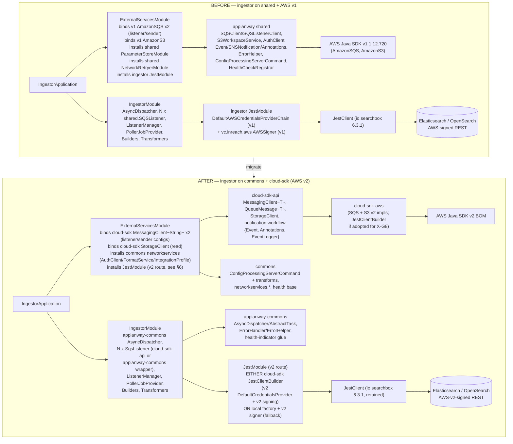
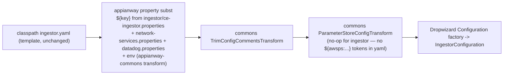

# `ingestor` — AWS SDK v2 (cloud-sdk) Upgrade Design (claude)

> Module: `com.inttra.mercury.appian-way:ingestor:1.0` · Path: `ingestor` · Main: `com.inttra.mercury.ingestor.IngestorApplication` · Port: **8081**
> Date: 2026-07-22 · Author: Claude (Sonnet 5)
> Program foundation: [`2026-07-22-appianway-awsupgrade-foundation-claude.md`](../../2026-07-22-appianway-awsupgrade-foundation-claude.md) (§2–§8 govern this doc; §7 is the section template followed here; X-G8 is defined in foundation §5).
> INT run/verify evidence: [`2026-07-22-appway-app-checkouts-run-config.md`](../../2026-07-22-appway-app-checkouts-run-config.md) §4.7 (ingestor **and** ce-ingestor both verified 2026-07-22 on the DW5/Jetty12 baseline).
> Supersedes/updates: [`2026-05-31-ingestor-aws2x-upgrade-DESIGN-claude.md`](2026-05-31-ingestor-aws2x-upgrade-DESIGN-claude.md) + [`...-plan-claude.md`](2026-05-31-ingestor-aws2x-upgrade-plan-claude.md) (those assumed `shared` stays and cloud-sdk is consumed *through* it; this doc reflects the **locked 2026-07-22 decision**: `shared` is retired outright, target line is `1.0.27-SNAPSHOT`, and ingestor consumes `commons`/`cloud-sdk-api`/`cloud-sdk-aws`/`appianway-commons` directly. The X-G8 analysis and file:line evidence from the prior docs are carried forward and re-verified below.)

---

## 1. Overview

ingestor is the **event-indexing sink** of the appianway pipeline (despite the name, it is not a first-stage receiver): it consumes `Event`/`SNSNotification` payloads fanned out onto its inbound SQS queue, enriches them with `TrackingMetaData` via a chain of `Builders`/`AttributeBuilder`s, resolves error content from S3 when needed, and bulk-indexes the result into an AWS-managed **Elasticsearch** (OpenSearch) domain via the **Jest** (`io.searchbox`) REST client, which it AWS-signs itself. A `wisp` scheduler runs a 24-hourly job that deletes expired daily indices.

- **Current state (DW5 baseline, done 2026-07-22 via ION-16098):** Dropwizard 5.0.2 / Jetty 12.1.9 / Java 17 / Jackson 2.21.4, boots clean on INT (both profiles). Still on **AWS Java SDK v1 (1.12.720)** + the appianway `shared` module for SQS/S3/config/health/network-services, and on a **local v1-credentialed Jest signer**.
- **Target:** `commons` + `cloud-sdk-api` + `cloud-sdk-aws` (`1.0.27-SNAPSHOT`, AWS SDK v2) + slim `appianway-commons` for the appianway-only residue (`AsyncDispatcher`, `ErrorHandler`/`ErrorHelper`, health glue, config-transform composition). `shared` is deleted from the dependency tree entirely.
- **Headline change (X-G8):** ingestor is the **only** one of the 14 modules that AWS-signs a *non-AWS-native* HTTP call (Elasticsearch/Jest) with AWS credentials. Migrating `JestModule`'s `DefaultAWSCredentialsProviderChain` + `vc.inreach.aws.request.AWSSigner` (v1) to an AWS SDK v2 credential/signing path is the module-specific piece of work; everything else is the standard SQS/S3-read/network-services rebind common to the light consumers.
- **Two deployments, one jar:** `ingestor` (queue `inttra_int_sqs_ingest`) and `ce-ingestor` (queue `inttra_int_sqs_ingestor_ce`) — same `ingestor-1.0.jar`, same `ingestor.yaml`, different `conf/int/{ingestor,ce-ingestor}.properties`. Both are unaffected by the AWS-upgrade beyond the common rebind (no profile-specific AWS surface differences other than the queue URL).

---

## 2. Current vs Target architecture

### 2.1 Component diagram — before/after



### 2.2 Class-level mapping — what each `shared`/v1 type becomes

| Today (`com.inttra.mercury.shared.*` / v1) | File:line (evidence) | Target | Home |
|---|---|---|---|
| `com.amazonaws.services.sqs.AmazonSQS` (`amazonSQSForListener`, `amazonSQSForSender`) | `ExternalServicesModule.java:38-41` | `MessagingClient<String>` (2 named bindings, listener + sender/delete configs) | cloud-sdk-api iface / cloud-sdk-aws SQS impl |
| `com.amazonaws.services.s3.AmazonS3` (`s3_read_put_copy`) | `ExternalServicesModule.java:42-43` | `StorageClient` (read-only use here) | cloud-sdk-api iface / cloud-sdk-aws S3 impl |
| `shared.workspace.S3WorkspaceService` / `WorkspaceService` (bound **twice** — once in `ExternalServicesModule.java:45`, redundantly again in `IngestorModule.java:60`) | `ExternalServicesModule.java:45`, `IngestorModule.java:60` | Collapse to a **single** binding; `ErrorTransformer` injects `StorageClient` directly and calls `getContent(bucket, fileName)` — no appianway wrapper needed (read-only, no S-G2 metadata concern) | cloud-sdk-api |
| `shared.messaging.SQSListenerClient` | `IngestorModule.java:82` (`getSQSListener`) | `MessagingClient<String>` (listener-scoped instance, long-poll `waitTimeSeconds`/`maxNumberOfMessages`) | cloud-sdk-api / cloud-sdk-aws |
| `shared.messaging.SQSClient` (delete only) | `IngestorTask.java` ctor + `deleteMessage` | `MessagingClient<String>` (sender-scoped instance, `.deleteMessage(queueUrl, receiptHandle)`) | cloud-sdk-api / cloud-sdk-aws |
| `com.amazonaws.services.sqs.model.Message` | `Task.java:3`, `TaskFactory.java:3`, `AsyncDispatcher.java:3`, `IngestorTask.java:3,39,45,79`, `ErrorHandler.java:3` | `QueueMessage<String>` — `getPayload()` replaces `getBody()`, `getReceiptHandle()` unchanged | cloud-sdk-api |
| `shared.threaddispatcher.Dispatcher` | `IngestorModule.java:59`, `AsyncDispatcher.java:5,12` | `Dispatcher` interface moves into **appianway-commons** (`com.inttra.mercury.appianway.commons.dispatch.Dispatcher`); ingestor's `AsyncDispatcher`/`Task`/`TaskFactory`/`IngestorTask` orchestration is **retained as-is**, just re-typed to `QueueMessage<String>` | appianway-commons |
| `shared.listener.SQSListener` (N instances, `IngestorModule.getSQSListener`) | `IngestorModule.java:80-95` | cloud-sdk-api `messaging.Listener`/`SqsListener` backed by `MessagingClient<String>`, feeding the same `Dispatcher.submit(...)` callback; `ListenerManager` (ingestor-local, unchanged shape) still owns the `Managed` lifecycle for the **8** (or 2, per §5) threads | cloud-sdk-api (poller) + ingestor-local `ListenerManager` |
| `shared.event.Event`, `shared.event.SNSNotification` | `IngestorTask.java:10-11,39-43`, `ErrorTransformer.java:4` | `cloud-sdk-api` `notification.workflow.Event`; `SNSNotification` has no direct cloud-sdk-api equivalent — keep as an **ingestor-local** small DTO (it only unwraps the SNS `Message`/`Subject` envelope before handing the inner JSON to `Event`) | cloud-sdk-api (Event) + ingestor-local (SNSNotification unwrap) |
| `shared.workspace.Annotations` | `ErrorTransformer.java:6,44` | `cloud-sdk-api` `notification.annotation.Annotations` | cloud-sdk-api |
| `shared.support.Json` | `ErrorTransformer.java:5`, `IngestorTask.java:14`, `ElasticSearchEventRepository.java:13` | `cloud-sdk-api` `notification.util.JsonSupport` (or equivalent Jackson helper) — **verify** date-format/`LocalDateTime` parity per foundation §5A before cutover | cloud-sdk-api |
| `shared.externalwrapper.exception.RecoverableException` | `IngestorTask.java:12`, `ElasticSearchEventRepository.java:12` | `appianway-commons` `RecoverableException` | appianway-commons |
| `shared.task.errorhandler.ErrorHelper`, `shared.task.ErrorHandler.MESSAGES_FAILED_METRIC` | `ErrorHandler.java:8,11` (ingestor's own `ErrorHandler` wraps these) | `appianway-commons` `ErrorHandler`/`ErrorHelper` (appianway's requeue/DLQ semantics — not a commons concern) | appianway-commons |
| `shared.config.SQSConfig`, `shared.config.NetworkServiceConfig`, `shared.config.AWSClientConfiguration` | `IngestorConfiguration.java:18,34`, `ExternalServicesModule.java:12-13,38-43` | `SQSConfig`/`NetworkServiceConfig` stay as **ingestor-local Configuration POJOs** (or thin appianway-commons base classes); `AWSClientConfiguration` (v1 `ClientConfiguration` factory) is replaced by cloud-sdk-aws's v2 `AwsMessagingClientConfig`/`ClientOverrideConfiguration` | module + cloud-sdk-aws |
| `shared.networkservices.auth.AuthClient`, `format.CacheFormatService`, `integrationprofile.CacheIntegrationProfileByIdService` | `ExternalServicesModule.java:15-19,51-56` | `commons` `com.inttra.mercury.networkservices.*` + `client.AuthClient` (same class shapes, same SSM-path resolution) | commons |
| `shared.parameterstore.ParameterStoreModule` | `ExternalServicesModule.java:20,58` | commons parameter-store module (`CloudParameterStore`/`ParameterStoreLookup`-backed), same runtime SSM resolution (see §5.2) | commons |
| `shared.command.ConfigProcessingServerCommand` | `IngestorApplication.java:13,42`, `CreateMappingTemplate.java:6,23` | `commons.config.ConfigProcessingServerCommand` **composed with** appianway property-substitution transform (appianway-commons) — see §5.3 | commons + appianway-commons |
| `shared.config.S3ConfigurationProvider` | `IngestorApplication.java:14,39-41` | Keep **appianway-local** (only used when `CONFIG_LOCATION=s3`; not exercised on INT per run-config evidence) | appianway-commons or module |
| `shared.healthcheck.HealthCheckRegistrar`, `indicator.InboundSqsHealthCheck` | `IngestorApplication.java:15-16,67`, `registerHealthChecks` | `commons.health` base + **appianway-commons** `InboundSqsHealthCheck` wrapper re-pointed at the injected `MessagingClient<String>` | commons + appianway-commons |
| **`vc.inreach.aws.request.AWSSigner` + `com.amazonaws.auth.DefaultAWSCredentialsProviderChain`** (Jest signing) | `JestModule.java:3-4,15,37-40` | **X-G8** — cloud-sdk-aws `JestClientBuilder`/`JestModule` (v2 `DefaultCredentialsProvider` + v2 signing) **or** local `JestClientFactory` + a v2 signing interceptor (fallback) | cloud-sdk-aws (preferred) or module-local |
| `io.searchbox.*` (Jest client itself) | `JestModule.java`, `ElasticSearchEventRepository.java`, `IndexESService.java`, `CreateMappingTemplate.java` | **Retained unchanged** — only the AWS-signing credential path moves; Jest 6.3.1/`io.searchbox` protocol stays (OpenSearch-SDK migration is explicitly out of scope, per foundation §5 and the prior DESIGN) | unchanged (module) |
| `com.coreoz.wisp` scheduler (`DeleteIndexSchedulerConfig`, `PollerJobProvider`, `DeleteExpiredIndex`) | `PollerJobProvider.java`, `DeleteExpiredIndex.java` | **Unaffected** — no AWS SDK involvement; purely calls `IndexESService`/`JestClient` | unchanged (module) |

---

## 3. AWS touchpoints

| Direction | Resource (INT) | cloud-sdk client used | Notes |
|---|---|---|---|
| SQS — inbound (listener, `ingestor` profile) | `inttra_int_sqs_ingest` (`https://sqs.us-east-1.amazonaws.com/081020446316/inttra_int_sqs_ingest`) | `MessagingClient<String>` (listener config) | 8 poller threads (`listenerThreads: 8`), `waitTimeSeconds: 20`, `maxNumberOfMessages: 10` |
| SQS — inbound (listener, `ce-ingestor` profile) | `inttra_int_sqs_ingestor_ce` (`https://sqs.us-east-1.amazonaws.com/081020446316/inttra_int_sqs_ingestor_ce`) | `MessagingClient<String>` (listener config) | Same yaml/defaults, different queue only |
| SQS — delete (post-process) | Same queue as inbound, per profile | `MessagingClient<String>` (sender/delete config) | `IngestorTask.deleteMessage` after successful ES index |
| SQS — outbound / DLQ | **None declared in yaml** — `ErrorHandler.handleRecoverableException` re-queues to `pickupSqsConfig.getQueueUrl() + "_dlq"` (constructed at runtime, not a separate config key) | `MessagingClient<String>` (sender config) | No `outbound`/`error` queue config in `ingestor.yaml`; this is the only "outbound" SQS use and it's a derived queue name, not health-probed |
| SNS | **None** | — | ingestor has no `snsConfig`/`notificationConfig` block; it only *consumes* events that other modules publish to SNS — confirmed absent from `ingestor.yaml` |
| S3 — read | Bucket/key resolved dynamically at runtime from the failed event's payload (`event.getEventContent().get("bucket")`/`"fileName"`), not a static config value | `StorageClient.getContent(bucket, fileName)` | Read-only; **S-G2 (metadata write/copy overloads) does NOT apply** — confirmed in the 2026-05-31 DESIGN and re-verified here (`ErrorTransformer.java:43`) |
| S3 — write | None | — | ingestor never writes to S3 |
| DynamoDB | None | — | Not used by ingestor |
| SES | None | — | Not used by ingestor |
| Elasticsearch/OpenSearch (AWS-signed HTTP, not an AWS SDK client) | `https://search-inttra-int-es-tx-tracker-dpoim7r77u3gen62ptekcw3tau.us-east-1.es.amazonaws.com` (same domain, both profiles), `region: us-east-1`, `service: es` | Jest (`io.searchbox`) client, request-signed with AWS v2 credentials (X-G8) | Not a cloud-sdk client per se — the credential/signing layer is the AWS touchpoint |
| Param Store (SSM) | `/inttra/int/appianway/networkservices/authclientid`, `/inttra/int/appianway/networkservices/authclientsecret` | commons `networkservices.client.AuthClient` + parameter-store lookup | `usePassThrough=false` — resolved from SSM at **runtime/boot**, same as today (§5.2) |
| gRPC | None | — | Not applicable to ingestor |

---

## 4. Sequence diagram — consume → transform → index

```mermaid
sequenceDiagram
    participant L as SqsListener (cloud-sdk-api, 1 of N)
    participant M as MessagingClient~String~ (cloud-sdk-aws, listener)
    participant D as AsyncDispatcher (appianway-commons)
    participant T as IngestorTask (ingestor)
    participant B as Builders / AttributeBuilder chain
    participant TR as ErrorTransformer
    participant SC as StorageClient (cloud-sdk-api, read)
    participant R as ElasticSearchEventRepository
    participant J as JestClient (AWS v2-signed)
    participant ES as Elasticsearch / OpenSearch
    participant MD as MessagingClient~String~ (cloud-sdk-aws, sender/delete)

    L->>M: receiveMessages(queueUrl, waitTimeSeconds=20, maxNumberOfMessages=10)
    M-->>L: List<QueueMessage<String>>
    L->>D: submit(List<QueueMessage<String>>, queueUrl)
    D->>T: execute(List<QueueMessage<String>>, queueUrl)
    T->>T: getEventStoreMsgFromSNSMessage() : unwrap SNSNotification -> List<Event>
    T->>B: getTrackingMetaData(event) per event
    B-->>T: List<TrackingMetaData> (grouped by workflowId)
    loop for each Event
      T->>TR: transform(event)
      alt closeRun + failure status + no annotations yet
        TR->>SC: getContent(bucket, fileName)
        SC-->>TR: error-file content (JSON)
        TR->>TR: Annotations = parse(content); event.setAnnotations(Annotations)
      end
    end
    T->>R: submitEvent(events, trackingMetaDataMap)
    R->>J: Bulk.Builder(Index per event).build()
    J->>J: AWS v2 credential resolution + v2 request signing (X-G8)
    J->>ES: signed bulk index request (txtrack-event-yyyy-MM-dd)
    ES-->>J: 200 (or 409 -> retry, up to 3, exponential backoff)
    R->>J: Update (upsert) per workflowId -> txtrack-agg-yyyy-MM-dd
    J->>ES: signed upsert request (retry_on_conflict=5)
    ES-->>J: 200/409
    T->>MD: deleteMessage(queueUrl, receiptHandle) per message
```

> Unaffected side-path (no AWS SDK involvement): `com.coreoz.wisp.Scheduler` (`PollerJobProvider`) fires `DeleteExpiredIndex.deleteExpiredIndexes()` every 24h, which calls `IndexESService` (`GetSettings`/`DeleteIndex` via the **same** `JestClient`) to purge `txtrack-agg-*`/`txtrack-event-*` indices older than 30 days (INT override; yaml default 90).

---

## 5. Configuration changes

### 5.1 Property-key table — both profiles, exact INT values

`ingestor.yaml` is byte-identical between the two run profiles; only the first `.properties` file on the CLI differs. Property **keys** referenced by the yaml (§4.3 checklist item 1) are unchanged by this migration — no queue/bucket/SSM-path renames.

| Yaml key (`ingestor.yaml`) | Property key | `ingestor` profile value (`conf/int/ingestor.properties`) | `ce-ingestor` profile value (`conf/int/ce-ingestor.properties`) | Default (if key absent) |
|---|---|---|---|---|
| — (metadata only, used by `metrics.component.env`) | `componentName` | `ingestor` | `ce-ingestor` | — (required, no default) |
| `pickupSqsConfig.queueUrl` | `ingestor.pickupSqsConfig.queueUrl` | `https://sqs.us-east-1.amazonaws.com/081020446316/inttra_int_sqs_ingest` | `https://sqs.us-east-1.amazonaws.com/081020446316/inttra_int_sqs_ingestor_ce` | none (required) |
| `pickupSqsConfig.waitTimeSeconds` | `ingestor.pickupSqsConfig.waitTimeSeconds` | not set | not set | `20` |
| `pickupSqsConfig.maxNumberOfMessages` | `ingestor.pickupSqsConfig.maxNumberOfMessages` | not set | not set | `10` |
| `listenerThreads` | `ingestor.listenerThreads` | not set | not set | `8` |
| `esEventStoreConfig.endpointUrl` | `ingestor.esEventStoreConfig.endPoint` | `https://search-inttra-int-es-tx-tracker-dpoim7r77u3gen62ptekcw3tau.us-east-1.es.amazonaws.com` | *same* (shared ES domain, both profiles) | none (required) |
| `esEventStoreConfig.region` | *(literal in yaml, not a token)* | `us-east-1` | `us-east-1` | n/a — hardcoded |
| `esEventStoreConfig.service` | *(literal in yaml, not a token)* | `es` | `es` | n/a — hardcoded |
| `networkServiceConfig.*` | `networkservices.*` (from `configuration/int/network-services.properties`, shared across all modules — see §5.2) | (shared) | (shared) | — |
| `deleteIndexSchedulerConfig.jobSchedulerIntervalInHours` | *(literal in yaml, not a token)* | `24` | `24` | n/a — hardcoded |
| `deleteIndexSchedulerConfig.summaryIndex.index_pattern` | *(literal in yaml)* | `txtrack-agg-` | `txtrack-agg-` | n/a — hardcoded |
| `deleteIndexSchedulerConfig.summaryIndex.olderThanInDays` | `deleteIndexScheduler.summaryIndex.olderThanInDays` | `30` | `30` | `90` |
| `deleteIndexSchedulerConfig.detailsIndex.index_pattern` | *(literal in yaml)* | `txtrack-event-` | `txtrack-event-` | n/a — hardcoded |
| `deleteIndexSchedulerConfig.detailsIndex.olderThanInDays` | `deleteIndexScheduler.detailsIndex.olderThanInDays` | `30` | `30` | `90` |
| `server.connector.port` | `server.connector.port` | not set | not set | **`8081`** |
| `logging.level` | `ingestor.logging.level` | not set | not set | `INFO` |
| `metrics.frequency` | `metrics.frequency` (from `configuration/int/datadog.properties`) | `60 second` | `60 second` | none (required) |

**None of these keys, values, queue names, or the ES endpoint change as part of this migration** — this is a pure client-library swap behind the same config surface.

### 5.2 SSM parameter table — resolution mechanism unchanged

| SSM parameter (INT) | Consumed by | Resolution mechanism (today) | Resolution mechanism (target) |
|---|---|---|---|
| `/inttra/int/appianway/networkservices/authclientid` | `networkservices.clientId` → `AuthClient` | `shared.parameterstore.ParameterStoreModule` fetches from AWS SSM v1 client at **boot** (`usePassThrough=false`) | commons parameter-store lookup (`CloudParameterStore`, AWS SSM **v2** client) — **same runtime-boot resolution, not moved to `${awsps:/path}`** (decision: keep as-is; ingestor's `AuthClient` eager-singleton fail-fast pattern is preserved) |
| `/inttra/int/appianway/networkservices/authclientsecret` | `networkservices.clientSecret` → `AuthClient` | same as above | same as above |

Per foundation §4.3 item 2: ingestor is **not** a candidate for moving auth secrets to boot-time `${awsps:/path}` YAML substitution — the existing runtime `AuthClient`-eager-singleton pattern (which fails fast on boot if SSM/auth is unreachable, per the verified INT run evidence in §4.7 of the checkout doc) is preserved unchanged. No `ParameterStoreConfigTransform` / `${awsps:...}` tokens are introduced into `ingestor.yaml`.

### 5.3 Config-command composition



`IngestorApplication.initialize()` continues to register the composed `ConfigProcessingServerCommand<IngestorConfiguration>` under the `run` verb (now `commons.config.ConfigProcessingServerCommand` + the appianway-commons transform, per foundation §4.2/§4.3 item 3), and still conditionally installs `S3ConfigurationProvider` only when `CONFIG_LOCATION=s3` (unused on INT). `CreateMappingTemplate` (the `create-mapping-template` CLI verb) extends the same composed command and is unaffected beyond the import path change.

### 5.4 Run-profile variants — unchanged CLI shape

| | `ingestor` | `ce-ingestor` |
|---|---|---|
| Artifact / main class | `ingestor-1.0.jar` / `com.inttra.mercury.ingestor.IngestorApplication` (both) | (identical) |
| First properties file | `conf/int/ingestor.properties` | `conf/int/ce-ingestor.properties` |
| Shared properties files (unchanged) | `../configuration/int/network-services.properties`, `../configuration/int/datadog.properties` | (identical) |
| Inbound queue | `inttra_int_sqs_ingest` | `inttra_int_sqs_ingestor_ce` |
| Port | 8081 | 8081 (run one at a time locally, or on separate hosts as in real deployment) |
| ES domain | same | same |

CLI arg shape, `-DCONFIG_REGION=US_EAST_1`, and the two-argument-kind resolution model (yaml from classpath, `.properties` from cwd) from the checkout doc §2 are **entirely unchanged** by this migration.

### 5.5 What is unchanged (explicit)

- No queue name, ES domain, SSM path, or `${key:-default}` fallback is renamed or altered.
- `CONFIG_REGION` env/system property behavior unchanged.
- `server.connector.port` default (8081) and the single `simple` server (app + admin share the port) unchanged.
- Health-check surface: still **1 read-side check only** (`InboundSqsHealthCheck`, empty write-list) — `registerHealthChecks` in `IngestorApplication` is not being expanded as part of this migration (ES is still not health-probed; see §10).

---

## 6. cloud-sdk / commons dependencies & assumed gaps

| Gap ID | Applies to ingestor? | Detail |
|---|---|---|
| **S-G2** (S3 metadata put/copy overloads) | **No** | ingestor's only S3 use is `getContent` (read) in `ErrorTransformer.java:43` — no write/copy, no metadata concern. Confirmed in the 2026-05-31 DESIGN and re-verified against current source. |
| **W-G9** (workflow-model parity: `Event.Builder.setAnnotations`, `MetaData.Projection`/`Event.Token` constants) | **Yes — directly relevant.** | ingestor is one of the few consumers that both **deserializes** `Event` off the wire (`IngestorTask.getEventStoreMsgFromSNSMessage`) **and** **mutates its `annotations`** before persisting it (`ErrorTransformer.transform` calls `event.setAnnotations(...)` only when `event.getAnnotations() == null`). If an upstream producer already attached annotations and cloud-sdk-api's `Event` deserialization silently drops them (the W-G9.1 defect — builder has no `setAnnotations`/doesn't copy on `Builder(Event)`), ingestor's null-check would incorrectly treat the event as annotation-less and overwrite/re-derive them from the S3 error file, or the ES document would end up missing annotations that were sent. **Ingestor must be gated behind the W-G9 fix landing in cloud-sdk-api** before/alongside its own migration; the foundation's JSON round-trip corpus test (§5A) should include a representative ingestor-consumed `closeRun` Event carrying annotations. |
| **X-G8** (Jest/OpenSearch AWS-v2 signing knob) | **Yes — the headline gap, verify-first.** | See below. |
| C-G6 (`getConfigTransformer` visibility) | Optional | Not required; §5.3 composition works with it `private`. |
| O-G1/O-G3 | Not applicable | ingestor keeps its own `AsyncDispatcher`/`ListenerManager` orchestration; no S3-event-parser concern. |

### 6.1 X-G8 — verify-first, then choose a route

**Step 1 — verify** whether `cloud-sdk-aws`'s `JestClientBuilder`/`JestModule` (already built on AWS SDK v2 `DefaultCredentialsProvider` + v2 request signing, per foundation §5) exposes the three knobs ingestor's current `JestModule` sets:

| Knob ingestor needs | Current v1 source | Must exist on cloud-sdk's builder |
|---|---|---|
| Elasticsearch endpoint URL | `HttpClientConfig.Builder(configuration.getEsEventStoreConfig().getEndpointUrl())` — `JestModule.java:69-70` | endpoint/base-URL setter |
| AWS region for signing | `configuration.getEsEventStoreConfig().getRegion()` — `JestModule.java:39` | region setter |
| AWS service name for signing (`"es"`) | `configuration.getEsEventStoreConfig().getService()` — `JestModule.java:40` | service-name setter (SigV4 service scope) |
| Multi-threaded HTTP client | `.multiThreaded(true)` — `JestModule.java:71` | equivalent flag or default-on |

**Route A — adopt cloud-sdk (preferred, if verify passes):** delete ingestor's local `AWSSigner`/`AWSSigningRequestInterceptor` wiring in `JestModule.java` entirely; construct the `JestClient` via cloud-sdk-aws's `JestClientBuilder`, passing `endpointUrl`/`region`/`service` from the existing (unchanged) `ElasticSearchConfig`. `CreateMappingTemplate.run()` (`JestModule.java:35`, `new JestModule(ingestorConfig).newClient()`) is updated to the same builder call. Drop `vc.inreach.aws:aws-signing-request-interceptor` from `pom.xml`.

**Route B — local v2 signer (fallback, only if a knob is missing):** keep ingestor's own `JestClientFactory`/`configureHttpClient` interceptor wiring, but replace:
- `com.amazonaws.auth.DefaultAWSCredentialsProviderChain` → `software.amazon.awssdk.auth.credentials.DefaultCredentialsProvider`
- `vc.inreach.aws.request.AWSSigner`/`AWSSigningRequestInterceptor` (v1-shaped SigV4) → an AWS SDK v2 request-signing interceptor (e.g. built on `software.amazon.awssdk.auth.signer.Aws4Signer` adapted to an Apache `HttpRequestInterceptor`)

Both routes are **local to ingestor** — Route B requires **zero cloud-sdk change**; Route A requires only the (additive, non-breaking) confirmation that cloud-sdk-aws's existing Jest support covers the three knobs above — no new cloud-sdk code if it already does. Either way:
- The Jest **client/protocol stays** (`io.searchbox` 6.3.1) — OpenSearch-SDK migration is explicitly out of scope (unchanged from the 2026-05-31 DESIGN).
- v2 `DefaultCredentialsProvider` honors the same IAM role / `AWS_*` env as the v1 chain — no behavior change expected for credential resolution, only the signing library.

### 6.2 What ingestor consumes from commons / cloud-sdk-api / appianway-commons

- **cloud-sdk-api:** `MessagingClient<String>`, `QueueMessage<String>`, `StorageClient` (read), `notification.workflow.Event`, `notification.annotation.Annotations`.
- **commons:** `ConfigProcessingServerCommand` (+ transforms), `com.inttra.mercury.networkservices.*` (`AuthClient`, `FormatService`, `IntegrationProfileByIdService` caches, parameter-store lookup), `health` base.
- **appianway-commons:** `Dispatcher`/`AsyncDispatcher` base (ingestor's `AsyncDispatcher`/`Task`/`TaskFactory`/`IngestorTask` orchestration itself stays module-local, only the `Dispatcher` contract and any shared base class move), `ErrorHandler`/`ErrorHelper`, `RecoverableException`, `InboundSqsHealthCheck` wrapper.
- **Nothing moves to appianway-commons that has a commons/cloud-sdk-api home** — `Event`, `Annotations`, `AuthClient`, network-services, config command all come from upstream per foundation §2.

---

## 7. Maven dependency changes

`ingestor/pom.xml` — concrete remove/add/keep:

**Remove**
```xml
<!-- shared retired -->
<dependency>
  <groupId>com.inttra.mercury.shared</groupId>
  <artifactId>mercury-shared</artifactId>
  <version>${mercury.shared.version}</version>
</dependency>
<!-- v1 SQS client (only v1 dep declared directly in this pom; S3 v1 arrived transitively via shared) -->
<dependency>
  <groupId>com.amazonaws</groupId>
  <artifactId>aws-java-sdk-sqs</artifactId>
  <version>${aws-java-sdk.version}</version>
</dependency>
<!-- ONLY if Route A (§6.1) is adopted: the local v1-era Jest SigV4 signer -->
<dependency>
  <groupId>vc.inreach.aws</groupId>
  <artifactId>aws-signing-request-interceptor</artifactId>
  <version>0.0.16</version>
</dependency>
```

**Add**
```xml
<dependency>
  <groupId>com.inttra.mercury</groupId>
  <artifactId>cloud-sdk-api</artifactId>
  <version>1.0.27-SNAPSHOT</version>
</dependency>
<dependency>
  <groupId>com.inttra.mercury</groupId>
  <artifactId>cloud-sdk-aws</artifactId>
  <version>1.0.27-SNAPSHOT</version>
</dependency>
<dependency>
  <groupId>com.inttra.mercury</groupId>
  <artifactId>commons</artifactId>
  <version>1.0.27-SNAPSHOT</version>
</dependency>
<dependency>
  <groupId>com.inttra.mercury</groupId>
  <artifactId>appianway-commons</artifactId>
  <version>1.0-SNAPSHOT</version>
</dependency>
```
AWS SDK **v2** (`sqs`, `s3`, apache/http client) arrives transitively via `cloud-sdk-aws`'s managed BOM — do not declare v1 or v2 AWS artifacts directly.

**Keep unchanged**
```xml
<dependency>
  <groupId>io.searchbox</groupId>
  <artifactId>jest</artifactId>
  <version>6.3.1</version>
  <exclusions>
    <exclusion>
      <groupId>com.google.code.gson</groupId>
      <artifactId>gson</artifactId>
    </exclusion>
  </exclusions>
</dependency>
<dependency>
  <groupId>com.google.code.gson</groupId>
  <artifactId>gson</artifactId>
  <version>2.10.1</version>
</dependency>
<dependency>
  <groupId>com.coreoz</groupId>
  <artifactId>wisp</artifactId>
  <version>1.0.0</version>
</dependency>
```
`io.searchbox:jest`/`gson`/`wisp` are **retained exactly as-is** — none of them are AWS SDK dependencies and none are touched by this migration (the ION-16098 CVE work already removed the dead `org.elasticsearch.client:transport` + its 7 direct Netty pins; nothing further needed here). `dropwizard-core`, `metrics-annotation`, `guice`, `guava`, `metrics-guice`, `lombok`, `log4j-core:2.20.0`, `functional-testing`, `junit`, `mockito-core` — unchanged (already aligned to the DW5/Jackson2.21.4 baseline).

**Verify**
- `mvn -pl ingestor -am clean verify` green (the shade-plugin fat jar needs `clean` first, per foundation §6).
- Fat-jar boot against INT for **both** profiles + `/admin/opsHealthcheck` green (reuse the exact procedure already run in checkout doc §4.7 — inbound SQS is the only probed check).

---

## 8. Tests

- **JUnit 5 (Jupiter)** direction for any new/rewritten tests; existing JUnit 4 tests continue via `junit-vintage-engine` during transition (module currently has minimal/no visible unit tests under `src/test` for the AWS-facing classes — confirm coverage gap during implementation).
- **`Task`/`TaskFactory`/`AsyncDispatcher`/`IngestorTask`/`ErrorHandler`** — re-point from `com.amazonaws.services.sqs.model.Message` mocks to `QueueMessage<String>` test doubles (`getPayload()`, `getReceiptHandle()`). Assert `IngestorTask.execute()` still deletes each message via the sender-scoped `MessagingClient` after successful processing, and that a processing exception leaves the message un-deleted (redelivery).
- **`ErrorTransformer`** — assert `StorageClient.getContent(bucket, fileName)` is invoked only when `event.getAnnotations() == null` and the event is a failed `closeRun`; assert the deserialized `Annotations` (now `cloud-sdk-api` type) round-trips identically to the current `shared.workspace.Annotations` shape (foundation §5A parity check) — this is the concrete instance of the **W-G9 round-trip corpus test** for ingestor: take a real `closeRun` `Event` JSON (with and without pre-existing `annotations`) from an event-writer S3 archive and assert `Event.parseJson(...)` preserves `annotations` through to the ES-indexed document.
- **`functional-testing` fakes** — re-pointed to `cloud-sdk-api` (SQS + S3-read fakes only; ingestor needs no SNS/SES/DynamoDB fake, confirmed in §3).
- **Jest / X-G8** — new unit test asserting whichever signer route is chosen (§6.1) resolves credentials via the AWS SDK **v2** default chain and signs outgoing requests against the configured `region`("us-east-1")/`service`("es"); a lightweight integration-style test (or manual INT smoke, §9) that a signed `PutTemplate`/`Index` request against the real ES domain succeeds.
- **`DeleteExpiredIndex`/`IndexESService`/`PollerJobProvider`** — unaffected by the AWS migration (no AWS SDK type in their signatures); existing tests carry over unchanged.
- No `FAILED_ATTEMPTS`/redelivery-count round-trip test needed — ingestor's `ErrorHandler` re-queues via `errorHelper.isRecoverableAttemptsNotMaxed(message)`, which is an appianway-commons concern, not a wire-format one.

---

## 9. Rollout & verification

Per foundation §8, ingestor sits in the **"light consumers"** wave, immediately after event-writer/distributor-rest/structuralvalidator and explicitly called out as the **Jest-verify** module:

```
appianway-commons  →  functional-testing  →  event-writer (S-G2 pilot)
  →  distributor-rest, structuralvalidator
  →  splitter, ingestor (this doc)   ← ingestor lands here
  →  dispatcher, distributor, error-processor
  →  email-sender, transformer
  →  watermill-publisher, then the 4 watermill consumers
```

1. Confirm `appianway-commons` + `functional-testing` (cloud-sdk-api-backed fakes) have landed.
2. Resolve **X-G8** first (§6.1) — this is the one piece of work that could ripple into a cloud-sdk-aws change; do the verify step before starting the rebind so the pom/Maven changes (§7) are decided up front.
3. Rebind `ExternalServicesModule` (SQS listener/sender → `MessagingClient<String>`, S3 → `StorageClient`), swap `Message` → `QueueMessage<String>` through `Task`/`TaskFactory`/`AsyncDispatcher`/`IngestorTask`/`ErrorHandler`, migrate `JestModule` per the chosen X-G8 route, update `CreateMappingTemplate`.
4. `mvn -pl ingestor -am clean verify`.
5. INT boot evidence for **both** profiles (reuse checkout-doc §4.7 procedure exactly):
   - `java -DCONFIG_REGION=US_EAST_1 -jar target/ingestor-1.0.jar run ingestor.yaml conf/int/ingestor.properties ../configuration/int/network-services.properties ../configuration/int/datadog.properties`
   - repeat with `conf/int/ce-ingestor.properties`
   - Confirm: Jetty 12.1.9/Java 17 boot, `AuthClient` `/auth` success (SSM resolved via commons now), Jest client wires to the ES domain, 8 listener threads start, `GET /admin/opsHealthcheck` → HTTP 200 with the single inbound-SQS check green (per profile's queue).
6. Manual smoke: push (or wait for) a real message through `inttra_int_sqs_ingest`/`inttra_int_sqs_ingestor_ce` and confirm a document lands in `txtrack-event-<date>`/`txtrack-agg-<date>` — the one live-data check that boot evidence alone can't prove (ES was never health-probed even pre-migration, per checkout doc §4.7 caveats).

---

## 10. Risks & mitigations

| Risk | Mitigation |
|---|---|
| cloud-sdk-aws's `JestClientBuilder` lacks a `region`/`service`/endpoint knob ingestor needs (X-G8) | Verify-first (§6.1) before committing to Route A; Route B (local v2 signer) is a fully self-contained fallback requiring zero cloud-sdk change |
| AWS SDK v2 `DefaultCredentialsProvider` resolves credentials differently than v1's `DefaultAWSCredentialsProviderChain` for ES signing (e.g. different profile/role precedence) | Dev/INT parity smoke — both chains honor the same IAM role and `AWS_*` env vars; confirm a signed request still succeeds against the same ES domain before/after |
| **W-G9** annotations-round-trip defect silently drops `Annotations` ingestor is specifically responsible for attaching/preserving | Do not cut ingestor over until the W-G9 fix lands in cloud-sdk-api; add the ingestor-specific corpus case (closeRun event with annotations) to the foundation's round-trip test (§5A) |
| Redundant `WorkspaceService` binding (bound twice today, `ExternalServicesModule.java:45` + `IngestorModule.java:60`) papers over a latent Guice binding-order bug; collapsing to a single `StorageClient` injection could surface it | Collapse deliberately during the rebind (§2.2) and run the full boot + smoke (§9) rather than mechanically translating both bindings |
| Two named `MessagingClient<String>` instances (listener vs sender/delete) must preserve the current listener/sender `AWSClientConfiguration` split (independent timeouts/retry policy) | Map `sqs_listener` → listener-scoped `AwsMessagingClientConfig`, `sqs_sender` → sender-scoped config explicitly; do not collapse to one client unless the configs are verified identical |
| Jest/`io.searchbox` stays on Java-17-incompatible reflective caller lookup (`sun.reflect.Reflection.getCallerClass` WARN, already observed benign in checkout doc §4.7) | Cosmetic only, already tolerated on the DW5 baseline; no action needed, but don't mistake it for a new regression during this migration |
| `ce-ingestor` profile is easy to forget in verification (same jar/yaml, only the properties file differs) | Explicit two-profile boot + smoke in §9, mirroring the checkout-doc §4.7 evidence that both were run separately |
| `functional-testing`'s SQS/S3 fakes lag the cloud-sdk-api rebind, breaking ingestor's existing unit tests | Sequence ingestor strictly after `functional-testing` per foundation §8; do not start the rebind until the fakes are cloud-sdk-api-shaped |
