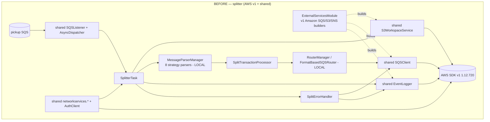
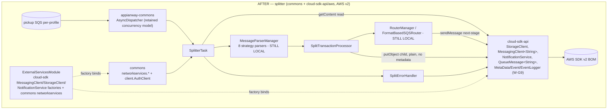

# `splitter` — AWS SDK v2 (cloud-sdk) Upgrade DESIGN (claude)

> Module: `com.inttra.mercury.appian-way:splitter:1.0` · Path: `splitter/` · Date: 2026-07-22 · Author: Claude (Opus 4.8)
> Program: retire appianway `shared` → `mercury-services-commons` **`1.0.27-SNAPSHOT`** (`commons` + `cloud-sdk-api` + `cloud-sdk-aws`) + slim **`appianway-commons`**, on the already-landed **Dropwizard 5.0.2 / Jetty 12.1.9 / Java 17 / Jackson 2.21.4** baseline (ION-16098).
> **Foundation (read first, not duplicated here):** [`2026-07-22-appianway-awsupgrade-foundation-claude.md`](../../2026-07-22-appianway-awsupgrade-foundation-claude.md) — §2 `shared`→replacement map, §3 slim `appianway-commons`, §4 config/SSM model, §5/§5A cloud-sdk gaps assumed done (S-G2, W-G9), §6 Maven template, §8 rollout order.
> **INT verification baseline:** [`2026-07-22-appway-app-checkouts-run-config.md`](../../2026-07-22-appway-app-checkouts-run-config.md) §4.8 — splitter already boots clean on the DW5 baseline against INT, **both** `splitter` and `ce-splitter` profiles, with the **richest health-check coverage of the 8 core apps (6 ops checks)**.
> **Supersedes:** [`2026-05-31-splitter-aws2x-upgrade-DESIGN-claude.md`](2026-05-31-splitter-aws2x-upgrade-DESIGN-claude.md) + [plan](2026-05-31-splitter-aws2x-upgrade-plan-claude.md) (pre-DW5, `1.0.26-SNAPSHOT`) — this doc updates the target line to `1.0.27-SNAPSHOT`, adds the `appianway-commons` split, the exact two-profile config tables, and the W-G9 workflow-model dependency.

---

## 1. Overview

**Purpose:** splitter is the ETL hub's fan-out stage. It consumes a `MetaData` envelope from its pickup queue, reads the container document from the workspace bucket, runs a **strategy-pattern parser** (`MessageParserManager` → 8 Gen2 EDIFACT/ANSI/rates/XML/cfast/desktop parsers) to split a batch envelope into per-transaction child messages, authenticates/enriches each child against integration-profile/format network-services, writes child content back to the workspace bucket, and routes each child `MetaData` to a context-code-mapped next-stage queue (`format_based` router) while emitting START/CLOSE workflow lineage events to SNS.

**Current state (DW5 baseline, verified in `run-config.md` §4.8):** AWS Java SDK **v1** (`aws-java-sdk-sqs` in `pom.xml`) behind appianway `shared` wrappers (`SQSClient`, `S3WorkspaceService`/`WorkspaceService`, `SNSEventPublisher`, `EventLogger`, `networkservices.*`), on Dropwizard 5 / Jetty 12 / Java 17. Both `splitter` and `ce-splitter` boot clean and pass all 6 ops health checks.

**Target:** `commons`/`cloud-sdk-api`/`cloud-sdk-aws` `1.0.27-SNAPSHOT` + slim `appianway-commons`. `shared` is removed entirely from the dependency tree.

**Headline change:** splitter is the **canonical pure-consumer rebind** in the program (§8 rollout: "light consumers" tier, alongside ingestor). No business logic changes. Two moves only:
1. Rebind `ExternalServicesModule` from v1 `Amazon{SQS,S3,SNS}` client builders to cloud-sdk factories (`MessagingClient<String>` listener+sender, `StorageClient`, `NotificationService`), and network-services (`AuthClient`, `IntegrationProfileByParamsService`, `FormatService`) from `commons`.
2. Swap the v1 `com.amazonaws.services.sqs.model.Message` element threaded through `SplitterTask`/`SplitErrorHandler`/`SplitTransactionProcessor` for cloud-sdk-api's `QueueMessage<String>`.

**Explicitly NOT moving:** the 8 strategy parsers under `parser/edifact`, `parser/ansi`, `parser/xml`, `parser/rates`, `parser/cfast`, `parser/desktop` (plus `AbstractGen2*`/`ParserUtil`/`Gen2EnvelopeParserHelper`), `RouterManager`/`FormatBasedSQSRouter`/`RouteDefinition`/`RoutingResult`, `MessageBatch`/`MessageGroup`/`GroupingHelper`, and the `MessageParserConfig`/`enabledParsers` wiring — these are 100% appianway-domain, never touch the AWS SDK directly, and stay **appianway-LOCAL** in the `splitter` module itself (not `appianway-commons`, not cloud-sdk).

---

## 2. Current vs Target architecture

### 2.1 Component diagram





### 2.2 Class/type mapping table

| Component | Before (`shared`, AWS v1) | After (commons / cloud-sdk / appianway-commons) |
|---|---|---|
| `ExternalServicesModule` | binds `AmazonSQS@listener`/`@sender`, `AmazonS3`, `AmazonSNS` via `*ClientBuilder.standard().withClientConfiguration(AWSClientConfiguration.*)` | binds `MessagingClient<String>@listener`/`@sender`, `StorageClient`, `NotificationService` via cloud-sdk-aws `MessagingClientFactory`/`StorageClientFactory`/`NotificationClientFactory`; `AuthClient`, `IntegrationProfileByParamsService`→`CacheIntegrationProfileByParamsService`, `IntegrationProfileFormatByParamsService`, `FormatService`→`CacheFormatService` rebind to `commons` `com.inttra.mercury.networkservices.*` + `client.AuthClient` |
| `SplitterTask.process(Message, String)` | v1 `com.amazonaws.services.sqs.model.Message` | `process(QueueMessage<String>, String queueUrl)` — cloud-sdk-api `QueueMessage<String>` (`getPayload`/`getReceiptHandle`/`getAttributes`/`getMessageId`) |
| `SplitErrorHandler.handleSplitException(Message,...)` / `ErrorHelper.isRecoverableAttemptsNotMaxed/sendBackToPickupQueue/sendToQueue/writeErrorsToS3` | v1 `Message`; `shared.task.errorhandler.ErrorHelper` | `QueueMessage<String>`; **`cloud-sdk-api` `notification.annotation.ErrorHelper`** (same method shapes — see foundation §2 row "MetaData, Annotations, Annotation, ErrorHelper") |
| `SplitTransactionProcessor` (uses raw `com.amazonaws.services.sqs.model.Message` in method signatures) | v1 `Message` param types throughout (`validate`, `routeMessages`, `routeToQueue`, `handleError`) | all re-typed to `QueueMessage<String>` |
| `WorkspaceService`/`S3WorkspaceService` (`getContent`, `getFileSize`, `putObject(bucket,key,byte[])`) | `shared.workspace.*` over v1 `AmazonS3` | `cloud-sdk-api` **`StorageClient`** (`getContent`, `getFileSize`/equivalent, `putObject`) over cloud-sdk-aws v2 S3 impl. Splitter's only write is `SplitTransactionProcessor.writeToWorkspace` → plain `putObject(bucket, fileName, byte[])` — **no metadata, no content-type** → the metadata-less overload; **S-G2 is NOT exercised** by splitter |
| `SQSClient` (`sendMessage`) | `shared.messaging.SQSClient` over v1 `AmazonSQS` | `cloud-sdk-api` **`MessagingClient<String>`** (`sendMessage`, `deleteMessage`, `getQueueAttributes`) |
| `SQSListener`/`ListenerManager` + `AsyncDispatcher`/`Dispatcher`/`TaskFactory` | `shared.listener.*` + `shared.threaddispatcher.*` | **`appianway-commons`** — concurrency model has no commons equivalent (foundation §3); `SQSListenerClient` rebinds to cloud-sdk-api `MessagingClient<String>` for the poll loop |
| `EventPublisher`/`SNSEventPublisher`, `EventLogger`, `Event`, `RandomGenerator` | `shared.event.*` | `cloud-sdk-api` `notification.workflow.{Event,EventGenerator,EventLogger,EventPublisher,WorkflowAware}`; `NotificationService.publish` under the hood. **W-G9** required (Event.Builder annotations round-trip — see §6) |
| `Annotations`/`Annotation` (`SplitErrorHandler.createAnnotations`) | `shared.workspace.Annotations` | `cloud-sdk-api` `notification.annotation.{Annotations,Annotation}` — identical shape (foundation §5A) |
| `MetaData` + `MetaData.Projection.*`/`MetaData.Builder` | `shared.task.MetaData` | `cloud-sdk-api` `notification.workflow.MetaData` — identical fields/builder; splitter uses `Projection.{EDIID, INTEGRATION_PROFILE_ID, INTERCHANGE_CONTROL_REFERENCENUMBER, DOCUMENT_CONTROL_NUMBER, FORMAT_ID, INTEGRATION_PROFILE_FORMAT_ID, SPLITTER_FILE_SIZE, CONTEXT_CODE, FORMAT_CODE}` — **`SPLITTER_FILE_SIZE`** is one of the 6 constants confirmed **missing** in cloud-sdk-api today (foundation §5A) → required for splitter to compile, part of W-G9.2 |
| `RecoveryConfig`, `externalwrapper.exception.RecoverableException` | `shared.config.RecoveryConfig`, `shared.externalwrapper.exception.RecoverableException` | `RecoverableException` → **`appianway-commons`** (foundation §3); `RecoveryConfig` stays a small appianway/module POJO (bound as-is in `ExternalServicesModule`) |
| Health checks: `HealthCheckRegistrar`/`RegistryBuilder`/`OpsHealthCheckServlet` + `indicator.{InboundSqs,OutboundSqs,SnsPublish,HttpGet,S3Write,ErrorThreshold}HealthCheck` | `shared.healthcheck.*` | `commons` health base + **`appianway-commons`** indicator wrappers re-pointed to injected `MessagingClient`/`StorageClient`/`NotificationService` (foundation §3); `RegistryBuilder`/`OpsHealthCheckServlet` usage pattern in `SplitterApplication` is **unchanged**, just re-homed |
| `ParameterStoreModule`, `NetworkRetryerModule` | `shared.parameterstore.*`, `shared.networkservices.*` | `commons` `networkservices.*` equivalents (or `cloud-sdk-api` `CloudParameterStore`/`ParameterStoreLookup` if SSM resolution moves to boot — see §5.2) |
| Strategy parsers (`Gen2EdifactMessageParser`, `Gen2AnsiMessageParser`, `RatesParser`, `BKRequestXMLParser`, `BKConfirmXMLParser`, `ForecastParser`, `SupplyParser`, `BookingDesktop`), `AbstractGen2*`, `ParserUtil`, `MessageParserConfig`/`MessageParserManager`, `RouterManager`/`FormatBasedSQSRouter`/`RouteDefinition`/`RoutingResult`, `MessageBatch`/`MessageGroup`/`GroupingHelper` | appianway-local, no AWS | **UNCHANGED, stays splitter-local** — no AWS SDK dependency, no cloud-sdk/commons involvement |

---

## 3. AWS touchpoints

| Touchpoint | Direction | INT resource (both profiles unless noted) | cloud-sdk client used | Health-probed? |
|---|---|---|---|---|
| SQS pickup | inbound (consume) | `splitter`: `inttra_int_sqs_splitter_pu` · `ce-splitter`: `inttra_int_sqs_splitter_ce_pu` | `MessagingClient<String>` (listener role) via appianway-commons `AsyncDispatcher`/`SQSListener` | ✅ default + ops |
| SQS router | outbound (produce, per-transaction child routing) | `inttra_int_sqs_router` — **NOTE:** this is the health-check target only; actual per-message routing destinations come from `routeMappings` below, not a single "router" send (see §10 risk) | `MessagingClient<String>` (sender role) | ✅ ops only |
| SQS error/subscription | outbound (produce, non-recoverable failures) | `inttra_int_sqs_subscription_errors` | `MessagingClient<String>` (sender role) | ✅ ops only |
| SQS route-mapping destinations | outbound (produce, per-context-code) | `inttra_int_sqs_transformer_inbound` (`ce`: `inttra_int_sqs_transformer_ce` for `publishContainerEvent`), `inttra_int_sqs_si_inbound`, `inttra_int_sqs_transformer_os_inbound`, `inttra_int_sqs_rates_inbound`, `inttra_int_sqs_cfast_batch_inbound` | `MessagingClient<String>` (sender role), invoked from `FormatBasedSQSRouter.sendToSqs` | ❌ config-resolved only (per run-config §4.8 caveat) |
| SNS event topic | outbound (publish, START/CLOSE lineage) | `splitter`: `arn:aws:sns:us-east-1:081020446316:inttra_int_sns_event` · `ce-splitter`: `...inttra_int_sns_event_ce` | `NotificationService` | ✅ ops only |
| S3 workspace | read (container envelope) + write (child content, error content) | `inttra-int-workspace` | `StorageClient` (`getContent` read; `putObject` **plain, no metadata/content-type** write) | ✅ ops only (write check) |
| Network-services ping | health probe | `GET https://api-alpha.inttra.com/network/services/ping` | `HttpGetHealthCheck` (appianway-commons) against `commons` network-services base URL | ✅ default + ops |
| Network-services auth | boot + per-call (integration-profile/format lookups) | `https://api-alpha.inttra.com/auth`; SSM `clientId`/`clientSecret` (see §5.2) | `commons` `client.AuthClient` | indirect (boot-time `AuthClient` call proves it) |
| DynamoDB | — | not used by splitter | — | — |
| SES | — | not used by splitter | — | — |
| gRPC | — | not used by splitter | — | — |

---

## 4. Sequence diagram — consume → parse/route → router SQS + SNS

```mermaid
sequenceDiagram
    participant L as SQSListener (appianway-commons)
    participant T as SplitterTask
    participant SC as StorageClient (cloud-sdk-api)
    participant PM as MessageParserManager / strategy parser (LOCAL)
    participant IP as IntegrationProfile/Format services (commons)
    participant STP as SplitTransactionProcessor
    participant RM as RouterManager / FormatBasedSQSRouter (LOCAL)
    participant MC as MessagingClient&lt;String&gt; (cloud-sdk-api)
    participant NS as NotificationService (cloud-sdk-api)

    L->>T: process(QueueMessage&lt;String&gt;, queueUrl)
    T->>T: payload -> MetaData (cloud-sdk-api Json)
    T->>SC: getContent(bucket, fileName, ISO-8859-1)  %% container envelope, read-only
    SC-->>T: content
    T->>PM: getMessageParser(metaData, content); init; validate
    alt parser.requiresSplitting()
        PM-->>T: List&lt;child Message&gt;
        loop each child (async, per group)
            T->>STP: validate(child, metaData, authProfileId, ...) -> IP
            IP-->>T: integrationProfileId / format
            STP->>STP: groupMessage(batch, child)
        end
        par per group
            STP->>SC: putObject(bucket, childFileName, bytes)  %% plain write, no metadata -> no S-G2 needed
            STP->>RM: routeMessage(childMetaData)
            RM->>IP: findFormat(formatId) -> contextCode
            RM->>MC: sendMessage(routeMappings[contextCode], childMetaData.toJsonString())
        end
    else single document (no split)
        T->>STP: validate + routeToQueue(metaData, ...)
        STP->>RM: routeMessage(metaData)
        RM->>MC: sendMessage(routeMappings[contextCode], metaData.toJsonString())
    end
    T->>NS: logCloseRunEvent(CLOSE_WORKFLOW, success, tokens)  %% NotificationService.publish under the hood
    Note over T,L: on success, AsyncDispatcher/AbstractTask deletes via MessagingClient.deleteMessage(queueUrl, receiptHandle)
```

**Error path (`SplitErrorHandler`, retained shape):**

```mermaid
sequenceDiagram
    participant EH as SplitErrorHandler
    participant ErH as ErrorHelper (cloud-sdk-api notification.annotation)
    participant QM as QueueMessage&lt;String&gt;
    participant MC as MessagingClient&lt;String&gt;
    participant SC as StorageClient
    participant NS as NotificationService

    EH->>ErH: isRecoverable(exception)?
    alt recoverable
        EH->>ErH: isRecoverableAttemptsNotMaxed(queueMessage)  %% FAILED_ATTEMPTS attribute, String round-trip
        alt attempts not maxed
            EH->>ErH: sendBackToPickupQueue(queueMessage, metaData, pickupQueueUrl) -> MC.sendMessage
        else maxed
            EH->>ErH: sendToQueue(metaData, pickupQueueUrl + "_dlq") -> MC.sendMessage
        end
    else non-recoverable
        EH->>EH: createAnnotations(ex, ERROR_CODES, DEFAULT_ERROR_CODE)
        EH->>ErH: writeErrorsToS3(metaData, annotations, componentName, s3Bucket) -> SC.putObject
        EH->>ErH: sendToQueue(failureMetaData, inttra_int_sqs_subscription_errors) -> MC.sendMessage
    end
    EH->>NS: logCloseRunEvent(...)
```

Child lineage (`rootWorkflowId`/`parentWorkflowId`/`workflowId`, `MetaData.Projection.{EDIID, INTEGRATION_PROFILE_ID, INTERCHANGE_CONTROL_REFERENCENUMBER, DOCUMENT_CONTROL_NUMBER, FORMAT_ID, INTEGRATION_PROFILE_FORMAT_ID, SPLITTER_FILE_SIZE, CONTEXT_CODE, FORMAT_CODE}`) built in `SplitterTask.buildMetaData`/`enrichProjections`, `SplitTransactionProcessor.buildMetaData`, and `FormatBasedSQSRouter.enrichMetaData` — **unchanged domain logic**.

---

## 5. Configuration changes

### 5.1 Property-key table — BOTH profiles, exact INT values

Source files: `splitter/conf/splitter.yaml` (template, classpath) + `splitter/conf/int/splitter.properties` / `splitter/conf/int/ce-splitter.properties` (filesystem, cwd-relative) + `configuration/int/network-services.properties` + `configuration/int/datadog.properties`. Run command (unchanged, `run-config.md` §4.8):

```
run splitter.yaml conf/int/splitter.properties ../configuration/int/network-services.properties ../configuration/int/datadog.properties
run splitter.yaml conf/int/ce-splitter.properties ../configuration/int/network-services.properties ../configuration/int/datadog.properties
```

| yaml key (`${...}` token) | `splitter` profile (INT value) | `ce-splitter` profile (INT value) | Source file |
|---|---|---|---|
| `componentName` | `splitter` | `ce-splitter` | `<profile>.properties` (overrides yaml default `splitter`) |
| `healthCheckConfig.errorRateThreshold` | `5.0` (yaml default, not overridden) | `5.0` | yaml default |
| `healthCheckConfig.integrationProfileHealthCheckUrl` | `https://api-alpha.inttra.com/network/services/ping` | same | `network-services.properties` → `networkservices.healthCheckUrl` |
| `sqsPickupConfig.queueUrl` | `https://sqs.us-east-1.amazonaws.com/081020446316/inttra_int_sqs_splitter_pu` | `.../inttra_int_sqs_splitter_ce_pu` | `<profile>.properties` → `splitter.sqsSplitterConfig.queueUrl` |
| `sqsPickupConfig.waitTimeSeconds` | `20` (yaml default) | `20` | yaml default |
| `sqsPickupConfig.maxNumberOfMessages` | `3` | `8` | `<profile>.properties` → `splitter.sqsSplitterConfig.maxNumberOfMessages` |
| `sqsRouterConfig.queueUrl` | `.../inttra_int_sqs_router` | same | `splitter.sqsRouterConfig.queueUrl` |
| `sqsErrorConfig.queueUrl` | `.../inttra_int_sqs_subscription_errors` | same | `splitter.sqsErrorSubscriptionConfig.queueUrl` |
| `snsEventConfig.topicArn` | `arn:aws:sns:us-east-1:081020446316:inttra_int_sns_event` | `...inttra_int_sns_event_ce` | `splitter.snsEventConfig.topicArn` |
| `s3WorkspaceConfig.bucket` | `inttra-int-workspace` | same | `splitter.s3WorkspaceConfig.bucket` |
| `routeMappings.requestBooking` | `inttra_int_sqs_transformer_inbound` | same | `splitter.routeMappings.requestBooking` |
| `routeMappings.confirmBooking` | `inttra_int_sqs_transformer_inbound` | same | `splitter.routeMappings.confirmBooking` |
| `routeMappings.submitSI` | `inttra_int_sqs_si_inbound` | same | `splitter.routeMappings.submitSI` |
| `routeMappings.publishContainerEvent` | `inttra_int_sqs_transformer_inbound` | **`inttra_int_sqs_transformer_ce`** ← the one CE-specific route | `splitter.routeMappings.publishContainerEvent` |
| `routeMappings.publishSchedule` | `inttra_int_sqs_transformer_os_inbound` | same | `splitter.routeMappings.publishSchedule` |
| `routeMappings.publishRate` | `inttra_int_sqs_rates_inbound` | same | `splitter.routeMappings.publishRate` |
| `routeMappings.publishCFast` | `inttra_int_sqs_cfast_batch_inbound` | same | `splitter.routeMappings.publishCFast` |
| `enabledParsers` (list, 8 entries) | `Gen2EdifactMessageParser, Gen2AnsiMessageParser, RatesParser, BKRequestXMLParser, BKConfirmXMLParser, ForecastParser, SupplyParser, BookingDesktop` | same | yaml literal, no substitution |
| `routersOrder` | `[format_based]` | same | yaml literal |
| `networkServiceConfig.networkBaseUrl` | `https://api-alpha.inttra.com/network` | same | `network-services.properties` |
| `networkServiceConfig.authEndpointUrl` | `https://api-alpha.inttra.com/auth` | same | `network-services.properties` |
| `networkServiceConfig.clientId` | `/inttra/int/appianway/networkservices/authclientid` (SSM path, see §5.2) | same | `network-services.properties` |
| `networkServiceConfig.clientSecret` | `/inttra/int/appianway/networkservices/authclientsecret` (SSM path) | same | `network-services.properties` |
| `networkServiceConfig.servicePaths.integrationProfileServicePath` | `/participant/integrationProfile` | same | `network-services.properties` |
| `networkServiceConfig.servicePaths.integrationProfileFormatServicePath` | `/participant/integrationProfile/format` | same | `network-services.properties` |
| `networkServiceConfig.servicePaths.formatServicePath` | `/message/format` | same | `network-services.properties` |
| `server.connector.port` | `8081` (yaml default) | `8081` | yaml default |
| `logging.level` | `INFO` (yaml default) | `INFO` | yaml default |
| `metrics.frequency` | `60 second` | same | `datadog.properties` |

> `usePassThrough=false` in `network-services.properties` — auth `clientId`/`clientSecret` are **SSM paths**, not literals (§5.2).

### 5.2 SSM parameter table & resolution mechanism

| Secret | SSM path (INT) | Today's mechanism | After-upgrade decision |
|---|---|---|---|
| `networkservices.clientId` | `/inttra/int/appianway/networkservices/authclientid` | `shared.networkservices.auth.AuthClient` (`ParameterStoreModule`) resolves at **runtime**, per-call/eager-singleton boot fetch (`bind(AuthClient.class).asEagerSingleton()` in `ExternalServicesModule`) | **Keep runtime resolution**, now via `commons` `client.AuthClient` / `com.inttra.mercury.networkservices.*` (§4.2 of foundation — no move to boot-time `${awsps:...}`; behavior-preserving, zero config-file change, `usePassThrough=false` semantics retained) |
| `networkservices.clientSecret` | `/inttra/int/appianway/networkservices/authclientsecret` | same | same — `commons` `AuthClient` |

No other SSM parameters are resolved by splitter (no gRPC creds, no per-module secrets beyond network-services auth).

### 5.3 Config-command composition

Per foundation §4.2: appianway property-substitution transform (multi-`.properties` + env, `${key}`/`${key:-default}`) → commons `TrimConfigCommentsTransform` → commons `ParameterStoreConfigTransform` (`${awsps:/path}` at boot). Splitter's YAML has **zero** `${awsps:...}` tokens today (all SSM resolution is runtime via `AuthClient`), so the `ParameterStoreConfigTransform` stage is a no-op pass-through for this module unless/until a future change opts specific keys into boot-time SSM resolution. `SplitterApplication.initialize()` swaps `com.inttra.mercury.shared.command.ConfigProcessingServerCommand` for the commons equivalent, keeping the conditional `S3ConfigurationProvider` install (`CONFIG_LOCATION=s3`) — **unchanged, appianway-local** (foundation §2 row: keep local or drop if unused — splitter keeps it, config is read from filesystem locally per run-config §2.1).

### 5.4 Run profiles

Two deployments, **one jar**, differing only by the properties file passed on the CLI (verified in run-config §4.8):

| Profile | Properties file | Pickup queue | SNS topic | `publishContainerEvent` route | `maxNumberOfMessages` |
|---|---|---|---|---|---|
| `splitter` | `conf/int/splitter.properties` | `inttra_int_sqs_splitter_pu` | `inttra_int_sns_event` | `inttra_int_sqs_transformer_inbound` | 3 |
| `ce-splitter` | `conf/int/ce-splitter.properties` | `inttra_int_sqs_splitter_ce_pu` | `inttra_int_sns_event_ce` | `inttra_int_sqs_transformer_ce` | 8 |

Both share `sqsRouterConfig`, `sqsErrorConfig`, `s3WorkspaceConfig`, `enabledParsers`, `routersOrder`, `networkServiceConfig`, and all `routeMappings` **except** `publishContainerEvent`. This profile mechanism (`${app}.properties` swap, same `main`/`yaml`) is **unchanged** by the upgrade — it is a Dropwizard CLI-arg pattern, not an AWS/config-command concern.

### 5.5 What's unchanged

CLI arg shape (`run <yaml> <props...>`); `-DCONFIG_REGION=US_EAST_1`; `datadog.properties` wiring; `S3ConfigurationProvider` conditional install; `${key:-default}` fallback syntax; queue names, topic ARNs, bucket name, SSM paths — **no renames**, per program-wide constraint.

---

## 6. cloud-sdk / commons dependencies & assumed gaps

| Gap ID | Relevant to splitter? | Detail |
|---|---|---|
| **S-G2** (`StorageClient.putObject(...,Map metadata,String contentType)`) | **No.** | Splitter's only S3 write is `SplitTransactionProcessor.writeToWorkspace` → `workspaceService.putObject(bucket, fileName, contentInBytes)` — the **plain, metadata-less** 3-arg overload (confirmed in source, no `ObjectMetadata`/content-type ever set). `ErrorHelper.writeErrorsToS3` similarly is a metadata-less write (owned by cloud-sdk-api's `ErrorHelper`, not splitter code). Splitter needs only the **existing** metadata-less `StorageClient.putObject` — no S-G2 dependency. |
| **W-G9** (workflow-model parity: `Event.Builder.setAnnotations` + missing `MetaData.Projection`/`Event.Token` constants) | **Yes — required.** | Splitter both **publishes** (`SplitTransactionProcessor`/`FormatBasedSQSRouter` write `MetaData.Projection.SPLITTER_FILE_SIZE`, `.CONTEXT_CODE`, `.FORMAT_CODE`, `.FORMAT_ID`, `.INTEGRATION_PROFILE_FORMAT_ID`, `.DOCUMENT_CONTROL_NUMBER`) and **consumes/round-trips** `Event.Token.PICK_UP_QUEUE`/`DROP_OFF_QUEUE` and `Annotations` (`SplitErrorHandler.createAnnotations`) via `EventLogger.logCloseRunEvent(...,tokens,Annotations)`. `MetaData.Projection.SPLITTER_FILE_SIZE` is explicitly one of the 6 constants confirmed missing from cloud-sdk-api today (foundation §5A) — **splitter will not compile against cloud-sdk-api until W-G9.2 lands.** The `Event.Builder` annotations round-trip fix (W-G9.1) protects splitter's error-path `Annotations` payloads from being silently dropped on any downstream re-parse. |
| **X-G7** (email reply-to) | No | splitter sends no email |
| **X-G8** (Jest/OpenSearch signing) | No | splitter has no ES/Jest client |
| **C-G6** (widen `getConfigTransformer`) | No (optional convenience only) | §5.3 composition works without it |

**Consumed from `commons`:** `config.ConfigProcessingServerCommand` (+ appianway transform composition), `networkservices.*` (`IntegrationProfileByParamsService`, `IntegrationProfileFormatByParamsService`, `FormatService`, `client.AuthClient`), health base classes.

**Consumed from `cloud-sdk-api`/`cloud-sdk-aws`:** `MessagingClient<String>` (listener + sender roles), `StorageClient`, `NotificationService`, `QueueMessage<String>`, `notification.workflow.{MetaData,Event,EventGenerator,EventLogger,EventPublisher}`, `notification.annotation.{Annotations,Annotation,ErrorHelper}`.

**Moves to `appianway-commons`:** `AsyncDispatcher`/`Dispatcher`/`TaskFactory`/`AbstractTask` (concurrency + task base — `SplitterTask extends AbstractTask`), `RecoverableException` + splitter's own error-code taxonomy (`ERROR_CODES` map in `SplitErrorHandler`, which stays splitter-local as *data* but the exception plumbing it wraps is appianway-commons), health-registrar glue (`RegistryBuilder`, `OpsHealthCheckServlet`, and the 6 indicator wrappers — `InboundSqsHealthCheck`, `OutboundSqsHealthCheck`×2, `SnsPublishHealthCheck`, `S3WriteHealthCheck`, `HttpGetHealthCheck`, `ErrorThresholdHealthCheck` — re-pointed to injected cloud-sdk clients), the appianway config-transform glue (§5.3).

**Stays 100% splitter-local (no library move):** `MessageParserManager`/`MessageParserConfig`, all 8 `parser/*` strategy classes + `AbstractGen2*`/`ParserUtil`/`Gen2EnvelopeParserHelper`, `RouterManager`/`FormatBasedSQSRouter`/`RouteDefinition`/`RoutingResult`, `MessageBatch`/`MessageGroup`/`GroupingHelper`/`MessageIdentifier`/`NetworkMessageIdentifier`, `SplitTransactionProcessor`, `SplitterTask`, `SplitErrorHandler`, all `splitter.errors.*`/`splitter.task.exception.*` domain exceptions, `HealthCheckConfig`, `SplitterConfiguration`.

---

## 7. Maven dependency changes

[`splitter/pom.xml`](../pom.xml):

**Remove**
- `com.inttra.mercury.shared:mercury-shared:${mercury.shared.version}` ([pom.xml:24-29](../pom.xml)).
- `com.amazonaws:aws-java-sdk-sqs:${aws-java-sdk.version}` ([pom.xml:58-63](../pom.xml)) — the only direct AWS v1 dependency; no orphan v1 deps found beyond this.

**Add**
- `com.inttra.mercury:cloud-sdk-api:1.0.27-SNAPSHOT`
- `com.inttra.mercury:cloud-sdk-aws:1.0.27-SNAPSHOT`
- `com.inttra.mercury:commons:1.0.27-SNAPSHOT`
- `com.inttra.mercury:appianway-commons:1.0-SNAPSHOT`
- AWS SDK v2 arrives transitively via `cloud-sdk-aws` (mercury-services-commons BOM) — do not declare v1 or a direct v2 SDK dependency.

**Unchanged (module-specific, keep exactly as-is)**
- `com.inttra.gen2.parser:gen2-parser:1.0` — the split-strategy parser engine used by all 8 `parser/*` classes; **no cloud-sdk relationship**, stays pinned at its current version.
- No `schema-beans` dependency (splitter does not use it — confirmed absent from `pom.xml`).
- `io.dropwizard:dropwizard-core:${io.dropwizard.version}` (already DW5 per ION-16098 baseline), `dropwizard-metrics:metrics-annotation`, `com.google.inject:guice`, `com.google.guava:guava`, `com.palominolabs.metrics:metrics-guice`, `org.projectlombok:lombok`, `org.slf4j:slf4j-api`, `ch.qos.logback:logback-classic`.
- Test scope: `junit` (JUnit 4 currently — see §8), `com.inttra.mercury.test:functional-testing:1.0`, `org.mockito:mockito-core`, `org.assertj:assertj-core`.
- Maven Shade plugin config (`ManifestResourceTransformer` mainClass `com.inttra.mercury.splitter.SplitterApplication`, `ServicesResourceTransformer`) — unchanged; **`clean verify`** required (stale fat jars otherwise, per foundation §6).

**Add (test scope, new)**
- `io.dropwizard:dropwizard-testing` (JUnit 5).
- `org.junit.vintage:junit-vintage-engine` during the JUnit4→5 transition (existing 21 test classes under `splitter/src/test/java` are JUnit 4).

---

## 8. Tests

- **Direction:** new/touched tests in **JUnit 5**; existing JUnit 4 tests run via `junit-vintage-engine` during transition (do not force a blanket rewrite of the 21 existing test classes — `ParserUtilTest`, the `parser/ansi/*`, `parser/edifact/*`, `parser/xml/*` suites, `RouterManagerTest`, `FormatBasedSQSRouterTest`, `GroupingHelperTest`, `SplitErrorHandlerTest`, `SplitTransactionProcessorTest`, `SplitterTaskTest`, `SplitterExceptionTest`, `ExternalServicesModuleTest` are AWS-adjacent or pure-domain).
- **`ExternalServicesModuleTest`** — rewrite to assert Guice bindings resolve to cloud-sdk-api types (`MessagingClient<String>@listener/@sender`, `StorageClient`, `NotificationService`) instead of v1 `Amazon*` types; assert `commons` `AuthClient`/`IntegrationProfileByParamsService`/`FormatService` bindings.
- **`SplitterTaskTest`/`SplitErrorHandlerTest`/`SplitTransactionProcessorTest`** — replace v1 `com.amazonaws.services.sqs.model.Message` test doubles with `QueueMessage<String>` doubles (`getPayload`, `getReceiptHandle`, `getAttributes().get("FAILED_ATTEMPTS")`, `getMessageId`). Assert the `FAILED_ATTEMPTS` retry-count round-trips as a `String` attribute (matches foundation §3 confirmed-compatible shape).
- **Parser strategy tests** (`Gen2AnsiMessageParserTest`, `Gen2AnsiMessageSplitterTest`, `Gen2AnsiEnvelope{Parse,Validate}Test`, the EDIFACT equivalents, `BKRequestXMLParserTest`, `BKResponseXMLParserTest`) — **unaffected**, do not touch AWS or `MetaData`/`Event` types directly at the assertion layer beyond what `MessageParser`/`Message` already expose; no change needed.
- **`RouterManagerTest`/`FormatBasedSQSRouterTest`** — update `SQSClient`/`MessagingClient` mock type only; assert `routeMappings` resolution and `MetaData.Projection.{CONTEXT_CODE,FORMAT_CODE}` enrichment unchanged, including the `ce-splitter` variant's `publishContainerEvent`→`inttra_int_sqs_transformer_ce` mapping.
- **`functional/SplitterFuncTest`/`SplitterFunctionalTestBase`** — re-point to `cloud-sdk-api` interfaces via the migrated `functional-testing` fakes (in-memory SQS/S3/SNS), lockstep with the program-wide `functional-testing` migration (foundation §8, first in rollout order). Assert: container read → correct child-message fan-out per parser family → correct destination queue per `routeMappings`/contextCode → `rootWorkflowId`/`parentWorkflowId`/`workflowId` lineage preserved → START/CLOSE workflow events on SNS → recoverable-retry vs DLQ on the error path → `SPLITTER_FILE_SIZE` projection present on routed `MetaData` (guards the W-G9.2 constant dependency).
- **JSON round-trip corpus test** (foundation §5A gate) — assert splitter's own `MetaData`/`Event`/`Annotations` payloads (with a payload carrying `Annotations`, e.g. the `SplitErrorHandler` error path) serialize/parse byte-stable through cloud-sdk-api, guarding W-G9.1.

---

## 9. Rollout & verification

1. **Sequencing (foundation §8):** after `appianway-commons` + `functional-testing` migrate, and after `event-writer` (S-G2 pilot) and `distributor-rest`/`structuralvalidator` (light/read-only) land — splitter migrates in the **"light consumers"** tier alongside `ingestor`. W-G9 (specifically the `MetaData.Projection.SPLITTER_FILE_SIZE` constant) must be in cloud-sdk-api **before** splitter's pom swap, or the module will not compile.
2. `mvn -pl splitter -am clean verify` green (shade plugin needs `clean` for the uber-jar — foundation §6).
3. INT boot + health-check evidence, reusing the `run-config.md` §4.8 procedure for **both** profiles:
   - `java -DCONFIG_REGION=US_EAST_1 -jar target/splitter-1.0.jar run splitter.yaml conf/int/splitter.properties ../configuration/int/network-services.properties ../configuration/int/datadog.properties`
   - swap `splitter.properties`→`ce-splitter.properties` for the CE run.
   - `curl -s "http://localhost:8081/admin/opsHealthcheck?pretty=true"` → expect all **6** checks green: inbound SQS, network-service ping, outbound SQS (router), outbound SQS (error), SNS publish, S3 write — same shape as the pre-upgrade baseline, now backed by cloud-sdk clients instead of v1.
   - Confirm `AuthClient` auth call still succeeds at boot (now via `commons`), and the 8 `enabledParsers` + `format_based` router still wire without error (unchanged log line from run-config §4.8: `"Loads 8 enabledParsers ... and the format_based router — wired without error"`).
4. Dev/INT smoke: push one representative envelope per parser family through both profiles' pickup queues; confirm child fan-out to the mapped destination queues (including the CE-specific `publishContainerEvent`→`inttra_int_sqs_transformer_ce` route), integration-profile enrichment, lineage events on the correct SNS topic per profile, and recoverable-retry vs DLQ behavior on an injected failure.

---

## 10. Risks & mitigations

| Risk | Mitigation |
|---|---|
| **W-G9.2 (`MetaData.Projection.SPLITTER_FILE_SIZE` constant) blocks compilation** | This is the one splitter-specific hard compile-time dependency on the assumed cloud-sdk-api change; land W-G9 in cloud-sdk-api before splitter's pom swap (sequencing already reflects this, §9.1). |
| **Two-profile config drift** (`splitter` vs `ce-splitter` diverge only in `publishContainerEvent`, pickup queue, SNS topic, `maxNumberOfMessages`) | Property table (§5.1/§5.4) enumerates every difference explicitly; functional tests assert both profiles' routing tables independently so a future accidental convergence/divergence is caught. |
| **`routeMappings` destination queues are config-resolved but never health-probed** (per run-config §4.8 caveat — only the direct `inttra_int_sqs_router` health-check target is probed, not the actual per-context-code destinations) | Unchanged risk, pre-existing before this upgrade; not introduced or worsened by the AWS v2 rebind. Mitigate via the functional-test destination-queue assertions in §8, not a new health check (out of scope for this migration). |
| **`Message`→`QueueMessage<String>` attribute/receipt-handle drift** across `SplitterTask`/`SplitErrorHandler`/`SplitTransactionProcessor` (3 classes, several method signatures each) | Mechanical, well-scoped rename; `QueueMessage` parity round-trip tests (foundation §3, confirmed compatible shape); `FAILED_ATTEMPTS` is a `String` attribute either way. |
| **Per-role `AWSClientConfiguration`→v2 override mapping** (`sqs_listener`/`sqs_sender`/`s3_read_put_copy`/`sns_publish` timeouts/retries) | Centralized in `cloud-sdk-aws` factories, same mapping shape used by every other module in the program; verify via `ExternalServicesModuleTest` binding assertions and an INT boot smoke (§9.3). |
| **`ErrorHelper` move to `cloud-sdk-api`** changes the package `SplitErrorHandler` imports (`shared.task.errorhandler.ErrorHelper` → `cloud-sdk-api notification.annotation.ErrorHelper`) | Foundation §5A confirms the method shapes are identical (`isRecoverable`, `isRecoverableAttemptsNotMaxed`, `sendBackToPickupQueue`, `sendToQueue`, `writeErrorsToS3`); a pure import/DI-rebind change, no logic change. |
| **`AsyncDispatcher`/health-registrar glue relocation to `appianway-commons`** | `appianway-commons` is new/unpublished — must land and be consumed by `functional-testing` first (foundation §8 rollout gate) before splitter's pom references it. |
| **Any cloud-sdk change breaking `mercury-services`** | Splitter introduces **no** cloud-sdk-originated change of its own; it only consumes the program-wide additive S-G2 (not exercised — §6) and W-G9 (required, additive per foundation §5A). Zero-impact contract holds. |
