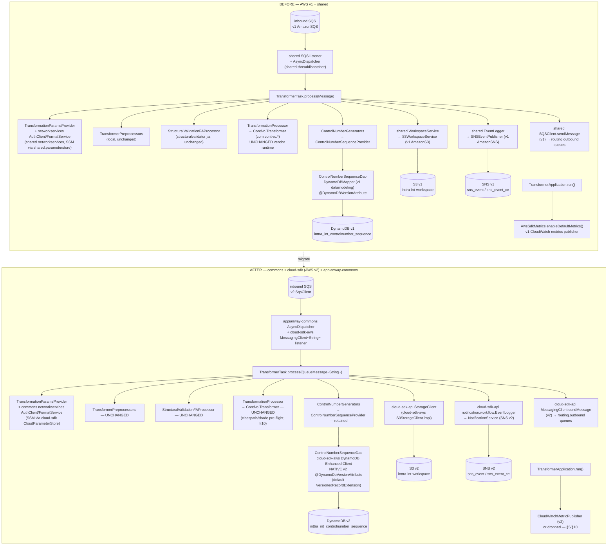

# `transformer` — AWS SDK v2 (cloud-sdk) Upgrade Design

> Module: `com.inttra.mercury.appian-way:transformer:1.0` · Path: `transformer/` · Date: 2026-07-22 · Author: Claude (Opus 4.8)
> Follows the program-wide **[Foundation Brief](../../2026-07-22-appianway-awsupgrade-foundation-claude.md)** (§2/§3/§4/§5/§5A/§6/§7/§8) and its per-module template (§7). Baseline: **Dropwizard 5.0.2 / Jetty 12.1.9 / Java 17 / Jackson 2.21.4** (ION-16098, done, `develop`). This doc = **AWS v1 → v2 + drop-`shared`** only. Target line: `mercury-services-commons` **`1.0.27-SNAPSHOT`**.
> INT run/verification evidence for the current (pre-upgrade) baseline: **[2026-07-22-appway-app-checkouts-run-config.md](../../2026-07-22-appway-app-checkouts-run-config.md) §4.9** — all 3 profiles ✅ verified. Prior per-module design: **[2026-05-31-transformer-aws2x-upgrade-DESIGN-claude.md](2026-05-31-transformer-aws2x-upgrade-DESIGN-claude.md)** + **[plan](2026-05-31-transformer-aws2x-upgrade-plan-claude.md)** — this doc supersedes/updates them with the locked 2026-07-22 decisions (`shared`→`commons`/`cloud-sdk`, `appianway-commons`, `1.0.27-SNAPSHOT`).

---

## 1. Overview

**Purpose.** transformer is the ETL hub of appianway: it consumes canonical XML (containers, schedules, bookings) off SQS, runs it through the **Contivo** XSLT/Java mapping engine to produce carrier/customer-format output, allocates EDI **control numbers** from a DynamoDB sequence, structurally validates the output (via `structuralvalidator`), writes the transformed file to S3, republishes an `Event` to SNS, and routes the enriched `MetaData` envelope onward via SQS per a configurable `routing` map. One jar runs as **three** independent profiles (`transformer` / `ce-transformer` / `os-transformer`) that differ only by pickup queue (and ce's SNS topic); routing is shared across all three.

**Current state (DW5 baseline).** AWS v1 SDK (`aws-java-sdk-sqs`, `-dynamodb`, `-cloudwatchmetrics`; S3/SNS transitively via `shared`) + the appianway `shared` module (`ConfigProcessingServerCommand`, `SQSListener`/`AsyncDispatcher`, `S3WorkspaceService`, `SNSEventPublisher`, `MetaData`/`Event`/`EventLogger`, `networkservices.AuthClient`, `HealthCheckRegistrar` + indicators). `DynamoDBMapper` (v1 datamodeling) backs the control-number sequence with `@DynamoDBVersionAttribute` optimistic locking. `AwsSdkMetrics.enableDefaultMetrics()` (v1 CloudWatch SDK metrics) runs at boot. All 3 profiles verified green against INT on the DW5/Jetty12 baseline (see §4.9 of the run-config doc).

**Target state.** `commons` (config command, network-services, health base) + `cloud-sdk-api`/`cloud-sdk-aws` (SQS/SNS/S3 clients, workflow model) + slim `appianway-commons` (`AsyncDispatcher`/`AbstractTask`, `ErrorHandler`/`RecoverableException`, health-indicator glue) — per the Foundation Brief §2/§3. AWS SDK v1 removed entirely; DynamoDB moves to the **native v2 enhanced client**.

**Headline change (this module is the most complex of the 14):**
1. **DynamoDB control-number sequence** (`ControlNumberSequence` / `ControlNumberSequenceDao` / `ControlNumberSequenceProvider`) rewritten onto the **AWS SDK v2 DynamoDB Enhanced Client**, keeping optimistic locking via the **native** `software.amazon.awssdk.enhanced.dynamodb.extensions.annotations.@DynamoDbVersionAttribute` (the default `VersionedRecordExtension` applies automatically — **NOT a cloud-sdk change**, de-scopes G4). `DynamoTableCommand` (the `create-table` CLI verb) is rewritten onto the v2 `DynamoDbClient`.
2. **Contivo XSLT/Java runtime** is a large, self-contained vendor classpath (`com.contivo:*`, Scala/Akka/RocksDB/MapDB/Saxon/BCEL/ANTLR/…) that must be pre-flight-verified to coexist with the AWS SDK v2 + Dropwizard 5/Jetty 12 shaded fat jar — flagged as a §10 risk, not a code change.
3. **`AwsSdkMetrics.enableDefaultMetrics()`** (v1-only API, `TransformerApplication.run()`) has no v2 equivalent as a drop-in call — replaced by an explicit `CloudWatchMetricPublisher` wiring (or dropped), called out as a config/observability change.
4. **Three profiles, one jar** (`transformer` / `ce-transformer` / `os-transformer`) — pickup queue and, for `ce-transformer`, the SNS topic differ; the `routing` map (10 dynamically-derived outbound health checks) and all other AWS touchpoints are identical across profiles.

---

## 2. Current vs Target architecture



### 2.1 Class/type-level mapping (verified against current source)

| Current (`com.inttra.mercury.shared.*` / AWS v1) | Replacement | Home |
|---|---|---|
| `shared.command.ConfigProcessingServerCommand` (used by `TransformerApplication.initialize`, `DynamoTableCommand`) | `com.inttra.mercury.config.ConfigProcessingServerCommand` + composed appianway property-substitution transform | commons + appianway-commons (§5) |
| `shared.config.S3ConfigurationProvider` | kept appianway-local (conditional on `CONFIG_LOCATION=s3`) | appianway-commons/module |
| `shared.config.NetworkServiceConfig`, `shared.config.BaseConfiguration` | commons/cloud-sdk equivalents (`NetworkServiceConfig` from commons networkservices, module `BaseConfiguration` residue) | commons |
| `shared.config.AWSClientConfiguration` (`sqs_listener`, `sqs_sender`, `s3_read_put_copy`, `sns_publish` v1 `ClientConfiguration`s, used in `ExternalServicesModule`) | cloud-sdk-aws client config types (`AwsMessagingClientConfig`, `CloudStorageConfig`, `NotificationClientConfig`) | cloud-sdk-aws |
| `shared.threaddispatcher.AsyncDispatcher`, `Dispatcher`, `TaskFactory` (`TransformerModule.configure`) | **appianway-commons** `AsyncDispatcher`/`AbstractTask`/task lifecycle (unchanged semantics) | appianway-commons |
| `shared.listener.SQSListener`, `shared.listener.support.ListenerManager` | cloud-sdk-api `messaging.Listener`/`SqsListener` **or** retained `AsyncDispatcher` wiring (appianway keeps its own listener glue) | cloud-sdk-api + appianway-commons |
| `shared.messaging.SQSListenerClient`, `shared.messaging.SQSClient` (`TransformerTask.sqsClient.sendMessage`) | cloud-sdk-api `MessagingClient<String>` (`QueueMessage<String>` envelope) | cloud-sdk-api / cloud-sdk-aws SQS impl |
| `shared.messaging.SNSClient`, `shared.event.SNSEventPublisher` (`TransformerModule.createPublisher`) | cloud-sdk-api `NotificationService` / `notification.workflow.EventPublisher` | cloud-sdk-api |
| `shared.workspace.WorkspaceService`, `shared.workspace.S3WorkspaceService` (`TransformerModule` bind, `TransformerTask.workspaceService.putObject`) | cloud-sdk-api `StorageClient` (`putObject(bucket,key,bytes[,metadata,contentType])`) | cloud-sdk-api / cloud-sdk-aws S3 impl |
| `shared.task.MetaData`, `shared.event.EventGenerator`, `shared.event.EventLogger`, `shared.event.RandomGenerator` (`TransformerTask`) | cloud-sdk-api `notification.workflow.{MetaData,EventGenerator,EventLogger,RandomGenerator}` | cloud-sdk-api (**W-G9** applies — §6) |
| `shared.externalwrapper.exception.RecoverableException` (`TransformerTask.process` signature) | **appianway-commons** `RecoverableException` | appianway-commons |
| `shared.networkservices.auth.AuthClient`, `.format.CacheFormatService`/`FormatService`, `.integrationprofile*.*` (`ExternalServicesModule`) | `commons` `com.inttra.mercury.networkservices.*` + `client.AuthClient` | commons |
| `shared.parameterstore.ParameterStoreModule` (`ExternalServicesModule.install`) | commons/cloud-sdk `CloudParameterStore`/`ParameterStoreLookup` wiring | commons / cloud-sdk-aws |
| `shared.healthcheck.HealthCheckRegistrar` + indicators `InboundSqsHealthCheck`, `OutboundSqsHealthCheck`, `S3WriteHealthCheck`, `SnsPublishHealthCheck`, `HttpGetHealthCheck`, `ErrorThresholdHealthCheck` (`TransformerApplication.registerHealthChecks`) | commons `health.*` base + **appianway-commons** indicator wrappers re-pointed to injected cloud-sdk clients | commons + appianway-commons |
| `com.amazonaws.services.dynamodbv2.datamodeling.DynamoDBMapper`/`DynamoDBMapperConfig` (`ControlNumberSequenceDao`, `ExternalServicesModule`) | cloud-sdk-aws **DynamoDB Enhanced Client** (`DynamoDbEnhancedClient` + `DynamoDbTable<ControlNumberSequence>`) via `DynamoRepositoryConfig`/`DynamoRepositoryFactory` | cloud-sdk-aws |
| `@DynamoDBHashKey`, `@DynamoDBAttribute`, `@DynamoDBIgnore`, `@DynamoDBVersionAttribute` (v1, `ControlNumberSequence`) | v2 enhanced-client bean annotations `@DynamoDbPartitionKey`, `@DynamoDbAttribute`, `@DynamoDbIgnore` + **native** `@DynamoDbVersionAttribute` (`software.amazon.awssdk.enhanced.dynamodb.extensions.annotations`) | AWS SDK v2 (native, no cloud-sdk change) |
| `com.amazonaws.services.dynamodbv2.model.ConditionalCheckFailedException` (`ControlNumberSequenceProvider.nextLowerBound` catch) | v2 `software.amazon.awssdk.services.dynamodb.model.ConditionalCheckFailedException` | AWS SDK v2 |
| `AmazonDynamoDB`/`AmazonDynamoDBClientBuilder` (`DynamoTableCommand`, `ExternalServicesModule`) | v2 `DynamoDbClient`/`DynamoDbClientBuilder` (+ `DynamoDbEnhancedClient` wrapping it) | AWS SDK v2 |
| `com.amazonaws.services.dynamodbv2.util.TableUtils.waitUntilActive` (`DynamoTableCommand`) | v2 `DynamoDbWaiter.waitUntilTableExists(...)` | AWS SDK v2 |
| `com.amazonaws.metrics.AwsSdkMetrics` (`TransformerApplication.run`) | v2 `CloudWatchMetricPublisher` (attached per-client via `MetricPublisher`) **or dropped** — §5/§10 | AWS SDK v2 |
| `com.contivo.mixedruntime.runtime.wrapper.Transformer`, `TransformerResults`, `TransformSpecification` (`TransformationProcessor`) | **UNCHANGED** — vendor Contivo runtime, not part of this program | module (Contivo jars) |
| `structuralvalidator` jar (`StructuralValidationFAProcessor`) | **UNCHANGED** — separate module, own doc | module dependency |

---

## 3. AWS touchpoints

| Touchpoint | Direction | INT resource | Profile variance | Current client | Target client |
|---|---|---|---|---|---|
| SQS pickup | inbound (consume) | `inttra_int_sqs_transformer_inbound` (transformer) / `inttra_int_sqs_transformer_ce` (ce-transformer) / `inttra_int_sqs_transformer_os_inbound` (os-transformer) | **per-profile** | v1 `AmazonSQS` via `shared.SQSListener` | cloud-sdk-api `MessagingClient<String>` listener (`QueueMessage<String>`) |
| SQS routing (10 dynamic outbound checks) | outbound (produce/route) | see §5.2 table — `ce_validate`, `os_inbound`(schedules), `bk_inbound`, `subscription_errors`, `file_delivery`, `rest_delivery` | common (all 3 profiles share the `routing` block) | v1 `AmazonSQS` via `shared.SQSClient.sendMessage` | cloud-sdk-api `MessagingClient<String>.sendMessage` |
| SNS event publish | outbound (produce) | `arn:aws:sns:...:inttra_int_sns_event` (transformer, os-transformer) / `inttra_int_sns_event_ce` (ce-transformer) | **per-profile** (ce only) | v1 `AmazonSNS` via `shared.SNSEventPublisher` | cloud-sdk-api `NotificationService` |
| S3 workspace write | write | `inttra-int-workspace` (transformed output) | common | v1 `AmazonS3` via `shared.S3WorkspaceService` | cloud-sdk-api `StorageClient` (S-G2 if metadata/content-type is added — not currently used by `TransformerTask.transform`, plain `putObject(bucket,key,bytes)`) |
| DynamoDB control-number sequence | read+write (optimistic lock) | `inttra_int_controlnumber_sequence` | common | v1 `DynamoDBMapper` | cloud-sdk-aws DynamoDB Enhanced Client, native `@DynamoDbVersionAttribute` |
| SES | — | none | — | — | — |
| Param Store (SSM) | boot-time auth | `/inttra/int/appianway/networkservices/{authclientid,authclientsecret}` (`usePassThrough=false`) | common | commons/`shared` `AuthClient` resolves at runtime | commons `client.AuthClient` + `CloudParameterStore` (unchanged resolution mechanism) |
| gRPC | — | none (transformer has no watermill dependency) | — | — | — |
| Network-services HTTP | auth + format/integration-profile lookups | `https://api-alpha.inttra.com/{auth,network/services/ping,network/participant/integrationProfile,...}` | common | `shared.networkservices.*` | commons `com.inttra.mercury.networkservices.*` |

---

## 4. Sequence diagram — consume → transform (Contivo) → sequence (DynamoDB) → route

```mermaid
sequenceDiagram
    participant SQS as inbound SQS (v2)
    participant LIS as AsyncDispatcher (appianway-commons)
    participant TASK as TransformerTask
    participant NS as networkservices AuthClient/FormatService (commons)
    participant PRE as TransformerPreprocessors
    participant SV as StructuralValidationFAProcessor
    participant CTV as Contivo TransformationProcessor
    participant SEQ as ControlNumberSequenceProvider
    participant DAO as ControlNumberSequenceDao (Enhanced Client)
    participant DDB as DynamoDB v2
    participant S3 as StorageClient (cloud-sdk)
    participant SNS as NotificationService (cloud-sdk)
    participant OUT as MessagingClient (cloud-sdk)

    SQS->>LIS: poll QueueMessage<String>
    LIS->>TASK: process(message)
    TASK->>TASK: MetaData.fromJson(message.body)
    TASK->>NS: paramsProvider.get(metaData)\n(integrationProfile/format lookups; SSM-resolved auth)
    NS-->>TASK: TransformationParams (contextConfig, transformName, ...)
    TASK->>PRE: preprocessors.execute(params, configuration)
    PRE-->>TASK: sanitized params
    TASK->>SV: structuralValidationAndFA(metaData, params)
    alt structural validation OK
        TASK->>CTV: transformToBytes(transformName, sources)
        Note over CTV: transformer.addSource(...) / toTargetBytes()\nUNCHANGED vendor runtime
        CTV-->>TASK: transformed bytes
        opt control-number generator invoked during transform
            TASK->>SEQ: nextSequenceId()
            SEQ->>DAO: findAllWithReadConsistency() [if block exhausted]
            DAO->>DDB: GetItem/Scan (ConsistentRead=true)
            DDB-->>DAO: ControlNumberSequence{id, version}
            SEQ->>SEQ: id += 1000, upperBound recomputed
            SEQ->>DAO: save(sequence)
            DAO->>DDB: PutItem (ConditionExpression version=v; native VersionedRecordExtension)
            alt version matched
                DDB-->>DAO: OK
            else concurrent writer won
                DDB-->>DAO: ConditionalCheckFailedException (v2)
                DAO-->>SEQ: retry (< MAX_RETRIES)
            end
        end
        TASK->>S3: putObject(bucket, outFileName, transformedBytes)
        S3-->>TASK: OK
        TASK->>TASK: updateMetaData (exitStatus=SUCCESS, projections)
        TASK->>OUT: sendMessage(targetSqsUrl, newMetaData.toJsonString())
        Note over OUT: targetSqsUrl = routing.outbound[contextCode].successQueue\nor .distributorRestQueue if MetaData.Projection.DISTRIBUTOR_REST
        TASK->>SNS: eventLogger.logCloseRunEvent(metaData, ..., success=true)
    else structural validation fails
        TASK->>TASK: transformerErrorHandler.handleException(...)
        TASK->>OUT: sendMessage(errorQueue, ...) [via error handler]
        TASK->>SNS: eventLogger.logCloseRunEvent(..., success=false)
    end
```

---

## 5. Configuration changes (§4.3 checklist, explicit)

### 5.1 Property keys referenced by `transformer.yaml` — INT values, all 3 profiles

| Property key | transformer.properties | ce-transformer.properties | os-transformer.properties | Notes |
|---|---|---|---|---|
| `componentName` | `transformer` | `ce-transformer` | `os-transformer` | feeds `AwsSdkMetrics` namespace today (§5.4); unchanged key |
| `transformer.pickupSqsConfig.queueUrl` | `.../inttra_int_sqs_transformer_inbound` | `.../inttra_int_sqs_transformer_ce` | `.../inttra_int_sqs_transformer_os_inbound` | **differs per profile** — the only inbound-queue variance |
| `transformer.pickupSqsConfig.waitTimeSeconds` | `${...:-20}` (yaml default) | same | same | unchanged |
| `transformer.pickupSqsConfig.maxNumberOfMessages` | `1` | `10` | `1` | per-profile throughput tuning; unchanged |
| `transformer.snsEventConfig.topicArn` | `arn:aws:sns:...:inttra_int_sns_event` | `arn:aws:sns:...:inttra_int_sns_event_ce` | `arn:aws:sns:...:inttra_int_sns_event` | **ce differs**; transformer/os-transformer share the main topic |
| `transformer.sqsValidatorConfig.queueUrl` | `.../inttra_int_sqs_ce_validate` | same | same | routing.inbound `publishContainerEvent.successQueue` |
| `transformer.sqsErrorSubscriptionConfig.queueUrl` | `.../inttra_int_sqs_subscription_errors` | same | same | shared error queue across appianway |
| `transformer.fileDeliverySqsUrl` | `.../inttra_int_sqs_file_delivery` | same | same | routing.outbound successQueue for most contexts |
| `transformer.restDeliverySqsUrl` | `.../inttra_int_sqs_rest_delivery` | same | same | routing.outbound `distributorRestQueue` for `requestBooking`/`confirmBooking` — **NOT health-probed** (§5.2) |
| `transformer.s3WorkspaceConfig.bucket` | `inttra-int-workspace` | same | same | S3 write target |
| `transformer.dynamoDbSequenceTable` | `inttra_int_controlnumber_sequence` | same | same | **DynamoDB table name — headline change, §6** |
| `transformer.booking.inbound.queueUrl` | `.../inttra_int_sqs_bk_inbound` | same | same | routing.inbound `requestBooking`/`confirmBooking` success+error queue |
| `transformer.schedules.inbound.queueUrl` | `.../inttra_int_sqs_os_inbound` | same | same | routing.inbound `publishSchedule.successQueue` |
| `transformer.preprocessorConfig.enable` | `true` | same | same | unchanged |
| `transformer.preprocessorConfig.directionCode` | `outbound` | same | same | unchanged |
| `transformer.preprocessorConfig.envelopeCode` | `X12` | same | same | unchanged |
| `environment` | `int` | same | same | feeds `AwsSdkMetrics` namespace today (`AWSSDK_int_<componentName>`) |
| `server.connector.port` | `${server.connector.port:-8081}` (yaml default, not in `.properties`) | same | same | port **8081** for all 3 profiles |

> **`routing` block (yaml, identical across all 3 profiles):** `inbound.{publishContainerEvent, publishSchedule, requestBooking, confirmBooking}` and `outbound.{publishContainerEvent, publishSchedule, requestBooking, confirmBooking, messageFA}`, each with `successQueue`/`errorQueue` (+ `distributorRestQueue` on the two booking outbound entries). `TransformerApplication.registerHealthChecks` walks `routing.getInbound().values()` + `routing.getOutbound().values()` and adds a distinct `OutboundSqsHealthCheck` for every `successQueue`/`errorQueue` it finds — **10 distinct queues** across the union (`ce_validate`, `subscription_errors`, `os_inbound`/schedules, `bk_inbound` ×2 roles, `file_delivery`, plus dedupe of repeats) per the verified INT run (run-config §4.9: 10 ops checks). This loop reads only the `ContextConfig.successQueue`/`errorQueue` getters — it **does not** call `getDistributorRestQueue()`, so **`rest_delivery` is never health-probed**, matching the verified caveat in run-config §4.9(2). This traversal logic is unchanged by the AWS v2 migration; only the underlying `MessagingClient`/health-check implementation changes.

### 5.2 Outbound-SQS health-check targets (dynamically derived from `routing`, all 3 profiles identical)

| Contributor | successQueue | errorQueue | Health-probed? |
|---|---|---|---|
| `inbound.publishContainerEvent` | `inttra_int_sqs_ce_validate` | `inttra_int_sqs_subscription_errors` | ✅ both |
| `inbound.publishSchedule` | `inttra_int_sqs_os_inbound` | `inttra_int_sqs_subscription_errors` | ✅ both |
| `inbound.requestBooking` / `confirmBooking` | `inttra_int_sqs_bk_inbound` | `inttra_int_sqs_bk_inbound` | ✅ (same queue both roles) |
| `outbound.publishContainerEvent` / `publishSchedule` / `messageFA` | `inttra_int_sqs_file_delivery` | `inttra_int_sqs_subscription_errors` | ✅ both |
| `outbound.requestBooking` / `confirmBooking` | `inttra_int_sqs_file_delivery` | `inttra_int_sqs_subscription_errors` | ✅ both (successQueue), **distributorRestQueue `inttra_int_sqs_rest_delivery` is a separate field, not probed** |

### 5.3 SSM parameters

| SSM path | Resolved by | Mechanism | Change? |
|---|---|---|---|
| `/inttra/int/appianway/networkservices/authclientid` | `networkServiceConfig.clientId` (`usePassThrough=false`) | runtime `AuthClient` call at boot (SSM via `ParameterStoreModule`/`CloudParameterStore`) | **kept as runtime resolution** (commons `client.AuthClient` + `CloudParameterStore`), not moved to boot-time `${awsps:/path}` — matches every other profile's proven INT behavior (run-config §4.9: `AuthClient GET /auth succeeded`) |
| `/inttra/int/appianway/networkservices/authclientsecret` | `networkServiceConfig.clientSecret` | same | same |

`networkservices.usePassThrough=false` in `configuration/int/network-services.properties` is unchanged; no `PassThroughParameterSupplier` behavior change.

### 5.4 Config-command composition

Per Foundation §4.2: `appianway property-substitution transform → commons TrimConfigCommentsTransform → commons ParameterStoreConfigTransform`. transformer's `TransformerApplication.initialize` registers `ConfigProcessingServerCommand` (now the commons type, composed) as the `run` verb, and separately registers `DynamoTableCommand` — also rewritten to extend the commons `ConfigProcessingServerCommand` — as the `create-table` verb. `S3ConfigurationProvider.requiresS3Configuration()` gating is unchanged (appianway-commons residue).

### 5.5 Run profiles — CLI shape unchanged

```
run transformer.yaml conf/int/transformer.properties        ../configuration/int/network-services.properties ../configuration/int/datadog.properties
run transformer.yaml conf/int/ce-transformer.properties      ../configuration/int/network-services.properties ../configuration/int/datadog.properties
run transformer.yaml conf/int/os-transformer.properties      ../configuration/int/network-services.properties ../configuration/int/datadog.properties
```
Same jar/main class/yaml for all 3; only the first properties file swaps. `CONFIG_REGION`, `datadog.properties`, and the S3-config-provider opt-in are all unchanged.

### 5.6 `AwsSdkMetrics.enableDefaultMetrics()` — explicit config/observability change

Today `TransformerApplication.run()` calls (v1-only API):
```java
AwsSdkMetrics.enableDefaultMetrics();
AwsSdkMetrics.setMetricNameSpace("AWSSDK_" + configuration.getEnvironment() + "_" + configuration.getComponentName());
```
This starts a background CloudWatch metrics publisher (namespace `AWSSDK_int_transformer` / `AWSSDK_int_ce-transformer` / `AWSSDK_int_os-transformer`) with **no** app-level error on boot (confirmed in run-config §4.9). AWS SDK v2 has **no equivalent global toggle** — v2 metrics are per-client, opted in via a `MetricPublisher` (e.g. `CloudWatchMetricPublisher.builder().namespace(...).build()`) attached to each client's `overrideConfiguration().addMetricPublisher(...)`. Two options, both explicit — **pick one before cutover, do not silently drop observability**:
1. **Replace** — instantiate one `CloudWatchMetricPublisher` per profile (namespace derived the same way, `AWSSDK_<environment>_<componentName>`) and attach it to every v2 client built in `ExternalServicesModule` (SQS/SNS/S3/DynamoDB). Closest behavioral parity.
2. **Drop** — remove the call entirely if this metrics stream isn't consumed downstream (verify with the ops/observability owner before removing since it emits a real CloudWatch namespace today).
Either way this is a **named decision**, not silently absorbed into "AWS v2 client rebind" — see §10.

### 5.7 What is unchanged

CLI arg shape (`run <yaml> <props...>`), `CONFIG_REGION=US_EAST_1`, `datadog.properties`, `formatConfig`/`envelopeCodeRules`/`preprocessorConfig` yaml blocks, Contivo `lib/maps` runtime classpath (`-Dcontivo.runtime.classpath=lib/maps`), queue/topic/bucket/SSM-path names (no renames).

---

## 6. cloud-sdk / commons dependencies & assumed gaps

| ID | Applies to transformer? | Detail |
|---|---|---|
| **S-G2** (`StorageClient.putObject(...,metadata,contentType)`) | **Referenced, not currently exercised** | `TransformerTask.transform()` calls `workspaceService.putObject(bucket, params.getOutFileName(), transformed)` — a plain 3-arg put, no metadata/content-type today. Migrates to the plain cloud-sdk `StorageClient.putObject(bucket,key,bytes)` overload; S-G2 is available if a content-type/metadata need emerges later, not required for parity. |
| **W-G9** (workflow-model parity: `Event.Builder.setAnnotations`, `MetaData.Projection`/`Event.Token` constant parity) | **REQUIRED — transformer is a heavy consumer** | `TransformerTask` reads/writes `MetaData.Projection.DISTRIBUTOR_REST`, `.ORIGINAL_IB_WORKSPACE_FILE`, `.CANONICAL_JSON`, `.UNSTREAMED_REQUESTED` and calls `eventLogger.logCloseRunEvent(metaData, null, runId, ..., tokenMap)` with `EventGenerator.{TIME_TAKEN_FOR_STRUCTURAL_VALIDATION, TIME_TAKEN_FOR_TRANSFORMATION, DROP_OFF_QUEUE, PICK_UP_QUEUE, TRANSFORMATION_SUPPLEMENT_TOKEN}` tokens — several of these are in the **6 missing `Projection`** / **8 missing `Token`** constant sets flagged in Foundation §5A (`DISTRIBUTOR_REST`, `ORIGINAL_IB_WORKSPACE_FILE` are explicitly named as gaps there). transformer will not compile against cloud-sdk-api until W-G9.2 constant parity lands. The `Event.Builder.setAnnotations` round-trip fix (W-G9.1) matters here because transformer both consumes `MetaData`/`Event` from splitter and republishes an `Event` per run. |
| **X-G7** / **X-G8** | Not applicable | transformer has no email or Elasticsearch/Jest touchpoint. |
| **C-G6** (`getConfigTransformer` visibility) | Optional convenience | transformer composes the appianway property-substitution transform in front of the commons transforms exactly as described in Foundation §4.2 — works whether or not C-G6 lands. |
| **DynamoDB optimistic lock** | **De-scoped from cloud-sdk — NOT a cloud-sdk change** | Per Foundation §5 footnote and §2 of this doc: use the **native** v2 `@DynamoDbVersionAttribute` — the default enhanced-client `VersionedRecordExtension` already provides it. No `cloud-sdk-api`/`cloud-sdk-aws` addition required for this module's headline change. |

**Consumed from commons:** `ConfigProcessingServerCommand`, `com.inttra.mercury.networkservices.*` (+ `client.AuthClient`), health base classes, `InttraServer`.
**Consumed from cloud-sdk-api/cloud-sdk-aws:** `MessagingClient<String>` (SQS in/out), `NotificationService` (SNS), `StorageClient` (S3), `notification.workflow.{MetaData,Event,EventGenerator,EventLogger,EventPublisher,RandomGenerator}`, `notification.annotation.{Annotations,Annotation,ErrorHelper}`, DynamoDB Enhanced Client wiring (`DynamoRepositoryConfig`/`DynamoRepositoryFactory` if transformer adopts the cloud-sdk-aws convenience wrapper, or a raw `DynamoDbEnhancedClient` built directly — either is acceptable since the version-attribute behavior is native, not cloud-sdk-provided).
**Moves to appianway-commons:** `AsyncDispatcher`/`AbstractTask`/`TaskFactory`, `RecoverableException`/`TransformerErrorHandler`'s base error-handling plumbing, health-indicator wrappers (`InboundSqsHealthCheck`, `OutboundSqsHealthCheck`, `S3WriteHealthCheck`, `SnsPublishHealthCheck`, `HttpGetHealthCheck`, `ErrorThresholdHealthCheck`) re-pointed to injected cloud-sdk clients.

---

## 7. Maven dependency changes

Pin `mercury-services-commons` line at **`1.0.27-SNAPSHOT`** (root `dependencyManagement`, inherited by `transformer/pom.xml`'s parent `appian-way`).

**Remove from [`transformer/pom.xml`](../pom.xml):**
- `com.inttra.mercury.shared:mercury-shared` (lines 67–72).
- `com.amazonaws:aws-java-sdk-cloudwatchmetrics` (100–104) — superseded by the v2 metrics decision in §5.6.
- `com.amazonaws:aws-java-sdk-sqs` (105–109).
- `com.amazonaws:aws-java-sdk-dynamodb` (110–114).
- `com.amazonaws:aws-java-sdk-bom` import in `<dependencyManagement>` (43–53) once nothing in the module references v1 (transformer's own pom has no `aws-java-sdk-s3`/`-sns` — those arrived transitively via `shared`, which is being removed).

**Add:**
- `com.inttra.mercury:cloud-sdk-api:1.0.27-SNAPSHOT`
- `com.inttra.mercury:cloud-sdk-aws:1.0.27-SNAPSHOT`
- `com.inttra.mercury:commons:1.0.27-SNAPSHOT`
- `com.inttra.mercury:appianway-commons:1.0-SNAPSHOT`
- AWS SDK v2 (`dynamodb-enhanced`, `sqs`, `s3`, `sns`, `ssm`) arrives transitively via `cloud-sdk-aws`'s BOM management — **do not** declare v2 artifacts directly.

**Unchanged / module-specific, keep exactly as-is:**
- All `com.contivo:*` dependencies (167–349: `commons`, `commons-codec`, `Lang`, `Runtime`, `akka-actor`, `antlr-runtime`, `bcel`, `config`, `functionaljava`, `json-simple`, `mapdb`, `scala-library`, `xpp3`, `kotlin-stdlib`, `eclipse-collections*`, `elsa`, `lz4`, `ffd-parser-libs`, `Analyst`, `AnalystServices`, `AnalystUtil`, `Core`, `metrics-core`, `rocksdbjni`, `data-processing`, `saxon-pe-9.2_noservice`, `commons-io`, plus the `javax.xml.bind`/`jakarta.xml.bind`/`jaxb-core`/`jaxb-impl` pins) and the `contivo-dep` file repository (`contivo-lib/`, lines 18–33). None of these interact with AWS SDK v1/v2 — verify only via the shade/classpath pre-flight (§10), not a dependency change.
- `com.inttra.mercury.structuralvalidator:structuralvalidator` (55–66) — separate module, own upgrade doc; excludes `mockito-core` transitively, unaffected by this change.
- `com.inttra.mercury.test:functional-testing` (159–164, test scope) — migrates alongside its own module per Foundation §8 rollout order; transformer just consumes the updated fakes.
- `io.dropwizard:dropwizard-core`, `dropwizard-metrics-annotation`, Guice, Lombok, JUnit 5 Jupiter (already the local convention — no Vintage bridge needed), Mockito, AssertJ, slf4j/logback — all DW5-baseline, unaffected.
- `maven-shade-plugin` main-class transformer config (unchanged: `com.inttra.mercury.transformer.TransformerApplication`); `maven-surefire-plugin`'s `-Dcontivo.runtime.classpath=lib/maps` argLine (unchanged).

**Verify:**
- `mvn -pl transformer -am clean verify` green (shade plugin needs `clean` — stale fat jars otherwise, per Foundation §6).
- Fat-jar boot for **all 3 profiles** + `GET /admin/opsHealthcheck` green against INT (10 checks per profile, reusing the exact procedure verified pre-upgrade in run-config §4.9).

---

## 8. Tests

- **JUnit 5 (Jupiter)** — transformer's pom already dropped explicit Jupiter versions in favor of the Dropwizard 5.0.2 junit-bom (5.14.4); no Vintage bridge needed. Continue this convention for all new/changed tests.
- **DynamoDB control-number tests (new/rewritten):**
  - Optimistic-lock **version-conflict**: two concurrent writers on the same `keyId="SequenceId"` item; assert one throws v2 `ConditionalCheckFailedException` and `ControlNumberSequenceProvider.nextLowerBound()` retries (bounded by `MAX_RETRIES=10`) exactly as today.
  - **Consistent-read** equivalence for `findAllWithReadConsistency()` against the v2 enhanced client's read options.
  - Field round-trip: `keyId` (partition key) / `id` / `version` map correctly with the mixed native-`@DynamoDbVersionAttribute` + cloud-sdk-api attribute annotations, mirroring the `mercury-services` booking `SequenceId` pattern.
  - Block-allocation boundary behavior of `ControlNumberSequenceProvider` (`INCREMENT_RANGE=1000`, `SEED_VALUE=100000000000L`) unchanged.
  - `DynamoTableCommand`'s `create-table` verb against a local/test DynamoDB (or DynamoDB Local) — assert v2 `CreateTableRequest`/`waitUntilTableExists` succeeds with the same key schema (`keyId` HASH, `S` type) and provisioned throughput (10 RCU/10 WCU).
- **Workflow-model round-trip (W-G9 verification gate, per Foundation §5A):** representative production `MetaData`/`Event` JSON (transformer both consumes and republishes these) run through `parseJson → toJsonString`, asserting byte-stability and that `Annotations`/the newly-required `Projection`/`Token` constants survive — this gates transformer specifically because it reads `MetaData.Projection.DISTRIBUTOR_REST` off the wire and must not silently lose it.
- **Contivo transformation tests** — unaffected; `TransformationProcessor`/`TransformationsFlow` unit tests continue exercising the vendor `Transformer`/`TransformerResults` API directly.
- **`functional-testing` fakes** re-pointed to cloud-sdk-api interfaces (`MessagingClient`, `StorageClient`, `NotificationService`) in lockstep with the `functional-testing` module's own migration (Foundation §8 rollout order — migrates before transformer).
- **`TransformerTask` unit tests** — swap `com.amazonaws.services.sqs.model.Message` test fixtures for `QueueMessage<String>`; assert routing decisions (`getSuccessQueue`/`getErrorQueue`, the `DISTRIBUTOR_REST` projection branch) and `RecoverableException` propagation unchanged.
- **Health-check tests** — assert `registerHealthChecks` still derives exactly the same 10-queue set from `routing.inbound`/`routing.outbound` after `OutboundSqsHealthCheck` is re-pointed to the cloud-sdk client, and that `distributorRestQueue` remains unprobed (documenting the existing gap, not introducing a new one).

---

## 9. Rollout & verification

Per Foundation §8, transformer is positioned **last of the core (non-watermill) modules**, after `email-sender` and immediately before the `watermill-publisher`/consumer batch — reflecting its DynamoDB + Contivo complexity:
```
appianway-commons → functional-testing → event-writer → distributor-rest, structuralvalidator
  → splitter, ingestor → dispatcher, distributor, error-processor
  → email-sender → **transformer** → watermill-publisher → 4 watermill consumers
```
1. Confirm `appianway-commons`, `commons`/`cloud-sdk-api`/`cloud-sdk-aws` at `1.0.27-SNAPSHOT`, and `functional-testing` fakes are already migrated.
2. Rebind `ExternalServicesModule`/`TransformerModule` to cloud-sdk clients; rewrite `ControlNumberSequence`/`ControlNumberSequenceDao`/`ControlNumberSequenceProvider` onto the v2 enhanced client; rewrite `DynamoTableCommand` onto `DynamoDbClient`; resolve the `AwsSdkMetrics` decision (§5.6).
3. `mvn -pl transformer -am clean verify` green.
4. Boot **all 3 profiles** against INT (reuse run-config §4.9's exact commands, swapping only the properties file), and confirm `GET /admin/opsHealthcheck` returns 200 with the same 10-check shape for each profile.
5. Spot-check DynamoDB: run `create-table` verb (or confirm table pre-exists), then drive one message through each profile's pickup queue and confirm the control-number sequence increments without `ConditionalCheckFailedException` exhaustion.
6. Confirm Contivo transformations still produce byte-identical output for a known-good sample per profile (regression check against the pre-upgrade fat jar's output), since the Contivo classpath now shares the fat jar with AWS SDK v2 instead of v1 (§10).

---

## 10. Risks & mitigations

| Risk | Mitigation |
|---|---|
| **Contivo classpath/shade conflict with AWS SDK v2 + DW5/Jetty12** — Contivo bundles its own Scala/Akka/Kotlin/RocksDB/MapDB/Saxon/BCEL/ANTLR/eclipse-collections runtime (30+ jars) alongside two different jaxb generations (2.3.0 and 4.0.5) already coexisting in the pom; adding the AWS SDK v2 BOM's transitive set (Netty/Apache HttpClient, Jackson 2.21.4, reactive-streams) into the same shaded fat jar risks `META-INF/services` clobbering, duplicate-class shading warnings, or classloader conflicts that only surface at Contivo `Transformer` construction time | Pre-flight: `mvn -pl transformer -am clean package` and inspect shade-plugin output for `overlapping classes`/duplicate `META-INF/services` warnings before relying on grep; smoke-test one transformation per profile against the new fat jar and diff output bytes against the pre-upgrade jar; keep Contivo jars entirely untouched (no version bumps) so any regression is isolated to the AWS-layer change |
| **`AwsSdkMetrics.enableDefaultMetrics()` has no v1→v2 drop-in replacement** — silently dropping it removes a live CloudWatch metrics stream (namespace `AWSSDK_int_<componentName>`) with no compiler error to catch the loss | Explicit decision required before cutover (§5.6): either wire a v2 `CloudWatchMetricPublisher` per client with the same namespace convention, or confirm with the ops owner that the stream is unused and formally drop it — do not let it fall out silently during the `ExternalServicesModule` rebind |
| **DynamoDB optimistic-lock semantics drift** → duplicate/invalid control numbers if the native `@DynamoDbVersionAttribute` isn't recognized or the default extension list changes | Use the native v2 annotation (not a cloud-sdk-api one) exactly as `mercury-services` booking `SequenceId` does; version-conflict integration test (§8) against a real/local DynamoDB before cutover; re-point the `ConditionalCheckFailedException` catch in `ControlNumberSequenceProvider` to the v2 type |
| **W-G9 constant-set gap blocks compilation** — transformer references `MetaData.Projection.DISTRIBUTOR_REST`/`.ORIGINAL_IB_WORKSPACE_FILE` and multiple `EventGenerator` tokens not yet in cloud-sdk-api | Land W-G9 (constant parity + `Event.Builder.setAnnotations`) in cloud-sdk-api before or alongside transformer's migration; run the Foundation §5A JSON round-trip corpus test using transformer's own production `MetaData`/`Event` traffic as part of the corpus |
| **3-profile regression risk** — a fix validated only against the default `transformer` profile could miss `ce-transformer`'s different SNS topic/queue or `os-transformer`'s different pickup queue | Boot and health-check **all 3** profiles every verification pass (§9 step 4), not just the default; the `routing` block and health-check derivation are shared code so a single logic bug would surface identically across all 3 — test once, verify thrice |
| **`rest_delivery` blind spot carries forward unchanged** — `distributorRestQueue` was never health-probed pre-upgrade (confirmed run-config §4.9) and stays that way post-upgrade since the health-check loop logic is unchanged | Documented as a pre-existing gap, not introduced by this migration; if closing it is desired, it is a separate, explicitly-scoped change (add a probe for `ContextConfig.getDistributorRestQueue()`), out of scope here |
| Any cloud-sdk/commons change breaking `mercury-services` production consumers | None proposed here beyond the program-wide W-G9 (additive) and optional S-G2 (additive, not currently exercised by transformer); DynamoDB version-attribute is native SDK v2 behavior, not a cloud-sdk change — strongest possible guarantee for this module |

---

## Appendix — related docs

- Program foundation: [`2026-07-22-appianway-awsupgrade-foundation-claude.md`](../../2026-07-22-appianway-awsupgrade-foundation-claude.md)
- INT run/verification evidence (pre-upgrade baseline, §4.9): [`2026-07-22-appway-app-checkouts-run-config.md`](../../2026-07-22-appway-app-checkouts-run-config.md)
- Prior transformer design/plan (superseded by the locked 2026-07-22 decisions, retained for DynamoDB/Contivo detail): [`2026-05-31-transformer-aws2x-upgrade-DESIGN-claude.md`](2026-05-31-transformer-aws2x-upgrade-DESIGN-claude.md), [`2026-05-31-transformer-aws2x-upgrade-plan-claude.md`](2026-05-31-transformer-aws2x-upgrade-plan-claude.md)
- Consolidated cloud-sdk gap doc: [`2026-06-30-appianway-aws-upgrade-cloud-sdk-gap-DESIGN.md`](../../2026-06-30-appianway-aws-upgrade-cloud-sdk-gap-DESIGN.md)
- `shared` vs `commons` decision: [`2026-06-30-appianway-shared-vs-commons-upgrade.md`](../../2026-06-30-appianway-shared-vs-commons-upgrade.md)
- DW5/Jetty12/CVE baseline: [`2026-07-20-appway-owasp-report.md`](../../2026-07-20-appway-owasp-report.md)
