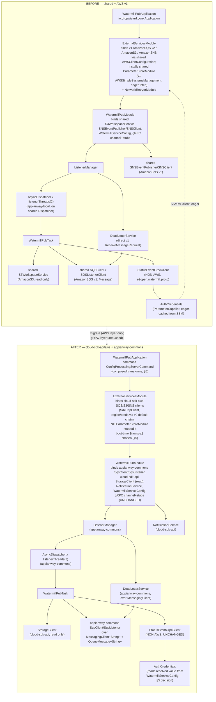
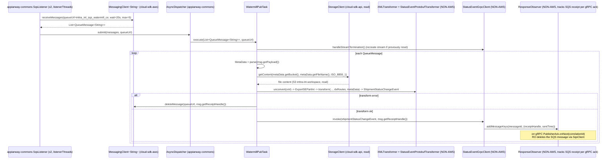
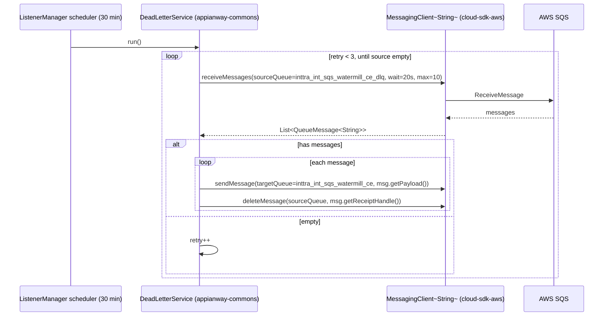
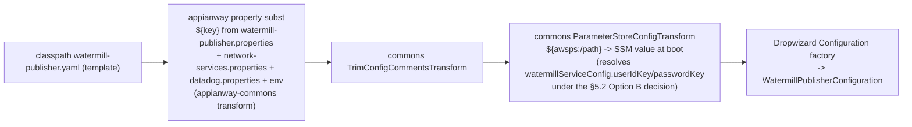

# `watermill-publisher` — AWS SDK v2 (cloud-sdk) Upgrade Design

> Module: `com.inttra.mercury.appian-way:watermill-publisher` · Date: 2026-07-22 · Author: Claude (Sonnet 4.8)
> **Supersedes/updates:** [`2026-05-31-watermill-publisher-aws2x-upgrade-DESIGN-claude.md`](2026-05-31-watermill-publisher-aws2x-upgrade-DESIGN-claude.md) + [`...-plan-claude.md`](2026-05-31-watermill-publisher-aws2x-upgrade-plan-claude.md) (those targeted `shared`-mediated `1.0.26-SNAPSHOT`; this doc targets the **retire-`shared`** model at `1.0.27-SNAPSHOT`, per the 2026-07-22 program pivot).
> **Governing docs:** [Program Foundation Brief](../../2026-07-22-appianway-awsupgrade-foundation-claude.md) (§2 mapping, §3 appianway-commons, §4 config/SSM, §5/§5A cloud-sdk gaps, §6 Maven template, §7 this template, §8 rollout) · [Local Check-outs & Run Config](../../2026-07-22-appway-app-checkouts-run-config.md) §4.10 (verified INT boot evidence, exact resource names, no health checks).
> **Baseline already in place (ION-16098, `develop`):** Dropwizard 5.0.2 / Jetty 12.1.9 / Java 17 / Jackson 2.21.4; `jaxb-runtime 4.0.4` added (runtime scope) and `plexus-utils` removed from the classpath. This doc does **not** revisit that baseline — it covers only the AWS v1→v2 rebind and the drop of `shared`.
> **Scope discipline:** the **gRPC/protobuf layer is NOT AWS** and is explicitly **out of scope** — `StatusEventGrpcClient`, `PublisherGrpc` stubs, `ResponseObserver`, `AuthCredentials`' gRPC `CallCredentials` contract, the XML→protobuf transform chain (`XMLTransformer`, `StatusEventProtobufTransformer`, the `*Map` enums), and the `watermill.staging.e2open.com:443` channel are **unchanged**. Only the **AWS-layer plumbing** feeding that gRPC client (SQS consume/send/delete, SNS publish, S3 read, SSM-sourced gRPC credentials) is rebound.

---

## 1. Overview

**Purpose:** watermill-publisher is the SE (Shipment-Status) **egress bridge** from the appianway ETL pipeline to the external Watermill/e2open gRPC service. It consumes `MetaData` envelopes off an SQS pickup queue, reads the referenced XML file from S3, transforms XML → protobuf (`ShipmentStatusChangeEvent`), and streams it to `watermill.staging.e2open.com:443` over a persistent gRPC channel authenticated with credentials sourced from SSM. A background `DeadLetterService` periodically redrives the queue's DLQ back onto the main queue.

**Current state:** AWS v1 (`aws-java-sdk-sqs` + transitive `mercury-shared` v1 S3/SNS/SSM), entirely mediated by the appianway `shared` module (`SQSListener`, `SQSClient`/`SQSListenerClient`, `S3WorkspaceService`/`WorkspaceService`, `SNSClient`/`SNSEventPublisher`, `ParameterStoreModule`/`SsmParameterSupplier`). Local concurrency (`AsyncDispatcher`/`Task`/`ListenerManager`) is appianway-owned but is layered directly on `shared`'s v1-typed `SQSListener`. Already DW5-baselined (`io.dropwizard.core.*`, `jakarta.ws.rs`) and boot-verified against INT (§4.10 of the run-config doc): gRPC streams establish, SQS polls cleanly, no ops health check exists (boot-evidence only).

**Target:** `shared` retired. AWS layer rebinds onto `mercury-services-commons 1.0.27-SNAPSHOT` — `cloud-sdk-api` (`MessagingClient<String>`/`QueueMessage<String>`, `StorageClient`, `NotificationService`, `CloudParameterStore`) + `cloud-sdk-aws` (v2 impls) + slim `appianway-commons` (the module's local `AsyncDispatcher`/`Task`/`ListenerManager`/`DeadLetterService` concurrency model, which has no commons equivalent, plus a thin `SqsClient`/`SqsListener` facade over `MessagingClient<String>`). The module's `Configuration` POJO drops `shared.BaseConfiguration` and declares its own AWS config blocks using cloud-sdk-aws config types.

**Headline change:** this module's AWS surface is small and entirely mediated through `shared` today (no direct v1 SDK calls in production code outside `ExternalServicesModule`/`Test.java`), so the rebind is mechanical — element type `com.amazonaws...Message` → `QueueMessage<String>` everywhere in the local task/dispatcher chain, `getBody()`→`getPayload()`, and the SSM gRPC-credential fetch is re-decided (§5) between runtime `CloudParameterStore` and boot-time `${awsps:/path}`. **No cloud-sdk gap is required** — watermill-publisher does not write S3 with metadata (no S-G2 exercise) and does not publish/consume `Event`/`Annotations` (no W-G9 exercise); it only round-trips `MetaData`, which is source- and wire-identical per §5A of the foundation brief.

---

## 2. Current vs. Target architecture

### 2.1 Component diagram — before / after (gRPC unchanged)



### 2.2 Class/type mapping table

| Current (`shared` / AWS v1) | Target | Home | Notes |
|---|---|---|---|
| `com.amazonaws.services.sqs.model.Message` (element type in `Task`, `AsyncDispatcher`, `WatermillPubTask`, `DeadLetterService`, `TaskFactory`) | `com.inttra.mercury.cloudsdk.messaging.QueueMessage<String>` | cloud-sdk-api | `getBody()`→`getPayload()`; `getReceiptHandle()` unchanged; attributes `Map<String,String>` |
| `shared.messaging.SQSClient` / `SQSListenerClient` | appianway-commons `SqsClient` (thin facade over `MessagingClient<String>`: `sendMessage`, `deleteMessage`, `receiveMessages(ReceiveMessageOptions)`, `getVisibilityTimeout` via `getQueueAttributes`) | appianway-commons (facade) + cloud-sdk-aws (impl) | `ResponseObserver.getVisibilityTimeout(queueName)` and `WatermillPubTask`'s `deleteMessage` both ride this facade |
| `shared.listener.SQSListener` | appianway-commons `SqsListener` (polls `MessagingClient<String>.receiveMessages`, dispatches to the local `Dispatcher`) | appianway-commons | Same poll loop shape (`waitTimeSeconds`, `maxNumberOfMessages`, `queueUrl`) — behavior-preserving |
| `shared.threaddispatcher.Dispatcher` / `AsyncDispatcher` (module-local impl) | `appianway-commons.concurrency.Dispatcher` / `AsyncDispatcher` | appianway-commons | Module's own semaphore/pool model — **retained as-is**, only its `shared` interface dependency moves home |
| `shared.workspace.WorkspaceService` / `S3WorkspaceService` | `cloud-sdk-api StorageClient` (`getContent(bucket,key,charset)` — read only, no metadata) | cloud-sdk-api / cloud-sdk-aws | This module **never writes S3 in production** (only the deleted scratch `Test.java` wrote) — **S-G2 not exercised** |
| `shared.event.SNSEventPublisher` / `SNSClient` | `cloud-sdk-api NotificationService.publish(topicArn, message)` | cloud-sdk-api / cloud-sdk-aws | Bound in `WatermillPubModule.snsEventPublisher(...)` |
| `shared.task.MetaData` + `shared.support.Json` | `com.inttra.mercury.cloudsdk.notification.workflow.MetaData` (+ its `Json`/parse helper) | cloud-sdk-api | Field-identical per foundation §5A; `metaData.getBucket()`/`getFileName()`/`getWorkflowId()`/`getProjections().get("dxRoutes")` all preserved |
| `shared.parameterstore.ParameterStoreModule` / `SsmParameterSupplier` / `ParameterSupplier` / v1 `AWSSimpleSystemsManagement` | **Decision required** (§5): `cloud-sdk-api CloudParameterStore` (runtime) **or** commons `${awsps:/path}` boot-time substitution (recommended) | cloud-sdk-api / commons | Drives whether `AuthCredentials` still injects a supplier or just reads resolved config strings |
| `shared.config.BaseConfiguration`, `SQSConfig`, `SNSConfig`, `S3Config`, `AWSClientConfiguration` | Module's own `WatermillPublisherConfiguration extends io.dropwizard.core.Configuration` + cloud-sdk-aws config types (`AwsMessagingClientConfig`, `NotificationClientConfig`, `CloudStorageConfig`) | module + cloud-sdk-aws | §5 has the exact field table |
| `shared.command.ConfigProcessingServerCommand` | `com.inttra.mercury.config.ConfigProcessingServerCommand` + composed appianway property-substitution transform | commons + appianway-commons | §5 composition chain |
| `shared.networkservices.NetworkRetryerModule` | **Dropped** — this module has **no `networkServiceConfig`** block and makes **no** `AuthClient`/network-services call (confirmed in run-config §4.10: "no `networkServiceConfig`, so no AuthClient `/auth` call") | n/a | Not carried forward; `HealthCheckConfig.networkServiceHealthCheckUrl` is config-resolved but was already dead (no health checks registered — see §6) |
| `task/Test.java` (scratch `main`: v1 `AmazonSQS`/`AmazonS3` load-generator) | **Deleted** | n/a | Not production; the only S3-write and SQS-send-with-delay code in the module lives here |
| gRPC: `StatusEventGrpcClient`, `PublisherGrpc` stubs, `ResponseObserver`, `AuthCredentials` (gRPC `CallCredentials` contract), `XMLTransformer`, `StatusEventProtobufTransformer`, `CJAXBContextFactory`, `*Map` enums | **Unchanged** | module (unchanged) | NON-AWS; already verified on `jaxb-runtime 4.0.4` post-ION-16098 |

---

## 3. AWS touchpoints (INT resource names — exact, unchanged)

| Touchpoint | Direction | INT resource | Current client (v1/`shared`) | Target client (cloud-sdk) |
|---|---|---|---|---|
| SQS pickup (inbound) | consume | `inttra_int_sqs_watermill_ce`<br>`https://sqs.us-east-1.amazonaws.com/081020446316/inttra_int_sqs_watermill_ce` | `shared.SQSListener` × `listenerThreads`(2) over `AmazonSQS` | appianway-commons `SqsListener` × 2 over `MessagingClient<String>` |
| SQS pickup DLQ (inbound, redrive source) | receive+redrive | `inttra_int_sqs_watermill_ce_dlq` (derived: `{queueUrl}_dlq`, `WatermillPubModule` L110–116) | `DeadLetterService` direct v1 `ReceiveMessageRequest` | appianway-commons `DeadLetterService` over `MessagingClient.receiveMessages(ReceiveMessageOptions)` |
| SQS pickup (outbound, same queue — ack delete) | `deleteMessage` | same as pickup | `SQSClient.deleteMessage` (v1) | `SqsClient.deleteMessage` (`MessagingClient<String>`) |
| SQS error (config-resolved only) | n/a in this module's code path | `inttra_int_sqs_subscription_errors` | `sqsErrorConfig.queueUrl` — declared in `BaseConfiguration`, **never referenced** by watermill-publisher production code (grep-confirmed) | unchanged — config-resolved, still declared for parity/future use, no functional change |
| SNS event | publish | `arn:aws:sns:us-east-1:081020446316:inttra_int_sns_event` | `SNSEventPublisher` over `shared.SNSClient` | `NotificationService.publish(topicArn, ...)` |
| S3 workspace | read only (`getContent`) | `inttra-int-workspace` (key = `metaData.getBucket()/getFileName()`, e.g. `watermillpublisher/se.xml`) | `shared.S3WorkspaceService.getContent(bucket,key,ISO_8859_1)` over `AmazonS3` | `StorageClient.getContent(bucket,key,charset)` — **no metadata, no S-G2 need** |
| DynamoDB | n/a | none — watermill-publisher has **no** offset table (that's the 4 watermill *consumers*, not the publisher) | n/a | n/a |
| SES | n/a | none | n/a | n/a |
| SSM Parameter Store (gRPC creds) | fetch at boot/runtime | `/inttra/int/appianway/watermill-grpc/se/username`<br>`/inttra/int/appianway/watermill-grpc/se/password` | `shared.SsmParameterSupplier` (eager-cached at Guice injector construction) via `ParameterStoreModule` over v1 `AWSSimpleSystemsManagement` | **decision in §5**: `CloudParameterStore` (runtime, cloud-sdk-api) **or** `${awsps:/path}` (boot-time, commons `ParameterStoreConfigTransform`) — **recommended: boot-time** |
| gRPC (NON-AWS) | bidi stream publish | `watermill.staging.e2open.com:443` (tenant `INTTRA`) | `StatusEventGrpcClient` / `PublisherGrpc` | **unchanged** |

---

## 4. Sequence diagrams

### 4.1 Pickup consume → transform → gRPC publish (main path)



**Element-type / accessor changes (module-local files):** `Task.execute`, `AsyncDispatcher.submit`, `WatermillPubTask.execute`, `TaskFactory.getTask` all change their `List<Message>` parameter to `List<QueueMessage<String>>`; `message.getBody()` → `msg.getPayload()`; `message.getReceiptHandle()` unchanged. `ResponseObserver`'s injected `SQSClient` becomes the appianway-commons `SqsClient` facade (`deleteMessage`, `getVisibilityTimeout` unchanged signatures).

### 4.2 DeadLetterService — DLQ redrive (unchanged cadence: every 30 min via `ListenerManager`, 3 empty-polls-and-stop loop)



**Redrive routing preserved exactly:** source `{queueUrl}_dlq` → target `{queueUrl}` (both derived from `sqsPickupConfig.queueUrl`, `WatermillPubModule.getDLQService`). No queue names change.

---

## 5. Configuration changes (§4.3 of the foundation brief, fully worked)

### 5.1 Property-key table — exact INT values (`conf/int/watermill-publisher.properties`, unchanged names/values unless noted)

| Property key | INT value | Consumed by (yaml path) | Change? |
|---|---|---|---|
| `componentName` | `watermill-publisher` | `componentName` | none |
| `watermill-publisher.pickupSQSConfig.queueUrl` | `https://sqs.us-east-1.amazonaws.com/081020446316/inttra_int_sqs_watermill_ce` | `sqsPickupConfig.queueUrl` | none |
| `watermill-publisher.pickupSQSConfig.waitTimeSeconds` | *(default 20, not set in properties)* | `sqsPickupConfig.waitTimeSeconds:-20` | none |
| `watermill-publisher.pickupSQSConfig.maxNumberOfMessages` | *(default 5, not set)* | `sqsPickupConfig.maxNumberOfMessages:-5` | none |
| `watermill-publisher.snsEventConfig.topicArn` | `arn:aws:sns:us-east-1:081020446316:inttra_int_sns_event` | `snsEventConfig.topicArn` | none |
| `watermill-publisher.sqsErrorSubscriptionConfig.queueUrl` | `https://sqs.us-east-1.amazonaws.com/081020446316/inttra_int_sqs_subscription_errors` | `sqsErrorConfig.queueUrl` | none (config-resolved only; unreferenced in code today — kept for parity) |
| `watermill-publisher.s3WorkspaceConfig.bucket` | `inttra-int-workspace` | `s3WorkspaceConfig.bucket` | none |
| `watermill-publisher.listenerThreads` | *(default 2, not set)* | `listenerThreads:-2` | none — **`listenerThreads: 2` preserved**, drives 2 `AsyncDispatcher`/`SqsListener` pairs |
| `watermill-publisher.healthCheckConfig.errorRateThreshold` | *(default 5.0)* | `healthCheckConfig.errorRateThreshold:-5.0` | none (vestigial — see §6/§10; no health checks are registered so this is never evaluated) |
| `networkservices.healthCheckUrl` | *(from `network-services.properties`, INT auth ping URL)* | `healthCheckConfig.networkServiceHealthCheckUrl` | none (same — vestigial, same reasoning) |
| `watermill-grpc.se.username.key` | `/inttra/int/appianway/watermill-grpc/se/username` | `watermillServiceConfig.userIdKey` | **see §5.2 — value gains `${awsps:...}` wrapper if boot-time option chosen; the SSM path itself is unchanged** |
| `watermill-grpc.se.password.key` | `/inttra/int/appianway/watermill-grpc/se/password` | `watermillServiceConfig.passwordKey` | same as above |
| `watermill-grpc.se.tenant` | `INTTRA` | `watermillServiceConfig.tenant:-INTTRA` | none |
| `watermill-grpc.se.host` | `watermill.staging.e2open.com` | `watermillServiceConfig.host` | none |
| `watermill-grpc.se.port` | `443` | `watermillServiceConfig.port:-443` | none |
| `server.connector.port` | *(default 8081, not set)* | `server.connector.port:-8081` | none |
| `metrics.frequency` | *(from properties, default 1s)* | `metrics.frequency` | none |

**No queue/topic/bucket/SSM-path renames anywhere in this table** — every AWS resource name is preserved exactly.

### 5.2 SSM parameter table — resolution mechanism decision (REQUIRED per §4.3.2 of the foundation brief)

| SSM parameter | Consumed by | Today | Option A: runtime `CloudParameterStore` | Option B: boot-time `${awsps:/path}` | **Decision** |
|---|---|---|---|---|---|
| `/inttra/int/appianway/watermill-grpc/se/username` | `AuthCredentials` (gRPC `CallCredentials`, sets the `username` gRPC metadata header on every call) | `shared.SsmParameterSupplier`, eager-fetched once at Guice injector construction (`ParameterStoreModule` installed in `ExternalServicesModule.configure()`), cached in an in-memory `Map<String,String>` for the JVM's lifetime — i.e. functionally already a **one-shot boot fetch**, just performed via Guice rather than the config command | Replace `shared.ParameterStoreModule`/`SsmParameterSupplier` 1:1 with `cloud-sdk-api CloudParameterStore` injected as a `ParameterSupplier`-shaped facade (appianway-commons); `AuthCredentials` keeps its current constructor shape (`parameterSupplier.getValue(key)`) | Wrap the property **value** (not the key, not the path) in `${awsps:...}`:<br>`watermill-grpc.se.username.key=${awsps:/inttra/int/appianway/watermill-grpc/se/username}`<br>`watermill-grpc.se.password.key=${awsps:/inttra/int/appianway/watermill-grpc/se/password}`<br>Resolved by commons' `ParameterStoreConfigTransform` **before** Dropwizard parses the YAML. `WatermillServiceConfig.userIdKey`/`passwordKey` then hold the **resolved secret value**, not the path. `AuthCredentials` reads them directly off `WatermillServiceConfig` — no `ParameterSupplier`/`CloudParameterStore` injection at all. | **Option B (boot-time)** — see rationale below |
| `/inttra/int/appianway/watermill-grpc/se/password` | same | same | same | same | same |

**Rationale for Option B:** the current behavior is already an eager, one-shot, boot-time fetch with no re-fetch/rotation logic anywhere in `AuthCredentials`/`SsmParameterSupplier` — moving to the commons `${awsps:/path}` boot-time mechanism is **behavior-preserving**, and it fully eliminates the v1 `AWSSimpleSystemsManagement` client, `shared.ParameterStoreModule`, `SsmParameterSupplier`, and `PassThroughParameterSupplier` from this module's dependency graph (one less thing to port to `appianway-commons`). It also matches how commons' own `ParameterStoreConfigTransform` already handles auth secrets for the modules that have a `networkServiceConfig` block (splitter/transformer/ingestor/distributor) — consistent mechanism across the program.
**Caveat / what changes (Java-local only, not env contract):** `WatermillServiceConfig.userIdKey`/`passwordKey` field *names* stop matching their post-resolution semantics (they'd hold the plaintext credential, not a "key"). Recommend renaming the two Java fields to `userId`/`password` (a module-internal POJO/YAML-key rename, **not** an SSM-path or queue-name rename — explicitly allowed) — or leave the field names as-is if minimizing diff is preferred; either is compile-safe. **`usePassThrough` handling:** this module never set `usePassThrough` (it's a `network-services.properties`-only knob today) — N/A here; boot-time `${awsps:}` has no pass-through equivalent needed since the property value is unconditionally wrapped.
**If Option A were chosen instead:** keep `AuthCredentials`'s current constructor shape unchanged and swap only the supplier implementation — lower diff to `AuthCredentials`, but retains an extra Guice-eager-singleton SSM round trip that boot-time resolution avoids, and requires porting `ParameterSupplier`/`SsmParameterSupplier`-equivalent code into `appianway-commons`. Recorded here as the fallback if boot-time substitution proves awkward in practice (e.g. if commons' transform ordering doesn't compose cleanly with the appianway property-substitution pass for this file).

### 5.3 Config-command composition (this module)



`WatermillPubApplication.initialize()` registers this composed command in place of `shared.command.ConfigProcessingServerCommand`, exactly as the foundation §4.2 describes. `S3ConfigurationProvider` (conditional on `CONFIG_LOCATION=s3`) stays — either the appianway-local variant or an equivalent supplied by `appianway-commons`.

### 5.4 What is unchanged

- CLI arg shape: `run watermill-publisher.yaml conf/int/watermill-publisher.properties ../configuration/int/network-services.properties ../configuration/int/datadog.properties` (`network-services.properties` still passed for consistency with `run.sh`/Dockerfile even though **no `networkServiceConfig` block exists** and no `AuthClient` call is made — same as today).
- `CONFIG_REGION=US_EAST_1` system property.
- `datadog.properties` / `metrics.frequency`.
- Port **8081**, single `simple` connector (`/application` + `/admin` share the port).
- `com.inttra.mercury` logger at **DEBUG** (yaml `logging.loggers` block) — unchanged, useful during cutover verification.
- **No health checks registered** — `WatermillPubApplication.run()` has no `registerHealthChecks`/`RegistryBuilder` call today and none is added by this migration. `/admin/opsHealthcheck` stays **404**; `/admin/healthcheck` stays default-`deadlocks`-only. Verification remains **boot-evidence** (§9), matching run-config §4.10 exactly.
- `listenerThreads: 2` and the DLQ redrive cadence (30 min, 3-empty-poll-and-stop).

---

## 6. cloud-sdk / commons dependencies & assumed gaps

| Assumed gap (foundation §5) | Exercised by watermill-publisher? | Detail |
|---|---|---|
| **S-G2** (`StorageClient` metadata-write overloads) | **No** | Production S3 access is `getContent` (read) only; the only S3 *write* was in the deleted scratch `Test.java`. Listed for family-reference only. |
| **W-G9** (`Event`/`MetaData`/`Annotations` parity) | **Partially — `MetaData` only, and it is already compatible** | This module round-trips `MetaData` (SQS body → `Json.fromJsonString`/parse) but never touches `Event`/`Annotations`/`EventLogger`. Per foundation §5A, `MetaData` fields/order/`@JsonInclude`/builder are **identical** between `shared` and cloud-sdk-api — no defect for this module's usage. `metaData.getProjections().get("dxRoutes")` (a `Map` lookup) is unaffected by the `Projection` constant-set lag (W-G9.2) since this module accesses it by raw string key, not the constant. |
| **X-G7** (email reply-to) | No | Not an email-sending module. |
| **X-G8** (Jest/OpenSearch signing) | No | Not applicable. |
| **C-G6** (widen `getConfigTransformer`) | No — optional, not required | §5.3 composition works without it. |
| **O-G1/O-G3** (reusable listener/S3-parser) | No | Module keeps its own `AsyncDispatcher`/`SqsListener` concurrency model in `appianway-commons`. |

**What this module consumes from commons/cloud-sdk:**
- `cloud-sdk-api`: `MessagingClient<String>`, `QueueMessage<String>`, `StorageClient` (read path), `NotificationService`, `MetaData`, (if Option A chosen in §5.2) `CloudParameterStore`.
- `cloud-sdk-aws`: v2 SQS/S3/SNS/SSM client impls, wired via the module's `ExternalServicesModule`.
- `commons`: `ConfigProcessingServerCommand`, `TrimConfigCommentsTransform`, `ParameterStoreConfigTransform` (Option B), Dropwizard 5/Jetty 12 alignment (already baselined).

**What moves to `appianway-commons`:** `Task`/`TaskFactory` (functional interfaces, element type updated to `QueueMessage<String>`), `AsyncDispatcher` (the concrete concurrency impl + its `Dispatcher` interface), `ListenerManager`, `DeadLetterService`, and a new thin `SqsClient`/`SqsListener` facade over `MessagingClient<String>` (replacing `shared.messaging.SQSClient`/`SQSListenerClient`/`shared.listener.SQSListener`). `WatermillPubTask`, `StatusEventGrpcClient`, `ResponseObserver`, `AuthCredentials`, `WatermillServiceConfig`, `HealthCheckConfig`, and the whole `se/transformer/*` package stay **module-local** (they are watermill-publisher-specific, not shared across appianway apps).

---

## 7. Maven dependency changes (concrete)

**Remove**
```xml
<!-- retired: shared module -->
<dependency>
  <groupId>com.inttra.mercury.shared</groupId>
  <artifactId>mercury-shared</artifactId>
  <version>${mercury.shared.version}</version>
</dependency>
<!-- retired: AWS SDK v1 (transitively pulled AmazonSQS/S3/SNS/SSM v1 clients) -->
<dependency>
  <groupId>com.amazonaws</groupId>
  <artifactId>aws-java-sdk-sqs</artifactId>
  <version>${aws-java-sdk.version}</version>
</dependency>
```
(`org.zapodot:hystrix-dropwizard-bundle`'s `HystrixBundle` import in `WatermillPubApplication` is already commented out — confirm removal of the now-dead `org.zapodot.hystrix.bundle.HystrixBundle` import when touching that file, per foundation §6 "Hystrix is dead — drop".)

**Add**
```xml
<properties>
  <mercury.commons.version>1.0.27-SNAPSHOT</mercury.commons.version>
</properties>
<dependency>
  <groupId>com.inttra.mercury</groupId>
  <artifactId>cloud-sdk-api</artifactId>
  <version>${mercury.commons.version}</version>
</dependency>
<dependency>
  <groupId>com.inttra.mercury</groupId>
  <artifactId>cloud-sdk-aws</artifactId>
  <version>${mercury.commons.version}</version>
</dependency>
<dependency>
  <groupId>com.inttra.mercury</groupId>
  <artifactId>commons</artifactId>
  <version>${mercury.commons.version}</version>
</dependency>
<dependency>
  <groupId>com.inttra.mercury</groupId>
  <artifactId>appianway-commons</artifactId>
  <version>1.0-SNAPSHOT</version>
</dependency>
<!-- AWS SDK v2 arrives transitively via cloud-sdk-aws's BOM; do NOT declare it directly -->
```

**Retained unchanged (gRPC/protobuf/jaxb — all NON-AWS, already DW5/Java-17-verified per ION-16098 + run-config §4.10)**
```xml
<dependency><groupId>com.google.protobuf</groupId><artifactId>protobuf-java</artifactId><version>4.33.1</version></dependency>
<dependency><groupId>io.grpc</groupId><artifactId>grpc-netty-shaded</artifactId></dependency>
<dependency><groupId>io.grpc</groupId><artifactId>grpc-protobuf</artifactId></dependency>
<dependency><groupId>io.grpc</groupId><artifactId>grpc-stub</artifactId></dependency>
<dependency><groupId>javax.annotation</groupId><artifactId>javax.annotation-api</artifactId></dependency>
<dependency><groupId>com.googlecode.protobuf-java-format</groupId><artifactId>protobuf-java-format</artifactId><version>1.4</version></dependency>
<dependency><groupId>org.glassfish.jaxb</groupId><artifactId>jaxb-runtime</artifactId><version>4.0.4</version><scope>runtime</scope></dependency>
<!-- grpc-bom 1.77.0 (dependencyManagement import), protobuf-maven-plugin 0.6.1, jaxb2-maven-plugin 3.2.0 (xjc build plugin
     against src/main/xsd/NotifyExportSEPartInt_Rev2.xsd), maven-shade-plugin (fat jar), commons-cli, lombok — all unchanged -->
```

**Verify:** `mvn -pl watermill-publisher -am clean verify` (the shade plugin needs `clean` — stale fat jars otherwise, per foundation §6). Fat-jar boot against INT via the run-config §4.10 procedure — since there is no ops health-check endpoint, verification is **boot-evidence**: gRPC stream creation log lines, `SqsListener` starting on `inttra_int_sqs_watermill_ce` with zero post-boot errors, and (if Option B/§5.2) successful config-command boot (an unresolved `${awsps:}` fails fast, which itself proves SSM resolution).

---

## 8. Tests

- **`DeadLetterServiceTest`:** re-point to the appianway-commons `SqsClient`/`MessagingClient<String>` facade; assert `{queueUrl}_dlq` → `{queueUrl}` redrive, `getPayload()` body, `getReceiptHandle()` delete, the 3-consecutive-empty-poll retry-and-stop loop. Replace v1 `Message` test doubles with `QueueMessage<String>` doubles (or the cloud-sdk-api/`functional-testing` fake).
- **`WatermillPubTaskTest`:** feed `List<QueueMessage<String>>`; assert `getPayload()` → `MetaData` parse, `StorageClient.getContent` read call with `(bucket, fileName, ISO_8859_1)`, transform-exception path → `deleteMessage` + no gRPC invoke, success path → `grpcClient.invoke(event, receiptHandle)`. Assert `metaData.getProjections().get("dxRoutes")` still resolves via plain `Map` lookup (guards against any W-G9 `Projection` constant-set surprises even though this path uses a raw string key).
- **`WatermillPubModuleTest`:** assert 2 (`listenerThreads`) `appianway-commons SqsListener`/`AsyncDispatcher` pairs are wired, the `DeadLetterService` gets `{queueUrl}_dlq`/`{queueUrl}` source/target, and the gRPC channel/stub providers are untouched.
- **`ResponseObserverTest`:** re-point `SQSClient`→`SqsClient` facade mock; assert `getVisibilityTimeout(queueName)` and `deleteMessage(queueName, receiptHandle)` on ack.
- **`AuthCredentialsTest`:** if §5.2 Option B is adopted, update to construct `AuthCredentials` directly from `WatermillServiceConfig` (no `ParameterSupplier` mock needed) and assert the three gRPC metadata headers (`username`/`password`/`tenant`) are set from the config's already-resolved fields.
- **gRPC-only tests** (`StatusEventProtobufTransformerTest`, `XMLTransformer`-related, `*Map` enum tests): **unchanged** — NON-AWS.
- **`task/Test.java`:** delete — no test (scratch load-generator, never wired into any module).
- **`functional-testing`** (test-scope dependency): re-pointed to expose `cloud-sdk-api`-shaped SQS/S3/SNS fakes (`QueueMessage<String>`-based) per the program's lockstep migration (foundation §8) — migrates alongside its consumers, watermill-publisher included.
- New/updated tests on JUnit 5 Jupiter (module already inherits the Dropwizard 5.0.2-managed `junit-bom` per the ION-16098 pom comments); existing JUnit 4 tests migrate incrementally.

---

## 9. Rollout & verification

Per foundation §8, watermill-publisher sits **after** the core apps and **before** the 4 watermill consumers:
```
... -> email-sender, transformer -> watermill-publisher -> booking-inbound-consumer, cargoscreen-consumer,
                                                              itv-gps-consumer, visibility-inbound-consumer
```
1. Confirm `appianway-commons` (slim residue) and `functional-testing` fakes have landed (program-wide prerequisite).
2. Swap the local `Task`/`AsyncDispatcher`/`TaskFactory`/`WatermillPubTask`/`DeadLetterService`/`ResponseObserver` element type `Message` → `QueueMessage<String>`; rename `getBody()`→`getPayload()` at each call site (`WatermillPubTask` L52, `DeadLetterService` L36-41).
3. Delete `task/Test.java`.
4. Make the §5.2 SSM decision concrete (recommend Option B): update `WatermillServiceConfig`/`AuthCredentials`, the yaml `watermillServiceConfig.userIdKey`/`passwordKey` tokens (unchanged tokens; only the underlying property *value* gains `${awsps:...}`), and `conf/int/watermill-publisher.properties`.
5. Rebind `ExternalServicesModule` (drop v1 `AmazonSQS`/`S3`/`SNS`/`AWSSimpleSystemsManagement` bindings, install cloud-sdk-aws clients) and `WatermillPubModule` (bind `appianway-commons SqsClient`/`SqsListener`, `StorageClient`, `NotificationService`) — gRPC channel/stub providers untouched.
6. Update `WatermillPublisherConfiguration` to extend `io.dropwizard.core.Configuration` directly (drop `shared.BaseConfiguration`) and declare its own `sqsPickupConfig`/`sqsErrorConfig`/`snsEventConfig`/`s3WorkspaceConfig` fields using cloud-sdk-aws config types.
7. `mvn -pl watermill-publisher -am clean verify`; run the DLQ redrive equivalence test end-to-end against a disposable/test queue pair if available, else rely on the retry-loop unit test.
8. **INT boot verification** — reuse the exact command from run-config §4.10:
   ```
   java -DCONFIG_REGION=US_EAST_1 -jar target/watermill-publisher-1.0.jar run \
     watermill-publisher.yaml conf/int/watermill-publisher.properties \
     ../configuration/int/network-services.properties ../configuration/int/datadog.properties
   ```
   Confirm: Jetty 12.1.9/Java 17 clean boot; `StatusEventGrpcClient` creates streams to `watermill.staging.e2open.com:443` (proves SSM creds resolved under whichever §5.2 option is chosen); `SqsListener` starts on `inttra_int_sqs_watermill_ce` with zero post-boot errors; `ListenerManager`/`DeadLetterService` start; **no ops health-check exists** — this remains boot-evidence-only verification, consistent with the pre-migration baseline.
9. Roll out alongside/just before the 4 watermill consumer modules (they share the gRPC/DynamoDB-offset pattern but are a separate, no-parent-pom Maven tree).

---

## 10. Risks & mitigations

| Risk | Mitigation |
|---|---|
| SSM resolution mechanism change (§5.2) silently breaks gRPC auth (wrong tenant/user/password header) | Boot-time `${awsps:}` fails fast on an unresolved token (server refuses to start) — a clean boot is proof of correct resolution; also confirmed indirectly by `StatusEventGrpcClient : Creating new streams....` with no immediate `UNAUTHENTICATED` gRPC error |
| DLQ redrive semantics change (`_dlq` → main) | Preserve source/target derivation (`WatermillPubModule` L110–116) exactly; keep the 3-retry-on-empty loop; add/keep an equivalence test |
| `QueueMessage<String>` loses body/receipt/attribute semantics vs. v1 `Message` | `getPayload()`/`getReceiptHandle()` + `Map<String,String>` attributes are 1:1 per the foundation's `shared`→cloud-sdk mapping; unit-test the accessor rename everywhere it appears |
| `MetaData` field drift after adopting the cloud-sdk-api type | Foundation §5A confirms field/order/date-pattern/builder identity; still assert a JSON round-trip using a real SQS body sample (e.g. from `Test.java`'s embedded sample payload, now deleted from prod but usable as a test fixture) |
| Accidentally porting scratch `Test.java` behavior (S3 write + delayed SQS send) into production | Delete it outright; it is the only place this module ever wrote to S3 or set a message delay — do not model production behavior on it |
| `HealthCheckConfig`/`networkServiceHealthCheckUrl` fields are vestigial (no health checks registered, no `networkServiceConfig` block) | Leave as-is for this migration (out of AWS-layer scope); flag as a candidate cleanup for a future pass — do not let it block this rebind |
| `getVisibilityTimeout` on the appianway-commons `SqsClient` facade needs a `MessagingClient.getQueueAttributes` equivalent | Confirm the cloud-sdk-api `MessagingClient<String>` exposes queue-attribute lookup (used today by `ResponseObserver` to size its ack-expiry window); if not directly exposed, wrap it once in the appianway-commons facade — small, local addition, not a cloud-sdk change |
| Lockstep coupling with `appianway-commons`/`functional-testing` landing first | Sequence strictly after those two per foundation §8; gate behind `mvn -pl watermill-publisher -am verify` |
| gRPC/protobuf/jaxb layer regresses during an AWS-focused change | Out of scope by design — no gRPC/protobuf/`se/transformer/*` files are touched by this migration; the ION-16098 boot evidence (streams established on `jaxb-runtime 4.0.4`) remains the baseline proof point |
