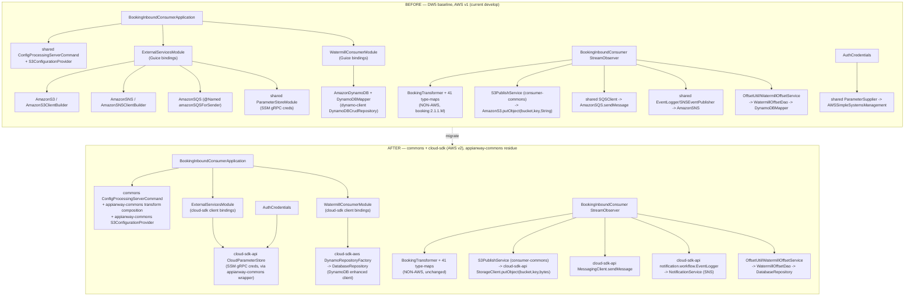
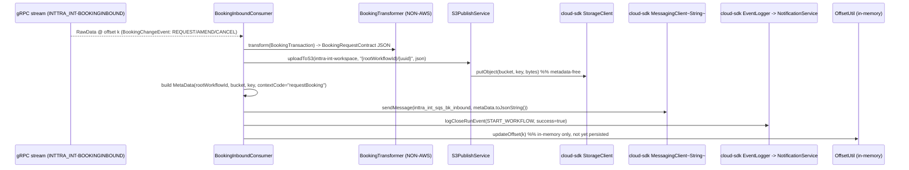
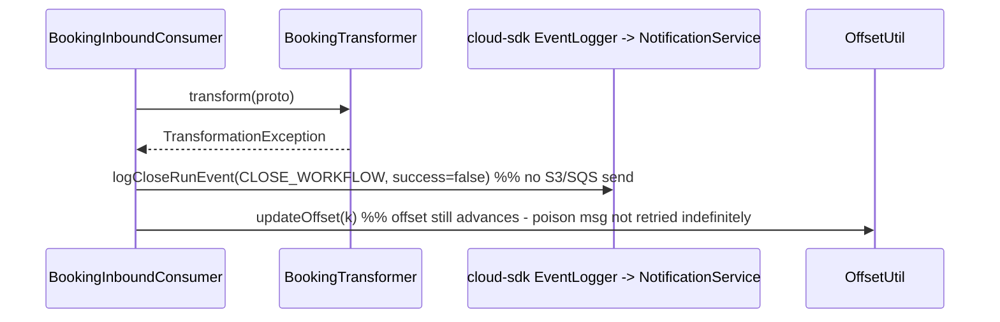
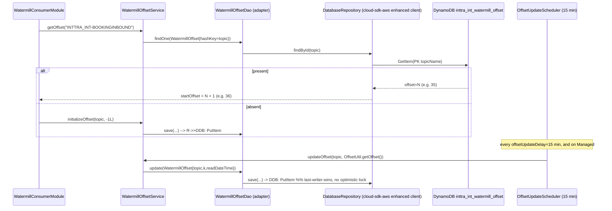

# `booking-inbound-consumer` — AWS SDK v2 (cloud-sdk) Upgrade Design (claude)

> Module: `com.inttra.mercury:booking-inbound-consumer:1.0` (sub-module of `watermill`, parent `watermill:1.0` which itself has **no parent** to the appianway root) · Date: 2026-07-22 · Author: Claude (Opus 4.8)
> Program foundation: [`2026-07-22-appianway-awsupgrade-foundation-claude.md`](../../../2026-07-22-appianway-awsupgrade-foundation-claude.md) — this doc follows its §7 template exactly and inherits §2 (`shared`→replacement mapping), §3 (slim `appianway-commons`), §4 (config model), §5/§5A (cloud-sdk gaps + W-G9 workflow-model audit), §6 (Maven template), §8 (rollout order).
> Baseline already in `develop`: **Dropwizard 5.0.2 / Jetty 12.1.9 / Java 17 / Jackson 2.21.4** (ION-16098) — verified booting clean against INT (see [`2026-07-22-appway-app-checkouts-run-config.md`](../../../2026-07-22-appway-app-checkouts-run-config.md) §4.11: DynamoDB offset read + gRPC channel live at boot, offset 35→36, no code/config change needed for the DW5 move).
> **Scope of THIS doc:** the AWS-v1→v2 rebind + `shared`→`commons`/`cloud-sdk-api`/`cloud-sdk-aws`/`appianway-commons` migration only. The gRPC/protobuf consume layer (`Watermill` `consumeForever`, `BookingChangeEvent`→`BookingRequestContract` via `BookingTransformer` + ~41 type-maps, reconnect) is **not AWS** and is untouched.
> Supersedes/updates: [`2026-06-30-booking-inbound-consumer-aws2x-upgrade-DESIGN-claude.md`](2026-06-30-booking-inbound-consumer-aws2x-upgrade-DESIGN-claude.md) + [`...-plan-claude.md`](2026-06-30-booking-inbound-consumer-aws2x-upgrade-plan-claude.md) (target bumped `1.0.26-SNAPSHOT`→**`1.0.27-SNAPSHOT`**; adds the `shared`-retirement/`appianway-commons` dimension the June docs didn't have) and the watermill aggregator docs [`watermill/docs/2026-05-31-watermill-aws2x-upgrade-DESIGN-claude.md`](../../docs/2026-05-31-watermill-aws2x-upgrade-DESIGN-claude.md) (offset-store remap + `consumer-commons` consolidation, now folded into the `shared`-retirement program).

---

## 1. Overview

`booking-inbound-consumer` is a **full pipeline-entry** gRPC consumer: it subscribes to one e2open Watermill topic (`INTTRA_INT-BOOKINGINBOUND`), parses proto `BookingChangeEvent` (filtering `BOOKING_STATE_REQUEST`/`AMEND`/`CANCEL`), transforms each `Booking.Transaction` to INTTRA's `BookingRequestContract` via `BookingTransformer` (+ ~41 type-map classes, from the `com.inttra.mercury:booking:2.1.1.M` model jar), archives the JSON to S3, hands a `MetaData` envelope to **one** SQS queue that feeds the booking workflow engine, and logs `START_WORKFLOW`/`CLOSE_WORKFLOW` events to SNS.

- **Current state:** DW5/Jetty12/Java17 baseline already landed (ION-16098). AWS layer still on **AWS Java SDK v1 1.12.720** entirely through the appianway `shared` module (`com.inttra.mercury.shared.*`, artifact `com.inttra.mercury.shared:mercury-shared`) — pulled in transitively via `consumer-commons`, not declared directly in this module's own `pom.xml`. DynamoDB rides the in-house `com.inttra.mercury:dynamo-client:1.0` (`DynamoDBCrudRepository`) on top of v1 `DynamoDBMapper`.
- **Target:** `mercury-services-commons` **`1.0.27-SNAPSHOT`** — `commons` (config command, `InttraServer` base) + `cloud-sdk-api`/`cloud-sdk-aws` (S3/SQS/SNS/SSM/DynamoDB v2 clients, `MetaData`/`Event`/`EventLogger` workflow model) + slim **`appianway-commons`** (residue: `AsyncDispatcher`/task base, `S3ConfigurationProvider`, gRPC-credential `ParameterSupplier` wrapper, config-transform composition glue). `shared` is fully retired for this module.
- **Headline change (this module):** the **DynamoDB offset store** — `WatermillOffset` (`{env}_watermill_offset`, `inttra_int_watermill_offset` on INT) — moves from v1 `DynamoDBMapper`/`DynamoDBCrudRepository` (`dynamo-client`) to the cloud-sdk-aws **DynamoDB enhanced client** via `DatabaseRepository<WatermillOffset,String>`/`DynamoRepositoryFactory`, read at boot and flushed every 15 min by `OffsetUpdateScheduler`. This is the module's data-plane-safety-critical surface — offsets are consumed by other members of the shared Watermill topic, so table/attribute-shape preservation is non-negotiable (§10).
- Secondary changes: S3 write (`inttra-int-workspace`, metadata-free — **S-G2 not exercised**), SQS send (1 queue, `inttra_int_sqs_bk_inbound`), SNS publish (`inttra_int_sns_event`, START/CLOSE_WORKFLOW **Events** — depends on **W-G9**), SSM gRPC credentials (`AuthCredentials`). `consumer-commons` (the shared library this module depends on for the offset/S3/config-POJO layer) **migrates alongside** this module — it is not in the 14-module batch but its rebind is inseparable from booking-inbound-consumer's and is fully specified here (§2, §6, §7).

---

## 2. Current vs Target architecture



### 2.1 Class/type-level mapping (source-verified, this module + `consumer-commons`)

| File (this module unless noted) | Current (`shared`/v1) | Target (`commons`/`cloud-sdk-*`/`appianway-commons`) |
|---|---|---|
| `BookingInboundConsumerApplication.initialize()` | `com.inttra.mercury.shared.command.ConfigProcessingServerCommand` | `com.inttra.mercury.config.ConfigProcessingServerCommand` (commons) **+ appianway-commons composed transform** (§5) |
| `BookingInboundConsumerApplication.initialize()` | `com.inttra.mercury.shared.config.S3ConfigurationProvider` (`requiresS3Configuration()`) | appianway-commons `S3ConfigurationProvider` (moved, behavior identical) |
| `BookingInboundConsumerApplication` | dead `org.zapodot.hystrix.bundle.HystrixBundle` import (bundle already commented out) | **removed** (§7) |
| `ExternalServicesModule.configure()` | `AmazonS3`/`AmazonS3ClientBuilder` | replaced by `S3PublishService`'s injected `StorageClient` (cloud-sdk-api, bound in `consumer-commons`/its Guice module) |
| `ExternalServicesModule.configure()` | `AmazonSNS`/`AmazonSNSClientBuilder` (`AWSClientConfiguration.sns_publish`) | cloud-sdk-api `NotificationService` (cloud-sdk-aws SNS impl) |
| `ExternalServicesModule.configure()` | `AmazonSQS` `@Named("amazonSQSForSender")` (`AWSClientConfiguration.sqs_sender`) | cloud-sdk-api `MessagingClient<String>` (cloud-sdk-aws SQS impl) |
| `ExternalServicesModule.configure()` | `com.inttra.mercury.shared.parameterstore.ParameterStoreModule(userIdKey, passwordKey)` | appianway-commons Guice module providing a `ParameterSupplier`-shaped wrapper over cloud-sdk-api `CloudParameterStore` |
| `ExternalServicesModule.configure()` | `com.inttra.mercury.shared.networkservices.NetworkRetryerModule` | **dropped** — module's yaml has no `networkServiceConfig` block; this install is dead code (confirmed: no `AuthClient` call at boot per run-config §4.11) |
| `WatermillConsumerModule.configure()` | `AmazonDynamoDB` + `DynamoDBMapper` + `DynamoDBMapperConfig` (via `DynamoSupport.newClient/newMapper`, `consumer-commons`) | cloud-sdk-aws `DynamoDbClientConfig` + `DynamoRepositoryFactory.createEnhancedRepository(...)` → bind `DatabaseRepository<WatermillOffset,String>` |
| `WatermillConsumerModule.snsEventPublisher()` | `com.inttra.mercury.shared.event.SNSEventPublisher(topicArn, SNSClient)` | cloud-sdk-api `notification.workflow.EventPublisher`/`SnsEventPublisher` bound directly over `NotificationService` |
| `BookingInboundConsumerConfiguration` | `com.inttra.mercury.dynamo.respository.module.DynamoDbConfig` (dynamo-client) | module-local/appianway-commons `DynamoDbConfig` POJO (same fields: `readCapacityUnits`, `writeCapacityUnits`, `environment`, `sseEnabled`) feeding cloud-sdk-aws `DynamoDbClientConfig`/`DynamoRepositoryConfig` |
| `BookingInboundConsumerConfiguration` | `com.inttra.mercury.shared.config.S3Config` | cloud-sdk-aws `CloudStorageConfig` (same `bucket` field) |
| `BookingInboundConsumerConfiguration` | `com.inttra.mercury.shared.config.SNSConfig` | cloud-sdk-aws `NotificationClientConfig` (same `topicArn` field) |
| `grpc/AuthCredentials` | `com.inttra.mercury.shared.parameterstore.ParameterSupplier` | `CloudParameterStore` (cloud-sdk-api), via the appianway-commons wrapper above — **same 2-call shape** (`getValue(userIdKey)`, `getValue(passwordKey)`) |
| `grpc/BookingInboundConsumer` | `com.inttra.mercury.shared.event.Event`, `EventLogger`, `RandomGenerator` | `com.inttra.mercury.cloudsdk.notification.workflow.Event`/`EventLogger` (cloud-sdk-api, W-G9-verified parity); `RandomGenerator` → appianway-commons thin wrapper (or inline `UUID.randomUUID()`) |
| `grpc/BookingInboundConsumer` | `com.inttra.mercury.shared.messaging.SQSClient` | cloud-sdk-api `MessagingClient<String>` |
| `grpc/BookingInboundConsumer` | `com.inttra.mercury.shared.support.Json` (`DATE_FORMATTER`) | cloud-sdk-api `util.DateConstants`/`JsonSupport` (identical `yyyy-MM-dd HH:mm:ss.SS` pattern, W-G9-verified) |
| `grpc/BookingInboundConsumer` | `com.inttra.mercury.shared.task.MetaData` (`Builder`, `Projection.*`, `EXIT_STATUS_*`) | `com.inttra.mercury.cloudsdk.notification.workflow.MetaData` (cloud-sdk-api — identical fields/builder/`@JsonInclude`; `ORIGINAL_FILENAME`/`INFTPFILEPICKUPTIME`/`CONTEXT_CODE` are all in the 26-constant set already present, **not** among the 6 W-G9.2 gaps) |
| `consumer-commons` `WatermillOffset` (vo) | `@DynamoDBTable`/`@DynamoDBHashKey`/`@DynamoDBAttribute`/`@DynamoDBTypeConverted(DateToEpochSecond)` (v1 datamodeling) | cloud-sdk-api `@Table("watermill_offset")` / `@DynamoDbPartitionKey @DynamoDbField("topicName")` / `@DynamoDbField(...)` + `LongEpochSecondAttributeConverter` — **attribute names + epoch-seconds shape preserved exactly** |
| `consumer-commons` `WatermillOffsetDao` | `extends DynamoDBCrudRepository<WatermillOffset, DynamoHashKey<String>>` (`dynamo-client`) | thin adapter over `DatabaseRepository<WatermillOffset,String>` (`findOne`/`save`/`update` shape retained so `WatermillOffsetService`/`OffsetUtil`/`OffsetUpdateScheduler` are **byte-for-byte unchanged**) |
| `consumer-commons` `DynamoSupport` | `newClient`/`newMapper`/`newDynamoDBMapperConfig` (v1, `AwsClientBuilder.EndpointConfiguration`) | folded into `DynamoRepositoryFactory.createEnhancedRepository(DynamoDbClientConfig, tableName, WatermillOffset.class, DynamoRepositoryConfig)` — explicit `tableName = "{environment}_watermill_offset"` reproduces the v1 prefix resolver |
| `consumer-commons` `S3PublishService` | `AmazonS3.putObject(bucket, path, String)` (`PutObjectResult`) | `StorageClient.putObject(bucket, key, bytes)` — **metadata-free, S-G2 not needed** |
| `consumer-commons` `DateToEpochSecond` | `DynamoDBTypeConverter<Long,Date>` (v1) | `LongEpochSecondAttributeConverter` (cloud-sdk-api) — identical `getTime()/1000` ↔ `new Date(epoch*1000)` |
| `consumer-commons` pom | `com.inttra.mercury.shared:mercury-shared` | dropped (replaced by `cloud-sdk-api`/`cloud-sdk-aws`/`commons`) |
| `consumer-commons` pom | `com.amazonaws:aws-java-sdk-{sqs,dynamodb}` v1 | dropped (transitive v2 via `cloud-sdk-aws`) |
| `consumer-commons` pom | `com.inttra.mercury:dynamo-client:1.0` | dropped (replaced by cloud-sdk-aws DynamoDB enhanced client) |
| this module's pom | `com.inttra.mercury:dynamo-client:1.0` (direct dep + exclusions) | dropped |

**Unchanged (non-AWS, confirmed by source read):** `BookingInboundConsumer` (`StreamObserver<RawData>`), `WatermillConsumerTask`/`AsyncDispatcher` (moved home only — task base to `appianway-commons`, logic identical), `ConsumerInitUtil` (Netty gRPC channel — `io.grpc.netty.shaded`), `BookingTransformer` + all type-map classes, `TransformationException`, `MessageKeys`, `booking:2.1.1.M` model jar dependency.

---

## 3. AWS touchpoints

| Surface | Direction | INT resource | Current (v1) client | Target (v2) client |
|---|---|---|---|---|
| **DynamoDB** (offset) | read (boot) + write (15-min flush + on-error) | `inttra_int_watermill_offset` (physical = `{environment}_watermill_offset`, `environment=inttra_int`) | `AmazonDynamoDB` + `DynamoDBMapper` (`dynamo-client` `DynamoDBCrudRepository`) | cloud-sdk-aws DynamoDB **enhanced client** → `DatabaseRepository<WatermillOffset,String>` via `DynamoRepositoryFactory` |
| **S3** | write only | `inttra-int-workspace` | `AmazonS3.putObject(bucket,key,String)` (no metadata) | cloud-sdk-api `StorageClient.putObject(bucket,key,bytes)` — **metadata-free, S-G2 NOT exercised** |
| **SQS** | send only, 1 queue | `inttra_int_sqs_bk_inbound` (`https://queue.amazonaws.com/081020446316/inttra_int_sqs_bk_inbound`) | `AmazonSQS` (`@Named amazonSQSForSender`) via shared `SQSClient.sendMessage` | cloud-sdk-api `MessagingClient<String>.sendMessage(url, body)` |
| **SNS** | publish only | `arn:aws:sns:us-east-1:081020446316:inttra_int_sns_event` | `AmazonSNS` via shared `SNSEventPublisher`/`EventLogger` | cloud-sdk-api `NotificationService` (via `notification.workflow.EventPublisher`/`EventLogger`) — **W-G9 applies** (Events carry `Annotations`? Not used here — this module doesn't set annotations on its `Event`s, so it's not exposed to the W-G9.1 defect, but still consumes the corrected cloud-sdk-api jar) |
| **SSM** (Param Store) | read, gRPC creds only | `/inttra/int/appianway/watermill-grpc/se/username`, `/inttra/int/appianway/watermill-grpc/se/password` | `AWSSimpleSystemsManagement` via shared `ParameterSupplier`/`ParameterStoreModule` | cloud-sdk-api `CloudParameterStore` (via appianway-commons wrapper) |
| **gRPC** (non-AWS) | consume (stream) | `watermill.staging.e2open.com:443`, topic `INTTRA_INT-BOOKINGINBOUND` | `io.grpc` + `grpc-netty-shaded` `NettyChannelBuilder`, `ConsumerGrpc.ConsumerStub` | **unchanged** |
| Health checks | — | — | none registered (`BookingInboundConsumerConfiguration` has an unused `HealthCheckConfig` bean, same as sibling consumers) | **unchanged** — verification is boot-evidence only, port **8085** (`/admin/opsHealthcheck` → 404) |

---

## 4. Sequence diagrams

### 4.1 Steady state — consume → transform → S3 + SQS + SNS → in-memory offset



### 4.2 Transformation failure path (poison message)



### 4.3 Boot offset-seed + periodic offset-flush (DynamoDB v2)



**At-least-once semantics preserved:** cursor advances in-memory per message (`OffsetUtil.updateOffset`); the DynamoDB row is only durable on the 15-min scheduler tick, `Managed#stop()`, or the `BookingInboundConsumer.onError` handler (which also persists before reconnecting/incrementing the retry count). A crash between flushes re-consumes from `persisted+1` — identical behavior to the current v1 implementation.

---

## 5. Configuration changes

### 5.1 Property-key table (exact INT values, unchanged names)

Run command (unchanged — `../../configuration` is **two levels up**, no parent pom for the `watermill` reactor):
```
java -DCONFIG_REGION=US_EAST_1 -jar target/booking-inbound-consumer-1.0.jar run \
  booking-inbound-consumer.yaml conf/int/booking-inbound-consumer.properties \
  ../../configuration/int/network-services.properties ../../configuration/int/datadog.properties
```

| YAML key (template) | `conf/int/booking-inbound-consumer.properties` value | Notes |
|---|---|---|
| `componentName` | `booking-inbound-watermill` | used as `MetaData`/`Event` `componentName` |
| `server.connector.port` | (default `8085`, not overridden in INT properties) | port **8085**, not 8081 |
| `watermillServiceConfig.userIdKey` | `/inttra/int/appianway/watermill-grpc/se/username` | SSM path, resolved via `CloudParameterStore` (§5.2) |
| `watermillServiceConfig.passwordKey` | `/inttra/int/appianway/watermill-grpc/se/password` | SSM path |
| `watermillServiceConfig.tenant` | `INTTRA_INT` | gRPC `CallCredentials` metadata header |
| `watermillServiceConfig.host` | `watermill.staging.e2open.com` | gRPC endpoint (non-AWS) |
| `watermillServiceConfig.port` | `443` | gRPC endpoint |
| `watermillServiceConfig.topicName` | `INTTRA_INT-BOOKINGINBOUND` | offset-table hash-key AND gRPC subscription topic |
| `watermillServiceConfig.offsetUpdateDelay` | `15` (minutes) | `OffsetUpdateScheduler` cadence |
| `watermillServiceConfig.keepAliveTime` | `30` (seconds) | gRPC channel, non-AWS |
| `watermillServiceConfig.keepAliveTimeout` | `20` (seconds) | gRPC channel, non-AWS |
| `watermillServiceConfig.idleTimeout` | `30` (minutes) | gRPC channel, non-AWS |
| `dynamoDbConfig.environment` | `inttra_int` | table-name prefix → physical table `inttra_int_watermill_offset` |
| `dynamoDbConfig.readCapacityUnits` / `writeCapacityUnits` | `25` / `25` (in yaml, not properties) | passed to `DynamoRepositoryConfig`/`DynamoDbAdminUtil` on table-create path |
| `dynamoDbConfig.sseEnabled` | `false` (in yaml) | carried to create-table path (unused here — table pre-exists) |
| `s3WorkspaceConfig.bucket` | `inttra-int-workspace` | `StorageClient.putObject` target |
| `snsEventConfig.topicArn` | `arn:aws:sns:us-east-1:081020446316:inttra_int_sns_event` | `NotificationService` publish target |
| `bookingInboundQueueUrl` | `https://queue.amazonaws.com/081020446316/inttra_int_sqs_bk_inbound` | `MessagingClient<String>.sendMessage` target |
| `healthCheckConfig.networkServiceHealthCheckUrl` | from `network-services.properties` (`networkservices.healthCheckUrl`) | **config-resolved only — bean is never wired into a registered health check** (no `registerHealthChecks` call in this app) |

**Not renamed:** no topic/queue/bucket/SSM-path renames in this migration — all INT resource names above stay exactly as they are today.

### 5.2 SSM parameter table (resolution mechanism — explicit per §4.3.2 of the foundation)

| Parameter | Path | Current resolution | Target resolution | Decision |
|---|---|---|---|---|
| gRPC username | `/inttra/int/appianway/watermill-grpc/se/username` | shared `ParameterSupplier.getValue(key)`, called once at `AuthCredentials` construction (Guice singleton, effectively at injector-build/boot time) | cloud-sdk-api `CloudParameterStore.getParameter(key)` via an appianway-commons `ParameterSupplier`-shaped wrapper, called the same way | **Keep runtime resolution** (not converted to boot-time `${awsps:/path}` YAML placeholders) — the values are consumed **programmatically** in a constructor field (`AuthCredentials`), not bound through the Dropwizard `Configuration` YAML, so the `ParameterStoreConfigTransform` boot-time substitution path doesn't apply here. This mirrors watermill-publisher's identical pattern (verified in the run-config doc). |
| gRPC password | `/inttra/int/appianway/watermill-grpc/se/password` | (same) | (same) | (same) |

`network-services.properties`'s `networkservices.clientId`/`clientSecret` SSM paths are **passed on the CLI but never referenced** by this module's yaml (no `networkServiceConfig` block) — no `AuthClient` call happens at boot (confirmed in run-config §4.11). This is unchanged by the migration.

### 5.3 Config-command composition

- `BookingInboundConsumerApplication.initialize()` swaps `com.inttra.mercury.shared.command.ConfigProcessingServerCommand` → `com.inttra.mercury.config.ConfigProcessingServerCommand` (commons), composed per the foundation §4.2 chain:
  `appianway property-substitution transform` (appianway-commons, `${key}` from `.properties`+env) **→** commons `TrimConfigCommentsTransform` **→** commons `ParameterStoreConfigTransform` (`${awsps:/path}`, unused by this module's yaml today but available).
- The conditional `S3ConfigurationProvider.requiresS3Configuration()` check (`CONFIG_LOCATION=s3`) is preserved, provider moved to appianway-commons.
- CLI arg shape, `-DCONFIG_REGION=US_EAST_1`, `datadog.properties` passthrough: **all unchanged**.

### 5.4 Run profile / path notes

- **No profiles** for this module (unlike splitter/transformer/ingestor's ce-/os- variants) — single yaml, single properties file, single topic.
- **`../../configuration` (two levels up)** — because `watermill/booking-inbound-consumer` sits two directories below the appianway root, unlike the 8081-port modules (one level, `../configuration`). This is unchanged by the AWS migration; called out here only because it's easy to get wrong when copying run configs from a non-watermill module.

### 5.5 Transform composition (BookingTransformer, non-AWS but config-adjacent)

`BookingTransformer` + `CarriageTransformer`/`LocationTransformer`/`PartyTransformer`/`EquipmentTransformer`/`CommonTransformer`/`CargoTransformer` (+ ~35 `type.*TypeMap` classes) are pure Guice-injected POJOs with no AWS/config dependency — **entirely unaffected** by this migration. They are recompiled only if the `booking:2.1.1.M` model jar version is bumped (tracked as a separate cross-workspace concern, §6/§10 — not part of the AWS-v2 rebind itself).

---

## 6. cloud-sdk / commons dependencies & assumed gaps

| Gap ID | Exercised by this module? | Detail |
|---|---|---|
| **S-G2** (metadata-aware `putObject`) | **No.** `S3PublishService.uploadToS3` is metadata-free (`StorageClient.putObject(bucket,key,bytes)`, no content-type/metadata overload needed) — matches the June 2026 finding, unchanged. |
| **W-G9** (workflow-model parity) | **Yes, as a consumer of the corrected jar.** `MetaData`/`Event`/`EventLogger` come from `cloud-sdk-api notification.*`. This module does **not** set `Annotations` on its `Event`s (`eventLogger.logCloseRunEvent(metaData, subType, rootWorkflowId, jsonPayload, componentName, startDateTime, success, tokens)` — no annotations arg used), so it is not itself exposed to the W-G9.1 `Event.Builder` annotations-round-trip defect, but it must still consume a cloud-sdk-api build that has W-G9 landed (program-wide gate, foundation §5A) since other Watermill/mercury-services apps in the same `Event`/SNS fan-out **do** carry annotations. `MetaData.Projection.ORIGINAL_FILENAME`/`INFTPFILEPICKUPTIME`/`CONTEXT_CODE` (used by `buildMetaData`) are confirmed present in the existing 26-constant cloud-sdk-api set (not among the 6 W-G9.2 gaps) — **no blocking dependency on the constant-parity fix for this module specifically.** |
| X-G7 / X-G8 / C-G6 | Not applicable — no email, no OpenSearch/Jest, config composition works without widening `getConfigTransformer`. |
| DynamoDB v2 (de-scoped as a cloud-sdk change, native feature) | **Yes — primary consumer.** `DynamoRepositoryFactory.createEnhancedRepository(...)`, `@Table`/`@DynamoDbPartitionKey`/`@DynamoDbField`, `LongEpochSecondAttributeConverter`, `DynamoDbClientConfig`. `@DynamoDbVersionAttribute` (optimistic lock) is available but **intentionally unused** — matches current last-writer-wins semantics. |

**Consumed from `commons`:** `ConfigProcessingServerCommand`, `TrimConfigCommentsTransform`/`ParameterStoreConfigTransform`, `InttraServer` base (no health-check registrar used, since this app registers none).
**Consumed from `cloud-sdk-api`:** `StorageClient`, `MessagingClient<String>`, `NotificationService`, `CloudParameterStore`, `notification.workflow.{MetaData,Event,EventLogger,EventPublisher}`, `DatabaseRepository<T,ID>`.
**Consumed from `cloud-sdk-aws`:** S3/SQS/SNS/SSM v2 impls, DynamoDB enhanced client, `DynamoRepositoryFactory`, `DynamoDbClientConfig`, `LongEpochSecondAttributeConverter`, `DynamoDbAdminUtil`.
**Moves to `appianway-commons`:** `AsyncDispatcher`/task lifecycle base (this module's own `task.AsyncDispatcher`/`task.WatermillConsumerTask` retain their shape, just no longer duplicate a `shared` base class), `S3ConfigurationProvider`, the gRPC-credential `ParameterSupplier`-over-`CloudParameterStore` wrapper, the appianway property-substitution config transform.

---

## 7. Maven dependency changes

> **No parent pom** for the `watermill` reactor root — `watermill/pom.xml` does not inherit the appianway root's `dependencyManagement`, so all BOM/version pins must be mirrored directly in `watermill/pom.xml` (already true for the ION-16098 Jetty/Jackson pins — see its `<!-- ION-16098 -->` comments). This module (`booking-inbound-consumer/pom.xml`) itself **does** have a `<parent>` (→ `watermill:1.0`) — "no parent pom" refers to the `watermill` reactor's relationship to the appianway root, not to this module's relationship to `watermill`.

### 7.1 `watermill/pom.xml` (aggregator — add BOM pins, retire the v1 property)

```xml
<properties>
    <!-- existing ION-16098 pins (jetty.version, jackson.bom.version, etc.) unchanged -->
    <mercury.commons.version>1.0.27-SNAPSHOT</mercury.commons.version>
    <appianway.commons.version>1.0-SNAPSHOT</appianway.commons.version>
    <!-- aws-java-sdk.version (1.12.720) removed once ALL 5 sub-modules
         (consumer-commons, itv-gps-consumer, cargoscreen-consumer,
          booking-inbound-consumer, visibility-inbound-consumer) stop
          referencing v1 -- coordinate across the 4 consumer docs before deleting. -->
</properties>
<dependencyManagement>
    <dependencies>
        <!-- existing jetty-bom / jetty-ee10-bom / jackson-bom / httpcore(5) / dropwizard-dependencies -->
        <dependency>
            <groupId>com.inttra.mercury</groupId>
            <artifactId>cloud-sdk-api</artifactId>
            <version>${mercury.commons.version}</version>
        </dependency>
        <dependency>
            <groupId>com.inttra.mercury</groupId>
            <artifactId>cloud-sdk-aws</artifactId>
            <version>${mercury.commons.version}</version>
        </dependency>
        <dependency>
            <groupId>com.inttra.mercury</groupId>
            <artifactId>commons</artifactId>
            <version>${mercury.commons.version}</version>
        </dependency>
    </dependencies>
</dependencyManagement>
```

### 7.2 `booking-inbound-consumer/pom.xml`

**Remove**
- `com.inttra.mercury:dynamo-client:1.0` dependency (+ its 6 exclusions) — replaced entirely by the cloud-sdk-aws DynamoDB enhanced client, consumed transitively via `consumer-commons`.
- (transitively, once `consumer-commons` migrates §7.3) `com.inttra.mercury.shared:mercury-shared`, `com.amazonaws:aws-java-sdk-{sqs,dynamodb}`.

**Add**
```xml
<dependency>
    <groupId>com.inttra.mercury</groupId>
    <artifactId>cloud-sdk-api</artifactId>
    <version>${mercury.commons.version}</version>
</dependency>
<dependency>
    <groupId>com.inttra.mercury</groupId>
    <artifactId>cloud-sdk-aws</artifactId>
    <version>${mercury.commons.version}</version>
</dependency>
<dependency>
    <groupId>com.inttra.mercury</groupId>
    <artifactId>commons</artifactId>
    <version>${mercury.commons.version}</version>
</dependency>
<dependency>
    <groupId>com.inttra.mercury</groupId>
    <artifactId>appianway-commons</artifactId>
    <version>${appianway.commons.version}</version>
</dependency>
```

**Keep unchanged**
- `com.inttra.mercury:consumer-commons:1.0` (its own `pom.xml` migrates per §7.3 — this module's dependency declaration doesn't change, only what's transitively behind it).
- `com.inttra.mercury:booking:2.1.1.M` (+ its existing exclusions — the jar already excludes v1 AWS SDK jars, so no additional exclusion work is needed here; version alignment with the cloud-sdk-aligned `booking` platform release remains a **separate, tracked cross-workspace concern**, §10).
- `com.fasterxml.jackson.datatype:jackson-datatype-jsr310` (pinned to `jackson.bom.version`), `slf4j-api`, JUnit 5/Mockito/AssertJ test deps, `lombok`.
- `protobuf-maven-plugin` (protoc `4.33.1`, `protoc-gen-grpc-java` `1.77.0`), `maven-shade-plugin` (main-class transformer unchanged), `maven-compiler-plugin`, `maven-surefire-plugin` — **gRPC/protobuf toolchain is entirely non-AWS and untouched.**
- Remove the dead `org.zapodot.hystrix.bundle.HystrixBundle` import in `BookingInboundConsumerApplication` (bundle already commented out — this is source cleanup that rides along with the pom change if a `hystrix-bundle` dependency is currently declared anywhere in the chain; verify at `consumer-commons`/aggregator level per foundation §6).

### 7.3 `consumer-commons/pom.xml` (migrates alongside — not one of the 14 app docs, but load-bearing for this module)

**Remove:** `com.inttra.mercury.shared:mercury-shared:${mercury.shared.version}`, `com.amazonaws:aws-java-sdk-sqs:${aws-java-sdk.version}`, `com.amazonaws:aws-java-sdk-dynamodb:${aws-java-sdk.version}`, `com.inttra.mercury:dynamo-client:1.0` (+ exclusion).
**Add:** `cloud-sdk-api`, `cloud-sdk-aws`, `commons` (all `${mercury.commons.version}`), `appianway-commons` (`${appianway.commons.version}`).
**Unchanged:** `io.dropwizard:dropwizard-core`, `io.dropwizard.metrics:metrics-annotation`, Guice/Guava/metrics-guice, `commons-cli`, protobuf-java(-util)/protobuf-java-format, `io.grpc:grpc-{netty-shaded,protobuf,stub}`, `javax.annotation-api`, JUnit 5/Mockito/logback test+runtime deps.
**Code moves (rebind, not new dependency):** `WatermillOffset` (vo) re-annotated to cloud-sdk-api DynamoDB annotations; `WatermillOffsetDao` rewritten as a `DatabaseRepository` adapter; `DynamoSupport` retired (folded into `DynamoRepositoryFactory` usage in each consumer's Guice module); `S3PublishService` rebinds its injected `AmazonS3` → `StorageClient`; `DateToEpochSecond` retired in favor of `LongEpochSecondAttributeConverter`. `WatermillOffsetService`/`OffsetUtil`/`OffsetUpdateScheduler`/`WatermillServiceConfig`/`HealthCheckConfig` are **plain POJOs/services with no AWS-typed field** — verified unchanged.

**Verify:** `mvn -pl watermill/booking-inbound-consumer -am clean verify` (note `-am` pulls in `consumer-commons` + `dynamo-client`-replacement chain); then the `watermill` aggregator `mvn -pl watermill -amd verify` once all 5 sub-modules are migrated. `clean` is required — shade-plugin fat jars go stale otherwise (per foundation §6).

---

## 8. Tests

- **Offset persistence (highest priority):** `WatermillOffsetDaoTest`/`WatermillOffsetServiceTest` move to a DynamoDB-Local-backed integration test (the `dynamo-integration-test` module referenced by the watermill/June docs); assert write→read round-trip with the **exact** attribute names (`topicName`/`offset`/`readDateTime`/`writeDateTime`) and epoch-**seconds** value shape.
- **Backward-compat fixture (gate, non-negotiable):** seed a DynamoDB-Local table with an item shaped exactly like a real `inttra_int_watermill_offset` row (string PK `INTTRA_INT-BOOKINGINBOUND`, numeric epoch-seconds dates) and assert the migrated `WatermillOffset` entity deserializes it and the `+1`-resume logic in `OffsetUtil`/`WatermillConsumerModule.getConsumerRequest` behaves identically.
- **S3 write:** re-point `S3PublishService`'s injected client to a `StorageClient` fake (functional-testing, cloud-sdk-api-based); assert `putObject(bucket, "{rootWorkflowId}/{uuid}", bytes)` called once per successful transform.
- **SQS send:** re-point `SQSClient`/`MessagingClient<String>` to a fake; assert `sendMessage("inttra_int_sqs_bk_inbound", metaData.toJsonString())` on the success path and **no send** on the `TransformationException` path (§4.2).
- **SNS/EventLogger:** assert `logCloseRunEvent` fires `START_WORKFLOW` (success=true) vs `CLOSE_WORKFLOW` (success=false) against a `NotificationService` fake, targeting `snsEventConfig.topicArn`.
- **SSM/AuthCredentials:** unit-test the `CloudParameterStore`-backed `ParameterSupplier` wrapper returns the same value shape the old shared `ParameterSupplier` did; gRPC `applyRequestMetadata` behavior (username/password/tenant/topic headers) is unchanged and untested here (non-AWS).
- **Transformers (`BookingTransformer` + ~41 type-maps):** unchanged unit tests; only recompile if/when the `booking` jar version is bumped — add a proto→`BookingRequestContract` JSON-shape assertion as a contract check against the booking workflow engine (tracked separately from the AWS migration, §10).
- **gRPC consumer/reconnect (`BookingInboundConsumer.onError`, `ConsumerInitUtil`):** unchanged, non-AWS — keep green as a regression guard since `onError` also calls `watermillOffsetService.updateOffset(...)` (now backed by `DatabaseRepository`) before reconnecting.
- Module is already **JUnit 5** (Jupiter) — no vintage-engine bridge needed.

---

## 9. Rollout & verification

Per foundation §8, this module is **last** in the program (position 11 of 14, immediately after `watermill-publisher`, alongside the other 3 Watermill consumers):

1. `appianway-commons` lands first (slim residue: `AsyncDispatcher`/task base, `S3ConfigurationProvider`, `ParameterSupplier`-over-`CloudParameterStore` wrapper, config-transform composition) — shared by all 4 consumers.
2. `functional-testing` fakes re-pointed to `cloud-sdk-api` (`StorageClient`/`MessagingClient`/`NotificationService`/`CloudParameterStore` test doubles).
3. **`consumer-commons` DynamoDB pilot** (§7.3) — `mvn -pl watermill/consumer-commons -am verify`, gated on the backward-compat offset fixture (§8) seeded from a real `inttra_int_watermill_offset`-shaped item.
4. This module (`booking-inbound-consumer`): rebind `ExternalServicesModule`/`WatermillConsumerModule`, config command, `AuthCredentials` — `mvn -pl watermill/booking-inbound-consumer -am clean verify`.
5. **INT boot evidence** (no ops health check exists — port **8085**, no health checks registered): reuse the exact procedure in `2026-07-22-appway-app-checkouts-run-config.md` §4.11 —
   ```
   java -DCONFIG_REGION=US_EAST_1 -jar target/booking-inbound-consumer-1.0.jar run \
     booking-inbound-consumer.yaml conf/int/booking-inbound-consumer.properties \
     ../../configuration/int/network-services.properties ../../configuration/int/datadog.properties
   ```
   Confirm in logs: `DynamoSupport`/enhanced-client equivalent log line showing offset found (or absent→initialize) for topic `INTTRA_INT-BOOKINGINBOUND`; gRPC `Channel initialized` + `Polling from offset N+1`; **zero** exceptions; `/admin/healthcheck` → 200 (deadlocks only); `/admin/opsHealthcheck` → 404 (expected, unchanged).
   **Data-plane caveat (unchanged from the DW5 verification):** running against INT briefly joins the live shared topic; confirm the run consumes **no** messages (offset unchanged) to avoid disrupting the shared consumer, or coordinate a maintenance window if a live message must be exercised end-to-end.
6. Aggregator `mvn -pl watermill -amd verify` once `itv-gps-consumer`/`cargoscreen-consumer`/`visibility-inbound-consumer` land alongside.

---

## 10. Risks & mitigations

| Risk | Mitigation |
|---|---|
| **Offset-table data-shape incompatibility** — wrong physical table name or a renamed attribute ⇒ `inttra_int_watermill_offset` read fails or silently returns nothing → re-consumption from offset 0 → duplicate `START_WORKFLOW` events into the booking workflow engine | **Highest priority.** Preserve the explicit physical table name (`{environment}_watermill_offset` = `inttra_int_watermill_offset`) passed to `DynamoRepositoryFactory`; preserve `topicName`/`offset`/`readDateTime`/`writeDateTime` attribute names via `@DynamoDbField`; keep epoch-**seconds** via `LongEpochSecondAttributeConverter`. Gate cutover on the backward-compat fixture (§8) seeded from a real production-shaped item — **do not cut over without it.** |
| **`booking` model jar drift** — if the `com.inttra.mercury:booking` version is bumped as part of (or near) this migration and `BookingRequestContract`'s JSON shape moved, the SQS body the workflow engine consumes changes silently | Track jar-version alignment as a **separate, explicit decision** from the AWS-v2 rebind; diff produced JSON against a captured production sample before cutover; do not bump the `booking` version in the same PR as the cloud-sdk rebind unless both are individually verified. |
| **W-G9 program dependency** — this module consumes `cloud-sdk-api notification.workflow.*` types shared with every other Watermill/mercury-services app in the SNS `inttra_int_sns_event` fan-out; if the cloud-sdk-api release this module pins to lands *before* W-G9, other producers' `Event.annotations` could still be silently dropped downstream (event-writer's archive) | Sequence this module's cutover **after** the W-G9 fix is confirmed in the pinned `cloud-sdk-api` `1.0.27-SNAPSHOT` build (foundation §5A gate: the JSON round-trip corpus test must be green). This module itself doesn't set annotations, so it is not blocked on W-G9 for its *own* correctness, but the shared jar version must include the fix for program-wide safety. |
| **SSM gRPC-credential resolution regression** — if `CloudParameterStore` resolves differently (caching, error handling, IAM-role assumption) than the old `AWSSimpleSystemsManagement`-backed `ParameterSupplier`, `AuthCredentials` construction could fail at boot, or silently carry stale/blank creds and fail the gRPC handshake with `UNAUTHENTICATED` | Unit-test the wrapper against both present-and-absent parameter cases; verify with an actual INT boot (gRPC `Channel initialized` + successful stream = creds resolved, same evidence pattern used in the DW5 verification). |
| **Duplicate booking workflow on poison-message offset advance** — `TransformationException` path still advances the offset (existing, intentional behavior) | Confirm this is preserved exactly (§4.2) — not a new risk introduced by the migration, but easy to accidentally "fix" during the rebind; keep the existing `catch (TransformationException)` → `logCloseRunEvent(CLOSE_WORKFLOW)` → offset-still-advances flow unchanged. |
| **Enhanced-client default extensions altering writes** (e.g. auto-versioning) | `@DynamoDbVersionAttribute` is deliberately **not** added to `WatermillOffset` — confirm plain last-writer-wins `PutItem` semantics in the integration test. |
| **`consumer-commons` shared-migration blast radius** — this module is not the only consumer of `consumer-commons`; a mistake there affects `itv-gps-consumer`/`cargoscreen-consumer`/`visibility-inbound-consumer` too | Land and verify `consumer-commons` (§7.3, §9 step 3) as its own gated step with its own `mvn -pl watermill/consumer-commons -am verify` **before** touching this module's `ExternalServicesModule`/`WatermillConsumerModule`. |
| **No health-check endpoint to prove AWS resolution post-deploy** (port 8085, no `opsHealthcheck`) | Rely on boot-log evidence exactly as the DW5 verification did (offset-found log line + gRPC channel-initialized log line + zero exceptions); consider (out of scope for this migration) adding a minimal health-check registration as a follow-up hardening task. |
