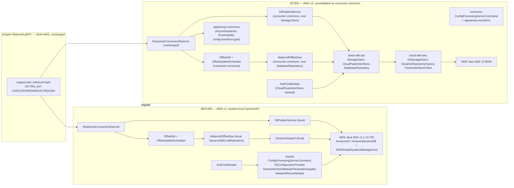

# `cargoscreen-consumer` — AWS SDK v2 (cloud-sdk) Upgrade Design (claude)

> Module: `com.inttra.mercury:cargoscreen-consumer` (sub-module of the standalone `watermill` reactor, **no parent pom**) · Date: 2026-07-22 · Author: Claude (Opus 4.8)
> **Program foundation:** [`2026-07-22-appianway-awsupgrade-foundation-claude.md`](../../../2026-07-22-appianway-awsupgrade-foundation-claude.md) — this doc follows its §7 template exactly and inherits its `shared`→`commons`/`cloud-sdk` mapping (§2), slim `appianway-commons` (§3), config model (§4), assumed cloud-sdk gaps (§5), Maven template (§6), rollout order (§8).
> **Verified run baseline:** [`2026-07-22-appway-app-checkouts-run-config.md`](../../../2026-07-22-appway-app-checkouts-run-config.md) §4.12 — DW5/Jetty12/Java17 boot on INT confirmed clean (DynamoDB offset read + gRPC channel live) before this AWS-layer rebind.
> **Supersedes (scope change only — same target facts):** [`2026-06-30-cargoscreen-consumer-aws2x-upgrade-DESIGN-claude.md`](2026-06-30-cargoscreen-consumer-aws2x-upgrade-DESIGN-claude.md) / [`...-plan-claude.md`](2026-06-30-cargoscreen-consumer-aws2x-upgrade-plan-claude.md), which scoped Option A/B (DW4→5 + AWS v1→v2 together) against `1.0.26-SNAPSHOT`. **DW5 is now DONE** (ION-16098, `develop`); this doc's scope is **AWS v1→v2 + drop-`shared` only**, target `1.0.27-SNAPSHOT`. All prior DynamoDB/S3/SSM analysis carries forward unchanged.

---

## 1. Overview

`cargoscreen-consumer` is a **single-topic, S3-only-sink** Watermill gRPC consumer: it subscribes to the e2open `INTTRA_INT-CARGOSCREENINGOUTBOUND` topic, parses proto `CargoScreeningOutboundChangeEvent`, and for every upsert whose `exStatus != ERROR` writes the `CargoScreeningOutbound` result as JSON to S3 at `{YYYYMMdd}/{offset}_{sourceSourceTxId}.json`; `ERROR` upserts are **logged only** — there is no downstream SQS queue and **no SNS publish**. It persists exactly one consumption offset (`WatermillOffset`, keyed by topic name) in DynamoDB and reads gRPC basic-auth credentials from SSM Parameter Store.

**Current state (post ION-16098):** Dropwizard 5.0.2 / Jetty 12.1.9 / Java 17 (DONE) still wired to **AWS Java SDK v1 `1.12.720`** via a **fully-local** DynamoDB/S3 layer (its own `vo/WatermillOffset`, `dynamodb/DynamoSupport`, `dynamodb/command/DynamoTableCommand`, `service/S3PublishService`, `dao/WatermillOffsetDao`) plus `com.inttra.mercury:shared` for `ConfigProcessingServerCommand`, `S3ConfigurationProvider`, `ParameterStoreModule`/`ParameterSupplier`, and `NetworkRetryerModule`.

**Target state:** AWS v2 via `cloud-sdk-api`/`cloud-sdk-aws` `1.0.27-SNAPSHOT`, `commons` for the config command, and slim `appianway-commons` for the appianway-only residue (§6 below). `shared` is dropped entirely. The module's local Dynamo/S3 duplicates are **deleted and consolidated onto `watermill/consumer-commons`**, which migrates to cloud-sdk **alongside** this module (consumer-commons is currently still on AWS v1 too — see §2).

**Headline change:** two isolated AWS-layer swaps — (1) **DynamoDB offset** (`DynamoDBMapper`/`DynamoDBCrudRepository` → `DatabaseRepository<WatermillOffset,String>` via cloud-sdk-aws `DynamoRepositoryFactory`, preserving the physical table name `{env}_watermill_offset` and every attribute name/epoch-seconds encoding), and (2) **S3 write** (`AmazonS3.putObject` → cloud-sdk-api `StorageClient.putObject`, metadata-free — **S-G2 not exercised**). The gRPC/proto consume layer (`ResponseConsumerObserver`, `ConsumerInitUtil`, ION-14324 reconnect/20 s stabilization, `maxRetry=25`) is **not AWS** and is untouched.

---

## 2. Current vs Target architecture

### 2.1 Component diagram — before/after



### 2.2 Class/type mapping — what each v1/`shared` type maps to

| Area | Current (AWS v1 + `shared`, module-local) | Target (cloud-sdk-api/aws + commons/appianway-commons) | Notes |
|---|---|---|---|
| S3 client | `AmazonS3`/`AmazonS3ClientBuilder` bound in `ExternalServicesModule` | `StorageClient` (cloud-sdk-api) impl `S3StorageClient` (cloud-sdk-aws), Guice-bound | metadata-free `putObject` — **S-G2 not needed** |
| S3 write | local `service/S3PublishService.uploadToS3(fullS3Path,payload)` → `s3Client.putObject(bucket,key,String)` | `consumer-commons` `S3PublishService.uploadToS3(bucket,fullS3Path,payload)` → `StorageClient.putObject(bucket,key,bytes)` | consumer-commons' `S3PublishService` **already takes `bucket` as a param** (not injected config) — cargoscreen just needs to pass its bucket in; only the injected client type changes (v1→v2) |
| Offset entity | local `vo/WatermillOffset` — `@DynamoDBTable("watermill_offset")`, `@DynamoDBHashKey("topicName")→hashKey`, `@DynamoDBAttribute offset/readDateTime/writeDateTime`, `@DynamoDBTypeConverted(DateToEpochSecond)`, `@DynamoDBStream(KEYS_ONLY)`, implements `DynamoHashKey<String>` | `consumer-commons` `vo/WatermillOffset` — **field-for-field identical today** (same table name, same attribute names, same converter) — re-annotate to cloud-sdk-api `@Table`/`@DynamoDbPartitionKey`/`@DynamoDbField` + `LongEpochSecondAttributeConverter` | Delete cargoscreen's own copy; adopt consumer-commons' (currently byte-identical AWS-v1 twin, confirmed by diff below) |
| Offset DAO | local `dao/WatermillOffsetDao extends DynamoDBCrudRepository<WatermillOffset,DynamoHashKey<String>>` | `consumer-commons` `WatermillOffsetDao` over cloud-sdk-aws `DatabaseRepository<WatermillOffset,String>` (via `DynamoRepositoryFactory`) | table name resolved by the same prefix-`{environment}_` convention, explicit `tableName="watermill_offset"` preserved |
| DynamoDB support/mapper | local `dynamodb/DynamoSupport` (`AmazonDynamoDBClientBuilder`, `DynamoDBMapper`, `DynamoDBMapperConfig` w/ prefix override) | `consumer-commons` `DynamoSupport` rebased on cloud-sdk-aws `DynamoDbClientConfig` + `DynamoRepositoryFactory.createEnhancedRepository(...)` | delete cargoscreen's local copy entirely |
| Create-table CLI | local `dynamodb/command/DynamoTableCommand` (`TableUtils`, `SSESpecification`, RCU/WCU 25/25) | cloud-sdk-aws `DynamoDbAdminCommand`/`DynamoDbAdminUtil` | preserve SSE + throughput settings (INT yaml: `readCapacityUnits: 25`, `writeCapacityUnits: 25`, `sseEnabled: false`) |
| Offset service/scheduler/util | local `service/WatermillOffsetService`, `task/OffsetUpdateScheduler`, `util/OffsetUtil` | `consumer-commons` equivalents (already present, same logic — in-memory cursor + 15-min flush) | consolidate onto consumer-commons; behavior unchanged |
| gRPC creds | `grpc/AuthCredentials` via `shared` `ParameterSupplier`/`ParameterStoreModule` (`AWSSimpleSystemsManagementClientBuilder.defaultClient()`) | `CloudParameterStore` (cloud-sdk-api, impl in cloud-sdk-aws) — same 2-key lookup (`userIdKey`/`passwordKey`) | resolution mechanism only changes; SSM paths unchanged (§5) |
| Config command | `shared.command.ConfigProcessingServerCommand` + `shared.config.S3ConfigurationProvider` | `commons` `ConfigProcessingServerCommand` + composed appianway property-substitution transform (foundation §4.2) | see §5 below |
| Networking module glue | `shared.networkservices.NetworkRetryerModule` (installed but this module has **no `networkServiceConfig`** block, so it is dead weight) | dropped — no replacement needed (module never calls `AuthClient`) | confirmed by yaml: no `networkServiceConfig` key |
| Dead AWS binding | `AmazonSNS`/`AmazonSNSClientBuilder` bound in `ExternalServicesModule`, **never injected/invoked** | removed entirely | no cloud-sdk `NotificationService` needed — this module has zero SNS/SQS surface |
| gRPC transport | `io.grpc.netty.shaded` `NettyChannelBuilder`, `ConsumerInitUtil`, `ResponseConsumerObserver`, ION-14324 reconnect (20 s stabilization), `maxRetry=25` | **unchanged** — non-AWS | out of scope |

**Diff check performed:** `cargoscreen-consumer/src/.../vo/WatermillOffset.java` and `watermill/consumer-commons/src/.../vo/WatermillOffset.java` are currently **byte-identical** (same package-local fields, same `@DynamoDBTable("watermill_offset")`, same `@DynamoDBHashKey(attributeName="topicName")`, same converter). Same for `S3PublishService` (consumer-commons' version already takes `bucket` as a call parameter instead of injected config — a strict superset, safe to adopt) and `WatermillOffsetDao`/`DynamoSupport` (functionally identical, package-renamed). This means the consolidation is a **delete-and-repoint**, not a re-design — the main work is the AWS v1→v2 rebind inside `consumer-commons` itself, which cargoscreen then inherits for free.

---

## 3. AWS touchpoints

| Touchpoint | Direction | INT resource | cloud-sdk client used | Notes |
|---|---|---|---|---|
| SQS | — | **none** | — | module has no SQS in/out at all |
| SNS | — | **none** (dead v1 binding removed) | — | `AmazonSNS` was bound but never invoked; deleted, not replaced |
| S3 | write only | `inttra-int-watermill-cargoscreen` | `StorageClient.putObject(bucket,key,bytes)` (metadata-free) | key `{YYYYMMdd}/{offset}_{sourceSourceTxId}.json`; **S-G2 not exercised** (no metadata/content-type need) |
| DynamoDB | read + write (offset) | table `inttra_int_watermill_offset` (prefix `inttra_int` + `watermill_offset`, hash key `topicName`) | `DatabaseRepository<WatermillOffset,String>` via `DynamoRepositoryFactory` | single row, keyed by topic name `INTTRA_INT-CARGOSCREENINGOUTBOUND`; RCU/WCU 25/25, SSE disabled |
| SES | — | **none** | — | not applicable |
| Param Store (SSM) | read (boot / call-credentials) | `/inttra/int/appianway/watermill-grpc/se/username`, `/inttra/int/appianway/watermill-grpc/se/password` | `CloudParameterStore` | resolved per gRPC call via `AuthCredentials` (unchanged mechanism, new backing client) |
| gRPC (non-AWS) | consume | `watermill.staging.e2open.com:443`, topic `INTTRA_INT-CARGOSCREENINGOUTBOUND`, tenant `INTTRA_INT` | — | `maxRetry=25`, `retryDelay=10s`, `keepAliveTime=30s`, `keepAliveTimeout=20s`, `idleTimeout=30m`; ION-14324 20 s channel-stabilization on reconnect |
| Port / health | — | `8085` | — | **no health checks registered** (no `registerHealthChecks`); `/admin/opsHealthcheck` → 404; verification is by boot evidence only (foundation §9, run-config §4.12) |

---

## 4. Sequence diagram — consume → (S3 write or log) → advance offset

```mermaid
sequenceDiagram
    participant G as gRPC stream (cargoscreen topic)
    participant O as ResponseConsumerObserver (unchanged)
    participant S3P as S3PublishService (consumer-commons)
    participant SC as StorageClient (cloud-sdk-aws)
    participant OU as OffsetUtil (in-memory, consumer-commons)
    participant Svc as WatermillOffsetService (consumer-commons)
    participant Dao as WatermillOffsetDao (consumer-commons)
    participant Repo as DatabaseRepository (cloud-sdk-aws)
    participant DDB as DynamoDB inttra_int_watermill_offset

    Note over G,O: startup — seed offset
    O->>Svc: getOffset("INTTRA_INT-CARGOSCREENINGOUTBOUND")
    Svc->>Dao: findOne(hashKey=topic)
    Dao->>Repo: findById(topic)
    Repo->>DDB: GetItem(PK=topicName)
    alt present
        DDB-->>Repo: offset=N
        Repo-->>Svc: startOffset = N+1
    else absent
        Svc->>Dao: save(WatermillOffset{topic,-1})
        Dao->>Repo: save(...)
        Repo->>DDB: PutItem
        Note over Svc: startOffset = 0
    end

    loop steady-state consumption
        G-->>O: RawData @ offset k (CargoScreeningOutboundChangeEvent)
        loop each upsert in the change event
            alt exStatus != ERROR
                O->>S3P: uploadToS3(bucket, "{YYYYMMdd}/{offset}_{sourceSourceTxId}.json", json)
                S3P->>SC: putObject(bucket, key, bytes)  %% metadata-free, S-G2 not used
                SC-->>S3P: OK
            else exStatus == ERROR
                O->>O: log BPResult messages (terminal — no S3/queue write)
            end
        end
        O->>OU: updateOffset(k)  %% in-memory cursor only
    end

    Note over OU,DDB: every offsetUpdateDelay (15 min, INT)
    OU->>Svc: updateOffset(topic, OU.getOffset())
    Svc->>Dao: update(WatermillOffset{topic,k})
    Dao->>Repo: save(...)
    Repo->>DDB: PutItem (last-writer-wins)

    Note over O,DDB: onError (reconnect, ION-14324 — non-AWS logic unchanged)
    O->>Svc: updateOffset(topic, currentOffset)  %% flush before reconnect
    Svc->>Repo: save via Dao
    Repo->>DDB: PutItem
    O->>O: channel.shutdownNow(); awaitTermination(20s); new channel; sleep 20s; consumeForever(persisted+1)
```

**At-least-once preserved:** the in-memory cursor advances per message; DynamoDB is flushed on the 15-minute scheduler and on `onError` before reconnect. On restart the stream resumes at `persisted_offset + 1`. The 20 s channel-stabilization window and `maxRetry=25` cap are gRPC concerns, unaffected by the AWS-layer swap.

---

## 5. Configuration changes

### 5.1 Property-key table (INT values, from `conf/int/cargoscreen-consumer.properties` and `conf/cargoscreen-consumer.yaml`)

| Property key | INT value | Consumed by (yaml path) | Change? |
|---|---|---|---|
| `componentName` | `cargoscreen-consumer` | (metrics/logging tag) | unchanged |
| `watermill-grpc.consumer.username.key` | `/inttra/int/appianway/watermill-grpc/se/username` | `watermillServiceConfig.userIdKey` | unchanged (still an SSM *path*, resolved at gRPC-call time via `CloudParameterStore` instead of v1 `ParameterSupplier`) |
| `watermill-grpc.consumer.password.key` | `/inttra/int/appianway/watermill-grpc/se/password` | `watermillServiceConfig.passwordKey` | unchanged |
| `watermill-grpc.consumer.tenant` | `INTTRA_INT` | `watermillServiceConfig.tenant` | unchanged |
| `watermill-grpc.consumer.host` | `watermill.staging.e2open.com` | `watermillServiceConfig.host` | unchanged (non-AWS) |
| `watermill-grpc.consumer.port` | `443` | `watermillServiceConfig.port` | unchanged |
| `watermill-grpc.consumer.topic.name` | `INTTRA_INT-CARGOSCREENINGOUTBOUND` | `watermillServiceConfig.topicName` | unchanged — **do not rename** |
| `watermill-grpc.dynamo.environment` | `inttra_int` | `dynamoDbConfig.environment` | unchanged — table-name prefix; **do not rename** |
| `watermill-grpc.consumer.s3WorkspaceConfig.bucket` | `inttra-int-watermill-cargoscreen` | `s3WorkspaceConfig.bucket` | unchanged — **do not rename** |
| `watermill-grpc.consumer.offsetUpdateDelay` | `15` (minutes) | `watermillServiceConfig.offsetUpdateDelay` | unchanged |
| `watermill-grpc.consumer.keepAliveTime.seconds` | `30` | `watermillServiceConfig.keepAliveTime` | unchanged (non-AWS gRPC) |
| `watermill-grpc.consumer.keepAliveTimeout.seconds` | `20` | `watermillServiceConfig.keepAliveTimeout` | unchanged |
| `watermill-grpc.consumer.idleTimeout.minutes` | `30` | `watermillServiceConfig.idleTimeout` | unchanged |
| `watermill-grpc.consumer.maxRetry` | `25` | `watermillServiceConfig.maxRetry` | unchanged (non-AWS gRPC retry cap) |
| `watermill-grpc.consumer.retryDelay` (yaml default `10`) | not overridden in INT properties → default `10` | `watermillServiceConfig.retryDelay` | unchanged |
| `server.connector.port` (yaml default `8085`) | not overridden → default `8085` | `server.connector.port` | unchanged — port **8085** |
| `watermill-grpc.consumer.healthCheckConfig.errorRateThreshold` (yaml default `5.0`) | not overridden | `healthCheckConfig.errorRateThreshold` | present in config POJO but **unused — no health checks registered** |
| `networkservices.healthCheckUrl` | referenced by yaml `healthCheckConfig.networkServiceHealthCheckUrl` but **no `networkServiceConfig` block exists** | n/a | dead reference — carried through unchanged (harmless; not resolved to an actual auth call) |
| `dynamoDbConfig.readCapacityUnits` / `writeCapacityUnits` | `25` / `25` (yaml literals, not `${...}`) | `dynamoDbConfig.{readCapacityUnits,writeCapacityUnits}` | unchanged; used by `DynamoDbAdminCommand`/`DynamoTableCommand` create-table path only |
| `dynamoDbConfig.sseEnabled` | `false` (yaml literal) | `dynamoDbConfig.sseEnabled` | unchanged |

### 5.2 SSM parameter table

| SSM path | Purpose | Resolution mechanism today | Resolution mechanism after |
|---|---|---|---|
| `/inttra/int/appianway/watermill-grpc/se/username` | gRPC basic-auth username | `shared` `ParameterSupplier.getValue(key)` → v1 `AWSSimpleSystemsManagementClientBuilder.defaultClient()`, called once at `AuthCredentials` construction (per-injection, effectively boot-time singleton) | `CloudParameterStore.getParameter(path)` (cloud-sdk-api, cloud-sdk-aws impl) — same call site (`AuthCredentials` ctor), same one-time-per-singleton resolution. **Not** moved to boot-time `${awsps:/path}` YAML substitution — it stays a runtime-resolved credential per foundation §4.3.2, since it feeds gRPC `CallCredentials` metadata, not a YAML field. |
| `/inttra/int/appianway/watermill-grpc/se/password` | gRPC basic-auth password | same as above | same as above |

No `usePassThrough` flag exists in this module (that's a network-services-specific concept from `network-services.properties`, which cargoscreen-consumer does **not** reference — no `networkServiceConfig` block). Both SSM paths remain literal path strings in the properties file; only the Java-side resolver changes from v1 `ParameterSupplier` to `CloudParameterStore`.

### 5.3 Config-command composition

- CLI shape **unchanged**: `run cargoscreen-consumer.yaml conf/int/cargoscreen-consumer.properties ../../configuration/int/network-services.properties ../../configuration/int/datadog.properties` — cwd = `watermill/cargoscreen-consumer/`, **two levels up** to `configuration/` (no parent pom — foundation §6, run-config §4.11 banner note).
- `CargoScreenConsumerApplication.initialize(bootstrap)` swaps:
  - `com.inttra.mercury.shared.command.ConfigProcessingServerCommand` → `com.inttra.mercury.config.ConfigProcessingServerCommand` (commons), composed as **appianway property-substitution transform → `TrimConfigCommentsTransform` → `ParameterStoreConfigTransform`** (foundation §4.2/§4.3.3). This module currently has no `${awsps:...}` tokens in its yaml, so `ParameterStoreConfigTransform` is a no-op pass-through today but is wired for consistency/future use.
  - `com.inttra.mercury.shared.config.S3ConfigurationProvider` → kept **appianway-local** (moves to `appianway-commons` per foundation §2 row `config.S3ConfigurationProvider`) — still conditional on `CONFIG_LOCATION=s3`, which is **not** set in local/INT runs today (confirmed in run-config §2.1).
  - `DynamoTableCommand` bootstrap registration → `DynamoDbAdminCommand` (cloud-sdk-aws), or the consolidated `consumer-commons` equivalent if it exposes one; SSE/throughput settings carried through.
- **What's unchanged:** CLI arg order/shape, `CONFIG_REGION` system property, `datadog.properties` (passed but nothing in this module's yaml references its keys — confirmed by grep of the yaml), no `networkServiceConfig` block (so no `AuthClient`/network-services composition needed here, unlike splitter/transformer/ingestor).

---

## 6. cloud-sdk / commons dependencies & assumed gaps

| Gap ID | Applicable to this module? | Detail |
|---|---|---|
| **S-G2** (`StorageClient` metadata/content-type overloads) | **No** | S3 write is metadata-free (`putObject(bucket,key,bytes)`, no `ObjectMetadata`/content-type set today) — plain `putObject` suffices |
| **W-G9** (workflow-model parity) | **No** | this module never publishes/consumes `MetaData`/`Event`/`Annotations` — no SNS, no SQS, no workflow envelope at all |
| **X-G7** (email reply-to) | **No** | not applicable |
| **X-G8** (Jest/OpenSearch signing) | **No** | not applicable |
| **C-G6** (config transformer visibility) | **No — optional** | composition works without it per foundation §4.2 |

**Consumed from `commons`:** `ConfigProcessingServerCommand`, health base (unused here — no `registerHealthChecks` call in `CargoScreenConsumerApplication`), `InttraServer` base if adopted (module already runs `Application<WatermillConsumerConfiguration>` directly — DW5 base is already in place per ION-16098, no further framework move needed in this doc's scope).

**Consumed from `cloud-sdk-api`/`cloud-sdk-aws`:** `StorageClient`/`S3StorageClient`, `CloudParameterStore`, `DatabaseRepository<WatermillOffset,String>`/`DynamoRepositoryFactory`, `@Table`/`@DynamoDbPartitionKey`/`@DynamoDbField`, `LongEpochSecondAttributeConverter`, `DynamoDbClientConfig`, `DynamoDbAdminCommand`/`DynamoDbAdminUtil`.

**Moves to `appianway-commons`:** `AsyncDispatcher`/`AbstractTask` (this module's `task/AsyncDispatcher` is the appianway concurrency-dispatcher pattern per foundation §3 — retained, repointed to the slim library instead of `shared`), the appianway config property-substitution transform, and `S3ConfigurationProvider` (kept but relocated, conditional path unused today).

**What is NOT moved / NOT needed:** `NetworkRetryerModule` (installed today but dead — this module has no `networkServiceConfig`, drop entirely, no replacement); `HealthCheckConfig`/`errorRateThreshold` (present in config POJO but never wired to a live health-check registry — no change needed, no health checks are added by this upgrade, consistent with foundation's "watermill consumers: no health checks" note).

---

## 7. Maven dependency changes

`watermill/pom.xml` (aggregator, **no parent** — mirrors the BOM/version pins per foundation §6) + this module's `pom.xml`:

**Remove**
- `<parent>` stays absent (already true — confirmed in `watermill/cargoscreen-consumer/pom.xml`, parent is the `watermill` reactor pom only, itself parent-less).
- `com.inttra.mercury.shared:mercury-shared` (pom line 41-45).
- `com.amazonaws:aws-java-sdk-sqs` (pom line 63-67 — **declared but unused**, no `AmazonSQS` instantiation anywhere).
- `com.amazonaws:aws-java-sdk-dynamodb` (pom line 68-72).
- `com.inttra.mercury:dynamo-client:1.0` (local-lib jar, pom line 73-83) — the in-house v1 `DynamoDBCrudRepository`/`DynamoRepositoryConfig`/`DynamoHashKey` supplier, superseded by cloud-sdk-aws's enhanced-client repository.
- Transitive v1 SDK from `mercury-shared` (S3/SSM: `AmazonS3`, `AWSSimpleSystemsManagement`).
- Dead Guice binding: `AmazonSNS`/`AmazonSNSClientBuilder` in `ExternalServicesModule` (source change, not a pom line, but the SNS client construction disappears with `shared`'s `AWSClientConfiguration.sns_publish`).
- `<aws-java-sdk.version>1.12.720</aws-java-sdk.version>` property in `watermill/pom.xml` (line 25) once no module references it.

**Add**
- `com.inttra.mercury:cloud-sdk-api:1.0.27-SNAPSHOT`
- `com.inttra.mercury:cloud-sdk-aws:1.0.27-SNAPSHOT`
- `com.inttra.mercury:commons:1.0.27-SNAPSHOT` (config command; health base unused but available)
- `com.inttra.mercury:appianway-commons:1.0-SNAPSHOT` (slim residue — `AsyncDispatcher`, `S3ConfigurationProvider`, config transform glue)
- `com.inttra.mercury:consumer-commons` (this module's own reactor sibling, `watermill/consumer-commons` — already a declared/expected dependency for the consolidated `WatermillOffset`/`WatermillOffsetDao`/`S3PublishService`/`OffsetUtil`/`OffsetUpdateScheduler`/`DynamoSupport`; **must itself land its AWS v1→v2 rebind in lockstep**, since it is currently still on `AmazonS3`/`DynamoDBCrudRepository` v1 too)
- AWS SDK **v2** comes transitively via `cloud-sdk-aws` (managed by the mercury-services-commons BOM); do **not** declare v2 artifacts directly.

**Align / add version property in `watermill/pom.xml`**
```xml
<properties>
    <mercury.commons.version>1.0.27-SNAPSHOT</mercury.commons.version>
    <!-- existing pins unchanged: java.version=17, io.dropwizard.version=5.0.2,
         jetty.version=12.1.9, jackson.bom.version=2.21.4, grpc.version=1.77.0 -->
</properties>
```

**Keep unchanged (non-AWS)**
- gRPC/protobuf stack: `io.grpc:grpc-{netty-shaded,protobuf,stub}:1.77.0` (via `grpc-bom`), `com.google.protobuf:protobuf-java{,-util}:4.33.1`, `com.googlecode.protobuf-java-format:protobuf-java-format:1.4`, `org.xolstice.maven.plugins:protobuf-maven-plugin:0.6.1`, all `src/main/proto/**` (cargoscreening + generic + admin/consumer API protos) — untouched, this is the e2open Watermill wire contract.
- `com.google.guava:guava`, `com.google.inject:guice:7.0.0`, `com.palominolabs.metrics:metrics-guice`, Lombok, `commons-cli`.
- Shade-plugin config (`maven-shade-plugin`, `ServicesResourceTransformer` + `ManifestResourceTransformer` → main class `CargoScreenConsumerApplication`) — unchanged; **`clean` required before `package`** per foundation §6 (stale fat jars).
- `os-maven-plugin` extension for the protoc classifier.

**Tests**
- Module is on **JUnit 5** already (`org.junit.jupiter:junit-jupiter-{api,engine}`, versions dropped to inherit the Dropwizard 5.0.2 junit-bom per ION-16098) — **no JUnit 4→5 migration needed** in this doc's scope (unlike the 2026-06-30 DESIGN, which still listed JUnit 4/`junit-vintage-engine`; that was resolved by the DW5 baseline work already landed).
- `mockito-core`, `assertj-core`, `functional-testing:1.0` (test-scope) retained; `functional-testing` migrates its AWS fakes to cloud-sdk-api in lockstep per foundation rollout order (§8).

**Verify**
- `mvn -pl watermill/consumer-commons,watermill/cargoscreen-consumer -am clean verify` green (both modules move together — consumer-commons is the shared consolidation target).
- INT boot evidence per run-config §4.12 procedure: `DynamoSupport : Created mapper ... 'inttra_int_'`, `Offset found for topic INTTRA_INT-CARGOSCREENINGOUTBOUND`, `ResponseConsumerObserver : Initializing ResponseObserver`, `ConsumerInitUtil : Channel initialized`, bound `0.0.0.0:8085`, zero errors — re-run and diff against the pre-upgrade log captured in run-config §4.12.

---

## 8. Tests

- **Offset persistence (highest priority — data-plane safety):** move `WatermillOffsetServiceTest`/`OffsetUtilTest` assertions to exercise the `consumer-commons`-consolidated entity against `dynamo-integration-test` (DynamoDB-Local). Assert:
  - Table name resolves to `inttra_int_watermill_offset` (prefix `inttra_int` + `watermill_offset`).
  - Attribute names stored exactly as `topicName` (hash key), `offset`, `readDateTime`, `writeDateTime`.
  - `readDateTime`/`writeDateTime` still serialize via epoch-seconds (`LongEpochSecondAttributeConverter` matches the old `DateToEpochSecond` `DynamoDBTypeConverter<Long,Date>` byte-for-byte).
  - `findById(topic)` on an absent row → empty → triggers `initializeOffset(topic, -1L)` → resume at offset 0.
  - **Backward-compat fixture (critical):** seed DynamoDB-Local with a real-shaped `inttra_int_watermill_offset` item keyed `INTTRA_INT-CARGOSCREENINGOUTBOUND` (a snapshot of the real INT row, offset value from run-config §4.12 = `0`); assert the migrated entity deserializes it and resumes at `+1`.
- **S3 write:** re-point `S3PublishService` test to a `StorageClient` fake/mock; assert `putObject(bucket="inttra-int-watermill-cargoscreen", key="{YYYYMMdd}/{offset}_{sourceSourceTxId}.json", bytes)` is called for `exStatus != ERROR` upserts, and assert the `exStatus == ERROR` path performs **no** S3 call (log-only, verified via no-interaction on the mock).
- **`buildFileName` unit test:** unchanged logic (`ResponseConsumerObserver.buildFileName`) — assert filename falls back to `{offset}.json` when `sourceTxId` is blank, else `{offset}_{sourceTxId}.json`.
- **AuthCredentials / SSM:** unit test with a `CloudParameterStore` fake returning fixed username/password for the two configured SSM paths; assert gRPC `Metadata` headers (`username`,`password`,`tenant`,`topic`) populate identically to today.
- **Create-table CLI:** `DynamoTableCommandTest` (or its cloud-sdk-aws successor) asserts `DynamoDbAdminUtil`/`DynamoDbAdminCommand` creates `inttra_int_watermill_offset` with SSE disabled + 25/25 RCU/WCU, matching yaml literals.
- **gRPC consumer / reconnect (ION-14324):** unchanged, non-AWS — keep the existing `ResponseConsumerObserver` reconnect tests (20 s channel-stabilization, `maxRetry` cap, `NonRetryableException` short-circuit) green through the AWS-layer swap; they exercise `watermillOffsetService.updateOffset(...)` on the error path, so they double as an integration check that the new `DatabaseRepository`-backed save still succeeds.
- **`functional-testing` fakes:** re-point any shared AWS-fake helpers this module's tests import to cloud-sdk-api interfaces (`StorageClient`, `CloudParameterStore`) per foundation rollout §8.

---

## 9. Rollout & verification

Per foundation §8, this module is in the **last** rollout group — after `watermill-publisher`, alongside the other three watermill consumers (gRPC + DynamoDB offset; port 8085; no parent pom):

1. **Pilot the Dynamo + S3 rebind in `watermill/consumer-commons` first** — it is currently still on AWS v1 (`AmazonS3`, `DynamoDBCrudRepository`) and must land the v2 rebind before cargoscreen-consumer can consolidate onto it. Verify with `mvn -pl watermill/consumer-commons -am verify` (`dynamo-integration-test` for the offset entity).
2. **Delete cargoscreen-consumer's local duplicates:** `dynamodb/DynamoSupport`, `dynamodb/command/DynamoTableCommand`, `vo/WatermillOffset`, `vo/DateToEpochSecond`, `dao/WatermillOffsetDao`, `service/S3PublishService` — repoint all call sites (`ResponseConsumerObserver`, `WatermillConsumerModule`, `ExternalServicesModule`) to the `consumer-commons` equivalents.
3. **Rebind SSM:** `AuthCredentials` swaps `ParameterSupplier` (shared) for `CloudParameterStore` (cloud-sdk-api); remove `ParameterStoreModule`/`NetworkRetryerModule` installs from `ExternalServicesModule`.
4. **Remove dead SNS binding** (`AmazonSNS`) and the unused `aws-java-sdk-sqs` dependency.
5. **Config command swap:** `shared.command.ConfigProcessingServerCommand` → `commons` equivalent, composed per §5.3; `S3ConfigurationProvider` relocated to `appianway-commons` (same conditional behavior).
6. **Maven:** apply §7 remove/add list to `cargoscreen-consumer/pom.xml` and the `mercury.commons.version` property to `watermill/pom.xml`.
7. `mvn -pl watermill/consumer-commons,watermill/cargoscreen-consumer -am clean verify` green.
8. **INT boot check** — from `watermill/cargoscreen-consumer/`:
   ```
   java -DCONFIG_REGION=US_EAST_1 -jar target/cargoscreen-consumer-1.0.jar run \
     cargoscreen-consumer.yaml conf/int/cargoscreen-consumer.properties \
     ../../configuration/int/network-services.properties ../../configuration/int/datadog.properties
   ```
   Confirm: `DynamoSupport` created with `inttra_int_` prefix, `Offset found for topic INTTRA_INT-CARGOSCREENINGOUTBOUND` (or `initializeOffset` on first-ever boot), `ResponseConsumerObserver : Initializing ResponseObserver`, `ConsumerInitUtil : Channel initialized`, bound `0.0.0.0:8085`, zero errors, no message consumed during the verification window (data-plane-safe, matching the run-config §4.12 baseline capture where offset stayed at `0`).
9. **Gate cutover** on the backward-compat offset fixture (§8) passing against a real snapshot of the INT `inttra_int_watermill_offset` item for this topic.
10. Aggregator-wide `mvn verify` across the full `watermill` reactor once all four consumers + `consumer-commons` land.

---

## 10. Risks & mitigations

| Risk | Mitigation |
|---|---|
| **Offset-table data-shape incompatibility** — wrong physical table name (`inttra_int_watermill_offset`) or a renamed attribute (`topicName`/`offset`/`readDateTime`/`writeDateTime`) → cargoscreen silently re-consumes from 0, duplicating S3 writes | **Highest priority.** Preserve the exact table name and attribute names; confirmed the `consumer-commons` entity is currently byte-identical to cargoscreen's local copy — re-verify after cloud-sdk-api re-annotation with a real-item `dynamo-integration-test` fixture before cutover. |
| **`consumer-commons` is itself still AWS v1** — cargoscreen's consolidation is blocked until consumer-commons lands its own v2 rebind | Sequence consumer-commons' migration strictly before this module's Dynamo/S3 delete step (§9 step 1 before step 2); do not attempt partial consolidation. |
| Removing the dead `AmazonSNS` binding / unused `aws-java-sdk-sqs` introduces a missed real usage | Confirmed via source read: no `AmazonSNS`/`AmazonSQS` method call anywhere in the module — safe to delete; add a compile-time check (no import) as regression guard. |
| SSE / 25×25 RCU-WCU throughput dropped on table create | Carry through explicitly in `DynamoDbAdminCommand`/`DynamoDbAdminUtil` call; assert in the create-table test. |
| Reconnect parity (20 s stabilization, ION-14324, `maxRetry=25`) regresses due to an unrelated refactor touching `ResponseConsumerObserver`'s offset-flush-on-error call | gRPC logic itself is untouched; the only line touched in `onError` is the `watermillOffsetService.updateOffset(...)` call target (same method signature, new backing repository) — keep existing reconnect tests green as the regression guard. |
| SSM credential resolution timing change (`ParameterSupplier` one-shot vs `CloudParameterStore` call pattern) | `AuthCredentials` is `@Singleton`-scoped and resolves both keys once at construction today; preserve that same one-time-per-process resolution when swapping to `CloudParameterStore` — do not introduce a per-gRPC-call SSM round-trip. |
| `network-services.properties`/`networkServiceConfig` confusion — this module has no auth dependency on network-services despite the file being passed on the CLI | No action needed; `healthCheckConfig.networkServiceHealthCheckUrl` in the yaml references `networkservices.healthCheckUrl` but is never wired to an active health check (none are registered) — purely dead config, carried through as-is per foundation's "do not silently rename" rule even though it's unused. |
| Region/endpoint resolution drift for the new `DynamoDbClientConfig` | Map existing `regionEndpoint`/`signingRegion` (if set) 1:1 to `DynamoDbClientConfig.endpointOverride(...)`/`Region.of(...)`; INT today relies on default region resolution (no override in `conf/int/cargoscreen-consumer.properties`) — verify no unintended endpoint override is introduced. |
