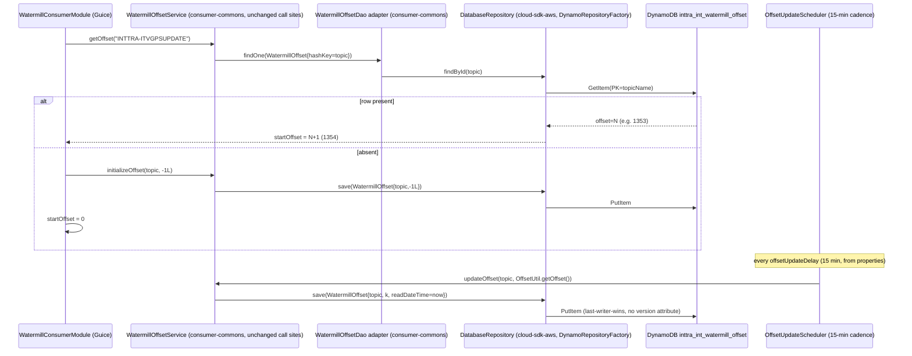
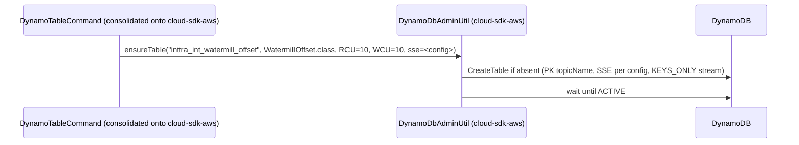

# `itv-gps-consumer` — AWS SDK v2 (cloud-sdk) Upgrade Design (claude)

> Module: `com.inttra.mercury:itv-gps-consumer` (standalone Maven project under `watermill/`, parent = the **`watermill` aggregator pom only** — no appianway root parent) · Date: 2026-07-22 · Author: Claude (Opus 4.8)
> **Program foundation:** [`2026-07-22-appianway-awsupgrade-foundation-claude.md`](../../../2026-07-22-appianway-awsupgrade-foundation-claude.md) — §0–§10 govern every module doc; this doc follows the §7 template exactly and adds only `itv-gps-consumer`-specific detail. Read that doc first.
> **Baseline already in `develop`:** Dropwizard **5.0.2** / Jetty **12.1.9** / Java **17** / Jackson **2.21.4** (ION-16098). Verified booting clean against INT with health-check/boot evidence: [`2026-07-22-appway-app-checkouts-run-config.md`](../../../2026-07-22-appway-app-checkouts-run-config.md) §4.13.
> **This doc's scope: AWS v1 → v2 + drop `appianway shared` ONLY.** DW5 is already done. Target line: **`mercury-services-commons` `1.0.27-SNAPSHOT`** (cloud-sdk-api + cloud-sdk-aws + commons), plus the slim **`appianway-commons`** residue library. `cloud-sdk` changes are **assumed done** (S-G2/W-G9/etc. per foundation §5) — none are exercised by this module's data path (see §6).
> Supersedes (superseded-by, do not re-derive from): [`2026-06-30-itv-gps-consumer-aws2x-upgrade-DESIGN-claude.md`](2026-06-30-itv-gps-consumer-aws2x-upgrade-DESIGN-claude.md) / [`...-plan-claude.md`](2026-06-30-itv-gps-consumer-aws2x-upgrade-plan-claude.md) (pinned `1.0.26-SNAPSHOT`, pre-DW5, pre-`appianway-commons` split) and the `watermill/docs/2026-05-31-watermill-aws2x-upgrade-*` aggregator docs (offset-store remap + `consumer-commons` consolidation — still the base pattern, referenced throughout).

---

## 1. Overview

`itv-gps-consumer` is the **simplest** of the four appianway Watermill gRPC consumers: a pure **S3-only sink**. It opens a single gRPC stream to the e2open Watermill service, subscribes to tenant **`INTTRA`** / topic **`INTTRA-ITVGPSUPDATE`**, parses the proto `ITVShipmentStatusChangeEvent` (`RawData.getData()`), serializes it to JSON with `JsonFormat`, and writes it to S3 bucket `inttra-int-watermill-gps` as `{offset}.json`. Downstream, a separate `mercury-services` component (`visibility-itv-gps-processor`, out of scope here) picks the file up via an S3→SNS→SQS notification pipeline that this module does **not** participate in — itv-gps-consumer makes **no SQS calls and publishes no SNS**.

- **Current state:** Dropwizard 5.0.2 (ION-16098 baseline already applied) + **AWS Java SDK v1 `1.12.720`**, consumed via `com.inttra.mercury.shared.*` (`ConfigProcessingServerCommand`, `S3ConfigurationProvider`, `ParameterSupplier`/`ParameterStoreModule`) plus **local, duplicated** DynamoDB v1 plumbing (`dynamodb/DynamoSupport`, `dynamodb/command/DynamoTableCommand`, and consumer-commons' `vo/DateToEpochSecond`/`vo/Expires`) and a **dead** `AmazonSNS` binding in `ExternalServicesModule`.
- **Target:** AWS SDK **v2** via **`cloud-sdk-api`/`cloud-sdk-aws`** (`StorageClient` for S3, `DatabaseRepository`/`DynamoRepositoryFactory` for the DynamoDB offset, `CloudParameterStore` for the SSM gRPC creds) + **`commons`** (config command composition) + slim **`appianway-commons`** (nothing this module strictly needs beyond the composed config transform — it has no error-handling/health/dispatcher residue worth moving, see §6). `shared` is dropped entirely.
- **Headline change:** re-platform the single-row DynamoDB offset (`WatermillOffset`, table `inttra_int_watermill_offset`) onto the cloud-sdk-aws v2 enhanced client via a **consolidated `consumer-commons`** (deleting this module's local Dynamo duplicates), rebind the metadata-free S3 write onto `StorageClient`, and rebind the SSM-sourced gRPC credentials onto `CloudParameterStore` — while proving the offset value (verified at **1353** on 2026-07-22) survives the cut exactly.
- **Non-AWS, untouched:** the gRPC/Watermill consume layer — `com.e2open.watermill.proto.logistics.itv.ITVShipmentStatusChangeEvent`, `ResponseConsumerObserver`, `ConsumerInitUtil` (Netty gRPC channel), `WatermillConsumerTask`/`AsyncDispatcher`, `MAX_RETRY_LIMIT=100` reconnect logic.
- **Tenant/topic note (do not rename):** unlike the other three watermill consumers (`INTTRA_INT-...`), this module's gRPC tenant header is **`INTTRA`** (not `INTTRA_INT`) and its topic is **`INTTRA-ITVGPSUPDATE`**. Both are baked into `conf/int/itv-gps-consumer.properties` and MUST be preserved exactly.

---

## 2. Current vs. Target architecture

### 2.1 Component diagram — before / after

```mermaid
flowchart LR
    subgraph before["BEFORE — AWS v1 + shared"]
        direction LR
        subgraph e2o1[e2open Watermill gRPC — NON-AWS]
            T1[(INTTRA-ITVGPSUPDATE)]
        end
        OBS1[ResponseConsumerObserver]
        S3P1[S3PublishService]
        AC1[AuthCredentials]
        PS1[shared ParameterSupplier/ParameterStoreModule]
        DS1[local DynamoSupport + consumer-commons DynamoSupport]
        DAO1[WatermillOffsetDao extends DynamoDBCrudRepository]
        V1S3[AmazonS3 v1]
        V1SSM[AWSSimpleSystemsManagement v1]
        V1DDB[AmazonDynamoDB v1 + DynamoDBMapper]
        DEADSNS["dead: AmazonSNS binding (never invoked)"]

        T1 --> OBS1
        OBS1 --> S3P1 --> V1S3
        OBS1 --> AC1 --> PS1 --> V1SSM
        OBS1 --> DAO1 --> DS1 --> V1DDB
        DEADSNS -.never called.-> OBS1
    end

    subgraph after["AFTER — cloud-sdk v2 + commons"]
        direction LR
        subgraph e2o2[e2open Watermill gRPC — NON-AWS, unchanged]
            T2[(INTTRA-ITVGPSUPDATE)]
        end
        OBS2[ResponseConsumerObserver — unchanged]
        S3P2["S3PublishService (consumer-commons, over StorageClient)"]
        AC2["AuthCredentials (over CloudParameterStore)"]
        DAO2["WatermillOffsetDao adapter (consumer-commons, consolidated)"]
        Repo["DatabaseRepository / DynamoRepositoryFactory (cloud-sdk-aws)"]
        SC["StorageClient (cloud-sdk-api)"]
        CPS["CloudParameterStore (cloud-sdk-api)"]

        T2 --> OBS2
        OBS2 --> S3P2 --> SC
        OBS2 --> AC2 --> CPS
        OBS2 --> DAO2 --> Repo
    end

    before -. migrate .-> after
```



### 2.2 Class-level mapping table

| Current (`shared` / AWS v1) | Replacement | Home | Notes |
|---|---|---|---|
| `com.inttra.mercury.shared.command.ConfigProcessingServerCommand` | `com.inttra.mercury.config.ConfigProcessingServerCommand` + composed appianway property-substitution transform | commons + appianway-commons | §5.3 |
| `com.inttra.mercury.shared.config.S3ConfigurationProvider` | keep appianway-local (unchanged behaviour) — only used when `CONFIG_LOCATION=s3` | appianway-commons or module-local | not exercised on the INT boot in §4.13 of the run-config doc |
| `com.inttra.mercury.shared.parameterstore.ParameterSupplier` / `ParameterStoreModule` (`AWSSimpleSystemsManagementClientBuilder.defaultClient()`) | `cloud-sdk-api` `CloudParameterStore` | cloud-sdk | `AuthCredentials` resolves `watermillServiceConfig.getUserIdKey()`/`getPasswordKey()` through it — see §3, §5.2 |
| `AmazonS3`/`AmazonS3ClientBuilder` bound in `ExternalServicesModule` | `cloud-sdk-api` `StorageClient` | cloud-sdk | `S3PublishService.uploadToS3` becomes `storageClient.putObject(bucket, key, bytes)` — metadata-free, **S-G2 not exercised** |
| `AmazonSNS`/`AmazonSNSClientBuilder` (dead binding, `ExternalServicesModule:29-30`) | — | **delete** | confirmed never injected/invoked anywhere in this module |
| `AmazonDynamoDB`/`AmazonDynamoDBClientBuilder`, `DynamoDBMapper`/`DynamoDBMapperConfig` (this module's local `dynamodb/DynamoSupport` **and** the duplicate in `consumer-commons`) | `DynamoDbClientConfig` + `DynamoRepositoryFactory.createEnhancedRepository(...)` | cloud-sdk-aws | **delete this module's local `dynamodb/DynamoSupport` entirely** — consolidate onto the migrated `consumer-commons` (watermill aggregator doc §2/§9) |
| `WatermillOffsetDao extends DynamoDBCrudRepository<WatermillOffset,...>` (`consumer-commons`) | `WatermillOffsetDao` becomes a thin adapter over `DatabaseRepository<WatermillOffset,String>` (`findOne`/`save`/`update` signatures preserved) | consumer-commons | `WatermillOffsetService`/`OffsetUtil`/`OffsetUpdateScheduler` call sites **unchanged** |
| `vo.WatermillOffset` — `@DynamoDBTable("watermill_offset")` + `@DynamoDBHashKey(attributeName="topicName")` + `@DynamoDBAttribute offset/readDateTime/writeDateTime` + `@DynamoDBTypeConverted(DateToEpochSecond)` + `@DynamoDBStream(KEYS_ONLY)` | `@Table("watermill_offset")` + `@DynamoDbPartitionKey`/`@DynamoDbField("topicName")` + `@DynamoDbField(...)` + `LongEpochSecondAttributeConverter` | consumer-commons | **attribute names + epoch-seconds encoding preserved exactly** — highest-risk item, §10 |
| this module's local `dynamodb/command/DynamoTableCommand` (`TableUtils.createTableIfNotExists` + `SSESpecification` + 10/10 `ProvisionedThroughput`) | `DynamoDbAdminCommand`/`DynamoDbAdminUtil` (cloud-sdk-aws) | cloud-sdk-aws | preserve SSE flag + RCU/WCU; consolidate, do not keep a second copy |
| `vo/DateToEpochSecond` (consumer-commons `DynamoDBTypeConverter<Long,Date>`) | `LongEpochSecondAttributeConverter` (cloud-sdk-api) | cloud-sdk-api | **delete** the local duplicate; assert identical epoch-seconds output |
| `vo/Expires` (`EXPIRES_ON_ATTRIBUTE_NAME`/TTL interface) | `@TTL` (cloud-sdk-api) **if** any entity persists `expiresOn` (it does not appear used by `WatermillOffset`) | cloud-sdk-api / delete | confirm unused before deleting (§10) |
| gRPC layer: `ResponseConsumerObserver`, `ConsumerInitUtil` (`NettyChannelBuilder`), `WatermillConsumerTask`, `AsyncDispatcher`, `AuthCredentials` header-injection, `MAX_RETRY_LIMIT=100` | **unchanged** — not AWS | module | out of scope |

---

## 3. AWS touchpoints

| Touchpoint | Direction | INT resource | cloud-sdk client used | Notes |
|---|---|---|---|---|
| SQS | — | none | — | itv-gps-consumer sends/receives no SQS messages |
| SNS | — | none (dead binding removed) | — | `AmazonSNS` was bound but never invoked; **deleted**, not replaced |
| S3 | write only | `inttra-int-watermill-gps`, key `{offset}.json` | `StorageClient.putObject(bucket, key, bytes)` | metadata-free write (no content-type/metadata) ⇒ **S-G2 not exercised** |
| DynamoDB | read + write (offset) | table `inttra_int_watermill_offset` (physical name = `${dynamoDbConfig.environment}_watermill_offset`, env = `inttra_int`), hash key `topicName` = `INTTRA-ITVGPSUPDATE` | `DatabaseRepository<WatermillOffset,String>` via `DynamoRepositoryFactory.createEnhancedRepository(...)` | single row; last-writer-wins (no `@DynamoDbVersionAttribute`); offset verified at **1353** on 2026-07-22 INT boot |
| SES | — | none | — | not used by this module |
| Param Store (SSM) | read (boot-independent, resolved at gRPC-call time) | `/inttra/int/appianway/watermill-grpc/se/username`, `/inttra/int/appianway/watermill-grpc/se/password` | `CloudParameterStore` (cloud-sdk-api) | resolved by `AuthCredentials` when the gRPC `CallCredentials.applyRequestMetadata` executes — **not** a boot-time `AuthClient` call (no `networkServiceConfig` block in the yaml) |
| gRPC | consume (non-AWS) | `watermill.staging.e2open.com:443`, tenant `INTTRA`, topic `INTTRA-ITVGPSUPDATE` | — | untouched; Netty gRPC channel via `ConsumerInitUtil` |

---

## 4. Sequence diagrams

### 4.1 Steady-state consume → parse → S3 write → in-memory offset advance

```mermaid
sequenceDiagram
    participant G as gRPC stream (topic INTTRA-ITVGPSUPDATE, tenant INTTRA)
    participant O as ResponseConsumerObserver (unchanged, non-AWS)
    participant S3P as S3PublishService (consumer-commons)
    participant SC as StorageClient (cloud-sdk-aws S3StorageClient)
    participant OU as OffsetUtil (in-memory)

    G-->>O: onNext(RawData @ offset k)
    O->>O: ITVShipmentStatusChangeEvent.parseFrom(rawData.getData())
    O->>O: JsonFormat.printer().print(event) -> jsonPayload
    O->>S3P: getFullS3Path("{k}.json") ; uploadToS3(bucket, path, jsonPayload)
    S3P->>SC: putObject("inttra-int-watermill-gps", "{yyyyMMdd}/{k}.json", bytes)
    Note over SC: metadata-free overload -- S-G2 not exercised
    O->>OU: updateOffset(k)  %% in-memory only; not yet persisted
```

### 4.2 Startup offset seed + periodic DynamoDB flush (offset-store v2 rebind)



### 4.3 Create-table admin command (`create-table` CLI verb)



**At-least-once preserved:** the in-memory cursor (`OffsetUtil`) advances per message; `OffsetUpdateScheduler` flushes to DynamoDB on a fixed cadence and on graceful `stop()`. A crash between flushes resumes the gRPC stream at `persisted_offset + 1` — identical behaviour before and after the v2 rebind.

---

## 5. Configuration changes (foundation §4.3 checklist, worked explicitly)

### 5.1 Property-key table — exact INT values (`conf/int/itv-gps-consumer.properties`)

| Property key | INT value | Consumed by (yaml path) | Changes? |
|---|---|---|---|
| `componentName` | `itv-gps-consumer` | — (metrics/logging tag) | no |
| `watermill-grpc.consumer.username.key` | `/inttra/int/appianway/watermill-grpc/se/username` | `watermillServiceConfig.userIdKey` | **no** — SSM path unchanged; resolution mechanism moves to `CloudParameterStore` (§5.2) |
| `watermill-grpc.consumer.password.key` | `/inttra/int/appianway/watermill-grpc/se/password` | `watermillServiceConfig.passwordKey` | no (same as above) |
| `watermill-grpc.consumer.tenant` | `INTTRA` | `watermillServiceConfig.tenant` | **no — do NOT rename to `INTTRA_INT`**; this module is the one exception among the 4 consumers |
| `watermill-grpc.consumer.host` | `watermill.staging.e2open.com` | `watermillServiceConfig.host` | no |
| `watermill-grpc.consumer.port` | `443` | `watermillServiceConfig.port` | no |
| `watermill-grpc.consumer.topic.name` | `INTTRA-ITVGPSUPDATE` | `watermillServiceConfig.topicName` | **no — exact topic string, also the DynamoDB hash-key value** |
| `watermill-grpc.dynamo.environment` | `inttra_int` | `dynamoDbConfig.environment` | no — physical table prefix stays `inttra_int_watermill_offset` |
| `watermill-grpc.consumer.s3WorkspaceConfig.bucket` | `inttra-int-watermill-gps` | `s3WorkspaceConfig.bucket` | no |
| `watermill-grpc.consumer.offsetUpdateDelay` | `15` (minutes) | `watermillServiceConfig.offsetUpdateDelay` | no |
| `watermill-grpc.consumer.keepAliveTime.seconds` | `30` | `watermillServiceConfig.keepAliveTime` | no (non-AWS gRPC tuning) |
| `watermill-grpc.consumer.keepAliveTimeout.seconds` | `20` | `watermillServiceConfig.keepAliveTimeout` | no |
| `watermill-grpc.consumer.idleTimeout.minutes` | `30` | `watermillServiceConfig.idleTimeout` | no |
| `server.connector.port` (yaml default) | `8085` | `server.connector.port` | no — **port 8085**, not 8081 like the other 13 appianway apps |
| `watermill-grpc.consumer.healthCheckConfig.errorRateThreshold` (yaml default `5.0`) | n/a | `healthCheckConfig.errorRateThreshold` | **dead config** — no `registerHealthChecks()` is ever called in `WatermillGpsConsumerApplication.run()`; `HealthCheckConfig` is populated but unused (see foundation §9 table: "NO health checks") |
| `networkservices.healthCheckUrl` (from `network-services.properties`) | n/a | `healthCheckConfig.networkServiceHealthCheckUrl` | same — config-resolved only, never probed |

> `watermillServiceConfig.subscriptionTopicName`/`eventTopicName` exist on the shared `WatermillServiceConfig` POJO (consumer-commons) for the multi-topic consumers (visibility-inbound) but are **not set** in this module's yaml/properties — itv-gps-consumer has exactly one topic.

### 5.2 SSM parameter table — resolution mechanism

| SSM parameter | Purpose | Today | After |
|---|---|---|---|
| `/inttra/int/appianway/watermill-grpc/se/username` | gRPC call-credential username header | `shared` `ParameterSupplier.getValue(key)` (`AWSSimpleSystemsManagementClientBuilder.defaultClient()`), fetched **once at Guice-provision time** in `AuthCredentials`'s constructor | `CloudParameterStore.getParameter(key)` (cloud-sdk-api), same call site (`AuthCredentials` constructor) — **keep runtime resolution, do not move to boot-time `${awsps:...}`** because it's constructed per-connection via Guice, not templated into the YAML |
| `/inttra/int/appianway/watermill-grpc/se/password` | gRPC call-credential password header | same as above | same as above |

- **No `usePassThrough` toggle in this module** (that's a `networkservices.*` concept from `network-services.properties`, used only by modules with a `networkServiceConfig` block — itv-gps-consumer's yaml has none, matching foundation §9's confirmation of "no AuthClient / SSM call at boot" for this consumer family).
- **No boot-time `${awsps:/path}` substitution needed here** — unlike modules that inline secrets directly into YAML fields, this module passes the **SSM path itself** as a config value (`userIdKey`/`passwordKey`) and resolves it lazily per gRPC call via `CloudParameterStore`, preserving the exact today-behaviour.

### 5.3 Config-command composition

- CLI invocation is **unchanged**: `run itv-gps-consumer.yaml conf/int/itv-gps-consumer.properties ../../configuration/int/network-services.properties ../../configuration/int/datadog.properties` (note the **`../../configuration`** — two levels up, because `watermill/itv-gps-consumer/` sits one directory deeper than the top-level appianway modules; foundation §0 watermill-specific note).
- Composed transform chain (foundation §4.2), registered via `commons` `ConfigProcessingServerCommand` in `WatermillGpsConsumerApplication.initialize(bootstrap)`:
  1. appianway property-substitution transform (`${key}` from the `.properties` files + env) — from `appianway-commons`.
  2. commons `TrimConfigCommentsTransform`.
  3. commons `ParameterStoreConfigTransform` (`${awsps:/path}` at boot) — **not exercised by this module's own keys** (§5.2), but composed anyway for consistency with the platform-wide command and in case `network-services.properties`/`datadog.properties` ever add one.
- `bootstrap.addCommand(new DynamoTableCommand(this))` stays registered as the `create-table` CLI verb, now backed by `DynamoDbAdminUtil` internally (§2.2, §4.3) instead of `TableUtils`.
- `S3ConfigurationProvider.requiresS3Configuration()` conditional stays as-is (only engages when `CONFIG_LOCATION=s3`, not exercised on local/INT runs per the run-config doc).

### 5.4 What is unchanged

- CLI arg shape, `-DCONFIG_REGION=US_EAST_1`, `datadog.properties` passthrough (even though itv-gps doesn't reference its keys directly, `run.sh`/launch configs still pass it).
- **Port 8085** (not 8081) — `server.connector.port:-8085` default in the yaml.
- **No health checks registered** — `WatermillGpsConsumerApplication.run()` has no `registerHealthChecks()` call; Dropwizard's "THIS APPLICATION HAS NO HEALTHCHECKS" banner is expected; `/admin/opsHealthcheck` → 404; `/admin/healthcheck` → 200 with only the default `deadlocks` check. Verification is by **boot evidence** (gRPC channel init + DynamoDB read log lines), not an ops probe — same as the other 3 watermill consumers and watermill-publisher.
- Queue/topic/bucket/SSM-path names — **none renamed** by this migration (governing rule, foundation §4.3).
- Tenant `INTTRA` and topic `INTTRA-ITVGPSUPDATE` — the two values that make this consumer's config diverge from its 3 siblings; preserved exactly.

---

## 6. cloud-sdk / commons dependencies & assumed gaps

| Foundation gap ID | Exercised by this module? | Detail |
|---|---|---|
| **S-G2** (metadata/content-type `putObject` overloads) | **No** | `S3PublishService.uploadToS3` calls the plain `putObject(bucket,key,bytes)` overload — no `ObjectMetadata`/content-type set today, so the existing (pre-S-G2) `StorageClient.putObject(bucket,key,byte[])` signature is sufficient. |
| **W-G9** (workflow-model parity: `Event`/`MetaData`/`Annotations`) | **No** | itv-gps-consumer never constructs or parses a `MetaData`/`Event`/`Annotations` object — it has no SQS/SNS traffic at all. |
| **X-G7** (email reply-to) | No | not an email-sender concern |
| **X-G8** (Jest/OpenSearch v2 signing) | No | no Elasticsearch dependency |
| **C-G6** (widen `getConfigTransformer` visibility) | Optional, not required | composition works without it (§5.3) |
| DynamoDB v2 enhanced client (native, not a "gap") | **Yes — the module's headline change** | `DatabaseRepository<WatermillOffset,String>` + `DynamoRepositoryFactory.createEnhancedRepository(...)`, `@Table`/`@DynamoDbPartitionKey`/`@DynamoDbField`, `LongEpochSecondAttributeConverter`, `DynamoDbClientConfig`, `DynamoDbAdminUtil`/`DynamoDbAdminCommand` — all **existing** cloud-sdk-aws surface, no library change needed. |

**What this module consumes from `commons`:** `ConfigProcessingServerCommand` (already the base since DW5; the config-transform composition changes per §5.3), nothing from `networkservices.*` (no `networkServiceConfig` block), no `health.*` base (no health checks registered).

**What this module consumes from `cloud-sdk-api`/`cloud-sdk-aws`:** `StorageClient` (S3 write), `CloudParameterStore` (SSM gRPC creds), `DatabaseRepository`/`DynamoRepositoryFactory`/`@Table`/`@DynamoDbPartitionKey`/`@DynamoDbField`/`LongEpochSecondAttributeConverter`/`DynamoDbClientConfig`/`DynamoDbAdminUtil` (DynamoDB offset).

**What moves to `appianway-commons`:** essentially nothing module-specific — this consumer has no `AsyncDispatcher`/`ErrorHandler`/health-indicator residue worth relocating (its local `task/AsyncDispatcher` is a 1-shot gRPC-stream submitter, not the appianway concurrent-dispatcher pattern from `shared`, and is **kept local**, unchanged, non-AWS). The only appianway-commons dependency this module has is the **composed config-transform** used by every module (§5.3).

**No cloud-sdk/commons change is required for this module** — it is a pure client of existing surface (mirrors the 2026-06-30 finding; unchanged by DW5 or the `1.0.27-SNAPSHOT` re-pin).

---

## 7. Maven dependency changes

`itv-gps-consumer/pom.xml` has `<parent>com.inttra.mercury:watermill:1.0</parent>` (the **watermill aggregator**, packaging `pom`) — **not** the appianway root pom. The `watermill` aggregator itself has **no parent**, so it does not inherit the appianway root's `dependencyManagement`; all BOM/version pins are mirrored directly in `watermill/pom.xml` (already true today for the Jetty/Jackson/httpcore pins from ION-16098 — see that file's `<dependencyManagement>`).

**`watermill/pom.xml` — add to `<properties>`/`<dependencyManagement>`:**
```xml
<properties>
    <!-- was mercury.shared.version=1.0; retire once shared usage is fully removed -->
    <mercury.commons.version>1.0.27-SNAPSHOT</mercury.commons.version>
</properties>

<dependencyManagement>
    <dependencies>
        <!-- existing jetty-bom / jetty-ee10-bom / jackson-bom / httpcore pins stay, listed BEFORE dropwizard-dependencies -->
        <dependency>
            <groupId>com.inttra.mercury</groupId>
            <artifactId>cloud-sdk-api</artifactId>
            <version>${mercury.commons.version}</version>
        </dependency>
        <dependency>
            <groupId>com.inttra.mercury</groupId>
            <artifactId>cloud-sdk-aws</artifactId>
            <version>${mercury.commons.version}</version>
        </dependency>
        <dependency>
            <groupId>com.inttra.mercury</groupId>
            <artifactId>commons</artifactId>
            <version>${mercury.commons.version}</version>
        </dependency>
        <dependency>
            <groupId>com.inttra.mercury</groupId>
            <artifactId>appianway-commons</artifactId>
            <version>1.0-SNAPSHOT</version>
        </dependency>
        <!-- io.dropwizard.version stays 5.0.2 -->
    </dependencies>
</dependencyManagement>
```

**`itv-gps-consumer/pom.xml` — remove:**
- transitive `com.amazonaws:aws-java-sdk-dynamodb` / `aws-java-sdk-s3` / `aws-java-sdk-ssm` (pulled in via `consumer-commons` and the retired `shared`).
- the **dead** transitive `aws-java-sdk-sqs` (never referenced — confirmed in §2.2/§3 of prior review).
- the in-house `dynamo-client` dependency (supplies `DynamoDBCrudRepository`) once `WatermillOffsetDao` no longer extends it.
- `com.inttra.mercury:shared` itself (comes in transitively via `consumer-commons`; drops once `consumer-commons` migrates).

**`itv-gps-consumer/pom.xml` — add (direct or transitively via the parent's dependencyManagement):**
```xml
<dependency>
    <groupId>com.inttra.mercury</groupId>
    <artifactId>consumer-commons</artifactId>
    <version>1.0</version>
</dependency>
<dependency>
    <groupId>com.inttra.mercury</groupId>
    <artifactId>cloud-sdk-api</artifactId>
</dependency>
<dependency>
    <groupId>com.inttra.mercury</groupId>
    <artifactId>cloud-sdk-aws</artifactId>
</dependency>
<dependency>
    <groupId>com.inttra.mercury</groupId>
    <artifactId>commons</artifactId>
</dependency>
<dependency>
    <groupId>com.inttra.mercury</groupId>
    <artifactId>appianway-commons</artifactId>
</dependency>
<dependency>
    <groupId>com.inttra.mercury</groupId>
    <artifactId>dynamo-integration-test</artifactId>
    <scope>test</scope>
</dependency>
```
AWS SDK **v2** (`software.amazon.awssdk:{dynamodb-enhanced,s3,ssm,apache-client}`, Netty excluded) comes **transitively** via `cloud-sdk-aws` — do not declare v1 or v2 AWS artifacts directly.

**Unchanged (module-specific, non-AWS, keep exactly as-is):**
- `io.grpc:*` `1.77.0` and the `e2open.watermill.proto` codegen (`protobuf-maven-plugin` 0.6.1, `protoc` `4.33.1`, `protoc-gen-grpc-java` `1.77.0`) — this module's own `<build><plugins>` block, untouched.
- `maven-shade-plugin` fat-jar assembly with `itvGPSProtobufTransformer` service/manifest transformers and `mainClass=com.inttra.watermill.gps.consumer.WatermillGpsConsumerApplication`.
- `os-maven-plugin` extension (needed for the protobuf classifier).
- Lombok, slf4j-api, jackson-datatype-jsr310 (already pinned to `jackson.bom.version` 2.21.4 per ION-16098), assertj-core.

**Tests:** module is on **JUnit 4** (`junit:junit:4.13.2` + `surefire-junit47`) — add `junit-vintage-engine` so existing `@RunWith(MockitoJUnitRunner)` tests keep running on the JUnit 5 platform during the transition; write new Dynamo-offset tests in Jupiter against `dynamo-integration-test` (DynamoDB-Local).

**Verify:** `mvn -pl watermill/itv-gps-consumer -am clean verify` (aggregator-relative `-am` pulls in `consumer-commons`) then a full `mvn -f watermill/pom.xml clean verify`; boot the fat jar against INT and confirm the same log evidence as §4.13 of the run-config doc (DynamoDB "Offset found" line + gRPC "Initializing ResponseObserver" line), since there is no `/admin/opsHealthcheck` to hit.

---

## 8. Tests

- **Offset persistence (critical path):** move `WatermillOffsetServiceTest`/`WatermillOffsetDaoTest` (currently in `consumer-commons`, duplicated locally as `DynamoSupportTest`/`OffsetUtilTest` in this module) onto `dynamo-integration-test` (DynamoDB-Local). Assert: write→read round-trip on `WatermillOffset`; **exact attribute names** `topicName`/`offset`/`readDateTime`/`writeDateTime` stored (not renamed by the `@DynamoDbField` re-annotation); epoch-seconds numeric value unchanged; `findById(absent)` → empty → `initializeOffset(topic, -1L)` path exercised (mirrors `WatermillConsumerModule.getConsumerRequest` / `ResponseConsumerObserver.onError`'s reconnect logic).
- **Backward-compat fixture (gate, do not skip):** seed DynamoDB-Local with a snapshot shaped exactly like the real `inttra_int_watermill_offset` row for key `INTTRA-ITVGPSUPDATE` (offset **1353**, per the 2026-07-22 INT verification) and assert the migrated `@Table`/`DatabaseRepository` entity deserializes it and resumes at `1354` — this is the single highest-value regression test for this module (§10).
- **Converter parity:** assert `LongEpochSecondAttributeConverter` (cloud-sdk-api) produces the identical stored `Long` as the deleted `DateToEpochSecond` for a fixed `Date`.
- **S3 write:** re-point `S3PublishServiceTest` to a `StorageClient` fake/mock; assert `putObject("inttra-int-watermill-gps", "{yyyyMMdd}/{offset}.json", bytes)` is called with the exact bucket and the date-prefixed key shape from `S3PublishService.getFullS3Path`; no metadata/content-type asserted (S-G2 not used).
- **gRPC creds:** `AuthCredentials` test re-pointed to a `CloudParameterStore` fake; assert the same two SSM paths are queried and the resulting `username`/`password`/`tenant`/`topic` gRPC metadata headers are unchanged (tenant literal `INTTRA`, topic literal `INTTRA-ITVGPSUPDATE`).
- **Create-table:** `DynamoTableCommandTest` → assert the consolidated `DynamoDbAdminUtil` path creates `inttra_int_watermill_offset` with the configured SSE flag and 10/10 RCU/WCU (matching today's hardcoded values in the local `DynamoTableCommand.createTableAndWaitUntilActive`), plus the `KEYS_ONLY` stream spec carried from the `WatermillOffset` entity annotation.
- **gRPC consumer / reconnect (`MAX_RETRY_LIMIT=100`), `ResponseConsumerObserverTest`, `WatermillConsumerModuleTest`:** unchanged, non-AWS — keep green through the migration as a regression guard that the Guice wiring didn't break.
- **JUnit 4→5 bridge:** add `junit-vintage-engine`; migrate opportunistically, no hard deadline for this module.

---

## 9. Rollout & verification

Per foundation §8, this module is migrated in the **last wave** — after `appianway-commons`, the functional-testing fakes, the 9 core modules, `watermill-publisher`, and (within the 4 watermill consumers) alongside its 3 siblings, gRPC + DynamoDB-offset-safe order:

1. Land `cloud-sdk-api`/`cloud-sdk-aws`/`commons` `1.0.27-SNAPSHOT` consumption program-wide (already assumed done per this doc's fixed context).
2. **Pilot the Dynamo offset remap in `consumer-commons`** first (shared by all 4 consumers) — `mvn -pl watermill/consumer-commons -am verify` against `dynamo-integration-test`, including the backward-compat fixture (§8).
3. **Delete this module's local Dynamo duplicates**: `dynamodb/DynamoSupport`, `dynamodb/command/DynamoTableCommand`, and confirm `vo/DateToEpochSecond`/`vo/Expires` are consumer-commons-owned (they are — see §2.2) rather than re-duplicated here; repoint `DynamoTableCommand` registration in `WatermillGpsConsumerApplication.initialize` to the consolidated command.
4. Rebind **S3** (`StorageClient`) and **SSM** (`CloudParameterStore`) in `ExternalServicesModule`/`AuthCredentials`; delete the dead `AmazonSNS` binding; drop the unused `aws-java-sdk-sqs` transitive.
5. Compose the config-command transform chain (§5.3); add `junit-vintage-engine`.
6. `mvn -pl watermill/itv-gps-consumer -am verify`; then `mvn -f watermill/pom.xml clean verify` (full aggregator, all 5 modules — `consumer-commons` + 4 consumers).
7. **INT boot evidence gate** (no ops health check exists — reuse the exact procedure from `2026-07-22-appway-app-checkouts-run-config.md` §4.13): run from `watermill/itv-gps-consumer/`, confirm the log shows `DynamoSupport : Created mapper with environment prefix 'inttra_int_'` (or the cloud-sdk-aws equivalent init line), `WatermillOffsetService`/repository "Offset found for topic INTTRA-ITVGPSUPDATE . Offset 1353" (or whatever the live value is at cutover time), gRPC `ResponseConsumerObserver : Initializing ResponseObserver`, and zero exceptions; confirm bound port **8085**.
8. **Cutover gate:** the backward-compat offset fixture (§8) passing against a real snapshot of `inttra_int_watermill_offset`, **and** a manual confirmation that a test message still lands as `{offset}.json` in `inttra-int-watermill-gps` (or, at minimum, that the S3 `StorageClient` fake-backed unit test passes) — this is the contract `visibility-itv-gps-processor`'s S3→SNS→SQS pickup depends on.

---

## 10. Risks & mitigations

| Risk | Mitigation |
|---|---|
| **Offset-table data-shape incompatibility** — wrong physical table name (`inttra_int_watermill_offset`) or a renamed attribute ⇒ the real ITV offset (verified **1353** on 2026-07-22) is lost → silent re-consumption from 0, replaying the entire GPS feed downstream | **Highest priority for this module.** Preserve the explicit physical `tableName` and exact `@DynamoDbField` attribute names (`topicName`/`offset`/`readDateTime`/`writeDateTime`); verify with the real-item `dynamo-integration-test` fixture (§8) **before** any INT cutover; re-confirm the offset value via boot-log evidence immediately after cutover. |
| **S3 key/bucket drift breaks the downstream visibility pickup** — `visibility-itv-gps-processor`'s S3→SNS→SQS notification depends on the exact bucket + key shape | Keep bucket `inttra-int-watermill-gps` and key pattern `{yyyyMMdd}/{offset}.json` byte-for-byte; do not introduce metadata/content-type (S-G2 is not needed and must not be silently added, since it would change nothing functionally but adds surface). |
| **Tenant/topic literal drift** — this is the one consumer using `INTTRA` (not `INTTRA_INT`) and a hyphenated topic (`INTTRA-ITVGPSUPDATE`) | Do not "normalize" these to match the other 3 consumers during the refactor; they are the DynamoDB hash-key value and the gRPC metadata header value simultaneously — a rename desyncs the offset row from the live topic. |
| Removing the dead `AmazonSNS` binding / unused `aws-java-sdk-sqs` | Confirmed never invoked anywhere in this module (no injection point, no call site); safe to delete — add an assertion/compile-time check that no code references `AmazonSNS` post-removal. |
| `vo/Expires` TTL semantics apparently unused | `WatermillOffset` does not implement `Expires` or reference `expiresOn` in the current source — confirm via search before deleting; if genuinely unused, delete rather than mapping to `@TTL`. |
| Enhanced-client default extensions (optimistic locking, auto-generated timestamps) silently altering writes | `WatermillOffset` has no `@DynamoDbVersionAttribute` and is not annotated for it post-migration either (last-writer-wins is intentional here, matching v1 behaviour) — assert plain, unconditional `PutItem` in tests. |
| SSE / throughput / `KEYS_ONLY` stream spec dropped on table create | Carry all three through `DynamoDbAdminUtil`; assert in `DynamoTableCommandTest` (§8). |
| **JUnit 4 → 5 platform move** | Add `junit-vintage-engine` for the transition period; migrate opportunistically — no functional risk, just tooling. |
| Local `dynamodb/DynamoSupport` duplication silently diverging from `consumer-commons`' copy before this migration lands | Delete the local copy in the same change that lands the consolidated `consumer-commons` version — do not leave both live even briefly. |
| No `/admin/opsHealthcheck` to catch a mis-wired cloud-sdk client at deploy time | Rely on the explicit boot-log evidence checklist (§9 step 7) every time this module is deployed — the same gap exists today (pre-migration) and is unchanged by this program. |
| SSM path change accidentally rides along with the `CloudParameterStore` rebind | The two paths (`/inttra/int/appianway/watermill-grpc/se/{username,password}`) are **data**, passed through config, not hardcoded in the client rebind — confirm the composed config transform (§5.3) still emits them unchanged into `WatermillServiceConfig`. |
