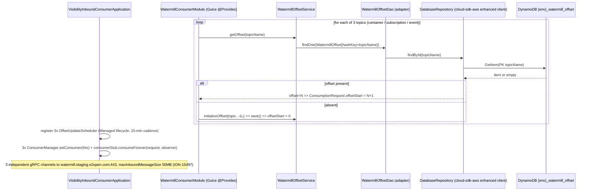
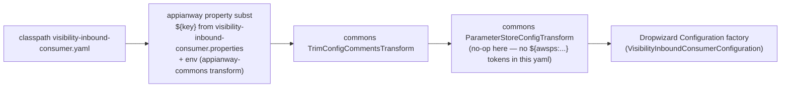

# `visibility-inbound-consumer` — AWS SDK v2 (cloud-sdk) Upgrade Design (claude)

> Module: `watermill/visibility-inbound-consumer` · Date: 2026-07-22 · Author: Claude (Opus 4.8)
> **Program foundation (do not duplicate):** [`2026-07-22-appianway-awsupgrade-foundation-claude.md`](../../../2026-07-22-appianway-awsupgrade-foundation-claude.md) — shared→commons/cloud-sdk mapping (§2), slim `appianway-commons` (§3), config/SSM model (§4), assumed cloud-sdk gaps S-G2/W-G9/X-G7/X-G8/C-G6 (§5, §5A), Maven template (§6), rollout order (§8). Module row: foundation §9 #14 — **"3 gRPC consumers; 3 DynamoDB offsets; SNS event_ce + 3 SQS."**
> **INT run/health evidence:** [`2026-07-22-appway-app-checkouts-run-config.md`](../../../2026-07-22-appway-app-checkouts-run-config.md) §4.14 (verified 2026-07-22 on the DW5/Jetty12 baseline — richest consumer, 3× DynamoDB offset read + 3× gRPC channel init, all clean, zero messages consumed).
> **Supersedes / updates:** [`2026-06-30-visibility-inbound-consumer-aws2x-upgrade-DESIGN-claude.md`](2026-06-30-visibility-inbound-consumer-aws2x-upgrade-DESIGN-claude.md) and [`...-plan-claude.md`](2026-06-30-visibility-inbound-consumer-aws2x-upgrade-plan-claude.md) (pre-`shared`-retirement drafts, cloud-sdk `1.0.26-SNAPSHOT`, "Option B" framing). Those drafts assumed `shared` itself would be *migrated in place*; the locked 2026-07-22 decision instead **retires `shared`** entirely — replacement is `commons` + `cloud-sdk-api` + `cloud-sdk-aws` + slim `appianway-commons`, target `mercury-services-commons 1.0.27-SNAPSHOT`. This doc re-bases all class-level mappings onto that model and folds in **watermill/consumer-commons** as a co-migrating dependency (not appianway-commons).
> **Baseline (unaffected by this doc):** Dropwizard 5.0.2 / Jetty 12.1.9 / Java 17 / Jackson 2.21.4 — DONE (ION-16098); >10 MB gRPC max message size — DONE (ION-15497, `maxInboundMessageSize(50*1024*1024)` in `ConsumerInitUtil`); component-name change — DONE (ION-13768). This doc is **AWS v1→v2 + drop-`shared` only**.

---

## 1. Overview

**Purpose.** `visibility-inbound-consumer` is the **richest** of the four appianway Watermill gRPC consumers. It runs **three independent gRPC stream consumers in a single process** against the e2open Watermill service:

| Consumer class | gRPC topic (INT) | Transforms via | Sends to SQS |
|---|---|---|---|
| `VisibilityInboundConsumer` | `INTTRA_INT-INTTRACONTAINEREVENT` | `ContainerEventTransformer` → `mercury:visibility` model (`ContainerEventSubmission`) | `inttra_int_sqs_ce_wm_inbound` (Shippeo container events) |
| `CargoVisibilitySubscriptionConsumer` | `INTTRA_INT-INTTRACWSUBSCRIPTIONRESPONSE` | `CargoVisibilitySubscriptionTransformer` → local `CargoVisibilitySubscription` model | `inttra_int_sqs_ce_cw_subscription_inbound` |
| `CargoVisibilityEventConsumer` | `INTTRA_INT-INTTRACWCONTAINEREVENT` | `ContainerEventProtoMapper` → local `ContainerEvent` model | `inttra_int_sqs_ce_cw_event_inbound` |

Each consumer has its **own** `OffsetUtil` (in-memory cursor), its own `OffsetUpdateScheduler` (15-minute DynamoDB flush), and shares a single `ConsumerManager`-per-topic reconnect/backoff wrapper. All three archive both the transformed JSON and the raw proto (and, on batch error, the whole batch) to the shared **S3 workspace bucket**, and all three route a `MetaData` envelope onto their respective SQS queue for `mercury-services` `visibility` to consume. `VisibilityInboundConsumer` additionally emits a workflow `Event` to **SNS** (`inttra_int_sns_event_ce`) via `EventLogger`.

**Current state.** AWS Java SDK v1 (`AmazonS3`, `AmazonSQS`, `AmazonSNS`, `AmazonDynamoDB`/`DynamoDBMapper`, SSM via `shared.parameterstore.ParameterStoreModule`) constructed directly in `ExternalServicesModule`/`WatermillConsumerModule`. Workflow model is `shared`'s `event.Event`/`event.EventLogger`/`task.MetaData`/`workspace.Annotations`. DynamoDB offset entity uses v1 `@DynamoDBTable`/`@DynamoDBHashKey`/`@DynamoDBAttribute`/`@DynamoDBTypeConverted`, mapped via a hand-rolled `DynamoDBMapper` + in-house `DynamoDBCrudRepository` (`dynamo-client` local-repo jar). gRPC/protobuf (`com.e2open.watermill.proto.*`, `ConsumerManager`, `ConsumerInitUtil`, the three transformers, `AuthCredentials`) is **not AWS** and does not change.

**Target.** `commons` + `cloud-sdk-api` + `cloud-sdk-aws` (`1.0.27-SNAPSHOT`) + slim `appianway-commons`, with the DynamoDB offset store, `S3PublishService`, `SQSClient`-equivalent, `SNSEventPublisher`-equivalent, and `ParameterStore`-equivalent consolidated in **`watermill/consumer-commons`** (shared by all 4 gRPC consumers, migrated once, consumed by this module unchanged in call shape). No `appianway-commons` residue is needed here beyond the composed config transform (§5) — the watermill consumers have no health-check glue (none registered) and no `AsyncDispatcher`/task-lifecycle usage of the appianway-commons kind (this module's own local `AsyncDispatcher`/`task` package is a **different, gRPC-lifecycle-only** dispatcher unrelated to the SQS-listener `AsyncDispatcher` in appianway-commons — see §6).

**Headline change.** This is the **widest AWS surface of the whole 14-module program on a single process**: 3× DynamoDB offset row + 3× SQS send target + 1× SNS publish + 1× S3 bucket, multiplied by the coordination hazard of **three concurrent gRPC streams sharing one Guice injector**. The correctness-critical piece is preserving the **exact physical table name and per-topic attribute values** in DynamoDB — three independent cursors coexist in one `{env}_watermill_offset` table keyed by topic name, and a silent remap of any one of them re-consumes a live tracking feed from offset 0. `S-G2` is **not** needed (every S3 write here is metadata-free, matching the 2026-06-30 finding). `W-G9` **is** relevant — every SQS-bound `MetaData` and the SNS-bound `Event`/`Annotations` ride the cloud-sdk-api workflow model, so annotation round-trip parity matters on both the error-annotation path (`extractWatermillErrorTokens`/`extractTokens` populate `Annotations` on transform failure) and the `EventLogger.logCloseRunEvent(..., tokens, annotations)` SNS path.

---

## 2. Current vs Target architecture

```mermaid
flowchart TB
    subgraph before["BEFORE — AWS v1 + shared, per-topic gRPC x3"]
        direction TB
        G1[("gRPC INTTRACONTAINEREVENT")] --> C1B["VisibilityInboundConsumer\nStreamObserver&lt;RawData&gt;"]
        G2[("gRPC INTTRACWSUBSCRIPTIONRESPONSE")] --> C2B["CargoVisibilitySubscriptionConsumer"]
        G3[("gRPC INTTRACWCONTAINEREVENT")] --> C3B["CargoVisibilityEventConsumer"]
        C1B --> TR1["ContainerEventTransformer\n-> mercury:visibility model"]
        C2B --> TR2["CargoVisibilitySubscriptionTransformer"]
        C3B --> TR3["ContainerEventProtoMapper"]
        C1B --> S3B1["S3PublishService.uploadToS3\n(consumer-commons, v1 AmazonS3,\nPutObjectResult ignored)"]
        C2B --> S3B1
        C3B --> S3B1
        C1B --> SQB["shared SQSClient.sendMessage\n(v1 AmazonSQS \"amazonSQSForSender\")"]
        C2B --> SQB
        C3B --> SQB
        C1B --> SNB["shared SNSEventPublisher\n(v1 AmazonSNS)"]
        C1B --> OU1["OffsetUtil x3 (in-memory)"]
        C2B --> OU1
        C3B --> OU1
        OU1 --> SCH1["OffsetUpdateScheduler x3\n(consumer-commons, 15 min)"]
        SCH1 --> DAOB["WatermillOffsetDao extends\nDynamoDBCrudRepository\n(v1 DynamoDBMapper, dynamo-client jar)"]
        DAOB --> DDBB[("DynamoDB {env}_watermill_offset\n3 rows keyed by topicName")]
        S3B1 --> S3BKT[("inttra-int-workspace")]
        SQB --> SQSQB[("3 SQS: ce_wm_inbound /\nce_cw_subscription_inbound / ce_cw_event_inbound")]
        SNB --> SNSB[("SNS inttra_int_sns_event_ce")]
        AC1["AuthCredentials (gRPC)"] --> PSB["shared ParameterStoreModule\n(v1 AWSSimpleSystemsManagement)"]
    end
    subgraph after["AFTER — commons + cloud-sdk (AWS v2), gRPC layer UNCHANGED"]
        direction TB
        G1A[("gRPC INTTRACONTAINEREVENT")] --> C1A["VisibilityInboundConsumer (unchanged)"]
        G2A[("gRPC INTTRACWSUBSCRIPTIONRESPONSE")] --> C2A["CargoVisibilitySubscriptionConsumer (unchanged)"]
        G3A[("gRPC INTTRACWCONTAINEREVENT")] --> C3A["CargoVisibilityEventConsumer (unchanged)"]
        C1A --> TR1A["transformers (unchanged,\nrecompiled vs visibility jar)"]
        C2A --> TR2A[same]
        C3A --> TR3A[same]
        C1A --> S3A1["S3PublishService.uploadToS3\n(consumer-commons, over StorageClient)"]
        C2A --> S3A1
        C3A --> S3A1
        C1A --> SQA["SQSClient equivalent over\ncloud-sdk-api MessagingClient&lt;String&gt;"]
        C2A --> SQA
        C3A --> SQA
        C1A --> SNA["SNSEventPublisher equivalent over\ncloud-sdk-api NotificationService"]
        C1A --> OU2["OffsetUtil x3 (in-memory, unchanged)"]
        C2A --> OU2
        C3A --> OU2
        OU2 --> SCH2["OffsetUpdateScheduler x3\n(consumer-commons, unchanged shape)"]
        SCH2 --> DAOA["WatermillOffsetDao adapter over\nDatabaseRepository&lt;WatermillOffset,String&gt;\n(cloud-sdk-aws DynamoRepositoryFactory)"]
        DAOA --> DDBA[("DynamoDB {env}_watermill_offset\nSAME 3 rows, SAME attribute names")]
        S3A1 --> S3BKTA[("inttra-int-workspace")]
        SQA --> SQSQA[("SAME 3 SQS queues")]
        SNA --> SNSA[("SAME SNS topic")]
        AC1A["AuthCredentials (gRPC, unchanged)"] --> PSA["ParameterStore equivalent over\ncloud-sdk-api CloudParameterStore"]
    end
    before -.migrate.-> after
```

### 2.1 Class-level mapping

| `shared`/v1 element (this module + `consumer-commons`) | Replacement | Home | Notes |
|---|---|---|---|
| `com.amazonaws.services.s3.AmazonS3` (+ `AmazonS3ClientBuilder`) | `cloud-sdk-api` `StorageClient` | cloud-sdk-api/aws | `S3PublishService.uploadToS3(bucket, key, String payload)` → `StorageClient.putObject(bucket,key,bytes)`. **Metadata-free ⇒ S-G2 not used.** |
| `com.amazonaws.services.sqs.AmazonSQS` (`@Named("amazonSQSForSender")`, `AWSClientConfiguration.sqs_sender`) | `cloud-sdk-api` `MessagingClient<String>` | cloud-sdk-api/aws | `shared.messaging.SQSClient.sendMessage(url, body)` → `MessagingClient<String>.sendMessage(url, body)`. Producer-only here (no listener — this module never polls SQS). |
| `com.amazonaws.services.sns.AmazonSNS` (`AWSClientConfiguration.sns_publish`) | `cloud-sdk-api` `NotificationService` | cloud-sdk-api/aws | `shared.event.SNSEventPublisher(topicArn, SNSClient)` → wraps `NotificationService.publish(topicArn, message)`. |
| `AmazonDynamoDB`/`AmazonDynamoDBClientBuilder`, `DynamoDBMapper`/`DynamoDBMapperConfig`, in-house `DynamoDBCrudRepository` (`dynamo-client` jar) | `DatabaseRepository<WatermillOffset,String>` via `DynamoRepositoryFactory` | cloud-sdk-api/aws | `WatermillOffsetDao` becomes a thin adapter (`findOne`/`save`/`update` signatures preserved so `WatermillOffsetService`/`OffsetUtil`/`OffsetUpdateScheduler` are **untouched**). |
| `@DynamoDBTable("watermill_offset")`, `@DynamoDBHashKey(attributeName="topicName")`, `@DynamoDBAttribute offset/readDateTime/writeDateTime`, `@DynamoDBTypeConverted(DateToEpochSecond)`, `@DynamoDBStream(KEYS_ONLY)` | `@Table("watermill_offset")` + `@DynamoDbPartitionKey @DynamoDbField("topicName")` + `@DynamoDbField(...)` + `LongEpochSecondAttributeConverter` | cloud-sdk-api | **Exact attribute names + epoch-seconds shape preserved** — this is the correctness-critical remap (§10 R1). |
| `DynamoSupport.newClient`/`newMapper`/`newDynamoDBMapperConfig` (`AwsClientBuilder.EndpointConfiguration`, table-name-prefix resolver) | `DynamoDbClientConfig.endpointOverride(...)` + `Region.of(signingRegion)`; `DynamoRepositoryFactory.createEnhancedRepository(..., tableName="{env}_watermill_offset")` (explicit prefix, not a resolver) | cloud-sdk-aws | Table-name prefix logic moves from a per-class `TableNameResolver` to an explicit `tableName` argument — same resulting physical name. |
| `com.inttra.mercury.shared.parameterstore.ParameterStoreModule` + `ParameterSupplier` (v1 `AWSSimpleSystemsManagement`) | `CloudParameterStore` | cloud-sdk-api/aws | `AuthCredentials` (gRPC call credentials, unchanged class) reads `userIdKey`/`passwordKey` via the migrated `ParameterSupplier` implementation — **gRPC layer itself is untouched**, only the SSM client underneath. |
| `com.inttra.mercury.shared.event.{Event,EventLogger,RandomGenerator}` | cloud-sdk-api `notification.workflow.{Event,EventLogger,EventGenerator}` | cloud-sdk-api | `EventLogger.logCloseRunEvent(metaData, Event.SubType.CLOSE_WORKFLOW, rootWorkflowId, null, componentName, startDateTime, eventStatus, tokens, annotations)` — same 9-arg call shape; consumed on all 3 consumers' per-item and per-batch error paths. |
| `com.inttra.mercury.shared.task.MetaData` (`MetaData.Builder(...)`, `.getProjections()`, `.toJsonString()`) | cloud-sdk-api `notification.workflow.MetaData` | cloud-sdk-api | Field-identical per foundation §5A; `Builder` 7-arg constructor and `Projection` map usage unchanged. |
| `com.inttra.mercury.shared.workspace.{Annotation,Annotations}` | cloud-sdk-api `notification.annotation.{Annotation,Annotations}` | cloud-sdk-api | Used on **every** transform-failure and batch-failure branch in all 3 consumers (`annotations.addAnnotations(ERROR, EXCEPTION, stackTrace)`). W-G9-relevant (§6). |
| `shared.command.ConfigProcessingServerCommand` + `shared.config.S3ConfigurationProvider` | `commons` `ConfigProcessingServerCommand` + composed appianway transform; `S3ConfigurationProvider` retained (appianway-local) if `CONFIG_LOCATION=s3` | commons + appianway-commons | §5. Not exercised at INT (filesystem config, confirmed §4.14 of run-config). |
| `com.inttra.mercury.dynamo.respository.module.DynamoDbConfig` (config POJO field on `VisibilityInboundConsumerConfiguration`) | cloud-sdk-aws `DynamoDbClientConfig`-compatible POJO (or retain the existing POJO shape if cloud-sdk-aws accepts it directly) | cloud-sdk-aws | Field names (`environment`, `readCapacityUnits`, `writeCapacityUnits`, `sseEnabled`) **unchanged** in the YAML. |
| `shared.config.{S3Config, SNSConfig}` (fields on `VisibilityInboundConsumerConfiguration`) | cloud-sdk config equivalents (`CloudStorageConfig`, `NotificationClientConfig`) or retained shape if binary-compatible | cloud-sdk-aws / module | `s3WorkspaceConfig.bucket`, `snsEventConfig.topicArn` field names unchanged. |
| gRPC/protobuf (`com.e2open.watermill.proto.*`, `ConsumerManager`, `ConsumerInitUtil`, `AuthCredentials`, three transformers, `WatermillServiceConfig`, `HealthCheckConfig`) | **UNCHANGED — not AWS** | module / consumer-commons | Including the >10 MB `maxInboundMessageSize` (ION-15497, already done) and the reconnect/backoff logic in `ConsumerManager`. |
| `com.inttra.mercury:visibility:1.0.M` model jar (`com.inttra.mercury.visibility.common.model.*`) | **same jar, retained as a domain dependency** — not part of the AWS migration | module (external) | `ContainerEventSubmission`, `Date`, `DateFormat`, `containerEvent.*` types. No cloud-sdk relationship; kept exactly as-is per this program's scope (AWS v1→v2 + drop-`shared` only — model-jar version alignment is **out of scope** for this doc). |

---

## 3. AWS touchpoints

| Touchpoint | Direction | INT resource name | cloud-sdk client | Notes |
|---|---|---|---|---|
| gRPC (topic 1) | inbound (consume) | `INTTRA_INT-INTTRACONTAINEREVENT` @ `watermill.staging.e2open.com:443`, tenant `INTTRA_INT` | n/a (not AWS) | `VisibilityInboundConsumer`; Shippeo container events. |
| gRPC (topic 2) | inbound (consume) | `INTTRA_INT-INTTRACWSUBSCRIPTIONRESPONSE` (same host/tenant) | n/a | `CargoVisibilitySubscriptionConsumer`. |
| gRPC (topic 3) | inbound (consume) | `INTTRA_INT-INTTRACWCONTAINEREVENT` (same host/tenant) | n/a | `CargoVisibilityEventConsumer`. |
| DynamoDB (offset 1) | read+write | `{inttra_int}_watermill_offset`, hash key `topicName = INTTRA_INT-INTTRACONTAINEREVENT` | `DatabaseRepository<WatermillOffset,String>` (cloud-sdk-aws enhanced client) | Verified INT offset **35** at last check (run-config §4.14). |
| DynamoDB (offset 2) | read+write | same table, hash key `topicName = INTTRA_INT-INTTRACWSUBSCRIPTIONRESPONSE` | same | Verified INT offset **43**. |
| DynamoDB (offset 3) | read+write | same table, hash key `topicName = INTTRA_INT-INTTRACWCONTAINEREVENT` | same | Verified INT offset **79**. |
| S3 | write only (metadata-free) | `inttra-int-workspace` (`s3WorkspaceConfig.bucket`) | `StorageClient.putObject(bucket,key,bytes)` | Shared by all 3 consumers: transformed-JSON object, raw-proto (`_proto` suffix) object, and on `batchSize>1 && error` the whole batch JSON. **S-G2 not needed.** |
| SNS | publish only | `arn:aws:sns:us-east-1:081020446316:inttra_int_sns_event_ce` (`snsEventConfig.topicArn`) | `NotificationService` (via consumer-commons `SNSEventPublisher` equivalent) | Only `VisibilityInboundConsumer` publishes today (`snsEventPublisher` bound in `WatermillConsumerModule`); `EventLogger.logCloseRunEvent(...)` is the call site on all 3, but only the container-event path is wired to the publisher provider — confirm on migration whether the other two consumers should also emit (§10). |
| SQS (out 1) | producer | `inttra_int_sqs_ce_wm_inbound` (`shippeoInboundQueueUrl`) | `MessagingClient<String>.sendMessage(url, MetaData.toJsonString())` | Consumed downstream by `mercury-services` `visibility` (Shippeo container events). |
| SQS (out 2) | producer | `inttra_int_sqs_ce_cw_subscription_inbound` (`cargoVisibilitySubscriptionQueueUrl`) | same | Consumed downstream by `visibility-wm-inbound-processor` (`CargoVisibilitySubscriptionProcessor`, updates APPROVED/REJECTED subscription state). |
| SQS (out 3) | producer | `inttra_int_sqs_ce_cw_event_inbound` (`cargoVisibilityEventQueueUrl`) | same | Consumed downstream by `mercury-services` `visibility` (CargoWise container events). |
| SES | — | n/a | n/a | Not used. |
| Param Store (SSM) | resolved at gRPC-call time (not boot) | `/inttra/int/appianway/watermill-grpc/se/username`, `/inttra/int/appianway/watermill-grpc/se/password` | `CloudParameterStore` (via `ParameterSupplier`) | One `username`/`password` key pair shared across all 3 topics (`watermillServiceConfig.userIdKey`/`passwordKey`); `AuthCredentials` reads them per-topic instance but from the same SSM paths. No `networkServiceConfig` block → no `AuthClient`/`/auth` HTTP call (unlike splitter/transformer/ingestor). |
| Port | n/a | `8085` (`server.connector.port:-8085`) | n/a | No parent pom; `../../configuration/int/...` (two levels up). No health checks registered — `opsHealthcheck` → 404 (verified §4.14 of run-config). |

---

## 4. Sequence diagrams

### 4.1 Startup — seed three consumption offsets + open three gRPC channels



### 4.2 Steady state — Shippeo container event: consume → transform → S3 + SQS + SNS → offset

```mermaid
sequenceDiagram
    participant G as gRPC (INTTRACONTAINEREVENT)
    participant C as VisibilityInboundConsumer
    participant TR as ContainerEventTransformer (-> mercury:visibility model)
    participant S3P as S3PublishService
    participant SC as StorageClient (cloud-sdk-aws)
    participant Q as SQSClient-equivalent -> MessagingClient&lt;String&gt;
    participant EL as EventLogger -> NotificationService (SNS)
    participant OU as OffsetUtil (in-memory, per topic)
    G-->>C: RawData @ offset k, batch of ContainerEvent upserts
    loop each ContainerEvent in batch
        C->>TR: transform(containerEvent) -> ContainerEventSubmission
        C->>S3P: uploadToS3(bucket, workspaceFileName, rawJson)
        S3P->>SC: putObject(bucket, key, bytes)  %% metadata-free, no S-G2
        C->>C: metaData.getProjections().put("messageType","ShippeoContainerEvent")
        C->>Q: sendMessage(shippeoInboundQueueUrl, metaData.toJsonString())
        C->>S3P: uploadToS3(bucket, workspaceFileName+"_proto", rawInputProtoJson)
        C->>EL: logCloseRunEvent(metaData, CLOSE_WORKFLOW, rootWorkflowId, ..., tokens, annotations)
        EL->>EL: publish Event via SNSEventPublisher(snsEventConfig.topicArn)
    end
    C->>OU: updateOffset(k)   %% in-memory; flushed by this topic's scheduler
```

### 4.3 CW subscription response — consume → transform → SQS (subscription state return path)

```mermaid
sequenceDiagram
    participant G as gRPC (INTTRACWSUBSCRIPTIONRESPONSE)
    participant C as CargoVisibilitySubscriptionConsumer
    participant TR as CargoVisibilitySubscriptionTransformer
    participant S3P as S3PublishService
    participant Q as SQSClient-equivalent -> MessagingClient&lt;String&gt;
    participant OU as OffsetUtil
    G-->>C: RawData @ offset k (CargowiseSubscription upserts)
    loop each subscription
        C->>TR: transform(subscription) -> CargoVisibilitySubscription (local model)
        C->>S3P: uploadToS3(bucket, workspaceFileName, rawJson)
        C->>C: metaData.getProjections().put("messageType","CargoVisibilitySubscription")
        C->>Q: sendMessage(cargoVisibilitySubscriptionQueueUrl, body)
    end
    C->>OU: updateOffset(k)
    Note over Q: consumed by mercury-services visibility-wm-inbound-processor\n(CargoVisibilitySubscriptionProcessor updates APPROVED/REJECTED)
```

### 4.4 Periodic offset flush + gRPC error/reconnect (per topic)

```mermaid
sequenceDiagram
    participant Sched as OffsetUpdateScheduler (x3, one per topic)
    participant Svc as WatermillOffsetService
    participant R as DatabaseRepository
    participant DDB as DynamoDB
    participant CM as ConsumerManager (x3, one per topic)
    Note over Sched: every offsetUpdateDelay (15 min, watermill-grpc.consumer.offsetUpdateDelay)
    Sched->>Svc: updateOffset(topic, offsetUtil.getOffset())
    Svc->>R: save/update(WatermillOffset{topicName,offset,readDateTime})  %% last-writer-wins
    R->>DDB: PutItem (enhanced client; default extensions inert, no @DynamoDbVersionAttribute)
    Note over CM: on gRPC onError (per topic, independently)
    CM->>Svc: updateOffset(topic, offsetUtil.getOffset())  %% persist before reconnect
    CM->>CM: determineIfShouldRetry (NonRetryableException -> respect maxRetry, else always retry)
    CM->>CM: sleep retryDelay seconds, then reconnect(): new ManagedChannel + consumeForever(persisted+1, SAME observer)
```

**At-least-once preserved, per topic independently:** each of the 3 topics advances its own in-memory cursor and is flushed by its own `OffsetUpdateScheduler` (`Managed.stop()` also flushes on shutdown); on restart or reconnect each stream resumes at `persisted+1`. A crash between flushes re-consumes from the last persisted offset for **that topic only** — identical behavior to today's v1 implementation (last-writer-wins `PutItem`, no conditional write).

---

## 5. Configuration changes

### 5.1 Property-key table (INT values — exact, unchanged names/values)

| YAML key | `.properties` source (`conf/int/visibility-inbound-consumer.properties`) | INT value | Notes |
|---|---|---|---|
| `componentName` | `componentName` | `visibility-inbound-consumer` | `${componentName:-visibility-inbound-consumer}` in yaml. |
| `healthCheckConfig.errorRateThreshold` | `watermill-grpc.consumer.healthCheckConfig.errorRateThreshold` | *(unset → default `5.0`)* | Config POJO field exists but **no health checks are registered** (confirmed §4.14 run-config) — value is config-resolved only. |
| `healthCheckConfig.networkServiceHealthCheckUrl` | `networkservices.healthCheckUrl` | *(from `network-services.properties`)* | Same — unused by any registered check. |
| `s3WorkspaceConfig.bucket` | `watermill-grpc.consumer.s3WorkspaceConfig.bucket` | `inttra-int-workspace` | |
| `server.connector.port` | `server.connector.port` | *(unset → default `8085`)* | **Not 8081** — watermill consumers default to 8085. |
| `watermillServiceConfig.userIdKey` | `watermill-grpc.consumer.username.key` | `/inttra/int/appianway/watermill-grpc/se/username` | SSM path, see §5.2. |
| `watermillServiceConfig.passwordKey` | `watermill-grpc.consumer.password.key` | `/inttra/int/appianway/watermill-grpc/se/password` | SSM path, see §5.2. |
| `watermillServiceConfig.tenant` | `watermill-grpc.consumer.tenant` | `INTTRA_INT` | Sent as gRPC call-credential metadata (`AuthCredentials`), not AWS. |
| `watermillServiceConfig.host` | `watermill-grpc.consumer.host` | `watermill.staging.e2open.com` | External e2open service, not AWS. |
| `watermillServiceConfig.port` | `watermill-grpc.consumer.port` | `443` | |
| `watermillServiceConfig.topicName` | `watermill-grpc.consumer.topic.name` | `INTTRA_INT-INTTRACONTAINEREVENT` | Topic 1 (Shippeo container events). |
| `watermillServiceConfig.subscriptionTopicName` | `watermill-grpc.consumer.cargo-visibility.subscription.topic.name` | `INTTRA_INT-INTTRACWSUBSCRIPTIONRESPONSE` | Topic 2. |
| `watermillServiceConfig.eventTopicName` | `watermill-grpc.consumer.cargo-visibility.event.topic.name` | `INTTRA_INT-INTTRACWCONTAINEREVENT` | Topic 3. |
| `watermillServiceConfig.retryDelay` | `watermill-grpc.consumer.retryDelay` | *(unset → default `10`)* | Seconds; `ConsumerManager` backoff before reconnect. |
| `watermillServiceConfig.maxRetry` | `watermill-grpc.consumer.maxRetry` | *(unset → default `3`)* | Applies per `ConsumerManager` instance (per topic). |
| `watermillServiceConfig.offsetUpdateDelay` | `watermill-grpc.consumer.offsetUpdateDelay` | `15` | Minutes; drives all 3 `OffsetUpdateScheduler`s. |
| `watermillServiceConfig.keepAliveTime` | `watermill-grpc.consumer.keepAliveTime.seconds` | `30` | gRPC channel, not AWS. |
| `watermillServiceConfig.keepAliveTimeout` | `watermill-grpc.consumer.keepAliveTimeout.seconds` | `20` | |
| `watermillServiceConfig.idleTimeout` | `watermill-grpc.consumer.idleTimeout.minutes` | `30` | |
| `dynamoDbConfig.readCapacityUnits` / `writeCapacityUnits` | *(literal in yaml, not `.properties`)* | `25` / `25` | Table-create-time only. |
| `dynamoDbConfig.environment` | `watermill-grpc.dynamo.environment` | `inttra_int` | Table-name prefix → physical table `inttra_int_watermill_offset`. |
| `dynamoDbConfig.sseEnabled` | *(literal in yaml)* | `false` | |
| `snsEventConfig.topicArn` | `watermill-grpc.consumer.snsEventConfig.topicArn` | `arn:aws:sns:us-east-1:081020446316:inttra_int_sns_event_ce` | |
| `shippeoInboundQueueUrl` | `watermill-grpc.consumer.shippeo-event.processor.queueUrl` | `https://queue.amazonaws.com/081020446316/inttra_int_sqs_ce_wm_inbound` | |
| `cargoVisibilitySubscriptionQueueUrl` | `watermill-grpc.consumer.cargo-visibility-subscription.processor.queueUrl` | `https://queue.amazonaws.com/081020446316/inttra_int_sqs_ce_cw_subscription_inbound` | |
| `cargoVisibilityEventQueueUrl` | `watermill-grpc.consumer.cargo-visibility-event.processor.queueUrl` | `https://queue.amazonaws.com/081020446316/inttra_int_sqs_ce_cw_event_inbound` | |
| `logging.level` | `watermill-grpc.consumer.logging.level` | *(unset → default `INFO`)*; `com.inttra.mercury` hardcoded `DEBUG` in yaml | |

**gRPC max message size (ION-15497, call out per instruction).** `ConsumerInitUtil.getChannel(...)` hardcodes `.maxInboundMessageSize(50 * 1024 * 1024)` on the `NettyChannelBuilder` (not a `${...}` property) — already >10 MB, already done, **not AWS**, unaffected by this migration.

**No renames.** All property keys/values above are unchanged from today's yaml/properties — this is a client/library migration only.

### 5.2 SSM parameter table

| Path | Resolution mechanism | Consumer |
|---|---|---|
| `/inttra/int/appianway/watermill-grpc/se/username` | Runtime, per gRPC channel — `ParameterSupplier.getValue(key)` → `CloudParameterStore` (v2 SSM `GetParameter`) at `AuthCredentials` construction | Shared by all 3 topics' `AuthCredentials` instances (same `userIdKey`) |
| `/inttra/int/appianway/watermill-grpc/se/password` | Same mechanism | Same |

**Not boot-time `${awsps:...}`.** Unlike splitter/transformer/ingestor's network-services auth (which could move to boot-time YAML resolution), these two paths are read **on gRPC call**, not at Dropwizard boot, and there is no `networkServiceConfig` block in this module's yaml — keep the existing runtime-resolution model (`ParameterSupplier`/`CloudParameterStore`), do **not** convert to `${awsps:/path}` boot-time substitution; that would require plumbing `AuthCredentials`' construction through the config-command chain instead of Guice, which is unnecessary churn for two values already resolved correctly today. `usePassThrough` is not used by this module (no `network-services.properties` reliance for these two keys — they are watermill-specific, not `networkservices.*`).

### 5.3 Config-command wiring



`T3` is present in the composed chain for consistency with the other 13 modules but is a **structural no-op** — there is nothing in `visibility-inbound-consumer.yaml` for it to resolve (the two SSM paths above are Guice/runtime-resolved, not yaml `${awsps:...}` tokens). `VisibilityInboundConsumerApplication.initialize(...)` swaps `com.inttra.mercury.shared.command.ConfigProcessingServerCommand` for the commons one wrapped by the appianway composition — same as every other module. `S3ConfigurationProvider.requiresS3Configuration()` conditional stays, unexercised at INT (filesystem config).

### 5.4 `../../configuration` note (no parent pom)

`watermill/pom.xml` has **no parent** (it is a standalone reactor root, mirroring the DW5/Jetty12/Jackson BOM pins locally — see §7) — so `visibility-inbound-consumer`, like its 3 sibling consumers, resolves shared properties files **two** directory levels up: `../../configuration/int/network-services.properties` and `../../configuration/int/datadog.properties` (vs. `../configuration/int/...` for the 10 non-watermill modules, which sit one level below the appianway root). This CLI shape is **unchanged** by the AWS migration:

```
run visibility-inbound-consumer.yaml conf/int/visibility-inbound-consumer.properties \
  ../../configuration/int/network-services.properties ../../configuration/int/datadog.properties
```

### 5.5 Transform composition (module-specific, non-AWS but load-bearing)

Each of the 3 consumers composes exactly one transformer per topic, unaffected by the AWS migration:
- `VisibilityInboundConsumer` → `new ContainerEventTransformer()` (instantiated inline, not injected) → `ContainerEventSubmission` (mercury:visibility jar).
- `CargoVisibilityEventConsumer` → injected `ContainerEventProtoMapper mapper` → local `com.inttra.watermill.consumer.visibility.inbound.model.ContainerEvent`.
- `CargoVisibilitySubscriptionConsumer` → static `CargoVisibilitySubscriptionTransformer.transform(...)` → local `CargoVisibilitySubscription`.

These stay **exactly as-is**; only the S3/SQS/SNS/DynamoDB calls downstream of them change client.

### 5.6 What's unchanged

- CLI arg shape and `-DCONFIG_REGION=US_EAST_1` VM arg.
- Port **8085** default, no health checks, `opsHealthcheck` → 404 (confirmed §4.14 run-config).
- All 3 topic names, all 3 SQS queue URLs, the SNS topic ARN, the S3 bucket name, the DynamoDB `environment` prefix — **none renamed**.
- gRPC host/port/tenant, `maxInboundMessageSize` 50 MB, keep-alive/idle timeouts.

---

## 6. cloud-sdk / commons dependencies & assumed gaps

| Gap ID | Relevant here? | How this module exercises it |
|---|---|---|
| **S-G2** | **No.** | Every S3 write (`S3PublishService.uploadToS3`) is metadata-free — `PutObjectResult` is discarded, no `ObjectMetadata`/content-type set today, and none is added. Confirmed unchanged from the 2026-06-30 finding. Maps to the plain `StorageClient.putObject(bucket,key,bytes)` overload that already exists. |
| **W-G9** | **Yes.** | This module both **produces** `MetaData` (onto 3 SQS queues, consumed by `mercury-services` `visibility`) and **emits** `Event`+`Annotations` (via `EventLogger.logCloseRunEvent`, SNS-bound). Every consumer's `catch (TransformationException \| Exception e)` branch constructs an `Annotations` and calls `annotations.addAnnotations(ERROR, EXCEPTION, stackTrace)` — if cloud-sdk-api's `Event.Builder` drops annotations on parse (the confirmed W-G9.1 defect, foundation §5A), any downstream re-hydration of this module's own archived `_proto`/batch JSON that carries annotations would silently lose them. The **direct SNS emission path is write-only** here (this module only *produces* `Event`s, never *consumes* them back), so W-G9.1 is lower-severity for this module than for event-writer, but the **`extractWatermillErrorTokens`/`extractTokens` → `Annotation`/`Annotations` shape** must still match cloud-sdk-api's identically (confirmed ✅ identical per foundation §5A) since these objects are serialized directly via `MetaData`/`Event` JSON. W-G9.2 (missing `Projection`/`Token` constants) does not block this module — it uses ad-hoc `Map` keys (`"messageType"`, `TOKENS_*` constants) rather than `MetaData.Projection.*`/`Event.Token.*` enums, so no source dependency on the missing constants. |
| **X-G7** | No. | No email in this module. |
| **X-G8** | No. | No OpenSearch/Jest in this module. |
| **C-G6** | Optional, not required. | §5.3 composition works today without commons widening `getConfigTransformer` visibility. |

**What consolidates in `watermill/consumer-commons`** (shared by all 4 gRPC consumers, migrated once, consumed here unchanged in call shape):
- `WatermillOffset` (entity remap to `@Table`/`@DynamoDbPartitionKey`/`@DynamoDbField`/`LongEpochSecondAttributeConverter`).
- `WatermillOffsetDao` (adapter over `DatabaseRepository<WatermillOffset,String>` via `DynamoRepositoryFactory`; keeps `findOne`/`save`/`update`).
- `WatermillOffsetService`, `OffsetUtil`, `OffsetUpdateScheduler` — **unchanged call shape**, since the DAO is the only thing being rebound.
- `S3PublishService` — rebinds its injected `AmazonS3` → `StorageClient`.
- `DynamoSupport` — replaced by cloud-sdk-aws's `DynamoDbClientConfig`/`DynamoRepositoryFactory` wiring.

**What stays module-local (single consumer, no commons/appianway-commons move):**
- The three `StreamObserver<RawData>` consumer classes, `ConsumerManager`, `ConsumerInitUtil`, `AuthCredentials`, `WatermillConsumerModule`/`ExternalServicesModule` (Guice wiring — rebinds AWS clients but stays module-local), the three transformers, and the local `AsyncDispatcher`/`task` package (this is a **gRPC-lifecycle task dispatcher local to this module**, distinct from — and not to be confused with — the appianway-commons `AsyncDispatcher` used by the SQS-listener modules like dispatcher/distributor/email-sender; this module has no SQS listener, only an SQS *sender*, so it does not need appianway-commons' concurrency residue at all).
- `com.inttra.mercury:visibility` model jar dependency and its consumption — out of scope for this AWS-only migration (§2.1 last row).

---

## 7. Maven dependency changes

**Current parent (unchanged by this migration):**
```xml
<parent>
    <groupId>com.inttra.mercury</groupId>
    <artifactId>watermill</artifactId>
    <version>1.0</version>
</parent>
```
This is **not** the appianway root pom — `watermill/pom.xml` is a standalone reactor root with **no parent of its own** (confirmed: `watermill/pom.xml` has `<groupId>com.inttra.mercury</groupId><artifactId>watermill</artifactId><packaging>pom</packaging>` and no `<parent>` block). It already mirrors the DW5/Jetty12/Jackson-2.21.4/httpcore BOM pins locally (ION-16098) so the 4 consumer modules build consistently without inheriting the appianway root's `dependencyManagement`. This migration adds the cloud-sdk/commons BOM mirror to that **same** `watermill/pom.xml` `dependencyManagement` block, alongside the existing Jetty/Jackson/httpcore pins:

```xml
<!-- watermill/pom.xml <properties> -->
<mercury.commons.version>1.0.27-SNAPSHOT</mercury.commons.version>
```
```xml
<!-- watermill/pom.xml <dependencyManagement><dependencies> -->
<dependency><groupId>com.inttra.mercury</groupId><artifactId>cloud-sdk-api</artifactId><version>${mercury.commons.version}</version></dependency>
<dependency><groupId>com.inttra.mercury</groupId><artifactId>cloud-sdk-aws</artifactId><version>${mercury.commons.version}</version></dependency>
<dependency><groupId>com.inttra.mercury</groupId><artifactId>commons</artifactId><version>${mercury.commons.version}</version></dependency>
```

**`visibility-inbound-consumer/pom.xml` — remove:**
```xml
<!-- transitively via consumer-commons + shared: -->
com.amazonaws:aws-java-sdk-s3
com.amazonaws:aws-java-sdk-sqs
com.amazonaws:aws-java-sdk-sns
com.amazonaws:aws-java-sdk-ssm
com.amazonaws:aws-java-sdk-dynamodb
com.amazonaws:aws-java-sdk-core
<!-- the in-house dynamo-client local-repo jar, once DynamoDBCrudRepository/DynamoSupport usage is gone: -->
<dependency>
    <groupId>com.inttra.mercury</groupId>
    <artifactId>dynamo-client</artifactId>
    <version>1.0</version>
    <!-- ... exclusions ... -->
</dependency>
```
`com.inttra.mercury:shared` is not a direct dependency of this module's pom today (it arrives transitively via `consumer-commons`); it is retired program-wide, so it disappears once `consumer-commons` migrates.

**`visibility-inbound-consumer/pom.xml` — add:**
```xml
<dependency>
    <groupId>com.inttra.mercury</groupId>
    <artifactId>cloud-sdk-api</artifactId>
    <!-- version managed by watermill/pom.xml dependencyManagement -->
</dependency>
<dependency>
    <groupId>com.inttra.mercury</groupId>
    <artifactId>cloud-sdk-aws</artifactId>
</dependency>
<dependency>
    <groupId>com.inttra.mercury</groupId>
    <artifactId>commons</artifactId>
</dependency>
```
- `consumer-commons` (already a direct dependency, version `1.0`) — no version bump needed at this module's pom, since `consumer-commons` migrates its own internals in place.
- `com.inttra.mercury:visibility:1.0.M` — **retained unchanged**, plus its local repo (`<repository id="visibility-local-repo">` pointing at `lib/`) — **out of scope** for this AWS-only doc (contrast the 2026-06-30 draft, which coupled this to an ION-12316 model-jar bump; that coupling is **not** part of this migration's scope).
- AWS SDK v2 arrives transitively via `cloud-sdk-aws` (managed by the mercury-services-commons BOM mirrored in `watermill/pom.xml`); do **not** declare v1 or v2 AWS artifacts directly.
- No `appianway-commons` dependency is required for this module (§6 — no SQS-listener concurrency, no health-check glue to rebind).

**Align (unaffected, already done by ION-16098):**
- `io.dropwizard.version` 5.0.2, `jetty.version` 12.1.9, `jackson.bom.version` 2.21.4, `httpcore5`/`httpcomponents4` pins, `google-guice` 7.0.0, Java 17 — all in `watermill/pom.xml`'s `dependencyManagement`/`properties`, inherited by this module via its `<parent>watermill</parent>`.
- `io.grpc:*` 1.77.0, `protoc-gen-grpc-java`, `com.google.protobuf:protoc:4.33.1` — **unchanged, non-AWS**.
- JUnit Jupiter 5.14.2 / Mockito 4.11.0 / AssertJ 3.24.2 — already in this module's own `<properties>`, no vintage-engine bridge needed (tests are already JUnit 5).

**Verify:**
- `mvn -pl watermill/visibility-inbound-consumer -am clean verify` green (shade plugin needs `clean` — stale fat jars otherwise, per foundation §6).
- Fat-jar boot from `watermill/visibility-inbound-consumer/`: `java -DCONFIG_REGION=US_EAST_1 -jar target/visibility-inbound-consumer-1.0.jar run visibility-inbound-consumer.yaml conf/int/visibility-inbound-consumer.properties ../../configuration/int/network-services.properties ../../configuration/int/datadog.properties` — expect the same 3× DynamoDB-offset-read + 3× gRPC-channel-init evidence captured in run-config §4.14, now backed by cloud-sdk-aws v2 clients.

---

## 8. Tests

**Direction:** already JUnit 5 (Jupiter) + Mockito throughout (`VisibilityInboundConsumerApplicationTest`, `ConsumerManagerTest`, `AuthCredentialsTest`, `WatermillConsumerModuleTest`, `ExternalServicesModuleTest`, the 4 grpc-consumer tests, 3 task tests, transformer tests) — **no JUnit 4→5 migration needed**, unlike several of the core-10 modules.

**Offset persistence (per topic, in `consumer-commons`):**
- Move `WatermillOffsetDaoTest`/`WatermillOffsetServiceTest` to a `dynamo-integration-test` fixture (DynamoDB-Local). Assert write→read round-trip; attribute names `topicName`/`offset`/`readDateTime`/`writeDateTime` stored **exactly**; epoch-**seconds** date value via `LongEpochSecondAttributeConverter`; `findById(absent)` → empty → triggers `initializeOffset`.
- **Backward-compat fixture (critical, per instruction — data-plane safety):** seed DynamoDB-Local with real-shaped `{env}_watermill_offset` items for **all three** topic keys (`INTTRA_INT-INTTRACONTAINEREVENT` offset 35, `INTTRA_INT-INTTRACWSUBSCRIPTIONRESPONSE` offset 43, `INTTRA_INT-INTTRACWCONTAINEREVENT` offset 79 — the exact INT values captured in run-config §4.14) and assert the migrated entity deserializes them and each resumes at `persisted+1` **independently**.

**Unit tests to update (mechanical, client-swap driven):**
- `VisibilityInboundConsumerTest`, `CargoVisibilityEventConsumerTest`, `CargoVisibilitySubscriptionConsumerTest` — replace the `SQSClient` mock with a `MessagingClient<String>` mock (assert `sendMessage(queueUrl, metaData.toJsonString())` per queue); replace `S3PublishService`'s injected `AmazonS3` mock with a `StorageClient` mock (assert `putObject(bucket,key,bytes)`, no metadata/content-type asserted since S-G2 is not used); replace `EventLogger`'s underlying `SNSEventPublisher`/`AmazonSNS` mock with a `NotificationService` mock.
- `ConsumerManagerTest` — unaffected by the AWS-client swap (it depends on `WatermillOffsetService`, which keeps its call shape); re-verify `handleErrorAndReconnect`/`determineIfShouldRetry` still pass unchanged.
- `AuthCredentialsTest` — replace `ParameterSupplier` mock backing with the cloud-sdk-api-based implementation; assert the same 4 gRPC metadata headers (`username`/`password`/`tenant`/`topic`) are still applied.
- `WatermillConsumerModuleTest`/`ExternalServicesModuleTest` — update Guice binding assertions from v1 AWS client types to `StorageClient`/`MessagingClient<String>`/`NotificationService`/`DatabaseRepository`.
- **Annotations round-trip guard (W-G9, §6):** add a test asserting that an `Annotations` object built via `annotations.addAnnotations(ERROR, EXCEPTION, stackTrace)` and serialized into a `MetaData`/`Event` JSON, then re-parsed via cloud-sdk-api, reproduces the same annotation content — guards this module's error-path annotation usage against the W-G9.1 defect class even though this module doesn't directly consume `Event.parseJson(...)` output.

**Transformers (unchanged, non-AWS):** `ContainerEventTransformerTest`, `ContainerEventProtoMapperTest`, `CargoVisibilitySubscriptionTransformerTest` — no changes required; they don't touch AWS clients.

**Create-table:** if a `DynamoTableCommand`-equivalent exists for this table, assert `DynamoDbAdminUtil`/`DynamoDbAdminCommand` creates `{env}_watermill_offset` with `readCapacityUnits=25`/`writeCapacityUnits=25`/`sseEnabled=false` and the `@DynamoDBStream(KEYS_ONLY)` spec if still required.

---

## 9. Rollout & verification

**Position in program order (foundation §8):** last group — "`watermill-publisher`, then the 4 watermill consumers (gRPC + DynamoDB offset; port 8085; no parent pom)." Within that group, sequence `consumer-commons` first (all 4 consumers depend on its offset-store remap), then this module (the widest surface, so it should land **last** among the 4 siblings to benefit from any bugs already shaken out by booking-inbound/cargoscreen/itv-gps).

1. Confirm `watermill/pom.xml`'s `dependencyManagement` mirror (§7) includes the cloud-sdk/commons BOM alongside the existing Jetty/Jackson pins.
2. Migrate `watermill/consumer-commons` first — `WatermillOffset`/`WatermillOffsetDao`/`WatermillOffsetService`/`S3PublishService`/`DynamoSupport` → cloud-sdk-aws. `mvn -pl watermill/consumer-commons -am verify` green, including the `dynamo-integration-test` backward-compat fixture (§8) seeded with **all three** this-module topic keys.
3. Update `visibility-inbound-consumer/pom.xml` per §7; `mvn -pl watermill/visibility-inbound-consumer -am clean verify`.
4. Rebind `ExternalServicesModule` (v1 `AmazonS3`/`AmazonSNS`/`AmazonSQS` binds → `StorageClient`/`NotificationService`/`MessagingClient<String>`; `ParameterStoreModule` → `CloudParameterStore`-backed equivalent) and `WatermillConsumerModule` (v1 `AmazonDynamoDB`/`DynamoDBMapper`/`DynamoDBMapperConfig` binds → cloud-sdk-aws `DynamoRepositoryFactory`/`DatabaseRepository` wiring). **Do not touch** the three `StreamObserver` classes' gRPC logic, `ConsumerManager`, `ConsumerInitUtil`, or the transformers beyond their constructor-injected client types.
5. Local INT boot verification, reusing the exact procedure from run-config §4.14:
   ```
   java -DCONFIG_REGION=US_EAST_1 -jar target/visibility-inbound-consumer-1.0.jar run \
     visibility-inbound-consumer.yaml conf/int/visibility-inbound-consumer.properties \
     ../../configuration/int/network-services.properties ../../configuration/int/datadog.properties
   ```
   Expect: clean Jetty 12.1.9/EE10 boot bound `0.0.0.0:8085`; **3×** `DynamoSupport`-equivalent offset-read log lines (`Offset found for topic <X> . Offset <N>`) matching the pre-migration values (35/43/79 at last check); **3×** `Channel initialized successfully` / observer-init log lines; **3×** `OffsetUpdateScheduler` start messages (15-min cadence); zero exceptions. `/admin/healthcheck` → HTTP 200 (default `deadlocks` only, as today); `/admin/opsHealthcheck` → HTTP 404 (no health checks registered, unchanged).
6. Drive at least one message through each of the 3 topics (or via a functional/integration harness against DynamoDB-Local + fake SQS/S3/SNS) and confirm: transformed JSON + raw-proto JSON land in `inttra-int-workspace`; the correct `MetaData` body lands on the corresponding one of the 3 SQS queues; the SNS `Event` publish succeeds; each topic's offset advances **independently** in DynamoDB.
7. Only after this module is green does the program's rollout sequence complete (foundation §8 — this is the last of the 14).

---

## 10. Risks & mitigations

| Risk | Impact | Mitigation |
|---|---|---|
| **R1 — Offset-table data-shape incompatibility, any one of 3 topics** | Wrong physical table name (`{env}_watermill_offset`) or a renamed attribute (`topicName`/`offset`/`readDateTime`/`writeDateTime`) on **any** of the 3 rows ⇒ silent re-consumption from offset 0 on a **live tracking feed**, or duplicate/skipped delivery to `mercury-services` `visibility` | **Highest priority in this module.** Preserve the physical table name via an explicit `tableName` argument to `DynamoRepositoryFactory.createEnhancedRepository(...)` (not a resolver); keep exact attribute names via `@DynamoDbField`; keep epoch-seconds via `LongEpochSecondAttributeConverter`; gate cutover on the `dynamo-integration-test` fixture seeded with **all three** real topic keys/offsets (§8, §9 step 2) before touching this module. |
| **R2 — Three concurrent gRPC streams sharing one Guice injector, one rebind pass** | A binding mistake in `WatermillConsumerModule`/`ExternalServicesModule` (e.g. wiring the wrong `OffsetUtil`/`ConsumptionRequest` to the wrong topic) breaks all 3 consumers simultaneously, not just one | The `@Named(...)` bindings (`visibilityInboundConsumerOffsetUtil`/`cargoSubscriptionConsumerOffsetUtil`/`visibilityEventConsumerOffsetUtil` and their `ConsumptionRequest` counterparts) are **untouched by this migration** — only the AWS client types underneath `WatermillOffsetService`/`S3PublishService` change, not the Guice topology. Compile-time verification (`mvn -am verify`) plus the 3-distinct-offset-log boot check (§9 step 5) catches a mis-wire immediately. |
| **R3 — SQS body / message size** | Large container-event payloads on any of the 3 queues | Payloads are archived to S3 first; only the `MetaData` (S3 ref, not the payload) goes on SQS, so all 3 queues stay well under 256 KB regardless of the AWS-client swap. gRPC `maxInboundMessageSize` (50 MB, ION-15497) is separately already-done and non-AWS. |
| **R4 — `Annotations`/`Event` wire parity (W-G9)** | If cloud-sdk-api's `Event.Builder` silently drops annotations on parse (confirmed defect, foundation §5A), any later re-hydration of this module's own S3-archived batch-error JSON (or SNS-delivered `Event`) loses annotation data | Land W-G9.1 in cloud-sdk-api before this module's rollout completes; add the round-trip guard test (§8) using this module's own error-annotation construction pattern as the fixture source. Lower severity than event-writer (this module doesn't re-consume its own archive), but still required for cross-module consistency. |
| **R5 — SNS publish scope ambiguity** | Only `VisibilityInboundConsumer` is wired to the `snsEventPublisher` provider today (`WatermillConsumerModule.snsEventPublisher(...)`); confirm whether `CargoVisibilityEventConsumer`/`CargoVisibilitySubscriptionConsumer` are intentionally silent on SNS or whether that's a pre-existing gap unrelated to this migration | Out of scope to *change* in this AWS-only migration — preserve exactly which consumers publish to SNS today; do not add or remove SNS call sites as a side effect of the client rebind. Flag to the module owner if intentional vs. accidental. |
| **R6 — `dynamo-client` local-repo jar removal** | The in-house `dynamo-client-1.0.jar` (checked into `lib/`) backs `DynamoDBCrudRepository`/`DynamoHashKey` — removing it without full `consumer-commons` migration first breaks the build | Sequence `consumer-commons`'s Dynamo remap **strictly before** this module's pom changes (§9 steps 2→3); do not remove the `dynamo-client` dependency from this module's pom until `WatermillOffsetDao` no longer extends `DynamoDBCrudRepository`. |
| **R7 — Enhanced-client default extensions altering offset writes** | `DynamoRepositoryFactory`'s default enhanced-client extensions (versioning, atomic counters) could alter last-writer-wins semantics if accidentally enabled | Confirmed inert for this entity (no `@DynamoDbVersionAttribute`/`@DynamoDbAtomicCounter` annotations on `WatermillOffset`); assert plain `PutItem` semantics in the `dynamo-integration-test` fixture. |
| **R8 — SSM credential resolution for gRPC `AuthCredentials`, shared across 3 topics** | If `CloudParameterStore` resolution behaves differently from the v1 `ParameterSupplier` (timeout, caching, error handling), all 3 gRPC channels fail to authenticate simultaneously (single shared username/password) | Verify `/inttra/int/appianway/watermill-grpc/se/{username,password}` resolve correctly in a dev/INT run before broad rollout — the 3× `Channel initialized successfully` boot evidence (§9 step 5) is the direct proof, since `AuthCredentials` construction happens at consumer-init time for all 3. |
| **R9 — Any cloud-sdk/commons change (W-G9) breaking mercury-services** | Regression in the production consumer of `cloud-sdk-api`/`cloud-sdk-aws` | W-G9 is strictly additive (new builder method + string constants) per foundation §0's non-negotiable contract; verify via cloud-sdk CI + full mercury-services build green before/after, per foundation §8. |
