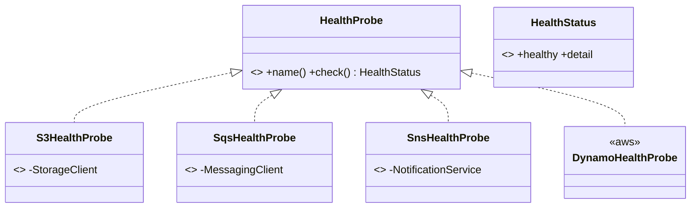

# cloud-sdk Enhancement Design — G7: cloud-sdk-Based Health Checks

| | |
|---|---|
| **Gap ID** | G7 |
| **Jira** | ION-12310 |
| **Feature branch** | `feature/ION-12310-cloudsdk-g7-cloud-sdk-health-checks` (off `feature/ION-12310-commons-cloudsdk-refactoring`) |
| **Modules touched** | `cloud-sdk-api` (probe interface), `cloud-sdk-aws` (probe impls over injected clients) |
| **Compatibility** | Additive only — all new types |
| **Date** | 2026-06-01 |

## 1. Gap reference & sources

- appianway master gap list: `shared/docs/2026-05-31-shared-aws2x-upgrade-plan-copilot.md` §11 (G7).
- Full spec: `shared/docs/2026-05-31-shared-aws2x-upgrade-DESIGN.md` §1A.6 (G7).

## 2. Problem statement

appianway's `shared` health indicators currently construct their **own AWS v1 clients** (`*ClientBuilder.defaultClient()`) to probe S3/SQS/SNS/(DynamoDB). On cloud-sdk they need lightweight read/write health probes built on the **injected cloud-sdk-api clients**, so health checks stop creating parallel v1 clients and use the same v2 client graph as the rest of the service.

## 3. Current state in cloud-sdk

- cloud-sdk exposes `StorageClient`, `MessagingClient`, `NotificationService`, `DatabaseRepository` (and AWS-side factories), but provides **no** health-probe helpers.
- Dropwizard's `com.codahale.metrics.health.HealthCheck` is the integration point on the consumer side; cloud-sdk should provide engine-agnostic probes (no hard Dropwizard dependency in `cloud-sdk-api`), and the consumer wraps them in a `HealthCheck`.

## 4. Proposed design

### 4.1 `cloud-sdk-api` — engine-agnostic probe contract

```java
// health/HealthProbe.java
public interface HealthProbe {
    String name();
    HealthStatus check();   // does a cheap read (or optional read/write) against the service
}
// health/HealthStatus.java — record(boolean healthy, String detail)
public record HealthStatus(boolean healthy, String detail) {
    public static HealthStatus healthy() { return new HealthStatus(true, "OK"); }
    public static HealthStatus unhealthy(String d) { return new HealthStatus(false, d); }
}
```

### 4.2 `cloud-sdk-aws` — probes over injected clients

- `S3HealthProbe(StorageClient, bucket)` → `bucketExists(bucket)` (read-only, cheap).
- `SqsHealthProbe(MessagingClient, queueUrl)` → `getQueueAttributes(queueUrl)`.
- `SnsHealthProbe(NotificationService, topicArn)` → topic attributes/`getTopicAttributes` (read-only).
- `DynamoHealthProbe(DatabaseRepository or DynamoDbClient, table)` → `describeTable`/`exists`-style read.
- All take the **already-injected** cloud-sdk client (no `defaultClient()` construction); each maps SDK exceptions to `HealthStatus.unhealthy(detail)` and never throws. Optional read/write variant for S3/SQS where appianway wants a write probe, guarded by a flag.



### 4.3 Consumer wiring (documentation)

appianway's `HealthCheckRegistrar` wraps each `HealthProbe` in a Dropwizard `HealthCheck`:

```java
register("s3", new HealthCheck() {
    protected Result check() {
        HealthStatus s = s3Probe.check();
        return s.healthy() ? Result.healthy() : Result.unhealthy(s.detail());
    }
});
```

## 5. API-compatibility analysis

- All new types; nothing existing changes. No Dropwizard dependency added to `cloud-sdk-api`. Additive/binary-compatible.

## 6. Maven / dependency changes

None — probes use existing injected cloud-sdk clients and their existing v2 SDK deps. No OWASP impact.

## 7. Test plan (JUnit 5 + Mockito + AssertJ)

- One test per probe: mocked client returns OK → `healthy()`; throws SDK exception → `unhealthy(detail)`, never propagates. Read/write probe variant asserted where provided.

## 8. Rollout / back-out

- Additive. appianway re-points `HealthCheckRegistrar` to these probes, dropping its v1 `defaultClient()` checks.
- Back-out: remove the `health` packages; no consumer break.
